# 保密系统的通信理论*

作者：C. E. 香农

* 本文内容最初出现在一份日期为1945年9月1日的机密报告《密码学的数学理论》中，该报告现已解密。

1 香农，C. E.，《通信的数学理论》，《贝尔系统技术期刊》，1948年7月，第379页；1948年10月，第623页。
2 参见，例如，H. F. Gaines，《初等密码分析》，或 M. Givierge，《密码学课程》。

# 1. 引言与概要

密码学与保密系统的问题为通信理论提供了一个有趣的应用。本文发展了一套保密系统的理论。研究在理论层面进行，旨在补充标准密码学著作中的处理方法。在标准著作中，详细研究了多种标准类型的密码，以及破解它们的方法。我们将更关注保密系统的一般数学结构与性质。

本文的处理方式在某些方面有限制。首先，保密系统有三种一般类型：(1) 隐藏系统，包括诸如隐形墨水、将信息隐藏在无害文本中、或假装的覆盖密文中、或其它使信息存在性对敌方隐蔽的方法；(2) 隐私系统，例如语音倒频，需要特殊设备才能恢复信息；(3) “真正”的保密系统，其中信息的含义通过密码、代码等被隐藏，尽管其存在性未被隐藏，且假设敌方拥有任何拦截和记录传输信号所需的特殊设备。我们只考虑第三种类型——隐藏系统主要是一个心理学问题，而隐私系统是一个技术问题。

其次，处理限于离散信息的情况，其中要加密的信息由一系列离散符号组成，每个符号选自一个有限集合。这些符号可能是一种语言中的字母、一种语言中的单词、“量化”语音或视频信号的幅度等级等，但主要的强调和思考集中在字母的情况。

本文分为三部分。主要结果现在将简要总结。第一部分处理保密系统的基本数学结构。如同在通信理论中，一种语言被视为

由一个随机过程表示，该过程根据某种概率系统产生一个离散的符号序列。与一种语言相关联，有一个参数 $D$，我们称之为语言的**冗余度**。 $D$ 在某种意义上衡量了语言中的文本在不丢失任何信息的情况下可以缩减的长度。作为一个简单的例子，由于在英语单词中 $u$ 总是跟在 $q$ 后面，$u$ 可以省略而不损失信息。由于语言的统计结构、某些字母或单词的高频出现等原因，英语可以实现相当大的缩减。冗余度在研究保密系统时至关重要。

保密系统被抽象地定义为一组从一个空间（可能信息的集合）到第二个空间（可能密文的集合）的变换。集合中的每个特定变换对应于使用一个特定密钥进行加密。假设变换是可逆的（非奇异的），以便在已知密钥时可以进行唯一的解密。

假设每个密钥以及因此每个变换都有一个与之关联的先验概率——选择该密钥的概率。类似地，假设每个可能的信息有一个关联的先验概率，由底层的随机过程决定。这些针对各种密钥和信息的概率实际上是敌方密码分析家对于所讨论选择的先验概率，并代表他对情况的先验知识。

要使用该系统，首先选择一个密钥并发送到接收点。密钥的选择决定了构成该系统的变换集合中的一个特定变换。然后选择一个信息，并将对应于所选密钥的特定变换应用于该信息以产生密文。该密文通过信道传输到接收点，并可能被“敌方”拦截。在接收端，应用该特定变换的逆变换到密文以恢复原始信息。

如果敌方拦截了密文，他可以从密文中计算各种可能的信息和可能产生此密文的密钥的后验概率。这组后验概率构成了他在拦截后对密钥和信息的了解。“知识”因此被识别为一组具有关联概率的命题。后验概率的计算是密码分析的广义问题。

作为这些概念的一个例子，在一个具有随机密钥的简单替换密码中，有 26! 种变换，对应于我们可以替换 26 个不同字母的 26! 种方式。这些可能性都是等可能的，因此每个的先验概率为 $1/26!$。如果这应用于“正常英语”，并且假设密码分析家除了知道信息源产生英语文本外，对信息源没有其它了解，那么长度为 $N$ 的各种信息的先验概率仅仅是它们在正常英语文本中的相对频率。

如果敌方在该系统中拦截了 $N$ 个字母的密文，他的概率会改变。如果 $N$ 足够大（比如 50 个字母），通常只有一个信息的后验概率接近 1，而所有其它的总概率接近零。因此密文存在一个本质上是唯一的“解”。对于较小的 $N$（比如 $N = 15$），通常会有许多概率相当的信息和密钥，没有一个接近 1。在这种情况下，密文有多个“解”。

以这种方式将保密系统表示为将一组元素变换为另一组元素的变换集合，存在两种自然的组合操作，可以从两个给定系统产生第三个系统。第一种组合操作称为**乘积操作**，对应于先用第一个保密系统 $R$ 加密信息，再用第二个系统 $S$ 加密得到的密文，$R$ 和 $S$ 的密钥是独立选择的。这个总操作是一个保密系统，其变换由 $S$ 中的变换与 $R$ 中的变换的所有乘积（按通常的变换乘积意义）组成。概率是两个变换概率的乘积。

第二种组合操作是“加权加法”。

$$
T = p R + q S \quad p + q = 1
$$

它对应于一个初步选择，决定是以概率 $p$ 和 $q$ 分别使用系统 $R$ 还是 $S$。完成后，按原定义使用 $R$ 或 $S$。

研究表明，具有这两种组合操作的保密系统本质上形成了一个“线性结合代数”和一个单位元，这是一种已被数学家广泛研究的代数簇。

在许多可能的保密系统中，有一种类型具有许多特殊性质。这种类型我们称之为“纯”系统。如果一个系统所有密钥等可能，并且对于集合中任意三个变换 $T_{i}, T_{j}, T_{k}$，乘积

$$
T _ {t} T _ {j} ^ {- 1} T _ {k}
$$

也是集合中的一个变换，则该系统是纯的。即用任意三个密钥进行加密、解密和再加密，必须等价于用某个密钥加密。

对于一个纯密码，研究表明所有密钥本质上是等价的——它们都导致相同的 $a$ 后验概率集合。此外，当拦截到给定的密文时，存在一组可能产生此密文的信息（一个“剩余类”），并且该类中信息的 $a$ 后验概率与 $a$ 先验概率成正比。敌方通过拦截密文获得的所有信息就是对该剩余类的限定。许多常见的密码是纯系统，包括具有随机密钥的简单替换。在这种情况下，剩余类由所有与拦截密文具有相同字母重复模式的信息组成。

如果存在一个具有逆 $A^{-1}$ 的固定变换 $A$，使得

$$
R = A S
$$

则定义两个系统 $R$ 和 $S$ 是“相似的”。

如果 $R$ 和 $S$ 相似，则可以在产生的密文之间建立一一对应关系，导致相同的后验概率。这两个系统在密码分析上是相同的。

本文第二部分处理“理论保密性”问题。当敌方拥有无限的时间和人力用于分析拦截的密文时，一个系统对抗密码分析的安全性如何？这个问题与噪声存在下的通信问题密切相关，为通信问题发展的熵和含糊度概念在这一部分的密码学中找到了直接应用。

“完美保密”的定义要求一个系统在敌方拦截密文后，该密文代表各种信息的 $a$ 后验概率与拦截前相同信息的 $a$ 先验概率完全相同。研究表明完美保密是可能的，但如果信息数量有限，则需要相同数量的可能密钥。如果信息被认为以给定的“速率” $R$（将在后面定义）不断产生，则密钥必须以相同或更高的速率产生。

如果使用具有有限密钥的保密系统，并且拦截了 $N$ 个字母的密文，对于敌方来说，将存在一组具有一定概率的信息，该密文可以代表这些信息。随着 $N$ 的增加，范围通常会缩小，直到最终密文存在唯一的“解”；一个概率本质上为 1 的信息，而所有其它信息实际上为零。定义一个量 $H(N)$，称为**含糊度**，它以统计方式衡量平均 $N$ 个字母的密文接近唯一解的程度；即敌方在拦截 $N$ 个字母的密文后对原始信息的不确定性。推导出含糊度的各种性质——例如，密钥的含糊度从不随 $N$ 增加而增加。这个含糊度是一个理论保密性指标——理论在于它允许敌方用无限时间分析密文。

确定了一种称为**随机密码**的理想化密码类型的函数 $H(N)$。经过某些修改，该函数可以应用于许多实际感兴趣的情况。这提供了一种近似计算需要多少拦截材料才能获得保密系统解的方法。从这一分析来看，对于普通语言和通常类型的密码（不是代码），这个“唯一解距离”大约是 $H(K) / D$。这里 $H(K)$ 是一个衡量密钥空间“大小”的数字。如果所有密钥先验等可能，$H(K)$ 是可能密钥数量的对数。$D$ 是语言的冗余度，衡量语言施加的“统计约束”量。在具有随机密钥的简单替换中，$H(K)$ 是 $\log_{10} 26!$，约为 20，而英语的 $D$（以每字母十进制数字计）约为 .7。因此唯一解出现在大约 30 个字母处。

对于某些“语言”，可以构造具有有限密钥的保密系统，其中当 $N \to \infty$ 时，含糊度不趋近于零。在这种情况下，无论拦截多少材料，敌方仍然得不到密码的唯一解，而是留下许多合理概率的替代方案。我们称这样的系统为**理想系统**。在任何语言中，都有可能近似这种行为——即，使 $H(N)$ 趋近于零的过程推迟到任意大的 $N$。然而，这样的系统有一些缺点，例如复杂性以及对密文传输错误的敏感性。

本文第三部分涉及“实际保密性”。两个具有相同密钥大小的系统，在拦截 $N$ 个字母后可能都是唯一可解的，但在实现此解所需的工作量上差异很大。分析了保密系统的基本弱点。这引出了构造需要大量工作才能破解的系统的方法。最后，讨论了保密系统各种理想品质之间的某种不相容性。

# 第一部分

# 保密系统的数学结构

# 2. 保密系统

作为密码学数学分析的第一步，有必要适当地理想化情况，并以数学上可接受的方式定义我们所说的保密系统。一般保密系统的“示意”图如图 1 所示。在发送端

有两个信息源——信息源和密钥源。密钥源从系统中可能的那些密钥中产生一个特定密钥。该密钥通过某种假设不可拦截的方式（例如通过信使）传输到接收端。信息源产生一个信息（“明文”），该信息被加密，产生的密文通过可能被拦截的方式（例如无线电）发送到接收端。在接收端，密文和密钥在解密器中结合以恢复信息。

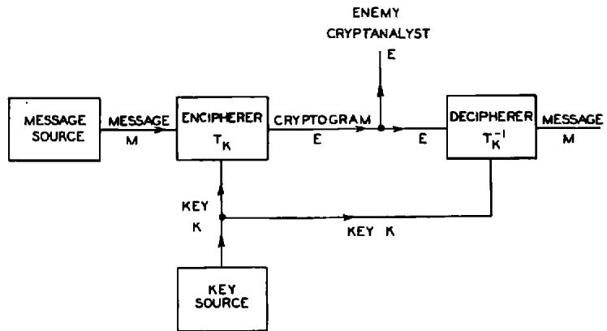

图 1—一般保密系统示意图。

显然，加密器执行一个函数操作。如果 $M$ 是信息，$K$ 是密钥，$E$ 是加密后的信息或密文，我们有

$$
E = f (M, K)
$$

即 $E$ 是 $M$ 和 $K$ 的函数。然而，最好将其视为一个（单参数）操作或变换族，并写成

$$
E = T _ {i} M。
$$

变换 $T_{i}$ 应用于信息 $M$ 产生密文 $E$。索引 $i$ 对应于正在使用的特定密钥。

我们通常假设只有有限数量的可能密钥，并且每个密钥都有一个关联的概率 $p_i$。因此，密钥源由一个统计过程或设备表示，该过程或设备以各自的概率 $p_1, p_2, \dots, p_m$ 从变换集合 $T_1, T_2, \dots, T_m$ 中选择一个。类似地，我们通常假设有有限数量的可能信息 $M_1, M_2, \dots, M_n$，并具有关联的先验概率 $q_1, q_2, \dots, q_n$。例如，可能的信息可能是长度为 $N$ 的所有可能的英文字母序列，而关联的概率则是这些序列在正常英语文本中出现的相对频率。

在接收端，必须能够根据 $E$ 和 $K$ 恢复 $M$。因此，族中的变换 $T_{i}$ 必须具有唯一的逆 $T_{i}^{-1}$，使得 $T_{i}T_{i}^{-1} = I$，即恒等变换。因此：

$$
M = T _ {i} ^ {- 1} E。
$$

总之，这个逆必须对于每个能够用密钥 $i$ 从 $M$ 获得的 $E$ 唯一存在。因此我们得出定义：一个**保密系统**是一族唯一可逆变换 $T_{i}$，将一个可能信息的集合变换为一个密文集合，变换 $T_{i}$ 具有关联的概率 $p_{i}$。反之，任何这种类型的实体集合都将被称为“保密系统”。为了方便，可能信息的集合将被称为“信息空间”，可能密文的集合被称为“密文空间”。

如果两个保密系统由相同的变换集合 $T_{i}$ 组成，具有相同的信息和密文空间（值域和定义域）以及相同的密钥概率，则它们是相同的。

保密系统可以机械地可视化为一个带有一个或多个控制器的机器。一个字母序列，即信息，被送入机器的输入端，第二个序列出现在输出端。控制器的特定设置对应于正在使用的特定密钥。必须规定某种统计方法来从所有可能的密钥中选择密钥。

为了使问题在数学上易于处理，我们将假设敌方知道正在使用的系统。也就是说，他知道变换族 $T_{i}$ 以及选择各种密钥的概率。可能有人反对说这个假设不现实，因为密码分析家通常不知道使用了什么系统或所讨论的概率。对此有两个回答：

1.  由于我们对什么构成保密系统的广义定义，这个限制比初看起来要弱得多。假设一个密码分析家拦截了一个信息，不知道是使用了替换密码、置换密码还是维吉尼亚型密码。他可以认为该信息是由这样一个系统加密的：密钥的一部分指定了使用这些类型中的哪一种，下一部分是那种类型的特定密钥。根据他对加密者使用相应类型密码的先验概率的最佳估计，为这三种不同的可能性分配概率。

2.  这个假设实际上是密码学研究通常使用的假设。它是悲观的，因此是安全的，但从长远来看是现实的，因为人们必须预期他的系统最终会被发现。因此，即使设计了一个全新的系统，使得敌方在未自行发现的情况下无法为其分配任何先验概率，人们仍然必须生活在他最终会知道的预期中。

这种情况类似于博弈论3中出现的情况，其中假设对手“发现”了正在使用的策略。在这两种情况下，该假设都用于清晰地描述对手的知识。

对我们保密系统定义的第二个可能反对意见是没有考虑在信息中插入空字符和使用多重替代的常见做法。在这种情况下，对于给定的信息和密钥，没有唯一的密文，但加密者可以随意从多个不同的密文中选择。这种情况可以处理，但在目前阶段只会增加复杂性，而不会实质上改变任何基本结果。

如果信息是由 (1) 中描述的马尔可夫过程产生的，用来表示信息源，那么各种信息的概率由马尔可夫过程的结构决定。然而，目前我们希望从更一般的角度看待情况，将信息仅仅视为具有关联概率的抽象实体集合，不一定由字母序列组成，也不一定由马尔可夫过程产生。

应该强调的是，贯穿全文，保密系统指的不仅仅是一个变换，而是许多变换的集合。选择密钥后，只使用这些变换中的一个，人们可能会由此将保密系统定义为语言上的单个变换。然而，敌方不知道选择了哪个密钥，那些“可能”的密钥对他与实际密钥一样重要。事实上，正是这些其他可能性的存在赋予了系统任何保密性。由于保密性是我们的主要兴趣，我们被迫接受上述相当复杂的保密系统概念。这种可能性与实际情况一样重要的情况，在策略游戏中经常出现。国际象棋游戏的进程很大程度上受到未实施的威胁的控制。博弈论中未实现归责的“虚拟存在”也有些类似。

可以注意到，语言上的单个操作根据我们的定义形成一种退化类型的保密系统——一个只有一个单位概率密钥的系统。这样的系统没有保密性——密码分析家通过对拦截的密文应用系统中唯一的变换（即逆变换）来找到信息。在这种情况下，解密者和密码分析家拥有相同的信息。一般来说，解密者的知识与敌方密码分析家的知识之间的唯一区别是解密者知道正在使用的特定密钥，而密码分析家只知道集合中各种密钥的先验概率。解密过程是将加密中使用的特定变换的逆应用于密文。密码分析的过程是尝试仅根据密文以及各种密钥和信息的先验概率来确定信息（或特定密钥）。

与保密理论，或实际上与任何涉及概率问题（特别是先验概率、贝叶斯定理等）应用于物理情况的理论相关的认识论问题有很多。抽象地处理，概率论可以基于现代测度论方法放在一个严格的逻辑基础上。[45] 然而，当应用于物理情况，特别是涉及“主观”概率和不可重复实验时，存在许多逻辑有效性问题。例如，在本文采用的保密方法中，假设敌方密码分析家知道各种密钥和信息的先验概率——如何根据他对情况的了解，在操作上确定他的估计是否正确？

人们可以构造“瓮和骰子”类型的人工密码学情景，其中先验概率具有明确且无歧义的含义，并且这里使用的理想化当然是合适的。在人们可以想象的其它情况下，例如火星入侵者之间拦截的通信，先验概率可能会如此不确定以至于没有意义。大多数实际的密码学情况介于这些极限之间。密码分析家可能愿意将可能的信息分类为“合理的”、“可能但不太可能”和“不合理的”，但认为更细的划分没有意义。

幸运的是，在实际情况下，只有密钥和信息先验概率的极端错误才会导致重要参数的显著错误。这是因为信息和密文数量的指数行为以及所采用的对数度量。

3 参见 J. von Neumann 和 O. Morgenstern，《博弈论与经济行为》，普林斯顿，1947 年。

# 3. 系统的表示

如上定义的保密系统可以用各种方式表示。一种便于说明的方式是线图，如图 2 和 4。可能的信息由左侧的点表示，可能的密文由右侧的点表示。如果某个密钥，比如密钥 1，将信息 $M_{2}$ 变换为密文 $E_{4}$，那么 $M_{2}$ 和 $E_{4}$ 由一条标为 1 的线连接

4 参见 J. L. Doob，《作为测度的概率》，《数学统计年鉴》，第 12 卷，1941 年，第 206-214 页。

5 A. Kolmogoroff，《概率论基础》，《数学成果》，第 2 卷，第 3 期（柏林，1933 年）。

从每个可能的信息出发，对于每个不同的密钥，必须恰好有一条线引出。如果每个密文也是如此，我们将说该系统是封闭的。

描述系统的更常见方式是陈述对信息执行的、针对任意密钥以获得密文的操作。类似地，通过描述如何选择密钥或我们对敌方密钥选择习惯的了解，隐式地定义了各种密钥的概率。通过陈述我们对敌方语言习惯、战术情况（这将影响信息的可能内容）以及我们可能拥有的关于密文的任何特殊信息的先验知识，隐式地确定了信息的概率。

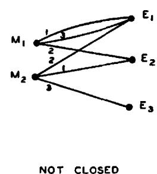

图 2—简单系统的线图。

# 4. 保密系统的一些例子

本节将给出一些密码的例子。这些在本文的其余部分将经常被引用以作说明。

# 1. 简单替换密码。

在这种密码中，信息的每个字母被一个固定的替代字母（通常也是一个字母）替换。因此信息，

$$
M = m _ {1} m _ {2} m _ {3} m _ {4} \dots
$$

其中 $m_{1}, m_{2}, \cdots$ 是连续的字母，变为：

$$
\begin{array}{l} E = e _ {1} e _ {2} e _ {3} e _ {4} \dots \\ = f (m _ {1}) f (m _ {2}) f (m _ {3}) f (m _ {4}) \dots \\ \end{array}
$$

其中函数 $f(m)$ 是一个具有逆函数的函数。密钥是字母表的一个排列（当替代字母是字母时），例如 $X G U A C D T B F H R S L M Q V Y Z W I E J O K N P$。第一个字母 $X$ 是 $A$ 的替代，$G$ 是 $B$ 的替代，等等。

# 2. 置换（固定周期 $d$）。

信息被分成 $d$ 长度的组，并对第一组应用一个排列，对第二组应用相同的排列，等等。该排列就是密钥，可以用前 $d$ 个整数的排列来表示。因此，对于 $d = 5$，我们可能有排列 23154。这意味着：

$$
m _ {1} m _ {2} m _ {3} m _ {4} m _ {5} m _ {6} m _ {7} m _ {8} m _ {9} m _ {1 0} \dots \text {b e c o m e s}
$$

$$
m _ {2} m _ {3} m _ {1} m _ {5} m _ {4} m _ {7} m _ {8} m _ {6} m _ {1 0} m _ {9} \dots .
$$

顺序应用两个或多个置换将被称为复合置换。如果周期是 $d_1, d_2, \dots, d_s$，显然结果是周期为 $d$ 的置换，其中 $d$ 是 $d_1, d_2, \dots, d_s$ 的最小公倍数。

# 3. 维吉尼亚及其变体。

在维吉尼亚密码中，密钥由一系列 $d$ 个字母组成。这些字母重复写在信息下方，然后将两者模 26 相加（将字母表编号从 $A = 0$ 到 $Z = 25$）。因此

$$
e _ {i} = m _ {i} + k _ {i} (\text {m o d} 2 6)
$$

其中 $k_i$ 的周期为 $d$。例如，对于密钥 $G \wedge H$，我们得到

$$
m e a s g a \quad N O W I S T H E \dots
$$

$$
\text {重复密钥} \quad G A H G A H G A \dots
$$

$$
\text {密文} \quad T O D O S A N E \dots
$$

周期为 1 的维吉尼亚被称为凯撒密码。它是一种简单替换，其中 $M$ 的每个字母在字母表中前进一个固定的量。这个量就是密钥，可以是 0 到 25 之间的任何数字。所谓的博福特和变体博福特与维吉尼亚类似，通过以下方程加密

$$
e _ {i} = k _ {i} - m _ {i} (\text {m o d} 2 6)
$$

和

$$
e _ {i} = m _ {i} - k _ {i} (\text {m o d} 2 6)
$$

分别。周期为 1 的博福特被称为反向凯撒密码。

顺序应用两个或多个维吉尼亚将被称为复合维吉尼亚。其方程为

$$
e _ {i} = m _ {i} + k _ {i} + l _ {i} + \dots + s _ {i} (\text {m o d} 2 6)
$$

其中 $k_{i}, l_{i}, \dots, s_{i}$ 通常具有不同的周期。它们的和，

$$
k _ {i} + l _ {i} + \dots + s _ {i}
$$

的周期，如同复合置换一样，是各个周期的最小公倍数。

当维吉尼亚与一个从不重复的无限密钥一起使用时，我们就有了维纳姆系统，$^6$ 其中

$$
e _ {i} = m _ {i} + k _ {i} (\text {m o d} 2 6)
$$

$k_{i}$ 在 0, 1, $\cdots$ , 25 中随机且独立地选择。如果密钥是有意义的文本，我们就有了“滚动密钥”密码。

# 4. 双字母组、三字母组和 $N$ 字母组替换。

可以替换双字母组、三字母组等，而不是替换单个字母。一般的双字母组替换需要一个由 $26^2$ 个双字母组排列组成的密钥。它可以由一个表格表示，其中行对应于双字母组的第一个字母，列对应于第二个字母，表格中的条目是替代字母（通常也是双字母组）。

# 5. 单混合字母表维吉尼亚。

这是简单替换后接维吉尼亚。

$$
e _ {i} = f (m _ {i}) + k _ {i}
$$

$$
m _ {i} = f ^ {- 1} \left(e _ {i} - k _ {i}\right)
$$

该系统的“逆”是维吉尼亚后接简单替换

$$
e _ {i} = g \left(m _ {i} + k _ {i}\right)
$$

$$
m _ {i} = g ^ {- 1} \left(e _ {i}\right) - k _ {i}
$$

# 6. 矩阵系统。7

$n$ 字母组替换的一种方法是用一个具有逆矩阵的矩阵对连续的 $n$ 字母组进行操作。假设字母从 0 到 25 编号，使它们成为代数环的元素。对于信息的 $n$ 字母组 $m_1m_2 \cdots m_n$，矩阵 $a_{ij}$ 给出密文的 $n$ 字母组

$$
e _ {i} = \sum_ {j = 1} ^ {n} a _ {i j} m _ {j} \quad i = 1, \dots , n
$$

矩阵 $a_{ij}$ 是密钥，解密用逆矩阵执行。当且仅当行列式 $|a_{ij}|$ 在环中有一个逆元时，逆矩阵存在。

# 7. 普莱费尔密码。

这是一种特殊类型的双字母组替换，由一个混合的 25 字母表控制，写在一个 $5 \times 5$ 的方格中。（字母 $J$ 在密码学工作中经常被省略——它非常罕见，出现时可以用 $I$ 代替。）假设密钥方格如下所示：

$$
\begin{array}{c c c c c} L & Z & Q & C & P \\ A & G & N & O & U \\ R & D & M & I & F \\ K & Y & H & V & S \\ X & B & T & E & W \end{array}
$$

例如，双字母组 $AC$ 的替代字母是由 $A$ 和 $C$ 定义的矩形的另外两个角上的字母对，即 $LO$，先取 $L$，因为它在 $A$ 上面。如果双字母组字母在水平线上，如 $RI$，则使用它们右边的字母 $DF$；$RF$ 变为 $DR$。如果字母在垂直线上，则使用它们下面的字母。因此 $PS$ 变为 $UW$。如果字母相同，可以使用空字符分隔它们，或者可以省略一个，等等。

# 8. 多重混合字母表替换。

在这种密码中，有一组 $d$ 个简单替换，按顺序使用。如果周期 $d$ 为四

$$
m _ {1} m _ {2} m _ {3} m _ {4} m _ {5} m _ {6} \dots
$$

变为

$$
f _ {1} (m _ {1}) f _ {2} (m _ {2}) f _ {3} (m _ {3}) f _ {4} (m _ {4}) f _ {1} (m _ {5}) f _ {2} (m _ {6}) \dots
$$

# 9. 自动密钥密码。

一种维吉尼亚型系统，其中信息本身或产生的密文被用作“密钥”，称为自动密钥密码。加密以一个“启动密钥”（在我们看来是整个密钥）开始，然后继续使用被启动密钥长度位移的信息或密文，如下所示，其中启动密钥是 COMET。使用信息作为“密钥”：

<table><tr><td>信息</td><td>S E N D S U P P L I E S···</td></tr><tr><td>密钥</td><td>C O M E T S E N D S U P···</td></tr><tr><td>密文</td><td>U S Z H L M T C O A Y H</td></tr></table>

使用密文作为“密钥”：

<table><tr><td>信息</td><td>S E N D S U P P L I E S···</td></tr><tr><td>密钥</td><td>C O M E T U S Z H L O H···</td></tr><tr><td>密文</td><td>U S Z H L O H O S T S···</td></tr></table>

# 10. 分数密码。

在这些密码中，每个字母首先被加密成两个或更多字母或数字，然后这些符号以某种方式混合（例如通过置换）。结果然后可以重新翻译回原始字母表。因此，使用混合的 25 字母表作为密钥，我们可以通过下表将字母翻译成两位的五进制数：

<table><tr><td>0</td><td>1</td><td>2</td><td>3</td><td>4</td><td></td></tr><tr><td>0</td><td>L</td><td>Z</td><td>Q</td><td>CP</td><td></td></tr><tr><td>1</td><td>A</td><td>G</td><td>N</td><td>O</td><td>U</td></tr><tr><td>2</td><td>R</td><td>D</td><td>M</td><td>I</td><td>F</td></tr><tr><td>3</td><td>K</td><td>Y</td><td>H</td><td>V</td><td>S</td></tr><tr><td>4</td><td>X</td><td>B</td><td>T</td><td>E</td><td>W</td></tr></table>

因此 $B$ 变为 +1。在产生的数字序列以某种方式置换后，它们成对取出并翻译回字母。

# 11. 代码。

在代码中，单词（有时是音节）被替代字母组替换。有时会对结果应用某种密码。

# 5. 保密系统的评估

在估计一个提议的保密系统的价值时，应该应用一些不同的标准。其中最重要的是：

# 1. 保密量。

有些系统是完美的——敌方在拦截任何数量的材料后，其处境并不比之前更好。其它系统虽然给了他一些信息，但不会产生拦截密文的唯一“解”。在唯一可解的系统中，实现此解所需的工作量以及使该解唯一必须拦截的材料量存在很大差异。

# 2. 密钥大小。

密钥必须通过不可拦截的方式从发送点传输到接收点。有时它必须被记忆。因此，密钥越小越好。

# 3. 加密和解密操作的复杂性。

加密和解密当然应该尽可能简单。如果是手动完成的，复杂性会导致时间损失、错误等。如果是机械完成的，复杂性会导致庞大昂贵的机器。

# 4. 错误传播。

在某些类型的密码中，加密或传输中的一个字母错误会导致解密文本中出现大量错误。错误通过解密操作扩散，导致大量信息丢失和频繁需要重复发送密文。自然希望最小化这种错误扩散。

# 5. 信息扩展。

在某些类型的保密系统中，信息的规模因加密过程而增加。这种不希望的效果可以在试图通过添加许多空字符来淹没信息统计的系统中看到，或者在使用多重替代的系统中看到。它也出现在许多“隐藏”类型的系统中（这些通常不是我们定义意义上的保密系统）。

# 6. 保密系统的代数

如果我们有两个保密系统 $T$ 和 $R$，我们通常可以以各种方式组合它们以形成一个新的保密系统 $S$。如果 $T$ 和 $R$ 具有相同的定义域（信息空间），我们可以形成一种“加权和”，

$$
S = p T + q R
$$

其中 $p + q = 1$。这个操作包括首先以概率 $p$ 和 $q$ 进行初步选择，决定使用 $T$ 还是 $R$。这个选择是 $S$ 密钥的一部分。确定之后，按原定义使用 $T$ 或 $R$。$S$ 的总密钥必须指定使用了 $T$ 和 $R$ 中的哪一个，以及使用了 $T$（或 $R$）的哪个密钥。

如果 $T$ 由变换 $T_{1}, \dots, T_{m}$ 组成，概率为 $p_{1}, \dots, p_{m}$，$R$ 由 $R_{1}, \dots, R_{k}$ 组成，概率为 $q_{1}, \dots, q_{k}$，那么 $S = pT + qR$ 由变换 $T_{1}, T_{2}, \dots, T_{m}, R_{1}, \dots, R_{k}$ 组成，概率分别为 $pp_{1}, pp_{2}, \dots, pp_{m}, qq_{1}, qq_{2}, \dots, qq_{k}$。

更一般地，我们可以形成多个系统的和。

$$
S = p _ {1} T + p _ {2} R + \dots + p _ {m} U ^ {\prime} \quad \sum p _ {i} = 1
$$

我们注意到任何系统 $T$ 都可以写成固定操作的和

$$
T = p _ {1} T _ {1} + p _ {2} T _ {2} + \dots + p _ {m} T _ {m}
$$

$T_{i}$ 是 $T$ 的一个确定的加密操作，对应于具有概率 $p_i$ 的密钥选择 $i$。

组合两个保密系统的第二种方式是取“乘积”，如图 3 所示。假设 $T$ 和 $R$ 是两个系统，并且 $R$ 的定义域（语言空间）可以识别为 $T$ 的值域（密文空间）。那么我们可以先对语言应用 $T$，然后对加密过程的结果应用 $R$。

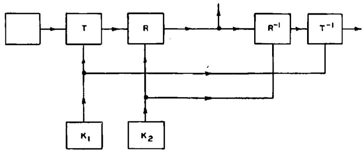

图 3—两个系统的乘积 $S = RT$。

这得到一个结果操作 $S$，我们将其写为乘积

$$
S = R T
$$

$S$ 的密钥由 $T$ 和 $R$ 的密钥组成，假设这些密钥是根据它们的原始概率独立选择的。因此，如果 $T$ 的 $m$ 个密钥以概率选择

$$
p _ {1} p _ {2} \dots p _ {m}
$$

而 $R$ 的 $n$ 个密钥具有概率

$$
p _ {1} ^ {\prime} p _ {2} ^ {\prime} \dots p _ {n} ^ {\prime},
$$

那么 $S$ 至多有 $mn$ 个密钥，概率为 $p_i p_j'$。在许多情况下，一些乘积变换 $R_i T_j$ 将是相同的，可以组合在一起，并加上它们的概率。

乘积加密经常使用；例如，先进行替换再进行置换，或先进行置换再进行维吉尼亚，或者对文本应用代码，然后通过替换、置换、分数化等进行加密。

可以注意到，乘法通常不可交换（我们并不总是有 $RS = SR$），尽管在特殊情况下，如替换和置换，它是可交换的。由于它代表一个操作，它在定义上是结合的。即 $R(ST) = (RS)T = RST$。此外，我们有规律

$$
p \left(p ^ {\prime} T + q ^ {\prime} R\right) + q S = p p ^ {\prime} T + p q ^ {\prime} R + q S
$$

（加法的加权结合律）

$$
T (p R + q S) = p T R + q T S
$$

$$
(p R + q S) T = p R T + q S T
$$

（右分配律和左分配律）以及

$$
p _ {1} T + p _ {2} T + p _ {3} R = \left(p _ {1} + p _ {2}\right) T + p _ {3} R
$$

应该强调的是，这些加法和乘法的组合操作应用于作为一个整体的保密系统。两个系统 $TR$ 的乘积不应与系统中变换的乘积 $T_{i}R_{j}$ 混淆，后者在本文中也经常出现。前者 $TR$ 是一个保密系统，即一组具有关联概率的变换；后者是一个特定的变换。此外，两个系统 $pR + qT$ 的和是一个系统——两个变换的和没有定义。系统 $T$ 和 $R$ 可以交换，而单个 $T_{i}$ 和 $R_{j}$ 可能不交换，例如，如果 $R$ 是给定周期的博福特系统，所有密钥等可能，

$$
R _ {i} R _ {j} \rightleftharpoons R _ {j} R _ {i}
$$

一般来说，但当然 $RR$ 不依赖于其顺序；实际上

$$
R R = V
$$

即具有随机密钥的相同周期的维吉尼亚。另一方面，如果两个系统 $T$ 和 $R$ 的单个 $T_{i}$ 和 $R_{j}$ 交换，则系统交换。

其 $M$ 和 $E$ 空间可以识别的系统（当字母序列变换为字母序列时非常常见）可以称为**内构的**。一个内构系统 $T$ 可以提升到幂 $T^n$。

一个满足与其自身的乘积等于其自身的保密系统 $T$，即满足

$$
T T = T,
$$

将被称为**幂等的**。例如，简单替换、周期为 $p$ 的置换、周期为 $p$ 的维吉尼亚（所有密钥等可能）都是幂等的。

在固定信息空间中定义的所有内构保密系统的集合构成了一个“代数簇”，即一种代数，使用加法和乘法运算。事实上，我们讨论过的加法和乘法的性质可以总结如下：

具有相同信息空间和加权加法与乘法这两种组合操作的内构密码集合形成一个具有单位元的线性结合代数，除了加权加法中的系数必须非负且和为 1。

组合操作为我们从某些系统（如给出的例子）构造许多新类型的保密系统提供了方法。我们也可以用它们来描述密码分析家在尝试破解未知类型的密文时所面临的情况。事实上，他正在解决一个类型的保密系统

$$
T = p _ {1} A + p _ {2} B + \dots + p _ {r} S + p ^ {\prime} X \quad \sum p = 1
$$

其中 $A, B, \cdots, S$ 是已知类型的密码，$p_i$ 是它们在此情况下的先验概率，$p'X$ 对应于可能存在全新的未知类型密码。

# 7. 纯密码与混合密码

某些类型的密码，如简单替换、给定周期的置换、给定周期的维吉尼亚、混合字母表维吉尼亚等（所有密钥等可能）在密钥方面具有某种同质性。无论使用什么密钥，加密、解密和破译过程本质上都是相同的。这与密码

$$
p S + q T
$$

形成对比，其中 $S$ 是简单替换，$T$ 是给定周期的置换。在这种情况下，整个系统对于加密、解密和解密都会改变，取决于使用的是替换还是置换。

这些系统中的同质性源于群性质——我们注意到，在上述同质密码的例子中，集合中任意两个变换的乘积 $T_{i}T_{j}$ 等于集合中的第三个变换 $T_{k}$。另一方面，$T_{i}S_{j}$ 不等于密码

$$
p S + q T
$$

中的任何变换，该密码只包含替换和置换，没有乘积。

那么，我们可以将“纯”密码定义为其 $T_{i}$ 构成一个群的密码。然而，这限制性太强，因为它要求 $E$ 空间与 $M$ 空间相同，即系统是内构的。分数置换与普通置换一样同质，但不是内构的。正确的定义如下：一个密码 $T$ 是纯的，如果对于每个 $T_{i}, T_{j}, T_{k}$，存在一个 $T_{s}$ 使得

$$
T _ {i} T _ {j} ^ {- 1} T _ {k} = T _ {s}
$$

且每个密钥等可能。否则该密码是混合的。图 2 的系统是混合的。如果所有密钥等可能，图 4 是纯的。

**定理 1**：在一个纯密码中，将信息空间变换到其自身的操作 $T_{i}^{-1}T_{j}$ 构成一个群，其阶为 $m$，即不同密钥的数量。

因为

$$
T _ {j} ^ {- 1} T _ {k} T _ {k} ^ {- 1} T _ {j} = I
$$

所以每个元素都有逆。结合律成立，因为这些是操作，并且群性质由下式得出

$$
T _ {i} ^ {- 1} T _ {j} T _ {k} ^ {- 1} T _ {l} = T _ {s} ^ {- 1} T _ {k} T _ {k} ^ {- 1} T _ {l} = T _ {s} ^ {- 1} T _ {l}
$$

利用我们的假设 $T_{i}^{-1}T_{j} = T_{s}^{-1}T_{k}$ 对于某个 $s$。

操作 $T_{i}^{-1}T_{j}$ 意味着，当然，用密钥 $j$ 加密信息，然后用密钥 $i$ 解密，这使我们回到信息空间。如果 $T$ 是内构的，即 $T_{i}$ 本身将空间 $\Omega_{M}$ 变换到自身（大多数密码都是这种情况，其中信息空间和密文空间都由字母序列组成），并且 $T_{i}$ 构成一个群且等可能，那么 $T$ 是纯的，因为

$$
T _ {i} T _ {j} ^ {- 1} T _ {k} = T _ {i} T _ {r} = T _ {s}.
$$

**定理 2**：两个可交换的纯密码的乘积是纯的。

因为如果 $T$ 和 $R$ 可交换，对于每个 $i,j$ 存在合适的 $l,m$ 使得 $T_{i}R_{j} = R_{l}T_{m}$，并且

$$
\begin{array}{l} T _ {i} R _ {j} \left(T _ {k} R _ {l}\right) ^ {- 1} T _ {m} R _ {n} = T _ {i} R _ {j} R _ {l} ^ {- 1} T _ {k} ^ {- 1} T _ {m} R _ {n} \\ = R _ {u} R _ {v} ^ {- 1} R _ {w} T _ {r} T _ {s} ^ {- 1} T _ {t} \\ = R _ {h} T _ {\varrho}. \\ \end{array}
$$

然而，交换条件对于乘积是纯密码并非必要。

只有一个密钥的系统，即单个确定操作 $T_{1}$，是纯的，因为索引的唯一选择是

$$
T _ {1} T _ {1} ^ {- 1} T _ {1} = T _ {1}.
$$

因此，将一般密码展开为这种简单变换的和也将其表示为纯密码的和。

检查图 4 所示的纯密码示例揭示了某些性质。信息分成某些子集，我们称之为剩余类，并且可能的密文被划分为相应的剩余类。每个类中的每个信息到对应类中的每个密文至少有一条线，而在不对应的类之间没有线。类中信息的数量是总密钥数的一个除数。从一个信息 $M$ 到对应类中一个密文的“并行”线数等于密钥数除以包含该信息（或密文）的类中的信息数。附录中表明这些对于纯密码普遍成立。正式总结，我们有：

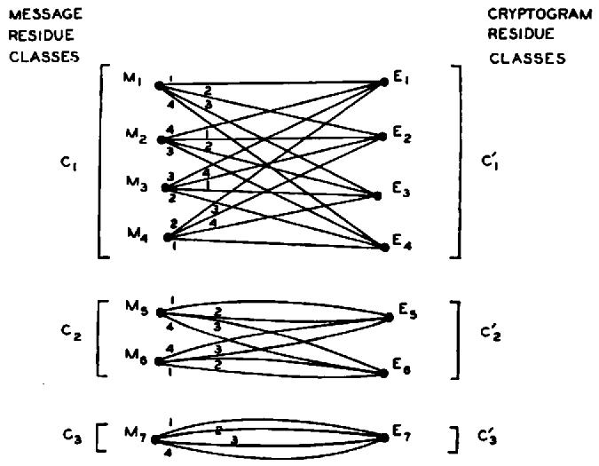

**纯系统**

图 4—纯系统。

**定理 3**：在一个纯系统中，信息可以划分为一组“剩余类” $C_1, C_2, \dots, C_s$，密文可以划分为一组对应的剩余类 $C_1', C_2', \dots, C_s'$，具有以下性质：

(1) 信息剩余类互斥且共同包含所有可能信息。密文剩余类类似。

(2) 用任何密钥加密 $C_i$ 中的任何信息会产生 $C_i'$ 中的密文。用任何密钥解密 $C_i'$ 中的任何密文会得到 $C_i$ 中的信息。

(3) $C_i$ 中的信息数，设为 $\varphi_i$，等于 $C_i'$ 中的密文数，并且是 $k$（密钥数）的一个除数。

(4) $C_i$ 中的每个信息可以通过恰好 $k / \varphi_i$ 个不同的密钥加密成 $C_i'$ 中的每个密文。解密类似。

纯密码概念的重要性（以及名称的原因）在于，在纯密码中，所有密钥本质上是相同的。无论对特定信息使用哪个密钥，所有信息的 $a$ 后验概率都是相同的。要理解这一点，请注意，对同一信息应用两个不同的密钥会导致同一剩余类（比如 $C_i'$）中的两个密文。因此，每个密文都可以用 $\frac{k}{\varphi_i}$ 个密钥解密成 $C_i$ 中的每个信息，而不能解密成任何其它可能信息。所有密钥等可能，因此各种信息的 $a$ 后验概率为

$$
P _ {E} (M) = \frac {P (M) P _ {M} (E)}{P (E)} = \frac {P (M) P _ {M} (E)}{\Sigma_ {M} P (M) P _ {M} (E)} = \frac {P (M)}{P \left(C _ {i}\right)}
$$

其中 $M$ 在 $C_i$ 中，$E$ 在 $C_i'$ 中，求和遍及 $C_i$ 中的所有信息。如果 $E$ 和 $M$ 不在对应的剩余类中，$P_E(M) = 0$。类似地，可以证明不同密钥的后验概率在数值上相同，但当使用不同密钥时，这些值与不同密钥相关联。同一组 $P_E(K)$ 值在密钥之间经历了排列。因此我们得到结果

**定理 4**：在一个纯系统中，各种信息 $P_{E}(M)$ 的后验概率与所选择的密钥无关。密钥 $P_{E}(K)$ 的后验概率数值相同，但随不同的密钥选择而发生排列。

粗略地说，我们可以说任何密钥选择在纯密码中都会导致相同的密码分析问题。由于不同的密钥都导致同一剩余类中的密文，这意味着同一剩余类中的所有密文在密码分析上是等价的——它们导致相同的信息后验概率，以及（除了排列外）相同的密钥概率。

作为一个例子，所有密钥等可能的简单替换是一个纯密码。对应于给定密文 $E$ 的剩余类是可以通过操作 $T_{j}T_{k}^{-1}E$ 从 $E$ 获得的所有密文的集合。在这种情况下，$T_{j}T_{k}^{-1}$ 本身就是一个替换，因此对 $E$ 的任何替换都会产生同一剩余类的另一个成员。因此，如果密文是

$$
E = X C P P G C F Q,
$$

那么

$$
E _ {1} = R D H H G D S N
$$

$$
E _ {2} = A B C C D B E F
$$

等等，都在同一剩余类中。显然在这种情况下这些密文本质上是等价的。在具有随机密钥的简单替换中，重要的是字母重复的模式，实际的字母是哑变量。事实上，我们可能完全不用它们，将 $E$ 中的重复模式表示如下：

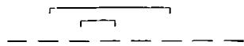

这种表示法描述了剩余类，但消除了关于类中特定成员的所有信息。因此，它留下的正是密码分析相关的信息。这与攻击简单替换密码的一种方法——模式词方法有关。

在凯撒型密码中，只有密文的模 26 一阶差分是重要的。具有相同 $\Delta e_i$ 的两个密文属于同一剩余类。通过简单的过程破解此密码：写下信息剩余类的 26 个成员，并挑出有意义的那一个。

周期为 $d$ 且具有随机密钥的维吉尼亚是纯密码的另一个例子。这里的信息剩余类由所有与密文具有相同一阶差分的序列组成，对于相隔距离 $d$ 的字母。对于 $d = 3$，剩余类由下式定义

$$
\begin{array}{l} m _ {1} - m _ {4} = e _ {1} - e _ {4} \\ m _ {2} - m _ {5} = e _ {2} - e _ {5} \\ m _ {3} - m _ {6} = e _ {3} - e _ {6} \\ m _ {4} - m _ {7} = e _ {4} - e _ {7} \\ \end{array}
$$

.

.

.

其中 $E = e_1, e_2, \dots$ 是密文，$m_1, m_2, \dots$ 是对应剩余类中的任何 $M$。

在具有随机密钥的周期 $d$ 置换密码中，剩余类由 $e_i$ 的所有排列组成，其中没有 $e_i$ 被移出其长度为 $d$ 的块，并且任何两个距离为 $d$ 的 $e_i$ 保持该距离。这在破解这些密码时如下使用：将密文写成连续的长度为 $d$ 的块，一个接一个写在下面（$d = 5$）：

$$
\begin{array}{c c c c c} e _ {1} & e _ {2} & e _ {3} & e _ {4} & e _ {5} \\ e _ {6} & e _ {7} & e _ {8} & e _ {9} & e _ {1 0} \\ e _ {1 1} & e _ {1 2} & \cdot & \cdot & \cdot \\ \cdot & \cdot & \cdot & \cdot & \cdot \end{array}
$$

然后切断列并重新排列以形成有意义的文本。当列被切断时，唯一剩余的信息就是密文的剩余类。

**定理 5**：如果 $T$ 是纯的，则 $T_{i}T_{j}^{-1}T = T$，其中 $T_{i}T_{j}$ 是 $T$ 中的任意两个变换。反之，如果这对于系统 $T$ 中的任意 $T_{i}T_{j}$ 成立，则 $T$ 是纯的。

该定理的第一部分从纯系统的定义来看是显然的。为了证明第二部分，我们首先注意到，如果 $T_{i}T_{j}^{-1}T = T$，则 $T_{i}T_{j}^{-1}T_{s}$ 是 $T$ 的一个变换。还需要证明所有密钥是等可能的。我们有 $T = \sum_{s} p_{s}T_{s}$ 和

$$
\sum_ {s} p _ {s} T _ {i} T _ {j} ^ {- 1} T _ {s} = \sum_ {s} p _ {s} T _ {s}.
$$

左边和中 $s = j$ 的项给出 $p_j T_i$。右边 $T_i$ 的唯一项是 $p_i T_i$。由于所有系数非负，因此

$$
p _ {j} \leq p _ {i}.
$$

相同的论证适用于交换 $i$ 和 $j$，因此

$$
p _ {j} = p _ {i}
$$

且 $T$ 是纯的。因此条件 $T_{i}T_{j}^{-1}T = T$ 可以用作纯系统的替代定义。

# 8. 相似系统

如果存在一个具有逆 $A^{-1}$ 的变换 $A$，使得

$$
R = A S
$$

则两个保密系统 $R$ 和 $S$ 被称为相似的。

这意味着用 $R$ 加密与用 $S$ 加密然后对结果应用变换 $A$ 相同。如果我们写 $R \approx S$ 表示 $R$ 相似于 $S$，那么显然 $R \approx S$ 意味着 $S \approx R$。同样，$R \approx S$ 和 $S \approx T$ 意味着 $R \approx T$，最后 $R \approx R$。这些总结为相似性是一种等价关系。

相似性的密码学意义在于，如果 $R \approx S$，那么从密码分析的角度来看 $R$ 和 $S$ 是等价的。确实，如果密码分析家拦截了系统 $S$ 中的密文，他只需对其应用变换 $A$ 即可将其转换为系统 $R$ 中的密文。系统 $R$ 中的密文通过应用 $A^{-1}$ 转换为系统 $S$ 中的密文。如果 $R$ 和 $S$ 应用于相同的语言或信息空间，则产生的密文之间存在一一对应关系。对应的密文对于所有信息给出相同的后验概率分布。

如果有一种方法可以破解系统 $R$，那么任何与 $R$ 相似的系统 $S$ 都可以通过应用操作 $A$ 将其归约为 $R$ 来破解。这是实际密码分析中经常使用的手段。

作为一个简单的例子，替代符号不是字母而是任意符号的简单替换与使用字母替代的简单替换相似。第二个例子是凯撒型和反向凯撒型密码。后者有时通过先转换为凯撒型来破解。这可以通过反转密文中的字母表来实现。维吉尼亚、博福特和变体博福特在密钥随机时都是相似的。具有启动密钥 $K_{1}K_{2}\dots K_{d}$ 的“自动密钥”密码（以信息作为“密钥”）与一种维吉尼亚型相似，其中密钥交替模 26 相加和相减。在这种情况下，变换 $A$ 是“解密”自动密钥时对启动密钥使用一系列 $dA$ 的操作。

# 第二部分

# 理论保密性

# 9. 引言

我们现在考虑与系统“理论保密性”相关的问题。当密码分析家拥有无限的时间和人力用于分析拦截的密文时，系统对密码分析的免疫力如何？密文是否有唯一解（即使可能需要不切实际的工作量来找到它），如果没有，它有多少合理的解？在给定系统中，必须拦截多少文本才能使解变得唯一？是否存在无论拦截多少加密文本，解永远不唯一的系统？是否存在无论拦截多少文本，都不会给敌方任何信息的系统？在分析这些问题时，在“通信的数学理论”（下称 MTC）中发展的熵、冗余度等概念将得到广泛应用。

# 10. 完美保密性

假设可能信息的数量有限，为 $M_1, \dots, M_n$，具有先验概率 $P(M_1), \dots, P(M_n)$，并且这些信息被加密成可能的密文 $E_1, \dots, E_m$，通过

$$
E = T _ {i} M.
$$

密码分析家拦截了一个特定的 $E$，然后原则上至少可以计算各种信息的后验概率 $P_{E}(M)$。自然将完美保密定义为：对于所有 $E$，后验概率等于先验概率，与这些概率的值无关。在这种情况下，拦截信息没有给密码分析家任何信息。9 他任何依赖于密文中信息的行动都无法改变，因为他关于密文包含什么的所有概率都保持不变。另一方面，如果不满足条件，将存在敌方具有某些先验概率的情况，以及某些密钥和信息选择可能出现，使得敌方的概率发生变化。这反过来可能影响他的行动，因此没有获得完美保密性。因此，给定的定义必然符合我们对完美保密应该意味着什么的直观想法。

完美保密的必要且充分条件可以如下找到：根据贝叶斯定理

$$
P _ {E} (M) = \frac {P (M) P _ {M} (E)}{P (E)}
$$

其中：

$$
\begin{array}{l} P (M) = a \text {先验} M. \\ P _ {M} (E) = \text {如果信息 $M$ 被选择，密文 $E$ 的条件概率} \\ \end{array}
$$

$$
P (E) = \text {任何原因产生 $E$ 的概率}.
$$

$$
P _ {E} (M) = \text {如果密文 $E$ 被拦截，信息 $M$ 的后验概率}.
$$

对于完美保密，$P_E(M)$ 必须等于所有 $E$ 和所有 $M$ 的 $P(M)$。因此，要么 $P(M) = 0$，这是一个必须排除的解，因为我们要求等式独立于 $P(M)$ 的值，要么

$$
P _ {M} (E) = P (E)
$$

对于每个 $M$ 和 $E$。反之，如果 $P_M(E) = P(E)$，那么

$$
P _ {E} (M) = P (M)
$$

且我们有完美保密。因此我们得到结果：

**定理 6**：完美保密的必要且充分条件是

$$
P _ {M} (E) = P (E)
$$

对于所有 $M$ 和 $E$。即，$P_{M}(E)$ 必须独立于 $M$。

换句话说，将所有将 $M_i$ 变换为给定密文 $E$ 的密钥的总概率等于将所有 $M_j$ 变换为相同 $E$ 的密钥的总概率，对于所有 $M_i$、$M_j$ 和 $E$。

现在，$E$ 的数量必须与 $M$ 的数量一样多，因为对于固定的 $i$，$T_i$ 在所有 $M$ 和某些 $E$ 之间给出一个一一对应关系。对于完美保密，对于任何这些 $E$ 和任何 $M$，$P_M(E) = P(E) \neq 0$。因此，至少有一个密钥将任何 $M$ 变换为任何这些 $E$。但是，从固定 $M$ 到不同 $E$ 的所有密钥必须是不同的，因此不同密钥的数量至少与 $M$ 的数量一样多。可以用恰好这个数量的密钥获得完美保密，如

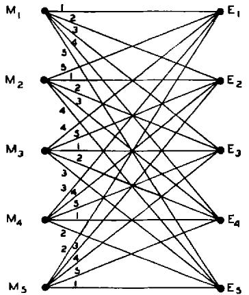

**完美系统**

图 5—完美系统。

下例所示：设 $M_{i}$ 编号为 1 到 $n$，$E_{i}$ 相同，并使用 $n$ 个密钥，令

$$
T _ {i} M _ {j} = E _ {s}
$$

其中 $s = i + j$（模 $n$）。在这种情况下，我们看到 $P_E(M) = \frac{1}{n} = P(E)$，且我们有完美保密。图 5 显示了一个例子，其中 $s = i + j - 1$（模 5）。

其中密文数量、信息数量和密钥数量都相等的完美系统的特征是 (1) 每个 $M$ 到每个 $E$ 恰好由一条线连接，(2) 所有密钥等可能。因此，系统的矩阵表示是一个“拉丁方”。

在 MTC 中，表明信息可以方便地通过熵来度量。如果我们有一组具有概率 $p_1, p_2, \dots, p_n$ 的可能性，则熵 $H$ 由下式给出：

$$
H = - \sum p _ {i} \log p _ {i}.
$$

在保密系统中，涉及两个统计选择，即信息和密钥的选择。我们可以用 $H(M)$ 来衡量选择信息时产生的信息量：

$$
H (M) = - \sum P (M) \log P (M),
$$

求和遍及所有可能信息。类似地，与密钥选择相关的不确定性由下式给出：

$$
H (K) = - \sum P (K) \log P (K).
$$

在上面描述的完美系统中，信息中的信息量最多为 $\log n$（当所有信息等可能时出现）。只有在密钥不确定性至少为 $\log n$ 时，才能完全隐藏此信息。这是我们将经常看到的一个一般原则的第一个例子：对于给定的密钥不确定性，我们所能获得的有极限——我们能够引入解中的不确定性量不能大于密钥不确定性。

如果信息的数量是无限的，情况会稍微复杂一些。例如，假设它们是通过合适的马尔可夫过程作为字母的无限序列生成的。显然，没有有限的密钥会给出完美保密性。那么，我们假设密钥源以相同的方式生成密钥，即作为符号的无限序列。进一步假设，只需要一定长度的密钥 $L_{\kappa}$ 来加密和解密长度为 $L_{M}$ 的信息。设信息字母表中字母数量的对数为 $R_{M}$，密钥字母表的对数为 $R_{\kappa}$。那么，从有限情况来看，显然完美保密需要

$$
R _ {M} L _ {M} \leq R _ {K} L _ {K}.
$$

这种类型的完美保密由维纳姆系统实现。

这些结果是在信息的先验概率未知或任意的基础上推导出来的。那么，完美保密所需的密钥取决于可能信息的总数。

人们会期望，如果信息空间具有固定的已知统计特性，因此它有一个明确的平均信息生成率 $R$，从 MTC 的意义上说，那么平均所需的密钥量可以正好按比例 $\frac{R}{R_M}$ 减少，这确实是正确的。实际上，信息可以通过一个转换器，该转换器消除了冗余，并正好按此比例减少了预期长度，然后可以对结果应用维纳姆系统。显然，每个信息字母使用的密钥量统计上减少了 $\frac{R}{R_M}$ 倍，在这种情况下，密钥源和信息源正好匹配——一个密钥比特完全隐藏了一个信息比特。使用 MTC 中使用的方法也容易证明，这是能做到的最好情况。

完美保密系统在实际图景中占有一席之地——它们可以用于以下情况：要么最重视完全保密性——例如，最高指挥层之间的通信，要么在可能信息数量较少的情况下。因此，举一个极端的例子，如果只预期两条信息“是”或“否”，那么完美系统是合适的，可能使用转换表：

<table><tr><td>M K</td><td>A</td><td>B</td></tr><tr><td>是</td><td>0</td><td>1</td></tr><tr><td>否</td><td>1</td><td>0</td></tr></table>

对于大型通信系统，完美系统的缺点当然是必须发送等量的密钥。在后续部分中，我们将考虑使用较小的密钥大小（特别是有限密钥）可以实现什么。

# 11. 含糊度

假设对英语文本使用了简单替换密码，并且我们拦截了一定数量，$N$ 个字母的加密文本。对于相当大的 $N$，比如超过 50 个字母，密码几乎总是有唯一解；即，单个良好的英语序列通过简单替换变换成拦截的材料。然而，对于较小的 $N$，存在多个解的机会更大；当 $N = 15$ 时，通常会有相当数量的可能文本片段符合，而当 $N = 8$ 时，所有合理的该长度英语序列中很大一部分（大约 1/8）是可能的，因为在 8 个字母中很少有一个以上的重复字母。当 $N = 1$ 时，任何字母显然是可能的，并且具有与其先验概率相同的后验概率。对于一个字母，系统是完美的。

对于可解密码，通常会发生这种情况。在拦截任何材料之前，我们可以想象各种可能信息以及各种密钥所附带的先验概率。随着材料被拦截，密码分析家计算后验概率；随着 $N$ 增加，某些信息的概率增加，而大多数信息的概率减少，直到最后只剩下一个概率接近 1 的信息，而所有其它信息的总概率接近零。

对于非常简单的系统，实际上可以进行这种计算。表 I 显示了应用于英语文本的凯撒型密码的后验概率，密钥从 26 种可能性中随机选择。为了能够使用标准的字母、双字母组和三字母组频率表，文本从一个随机点开始（通过打开一本书并随机将铅笔放在页面上）。以这种方式选择的信息以“creases to ...”开头，从单词 increases 内部开始。如果已知信息以句子开头，则必须使用一组不同的概率，对应于句子开头的字母、双字母组等的频率。

<table><tr><td colspan="6">表 I</td></tr><tr><td rowspan="2">凯撒型密码的后验解译概率</td><td colspan="5">截获字母数 $N$</td></tr><tr><td>N=1</td><td>N=2</td><td>N=3</td><td>N=4</td><td>N=5</td></tr><tr><td>C R E A S</td><td>.028</td><td>.0377</td><td>.1111</td><td>.3673</td><td>1</td></tr><tr><td>D S F B T</td><td>.038</td><td>.0314</td><td></td><td></td><td></td></tr><tr><td>E T G C U</td><td>.131</td><td>.0881</td><td></td><td></td><td></td></tr><tr><td>F U, H D V</td><td>.029</td><td>.0189</td><td></td><td></td><td></td></tr><tr><td>G V I E W</td><td>.020</td><td></td><td></td><td></td><td></td></tr><tr><td>H W J F X</td><td>.053</td><td>.0063</td><td></td><td></td><td></td></tr><tr><td>I X K G Y</td><td>.063</td><td>.0126</td><td></td><td></td><td></td></tr><tr><td>J Y L H Z</td><td>.001</td><td></td><td></td><td></td><td></td></tr><tr><td>K Z M I A</td><td>.004</td><td></td><td></td><td></td><td></td></tr><tr><td>L A N J B</td><td>.034</td><td>.1321</td><td>.2500</td><td></td><td></td></tr><tr><td>M B O K C</td><td>.025</td><td></td><td>.0222</td><td></td><td></td></tr><tr><td>N C P L D</td><td>.071</td><td>.1195</td><td></td><td></td><td></td></tr><tr><td>O D Q M E</td><td>.080</td><td>.0377</td><td></td><td></td><td></td></tr><tr><td>P E R N F</td><td>.020</td><td>.0818</td><td>.4389</td><td>.6327</td><td></td></tr><tr><td>Q F S O G</td><td>.001</td><td></td><td></td><td></td><td></td></tr><tr><td>R G T P H</td><td>.068</td><td>.0126</td><td></td><td></td><td></td></tr><tr><td>S H U Q I</td><td>.061</td><td>.0881</td><td>.0056</td><td></td><td></td></tr><tr><td>T I V R J</td><td>.105</td><td>.2830</td><td>.1667</td><td></td><td></td></tr><tr><td>U J W S K</td><td>.025</td><td></td><td></td><td></td><td></td></tr><tr><td>V K X T L</td><td>.009</td><td></td><td></td><td></td><td></td></tr><tr><td>W L Y U M</td><td>.015</td><td></td><td>.0056</td><td></td><td></td></tr><tr><td>X M Z V N</td><td>.002</td><td></td><td></td><td></td><td></td></tr><tr><td>Y N A W O</td><td>.020</td><td></td><td></td><td></td><td></td></tr><tr><td>Z O B X P</td><td>.001</td><td></td><td></td><td></td><td></td></tr><tr><td>A P C Y Q</td><td>.082</td><td>.0503</td><td></td><td></td><td></td></tr><tr><td>B Q D Z R</td><td>.014</td><td></td><td></td><td></td><td></td></tr><tr><td>H (十进制数字)</td><td>1.2425</td><td>.9686</td><td>.6034</td><td>.285</td><td>0</td></tr></table>

具有随机密钥的凯撒密码是纯密码，所选择的特定密钥不影响 $a$ 后验概率。为了确定这些，我们只需要列出所有密钥的可能解译并计算它们的 $a$ 先验概率。$a$ 后验概率是这些除以其和。通过从信息“顺着字母表跑”的标准过程找到这些可能的解译，并列出在左侧。这些构成信息的剩余类。对于一个拦截字母，$a$ 后验概率等于字母的 $a$ 先验概率10，并显示在标有 $N = 1$ 的列中。对于两个拦截字母，概率是双字母组的概率调整为单位和，并显示在 $N = 2$ 列中。

10 此表的概率取自弗莱彻·普拉特在《秘密与紧急》一书中给出的频率表，该书由 Blue Ribbon Books 于 1939 年在纽约出版。虽然不完整，但对于当前目的来说足够了。

三字母组频率也已制成表格，显示在 $N = 3$ 列中。对于四字母和五字母序列，概率是通过三字母组频率相乘得到的，因为大致上，

$$
p (i j k l) = p (i j k) p _ {j k} (l).
$$

请注意，在三个字母时，范围已缩小到四个概率相当高的信息，其它信息相比之下很小。在四个字母时，有两种可能性，在五个字母时，只有一个，即正确的解译。

原则上，这可以用于任何系统，但除非密钥非常小，否则可能性数量如此之大，以至于所涉及的工作阻碍了实际计算。

这组后验概率描述了密码分析家对信息和密钥的了解如何随着获得加密材料而逐渐变得更加精确。然而，对于我们的目的来说，这种描述太过复杂和难以获得。期望的是对这种逼近可能解的唯一性的简化描述。

当传输的信号受到噪声干扰时，通信理论中会出现类似情况。需要建立一个合适的度量来衡量只知道接收信号给出的扰动版本时，实际传输内容的不确定性。在 MTC 中表明，这种不确定性的自然数学度量是已知接收信号时传输信号的条件熵。为了方便，这种条件熵被称为**含糊度**。

从密码分析家的角度来看，保密系统几乎与有噪声的通信系统相同。信息（传输信号）由一个统计元素——具有其统计选择密钥的加密系统——操作。此操作的结果是可用于分析的密文（类似于受扰信号）。两种情况下主要区别是：第一，加密变换的操作通常比信道中的扰动噪声更复杂；第二，保密系统的密钥通常是从有限的可能性集合中选择的，而信道中的噪声更经常是连续引入的，实际上是从无限集合中选择的。

考虑到这些，自然地使用含糊度作为理论保密性指标。可以注意到有两个重要的含糊度，即密钥的含糊度和信息的含糊度。它们将分别表示为 $H_{\mathcal{E}}(K)$ 和 $H_{\mathcal{E}}(M)$。它们由下式给出：

$$
H _ {E} (K) = \sum_ {E, K} P (E, K) \log P _ {E} (K)
$$

$$
H _ {B} (M) = \sum_ {E, M} P (E, M) \log P _ {B} (K)
$$

其中 $E, M$ 和 $K$ 是密文、信息和密钥，且

$P(E, K)$ 是密钥 $K$ 和密文 $E$ 的概率

$P_{E}(K)$ 是如果拦截到密文 $E$，密钥 $K$ 的后验概率

$P(E, M)$ 和 $P_E(M)$ 是信息（而不是密钥）的类似概率。

$H_{E}(K)$ 中的求和遍及特定长度（比如 $N$ 个字母）的所有可能密文和所有密钥。对于 $H_{E}(M)$，求和遍及所有长度为 $N$ 的信息和密文。因此 $H_{E}(K)$ 和 $H_{E}(M)$ 都是 $N$（拦截字母数）的函数。这有时会通过写入 $H_{E}(K, N)$ 和 $H_{E}(M, N)$ 来明确指示。注意，这些是“总”含糊度；即，我们不除以 $N$ 来获得 MTC 中使用的含糊度率。

在通信理论中用于证明含糊度作为不确定性度量的相同一般论证在这里同样适用。我们注意到，零含糊度要求一个信息（或密钥）具有单位概率，所有其它为零，对应于完全知识。作为 $N$ 的函数考虑，含糊度的逐渐减少对应于对原始密钥或信息的了解增加。这两个含糊度曲线，作为 $N$ 的函数绘制，将被称为所讨论保密系统的**含糊度特征**。

上面考虑的凯撒型密文的 $H_{E}(K, N)$ 和 $H_{E}(M, N)$ 的值已经计算出来，并在表 I 的最后一行给出。$H_{E}(K, N)$ 和 $H_{E}(M, N)$ 在这种情况下相等，并以十进制数字给出（即计算中使用对数底 10）。应该注意，这里的含糊度是针对特定密文的，求和仅遍及 $M$（或 $K$），而不是 $E$。一般来说，求和将遍及所有长度为 $N$ 的可能拦截密文，并给出平均不确定性。对于这种一般计算，计算难度是令人望而却步的。

# 12. 含糊度的性质

可以证明含糊度具有许多有趣的性质，其中大多数符合我们对这种量应该如何行为的直观理解。我们将首先证明密钥或信息固定部分的含糊度随着拦截更多加密材料而减少。

**定理 7**：密钥的含糊度 $H_{E}(K, N)$ 是 $N$ 的非增函数。信息前 $A$ 个字母的含糊度是已拦截字母数 $N$ 的非增函数。如果已拦截 $N$ 个字母，信息前 $N$ 个字母的含糊度小于或等于密钥的含糊度。这些可以写成：

$$
\begin{array}{l} H _ {\mathcal {E}} (K, S) \leq H _ {\mathcal {E}} (K, N) \quad S \geq N, \\ H _ {E} (M, S) \leq H _ {E} (M, N) \quad S \geq N (H \text { 表示文本前 A 个字母的含糊度}) \\ H _ {E} (M, N) \leq H _ {K} (K, N) \\ \end{array}
$$

定理第二个结果中关于 $A$ 个字母的限定是为了计算含糊度时不考虑已拦截的信息量。如果考虑，信息含糊度可能会（并且通常确实）增加一段时间，仅仅因为更多的字母代表更大范围的可能信息。该定理的结果是我们对一个良好的保密性指标所期望的，因为我们几乎不会期望在平均情况下拦截额外材料后比之前情况更糟。事实上它们可以被证明，这进一步证明了我们使用含糊度度量是合理的。

这个定理的结果是 MTC 中证明的条件熵某些性质的推论。因此，要证明定理 7 的第一或第二陈述，对于任何随机事件 $A$ 和 $B$，我们有

$$
H (B) \geq H _ {A} (B).
$$

如果我们将 $B$ 与密钥（已知密文的前 $S$ 个字母）联系起来，$A$ 与剩余的 $N - S$ 个字母联系起来，我们得到第一个结果。类似地，将 $B$ 与信息联系起来给出第二个结果。最后一个结果由下式得出

$$
H _ {B} (M) \leq H _ {B} (K, M) = H _ {B} (K) + H _ {B, K} (M)
$$

以及 $H_{E,K}(M) = 0$ 的事实，因为 $K$ 和 $E$ 唯一地决定 $M$。

由于信息和密钥是独立选择的，我们有：

$$
H (M, K) = H (M) + H (K).
$$

此外，

$$
H (M, K) = H (E, K) = H (E) + H _ {E} (K),
$$

第一个等式源于知道 $M$ 和 $K$ 或 $E$ 和 $K$ 等价于知道所有三者。结合这两者，我们得到密钥含糊度的公式：

$$
H _ {E} (K) = H (M) + H (K) - H (E).
$$

特别是，如果 $H(M) = H(E)$，那么密钥的含糊度 $H_E(K)$ 等于密钥的先验不确定性 $H(K)$。这发生在上面描述的完美系统中。

可以通过类似方法找到信息含糊度的公式。我们有：

$$
\begin{array}{l} H (M, E) = H (E) + H _ {E} (M) = H (M) + H _ {M} (E) \\ H _ {E} (M) = H (M) + H _ {M} (E) - H (E). \\ \end{array}
$$

如果我们有一个乘积系统 $S = TR$，可以预期第二次加密过程不会减少信息的含糊度。这实际上可以如下证明：设 $M, E_1, E_2$ 分别为信息、第一次和第二次加密。那么

$$
P _ {E _ {1} E _ {2}} (M) = P _ {E _ {1}} (M).
$$

因此

$$
H _ {B _ {1} B _ {2}} (M) = H _ {B _ {1}} (M).
$$

由于对于任何随机变量 $x, y, z$，$H_{xy}(z) \leq H_y(z)$，我们得到期望的结果 $H_{\mathbb{E}_2}(M) \geq H_{\mathbb{E}_1}(M)$。

**定理 8**：乘积系统 $S = TR$ 的信息含糊度不低于仅使用 $R$ 时的信息含糊度。

现在假设我们有一个系统 $T$，它可以写成几个系统 $R, S, \dots, U$ 的加权和

$$
T = p _ {1} R + P _ {2} S + \dots + p _ {m} U \quad \sum p _ {i} = 1
$$

并且系统 $R, S, \dots, U$ 具有含糊度 $H_{1}, H_{2}, H_{3}, \dots, H_{m}$。

**定理 9**：系统的加权和的含糊度 $H$ 受以下不等式限制

$$
\sum p _ {i} H _ {i} \leq H \leq \sum p _ {i} H _ {i} - \sum p _ {i} \log p _ {i}.
$$

这些是最好的可能界限。$H$ 可以是密钥或信息的含糊度。

例如，在强理想系统（将在后面描述）中，当分解成系统的简单变换时，达到上限。如果所有系统 $R, S, \dots, U$ 进入完全不同的密文空间，则达到下限。该定理也由支配含糊度的一般不等式证明，

$$
H _ {A} (B) \leq H (B) \leq H (A) + H _ {A} (B).
$$

我们将 $A$ 与正在使用的特定系统联系起来，$B$ 与密钥或信息联系起来。

对于语言的加权和，有类似的定理。为此，我们将 $A$ 与特定语言联系起来。

**定理 10**：假设一个系统可以应用于语言 $L_{1}, L_{2}, \dots, L_{m}$，并具有含糊度特征 $H_{1}, H_{2}, \dots, H_{m}$。当应用于加权和 $\sum p_{i}L_{i}$ 时，含糊度 $H$ 受限于

$$
\sum p _ {i} H _ {i} \leq H \leq \sum p _ {i} H _ {i} - \sum p _ {i} \log p _ {i}.
$$

这些界限是最好的可能，并且所讨论的含糊度可以是密钥或信息的含糊度。

长度为 $N$ 的信息的总冗余度 $D_N$ 定义为

$$
D _ {N} = \log G - H (M)
$$

其中 $G$ 是长度为 $N$ 的信息总数，$H(M)$ 是选择其中之一的不确定性。在可能密文总数等于长度为 $N$ 的可能信息数的保密系统中，$H(E) \leq \log G$。因此

$$
\begin{array}{l} H _ {E} (K) = H (K) + H (M) - H (E) \\ \geq H (K) - [ \log G - H (M) ]. \\ \end{array}
$$

因此

$$
H (K) - H _ {E} (K) \leq D _ {N}.
$$

这表明，例如，在一个封闭系统中，拦截 $N$ 个字母后密钥含糊度的减少不大于 $N$ 个字母的语言冗余度。在这种系统（包括大多数密码）中，正是原始信息中冗余度的存在使得解成为可能。

现在假设我们有一个纯系统。设信息的不同剩余类为 $C_1, C_2, C_3, \dots, C_r$，对应的密文剩余类集合为 $C_1', C_2', \dots, C_r'$。$C_1'$ 中每个 $E$ 的概率相同：

$$
P (E) = \frac {P (C _ {i})}{\varphi_ {i}} \quad E \text { 是 } C _ {i} \text { 的成员}
$$

其中 $\varphi_{i}$ 是 $C_i$ 中不同信息的数量。因此我们有

$$
\begin{array}{l} H (E) = - \sum_ {i} \varphi_ {i} \frac {P (C _ {i})}{\varphi_ {i}} \log \frac {P (C _ {i})}{\varphi_ {i}} \\ = - \sum P (C _ {i}) \log \frac {P (C _ {i})}{\varphi_ {i}} \\ \end{array}
$$

代入我们的 $H_{\mathbf{E}}(K)$ 方程，我们得到：

**定理 11**：对于纯密码

$$
H _ {E} (K) = H (K) + H (M) + \sum_ {i} P (C _ {i}) \log \frac {P (C _ {i})}{\varphi_ {i}}.
$$

这个结果可以用来在某些感兴趣的情况下计算 $H_{\mathbb{E}}(K)$。

# 13. 在双字母语言上简单替换的含糊度

我们现在将计算简单替换应用于双字母语言时，密钥或信息的含糊度，其中 $0$ 和 $1$ 的概率分别为 $p$ 和 $q$，且连续字母独立选择。我们有

$$
H _ {E} (M) = H _ {B} (K) = - \sum P (E) P _ {E} (K) \log P _ {E} (K)
$$

$E$ 在特定排列中恰好包含 $s$ 个 $0$ 的概率为：

$$
\frac {1}{2} \left(p ^ {n} q ^ {N - s} + q ^ {s} p ^ {N - s}\right)
$$

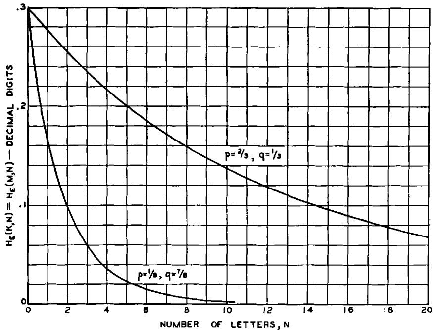

**图 6—双字母语言上简单替换的含糊度。**

恒等替换和反转替换（系统中仅有的两个）的后验概率分别为：

$$
P _ {E} (0) = \frac {p ^ {s} q ^ {N - s}}{\left(p ^ {s} q ^ {N - s} + q ^ {s} p ^ {N - s}\right)} P _ {E} (1) = \frac {p ^ {N - s} q ^ {s}}{\left(p ^ {s} q ^ {N - s} + q ^ {s} p ^ {N - s}\right)}.
$$

每个 $s$ 有 $\binom{N}{s}$ 项，因此

$$
H _ {B} (K, N) = - \sum_ {s} \binom {N} {s} p ^ {s} q ^ {N - s} \log \frac {p ^ {s} q ^ {N - s}}{\left(p ^ {s} q ^ {N - s} + q ^ {s} p ^ {N - s}\right)}.
$$

对于 $p = \frac{1}{3}, q = \frac{2}{3}$，以及 $p = \frac{1}{8}, q = \frac{7}{8}$，已计算 $H_{E}(K, N)$ 并显示在图 6 中。

# 14. “随机”密码的含糊度特征

在前一节中，我们计算了应用于双字母语言的简单替换的含糊度特征。这大约是可能的最简单的密码类型和最简单的语言结构，然而公式已经复杂到几乎无用的地步。对于实际感兴趣的情况，比如说应用于具有极其复杂统计结构的英语的分数置换系统的复杂变换，我们该怎么做？这种复杂性本身提示了一种方法。足够复杂的问题通常可以通过统计方法解决。为了便于此，我们定义“随机”密码的概念。

我们做出以下假设：

1.  长度为 $N$ 的可能信息数为 $T = 2^{R_0N}$，因此 $R_0 = \log_2 G$，其中 $G$ 是字母表中的字母数。长度为 $N$ 的可能密文数也假设为 $T$。

2.  长度为 $N$ 的可能信息可以分为两组：一组具有高且相当均匀的先验概率，第二组的总概率可忽略不计。高概率组将包含 $S = 2^{RN}$ 个信息，其中 $R = H(M) / N$，即 $R$ 是每个字母信息源的熵。

3.  解密操作可以被视为一系列线，如图 2 和 4 所示，从每个 $E$ 回到各种 $M$。我们假设有 $k$ 个不同的等可能密钥，因此从每个 $E$ 将会有 $k$ 条线返回。对于随机密码，我们假设来自每个 $E$ 的线回到可能信息的随机选择。实际上，随机密码是整个密码集合，而含糊度是该集合的平均含糊度。

密钥的含糊度定义为

$$
H _ {E} (K) = \sum P (E) P _ {E} (K) \log P _ {R} (K).
$$

从一个特定 $E$ 恰好有 $m$ 条线回到高概率信息组的概率是

$$
\binom {k} {m} \left(\frac {S}{T}\right) ^ {m} \left(1 - \frac {S}{T}\right) ^ {k - m}
$$

如果拦截到具有 $m$ 条这样的线的密文，则含糊度为 $\log m$。这样的密文的概率为 $\frac{mT}{SK}$，因为它可以由来自高概率信息的 $m$ 个密钥产生，每个概率为 $\frac{T}{S}$。因此含糊度为：

$$
H _ {B} (K) = \frac {T}{S k} \sum_ {m = 1} ^ {k} \binom {k} {m} \left(\frac {S}{T}\right) ^ {m} \left(1 - \frac {S}{T}\right) ^ {k - m} m \log m
$$

我们希望当 $k$ 很大时，找到一个简单的近似值。如果 $m$ 的期望值，即 $\overline{m} = \frac{Sk}{T}$，是 $\gg 1$，则二项分布在较大值范围内的 $\log m$ 变化很小，我们可以用 $\log \overline{m}$ 替换 $\log m$。这现在可以从求和中分解出来，然后求和简化为 $\overline{m}$。因此，在这种情况下，

$$
H _ {E} (K) \doteq \log \frac {S k}{T} = \log S - \log T + \log k
$$

$$
H _ {K} (K) \doteq H (K) - D N,
$$

其中 $D$ 是原始语言每个字母的冗余度 $(D = D_N / N)$。如果 $\bar{m}$ 与大 $k$ 相比较小，则二项分布可以用泊松分布近似：

$$
\binom {k} {m} p ^ {m} q ^ {k - m} \doteq \frac {e ^ {- \lambda} \lambda^ {m}}{m !}
$$

其中 $\lambda = \frac{Sk}{T}$。因此

$$
H _ {E} (K) \doteq \frac {1}{\lambda} e ^ {- \lambda} \sum_ {2} ^ {\infty} \frac {\lambda^ {m}}{m !} m \log m.
$$

如果我们用 $m + 1$ 替换 $m$，我们得到：

$$
H _ {R} (K) \doteq e ^ {- \lambda} \sum_ {1} ^ {\infty} \frac {\lambda^ {m}}{m !} \log (m + 1).
$$

这可以在 $\lambda$ 接近 1 的区域使用。对于 $\lambda \ll 1$，系列中唯一重要的项是 $m = 1$ 的项；省略其它项，我们有：

$$
\begin{array}{l} H _ {B} (K) \doteq e ^ {- \lambda} \lambda \log 2 \\ \fallingdotseq \lambda \log 2 \\ \div 2 ^ {- N D} k \log 2. \\ \end{array}
$$

总结：$H_{E}(K)$ 作为 $N$（拦截字母数）的函数，从 $N = 0$ 时的 $H(K)$ 开始。它以斜率 $-D$ 线性减少，直到 $N = \frac{H(K)}{D}$ 附近。经过一个短的过渡区域后，$H_{E}(K)$ 遵循指数曲线，如果 $D$ 以每字母比特度量，则“半衰期”距离为 $\frac{1}{D}$。这种行为显示在图 7 中，连同近似曲线。

通过类似的论证，可以计算信息的含糊度。它是

$$
H _ {E} (M) = R _ {0} N \text { 对于 } R _ {0} N \ll H _ {E} (K)
$$

$$
H _ {E} (M) = H _ {E} (K) \text { 对于 } R _ {0} N \gg H _ {E} (K)
$$

$$
H _ {E} (M) = H _ {E} (K) - \varphi (N) \text { 对于 } R _ {0} N \sim H _ {E} (K)
$$

其中 $\varphi(N)$ 是图 7 所示的函数，其 $N$ 标度按 $\frac{D}{R_0}$ 因子缩小。因此，$H_{\mathbf{E}}(M)$ 以斜率 $R_0$ 线性上升，直到几乎与 $H_{E}(K)$ 线相交。

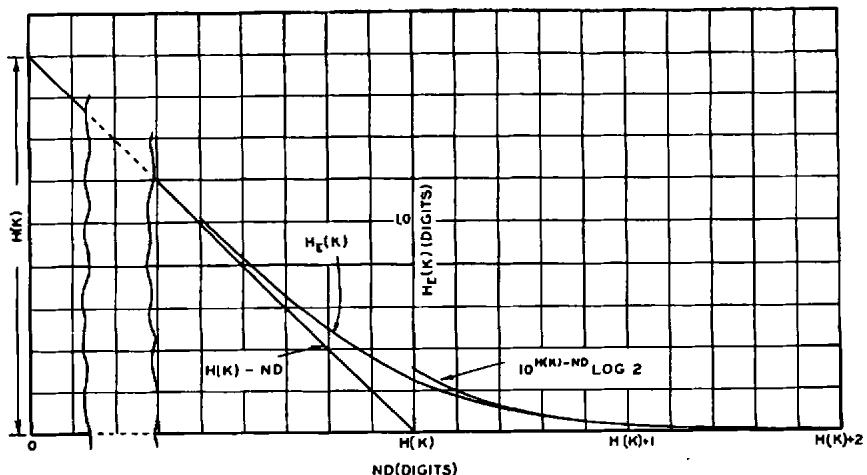

**图 7-随机密码的含糊度。**

从图 7 可以看出，含糊度曲线趋近于零相当急剧。因此，我们可以几乎没有歧义地谈论解变得唯一的点。这个字母数将被称为**唯一解距离**。对于随机密码，它大约是 $H(K) / D$。

# 15. 应用于标准密码

大多数标准密码涉及相当复杂的加密和解密操作。此外，自然语言的统计结构极其复杂。因此，有理由假设为随机密码推导的公式可以应用于此类情况。然而，在某些情况下必须应用某些修正。需要注意的主要点如下：

1.  我们假设对于随机密码，密文的可能解译是从可能信息中随机选择的。虽然在普通系统中并不严格正确，但随着加密操作和语言结构的复杂性增加，这变得更加接近事实。对于置换密码，很明显字母频率在解密操作下得以保留。这意味着可能解译是从一个更有限的组中选择的，而不是整个信息空间，因此公式应该改变。代替 $R_0$，人们使用 $R_1$，即具有独立字母但具有规则字母频率的语言的熵率。在其它一些情况下，可以看到将解译返回到高概率信息的明确趋势。如果没有这种明确的趋势，并且系统相当复杂，那么使用随机密码分析是合理的。

2.  在许多情况下，完整密钥并不用于加密短信息。例如，在简单替换中，只有相当长的信息才会包含字母表中的所有字母，从而涉及完整密钥。显然，随机假设在这种情况下对于小 $N$ 不成立，因为所有仅在尚未出现在密文中的字母方面不同的密钥都导致相同的信息，并且不是随机分布的。这个误差很容易通过使用“密钥出现特征”进行良好近似修正。人们在特定的 $N$ 处，使用该长度密文可能期望的有效密钥量。对于大多数密码，这很容易估计。

3.  由于信息的明确开始，存在某些“末端效应”，导致与随机特征的差异。如果我们在英语文本中取一个随机起点，第一个字母（当我们没有观察前面的字母时）有可能以普通字母概率成为任何字母。下一个字母更完全指定，因为那时我们有双字母组频率。这种选择值的减少会持续一段时间。这对曲线的影响是直线部分被位移，并由一条曲线逼近，该曲线取决于语言的统计结构在相邻字母上分布的程度。作为一阶近似，曲线可以通过将线移到半冗余点来修正——即语言冗余度为其最终值一半的字母数。

如果考虑了这三个效应，可以对含糊度特征和唯一解点做出合理估计。计算可以如图 8 所示以图形方式进行。绘制密钥出现特征和总冗余度曲线 $D_{N}$（通常由直线 $ND_{\infty}$ 足够好地表示）。这两者之差直到它们交点附近是 $H_{E}(M)$。对于应用于英语的简单替换密码，该计算给出了

如图 9 所示的曲线。在这种情况下，密钥出现特征是通过计算典型 $N$ 个字母英语段落中出现的不同字母数量来估计的。就简单替换的实验数据而言，考虑到所做的各种理想化和近似，它们与图 9 的曲线非常吻合。例如，唯一解点在大约 27 个字母处，可以通过实验证明介于 20 到 30 之间。对于 30 个字母，这种类型的密文几乎总是有唯一解，而对于 20 个字母，通常很容易找到多个解。

对于周期为 $d$（随机密钥）的置换，$H(K) = \log d!$，或大约 $d \log d / e$（对 $d!$ 使用斯特林近似）。如果我们取每字母 0.6 十进制数字作为适当的冗余度，记住字母频率的保留，我们得到大约 $1.7d \log d / e$ 作为唯一解距离。这在实验上也相当吻合。注意在这种情况下 $H_{\mathcal{B}}(M)$ 仅对 $d$ 的整数倍有定义。

对于维吉尼亚，唯一解点将出现在大约 $2d$ 个字母处，这也大致正确。具有相同密钥大小的维吉尼亚特征

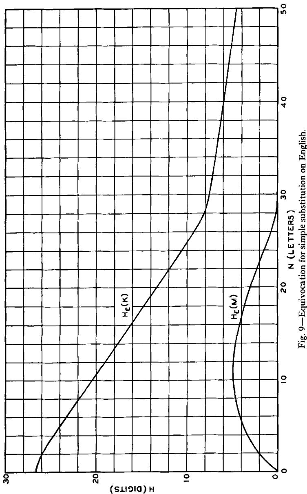

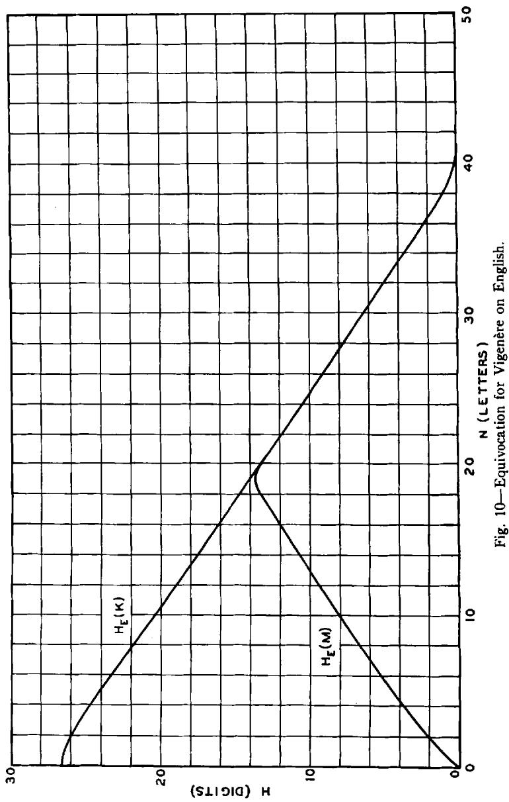

将与简单替换大致如图 10 所示。维吉尼亚、普莱费尔和分数情况比简单替换和置换更可能遵循随机密码的理论公式。原因是它们更复杂，并对它们操作的信息提供了更好的混合特性。

混合字母表维吉尼亚（$d$ 个字母表中的每个独立混合并顺序使用）的密钥大小为

$$
H (K) = d \log 2 6! = 2 6. 3 d
$$

其唯一解点应在大约 53d 个字母处。

这些结论也可以通过凯撒型密码进行粗略的实验测试。在表 I 第 11 节分析的特定密文中，已计算函数 $(H_E(K, N))$ 并在下面给出，连同随机密码的值。

<table><tr><td>N</td><td>0</td><td>1</td><td>2</td><td>3</td><td>4</td><td>5</td></tr><tr><td>H (观测值)</td><td>1.41</td><td>1.24</td><td>.97</td><td>.60</td><td>.28</td><td>0</td></tr><tr><td>H (计算值)</td><td>1.41</td><td>1.25</td><td>.98</td><td>.54</td><td>.15</td><td>.03</td></tr></table>

可以看到一致性相当好，特别是当我们记住观测到的 $H$ 实际上应该是许多不同密文的平均值，并且较大 $N$ 的 $D$ 只是粗略估计的。

因此，随机密码分析似乎可用于估计普通类型密码的含糊度特征和唯一解距离。

# 16. 密文解的有效性

含糊度公式与密码学工作中有时出现的关于密文所谓解的有效性问题相关。在密码学历史上，有许多密文或可能的密文，聪明的分析家找到了“解”。然而，它涉及如此复杂的过程，或者材料如此稀少，以至于出现了密码分析家是否将解“读入”密文的问题。例如，参见培根-莎士比亚密码和“罗杰·培根”手稿。[10]

一般来说，我们可以说，如果一个提议的系统和密钥在材料长度远大于唯一解距离时解开了密文，那么该解是可信的。如果材料与唯一解距离数量级相同或更短，则该解非常可疑。

冗余度逐渐产生密码唯一解的这种效应可以以另一种有助于理解的方式思考。冗余度本质上是信息字母的一系列条件，确保其在统计上是合理的。这些一致性条件在密文中产生相应的一致性条件。密钥给予密文一定量的自由度，但随着拦截越来越多的字母，一致性条件用完了密钥允许的自由度。最终只有一个信息和密钥满足所有条件，我们得到了唯一解。在随机密码中，一致性条件在某种意义上与“密钥的纹理”“正交”，并以其全部效果尽可能快地消除信息和密钥。这是通常情况。然而，通过适当的设计，可以将语言的冗余度与“密钥的纹理”“对齐”，使得一致性条件自动满足，并且 $H_{E}(K)$ 不趋近于零。这些“理想”系统将在下一节考虑，其性质是变换 $T_{i}$ 都在 $E$ 空间中诱导相同的概率。

[10] 参见 M. 雷利，《罗杰·培根密码》，明尼苏达大学出版社，1938 年。

# 17. 理想保密系统

我们已经看到，如果允许无限长度的信息，完美保密需要无限量的密钥。使用有限密钥大小，密钥和信息的含糊度通常趋近于零，但不一定如此。实际上，$H_{E}(K)$ 有可能保持在其初始值 $H(K)$ 不变。那么，无论拦截多少材料，都没有唯一解，而是有许多概率相当的替代方案。我们将定义一个“理想”系统，其中 $H_{E}(K)$ 和 $H_{E}(M)$ 在 $N \to \infty$ 时不趋近于零。一个“强理想”系统是其中 $H_{E}(K)$ 保持恒定在 $H(K)$ 的系统。

一个例子是应用于人工语言的简单替换，其中所有字母等可能且连续字母独立选择。很容易看出 $H_{E}(K) = H(K)$，并且 $H_{E}(M)$ 沿一条斜率为 $\log G$（其中 $G$ 是字母表中的字母数）的线线性上升，直到它与 $H(K)$ 线相交，之后保持恒定在该值。

对于自然语言，通常可以近似理想特征——可以使唯一解点出现在任意大的 $\mathcal{N}$ 处。然而，当我们试图做到这一点时，所需系统的复杂性通常迅速增加。实际上，并非总是能用任何有限复杂性的系统真正达到理想特征。

为了近似理想含糊度，可以先用一个转换器处理信息，去除所有冗余。在此之后，几乎任何简单的密码系统——替换、置换、维吉尼亚等，都是令人满意的。转换器越精细，输出越接近期望的形式，保密系统将越接近理想特征。

**定理 12**：$T$ 是强理想的一个必要且充分条件是，对于任何两个密钥，$T_i^{-1}T_j$ 是信息空间到其自身的保测变换。

这是真的，因为每个密钥的后验概率等于其先验概率当且仅当满足此条件。

# 18. 理想保密系统的例子

假设我们的语言由一系列字母组成，所有字母独立且等概率选择。那么冗余度为零，根据第 12 节的结果，$H_{E}(K) = H(K)$。我们得到结果

**定理 13**：如果所有字母等可能且独立，任何封闭密码都是强理想的。

信息的含糊度将沿密钥出现特征上升，该特征通常将接近 $H(K)$，尽管在某些情况下不会。在 $n$ 字母组替换、置换、维吉尼亚及其变体、分数等情况中，对于这种简单语言，我们有强理想系统，其中 $H_{E}(M) \to H(K)$ 当 $N \to \infty$。

理想保密系统有一些缺点。

1.  系统必须与语言紧密匹配。这要求设计者对语言结构进行广泛研究。此外，统计结构的变化或从可能信息集合中选择，如可能单词（预期在此特定密文中出现的单词）的情况，使系统容易受到分析。

2.  自然语言的结构极其复杂，这意味着消除冗余所需的变换复杂性。因此，任何执行此操作的机器必然相当复杂，至少就信息存储而言，因为可以预期“字典”的规模大于普通字典。

3.  一般来说，所需的变换引入了不良的错误传播特性。传输中单个字母的错误会在其附近产生一个变化区域，其大小与原始语言中统计效应的长度相当。

# 19. 关于含糊度与冗余度的进一步说明

我们取“正常英语”的冗余度约为每字母 0.7 十进制数字或 $50\%$ 的冗余度。这是假设省略了单词划分。这是一个基于大约 8 个字母的统计结构的近似数字，并假设文本是普通类型，如报纸写作、文学作品等。我们在这里可以注意一种粗略估计这个数字的方法，该方法具有一定的密码学意义。

滚动密钥密码是一种维纳姆型系统，其中密钥不是随机字母序列，而是有意义的文本。现在已知滚动密钥密码通常可以唯一地解出。这表明英语可以缩减二比一，并意味着至少 $50\%$ 的冗余度。然而，这个数字不能增加太多，原因有很多，除非考虑英语的长程“意义”结构。

可以很容易地改进滚动密钥密码，以产生没有密钥就无法解密的密码系统。如果一个人用一个英语文本作为密钥，而是用大约 4 个不同的文本作为密钥，将它们全部加到信息上，那么已经引入了足够量的密钥以产生高正含糊度。另一种方法是将文本的每第 10 个字母用作密钥。中间的字母被省略，不能在信息的任何其它点使用。这具有大致相同的效果，因为这些间隔的字母几乎是独立的。

一段文字中的元音可以省略而不会造成实质性损失，这一事实提示了一种大幅改进几乎所有密码系统的简单方法。首先删除所有元音，或在不冒多重重建风险的情况下尽可能多地删除信息，然后加密剩余部分。由于这以大约 3 或 4 比 1 的因子减少了冗余度，唯一解点将按此因子移动。这是接近理想系统的一种方法——利用解密者对英语的了解作为解密系统的一部分。

# 20. 含糊度的分布

通过给出含糊度的分布，可以找到比含糊度特征更完整的应用于语言的保密系统描述。对于拦截的 $N$ 个字母，我们考虑密文的比例，对于这些密文，含糊度（针对这些特定的 $E$，而不是平均值 $H_{E}(M)$）位于某些界限之间。这给出了一个密度分布函数

$$
P \left(H _ {E} (M), N\right) d H _ {E} (M)
$$

对于 $N$ 个字母时 $H$ 位于 $H$ 和 $H + dH$ 之间的概率。我们之前研究的平均含糊度是该分布的平均值。函数 $P(H_E(M), N)$ 可以被认为是在 $H_E(M)$、$N$ 平面上垂直于纸张的方向上沿着第三维度绘制。如果语言是纯的，且影响范围小，并且密码是纯的，那么该函数通常将是该平面中的一条脊线，其最高点至少近似地遵循平均 $H_E(M)$，直到接近唯一解点。在这种情况下，或者当条件几乎满足时，平均曲线给出了系统相当完整的图景。

另一方面，如果语言不纯，而是由一组纯分量组成

$$
L = \sum p _ {i} L _ {i}
$$

这些分量与系统具有不同的含糊度曲线，那么总分布通常将由一系列脊线组成。每个 $L_{i}$ 将有一条脊线，按其 $p_{i}$ 加权。平均含糊度特征将是这些脊线中间的某条线，可能无法给出非常完整的情况。如图 11 所示。如果系统不纯，而是由几个具有不同 $H$ 曲线的系统组成，也会出现类似的效果。

混合统计结构相近的纯语言的效果是增加了脊线的宽度。接近唯一解

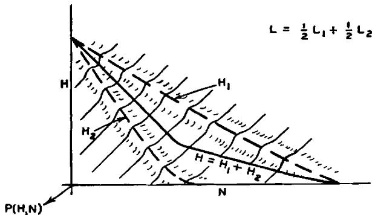

**图 11—混合语言 $L = \frac{1}{2} L_{1} + \frac{1}{2} L_{2}$ 的含糊度分布。**

点时，这往往提高平均含糊度，因为含糊度不能变为负值，并且扩展主要是正向的。因此，我们预计，在该区域，基于随机密码的计算值会略低一些。

# 第三部分

# 实际保密性

# 21. 工作特征

在拦截材料中超过唯一解点后，密文通常将有唯一解。分离这个高概率的唯一解的问题是密码分析问题。在唯一解点之前的区域，我们可以说密码分析的问题是分离所有高概率（与其余相比）的可能解并确定它们的各种概率。

尽管原则上总是可以确定这些解（例如通过尝试每个可能的密钥），但不同的加密系统在所需工作量上表现出很大的差异。确定 $N$ 个字母密文的密钥所需的平均工作量 $W(N)$（以人时衡量）可以称为系统的工作特征。该平均值取所有信息和所有密钥及其适当概率。函数 $W(N)$ 是系统提供的“实际保密性”量的度量。

对于英语的简单替换，工作和含糊度特征将大致如图 12 所示。曲线的虚线部分

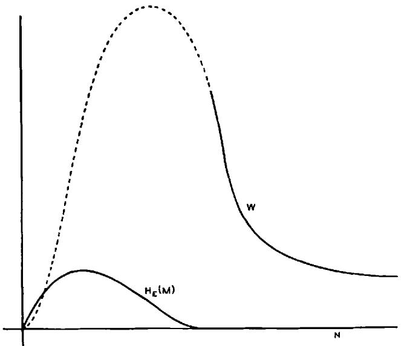

**图 12—典型的工作和含糊度特征。**

是在存在大量可能解且必须全部确定的范围内。在唯一解点之后的实线部分，通常只存在一个解，但如果只给出最低必要数据，则需要大量工作来分离它。随着更多材料的可用，工作量迅速减少到某个渐近值——此时额外数据不再减少劳动。

本质上，任何含糊度趋近于零的保密系统都可以预期图 12 所示的行为。然而，即使 $H_E(M)$ 曲线大致相同，不同类型密码所需的人时标度也会有很大差异。例如，具有相同密钥大小的维吉尼亚或复合维吉尼亚将具有

好得多（即高得多）的工作特征。一个好的实际保密系统是其中 $W(N)$ 曲线保持足够高的系统，直到使用该密钥预期传输的字母数，以防止敌方实际执行解密，或延迟到信息过时。

在后续章节中，我们将考虑保持函数 $W(N)$ 很大的方法，即使 $H_{K}(K)$ 可能实际上为零。这本质上是一个“最大最小”类型的问题，就像我们进行智力较量时总是如此。[11] 在设计一个好的密码时，我们必须最大化敌方破解它必须做的最小工作量。仅仅确保没有标准的密码分析方法有效是不够的——我们必须确保没有任何方法可以轻松破解该系统。事实上，这是许多系统的弱点；设计用来抵抗所有已知解密方法，但后来产生了新的密码分析技术，使它们容易受到分析。

好的密码设计问题本质上是寻找困难问题的问题，但要满足某些其它条件。这是一个相当不寻常的情况，因为人们通常在一个领域中寻求简单易解的问题。

我们如何能确信一个非理想且因此对于足够大的 $N$ 有唯一解的系统，将需要大量工作才能用每种分析方法破解？有两种方法来解决这个问题；(1) 我们可以研究密码分析家可用的可能解密方法，并尝试以足够通用的术语描述它们，以涵盖他可能使用的任何方法。然后我们构造我们的系统以抵抗这种“一般”解密方法。(2) 我们可以构造我们的密码，使得破解它等价于（或在该过程的某个点需要）解决某个已知是费时的问题。因此，如果我们能证明破解某个系统至少需要与求解一个大型复杂类型的多变量方程组一样多的工作，那么我们将获得工作特征的某种下界。

接下来的三节旨在解决这些一般问题。很难用足够的精度定义所涉及的相关概念以得到数学定理形式的结果，但相信以一般原则形式的结论是正确的。

1. 参见冯·诺依曼和摩根斯坦，前引书。密码设计者和密码分析家之间的情况可以被认为是一个非常简单的“博弈”；一个零和两人完全信息博弈，只有两个“着法”。密码设计者选择他的“着法”——一个系统。然后密码分析家被告知这一选择并选择一种分析方法。博弈的“价值”是使用所选方法破解系统中密文的平均工作量。

# 22. 关于密文解的一般性说明

在拦截材料中超过唯一解距离后，原则上任何系统都可以通过仅仅尝试每个可能的密钥直到获得唯一解来破解——即，一个在原始语言中“有意义”的解密信息。一个简单的计算表明，这种解密方法（我们可以称之为完全穷举法）完全不切实际，除非密钥小得荒谬。

例如，假设我们有一个 26! 种可能性的密钥，或者大约 26.3 十进制数字，与英语简单替换的大小相同。以任何有意义的衡量标准，这都是一个小密钥。它可以写在一张小纸条上，或者在几分钟内记住。它可以注册在 27 个开关上，每个有十个位置，或者 88 个两位置开关上。

进一步假设，为了给密码分析家所有可能的优势，他构建了一种电子设备，以每微秒一个的速度尝试密钥（也许通过 $\chi^2$ 测试统计显著性自动选择结果）。他可能期望在大约一半的尝试后达到正确的密钥，经过大约 $2 \times 10^{26} / 2 \times 60^2 \times 24 \times 365 \times 10^6$ 或 $3 \times 10^{12}$ 年的经过时间。

换句话说，即使对于一个小密钥，完全穷举也永远不会用于破解密文，除非在密钥极小的情况下，例如只有 26 种可能性（或 1.4 位数字）的凯撒密码。密码学中如此常用的穷举法是不同类型的，或者是通过其它方式增强的。如果一个人有一个需要完全穷举的保密系统，那将是非常安全的。这样的系统似乎会出现，如果所有有意义的原始信息，比如 1000 个字母，都是从所有 1000 个字母序列集合中随机选择的。如果任何简单密码应用于这种类型的语言，似乎不可能比完全穷举有多少改进。

实际上使用的密码分析方法通常涉及大量的穷举，但是以不同的方式。首先，试验从概率较高的假设进展到概率较低的假设，其次，每次试验处理一大组密钥，而不是单个密钥。因此，密钥空间可以分成，比如说 10 个子集，每个包含大约相同数量的密钥。通过最多 10 次试验，可以确定哪个子集是正确的。然后这个子集被分成几个次级子集，重复此过程。对于相同的密钥大小 $(26! \div 2 \times 10^{26})$，我们预计大约 $26 \times 5$ 或 130 次试验，相比之下完全穷举需要 $10^{26}$ 次。先测试最可能的子集的可能性甚至会进一步改善这一结果。如果将分成两个部分（最小化试验次数的最佳方式），则只需要 88 次试验。完全穷举需要与密钥数量同数量级的试验，而这种细分穷举只需要与密钥位数同数量级的试验。

即使不同的密钥具有不同的概率，这仍然成立。那么，最小化预期试验次数的正确程序是将密钥空间划分为等概率的子集。当确定了正确的子集后，再次将其细分为等概率的子集。如果这个过程可以继续下去，并且每次划分成两个子集，预期的试验次数将是

$$
h = \frac {H (K)}{\log 2}
$$

如果每次测试有 $S$ 个可能的结果，并且每个结果对应于密钥位于 $S$ 个等概率子集之一，那么预计

$$
h = \frac {H (K)}{\log S}
$$

次试验。这些结果的直观意义应该注意。在等概率的两部分测试中，每次测试产生关于密钥的一比特信息。如果子集具有非常不同的概率，就像在完全穷举中测试单个密钥一样，每次测试只获得少量信息。因此，对于 26! 个等可能密钥，测试一个密钥仅产生

$$
- \left[ \frac {2 6 ! - 1}{2 6 !} \log \frac {2 6 ! - 1}{2 6 !} + \frac {1}{2 6 !} \log \frac {1}{2 6 !} \right]
$$

或大约 $10^{-25}$ 比特的信息。划分成 $S$ 个等概率子集使每次试验获得的信息最大化，为 $\log S$，而预期的试验次数是要获得的总信息量，即 $H(K)$，除以这个量。

这里的问题类似于最近流传的各种硬币称重问题。一个典型的例子如下：已知 27 枚硬币中有一枚是假币，比其余的略轻。有一个化学天平可用，需要通过一系列称重来找出假币。要做到这一点，最少需要多少次称重？正确答案是 3，首先将硬币分成三组，每组 9 枚。其中两组放在天平上比较。三种可能的结果确定包含假币的 9 枚硬币组。然后将这组分成三个子组，每组 3 枚，继续此过程。这组硬币对应于密钥集合，假币对应于正确密钥，称重程序对应于一次试验或测试。最初的不确定性是 $\log_2 27$

比特，每次试验产生 $\log_2 3$ 比特信息；因此，当没有“丢番图麻烦”时，$\log_2 27 / \log_2 3$ 或 3 次试验就足够了。

仅当密钥空间可以分成少数几个子集，并且有简单的方法确定正确密钥属于哪个子集时，这种解密方法才是可行的。为了应用一致性测试并确定假设是否合理，并不需要假设完整的密钥——可以测试密钥一部分的假设（或密钥是否在密钥空间的某个大部分）。换句话说，可以逐比特地求解密钥。

这种分析方法的可能性是大多数加密系统的关键弱点。例如，在简单替换中，对单个字母的假设可以根据其频率、接触多样性、双写或反向等进行检查。在确定单个字母时，密钥空间从原始的 26 减少了 1.4 个十进制数字。在所有基本类型的密码中都看到了相同的效果。在维吉尼亚中，对密钥两三个字母的假设很容易通过用这个片段解密其它点并注意是否出现明文来检查。复合维吉尼亚在这方面要好得多，如果我们假设有相当多的组成周期，产生的重复率大于将被拦截的量。在这种情况下，每个字母加密时使用的密钥字母数与周期数一样多。尽管这只是整个密钥的一小部分，但必须假设相当多的字母才能应用一致性检查。

因此，关于实际小密钥密码设计的第一个结论是，加密每个小信息元素时应该使用相当数量的密钥。

# 23. 统计方法

可以通过统计分析解决许多类型的密码。再次考虑简单替换。密码分析家拦截密文后做的第一件事就是进行频率统计。如果密文包含，比如说 200 个字母，可以安全地假设几乎没有字母超出其频率组，这是分为 4 组具有明确定义频率界限的组。在这个限制内，密钥数量的对数可以计算为

$$
\log 2! 9! 9! 6! = 1 4. 2 8
$$

因此简单的频率统计将密钥不确定性减少了 12 个十进制数字，这是一个巨大的增益。

一般来说，统计攻击进行如下：在拦截的密文 $E$ 上测量某个统计量 $S$。这个统计量对于所有合理的信息 $M$，其取值大致相同，为 $S_{\kappa}$，该值仅取决于所使用的特定密钥 $K$。这样获得的值用于将可能的密钥限制为那些给出 $S$ 值在观测值附近的密钥。不依赖于 $K$ 或随 $M$ 变化与随 $K$ 变化一样多的统计量在限制 $K$ 方面没有价值。因此，在置换密码中，字母的频率统计不提供关于 $K$ 的信息——每个 $K$ 都使这个统计量相同。因此，在破解置换密码时无法利用频率统计。

更准确地说，可以赋予给定统计量 $S$ 一个“解决能力”。对于 $S$ 的每个值，将存在密钥的条件含糊度 $H_{S}(K)$，即当 $S$ 具有其特定值时已知的含糊度。这些值的加权平均

$$
\sum P (S) \quad H _ {s} (K)
$$

给出已知 $S$ 时密钥的平均含糊度，$P(S)$ 是特定值 $S$ 的先验概率。密钥大小 $H(K)$ 减去这个平均含糊度，衡量了统计量 $S$ 的“解决能力”。

在强理想密码中，密文的所有统计量都独立于所使用的特定密钥。这是 $E$ 空间上 $T_{j}T_{k}^{-1}$ 或 $M$ 空间上 $T_{j}^{-1}T_{k}$ 的保测性质。

有好统计量和差统计量，就像有好的和差的穷举法一样。确实，假设的穷举测试是一种统计量，上面关于最佳试验类型的内容普遍适用。用于解决系统的良好统计量必须具有以下性质：

1.  它必须易于测量。

2.  如果用于求解密钥，它必须更多地依赖于密钥而不是信息。它随 $M$ 的变化不应掩盖其随 $K$ 的变化。

3.  尽管由 $M$ 变化产生的“模糊性”，仍然能够“分辨”的统计量值应将密钥空间划分为多个概率相当的子集，统计量指定了正确密钥所在的子集。统计量应给予我们关于密钥的大量信息，而不是一小部分比特。

4.  它给出的信息必须简单且可用。因此，统计量定位密钥的子集在密钥空间中必须是简单性质的。

简单替换的频率统计是一个非常好的统计量的例子。

有两种方法（除了求助于理想系统之外）可以挫败统计分析。我们可以称之为**扩散**和**混淆**的方法。在扩散方法中，$M$ 中导致其冗余度的统计结构被“消散”为长程统计——即，涉及密文中长组合的统计结构。这里的效果是，敌方必须拦截大量材料才能确定这种结构，因为这种结构仅在具有非常小的个体概率的块中才明显。此外，即使他有足够的材料，所需的分析工作也要大得多，因为冗余度已经扩散到大量的个体统计量中。扩散统计量的一个例子是对信息 $M = m_{1}, m_{2}, m_{3}, \dots$ 进行“平均”操作，例如

$$
y _ {n} = \sum_ {i = 1} ^ {\bullet} m _ {n + i} (\mathrm {m o d} 2 6),
$$

将 $s$ 个连续的信息字母相加得到一个字母 $y_{n}$。可以证明 $y$ 序列的冗余度与 $m$ 序列相同，但结构已经被消散。因此，$y$ 中的字母频率将比 $m$ 中更接近相等，双字母组频率也更接近相等，等等。确实，任何产生一个字母输出对应于一个字母输入且不具有无限“记忆”的可逆操作，其输出具有与输入相同的冗余度。统计量永远不能被消除，除非进行压缩，但它们可以被扩散。

混淆的方法是使 $E$ 的简单统计量与 $K$ 的简单描述之间的关系变得非常复杂和纠缠。在简单替换的情况下，很容易描述由 $E$ 的字母频率施加的 $K$ 的限制。如果连接非常复杂和混乱，敌方可能仍然能够评估一个统计量 $S_{1}$，比如，将密钥限制在密钥空间的某个区域。然而，这种限制是针对空间中某个复杂区域 $R$ 的，也许“折叠”多次，他很难利用它。第二个统计量 $S_{2}$ 进一步将 $K$ 限制到 $R_{2}$，因此它位于交集区域；但这没有太大帮助，因为很难确定交集到底是什么。

更准确地说，假设密钥空间有某些“自然坐标” $k_{1}, k_{2}, \dots, k_{p}$，他希望确定这些坐标。他测量，比如说，一组统计量 $s_{1}, s_{2}, \dots, s_{n}$，这些足以确定 $k_{i}$。然而，在混淆方法中，连接这些变量组的方程是复杂和纠缠的。我们有，比如说，

$$
\begin{array}{l} f _ {1} \left(k _ {1}, k _ {2}, \dots , k _ {p}\right) = s _ {1} \\ f _ {2} \left(k _ {1}, k _ {2}, \dots , k _ {p}\right) = s _ {2} \\ \end{array}
$$

.

#

$$
f _ {n} \left(k _ {1}, k _ {2}, \dots , k _ {p}\right) = s _ {n},
$$

并且所有的 $f_{i}$ 都涉及所有的 $k_{i}$。密码学家必须同时求解这个系统——一项困难的工作。在简单（非混淆）的情况下，函数只涉及少数几个 $k_{i}$——或者至少其中一些是这样。人们首先求解较简单的方程，评估一些 $k_{i}$，然后将其代入更复杂的方程。

这里的结论是，对于一个好的加密系统，应采取步骤来扩散或混淆冗余度（或两者兼有）。

# 24. 可能词方法

破解密码最强大的工具之一是使用可能词。可能词可能是由于信息来源而在特定信息中预期的单词或短语，或者它们可能只是语言中任何文本中出现的常见单词或音节，例如英语中的 the、and、tion、that 等。

一般来说，可能词方法的使用如下：假设可能词在明文的某个位置，确定密钥或密钥的一部分。这用于解密密文的其它部分并提供一致性测试。如果其它部分出现明文，则假设是合理的。

很少有古典类型的小密钥密码能在可能词分析下长期抵抗。从对这种方法的考虑中，我们可以构建一个密码的测试，可以称之为酸性测试。它只适用于具有小密钥（比如小于 50 个十进制数字）的密码，应用于自然语言，并且不使用获得保密性的理想方法。酸性测试是：知道一小部分信息和对应的密文，确定密钥或部分密钥有多困难？任何在这种情况下很容易的系统都不可能有很强的抵抗力，因为密码分析家总是可以利用可能词，结合穷举，直到得到一致的解。

关于密钥大小的条件使得穷举量很小，关于理想系统的条件是必要的，因为这些系统自动提供一致性检查。可能词和短语的存在是由自然语言的假设所暗示的。

注意，在这些条件下难以解的要求本身与加密和解密是简单过程的要求并不矛盾。使用函数表示法，我们有加密

$$
E = f (K, M)
$$

和解密

$$
M = g (K, E).
$$

这两者都可能是对其自变量的简单操作，而第三个方程

$$
K = h (M, E)
$$

并不简单。

我们也可以指出，在研究新型加密系统时，最好的攻击方法之一是考虑如果给定足够数量的 $M$ 和 $E$，如何确定密钥。

混淆原则可以（并且必须）用来为使用可能词技术的密码分析家制造困难。给定（或假设）$M = m_{1}, m_{2}, \dots, m_{s}$ 和 $E = e_{1}, e_{2}, \dots, e_{s}$，密码分析家可以为不同的密钥元素 $k_{1}, k_{2}, \dots, k_{r}$（即加密方程）建立方程。

$$
\begin{array}{l} e _ {1} = f _ {1} \left(m _ {1}, m _ {2}, \dots , m _ {s}; k _ {1}, \dots , k _ {r}\right) \\ e _ {2} = f _ {2} \left(m _ {1}, m _ {2}, \dots , m _ {s}; k _ {1}, \dots , k _ {r}\right) \\ e _ {s} = f _ {s} \left(m _ {1}, m _ {2}, \dots , m _ {s}; k _ {1}, \dots , k _ {r}\right) \\ \end{array}
$$

我们假设除了 $k_{i}$ 外，所有都是已知的。因此，这些方程中的每一个在 $k_{i}$ 方面都应该是复杂的，并涉及许多 $k_{i}$。否则，敌方可以求解简单的方程，然后通过代入求解更复杂的方程。

从增加混淆的角度来看，希望 $f_{i}$ 涉及多个 $m_{i}$，特别是如果这些 $m_{i}$ 不相邻因而相关性较小。然而，这引入了错误传播的不希望的特性，因为那样每个 $e_{i}$ 在解密时通常会影响多个 $m_{i}$，并且一个错误将传播到所有这些 $m_{i}$。

我们得出结论，为了保持工作特征高，应该以复杂的方式使用大量密钥来从信息获得任何密文字母。此外，如果能够容忍一定的错误传播，依赖于多个不相关的 $m_i$ 是可取的。这三节的论点都引导我们考虑“混合变换”。

# 25. 混合变换

在概率论的某些分支中，一个被证明有价值的概念是混合变换的概念。假设我们有一个概率空间或测度空间 $\Omega$，以及一个将空间变换到自身的保测变换 $F$，即，变换后的区域 $FR$ 的测度等于初始区域 $R$ 的测度。如果对于定义在空间上的任何函数和任何区域 $R$，函数在区域 $F^n R$ 上的积分随着 $n \to \infty$ 趋近于函数在整个空间 $\Omega$ 上的积分乘以 $R$ 的体积，则该变换被称为**混合的**。这意味着如果 $F$ 被应用很多次，任何初始区域 $R$ 都以均匀密度混合到整个空间中。一般来说，$F^n R$ 变成一个由大量细丝组成的区域，散布在整个 $\Omega$ 中。随着 $n$ 增加，细丝变得更细，其密度更恒定。

这种精确意义上的混合变换只能发生在具有无限点的空间中，因为在有限点空间中变换必须是周期性的。然而，不严格地说，我们可以将混合变换视为将空间中任何合理凝聚的区域相当均匀地分布到整个空间的变换。如果第一个区域可以用简单的术语描述，那么第二个区域将需要非常复杂的术语。

在密码学中，我们可以将所有长度为 $N$ 的可能信息视为空间 $\Omega$，将高概率信息视为区域 $R$。后一组具有某种相当简单的统计结构。如果应用了混合变换，高概率信息将均匀分散在整个空间中。

好的混合变换通常由两个简单的非交换操作的重复乘积形成。例如，霍普夫12 表明，面团可以通过这样一系列操作混合。面团首先被擀成薄片，然后折叠，再擀开，再折叠，等等。

在一个具有自然坐标 $X_{1}, X_{2}, \dots, X_{s}$ 的空间中，一个好的混合变换将点 $X_{i}$ 变换为点 $X_{i}^{\prime}$，其中

$$
X _ {i} ^ {\prime} = f _ {1} \left(X _ {1}, X _ {2}, \dots , X _ {B}\right) i = 1, 2, \dots , S
$$

并且函数 $f_{i}$ 是复杂的，以“敏感”的方式涉及所有变量。任何一个变量，比如 $X_{3}$，的小变化会显著改变所有 $X_{i}'$。如果 $X_{3}$ 通过其可能的变化范围，点 $X_{i}'$ 在空间中描绘出一条漫长而曲折的路径。

可以设计适用于自然语言中出现的统计序列类型的各种混合方法。一个看起来相当不错的方法是先进行初步置换，然后进行一系列交替的替换和简单线性操作，例如模 26 相加相邻字母。因此，我们可以取

$$
F = L S L S L T
$$

其中 $T$ 是置换，$L$ 是线性操作，$S$ 是替换。

12 E. Hopf，在 Ergebnissen der Mathematik 及其边界领域，第 5 卷，第 2 期，“遍历理论”，J. Springer，柏林，1937 年。

# 26. 类型为 $T_{k}FS_{j}$ 的密码

假设 $F$ 是一个可以应用于字母序列的良好混合变换，并且 $T_{k}$ 和 $S_{j}$ 是任意两个简单的变换族，即两个简单的密码，它们可能相同。为了具体起见，我们可以将它们都视为简单替换。

看起来密码 $TFS$ 从其工作特征的角度来看将是一个非常优秀的保密系统。首先，回顾我们关于统计方法的论点，很清楚没有简单的统计量会提供关于密钥的信息——从 $E$ 推导出的任何重要统计量必须是高度复杂和非常敏感的类型——冗余度已经被混合变换 $F$ 既扩散又混淆了。此外，可能词导致一个涉及密钥所有部分的复杂方程组（当混合良好时），这些方程必须同时求解。

有趣的是，如果省略密码 $T$，剩下的系统类似于 $S$，因此强度并不更高。敌方只需通过应用 $F^{-1}$ “反混合”密文，然后求解。如果省略 $S$，剩下的系统比单独的 $T$ 强得多（当混合良好时），但仍然无法与 $TFS$ 相比。

这里由混合变换分隔简单密码的基本原理当然可以扩展。例如，可以使用

$$
T _ {k} F _ {1} S _ {j} F _ {2} R;
$$

有两个混合和三个简单密码。也可以通过使用相同的密码，甚至相同的密钥以及相同的混合变换来简化。这可能会简化此类系统的机械化。

分隔两个（或更多）密钥出现的混合变换充当了敌方的一种屏障——已知元素容易越过这个屏障，但未知元素（密钥）不容易。

通过提供两组未知数，$S$ 的密钥和 $T$ 的密钥，并用混合变换 $F$ 分隔它们，我们以使得求解非常困难的方式将未知数“纠缠”在一起。

虽然根据这个原理构建的系统将极其安全，但它们有一个严重的缺点。如果混合良好，那么错误传播就很严重。一个字母的传输错误在解密时会影响几个字母。

# 27. 良好系统标准的不相容性

第 5 节给出的良好保密系统的五个标准在应用于具有复杂统计结构的自然语言时，似乎存在某种不相容性。对于具有简单统计结构的人工语言，可以通过理想类型的密码同时满足所有要求。在自然语言中，必须做出妥协，并根据特定应用平衡这些评估。

如果放弃五个标准中的任何一个，其它四个可以相当好地满足，如下例所示：

1.  如果我们省略第一个要求（保密量），任何简单密码如简单替换都可以。在完全省略此条件的极端情况下，根本不需要密码，直接发送明文！

2.  如果不限制密钥大小，可以使用维纳姆系统。

3.  如果不限制操作复杂性，可以使用各种极其复杂的加密过程类型。

4.  如果我们省略错误传播条件，$TFS$ 类型的系统将非常好，尽管有些复杂。

5.  如果我们允许信息大幅扩展，很容易设计出各种系统，其中“正确”信息与许多“不正确”信息（错误信息）混合。密钥决定其中哪一个是正确的。

对于五个条件不相容的一个非常粗略的论证可以如下给出：从条件 5，必须使用本质上如本文所研究的保密系统；即，没有大量使用空字符等。条件 2 排除了完美系统，条件 3 和 4 排除了理想系统。条件 1 要求的高保密性必须来自高工作特征，而不是高含糊度特征。如果密钥小，系统简单，且错误不传播，可能词方法通常将相当容易地破解该系统，因为那时我们有一个相当简单的密钥方程组。

这个推理过于模糊，不能得出结论，但一般想法似乎相当合理。也许如果各种标准可以被赋予定量意义，可以找到某种涉及它们的交换方程，给出物理上兼容的最佳值集合。最难用数字衡量的两个是操作的复杂性和语言统计结构的复杂性。

# 附录

# 定理 3 的证明

选择任意信息 $M_1$，并将所有可以通过任何加密操作 $T_i$ 从 $M_1$ 获得的密文分组在一起。设此类密文为 $C_1'$。将与 $M_1$ 通过 $T_i^{-1}T_jM_1$ 获得的所有信息与 $M_1$ 分组，并称此类为 $C_1$。如果我们从 $C_1$ 中的任何其它 $M$ 开始，也会得到相同的 $C_1'$，因为

$$
T _ {S} T _ {j} ^ {- 1} T _ {i} M _ {1} = T _ {i} M _ {1}.
$$

类似地，会得到相同的 $C_1$。

选择不在 $C_1$ 中的 $M$（如果存在），我们以相同方式构造 $C_2$ 和 $C_2'$。继续这种方式，我们得到具有性质 (1) 和 (2) 的剩余类。设 $M_1$ 和 $M_2$ 在 $C_1$ 中，并假设

$$
M _ {2} = T _ {1} T _ {2} ^ {- 1} M _ {1}.
$$

如果 $E_{1}$ 在 $C_1^{\prime}$ 中，并且可以通过以下方式从 $M_{1}$ 获得

$$
E _ {1} = T _ {\alpha} M _ {1} = T _ {\beta} M _ {1} = \dots = T _ {\eta} M _ {1},
$$

那么

$$
\begin{array}{l} E _ {1} = T _ {\alpha} T _ {2} ^ {- 1} T _ {1} M _ {2} = T _ {\beta} T _ {2} ^ {- 1} T _ {1} M _ {2} = \dots \\ = T _ {\lambda} M _ {2} = T _ {\mu} M _ {2} \dots \\ \end{array}
$$

因此，$C_{1}$ 中的每个 $M_{i}$ 通过相同数量的密钥变换为 $E_{1}$。类似地，$C_{1}'$ 中的每个 $E_{i}$ 从 $C_{1}$ 中的任何 $M$ 通过相同数量的密钥获得。因此，这个密钥数量是总密钥数的一个除数，因此我们具有性质 (3) 和 (4)。

---
**备注：**
- 原文中公式及符号偶尔存在笔误或不一致，例如下标、上标错位或缺失，部分变量名在上下文中不统一。翻译时已尽力根据上下文校正，但个别地方可能仍存在歧义。
- 部分段落标记（如§）在原文中不完整或缺失，翻译时已根据内容合理分段。
- 原文中个别引用标记（如[45]、$^6$ 等）的对应文献信息在提供的片段中不完整或缺失。
- 个别数学表达式中括号不匹配或运算符模糊，已根据数学常识进行合理化处理。
- 图片引用路径（如`images/...`）在翻译中保留原样，但实际图片文件可能不存在于当前上下文中。
- 原文为1949年的论文，部分术语与当代密码学术语可能略有差异，翻译时尽量保持原貌并兼顾现代习惯。