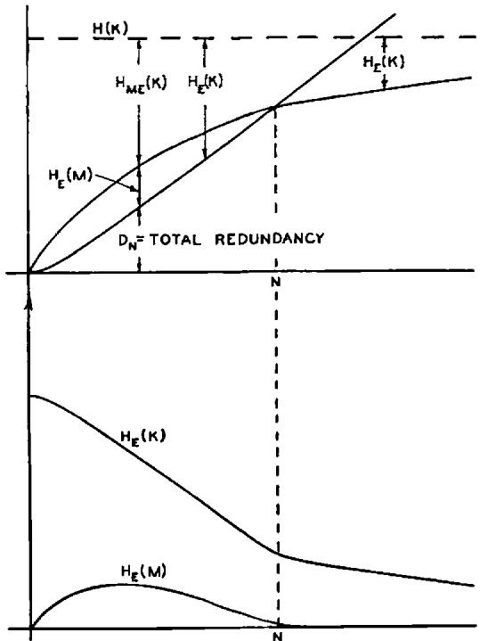

# Communication Theory of Secrecy Systems*

By C. E. SHANNON

# 1. INTRODUCTION AND SUMMARY

THE problems of cryptography and secrecy systems furnish an interesting application of communication theory. In this paper a theory of secrecy systems is developed. The approach is on a theoretical level and is intended to complement the treatment found in standard works on cryptography. There, a detailed study is made of the many standard types of codes and ciphers, and of the ways of breaking them. We will be more concerned with the general mathematical structure and properties of secrecy systems.

The treatment is limited in certain ways. First, there are three general types of secrecy system: (1) concealment systems, including such methods as invisible ink, concealing a message in an innocent text, or in a fake covering cryptogram, or other methods in which the existence of the message is concealed from the enemy; (2) privacy systems, for example speech inversion, in which special equipment is required to recover the message; (3) "true" secrecy systems where the meaning of the message is concealed by cipher, code, etc., although its existence is not hidden, and the enemy is assumed to have any special equipment necessary to intercept and record the transmitted signal. We consider only the third type—concealment systems are primarily a psychological problem, and privacy systems a technological one.

Secondly, the treatment is limited to the case of discrete information, where the message to be enciphered consists of a sequence of discrete symbols, each chosen from a finite set. These symbols may be letters in a language, words of a language, amplitude levels of a "quantized" speech or video signal, etc., but the main emphasis and thinking has been concerned with the case of letters.

The paper is divided into three parts. The main results will now be briefly summarized. The first part deals with the basic mathematical structure of secrecy systems. As in communication theory a language is considered to

* The material in this paper appeared originally in a confidential report “A Mathematical Theory of Cryptography” dated Sept. 1, 1945, which has now been declassified.

1 Shannon, C. E., “A Mathematical Theory of Communication,” Bell System Technical Journal, July 1948, p. 379; Oct. 1948, p. 623.

2 See, for example, H. F. Gaines, "Elementary Cryptanalysis," or M. Givierge, "Cours de Cryptographic."

be represented by a stochastic process which produces a discrete sequence of symbols in accordance with some system of probabilities. Associated with a language there is a certain parameter  $D$  which we call the redundancy of the language.  $D$  measures, in a sense, how much a text in the language can be reduced in length without losing any information. As a simple example, since  $u$  always follows  $q$  in English words, the  $u$  may be omitted without loss. Considerable reductions are possible in English due to the statistical structure of the language, the high frequencies of certain letters or words, etc. Redundancy is of central importance in the study of secrecy systems.

A secrecy system is defined abstractly as a set of transformations of one space (the set of possible messages) into a second space (the set of possible cryptograms). Each particular transformation of the set corresponds to enciphering with a particular key. The transformations are supposed reversible (non-singular) so that unique deciphering is possible when the key is known.

Each key and therefore each transformation is assumed to have an a priori probability associated with it—the probability of choosing that key. Similarly each possible message is assumed to have an associated a priori probability, determined by the underlying stochastic process. These probabilities for the various keys and messages are actually the enemy cryptanalyst's a priori probabilities for the choices in question, and represent his a priori knowledge of the situation.

To use the system a key is first selected and sent to the receiving point. The choice of a key determines a particular transformation in the set forming the system. Then a message is selected and the particular transformation corresponding to the selected key applied to this message to produce a cryptogram. This cryptogram is transmitted to the receiving point by a channel and may be intercepted by the "enemy*." At the receiving end the inverse of the particular transformation is applied to the cryptogram to recover the original message.

If the enemy intercepts the cryptogram he can calculate from it the a posteriori probabilities of the various possible messages and keys which might have produced this cryptogram. This set of a posteriori probabilities constitutes his knowledge of the key and message after the interception. "Knowledge" is thus identified with a set of propositions having associated probabilities. The calculation of the a posteriori probabilities is the generalized problem of cryptanalysis.

As an example of these notions, in a simple substitution cipher with random key there are 26! transformations, corresponding to the 26! ways we

*The word "enemy," stemming from military applications, is commonly used in cryptographic work to denote anyone who may intercept a cryptogram.

can substitute for 26 different letters. These are all equally likely and each therefore has an a priori probability  $1/26!$ . If this is applied to "normal English" the cryptanalyst being assumed to have no knowledge of the message source other than that it is producing English text, the a priori probabilities of various messages of  $N$  letters are merely their relative frequencies in normal English text.

If the enemy intercepts  $N$  letters of cryptogram in this system his probabilities change. If  $N$  is large enough (say 50 letters) there is usually a single message of a posteriori probability nearly unity, while all others have a total probability nearly zero. Thus there is an essentially unique "solution" to the cryptogram. For  $N$  smaller (say  $N = 15$ ) there will usually be many messages and keys of comparable probability, with no single one nearly unity. In this case there are multiple "solutions" to the cryptogram.

Considering a secrecy system to be represented in this way, as a set of transformations of one set of elements into another, there are two natural combining operations which produce a third system from two given systems. The first combining operation is called the product operation and corresponds to enciphering the message with the first secrecy system  $R$  and enciphering the resulting cryptogram with the second system  $S$ , the keys for  $R$  and  $S$  being chosen independently. This total operation is a secrecy system whose transformations consist of all the products (in the usual sense of products of transformations) of transformations in  $S$  with transformations in  $R$ . The probabilities are the products of the probabilities for the two transformations.

The second combining operation is "weighted addition."

$$
T = p R + q S \quad p + q = 1
$$

It corresponds to making a preliminary choice as to whether system  $R$  or  $S$  is to be used with probabilities  $p$  and  $q$ , respectively. When this is done  $R$  or  $S$  is used as originally defined.

It is shown that secrecy systems with these two combining operations form essentially a "linear associative algebra" with a unit element, an algebraic variety that has been extensively studied by mathematicians.

Among the many possible secrecy systems there is one type with many special properties. This type we call a "pure" system. A system is pure if all keys are equally likely and if for any three transformations  $T_{i}, T_{j}, T_{k}$  in the set the product

$$
T _ {t} T _ {j} ^ {- 1} T _ {k}
$$

is also a transformation in the set. That is enciphering, deciphering, and enciphering with any three keys must be equivalent to enciphering with some key.

With a pure cipher it is shown that all keys are essentially equivalent—they all lead to the same set of  $a$  posteriori probabilities. Furthermore, when a given cryptogram is intercepted there is a set of messages that might have produced this cryptogram (a “residue class”) and the  $a$  posteriori probabilities of messages in this class are proportional to the  $a$  priori probabilities. All the information the enemy has obtained by intercepting the cryptogram is a specification of the residue class. Many of the common ciphers are pure systems, including simple substitution with random key. In this case the residue class consists of all messages with the same pattern of letter repetitions as the intercepted cryptogram.

Two systems  $R$  and  $S$  are defined to be "similar" if there exists a fixed transformation  $A$  with an inverse,  $A^{-1}$ , such that

$$
R = A S.
$$

If  $R$  and  $S$  are similar, a one-to-one correspondence between the resulting cryptograms can be set up leading to the same a posteriori probabilities. The two systems are crypt analytically the same.

The second part of the paper deals with the problem of "theoretical secrecy." How secure is a system against cryptanalysis when the enemy has unlimited time and manpower available for the analysis of intercepted cryptograms? The problem is closely related to questions of communication in the presence of noise, and the concepts of entropy and equivocation developed for the communication problem find a direct application in this part of cryptography.

"Perfect Secrecy" is defined by requiring of a system that after a cryptogram is intercepted by the enemy the  $a$  posteriori probabilities of this cryptogram representing various messages be identically the same as the  $a$  priori probabilities of the same messages before the interception. It is shown that perfect secrecy is possible but requires, if the number of messages is finite, the same number of possible keys. If the message is thought of as being constantly generated at a given "rate"  $R$  (to be defined later), key must be generated at the same or a greater rate.

If a secrecy system with a finite key is used, and  $N$  letters of cryptogram intercepted, there will be, for the enemy, a certain set of messages with certain probabilities, that this cryptogram could represent. As  $N$  increases the field usually narrows down until eventually there is a unique "solution" to the cryptogram; one message with probability essentially unity while all others are practically zero. A quantity  $H(N)$  is defined, called the equivocation, which measures in a statistical way how near the average cryptogram of  $N$  letters is to a unique solution; that is, how uncertain the enemy is of the original message after intercepting a cryptogram of  $N$  letters. Various properties of the equivocation are deduced—for example, the equivocation

of the key never increases with increasing  $N$ . This equivocation is a theoretical secrecy index—theoretical in that it allows the enemy unlimited time to analyse the cryptogram.

The function  $H(N)$  for a certain idealized type of cipher called the random cipher is determined. With certain modifications this function can be applied to many cases of practical interest. This gives a way of calculating approximately how much intercepted material is required to obtain a solution to a secrecy system. It appears from this analysis that with ordinary languages and the usual types of ciphers (not codes) this "unicity distance" is approximately  $H(K) / D$ . Here  $H(K)$  is a number measuring the "size" of the key space. If all keys are a priori equally likely  $H(K)$  is the logarithm of the number of possible keys.  $D$  is the redundancy of the language and measures the amount of "statistical constraint" imposed by the language. In simple substitution with random key  $H(K)$  is  $\log_{10} 26!$  or about 20 and  $D$  (in decimal digits per letter) is about .7 for English. Thus unicity occurs at about 30 letters.

It is possible to construct secrecy systems with a finite key for certain "languages" in which the equivocation does not approach zero as  $N \to \infty$ . In this case, no matter how much material is intercepted, the enemy still does not obtain a unique solution to the cipher but is left with many alternatives, all of reasonable probability. Such systems we call ideal systems. It is possible in any language to approximate such behavior—i.e., to make the approach to zero of  $H(N)$  recede out to arbitrarily large  $N$ . However, such systems have a number of drawbacks, such as complexity and sensitivity to errors in transmission of the cryptogram.

The third part of the paper is concerned with "practical secrecy." Two systems with the same key size may both be uniquely solvable when  $N$  letters have been intercepted, but differ greatly in the amount of labor required to effect this solution. An analysis of the basic weaknesses of secrecy systems is made. This leads to methods for constructing systems which will require a large amount of work to solve. Finally, a certain incompatibility among the various desirable qualities of secrecy systems is discussed.

# PART I

# MATHEMATICAL STRUCTURE OF SECRECY SYSTEMS

# 2. SECRECY SYSTEMS

As a first step in the mathematical analysis of cryptography, it is necessary to idealize the situation suitably, and to define in a mathematically acceptable way what we shall mean by a secrecy system. A "schematic" diagram of a general secrecy system is shown in Fig. 1. At the transmitting

end there are two information sources—a message source and a key source. The key source produces a particular key from among those which are possible in the system. This key is transmitted by some means, supposedly not interceptible, for example by messenger, to the receiving end. The message source produces a message (the “clear”) which is enciphered and the resulting cryptogram sent to the receiving end by a possibly interceptible means, for example radio. At the receiving end the cryptogram and key are combined in the decipher to recover the message.

Fig. 1—Schematic of a general secrecy system.

Evidently the encipherer performs a functional operation. If  $M$  is the message,  $K$  the key, and  $E$  the enciphered message, or cryptogram, we have

$$
E = f (M, K)
$$

that is  $E$  is a function of  $M$  and  $K$ . It is preferable to think of this, however, not as a function of two variables but as a (one parameter) family of operations or transformations, and to write it

$$
E = T _ {i} M.
$$

The transformation  $T_{i}$  applied to message  $M$  produces a cryptogram  $E$ . The index  $i$  corresponds to the particular key being used.

We will assume, in general, that there are only a finite number of possible keys, and that each has an associated probability  $p_i$ . Thus the key source is represented by a statistical process or device which chooses one from the set of transformations  $T_1, T_2, \dots, T_m$  with the respective probabilities  $p_1, p_2, \dots, p_m$ . Similarly we will generally assume a finite number of possible messages  $M_1, M_2, \dots, M_n$  with associated a priori probabilities  $q_1, q_2, \dots, q_n$ . The possible messages, for example, might be the possible sequences of English letters all of length  $N$ , and the associated probabilities are then

the relative frequencies of occurrence of these sequences in normal English text.

At the receiving end it must be possible to recover  $M$ , knowing  $E$  and  $K$ . Thus the transformations  $T_{i}$  in the family must have unique inverses  $T_{i}^{-1}$  such that  $T_{i}T_{i}^{-1} = I$ , the identity transformation. Thus:

$$
M = T _ {i} ^ {- 1} E.
$$

At any rate this inverse must exist uniquely for every  $E$  which can be obtained from an  $M$  with key  $i$ . Hence we arrive at the definition: A secrecy system is a family of uniquely reversible transformations  $T_{i}$  of a set of possible messages into a set of cryptograms, the transformation  $T_{i}$  having an associated probability  $p_{i}$ . Conversely any set of entities of this type will be called a "secrety system." The set of possible messages will be called, for convenience, the "message space" and the set of possible cryptograms the "cryptogram space."

Two secrecy systems will be the same if they consist of the same set of transformations  $T_{i}$ , with the same message and cryptogram space (range and domain) and the same probabilities for the keys.

A secrecy system can be visualized mechanically as a machine with one or more controls on it. A sequence of letters, the message, is fed into the input of the machine and a second series emerges at the output. The particular setting of the controls corresponds to the particular key being used. Some statistical method must be prescribed for choosing the key from all the possible ones.

To make the problem mathematically tractable we shall assume that the enemy knows the system being used. That is, he knows the family of transformations  $T_{i}$ , and the probabilities of choosing various keys. It might be objected that this assumption is unrealistic, in that the cryptanalyst often does not know what system was used or the probabilities in question. There are two answers to this objection:

1. The restriction is much weaker than appears at first, due to our broad definition of what constitutes a secrecy system. Suppose a cryptographer intercepts a message and does not know whether a substitution, transposition, or Vigenère type cipher was used. He can consider the message as being enciphered by a system in which part of the key is the specification of which of these types was used, the next part being the particular key for that type. These three different possibilities are assigned probabilities according to his best estimates of the a priori probabilities of the encipherer using the respective types of cipher.

2. The assumption is actually the one ordinarily used in cryptographic studies. It is pessimistic and hence safe, but in the long run realistic, since one must expect his system to be found out eventually. Thus,

even when an entirely new system is devised, so that the enemy cannot assign any a priori probability to it without discovering it himself, one must still live with the expectation of his eventual knowledge.

The situation is similar to that occurring in the theory of games3 where it is assumed that the opponent "finds out" the strategy of play being used. In both cases the assumption serves to delineate sharply the opponent's knowledge.

A second possible objection to our definition of secrecy systems is that no account is taken of the common practice of inserting nulls in a message and the use of multiple substitutes. In such cases there is not a unique cryptogram for a given message and key, but the encipherer can choose at will from among a number of different cryptograms. This situation could be handled, but would only add complexity at the present stage, without substantially altering any of the basic results.

If the messages are produced by a Markoff process of the type described in (1) to represent an information source, the probabilities of various messages are determined by the structure of the Markoff process. For the present, however, we wish to take a more general view of the situation and regard the messages as merely an abstract set of entities with associated probabilities, not necessarily composed of a sequence of letters and not necessarily produced by a Markoff process.

It should be emphasized that throughout the paper a secrecy system means not one, but a set of many transformations. After the key is chosen only one of these transformations is used and one might be led from this to define a secrecy system as a single transformation on a language. The enemy, however, does not know what key was chosen and the "might have been" keys are as important for him as the actual one. Indeed it is only the existence of these other possibilities that gives the system any secrecy. Since the secrecy is our primary interest, we are forced to the rather elaborate concept of a secrecy system defined above. This type of situation, where possibilities are as important as actualities, occurs frequently in games of strategy. The course of a chess game is largely controlled by threats which are not carried out. Somewhat similar is the "virtual existence" of unrealized imputations in the theory of games.

It may be noted that a single operation on a language forms a degenerate type of secrecy system under our definition—a system with only one key of unit probability. Such a system has no secrecy—the cryptanalyst finds the message by applying the inverse of this transformation, the only one in the system, to the intercepted cryptogram. The decipher and cryptanalyst in this case possess the same information. In general, the only difference between the decipher's knowledge and the enemy cryptanalyst's knowledge

is that the decipher knows the particular key being used, while the cryptanalyst knows only the a priori probabilities of the various keys in the set. The process of deciphering is that of applying the inverse of the particular transformation used in enciphering to the cryptogram. The process of cryptanalysis is that of attempting to determine the message (or the particular key) given only the cryptogram and the a priori probabilities of various keys and messages.

There are a number of difficult epistemological questions connected with the theory of secrecy, or in fact with any theory which involves questions of probability (particularly a priori probabilities, Bayes' theorem, etc.) when applied to a physical situation. Treated abstractly, probability theory can be put on a rigorous logical basis with the modern measure theory approach.[45] As applied to a physical situation, however, especially when "subjective" probabilities and unrepeatable experiments are concerned, there are many questions of logical validity. For example, in the approach to secrecy made here, a priori probabilities of various keys and messages are assumed known by the enemy cryptographer—how can one determine operationally if his estimates are correct, on the basis of his knowledge of the situation?

One can construct artificial cryptographic situations of the "urn and die" type in which the a priori probabilities have a definite unambiguous meaning and the idealization used here is certainly appropriate. In other situations that one can imagine, for example an intercepted communication between Martian invaders, the a priori probabilities would probably be so uncertain as to be devoid of significance. Most practical cryptographic situations lie somewhere between these limits. A cryptanalyst might be willing to classify the possible messages into the categories "reasonable," "possible but unlikely" and "unreasonable," but feel that finer subdivision was meaningless.

Fortunately, in practical situations, only extreme errors in a priori probabilities of keys and messages cause significant errors in the important parameters. This is because of the exponential behavior of the number of messages and cryptograms, and the logarithmic measures employed.

# 3. REPRESENTATION OF SYSTEMS

A secrecy system as defined above can be represented in various ways. One which is convenient for illustrative purposes is a line diagram, as in Figs. 2 and 4. The possible messages are represented by points at the left and the possible cryptograms by points at the right. If a certain key, say key 1, transforms message  $M_{2}$  into ciphertext  $E_{4}$  then  $M_{2}$  and  $E_{4}$  are connected

4 See J. L. Doob, "Probability as Measure," Annals of Math. Stat., v. 12, 1941, pp. 206-214.

$^{6}$  A. Kolmogoroff, "Grundbegriffe der Wahrscheinlichkeits rechnung," Ergebnisse der Mathematic, v. 2, No. 3 (Berlin 1933).

by a line labeled 1, etc. From each possible message there must be exactly one line emerging for each different key. If the same is true for each cryptogram, we will say that the system is closed.

A more common way of describing a system is by stating the operation one performs on the message for an arbitrary key to obtain the cryptogram. Similarly, one defines implicitly the probabilities for various keys by describing how a key is chosen or what we know of the enemy's habits of key choice. The probabilities for messages are implicitly determined by stating our a priori knowledge of the enemy's language habits, the tactical situation (which will influence the probable content of the message) and any special information we may have regarding the cryptogram.

Fig. 2—Line drawings for simple systems.

# 4. SOME EXAMPLES OF SECRECY SYSTEMS

In this section a number of examples of ciphers will be given. These will often be referred to in the remainder of the paper for illustrative purposes.

# 1. Simple Substitution Cipher.

In this cipher each letter of the message is replaced by a fixed substitute, usually also a letter. Thus the message,

$$
M = m _ {1} m _ {2} m _ {3} m _ {4} \dots
$$

where  $m_{1}, m_{2}, \cdots$  are the successive letters becomes:

$$
\begin{array}{l} E = e _ {1} e _ {2} e _ {3} e _ {4} \dots \\ = f (m _ {1}) f (m _ {2}) f (m _ {3}) f (m _ {4}) \dots \\ \end{array}
$$

where the function  $f(m)$  is a function with an inverse. The key is a permutation of the alphabet (when the substitutes are letters) e.g.  $X G U A C D T B F H R S L M Q V Y Z W I E J O K N P$ . The first letter  $X$  is the substitute for  $A, G$  is the substitute for  $B$ , etc.

# 2. Transposition (Fixed Period  $d$ ).

The message is divided into groups of length  $d$  and a permutation applied to the first group, the same permutation to the second group, etc. The permutation is the key and can be represented by a permutation of the first  $d$  integers. Thus, for  $d = 5$ , we might have 23154 as the permutation. This means that:

$$
m _ {1} m _ {2} m _ {3} m _ {4} m _ {5} m _ {6} m _ {7} m _ {8} m _ {9} m _ {1 0} \dots \text {b e c o m e s}
$$

$$
m _ {2} m _ {3} m _ {1} m _ {5} m _ {4} m _ {7} m _ {8} m _ {6} m _ {1 0} m _ {9} \dots .
$$

Sequential application of two or more transpositions will be called compound transposition. If the periods are  $d_1, d_2, \dots, d_s$ , it is clear that the result is a transposition of period  $d$ , where  $d$  is the least common multiple of  $d_1, d_2, \dots, d_s$ .

# 3. Vignere, and Variations.

In the Vigenère cipher the key consists of a series of  $d$  letters. These are written repeatedly below the message and the two added modulo 26 (considering the alphabet numbered from  $A = 0$  to  $Z = 25$ . Thus

$$
e _ {i} = m _ {i} + k _ {i} (\text {m o d} 2 6)
$$

where  $k_i$  is of period  $d$  in the index  $i$ . For example, with the key  $G \wedge H$ , we obtain

$$
m e a s g a \quad N O W I S T H E \dots
$$

$$
\text {r e p e a t e d k e y} \quad G A H G A H G A \dots
$$

$$
\text {c r e p t o g r a m} \quad T O D O S A N E \dots
$$

The Vigenère of period 1 is called the Caesar cipher. It is a simple substitution in which each letter of  $M$  is advanced a fixed amount in the alphabet. This amount is the key, which may be any number from 0 to 25. The so-called Beaufort and Variant Beaufort are similar to the Vigenère, and encipher by the equations

$$
e _ {i} = k _ {i} - m _ {i} (\text {m o d} 2 6)
$$

and

$$
e _ {i} = m _ {i} - k _ {i} (\text {m o d} 2 6)
$$

respectively. The Beaufort of period one is called the reversed Caesar cipher.

The application of two or more Vigenères in sequence will be called the compound Vigenère. It has the equation

$$
e _ {i} = m _ {i} + k _ {i} + l _ {i} + \dots + s _ {i} (\text {m o d} 2 6)
$$

where  $k_{i}, l_{i}, \dots, s_{i}$  in general have different periods. The period of their sum,

$$
k _ {i} + l _ {i} + \dots + s _ {i}
$$

as in compound transposition, is the least common multiple of the individual periods.

When the Vigenère is used with an unlimited key, never repeating, we have the Vernam system, $^6$  with

$$
e _ {i} = m _ {i} + k _ {i} (\text {m o d} 2 6)
$$

the  $k_{i}$  being chosen at random and independently among 0, 1,  $\cdots$ , 25. If the key is a meaningful text we have the "running key" cipher.

# 4. Digram, Trigram, and  $N$ -gram substitution.

Rather than substitute for letters one can substitute for digrams, trigrams, etc. General digram substitution requires a key consisting of a permutation of the  $26^2$  digrams. It can be represented by a table in which the row corresponds to the first letter of the digram and the column to the second letter, entries in the table being the substitutes (usually also digrams).

# 5. Single Mixed Alphabet Vigenère.

This is a simple substitution followed by a Vigenère.

$$
e _ {i} = f (m _ {i}) + k _ {i}
$$

$$
m _ {i} = f ^ {- 1} \left(e _ {i} - k _ {i}\right)
$$

The "inverse" of this system is a Vigenère followed by simple substitution

$$
e _ {i} = g \left(m _ {i} + k _ {i}\right)
$$

$$
m _ {i} = g ^ {- 1} \left(e _ {i}\right) - k _ {i}
$$

# 6. Matrix System.7

One method of  $n$ -gram substitution is to operate on successive  $n$ -grams with a matrix having an inverse. The letters are assumed numbered from 0 to 25, making them elements of an algebraic ring. From the  $n$ -gram  $m_1m_2 \cdots m_n$  of message, the matrix  $a_{ij}$  gives an  $n$ -gram of cryptogram

$$
e _ {i} = \sum_ {j = 1} ^ {n} a _ {i j} m _ {j} \quad i = 1, \dots , n
$$

The matrix  $a_{ij}$  is the key, and deciphering is performed with the inverse matrix. The inverse matrix will exist if and only if the determinant  $|a_{ij}|$  has an inverse element in the ring.

# 7. The Playfair Cipher.

This is a particular type of digram substitution governed by a mixed 25 letter alphabet written in a  $5 \times 5$  square. (The letter  $J$  is often dropped in cryptographic work—it is very infrequent, and when it occurs can be replaced by  $I$ .) Suppose the key square is as shown below:

$$
\begin{array}{c c c c c} L & Z & Q & C & P \\ A & G & N & O & U \\ R & D & M & I & F \\ K & Y & H & V & S \\ X & B & T & E & W \end{array}
$$

The substitute for a digram  $AC$ , for example, is the pair of letters at the other corners of the rectangle defined by  $A$  and  $C$ , i.e.,  $LO$ , the  $L$  taken first since it is above  $A$ . If the digram letters are on a horizontal line as  $RI$ , one uses the letters to their right  $DF$ ;  $RF$  becomes  $DR$ . If the letters are on a vertical line, the letters below them are used. Thus  $PS$  becomes  $UW$ . If the letters are the same nulls may be used to separate them or one may be omitted, etc.

# 8. Multiple Mixed Alphabet Substitution.

In this cipher there are a set of  $d$  simple substitutions which are used in sequence. If the period  $d$  is four

$$
m _ {1} m _ {2} m _ {3} m _ {4} m _ {5} m _ {6} \dots
$$

becomes

$$
f _ {1} (m _ {1}) f _ {2} (m _ {2}) f _ {3} (m _ {3}) f _ {4} (m _ {4}) f _ {1} (m _ {5}) f _ {2} (m _ {6}) \dots
$$

# 9. Autokey Cipher.

A Vigenère type system in which either the message itself or the resulting cryptogram is used for the "key" is called an autokey cipher. The encipherment is started with a "priming key" (which is the entire key in our sense) and continued with the message or cryptogram displaced by the length of the priming key as indicated below, where the priming key is COMET. The message used as "key":

<table><tr><td>Message</td><td>S E N D S U P P L I E S···</td></tr><tr><td>Key</td><td>C O M E T S E N D S U P···</td></tr><tr><td>Cryptogram</td><td>U S Z H L M T C O A Y H</td></tr></table>

The cryptogram used as "key":

<table><tr><td>Message</td><td>S E N D S U P P L I E S···</td></tr><tr><td>Key</td><td>C O M E T U S Z H L O H···</td></tr><tr><td>Cryptogram</td><td>U S Z H L O H O S T S···</td></tr></table>

# 10. Fractional Ciphers.

In these, each letter is first enciphered into two or more letters or numbers and these symbols are somehow mixed (e.g. by transposition). The result may then be retranslated into the original alphabet. Thus, using a mixed 25-letter alphabet for the key, we may translate letters into two-digit quinary numbers by the table:

<table><tr><td>0</td><td>1</td><td>2</td><td>3</td><td>4</td><td></td></tr><tr><td>0</td><td>L</td><td>Z</td><td>Q</td><td>CP</td><td></td></tr><tr><td>1</td><td>A</td><td>G</td><td>N</td><td>O</td><td>U</td></tr><tr><td>2</td><td>R</td><td>D</td><td>M</td><td>I</td><td>F</td></tr><tr><td>3</td><td>K</td><td>Y</td><td>H</td><td>V</td><td>S</td></tr><tr><td>4</td><td>X</td><td>B</td><td>T</td><td>E</td><td>W</td></tr></table>

Thus  $B$  becomes +1. After the resulting series of numbers is transposed in some way they are taken in pairs and translated back into letters.

# 11. Codes.

In codes words (or sometimes syllables) are replaced by substitute letter groups. Sometimes a cipher of one kind or another is applied to the result.

# 5. VALUATIONS OF SECRECY SYSTEMS

There are a number of different criteria that should be applied in estimating the value of a proposed secrecy system. The most important of these are:

# 1. Amount of Secrecy.

There are some systems that are perfect—the enemy is no better off after intercepting any amount of material than before. Other systems, although giving him some information, do not yield a unique "solution" to intercepted cryptograms. Among the uniquely solvable systems, there are wide variations in the amount of labor required to effect this solution and in the amount of material that must be intercepted to make the solution unique.

# 2. Size of Key.

The key must be transmitted by non-interceptible means from transmitting to receiving points. Sometimes it must be memorized. It is therefore desirable to have the key as small as possible.

# 3. Complexity of Enciphering and Deciphering Operations.

Enciphering and deciphering should, of course, be as simple as possible. If they are done manually, complexity leads to loss of time, errors, etc. If done mechanically, complexity leads to large expensive machines.

# 4. Propagation of Errors.

In certain types of ciphers an error of one letter in enciphering or transmission leads to a large number of errors in the deciphered text. The errors are spread out by the deciphering operation, causing the loss of much information and frequent need for repetition of the cryptogram. It is naturally desirable to minimize this error expansion.

# 5. Expansion of Message.

In some types of secrecy systems the size of the message is increased by the enciphering process. This undesirable effect may be seen in systems where one attempts to swamp out message statistics by the addition of many nulls, or where multiple substitutes are used. It also occurs in many "concealment" types of systems (which are not usually secrecy systems in the sense of our definition).

# 6. THE ALGEBRA OF SECRECY SYSTEMS

If we have two secrecy systems  $T$  and  $R$  we can often combine them in various ways to form a new secrecy system  $S$ . If  $T$  and  $R$  have the same domain (message space) we may form a kind of "weighted sum,"

$$
S = p T + q R
$$

where  $p + q = 1$ . This operation consists of first making a preliminary choice with probabilities  $p$  and  $q$  determining which of  $T$  and  $R$  is used. This choice is part of the key of  $S$ . After this is determined  $T$  or  $R$  is used as originally defined. The total key of  $S$  must specify which of  $T$  and  $R$  is used and which key of  $T$  (or  $R$ ) is used.

If  $T$  consists of the transformations  $T_{1}, \dots, T_{m}$  with probabilities  $p_{1}, \dots, p_{m}$  and  $R$  consists of  $R_{1}, \dots, R_{k}$  with probabilities  $q_{1}, \dots, q_{k}$  then  $S = pT + qR$  consists of the transformations  $T_{1}, T_{2}, \dots, T_{m}, R_{1}, \dots, R_{k}$  with probabilities  $pp_{1}, pp_{2}, \dots, pp_{m}, qq_{1}, qq_{2}, \dots, qq_{k}$  respectively.

More generally we can form the sum of a number of systems.

$$
S = p _ {1} T + p _ {2} R + \dots + p _ {m} U ^ {\prime} \quad \sum p _ {i} = 1
$$

We note that any system  $T$  can be written as a sum of fixed operations

$$
T = p _ {1} T _ {1} + p _ {2} T _ {2} + \dots + p _ {m} T _ {m}
$$

$T_{i}$  being a definite enciphering operation of  $T$  corresponding to key choice  $i$ , which has probability  $p_i$ .

A second way of combining two secrecy systems is by taking the "product," shown schematically in Fig. 3. Suppose  $T$  and  $R$  are two systems and the domain (language space) of  $R$  can be identified with the range (cryptogram space) of  $T$ . Then we can apply first  $T$  to our language and then  $R$

Fig. 3—Product of two systems  $S = RT$ .

to the result of this enciphering process. This gives a resultant operation  $S$  which we write as a product

$$
S = R T
$$

The key for  $S$  consists of both keys of  $T$  and  $R$  which are assumed chosen according to their original probabilities and independently. Thus, if the  $m$  keys of  $T$  are chosen with probabilities

$$
p _ {1} p _ {2} \dots p _ {m}
$$

and the  $n$  keys of  $R$  have probabilities

$$
p _ {1} ^ {\prime} p _ {2} ^ {\prime} \dots p _ {n} ^ {\prime},
$$

then  $S$  has at most  $mn$  keys with probabilities  $p_i p_j'$ . In many cases some of the product transformations  $R_i T_j$  will be the same and can be grouped together, adding their probabilities.

Product encipherment is often used; for example, one follows a substitution by a transposition or a transposition by a Vigenère, or applies a code to the text and enciphers the result by substitution, transposition, fractionation, etc.

It may be noted that multiplication is not in general commutative, (we do not always have  $RS = SR$ ), although in special cases, such as substitution and transposition, it is. Since it represents an operation it is definitionally associative. That is  $R(ST) = (RS)T = RST$ . Furthermore we have the laws

$$
p \left(p ^ {\prime} T + q ^ {\prime} R\right) + q S = p p ^ {\prime} T + p q ^ {\prime} R + q S
$$

(weighted associative law for addition)

$$
T (p R + q S) = p T R + q T S
$$

$$
(p R + q S) T = p R T + q S T
$$

(right and left hand distributive laws) and

$$
p _ {1} T + p _ {2} T + p _ {3} R = \left(p _ {1} + p _ {2}\right) T + p _ {3} R
$$

It should be emphasized that these combining operations of addition and multiplication apply to secrecy systems as a whole. The product of two systems  $TR$  should not be confused with the product of the transformations in the systems  $T_{i}R_{j}$ , which also appears often in this work. The former  $TR$  is a secrecy system, i.e., a set of transformations with associated probabilities; the latter is a particular transformation. Further the sum of two systems  $pR + qT$  is a system—the sum of two transformations is not defined. The systems  $T$  and  $R$  may commute without the individual  $T_{i}$  and  $R_{j}$  commuting, e.g., if  $R$  is a Beaufort system of a given period, all keys equally likely,

$$
R _ {i} R _ {j} \rightleftharpoons R _ {j} R _ {i}
$$

in general, but of course  $RR$  does not depend on its order; actually

$$
R R = V
$$

the Vigenère of the same period with random key. On the other hand, if the individual  $T_{i}$  and  $R_{j}$  of two systems  $T$  and  $R$  commute, then the systems commute.

A system whose  $M$  and  $E$  spaces can be identified, a very common case as when letter sequences are transformed into letter sequences, may be termed endomorphic. An endomorphic system  $T$  may be raised to a power  $T^n$ .

A secrecy system  $T$  whose product with itself is equal to  $T$ , i.e., for which

$$
T T = T,
$$

will be called idempotent. For example, simple substitution, transposition of period  $p$ , Vigenère of period  $p$  (all with each key equally likely) are idempotent.

The set of all endomorphic secrecy systems defined in a fixed message space constitutes an "algebraic variety," that is, a kind of algebra, using the operations of addition and multiplication. In fact, the properties of addition and multiplication which we have discussed may be summarized as follows:

The set of endomorphic ciphers with the same message space and the two combining operations of weighted addition and multiplication form a linear associative algebra with a unit element, apart from the fact that the coefficients in a weighted addition must be non-negative and sum to unity.

The combining operations give us ways of constructing many new types of secrecy systems from certain ones, such as the examples given. We may also use them to describe the situation facing a cryptanalyst when attempting to solve a cryptogram of unknown type. He is, in fact, solving a secrecy system of the type

$$
T = p _ {1} A + p _ {2} B + \dots + p _ {r} S + p ^ {\prime} X \quad \sum p = 1
$$

where the  $A, B, \cdots, S$  are known types of ciphers, with the  $p_i$  their a priori probabilities in this situation, and  $p'X$  corresponds to the possibility of a completely new unknown type of cipher.

# 7. PURE AND MIXED CIPHERS

Certain types of ciphers, such as the simple substitution, the transposition of a given period, the Vigenère of a given period, the mixed alphabet Vigenère, etc. (all with each key equally likely) have a certain homogeneity with respect to key. Whatever the key, the enciphering, deciphering and decrypting processes are essentially the same. This may be contrasted with the cipher

$$
p S + q T
$$

where  $S$  is a simple substitution and  $T$  a transposition of a given period. In this case the entire system changes for enciphering, deciphering and decryption, depending on whether the substitution or transposition is used.

The cause of the homogeneity in these systems stems from the group property—we notice that, in the above examples of homogeneous ciphers, the product  $T_{i}T_{j}$  of any two transformations in the set is equal to a third transformation  $T_{k}$  in the set. On the other hand  $T_{i}S_{j}$  does not equal any transformation in the cipher

$$
p S + q T
$$

which contains only substitutions and transpositions, no products.

We might define a "pure" cipher, then, as one whose  $T_{i}$  form a group. This, however, would be too restrictive since it requires that the  $E$  space

be the same as the  $M$  space, i.e. that the system be endomorphic. The fractional transposition is as homogeneous as the ordinary transposition without being endomorphic. The proper definition is the following: A cipher  $T$  is pure if for every  $T_{i}, T_{j}, T_{k}$  there is a  $T_{s}$  such that

$$
T _ {i} T _ {j} ^ {- 1} T _ {k} = T _ {s}
$$

and every key is equally likely. Otherwise the cipher is mixed. The systems of Fig. 2 are mixed. Fig. 4 is pure if all keys are equally likely.

Theorem 1: In a pure cipher the operations  $T_{i}^{-1}T_{j}$  which transform the message space into itself form a group whose order is  $m$ , the number of different keys.

For

$$
T _ {j} ^ {- 1} T _ {k} T _ {k} ^ {- 1} T _ {j} = I
$$

so that each element has an inverse. The associative law is true since these are operations, and the group property follows from

$$
T _ {i} ^ {- 1} T _ {j} T _ {k} ^ {- 1} T _ {l} = T _ {s} ^ {- 1} T _ {k} T _ {k} ^ {- 1} T _ {l} = T _ {s} ^ {- 1} T _ {l}
$$

using our assumption that  $T_{i}^{-1}T_{j} = T_{s}^{-1}T_{k}$  for some  $s$ .

The operation  $T_{i}^{-1}T_{j}$  means, of course, enciphering the message with key  $j$  and then deciphering with key  $i$  which brings us back to the message space. If  $T$  is endomorphic, i.e. the  $T_{i}$  themselves transform the space  $\Omega_{M}$  into itself (as is the case with most ciphers, where both the message space and the cryptogram space consist of sequences of letters), and the  $T_{i}$  are a group and equally likely, then  $T$  is pure, since

$$
T _ {i} T _ {j} ^ {- 1} T _ {k} = T _ {i} T _ {r} = T _ {s}.
$$

Theorem 2: The product of two pure ciphers which commute is pure.

For if  $T$  and  $R$  commute  $T_{i}R_{j} = R_{l}T_{m}$  for every  $i,j$  with suitable  $l,m$ , and

$$
\begin{array}{l} T _ {i} R _ {j} \left(T _ {k} R _ {l}\right) ^ {- 1} T _ {m} R _ {n} = T _ {i} R _ {j} R _ {l} ^ {- 1} T _ {k} ^ {- 1} T _ {m} R _ {n} \\ = R _ {u} R _ {v} ^ {- 1} R _ {w} T _ {r} T _ {s} ^ {- 1} T _ {t} \\ = R _ {h} T _ {\varrho}. \\ \end{array}
$$

The commutation condition is not necessary, however, for the product to be a pure cipher.

A system with only one key, i.e., a single definite operation  $T_{1}$ , is pure since the only choice of indices is

$$
T _ {1} T _ {1} ^ {- 1} T _ {1} = T _ {1}.
$$

Thus the expansion of a general cipher into a sum of such simple transformations also exhibits it as a sum of pure ciphers.

An examination of the example of a pure cipher shown in Fig. 4 discloses

certain properties. The messages fall into certain subsets which we will call residue classes, and the possible cryptograms are divided into corresponding residue classes. There is at least one line from each message in a class to each cryptogram in the corresponding class, and no line between classes which do not correspond. The number of messages in a class is a divisor of the total number of keys. The number of lines "in parallel" from a message  $M$  to a cryptogram in the corresponding class is equal to the number of keys divided by the number of messages in the class containing the message (or cryptogram). It is shown in the appendix that these hold in general for pure ciphers. Summarize formally, we have:

PURE SYSTEM

Fig. 4—Pure system.

Theorem 3: In a pure system the messages can be divided into a set of "residue classes"  $C_1, C_2, \dots, C_s$  and the cryptograms into a corresponding set of residue classes  $C_1', C_2', \dots, C_s'$  with the following properties:

(1) The message residue classes are mutually exclusive and collectively contain all possible messages. Similarly for the cryptogram residue classes.

(2) Enciphering any message in  $C_i$  with any key produces a cryptogram in  $C_i'$ . Deciphering any cryptogram in  $C_i'$  with any key leads to a message in  $C_i$ .

(3) The number of messages in  $C_i$ , say  $\varphi_i$ , is equal to the number of cryptograms in  $C_i'$  and is a divisor of  $k$  the number of keys.

(4) Each message in  $C_i$  can be enciphered into each cryptogram in  $C_i'$  by exactly  $k / \varphi_i$  different keys. Similarly for decipherment.

The importance of the concept of a pure cipher (and the reason for the name) lies in the fact that in a pure cipher all keys are essentially the same. Whatever key is used for a particular message, the  $a$  posteriori probabilities of all messages are identical. To see this, note that two different keys applied to the same message lead to two cryptograms in the same residue class, say  $C_i'$ . The two cryptograms therefore could each be deciphered by  $\frac{k}{\varphi_i}$  keys into each message in  $C_i$  and into no other possible messages. All keys being equally likely the  $a$  posteriori probabilities of various messages are thus

$$
P _ {E} (M) = \frac {P (M) P _ {M} (E)}{P (E)} = \frac {P (M) P _ {M} (E)}{\Sigma_ {M} P (M) P _ {M} (E)} = \frac {P (M)}{P \left(C _ {i}\right)}
$$

where  $M$  is in  $C_i$ ,  $E$  is in  $C_i'$  and the sum is over all messages in  $C_i$ . If  $E$  and  $M$  are not in corresponding residue classes,  $P_E(M) = 0$ . Similarly it can be shown that the a posteriori probabilities of the different keys are the same in value but these values are associated with different keys when a different key is used. The same set of values of  $P_E(K)$  have undergone a permutation among the keys. Thus we have the result

Theorem 4: In a pure system the a posteriori probabilities of various messages  $P_{E}(M)$  are independent of the key that is chosen. The a posteriori probabilities of the keys  $P_{E}(K)$  are the same in value but undergo a permutation with a different key choice.

Roughly we may say that any key choice leads to the same cryptanalytic problem in a pure cipher. Since the different keys all result in cryptograms in the same residue class this means that all cryptograms in the same residue class are cryptanalytically equivalent—they lead to the same a posteriori probabilities of messages and, apart from a permutation, the same probabilities of keys.

As an example of this, simple substitution with all keys equally likely is a pure cipher. The residue class corresponding to a given cryptogram  $E$  is the set of all cryptograms that may be obtained from  $E$  by operations  $T_{j}T_{k}^{-1}E$ . In this case  $T_{j}T_{k}^{-1}$  is itself a substitution and hence any substitution on  $E$  gives another member of the same residue class. Thus, if the cryptogram is

$$
E = X C P P G C F Q,
$$

then

$$
E _ {1} = R D H H G D S N
$$

$$
E _ {2} = A B C C D B E F
$$

etc. are in the same residue class. It is obvious in this case that these cryptograms are essentially equivalent. All that is of importance in a simple substitution with random key is the pattern of letter repetitions, the actual letters being dummy variables. Indeed we might dispense with them entirely, indicating the pattern of repetitions in  $E$  as follows:

This notation describes the residue class but eliminates all information as to the specific member of the class. Thus it leaves precisely that information which is cryptanalytically pertinent. This is related to one method of attacking simple substitution ciphers—the method of pattern words.

In the Caesar type cipher only the first differences mod 26 of the cryptogram are significant. Two cryptograms with the same  $\Delta e_i$  are in the same residue class. One breaks this cipher by the simple process of writing down the 26 members of the message residue class and picking out the one which makes sense.

The Vigenère of period  $d$  with random key is another example of a pure cipher. Here the message residue class consists of all sequences with the same first differences as the cryptogram, for letters separated by distance  $d$ . For  $d = 3$  the residue class is defined by

$$
\begin{array}{l} m _ {1} - m _ {4} = e _ {1} - e _ {4} \\ m _ {2} - m _ {5} = e _ {2} - e _ {5} \\ m _ {3} - m _ {6} = e _ {3} - e _ {6} \\ m _ {4} - m _ {7} = e _ {4} - e _ {7} \\ \end{array}
$$

.

.

.

where  $E = e_1, e_2, \dots$  is the cryptogram and  $m_1, m_2, \dots$  is any  $M$  in the corresponding residue class.

In the transposition cipher of period  $d$  with random key, the residue class consists of all arrangements of the  $e_i$  in which no  $e_i$  is moved out of its block of length  $d$ , and any two  $e_i$  at a distance  $d$  remain at this distance. This is used in breaking these ciphers as follows: The cryptogram is written in successive blocks of length  $d$ , one under another as below ( $d = 5$ ):

$$
\begin{array}{c c c c c} e _ {1} & e _ {2} & e _ {3} & e _ {4} & e _ {5} \\ e _ {6} & e _ {7} & e _ {8} & e _ {9} & e _ {1 0} \\ e _ {1 1} & e _ {1 2} & \cdot & \cdot & \cdot \\ \cdot & \cdot & \cdot & \cdot & \cdot \end{array}
$$

The columns are then cut apart and rearranged to make meaningful text. When the columns are cut apart, the only information remaining is the residue class of the cryptogram.

Theorem 5: If  $T$  is pure then  $T_{i}T_{j}^{-1}T = T$  where  $T_{i}T_{j}$  are any two transformations of  $T$ . Conversely if this is true for any  $T_{i}T_{j}$  in a system  $T$  then  $T$  is pure.

The first part of this theorem is obvious from the definition of a pure system. To prove the second part we note first that, if  $T_{i}T_{j}^{-1}T = T$ , then  $T_{i}T_{j}^{-1}T_{s}$  is a transformation of  $T$ . It remains to show that all keys are equiprobable. We have  $T = \sum_{s} p_{s}T_{s}$  and

$$
\sum_ {s} p _ {s} T _ {i} T _ {j} ^ {- 1} T _ {s} = \sum_ {s} p _ {s} T _ {s}.
$$

The term in the left hand sum with  $s = j$  yields  $p_j T_i$ . The only term in  $T_i$  on the right is  $p_i T_i$ . Since all coefficients are nonnegative it follows that

$$
p _ {j} \leq p _ {i}.
$$

The same argument holds with  $i$  and  $j$  interchanged and consequently

$$
p _ {j} = p _ {i}
$$

and  $T$  is pure. Thus the condition that  $T_{i}T_{j}^{-1}T = T$  might be used as an alternative definition of a pure system.

# 8. SIMILAR SYSTEMS

Two secrecy systems  $R$  and  $S$  will be said to be similar if there exists a transformation  $A$  having an inverse  $A^{-1}$  such that

$$
R = A S
$$

This means that enciphering with  $R$  is the same as enciphering with  $S$  and then operating on the result with the transformation  $A$ . If we write  $R \approx S$  to mean  $R$  is similar to  $S$  then it is clear that  $R \approx S$  implies  $S \approx R$ . Also  $R \approx S$  and  $S \approx T$  imply  $R \approx T$  and finally  $R \approx R$ . These are summarized by saying that similarity is an equivalence relation.

The cryptographic significance of similarity is that if  $R \approx S$  then  $R$  and  $S$  are equivalent from the cryptanalytic point of view. Indeed if a cryptanalyst intercepts a cryptogram in system  $S$  he can transform it to one in system  $R$  by merely applying the transformation  $A$  to it. A cryptogram in system  $R$  is transformed to one in  $S$  by applying  $A^{-1}$ . If  $R$  and  $S$  are applied to the same language or message space, there is a one-to-one correspondence between the resulting cryptograms. Corresponding cryptograms give the same distribution of a posteriori probabilities for all messages.

If one has a method of breaking the system  $R$  then any system  $S$  similar

to  $R$  can be broken by reducing to  $R$  through application of the operation  $A$ . This is a device that is frequently used in practical cryptanalysis.

As a trivial example, simple substitution where the substitutes are not letters but arbitrary symbols is similar to simple substitution using letter substitutes. A second example is the Caesar and the reversed Caesar type ciphers. The latter is sometimes broken by first transforming into a Caesar type. This can be done by reversing the alphabet in the cryptogram. The Vigenère, Beaufort and Variant Beaufort are all similar, when the key is random. The "autokey" cipher (with the message used as "key") primed with the key  $K_{1}K_{2}\dots K_{d}$  is similar to a Vigenère type with the key alternately added and subtracted Mod 26. The transformation  $A$  in this case is that of "deciphering" the autokey with a series of  $dA$ 's for the priming key.

# PART II

# THEORETICAL SECRECY

# 9. INTRODUCTION

We now consider problems connected with the "theoretical secrecy" of a system. How immune is a system to cryptanalysis when the cryptanalyst has unlimited time and manpower available for the analysis of cryptograms? Does a cryptogram have a unique solution (even though it may require an impractical amount of work to find it) and if not how many reasonable solutions does it have? How much text in a given system must be intercepted before the solution becomes unique? Are there systems which never become unique in solution no matter how much enciphered text is intercepted? Are there systems for which no information whatever is given to the enemy no matter how much text is intercepted? In the analysis of these problems the concepts of entropy, redundancy and the like developed in "A Mathematical Theory of Communication" (hereafter referred to as MTC) will find a wide application.

# 10. PERFECT SECRECY

Let us suppose the possible messages are finite in number  $M_1, \dots, M_n$  and have a priori probabilities  $P(M_1), \dots, P(M_n)$ , and that these are encapsided into the possible cryptograms  $E_1, \dots, E_m$  by

$$
E = T _ {i} M.
$$

The cryptanalyst intercepts a particular  $E$  and can then calculate, in principle at least, the a posteriori probabilities for the various messages,  $P_{E}(M)$ . It is natural to define perfect secrecy by the condition that, for all  $E$  the a posteriori probabilities are equal to the a priori probabilities independently of the values of these. In this case, intercepting the message has

given the cryptanalyst no information.9 Any action of his which depends on the information contained in the cryptogram cannot be altered, for all of his probabilities as to what the cryptogram contains remain unchanged. On the other hand, if the condition is not satisfied there will exist situations in which the enemy has certain a priori probabilities, and certain key and message choices may occur for which the enemy's probabilities do change. This in turn may affect his actions and thus perfect secrecy has not been obtained. Hence the definition given is necessarily required by our intuitive ideas of what perfect secrecy should mean.

A necessary and sufficient condition for perfect secrecy can be found as follows: We have by Bayes' theorem

$$
P _ {E} (M) = \frac {P (M) P _ {M} (E)}{P (E)}
$$

in which:

$$
\begin{array}{l} P (M) = a \text {p r i o r i} M. \\ P _ {M} (E) = \text {c o n d i t i o n a l p r o b a b i l i t y o f c r e p t o g r a m} E \text {i f m e s s a g e} M \text {i s} \\ \end{array}
$$

$$
P (E) = \text {p r o b a b i l i t y} E \text {f r o m a n y c a u s e}.
$$

$$
P _ {E} (M) = a \text {p o s t e r i o r i p r o b a b i l i t y o f m e g a s e M i f c r p t o g r a m E i s}
$$

For perfect secrecy  $P_E(M)$  must equal  $P(M)$  for all  $E$  and all  $M$ . Hence either  $P(M) = 0$ , a solution that must be excluded since we demand the equality independent of the values of  $P(M)$ , or

$$
P _ {M} (E) = P (E)
$$

for every  $M$  and  $E$ . Conversely if  $P_M(E) = P(E)$  then

$$
P _ {E} (M) = P (M)
$$

and we have perfect secrecy. Thus we have the result:

Theorem 6: A necessary and sufficient condition for perfect secrecy is that

$$
P _ {M} (E) = P (E)
$$

for all  $M$  and  $E$ . That is,  $P_{M}(E)$  must be independent of  $M$ .

Stated another way, the total probability of all keys that transform  $M$ ;

into a given cryptogram  $E$  is equal to that of all keys transforming  $M_j$  into the same  $E$ , for all  $M_i$ ,  $M_j$  and  $E$ .

Now there must be as many  $E$ 's as there are  $M$ 's since, for a fixed  $i$ ,  $T_i$  gives a one-to-one correspondence between all the  $M$ 's and some of the  $E$ 's. For perfect secrecy  $P_M(E) = P(E) \neq 0$  for any of these  $E$ 's and any  $M$ . Hence there is at least one key transforming any  $M$  into any of these  $E$ 's. But all the keys from a fixed  $M$  to different  $E$ 's must be different, and therefore the number of different keys is at least as great as the number of  $M$ 's. It is possible to obtain perfect secrecy with only this number of keys, as

Fig. 5—Perfect system.

one shows by the following example: Let the  $M_{i}$  be numbered 1 to  $n$  and the  $E_{i}$  the same, and using  $n$  keys let

$$
T _ {i} M _ {j} = E _ {s}
$$

where  $s = i + j$  (Mod  $n$ ). In this case we see that  $P_E(M) = \frac{1}{n} = P(E)$  and we have perfect secrecy. An example is shown in Fig. 5 with  $s = i + j - 1$  (Mod 5).

Perfect systems in which the number of cryptograms, the number of messages, and the number of keys are all equal are characterized by the properties that (1) each  $M$  is connected to each  $E$  by exactly one line, (2) all keys are equally likely. Thus the matrix representation of the system is a "Latin square."

In MTC it was shown that information may be conveniently measured by means of entropy. If we have a set of possibilities with probabilities  $p_1, p_2, \dots, p_n$ , the entropy  $H$  is given by:

$$
H = - \sum p _ {i} \log p _ {i}.
$$

In a secrecy system there are two statistical choices involved, that of the message and of the key. We may measure the amount of information produced when a message is chosen by  $H(M)$ :

$$
H (M) = - \sum P (M) \log P (M),
$$

the summation being over all possible messages. Similarly, there is an uncertainty associated with the choice of key given by:

$$
H (K) = - \sum P (K) \log P (K).
$$

In perfect systems of the type described above, the amount of information in the message is at most  $\log n$  (occurring when all messages are equiprobable). This information can be concealed completely only if the key uncertainty is at least  $\log n$ . This is the first example of a general principle which will appear frequently: that there is a limit to what we can obtain with a given uncertainty in key—the amount of uncertainty we can introduce into the solution cannot be greater than the key uncertainty.

The situation is somewhat more complicated if the number of messages is infinite. Suppose, for example, that they are generated as infinite sequences of letters by a suitable Markoff process. It is clear that no finite key will give perfect secrecy. We suppose, then, that the key source generates key in the same manner, that is, as an infinite sequence of symbols. Suppose further that only a certain length of key  $L_{\kappa}$  is needed to encipher and decipher a length  $L_{M}$  of message. Let the logarithm of the number of letters in the message alphabet be  $R_{M}$  and that for the key alphabet be  $R_{\kappa}$ . Then, from the finite case, it is evident that perfect secrecy requires

$$
R _ {M} L _ {M} \leq R _ {K} L _ {K}.
$$

This type of perfect secrecy is realized by the Vernam system.

These results have been deduced on the basis of unknown or arbitrary a priori probabilities for the messages. The key required for perfect secrecy depends then on the total number of possible messages.

One would expect that, if the message space has fixed known statistics, so that it has a definite mean rate  $R$  of generating information, in the sense of MTC, then the amount of key needed could be reduced on the average in just this ratio  $\frac{R}{R_M}$ , and this is indeed true. In fact the message can be passed through a transducer which eliminates the redundancy and reduces the expected length in just this ratio, and then a Vernam system may be applied to the result. Evidently the amount of key used per letter of message is statistically reduced by a factor  $\frac{R}{R_M}$  and in this case the key source and information source are just matched—a bit of key completely conceals a

bit of message information. It is easily shown also, by the methods used in MTC, that this is the best that can be done.

Perfect secrecy systems have a place in the practical picture—they may be used either where the greatest importance is attached to complete secrecy—e.g., correspondence between the highest levels of command, or in cases where the number of possible messages is small. Thus, to take an extreme example, if only two messages “yes” or “no” were anticipated, a perfect system would be in order, with perhaps the transformation table:

<table><tr><td>M K</td><td>A</td><td>B</td></tr><tr><td>yes</td><td>0</td><td>1</td></tr><tr><td>no</td><td>1</td><td>0</td></tr></table>

The disadvantage of perfect systems for large correspondence systems is, of course, the equivalent amount of key that must be sent. In succeeding sections we consider what can be achieved with smaller key size, in particular with finite keys.

# 11. EQUIVOCATION

Let us suppose that a simple substitution cipher has been used on English text and that we intercept a certain amount,  $N$  letters, of the enciphered text. For  $N$  fairly large, more than say 50 letters, there is nearly always a unique solution to the cipher; i.e., a single good English sequence which transforms into the intercepted material by a simple substitution. With a smaller  $N$ , however, the chance of more than one solution is greater; with  $N = 15$  there will generally be quite a number of possible fragments of text that would fit, while with  $N = 8$  a good fraction (of the order of 1/8) of all reasonable English sequences of that length are possible, since there is seldom more than one repeated letter in the 8. With  $N = 1$  any letter is clearly possible and has the same a posteriori probability as its a priori probability. For one letter the system is perfect.

This happens generally with solvable ciphers. Before any material is intercepted we can imagine the a priori probabilities attached to the various possible messages, and also to the various keys. As material is intercepted, the cryptanalyst calculates the a posteriori probabilities; and as  $N$  increases the probabilities of certain messages increase, and, of most, decrease, until finally only one is left, which has a probability nearly one, while the total probability of all others is nearly zero.

This calculation can actually be carried out for very simple systems. Table I shows the a posteriori probabilities for a Caesar type cipher applied to English text, with the key chosen at random from the 26 possibilities. To enable the use of standard letter, digram and trigram frequency tables, the

text has been started at a random point (by opening a book and putting a pencil down at random on the page). The message selected in this way begins "creases to ..." starting inside the word increases. If the message were known to start a sentence a different set of probabilities must be used, corresponding to the frequencies of letters, digrams, etc., at the beginning of sentences.

<table><tr><td colspan="6">TABLE I</td></tr><tr><td rowspan="2">A Posteriori Decipherments</td><td colspan="5">Probabilities for a Caesar Type</td></tr><tr><td>N=1</td><td>N=2</td><td>N=3</td><td>N=4</td><td>N=5</td></tr><tr><td>C R E A S</td><td>.028</td><td>.0377</td><td>.1111</td><td>.3673</td><td>1</td></tr><tr><td>D S F B T</td><td>.038</td><td>.0314</td><td></td><td></td><td></td></tr><tr><td>E T G C U</td><td>.131</td><td>.0881</td><td></td><td></td><td></td></tr><tr><td>F U, H D V</td><td>.029</td><td>.0189</td><td></td><td></td><td></td></tr><tr><td>G V I E W</td><td>.020</td><td></td><td></td><td></td><td></td></tr><tr><td>H W J F X</td><td>.053</td><td>.0063</td><td></td><td></td><td></td></tr><tr><td>I X K G Y</td><td>.063</td><td>.0126</td><td></td><td></td><td></td></tr><tr><td>J Y L H Z</td><td>.001</td><td></td><td></td><td></td><td></td></tr><tr><td>K Z M I A</td><td>.004</td><td></td><td></td><td></td><td></td></tr><tr><td>L A N J B</td><td>.034</td><td>.1321</td><td>.2500</td><td></td><td></td></tr><tr><td>M B O K C</td><td>.025</td><td></td><td>.0222</td><td></td><td></td></tr><tr><td>N C P L D</td><td>.071</td><td>.1195</td><td></td><td></td><td></td></tr><tr><td>O D Q M E</td><td>.080</td><td>.0377</td><td></td><td></td><td></td></tr><tr><td>P E R N F</td><td>.020</td><td>.0818</td><td>.4389</td><td>.6327</td><td></td></tr><tr><td>Q F S O G</td><td>.001</td><td></td><td></td><td></td><td></td></tr><tr><td>R G T P H</td><td>.068</td><td>.0126</td><td></td><td></td><td></td></tr><tr><td>S H U Q I</td><td>.061</td><td>.0881</td><td>.0056</td><td></td><td></td></tr><tr><td>T I V R J</td><td>.105</td><td>.2830</td><td>.1667</td><td></td><td></td></tr><tr><td>U J W S K</td><td>.025</td><td></td><td></td><td></td><td></td></tr><tr><td>V K X T L</td><td>.009</td><td></td><td></td><td></td><td></td></tr><tr><td>W L Y U M</td><td>.015</td><td></td><td>.0056</td><td></td><td></td></tr><tr><td>X M Z V N</td><td>.002</td><td></td><td></td><td></td><td></td></tr><tr><td>Y N A W O</td><td>.020</td><td></td><td></td><td></td><td></td></tr><tr><td>Z O B X P</td><td>.001</td><td></td><td></td><td></td><td></td></tr><tr><td>A P C Y Q</td><td>.082</td><td>.0503</td><td></td><td></td><td></td></tr><tr><td>B Q D Z R</td><td>.014</td><td></td><td></td><td></td><td></td></tr><tr><td>H (decimal digits)</td><td>1.2425</td><td>.9686</td><td>.6034</td><td>.285</td><td>0</td></tr></table>

The Caesar with random key is a pure cipher and the particular key chosen does not affect the  $a$  posteriori probabilities. To determine these we need merely list the possible decipherments by all keys and calculate their  $a$  priori probabilities. The  $a$  posteriori probabilities are these divided by their sum. These possible decipherments are found by the standard process of "running down the alphabet" from the message and are listed at the left. These form the residue class for the message. For one intercepted letter the  $a$  posteriori probabilities are equal to the  $a$  priori probabilities for letters10 and are shown in the column headed  $N = 1$ . For two intercepted letters the probabilities are those for digrams adjusted to sum to unity and these are shown in the column  $N = 2$ .

10 The probabilities for this table were taken from frequency tables given by Fletcher Pratt in a book "Secret and Urgent" published by Blue Ribbon Books, New York, 1939. Although not complete, they are sufficient for present purposes.

Trigram frequencies have also been tabulated and these are shown in the column  $N = 3$ . For four- and five-letter sequences probabilities were obtained by multiplication from trigram frequencies since, roughly,

$$
p (i j k l) = p (i j k) p _ {j k} (l).
$$

Note that at three letters the field has narrowed down to four messages of fairly high probability, the others being small in comparison. At four there are two possibilities and at five just one, the correct decipherment.

In principle this could be carried out with any system but, unless the key is very small, the number of possibilities is so large that the work involved prohibits the actual calculation.

This set of a posteriori probabilities describes how the cryptanalyst's knowledge of the message and key gradually becomes more precise as enciphered material is obtained. This description, however, is much too involved and difficult to obtain for our purposes. What is desired is a simplified description of this approach to uniqueness of the possible solutions.

A similar situation arises in communication theory when a transmitted signal is perturbed by noise. It is necessary to set up a suitable measure of the uncertainty of what was actually transmitted knowing only the perturbed version given by the received signal. In MTC it was shown that a natural mathematical measure of this uncertainty is the conditional entropy of the transmitted signal when the received signal is known. This conditional entropy was called, for convenience, the equivocation.

From the point of view of the cryptanalyst, a secrecy system is almost identical with a noisy communication system. The message (transmitted signal) is operated on by a statistical element, the enciphering system, with its statistically chosen key. The result of this operation is the cryptogram (analogous to the perturbed signal) which is available for analysis. The chief differences in the two cases are: first, that the operation of the enciphering transformation is generally of a more complex nature than the perturbing noise in a channel; and, second, the key for a secrecy system is usually chosen from a finite set of possibilities while the noise in a channel is more often continually introduced, in effect chosen from an infinite set.

With these considerations in mind it is natural to use the equivocation as a theoretical secrecy index. It may be noted that there are two significant equivocations, that of the key and that of the message. These will be denoted by  $H_{\mathcal{E}}(K)$  and  $H_{\mathcal{E}}(M)$  respectively. They are given by:

$$
H _ {E} (K) = \sum_ {E, K} P (E, K) \log P _ {E} (K)
$$

$$
H _ {B} (M) = \sum_ {E, M} P (E, M) \log P _ {B} (K)
$$

in which  $E, M$  and  $K$  are the cryptogram, message and key and

$P(E, K)$  is the probability of key  $K$  and cryptogram  $E$

$P_{E}(K)$  is the a posteriori probability of key  $K$  if cryptogram  $E$  is intercepted

$P(E, M)$  and  $P_E(M)$  are the similar probabilities for message instead of key.

The summation in  $H_{E}(K)$  is over all possible cryptograms of a certain length (say  $N$  letters) and over all keys. For  $H_{E}(M)$  the summation is over all messages and cryptograms of length  $N$ . Thus  $H_{E}(K)$  and  $H_{E}(M)$  are both functions of  $N$ , the number of intercepted letters. This will sometimes be indicated explicitly by writing  $H_{E}(K, N)$  and  $H_{E}(M, N)$ . Note that these are "total" equivocations; i.e., we do not divide by  $N$  to obtain the equivocation rate which was used in MTC.

The same general arguments used to justify the equivocation as a measure of uncertainty in communication theory apply here as well. We note that zero equivocation requires that one message (or key) have unit probability, all others zero, corresponding to complete knowledge. Considered as a function of  $N$ , the gradual decrease of equivocation corresponds to increasing knowledge of the original key or message. The two equivocation curves, plotted as functions of  $N$ , will be called the equivocation characteristics of the secrecy system in question.

The values of  $H_{E}(K, N)$  and  $H_{E}(M, N)$  for the Caesar type cryptogram considered above have been calculated and are given in the last row of Table I.  $H_{E}(K, N)$  and  $H_{E}(M, N)$  are equal in this case and are given in decimal digits (i.e. the logarithmic base 10 is used in the calculation). It should be noted that the equivocation here is for a particular cryptogram, the summation being only over  $M$  (or  $K$ ), not over  $E$ . In general the summation would be over all possible intercepted cryptograms of length  $N$  and would give the average uncertainty. The computational difficulties are prohibitive for this general calculation.

# 12. PROPERTIES OF EQUIVOCATION

Equivocation may be shown to have a number of interesting properties, most of which fit into our intuitive picture of how such a quantity should behave. We will first show that the equivocation of key or of a fixed part of a message decreases when more enciphered material is intercepted.

Theorem 7: The equivocation of key  $H_{E}(K, N)$  is a non-increasing function of  $N$ . The equivocation of the first  $A$  letters of the message is a non-increasing function of the number  $N$  which have been intercepted. If  $N$  letters have been intercepted, the equivocation of the first  $N$  letters of message is less than or equal to that of the key. These may be written:

$$
\begin{array}{l} H _ {\mathcal {E}} (K, S) \leq H _ {\mathcal {E}} (K, N) \quad S \geq N, \\ H _ {E} (M, S) \leq H _ {E} (M, N) \quad S \geq N (H \text {f o r f i r s t A l e t t e r s o f t e x t}) \\ H _ {E} (M, N) \leq H _ {K} (K, N) \\ \end{array}
$$

The qualification regarding  $A$  letters in the second result of the theorem is so that the equivocation will not be calculated with respect to the amount of message that has been intercepted. If it is, the message equivocation may (and usually does) increase for a time, due merely to the fact that more letters stand for a larger possible range of messages. The results of the theorem are what we might hope from a good secrecy index, since we would hardly expect to be worse off on the average after intercepting additional material than before. The fact that they can be proved gives further justification to our use of the equivocation measure.

The results of this theorem are a consequence of certain properties of conditional entropy proved in MTC. Thus, to show the first or second statements of Theorem 7, we have for any chance events  $A$  and  $B$

$$
H (B) \geq H _ {A} (B).
$$

If we identify  $B$  with the key (knowing the first  $S$  letters of cryptogram) and  $A$  with the remaining  $N - S$  letters we obtain the first result. Similarly identifying  $B$  with the message gives the second result. The last result follows from

$$
H _ {B} (M) \leq H _ {B} (K, M) = H _ {B} (K) + H _ {B, K} (M)
$$

and the fact that  $H_{E,K}(M) = 0$  since  $K$  and  $E$  uniquely determine  $M$ .

Since the message and key are chosen independently we have:

$$
H (M, K) = H (M) + H (K).
$$

Furthermore,

$$
H (M, K) = H (E, K) = H (E) + H _ {E} (K),
$$

the first equality resulting from the fact that knowledge of  $M$  and  $K$  or of  $E$  and  $K$  is equivalent to knowledge of all three. Combining these two we obtain a formula for the equivocation of key:

$$
H _ {E} (K) = I I (M) + H (K) - H (E).
$$

In particular, if  $H(M) = H(E)$  then the equivocation of key,  $H_E(K)$ , is equal to the a priori uncertainty of key,  $H(K)$ . This occurs in the perfect systems described above.

A formula for the equivocation of message can be found by similar means. We have:

$$
\begin{array}{l} H (M, E) = H (E) + H _ {E} (M) = H (M) + H _ {M} (E) \\ H _ {E} (M) = H (M) + H _ {M} (E) - H (E). \\ \end{array}
$$

If we have a product system  $S = TR$ , it is to be expected that the second enciphering process will not decrease the equivocation of message. That this is actually true can be shown as follows: Let  $M, E_1, E_2$  be the message and the first and second encipherments, respectively. Then

$$
P _ {E _ {1} E _ {2}} (M) = P _ {E _ {1}} (M).
$$

Consequently

$$
H _ {B _ {1} B _ {2}} (M) = H _ {B _ {1}} (M).
$$

Since, for any chance variables,  $x, y, z, H_{xy}(z) \leq H_y(z)$ , we have the desired result,  $H_{\mathbb{E}_2}(M) \geq H_{\mathbb{E}_1}(M)$ .

Theorem 8: The equivocation in message of a product system  $S = TR$  is not less than that when only  $R$  is used.

Suppose now we have a system  $T$  which can be written as a weighted sum of several systems  $R, S, \dots, U$

$$
T = p _ {1} R + P _ {2} S + \dots + p _ {m} U \quad \sum p _ {i} = 1
$$

and that systems  $R, S, \dots, U$  have equivocations  $H_{1}, H_{2}, H_{3}, \dots, H_{m}$ . Theorem 9: The equivocation  $H$  of a weighted sum of systems is bounded by the inequalities

$$
\sum p _ {i} H _ {i} \leq H \leq \sum p _ {i} H _ {i} - \sum p _ {i} \log p _ {i}.
$$

These are best limits possible. The  $H$ 's may be equivocations either of key or message.

The upper limit is achieved, for example, in strongly ideal systems (to be described later) where the decomposition is into the simple transformations of the system. The lower limit is achieved if all the systems  $R, S, \dots, U$  go to completely different cryptogram spaces. This theorem is also proved by the general inequalities governing equivocation,

$$
H _ {A} (B) \leq H (B) \leq H (A) + H _ {A} (B).
$$

We identify  $A$  with the particular system being used and  $B$  with the key or message.

There is a similar theorem for weighted sums of languages. For this we identify  $A$  with the particular language.

Theorem 10: Suppose a system can be applied to languages  $L_{1}, L_{2}, \dots, L_{m}$  and has equivocation characteristics  $H_{1}, H_{2}, \dots, H_{m}$ . When applied to the weighted sum  $\sum p_{i}L_{i}$ , the equivocation  $H$  is bounded by

$$
\sum p _ {i} H _ {i} \leq H \leq \sum p _ {i} H _ {i} - \sum p _ {i} \log p _ {i}.
$$

These limits are the best possible and the equivocations in question can be either for key or message.

The total redundancy  $D_N$  for  $N$  letters of message is defined by

$$
D _ {N} = \log G - H (M)
$$

where  $G$  is the total number of messages of length  $N$  and  $H(M)$  is the uncertainty in choosing one of these. In a secrecy system where the total number of possible cryptograms is equal to the number of possible messages of length  $N$ ,  $H(E) \leq \log G$ . Consequently

$$
\begin{array}{l} H _ {E} (K) = H (K) + H (M) - H (E) \\ \geq H (K) - [ \log G - I I (M) ]. \\ \end{array}
$$

Hence

$$
H (K) - H _ {E} (K) \leq D _ {N}.
$$

This shows that, in a closed system, for example, the decrease in equivocation of key after  $N$  letters have been intercepted is not greater than the redundancy of  $N$  letters of the language. In such systems, which comprise the majority of ciphers, it is only the existence of redundancy in the original messages that makes a solution possible.

Now suppose we have a pure system. Let the different residue classes of messages be  $C_1, C_2, C_3, \dots, C_r$ , and the corresponding set of residue classes of cryptograms be  $C_1', C_2', \dots, C_r'$ . The probability of each  $E$  in  $C_1'$  is the same:

$$
P (E) = \frac {P (C _ {i})}{\varphi_ {i}} \quad E \text {a m e m b e r o f} C _ {i}
$$

where  $\varphi_{i}$  is the number of different messages in  $C_i$ . Thus we have

$$
\begin{array}{l} H (E) = - \sum_ {i} \varphi_ {i} \frac {P (C _ {i})}{\varphi_ {i}} \log \frac {P (C _ {i})}{\varphi_ {i}} \\ = - \sum P (C _ {i}) \log \frac {P (C _ {i})}{\varphi_ {i}} \\ \end{array}
$$

Substituting in our equation for  $H_{\mathbf{E}}(K)$  we obtain:

Theorem 11: For a pure cipher

$$
H _ {E} (K) = H (K) + H (M) + \sum_ {i} P (C _ {i}) \log \frac {P (C _ {i})}{\varphi_ {i}}.
$$

This result can be used to compute  $H_{\mathbb{E}}(K)$  in certain cases of interest.

# 13. EQUIVOCATION FOR SIMPLE SUBSTITUTION ON A TWO LETTER LANGUAGE

We will now calculate the equivocation in key or message when simple substitution is applied to a two letter language, with probabilities  $p$  and  $q$  for 0 and 1, and successive letters chosen independently. We have

$$
H _ {E} (M) = H _ {B} (K) = - \sum P (E) P _ {E} (K) \log P _ {E} (K)
$$

The probability that  $E$  contains exactly  $s$  0's in a particular permutation is:

$$
\frac {1}{2} \left(p ^ {n} q ^ {N - s} + q ^ {s} p ^ {N - s}\right)
$$

Fig. 6—Equivocation for simple substitution on two-letter language.

and the a posteriori probabilities of the identity and inverting substitutions (the only two in the system) are respectively:

$$
P _ {E} (0) = \frac {p ^ {s} q ^ {N - s}}{\left(p ^ {s} q ^ {N - s} + q ^ {s} p ^ {N - s}\right)} P _ {E} (1) = \frac {p ^ {N - s} q ^ {s}}{\left(p ^ {s} q ^ {N - s} + q ^ {s} p ^ {N - s}\right)}.
$$

There are  $\binom{N}{s}$  terms for each  $s$  and hence

$$
H _ {B} (K, N) = - \sum_ {s} \binom {N} {s} p ^ {s} q ^ {N - s} \log \frac {p ^ {s} q ^ {N - s}}{\left(p ^ {s} q ^ {N - s} + q ^ {s} p ^ {N - s}\right)}.
$$

For  $p = \frac{1}{3}, q = \frac{2}{3}$ , and for  $p = \frac{1}{8}, q = \frac{7}{8}, H_{E}(K, N)$  has been calculated and is shown in Fig. 6.

14. THE EQUIVOCATION CHARACTERISTIC FOR A “RANDOM” CIPHER

In the preceding section we have calculated the equivocation characteristic for a simple substitution applied to a two-letter language. This is about the simplest type of cipher and the simplest language structure possible, yet already the formulas are so involved as to be nearly useless. What are we to do with cases of practical interest, say the involved transformations of a fractional transposition system applied to English with its extremely complex statistical structure? This complexity itself suggests a method of approach. Sufficiently complicated problems can frequently be solved statistically. To facilitate this we define the notion of a "random" cipher.

We make the following assumptions:

1. The number of possible messages of length  $N$  is  $T = 2^{R_0N}$ , thus  $R_0 = \log_2 G$ , where  $G$  is the number of letters in the alphabet. The number of possible cryptograms of length  $N$  is also assumed to be  $T$ .

2. The possible messages of length  $N$  can be divided into two groups: one group of high and fairly uniform a priori probability, the second group of negligibly small total probability. The high probability group will contain  $S = 2^{RN}$  messages, where  $R = H(M) / N$ , that is,  $R$  is the entropy of the message source per letter.

3. The deciphering operation can be thought of as a series of lines, as in Figs. 2 and 4, leading back from each  $E$  to various  $M$ 's. We assume  $k$  different equiprobable keys so there will be  $k$  lines leading back from each  $E$ . For the random cipher we suppose that the lines from each  $E$  go back to a random selection of the possible messages. Actually, then, a random cipher is a whole ensemble of ciphers and the equivocation is the average equivocation for this ensemble.

The equivocation of key is defined by

$$
H _ {E} (K) = \sum P (E) P _ {E} (K) \log P _ {R} (K).
$$

The probability that exactly  $m$  lines go back from a particular  $E$  to the high probability group of messages is

$$
\binom {k} {m} \left(\frac {S}{T}\right) ^ {m} \left(1 - \frac {S}{T}\right) ^ {k - m}
$$

If a cryptogram with  $m$  such lines is intercepted the equivocation is  $\log m$ . The probability of such a cryptogram is  $\frac{mT}{SK}$ , since it can be produced by

$m$  keys from high probability messages each with probability  $\frac{T}{S}$ . Hence the equivocation is:

$$
H _ {B} (K) = \frac {T}{S k} \sum_ {m = 1} ^ {k} \binom {k} {m} \left(\frac {S}{T}\right) ^ {m} \left(1 - \frac {S}{T}\right) ^ {k - m} m \log m
$$

We wish to find a simple approximation to this when  $k$  is large. If the expected value of  $m$ , namely  $\overline{m} = \frac{Sk}{T}$ , is  $\gg 1$ , the variation of  $\log m$  over the range where the binomial distribution assumes large values will be small, and we can replace  $\log m$  by  $\log \overline{m}$ . This can now be factored out of the summation, which then reduces to  $\overline{m}$ . Hence, in this condition,

$$
H _ {E} (K) \doteq \log \frac {S k}{T} = \log S - \log T + \log k
$$

$$
H _ {K} (K) \doteq H (K) - D N,
$$

where  $D$  is the redundancy per letter of the original language  $(D = D_N / N)$ . If  $\bar{m}$  is small compared to the large  $k$ , the binomial distribution can be approximated by a Poisson distribution:

$$
\binom {k} {m} p ^ {m} q ^ {k - m} \doteq \frac {e ^ {- \lambda} \lambda^ {m}}{m !}
$$

where  $\lambda = \frac{Sk}{T}$ . Hence

$$
H _ {E} (K) \doteq \frac {1}{\lambda} e ^ {- \lambda} \sum_ {2} ^ {\infty} \frac {\lambda^ {m}}{m !} m \log m.
$$

If we replace  $m$  by  $m + 1$ , we obtain:

$$
H _ {R} (K) \doteq e ^ {- \lambda} \sum_ {1} ^ {\infty} \frac {\lambda^ {m}}{m !} \log (m + 1).
$$

This may be used in the region where  $\lambda$  is near unity. For  $\lambda \ll 1$ , the only important term in the series is that for  $m = 1$ ; omitting the others we have:

$$
\begin{array}{l} H _ {B} (K) \doteq e ^ {- \lambda} \lambda \log 2 \\ \fallingdotseq \lambda \log 2 \\ \div 2 ^ {- N D} k \log 2. \\ \end{array}
$$

To summarize:  $H_{E}(K)$ , considered as a function of  $N$ , the number of intercepted letters, starts off at  $H(K)$  when  $N = 0$ . It decreases linearly with a slope  $-D$  out to the neighborhood of  $N = \frac{H(K)}{D}$ . After a short transition region,  $H_{E}(K)$  follows an exponential with "half life" distance

$\frac{1}{D}$  if  $D$  is measured in bits per letter. This behavior is shown in Fig. 7, together with the approximating curves.

By a similar argument the equivocation of message can be calculated. It is

$$
H _ {E} (M) = R _ {0} N \text {f o r} R _ {0} N \ll H _ {E} (K)
$$

$$
H _ {E} (M) = H _ {E} (K) \text {f o r} R _ {0} N \gg H _ {E} (K)
$$

$$
H _ {E} (M) = H _ {E} (K) - \varphi (N) \text {f o r} R _ {0} N \sim H _ {E} (K)
$$

where  $\varphi(N)$  is the function shown in Fig. 7 with  $N$  scale reduced by factor of  $\frac{D}{R_0}$ . Thus,  $H_{\mathbf{E}}(M)$  rises linearly with slope  $R_0$ , until it nearly intersects

Fig. 7-Equivocation for random cipher.

the  $H_{E}(K)$  line. After a rounded transition it follows the  $H_{E}(K)$  curve down.

It will be seen from Fig. 7 that the equivocation curves approach zero rather sharply. Thus we may, with but little ambiguity, speak of a point at which the solution becomes unique. This number of letters will be called the unicity distance. For the random cipher it is approximately  $H(K) / D$ .

# 15. APPLICATION TO STANDARD CIPHERS

Most of the standard ciphers involve rather complicated enciphering and deciphering operations. Furthermore, the statistical structure of natural languages is extremely involved. It is therefore reasonable to assume that the formulas derived for the random cipher may be applied in such cases. It is necessary, however, to apply certain corrections in some cases. The main points to be observed are the following:

1. We assumed for the random cipher that the possible decipherments of a cryptogram are a random selection from the possible messages. While not strictly true in ordinary systems, this becomes more nearly the case as the complexity of the enciphering operations and of the language structure increases. With a transposition cipher it is clear that letter frequencies are preserved under decipherment operations. This means that the possible decipherments are chosen from a more limited group, not the entire message space, and the formula should be changed. In place of  $R_0$  one uses  $R_1$  the entropy rate for a language with independent letters but with the regular letter frequencies. In some other cases a definite tendency toward returning the decipherments to high probability messages can be seen. If there is no clear tendency of this sort, and the system is fairly complicated, then it is reasonable to use the random cipher analysis.

2. In many cases the complete key is not used in enciphering short messages. For example, in a simple substitution, only fairly long messages will contain all letters of the alphabet and thus involve the complete key. Obviously the random assumption does not hold for small  $N$  in such a case, since all the keys which differ only in the letters not yet appearing in the cryptogram lead back to the same message and are not randomly distributed. This error is easily corrected to a good approximation by the use of a "key appearance characteristic." One uses, at a particular  $N$ , the effective amount of key that may be expected with that length of cryptogram. For most ciphers, this is easily estimated.

3. There are certain "end effects" due to the definite starting of the message which produce a discrepancy from the random characteristics. If we take a random starting point in English text, the first letter (when we do not observe the preceding letters) has a possibility of being any letter with the ordinary letter probabilities. The next letter is more completely specified since we then have digram frequencies. This decrease in choice value continues for some time. The effect of this on the curve is that the straight line part is displaced, and approached by a curve depending on how much the statistical structure of the language is spread out over adjacent letters. As a first approximation the curve can be corrected by shifting the line over to the half redundancy point—i.e., the number of letters where the language redundancy is half its final value.

If account is taken of these three effects, reasonable estimates of the equivocation characteristic and unicity point can be made. The calculation can be done graphically as indicated in Fig. 8. One draws the key appearance characteristic and the total redundancy curve  $D_{N}$  (which is usually sufficiently well represented by the line  $ND_{\infty}$ ). The difference between these out to the neighborhood of their intersection is  $H_{E}(M)$ . With a simple substitution cipher applied to English, this calculation gave the

curves shown in Fig. 9. The key appearance characteristic in this case was estimated by counting the number of different letters appearing in typical English passages of  $\aleph$  letters. In so far as experimental data on the simple substitution could be found, they agree very well with the curves of Fig. 9, considering the various idealizations and approximations which have been made. For example, the unicity point, at about 27 letters, can be shown experimentally to lie between the limits 20 and 30. With 30 letters there is

Fig. 8—Graphical calculation of equivocation.

nearly always a unique solution to a cryptogram of this type and with 20 it is usually easy to find a number of solutions.

With transposition of period  $d$  (random key),  $H(K) = \log d!$ , or about  $d \log d / e$  (using a Stirling approximation for  $d!$ ). If we take .6 decimal digits per letter as the appropriate redundancy, remembering the preservation of letter frequencies, we obtain about  $1.7d \log d / e$  as the unicity distance. This also checks fairly well experimentally. Note that in this case  $H_{\mathcal{B}}(M)$  is defined only for integral multiples of  $d$ .

With the Vigenère the unicity point will occur at about  $2d$  letters, and this too is about right. The Vigenère characteristic with the same key size

as simple substitution will be approximately as shown in Fig. 10. The Vigenère, Playfair and Fractional cases are more likely to follow the theoretical formulas for random ciphers than simple substitution and transposition. The reason for this is that they are more complex and give better mixing characteristics to the messages on which they operate.

The mixed alphabet Vigenère (each of  $d$  alphabets mixed independently and used sequentially) has a key size,

$$
H (K) = d \log 2 6! = 2 6. 3 d
$$

and its unicity point should be at about 53d letters.

These conclusions can also be put to a rough experimental test with the Caesar type cipher. In the particular cryptogram analyzed in Table I, section 11, the function  $(H_E(K, N))$  has been calculated and is given below, together with the values for a random cipher.

<table><tr><td>N</td><td>0</td><td>1</td><td>2</td><td>3</td><td>4</td><td>5</td></tr><tr><td>H (observed)</td><td>1.41</td><td>1.24</td><td>.97</td><td>.60</td><td>.28</td><td>0</td></tr><tr><td>H (calculated)</td><td>1.41</td><td>1.25</td><td>.98</td><td>.54</td><td>.15</td><td>.03</td></tr></table>

The agreement is seen to be quite good, especially when we remember that the observed  $H$  should actually be the average of many different cryptograms, and that  $D$  for the larger values of  $N$  is only roughly estimated.

It appears then that the random cipher analysis can be used to estimate equivocation characteristics and the unicity distance for the ordinary types of ciphers.

# 16. VALIDITY OF A CRYPTOGRAM SOLUTION

The equivocation formulas are relevant to questions which sometimes arise in cryptographic work regarding the validity of an alleged solution to a cryptogram. In the history of cryptography there have been many cryptograms, or possible cryptograms, where clever analysts have found a "solution." It involved, however, such a complex process, or the material was so meager that the question arose as to whether the cryptanalyst had "read a solution" into the cryptogram. See, for example, the Bacon-Shakespeareciphers and the "Roger Bacon" manuscript.[10]

In general we may say that if a proposed system and key solves a cryptogram for a length of material considerably greater than the unicity distance the solution is trustworthy. If the material is of the same order or shorter than the unicity distance the solution is highly suspicious.

This effect of redundancy in gradually producing a unique solution to a cipher can be thought of in another way which is helpful. The redundancy is essentially a series of conditions on the letters of the message, which

insure that it be statistically reasonable. These consistency conditions produce corresponding consistency conditions in the cryptogram. The key gives a certain amount of freedom to the cryptogram but, as more and more letters are intercepted, the consistency conditions use up the freedom allowed by the key. Eventually there is only one message and key which satisfies all the conditions and we have a unique solution. In the random cipher the consistency conditions are, in a sense “orthogonal” to the “grain of the key” and have their full effect in eliminating messages and keys as rapidly as possible. This is the usual case. However, by proper design it is possible to “line up” the redundancy of the language with the “grain of the key” in such a way that the consistency conditions are automatically satisfied and  $H_{E}(K)$  does not approach zero. These “ideal” systems, which will be considered in the next section, are of such a nature that the transformations  $T_{i}$  all induce the same probabilities in the  $E$  space.

# 17. IDEAL SECRETORY SYSTEMS.

We have seen that perfect secrecy requires an infinite amount of key if we allow messages of unlimited length. With a finite key size, the equivocation of key and message generally approaches zero, but not necessarily so. In fact it is possible for  $H_{E}(K)$  to remain constant at its initial value  $H(K)$ . Then, no matter how much material is intercepted, there is not a unique solution but many of comparable probability. We will define an "ideal" system as one in which  $H_{E}(K)$  and  $H_{E}(M)$  do not approach zero as  $N \to \infty$ . A "strongly ideal" system is one in which  $H_{E}(K)$  remains constant at  $H(K)$ .

An example is a simple substitution on an artificial language in which all letters are equiprobable and successive letters independently chosen. It is easily seen that  $H_{E}(K) = H(K)$  and  $H_{E}(M)$  rises linearly along a line of slope  $\log G$  (where  $G$  is the number of letters in the alphabet) until it strikes the line  $H(K)$ , after which it remains constant at this value.

With natural languages it is in general possible to approximate the ideal characteristic—the unicity point can be made to occur for as large  $\mathcal{N}$  as is desired. The complexity of the system needed usually goes up rapidly when we attempt to do this, however. It is not always possible to attain actually the ideal characteristic with any system of finite complexity.

To approximate the ideal equivocation, one may first operate on the message with a transducer which removes all redundancies. After this almost any simple ciphering system—substitution, transposition, Vigenère, etc., is satisfactory. The more elaborate the transducer and the nearer the output is to the desired form, the more closely will the secrecy system approximate the ideal characteristic.

Theorem 12: A necessary and sufficient condition that  $T$  be strongly ideal is that, for any two keys,  $T_i^{-1}T_j$  is a measure preserving transformation of the message space into itself.

This is true since the a posteriori probability of each key is equal to its a priori probability if and only if this condition is satisfied.

# 18. EXAMPLES OF IDEAL SECRECY SYSTEMS

Suppose our language consists of a sequence of letters all chosen independently and with equal probabilities. Then the redundancy is zero, and from a result of section 12,  $H_{E}(K) = H(K)$ . We obtain the result

Theorem 13: If all letters are equally likely and independent any closed cipher is strongly ideal.

The equivocation of message will rise along the key appearance characteristic which will usually approach  $H(K)$ , although in some cases it does not. In the cases of  $n$ -gram substitution, transposition, Vigenère, and variations, fractional, etc., we have strongly ideal systems for this simple language with  $H_{E}(M) \to H(K)$  as  $N \to \infty$ .

Ideal secrecy systems suffer from a number of disadvantages.

1. The system must be closely matched to the language. This requires an extensive study of the structure of the language by the designer. Also a change in statistical structure or a selection from the set of possible messages, as in the case of probable words (words expected in this particular cryptogram), renders the system vulnerable to analysis.

2. The structure of natural languages is extremely complicated, and this implies a complexity of the transformations required to eliminate redundancy. Thus any machine to perform this operation must necessarily be quite involved, at least in the direction of information storage, since a "dictionary" of magnitude greater than that of an ordinary dictionary is to be expected.

3. In general, the transformations required introduce a bad propagation of error characteristic. Error in transmission of a single letter produces a region of changes near it of size comparable to the length of statistical effects in the original language.

# 19. FURTHER REMARKS ON EQUIVOCATION AND REDUNDANCY

We have taken the redundancy of "normal English" to be about .7 decimal digits per letter or a redundancy of  $50\%$ . This is on the assumption that word divisions were omitted. It is an approximate figure based on statistical structure extending over about 8 letters, and assumes the text to be of an ordinary type, such as newspaper writing, literary work, etc. We may note here a method of roughly estimating this number that is of some cryptographic interest.

A running key cipher is a Vernam type system where, in place of a random sequence of letters, the key is a meaningful text. Now it is known that running key ciphers can usually be solved uniquely. This shows that English can be reduced by a factor of two to one and implies a redundancy of at least  $50\%$ . This figure cannot be increased very much, however, for a number of reasons, unless long range "meaning" structure of English is considered.

The running key cipher can be easily improved to lead to ciphering systems which could not be solved without the key. If one uses in place of one English text, about 4 different texts as key, adding them all to the message, a sufficient amount of key has been introduced to produce a high positive equivocation. Another method would be to use, say, every 10th letter of the text as key. The intermediate letters are omitted and cannot be used at any other point of the message. This has much the same effect, since these spaced letters are nearly independent.

The fact that the vowels in a passage can be omitted without essential loss suggests a simple way of greatly improving almost any ciphering system. First delete all vowels, or as much of the message as possible without running the risk of multiple reconstructions, and then encipher the residue. Since this reduces the redundancy by a factor of perhaps 3 or 4 to 1, the unicity point will be moved out by this factor. This is one way of approaching ideal systems—using the decipherer's knowledge of English as part of the deciphering system.

# 20. DISTRIBUTION OF EQUIVOCATION

A more complete description of a secrecy system applied to a language than is afforded by the equivocation characteristics can be found by giving the distribution of equivocation. For  $N$  intercepted letters we consider the fraction of cryptograms for which the equivocation (for these particular  $E$ 's, not the mean  $H_{E}(M)$ ) lies between certain limits. This gives a density distribution function

$$
P \left(H _ {E} (M), N\right) d H _ {E} (M)
$$

for the probability that for  $N$  letters  $H$  lies between the limits  $H$  and  $H + dH$ . The mean equivocation we have previously studied is the mean of this distribution. The function  $P(H_E(M), N)$  can be thought of as plotted along a third dimension, normal to the paper, on the  $H_E(M)$ ,  $N$  plane. If the language is pure, with a small influence range, and the cipher is pure, the function will usually be a ridge in this plane whose highest point follows approximately the mean  $H_E(M)$ , at least until near the unicity point. In this case, or when the conditions are nearly verified, the mean curve gives a reasonably complete picture of the system.

On the other hand, if the language is not pure, but made up of a set of pure components

$$
L = \sum p _ {i} L _ {i}
$$

having different equivocation curves with the system, then the total distribution will usually be made up of a series of ridges. There will be one for each  $L_{i}$  weighted in accordance with its  $p_{i}$ . The mean equivocation characteristic will be a line somewhere in the midst of these ridges and may not give a very complete picture of the situation. This is shown in Fig. 11. A similar effect occurs if the system is not pure but made up of several systems with different  $H$  curves.

The effect of mixing pure languages which are near to one another in statistical structure is to increase the width of the ridge. Near the unicity

Fig. 11—Distribution of equivocation with a mixed language  $L = \frac{1}{2} L_{1} + \frac{1}{2} L_{2}$ .

point this tends to raise the mean equivocation, since equivocation cannot become negative and the spreading is chiefly in the positive direction. We expect, therefore, that in this region the calculations based on the random cipher should be somewhat low.

# PART III

# PRACTICAL SECRECY

# 21. THE WORK CHARACTERISTIC

After the unicity point has been passed in intercepted material there will usually be a unique solution to the cryptogram. The problem of isolating this single solution of high probability is the problem of cryptanalysis. In the region before the unicity point we may say that the problem of cryptanalysis is that of isolating all the possible solutions of high probability (compared to the remainder) and determining their various probabilities.

Although it is always possible in principle to determine these solutions (by trial of each possible key for example), different enciphering systems show a wide variation in the amount of work required. The average amount of work to determine the key for a cryptogram of  $N$  letters,  $W(N)$ , measured say in man hours, may be called the work characteristic of the system. This average is taken over all messages and all keys with their appropriate probabilities. The function  $W(N)$  is a measure of the amount of "practical secrecy" afforded by the system.

For a simple substitution on English the work and equivocation characteristics would be somewhat as shown in Fig. 12. The dotted portion of

Fig. 12—Typical work and equivocation characteristics.

the curve is in the range where there are numerous possible solutions and these must all be determined. In the solid portion after the unicity point only one solution exists in general, but if only the minimum necessary data are given a great deal of work must be done to isolate it. As more material is available the work rapidly decreases toward some asymptotic value—where the additional data no longer reduces the labor.

Essentially the behavior shown in Fig. 12 can be expected with any type of secrecy system where the equivocation approaches zero. The scale of man hours required, however, will differ greatly with different types of ciphers, even when the  $H_E(M)$  curves are about the same. A Vigenère or compound Vigenère, for example, with the same key size would have a

much better (i.e., much higher) work characteristic. A good practical secrecy system is one in which the  $W(N)$  curve remains sufficiently high, out to the number of letters one expects to transmit with the key, to prevent the enemy from actually carrying out the solution, or to delay it to such an extent that the information is then obsolete.

We will consider in the following sections ways of keeping the function  $W(N)$  large, even though  $H_{K}(K)$  may be practically zero. This is essentially a "max min" type of problem as is always the case when we have a battle of wits.[11] In designing a good cipher we must maximize the minimum amount of work the enemy must do to break it. It is not enough merely to be sure none of the standard methods of cryptanalysis work—we must be sure that no method whatever will break the system easily. This, in fact, has been the weakness of many systems; designed to resist all the known methods of solution, they later gave rise to new cryptanalytic techniques which rendered them vulnerable to analysis.

The problem of good cipher design is essentially one of finding difficult problems, subject to certain other conditions. This is a rather unusual situation, since one is ordinarily seeking the simple and easily soluble problems in a field.

How can we ever be sure that a system which is not ideal and therefore has a unique solution for sufficiently large  $N$  will require a large amount of work to break with every method of analysis? There are two approaches to this problem; (1) We can study the possible methods of solution available to the cryptanalyst and attempt to describe them in sufficiently general terms to cover any methods he might use. We then construct our system to resist this "general" method of solution. (2) We may construct our cipher in such a way that breaking it is equivalent to (or requires at some point in the process) the solution of some problem known to be laborious. Thus, if we could show that solving a certain system requires at least as much work as solving a system of simultaneous equations in a large number of unknowns, of a complex type, then we would have a lower bound of sorts for the work characteristic.

The next three sections are aimed at these general problems. It is difficult to define the pertinent ideas involved with sufficient precision to obtain results in the form of mathematical theorems, but it is believed that the conclusions, in the form of general principles, are correct.

1. See von Neumann and Morgenstern, loc. cit. The situation between the cipher designer and cryptanalyst can be thought of as a "game" of a very simple structure; a zero-sum two-person game with complete information, and just two "moves." The cipher designer chooses a system for his "move." Then the cryptanalyst is informed of this choice and chooses a method of analysis. The "value" of the play is the average work required to break a cryptogram in the system by the method chosen.

# 22. GENERALITIES ON THE SOLUTION OF CRYPTOGRAMS

After the unicity distance has been exceeded in intercepted material, any system can be solved in principle by merely trying each possible key until the unique solution is obtained—i.e., a deciphered message which "makes sense" in the original language. A simple calculation shows that this method of solution (which we may call complete trial and error) is totally impractical except when the key is absurdly small.

Suppose, for example, we have a key of 26! possibilities or about 26.3 decimal digits, the same size as in simple substitution on English. This is, by any significant measure, a small key. It can be written on a small slip of paper, or memorized in a few minutes. It could be registered on 27 switches, each having ten positions, or on 88 two-position switches.

Suppose further, to give the cryptanalyst every possible advantage, that he constructs an electronic device to try keys at the rate of one each microsecond (perhaps automatically selecting from the results by a  $\chi^2$  test for statistical significance). He may expect to reach the right key about half way through, and after an elapsed time of about  $2 \times 10^{26} / 2 \times 60^2 \times 24 \times 365 \times 10^6$  or  $3 \times 10^{12}$  years.

In other words, even with a small key complete trial and error will never be used in solving cryptograms, except in the trivial case where the key is extremely small, e.g., the Caesar with only 26 possibilities, or 1.4 digits. The trial and error which is used so commonly in cryptography is of a different sort, or is augmented by other means. If one had a secrecy system which required complete trial and error it would be extremely safe. Such a system would result, it appears, if the meaningful original messages, all say of 1000 letters, were a random selection from the set of all sequences of 1000 letters. If any of the simple ciphers were applied to this type of language it seems that little improvement over complete trial and error would be possible.

The methods of cryptanalysis actually used often involve a great deal of trial and error, but in a different way. First, the trials progress from more probable to less probable hypotheses, and, second, each trial disposes of a large group of keys, not a single one. Thus the key space may be divided into say 10 subsets, each containing about the same number of keys. By at most 10 trials one determines which subset is the correct one. This subset is then divided into several secondary subsets and the process repeated. With the same key size  $(26! \div 2 \times 10^{26})$  we would expect about  $26 \times 5$  or 130 trials as compared to  $10^{26}$  by complete trial and error. The possibility of choosing the most likely of the subsets first for test would improve this result even more. If the divisions were into two compartments (the best way to

minimize the number of trials) only 88 trials would be required. Whereas complete trial and error requires trials to the order of the number of keys, this subdividing trial and error requires only trials to the order of the key size in bits.

This remains true even when the different keys have different probabilities. The proper procedure, then, to minimize the expected number of trials is to divide the key space into subsets of equiprobability. When the proper subset is determined, this is again subdivided into equiprobability subsets. If this process can be continued the number of trials expected when each division is into two subsets will be

$$
h = \frac {H (K)}{\log 2}
$$

If each test has  $S$  possible results and each of these corresponds to the key being in one of  $S$  equiprobability subsets, then

$$
h = \frac {H (K)}{\log S}
$$

trials will be expected. The intuitive significance of these results should be noted. In the two-compartment test with equiprobability, each test yields one bit of information as to the key. If the subsets have very different probabilities, as in testing a single key in complete trial and error, only a small amount of information is obtained from the test. Thus with 26! equiprobable keys, a test of one yields only

$$
- \left[ \frac {2 6 ! - 1}{2 6 !} \log \frac {2 6 ! - 1}{2 6 !} + \frac {1}{2 6 !} \log \frac {1}{2 6 !} \right]
$$

or about  $10^{-25}$  bits of information. Dividing into  $S$  equiprobability subsets maximizes the information obtained from each trial at  $\log S$ , and the expected number of trials is the total information to be obtained, that is  $H(K)$ , divided by this amount.

The question here is similar to various coin weighing problems that have been circulated recently. A typical example is the following: It is known that one coin in 27 is counterfeit, and slightly lighter than the rest. A chemist's balance is available and the counterfeit coin is to be isolated by a series of weighings. What is the least number of weighings required to do this? The correct answer is 3, obtained by first dividing the coins into three groups of 9 each. Two of these are compared on the balance. The three possible results determine the set of 9 containing the counterfeit. This set is then divided into 3 subsets of 3 each and the process continued. The set of coins corresponds to the set of keys, the counterfeit coin to the correct key, and the weighing procedure to a trial or test. The original uncertainty is  $\log_2 27$

bits, and each trial yields  $\log_2 3$  bits of information; thus, when there is no "diophantine trouble,"  $\log_2 27 / \log_2 3$  or 3 trials are sufficient.

This method of solution is feasible only if the key space can be divided into a small number of subsets, with a simple method of determining the subset to which the correct key belongs. One does not need to assume a complete key in order to apply a consistency test and determine if the assumption is justified—an assumption on a part of the key (or as to whether the key is in some large section of the key space) can be tested. In other words it is possible to solve for the key bit by bit.

The possibility of this method of analysis is the crucial weakness of most ciphering systems. For example, in simple substitution, an assumption on a single letter can be checked against its frequency, variety of contact, doubles or reversals, etc. In determining a single letter the key space is reduced by 1.4 decimal digits from the original 26. The same effect is seen in all the elementary types of ciphers. In the Vigenère, the assumption of two or three letters of the key is easily checked by deciphering at other points with this fragment and noting whether clear emerges. The compound Vigenère is much better from this point of view, if we assume a fairly large number of component periods, producing a repetition rate larger than will be intercepted. In this case as many key letters are used in enciphering each letter as there are periods. Although this is only a fraction of the entire key, at least a fair number of letters must be assumed before a consistency check can be applied.

Our first conclusion then, regarding practical small key cipher design, is that a considerable amount of key should be used in enciphering each small element of the message.

# 23. STATISTICAL METHODS

It is possible to solve many kinds of ciphers by statistical analysis. Consider again simple substitution. The first thing a cryptanalyst does with an intercepted cryptogram is to make a frequency count. If the cryptogram contains, say, 200 letters it is safe to assume that few, if any, of the letters are out of their frequency groups, this being a division into 4 sets of well defined frequency limits. The logarithm of the number of keys within this limitation may be calculated as

$$
\log 2! 9! 9! 6! = 1 4. 2 8
$$

and the simple frequency count thus reduces the key uncertainty by 12 decimal digits, a tremendous gain.

In general, a statistical attack proceeds as follows: A certain statistic is measured on the intercepted cryptogram  $E$ . This statistic is such that for all reasonable messages  $M$  it assumes about the same value,  $S_{\kappa}$ , the value

depending only on the particular key  $K$  that was used. The value thus obtained serves to limit the possible keys to those which would give values of  $S$  in the neighborhood of that observed. A statistic which does not depend on  $K$  or which varies as much with  $M$  as with  $K$  is not of value in limiting  $K$ . Thus, in transposition ciphers, the frequency count of letters gives no information about  $K$  — every  $K$  leaves this statistic the same. Hence one can make no use of a frequency count in breaking transposition ciphers.

More precisely one can ascribe a "solving power" to a given statistic  $S$ . For each value of  $S$  there will be a conditional equivocation of the key  $H_{S}(K)$ , the equivocation when  $S$  has its particular value, and that is all that is known concerning the key. The weighted mean of these values

$$
\sum P (S) \quad H _ {s} (K)
$$

gives the mean equivocation of the key when  $S$  is known,  $P(S)$  being the a priori probability of the particular value  $S$ . The key size  $H(K)$ , less this mean equivocation, measures the "solving power" of the statistic  $S$ .

In a strongly ideal cipher all statistics of the cryptogram are independent of the particular key used. This is the measure preserving property of  $T_{j}T_{k}^{-1}$  on the  $E$  space or  $T_{j}^{-1}T_{k}$  on the  $M$  space mentioned above.

There are good and poor statistics, just as there are good and poor methods of trial and error. Indeed the trial and error testing of an hypothesis is a type of statistic, and what was said above regarding the best types of trials holds generally. A good statistic for solving a system must have the following properties:

1. It must be simple to measure.

2. It must depend more on the key than on the message if it is meant to solve for the key. The variation with  $M$  should not mask its variation with  $K$ .

3. The values of the statistic that can be "resolved" in spite of the "fuzziness" produced by variation in  $M$  should divide the key space into a number of subsets of comparable probability, with the statistic specifying the one in which the correct key lies. The statistic should give us sizeable information about the key, not a tiny fraction of a bit.

4. The information it gives must be simple and usable. Thus the subsets in which the statistic locates the key must be of a simple nature in the key space.

Frequency count for simple substitution is an example of a very good statistic.

Two methods (other than recourse to ideal systems) suggest themselves for frustrating a statistical analysis. These we may call the methods of diffusion and confusion. In the method of diffusion the statistical structure of  $M$  which leads to its redundancy is "dissipated" into long range sta

tistics—i.e., into statistical structure involving long combinations of letters in the cryptogram. The effect here is that the enemy must intercept a tremendous amount of material to tie down this structure, since the structure is evident only in blocks of very small individual probability. Furthermore, even when he has sufficient material, the analytical work required is much greater since the redundancy has been diffused over a large number of individual statistics. An example of diffusion of statistics is operating on a message  $M = m_{1}, m_{2}, m_{3}, \dots$  with an "averaging" operation, e.g.

$$
y _ {n} = \sum_ {i = 1} ^ {\bullet} m _ {n + i} (\mathrm {m o d} 2 6),
$$

adding  $s$  successive letters of the message to get a letter  $y_{n}$ . One can show that the redundancy of the  $y$  sequence is the same as that of the  $m$  sequence, but the structure has been dissipated. Thus the letter frequencies in  $y$  will be more nearly equal than in  $m$ , the digram frequencies also more nearly equal, etc. Indeed any reversible operation which produces one letter out for each letter in and does not have an infinite "memory" has an output with the same redundancy as the input. The statistics can never be eliminated without compression, but they can be spread out.

The method of confusion is to make the relation between the simple statistics of  $E$  and the simple description of  $K$  a very complex and involved one. In the case of simple substitution, it is easy to describe the limitation of  $K$  imposed by the letter frequencies of  $E$ . If the connection is very involved and confused the enemy may still be able to evaluate a statistic  $S_{1}$ , say, which limits the key to a region of the key space. This limitation, however, is to some complex region  $R$  in the space, perhaps "folded over" many times, and he has a difficult time making use of it. A second statistic  $S_{2}$  limits  $K$  still further to  $R_{2}$ , hence it lies in the intersection region; but this does not help much because it is so difficult to determine just what the intersection is.

To be more precise let us suppose the key space has certain "natural coordinates"  $k_{1}, k_{2}, \dots, k_{p}$  which he wishes to determine. He measures, let us say, a set of statistics  $s_{1}, s_{2}, \dots, s_{n}$  and these are sufficient to determine the  $k_{i}$ . However, in the method of confusion, the equations connecting these sets of variables are involved and complex. We have, say,

$$
\begin{array}{l} f _ {1} \left(k _ {1}, k _ {2}, \dots , k _ {p}\right) = s _ {1} \\ f _ {2} \left(k _ {1}, k _ {2}, \dots , k _ {p}\right) = s _ {2} \\ \end{array}
$$

.

#

$$
f _ {n} \left(k _ {1}, k _ {2}, \dots , k _ {p}\right) = s _ {n},
$$

and all the  $f_{i}$  involve all the  $k_{i}$ . The cryptographer must solve this system simultaneously—a difficult job. In the simple (not confused) cases the functions involve only a small number of the  $k_{i}$ —or at least some of these do. One first solves the simpler equations, evaluating some of the  $k_{i}$  and substitutes these in the more complicated equations.

The conclusion here is that for a good ciphering system steps should be taken either to diffuse or confuse the redundancy (or both).

# 24. THE PROBABLE WORD METHOD

One of the most powerful tools for breaking ciphers is the use of probable words. The probable words may be words or phrases expected in the particular message due to its source, or they may merely be common words or syllables which occur in any text in the language, such as the, and, tion, that, and the like in English.

In general, the probable word method is used as follows: Assuming a probable word to be at some point in the clear, the key or a part of the key is determined. This is used to decipher other parts of the cryptogram and provide a consistency test. If the other parts come out in the clear, the assumption is justified.

There are few of the classical type ciphers that use a small key and can resist long under a probable word analysis. From a consideration of this method we can frame a test of ciphers which might be called the acid test. It applies only to ciphers with a small key (less than, say, 50 decimal digits), applied to natural languages, and not using the ideal method of gaining secrecy. The acid test is this: How difficult is it to determine the key or a part of the key knowing a small sample of message and corresponding cryptogram? Any system in which this is easy cannot be very resistant, for the cryptanalyst can always make use of probable words, combined with trial and error, until a consistent solution is obtained.

The conditions on the size of the key make the amount of trial and error small, and the condition about ideal systems is necessary, since these automatically give consistency checks. The existence of probable words and phrases is implied by the assumption of natural languages.

Note that the requirement of difficult solution under these conditions is not, by itself, contradictory to the requirements that enciphering and deciphering be simple processes. Using functional notation we have for enciphering

$$
E = f (K, M)
$$

and for deciphering

$$
M = g (K, E).
$$

Both of these may be simple operations on their arguments without the third equation

$$
K = h (M, E)
$$

being simple.

We may also point out that in investigating a new type of ciphering system one of the best methods of attack is to consider how the key could be determined if a sufficient amount of  $M$  and  $E$  were given.

The principle of confusion can be (and must be) used to create difficulties for the cryptanalyst using probable word techniques. Given (or assuming)  $M = m_{1}, m_{2}, \dots, m_{s}$  and  $E = e_{1}, e_{2}, \dots, e_{s}$  the cryptanalyst can set up equations for the different key elements  $k_{1}, k_{2}, \dots, k_{r}$  (namely the enciphering equations).

$$
\begin{array}{l} e _ {1} = f _ {1} \left(m _ {1}, m _ {2}, \dots , m _ {s}; k _ {1}, \dots , k _ {r}\right) \\ e _ {2} = f _ {2} \left(m _ {1}, m _ {2}, \dots , m _ {s}; k _ {1}, \dots , k _ {r}\right) \\ e _ {s} = f _ {s} \left(m _ {1}, m _ {2}, \dots , m _ {s}; k _ {1}, \dots , k _ {r}\right) \\ \end{array}
$$

All is known, we assume, except the  $k_{i}$ . Each of these equations should therefore be complex in the  $k_{i}$ , and involve many of them. Otherwise the enemy can solve the simple ones and then the more complex ones by substitution.

From the point of view of increasing confusion, it is desirable to have the  $f_{i}$  involve several  $m_{i}$ , especially if these are not adjacent and hence less correlated. This introduces the undesirable feature of error propagation, however, for then each  $e_{i}$  will generally affect several  $m_{i}$  in deciphering, and an error will spread to all these.

We conclude that much of the key should be used in an involved manner in obtaining any cryptogram letter from the message to keep the work characteristic high. Further a dependence on several uncorrelated  $m_i$  is desirable, if some propagation of error can be tolerated. We are led by all three of the arguments of these sections to consider "mixing transformations."

# 25. MIXING TRANSFORMATIONS

A notion that has proved valuable in certain branches of probability theory is the concept of a mixing transformation. Suppose we have a probability or measure space  $\Omega$  and a measure preserving transformation  $F$  of the space into itself, that is, a transformation such that the measure of a

transformed region  $FR$  is equal to the measure of the initial region  $R$ . The transformation is called mixing if for any function defined over the space and any region  $R$  the integral of the function over the region  $F^n R$  approaches, as  $n \to \infty$ , the integral of the function over the entire space  $\Omega$  multiplied by the volume of  $R$ . This means that any initial region  $R$  is mixed with uniform density throughout the entire space if  $F$  is applied a large number of times. In general,  $F^n R$  becomes a region consisting of a large number of thin filaments spread throughout  $\Omega$ . As  $n$  increases the filaments become finer and their density more constant.

A mixing transformation in this precise sense can occur only in a space with an infinite number of points, for in a finite point space the transformation must be periodic. Speaking loosely, however, we can think of a mixing transformation as one which distributes any reasonably cohesive region in the space fairly uniformly over the entire space. If the first region could be described in simple terms, the second would require very complex ones.

In cryptography we can think of all the possible messages of length  $N$  as the space  $\Omega$  and the high probability messages as the region  $R$ . This latter group has a certain fairly simple statistical structure. If a mixing transformation were applied, the high probability messages would be scattered evenly throughout the space.

Good mixing transformations are often formed by repeated products of two simple non-commuting operations. Hopf12 has shown, for example, that pastry dough can be mixed by such a sequence of operations. The dough is first rolled out into a thin slab, then folded over, then rolled, and then folded again, etc.

In a good mixing transformation of a space with natural coordinates  $X_{1}, X_{2}, \dots, X_{s}$  the point  $X_{i}$  is carried by the transformation into a point  $X_{i}^{\prime}$ , with

$$
X _ {i} ^ {\prime} = f _ {1} \left(X _ {1}, X _ {2}, \dots , X _ {B}\right) i = 1, 2, \dots , S
$$

and the functions  $f_{i}$  are complicated, involving all the variables in a "sensitive" way. A small variation of any one,  $X_{3}$ , say, changes all the  $X_{i}'$  considerably. If  $X_{3}$  passes through its range of possible variation the point  $X_{i}'$  traces a long winding path around the space.

Various methods of mixing applicable to statistical sequences of the type found in natural languages can be devised. One which looks fairly good is to follow a preliminary transposition by a sequence of alternating substitutions and simple linear operations, adding adjacent letters mod 26 for example. Thus we might take

$$
F = L S L S L T
$$

where  $T$  is a transposition,  $L$  is a linear operation, and  $S$  is a substitution.

# 26. CIPHERS OF THE TYPE  $T_{k}FS_{j}$

Suppose that  $F$  is a good mixing transformation that can be applied to sequences of letters, and that  $T_{k}$  and  $S_{j}$  are any two simple families of transformations, i.e., two simple ciphers, which may be the same. For concreteness we may think of them as both simple substitutions.

It appears that the cipher  $TFS$  will be a very good secrecy system from the standpoint of its work characteristic. In the first place it is clear on reviewing our arguments about statistical methods that no simple statistics will give information about the key--any significant statistics derived from  $E$  must be of a highly involved and very sensitive type--the redundancy has been both diffused and confused by the mixing transformation  $F$ . Also probable words lead to a complex system of equations involving all parts of the key (when the mix is good), which must be solved simultaneously.

It is interesting to note that if the cipher  $T$  is omitted the remaining system is similar to  $S$  and thus no stronger. The enemy merely "unmixes" the cryptogram by application of  $F^{-1}$  and then solves. If  $S$  is omitted the remaining system is much stronger than  $T$  alone when the mix is good, but still not comparable to  $TFS$ .

The basic principle here of simple ciphers separated by a mixing transformation can of course be extended. For example one could use

$$
T _ {k} F _ {1} S _ {j} F _ {2} R;
$$

with two mixes and three simple ciphers. One can also simplify by using the same ciphers, and even the same keys as well as the same mixing transformations. This might well simplify the mechanization of such systems.

The mixing transformation which separates the two (or more) appearances of the key acts as a kind of barrier for the enemy—it is easy to carry a known element over this barrier but an unknown (the key) does not go easily.

By supplying two sets of unknowns, the key for  $S$  and the key for  $T$ , and separating them by the mixing transformation  $F$  we have "entangled" the unknowns together in a way that makes solution very difficult.

Although systems constructed on this principle would be extremely safe they possess one grave disadvantage. If the mix is good then the propagation of errors is bad. A transmission error of one letter will affect several letters on deciphering.

# 27. INCOMPATIBILITY OF THE CRITERIA FOR GOOD SYSTEMS

The five criteria for good secrecy systems given in section 5 appear to have a certain incompatibility when applied to a natural language with its complicated statistical structure. With artificial languages having a simple statistical structure it is possible to satisfy all requirements simultaneously, by means of the ideal type ciphers. In natural languages a compromise must be made and the valuations balanced against one another with a view toward the particular application.

If any one of the five criteria is dropped, the other four can be satisfied fairly well, as the following examples show:

1. If we omit the first requirement (amount of secrecy) any simple cipher such as simple substitution will do. In the extreme case of omitting this condition completely, no cipher at all is required and one sends the clear!

2. If the size of the key is not limited the Vernam system can be used.

3. If complexity of operation is not limited, various extremely complicated types of enciphering process can be used.

4. If we omit the propagation of error condition, systems of the type  $TFS$  would be very good, although somewhat complicated.

5. If we allow large expansion of message, various systems are easily devised where the "correct" message is mixed with many "incorrect" ones (misinformation). The key determines which of these is correct.

A very rough argument for the incompatibility of the five conditions may be given as follows: From condition 5, secrecy systems essentially as studied in this paper must be used; i.e., no great use of nulls, etc. Perfect and ideal systems are excluded by condition 2 and by 3 and 4, respectively. The high secrecy required by 1 must then come from a high work characteristic, not from a high equivocation characteristic. If the key is small, the system simple, and the errors do not propagate, probable word methods will generally solve the system fairly easily, since we then have a fairly simple system of equations for the key.

This reasoning is too vague to be conclusive, but the general idea seems quite reasonable. Perhaps if the various criteria could be given quantitative significance, some sort of an exchange equation could be found involving them and giving the best physically compatible sets of values. The two most difficult to measure numerically are the complexity of operations, and the complexity of statistical structure of the language.

# APPENDIX

# Proof of Theorem 3

Select any message  $M_1$  and group together all cryptograms that can be obtained from  $M_1$  by any enciphering operation  $T_i$ . Let this class of crypto-

grams be  $C_1'$ . Group with  $M_1$  all messages that can be obtained from  $M_1$  by  $T_i^{-1}T_jM_1$ , and call this class  $C_1$ . The same  $C_1'$  would be obtained if we started with any other  $M$  in  $C_1$  since

$$
T _ {S} T _ {j} ^ {- 1} T _ {i} M _ {1} = T _ {i} M _ {1}.
$$

Similarly the same  $C_1$  would be obtained.

Choosing an  $M$  not in  $C_1$  (if any such exist) we construct  $C_2$  and  $C_2'$  in the same way. Continuing in this manner we obtain the residue classes with properties (1) and (2). Let  $M_1$  and  $M_2$  be in  $C_1$  and suppose

$$
M _ {2} = T _ {1} T _ {2} ^ {- 1} M _ {1}.
$$

If  $E_{1}$  is in  $C_1^{\prime}$  and can be obtained from  $M_{1}$  by

$$
E _ {1} = T _ {\alpha} M _ {1} = T _ {\beta} M _ {1} = \dots = T _ {\eta} M _ {1},
$$

then

$$
\begin{array}{l} E _ {1} = T _ {\alpha} T _ {2} ^ {- 1} T _ {1} M _ {2} = T _ {\beta} T _ {2} ^ {- 1} T _ {1} M _ {2} = \dots \\ = T _ {\lambda} M _ {2} = T _ {\mu} M _ {2} \dots \\ \end{array}
$$

Thus each  $M_{i}$  in  $C_{1}$  transforms into  $E_{1}$  by the same number of keys. Similarly each  $E_{i}$  in  $C_{1}'$  is obtained from any  $M$  in  $C_{1}$  by the same number of keys. It follows that this number of keys is a divisor of the total number of keys and hence we have properties (3) and (4).