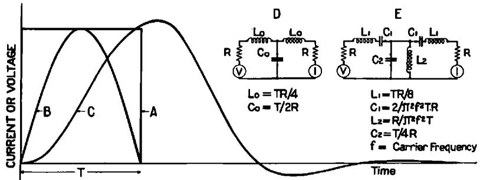
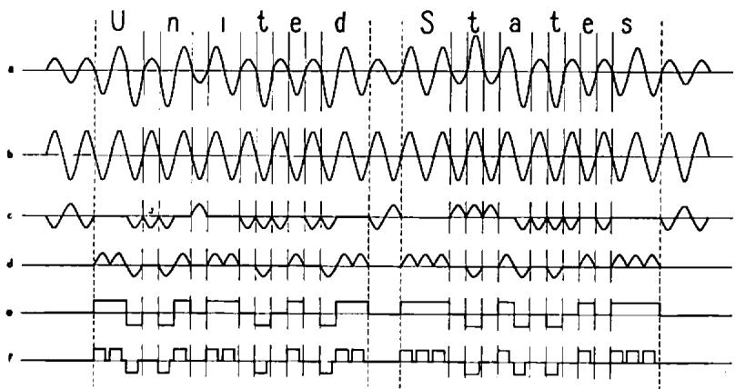

# 影响电报速度的若干因素

作者：H·奈奎斯特

**摘要**：本文探讨了影响电报传输信息最高速度的两个基本因素，即信号整形与编码选择。前者关注在传输介质上施加的最佳波形，以便在不过度干扰本电路或相邻电路的前提下实现更高速度；后者研究如何在给定信号单元数量的条件下，通过编码选择传输最大信息量。

研究表明，波形在一定程度上取决于传输信息所用电路的类型；在大多数情况下，最优波形既非常用的矩形波，也非半周期正弦波，而是通过将简单矩形波馈入适当网络后产生的一种特殊形式波形。电报电路中通常存在的阻抗特性，能够在施加矩形电压波时产生相当程度的信号整形。

对编码选择的考虑表明，虽然采用多于两个电流值的编码是可取的，但存在一些限制使得无法使用大量电流值。对比表格显示了所提出的各种编码的相对速度效率。研究表明，Squier 等人提出的在电报传输中使用正弦波并无优势，其论点基于错误的假设。

# 信号整形

将假设几种不同的波形，并就以下方面对它们进行比较：

1.  在电路远端接收到的信号质量；
2.  信号的干扰特性。

首先考虑在无失真线路上传输直流脉冲的情况，其中使用有限的频率范围。接着将考虑通过无线电和载波电路的传输。将证明这些情况与前一种情况密切相关，因为无线电或载波电路的传输介质非常接近于无失真线路。然后考虑通过普通陆地线路

1 于1924年2月4日至8日在费城举行的美国电气工程师协会（A. I. E. E.）冬季会议上发表，并转载自《A. I. E. E. 杂志》第43卷，第124页，1924年。
2 A. C. Crehore 和 G. O. Squier。《一种用于电缆电报的实用正弦波发射机；以及对大西洋电缆的交流测量》。《A. I. E. E. 汇刊》，第十七卷，1900年，第385页。
G. O. Squier。《论用于电缆电报的不间断交流电》。《物理学会会刊》，第二十七卷，第540页。
G. O. Squier。《一种适用于无线电、陆地线路和海底电缆的电报字母传输方法》。《富兰克林学会杂志》，第195卷，1923年5月，第633页。
采用直流电的电报传输。随后将考虑更复杂的长距离海底电缆传输情况。

研究将表明，在大多数情况下，最佳波形很可能是通过将矩形信号单元馈入合适的电气网络（在其施加到传输介质之前对其进行平滑处理）所产生的波。将对比通过馈送矩形信号单元经合适网络整形后的波形与由正弦波半周期组成的波形，并指出后者的劣势。

# 通过无失真线路的直流电报传输

在开始讨论之前，将定义本文中将使用的两个术语，它们被认为是具有根本重要性的——“信号单元”和“线路速度”。通常，尤其是在机械发送的情况下，可以将时间划分为近似等长的短间隔，每个间隔的特征是在发送端施加一个明确的（不一定恒定的）电压。占用一个这样时间单位的信号部分将被称为一个“信号单元”。例如，在普通陆地电报中，字母 $a$ 将由五个信号单元组成，第一个构成点，第二个构成间隔，接下来的三个构成划。本文中使用的“线路速度”等于每秒信号单元数除以二。在普通陆地电报中，当传输一系列由单位间隔分隔的点时，线路速度等于点的频率。

讨论将首先限于通过无失真线路的直流电报情况。这种情况最简单，此外其结果将有助于理解更复杂的情况。假设无失真线路仅由串联和并联电阻组成，可能有助于理解这种情况。

假设的无失真线路将从零频率向上均等地传输所有频率。在考虑将直流电报应用于该线路时，假设电报电路仅分配有限的频率范围（从零向上），剩余的频率范围分配用于其他用途，如普通电话、载波电话和电报。同时假设直流电报电路以其分配的频率范围所允许的最高速度工作。

接下来将研究可能用于构成电报信号单元的多种不同波形，首先考虑当施加不同波形到发送端时在远端接收到的波形，其次考虑在分配给其他用途的较高频率范围内将产生的干扰。

将考虑的三种电压波形如图1所示。图中 $A$ 显示了最简单的电压波形，

**图 1**

A—矩形电压波
B—正弦电压波的半周期
C—矩形电压波通过图中 $D$ 或 $E$ 所示网络修正后的波形

即矩形波，它通过在一定时间间隔内施加电池电压，然后用短路代替它而产生。图中的 $C$ 是通过将矩形电压波 $A$ 传输到图中字母 $D$ 所示的电气网络所产生的波。（也可以选择其他形式的网络来产生类似的结果。）图中的 $B$ 是具有正弦波半周期形状的波。在下文中，此波将被称为“半周期正弦波”。

在考虑将上述波形施加于发送端时将接收到的波形时，将利用以下一般原理。Malcolm$^3$ 针对海底电缆电路情况陈述了这些原理，并在附录 A 中讨论了一般情况。

当电报电路以可用的频率范围所允许的最高线路速度工作时，接收信号的形状实际上与发送信号的形状无关；此外，接收信号的幅度大约与施加电压波所包围的面积成正比。

由于施加电压波所包围的面积对于远端接收到的波形是首要重要的，接下来将检查图1中三种电压波下的面积。波 $A$ 和 $C$ 下的面积将被发现基本相等，而波 $B$ 下的面积仅为前者的约0.6倍。因此，可以预期波 $A$ 和 $C$ 从接收信号的角度看大致同样良好，而波 $B$ 则较差，产生的接收信号幅度仅约为前者的0.6倍。如果施加在发送端的最大电压（或功率）被限制在某个给定值，则矩形波被视为最佳，因为该波具有最大面积。虽然曲线 $C$ 下所示的面积近似等于矩形波下的面积，但当连续发送多个相同极性和幅度的信号单元时，由于相邻信号单元的重叠，传输的最大电压将略微超过未修正矩形波情况下的相应电压。

上述对图1中三种波从接收信号角度进行的比较，不仅适用于单个信号单元，也适用于包含多个单元的复杂波形。由于在所考虑的速度下，不同形状发送信号产生的接收电流基本相同，最多只在幅度上有所差异，根据叠加原理可知，任何复杂信号，无论是由一种形状还是另一种形状的信号单元在发送端构成，都将在接收端产生基本相同的波形，发送端单元形状的差异主要导致接收波幅度的差异。

接下来将考虑图1中不同波形在分配给其他电路的频率范围内产生的相对干扰。由于对其他电路的干扰源于电报信号单元包含扩散到分配给其他电路的频率范围的频率分量，因此从干扰角度看，包含最少这些额外频率分量的波将是最好的。通过

利用附录 C 中讨论的方法，已计算出图1所示三种波的频率分量，如图2所示。图中标记为 $1/2T$ 的频率等于线路速度。此处 $T$ 的值与图1中的相同。图中的字母对应于图1中的相应波，$A$ 为孤立矩形波的频率分量，$B$ 为半周期正弦波的相应分量，$C$ 为矩形波通过图1中的网络 $D$ 后的频率分量。从图2可以看出，矩形波形 $A$ 包含最多的高频电流分量，因此从干扰角度看是最差的。半周期正弦波包含较少的高频分量，尽管可以看出，其高频分量远非可以忽略不计。波 $C$ 是

从干扰角度看是最好的，因为它包含的这些高频分量最少。

综上所述，对于所考虑的情况，图1中的波形 $C$，即通过将矩形信号单元馈入合适网络所产生的波形，是最合适的。这种波形从接收信号的角度看几乎是最佳的，而从干扰其他电路的角度看，则几乎无可挑剔。

# 载波与无线电

无失真线路的结果特别适用于无线电和载波电报的情况，因为这些情况下的传输介质基本是无失真的。我们可以再次利用图1来说明三种可能的电压，需要理解的是，这些曲线表示传输电流的包络或轮廓，而这些电流的实际频率远高于信号频率。如果现在将考虑限制在载波频率位于传输频带中间的情况，那么这种情况就变得与直流情况非常相似，并且关于接收波形形状与发送波形无关以及其幅度与发送电压曲线下面积直接成正比的论述仍然成立。一个重要区别是，在直流情况下使用图1中的网络 $D$，而在载波位于允许传输范围中间的交流情况下，则使用图1中 $E$ 所示的网络。另一个区别是，在涉及非常高频率的无线电情况下，可能无法实际构建所需的网络。然而，在这种情况下，可以实际产生相应的直流波并利用它来调制无线电波。

上述直流情况下关于所讨论电路干扰其他电路的论述也适用于无线电和载波情况，区别在于图2显示了一个从零向上的频带，而无线电和载波情况下的相应曲线由两个这样的频带组成。无线电和载波的完整曲线大致关于对应于载波频率的纵坐标对称，其右侧部分类似于图2所示的曲线。显然，矩形波和半周期正弦波作为施加到传输介质的电压波都是不可取的，因为它们包含可能轻易扩展到分配给相邻载波频带范围的频率分量。因此，在载波电报实践中，通常使用发射滤波器来滤除这些干扰频率。施加到该滤波器上的电压轮廓基本是矩形的，但经过滤波器后，其形状近似类似于图1中的曲线 $C$，因此产生的干扰小于半周期正弦波。

# 陆地线路

陆地线路的情况与之前讨论的情况有所不同，因为从经济角度考虑，不希望利用所有可用频率范围。换句话说，在海底电缆和长距离无线电电路中可能合理的大量终端设备投资，在陆地线路中并不划算。在陆地电路中，传输的最高频率远高于所需的线路速度。在这种情况下，通常可以并且希望利用可用范围来增加接收波的陡峭度。陡峭的波前沿导致接收继电器快速动作，这反过来又导致最小的失真。如果采用半周期正弦波代替通常的矩形波，或者如果采用一个网络来将波平滑到图1所示的程度，则接收波必然会失去其大部分陡峭度，结果导致接收继电器的响应不够明确，信号会发生失真。当然，应当理解，通过适当比例的网络，可以将波仅平滑到满足干扰要求的程度，同时保留足够的陡峭度以确保接收继电器的快速动作。因此，通过网络进行平滑处理是更可取的。

如果希望并能够充分利用频率范围，那么上述关于无失真线路的论述基本无需修改即可适用，并且在这种情况下，使用通过合适网络平滑的波也比施加半周期正弦波形波更为有利。

# 海底电缆

在海底电缆电报的情况下，存在一个在上文讨论的简单直流情况下未强调的电压限制。施加在电缆上的电压被限制在一个确定的值。此外，由于某些原因，电缆在发送端具有与之相关的阻抗，这可能使得电缆上的电压不同于施加到发送端设备的电压。由于这种情况下的限制是电缆上的电压限制，理想的波形是施加矩形波到电缆上，而不是施加到设备上，因为它确保了曲线下的面积在施加的限制下达到最大。可以使发送端阻抗在大部分重要频率范围内与电缆阻抗近似成正比。这将确保施加到电缆上的波形与施加到设备上的波形具有大致相同的形状。出于实际原因，可能希望该阻抗对于直流电是无限大的。

对于海底电缆，一种特殊的干扰尤为重要，即由于双工不平衡造成的干扰。对于给定的不平衡度，可以通过在网络中放置网络来减少由此源产生的干扰，这些网络可以放置在出站电流路径或入站电流路径中。上述事实，连同上文推导出的各种施加波的频率分布（如图2所示），表明使用半周期正弦波代替矩形波可能对双工不平衡效应产生的有益影响，可以通过使用简单网络更有效地实现，该网络可放置在出站或入站电流路径中。这两个位置在减少双工不平衡干扰方面同样有效，但将网络放置在出站电流路径中的优点是减少了干扰其他电路，而放置在入站电流路径中则具有减少来自其他电路的干扰的效果。

在结束海底电报讨论之前，可能需要指出，在实践中通常缩短施加电池的时间，使其少于分配给该信号单元的总周期。例如，如果要传输字母 $e$，电池可能被施加的时间，比如占分配给该 $e$ 时间的75%，在剩余的25%时间内电路接地。产生的电压如图3F所示。根据前文所述，可以得出结论，这种方法不如在整个周期内施加电压有利，因为虽然两种情况下接收信号的形状基本相同，但其幅度与电压曲线下的面积成正比，将会较小。粗略查阅文献，未发现有任何实验方面的发表结果证实或反对这一结论。

# 编码选择

首先将推导一个公式，用于比较在给定线路速度（即信号单元发送速率）下，使用不同电流值数量的编码传输信息的速度。使用此公式，将表明，如果线路速度可以保持不变并增加电流值数量，则信息传输速率可以显著提高。

然后，将对该公式所示的理论可能性与各种常用编码所获得的结果进行比较，包括应用于陆地线路、无线电和载波电路的大陆和美国莫尔斯电码，以及应用于海底电缆的大陆莫尔斯电码。将表明，在采用两个电流值的电路中应用的大陆和美国莫尔斯电码，由于这些编码被设计为易于用耳朵辨读，因此在速度上明显低于理论上可能达到的编码。另一方面，在海底电缆或其他采用三个电流值的电路中应用的大陆莫尔斯电码，其表现将与理想情况基本相当。考虑到上述因素，将表明，如果使用两个电流值的大陆莫尔斯电码的给定电报电路经过重新安排，使其能够使用三个电流值的编码，则在该重新安排的电路上，用给定数量的信号单元可以传输约2.2倍的信息量。

然后将指出，为何并非在所有电报电路上都能够用多于两个电流值的编码替代两个电流值的编码以提高信息传输速率。指出了用此方法提高速度可能性最大的电路，以及可能性最小的电路。

# 使用不同数量电流值编码的理论可能性

在给定线路速度（即给定信号单元发送速率）下，电报电路传输信息的速度可以近似地由以下公式确定，其推导见附录 B。

$$
W = K \log m
$$

其中 $W$ 是信息传输速度，$m$ 是电流值的数量，$K$ 是一个常数。

信息传输速度是指在给定长度的时间内可以传输的代表不同字母、数字等的字符数量，假设电路每单位时间传输给定数量的信号单元。

将数值代入此公式得到下表，该表显示了通过增加电流值数量来提高信息传输速度的可能性。

<table><tr><td>采用的电流值数量</td><td>用给定数量信号单元可传输信息的相对量</td></tr><tr><td>2</td><td>100</td></tr><tr><td>3</td><td>158</td></tr><tr><td>4</td><td>200</td></tr><tr><td>5</td><td>230</td></tr><tr><td>8</td><td>300</td></tr><tr><td>16</td><td>400</td></tr></table>

此表表明，在电路允许且线路速度不因此降低的情况下，采用多于两个电流值有相当大的优势。下文将概述其局限性。还应注意到，虽然适度增加电流值数量有相当大的优势，但使用大量电流值则优势不大。

# 常用编码与理想情况的比较

在打印机编码的情况下，推导出的理论结果与实践非常接近，从公式推导方法即可看出。

为了将公式所示的理论可能性与非打印机编码构造时获得的结果进行比较，假设了几种编码，并对每一种推导出产生一个平均字母所需的信号单元数。具体方法见附录 D。此项工作得出下表：

<table><tr><td></td><td>每字母信号单元数</td><td>给定信号单元数下的相对字母数</td></tr><tr><td>美国莫尔斯电码（两个电流值）</td><td>8.26</td><td>74</td></tr><tr><td>大陆莫尔斯电码（两个电流值）</td><td>8.45</td><td>73</td></tr><tr><td>理想编码（两个电流值）</td><td>6.14</td><td>100</td></tr><tr><td>大陆莫尔斯电码（三个电流值）</td><td>3.77</td><td>163</td></tr><tr><td>理想编码（三个电流值）</td><td>3.63</td><td>169</td></tr></table>

上表中标题为“给定信号单元数下的相对字母数”的列使得可以直接与先前给出的公式预测结果进行比较。将会注意到，理想的三个电流值编码与理想的两个电流值编码相比，在给定信号单元数下的字母数增加，这与理论比值1.58:1基本吻合。还可以注意到，实际用于海底电缆的大陆三个电流值编码似乎相当接近理想情况。然而，在使用仅两个电流值的大陆和美国莫尔斯电码情况下，其结果达不到理想，实际获得的结果与理想情况的比例约为1.4:1。其原因是，为了能够通过音响器读取信号而非记录信号，牺牲了一定比例的可能速度。例如，假设划的长度约为点的三倍。如果信号在发送端机械形成并在接收端记录，则有可能利用长度为1、2、3等信号单元的标记以及相应的间隔。理想编码就是如此构造的。

可以看出，推导出的两个电流值情况下的大陆莫尔斯和美国莫尔斯电码的数据基本相同。这个结果可能与实践不符；据认为，这两种编码之间的速度差异相当大，比如美国莫尔斯电码大约快10%或15%。这种差异部分是由于在目前计算中没有考虑数字和标点符号，部分是由于关于间隔相对长度的假设并非严格符合实践。

综上所述，可以看出，从两个电流值的美洲或大陆莫尔斯电码转变为三个电流值的大陆电码，存在双重增益。首先，伴随着从两个电流值编码转变为三个电流值编码，理论上存在1.6:1的比例增加。其次，由于目前的两个电流值编码比如果通过耳朵以外的方式接收所需的长度要长，附带产生了1.4:1的比例增加。因此，在保持线路速度相同的前提下，从两个电流值的大陆或美国莫尔斯电码转变为三个电流值的大陆电码，总增加比例为 $1.6 \times 1.4:1$ 或2.2:1。在此应注意到，对于美国莫尔斯电码，由于上述原因，该比例可能略低于此。

# 应用多于两个电流值编码的局限性

与可以有利地增加电流值数量有关的一些固有局限性如下：

1.  电路传输效率的波动，
2.  干扰，
3.  对允许使用的功率或电压的限制。

此外可以指出，一般来说，每当使用多于两个电流值时，都需要使发送和接收设备更加复杂和昂贵。因此，在电报电路成本较低的情况下，使用除由两个电流值组成的编码之外的编码可能并无益处。

现在考虑限制可使用的电流值数量的因素，相信第一个因素的重要性是显而易见的。如果线路容易发生波动，使得较强电流在某些时候的幅度小于其他时候的较弱电流，则将无法区分构成编码的不同电流强度，特别是在波动迅速的情况下。

关于干扰电流，显然这些电流可能具有与信号电流相加或相减的极性，因此有必要将所使用的各个电流值之间的间隔设置得足够大，以便将一个电流值加上干扰后与下一个较大的电流值减去干扰后能够区分开来。

电流值之间的间隔由干扰和传输效率的波动决定，由此可见，可以使用的最大电流值数量取决于允许使用的最大功率。

在采用直流电操作的陆地线路电报电路中，众所周知，四工电路比仅采用两个电流值的电路更容易受到波动和干扰的严重影响。（四工电报电路在一个传输方向上使用四个电流值。）总的来说，可以认为，以这种方式改进普通直流电报电路的前景并不特别乐观。

在远距离无线传输的情况下，所有上述三个因素在限制可以有效使用的电流值数量方面都很重要。首先，众所周知，传输介质的效率会发生很大变化，因此接收信号的幅度随时间变化很大。其次，干扰（至少在特定季节）足够大，使得即使在使用通常仅采用两个电流值的方法时，也难以区分电流值。第三，由于无线电波遭受的巨大衰减，接收功率受到限制。

在载波传输的情况下，使用多于两个电流值可能有应用空间。然而，线路电路的相对廉价性将限制在经济上能够增加接收设备成本和复杂性的程度。此外，应牢记，增加电流值数量对线路速度的影响未考虑在内，这被认为超出了本文的范围。

将现有的电报网络改造为使用三个而不是两个电流值的编码，将需要新型的电报中继器以及新的发送和接收设备，以及新的操作方法。详细讨论此事的细节被认为超出了本文的范围。

# “正弦波”系统

关于使用所谓的“正弦波”电报系统的建议引起了相当的兴趣和讨论。鉴于此，下面简要讨论这些系统。

将简要分析这些系统的基本特征，并根据前述讨论中得出的结果，将这些系统与基于其他原理的系统进行比较。将特别努力澄清那些似乎是支撑支持这些“正弦波”系统论点基础的根本性错误假设。

**Crehore-Squier 系统**。Crehore 和 Squier 提倡使用正弦波包络来改善电报信号的特性。4 用这种类型的波形成的单词“United States”如图 3d 所示。使用的编码与普通大陆莫尔斯电码相同，唯一的区别是信号单元由半周期正弦波组成。

在前文中，已经表明半周期正弦波比经过电气网络平滑后的矩形波面积更小，因此，从接收信号的角度看，正弦波劣于后者。从干扰其他电路的角度看，也已指出半周期正弦波包含比适当平滑后的矩形波更多的高频分量。因此，由半周期正弦波组成的信号单元会产生更多的对其他电路的干扰。

**应用于海底电缆的 Squier 系统**。Squier 最近的一项建议给出了如图 3a 所示的波。这种波与 Crehore 和 Squier 倡导的波相似，即每个信号单元由半周期正弦波组成。正如已经指出的，这样做没有优势。

两种系统的区别在于，图 3a 中的波使用三个绝对值，并且每半周期穿过轴一次。编码与大陆莫尔斯电码相同，间隔由单位振幅的半周期正弦波表示，点由两个单位振幅的半周期正弦波表示，划由三个单位振幅的半周期正弦波表示。

参考该图可以看出，除了连续的半周期幅度不同外，产生的波类似于连续正弦波。因此，这种编码可以称为“不间断反转”编码。

在考虑将此编码应用于海底电缆电报时，利用图 3 中进行的分析是方便的。图 $3a$ 显示了 Squier 倡导的编码中写出的单词“United States”。图 $3b$ 显示了一个幅度等于图 $3a$ 中点振幅的恒定正弦波。图 $3c$ 显示了从图 $3a$ 的波中减去图 $3b$ 的波所得的结果。将此最后一个波与图 3d 中的波进行比较

**图 3**

a—不间断反转编码（间隔 $= 1$ 单位，$\mathrm{点} = 2$ 单位，$\mathrm{划} = 3$ 单位）

$b$ 恒定正弦波，2 单位

$c$ ——$b$ 减去 $a$ 产生的波

$d$ -正弦波编码：注意 $c$ 和 $d$ 之间的相似性

$e$ —矩形波，未修正

$f$ —矩形波，修正为在标记时间内，除间隔时间外，还将顶点接地四分之一时间

可以看出，这两个波在电学上是等效的。它们的不同仅在于信号单元的排列顺序。

因此，图 3a 所示的波由两个分量组成；一个是图 3b 所示的惰性分量，它不传输信息，另一个是传输信息的分量，如图 3c 所示。

图 3b 所示的分量不携带从发送站到接收站的信息，这一点在我们考虑到它在任何时刻的值都是可预测的，并且事实上该分量可以在本地产生时变得清晰。

该分量的净效应是将可用于信息传输的电压减少到总电压的三分之一。例如，如果允许向特定电缆施加 60 伏电压，其中 40 伏将用于传输惰性交流波，只有剩余的 20 伏才能有效地用于传输信息。

**无线电和载波电报**。Squier 还主张将正弦波包络、不间断反转和三电流值编码的组合应用于无线电和载波电报。

应用多于两个电流值编码的优缺点已在上文充分讨论，此处无需赘述。显然，将这些与正弦波包络和不间断反转相结合并无益处。

使用正弦波包络的问题上文已经讨论，指出从接收信号的角度和干扰其他电路的角度看，具有正弦波包络的波都劣于通过将矩形信号馈入合适网络所产生的波。

“不间断反转”再次引入了惰性分量的使用。由于电缆电报与通常实践的无线电和载波之间的根本区别，后者的惰性分量比前者略小。在 Squier 倡导的编码中，可以在不严重影响信号信息承载能力的情况下减去的电流值大约为一个单位，即对应于间隔的电流。当减去该电流后，间隔电流从一个单位减少到零，点电流从两个单位减少到一个，划电流从三个单位减少到两个。进行此减法后，可以看出，最大的信息承载分量大约是实际使用的最大电流的三分之二。（这个三分之二的比例与海底电缆的三分之一比例相比较。）

在无线电的情况下，必须从发射站辐射的功率量尤为重要。由于在 Squier 倡导的系统中，辐射的最大电压中约有三分之二对传输信息有效，因此，如果惰性分量不被传输，则需要辐射的功率大约是所需功率的两倍。

**错误的假设**。所引论文中做出了两个错误的假设，它们是支持 Squier 倡导的系统的大量论点的基础。

其中之一是，其元素是半周期正弦波的波适合于调谐。诚然，在“不间断反转”编码的情况下可以获得一定程度的调谐，但这种调谐仅适用于波中不传输信息的惰性不变分量。图 2 显示的事实，即

Squier, loc. cit., Franklin Inst., Jl.

信息承载分量不包含可用于调谐的突出的窄频带范围，应该使这一假设的错误显而易见。

另一个假设是，对于传输功率理想的波，对于传输信息也是理想的。事实上，信息传输本质上涉及电流的快速且不可预测的变化，而功率传输最好通过稳定的电流（直流或交流）来实现。当然，这两种条件是不相容的。

# 附录 A

利用了以下两个原理：

1.  在线路速度接近最大值时，电报电路中接收到的点的形状基本上与施加点的形状无关。
2.  接收电流的幅度大约与发送电压曲线下的面积成正比。

以下对这些原理的一般性讨论由 J. R. Carson 提供。

设由于突然施加的单位电池而产生的到达曲线为 $A(t)$；那么，由于施加基本点信号 $f(t)$ 而产生的接收信号 $S(t)$ 由下式给出

$$
S (t) = \int_ {0} f (x) A ^ {\prime} (t - x) d x \tag {1}
$$

积分上限对于 $t < T$ 为 $t$，对于 $t \geq T$ 为 $T$。将仅考虑后一种情况，因为在这种情况下得出的结论是保守的。

将 (1) 式中的 $A^{\prime}(t - x)$ 展开，我们得到

$$
S (t) = \left[ A ^ {\prime} (t) - \frac {h _ {2} T}{2 !} A ^ {\prime \prime} (t) + \frac {h _ {3} T ^ {2}}{3 !} A ^ {\prime \prime \prime} (t) \dots \right] \int_ {0} ^ {T} f (x) d x \tag {2}
$$

其中 $h_2 = \frac{\int_0^T xf(x)dx}{\frac{T}{2!}\int_0^T f(x)dx},$

$$
h _ {3} = \frac {\int_ {0} ^ {T} \frac {x ^ {2}}{2 !} f (x) d x}{\frac {T ^ {2}}{3 !} \int_ {0} ^ {T} f (x) d x}, \mathrm {e t c .}
$$

7 J. R. Carson。《电气网络和传输系统的瞬态振荡理论》。《A. I. E. E. 汇刊》，第 XXXVIII 卷，1919 年，第 345 页。

立即得出，只要

$$
\int_ {0} ^ {T} f (x) d x \neq 0
$$

且信号的持续时间 $T$ 足够短，到达点信号近似由首项给出

$$
A ^ {\prime} (t) \int_ {0} ^ {T} f (x) d x
$$

并且随着信号速度的提高，即随着点持续时间 $T$ 的减小，这个近似变得越来越精确。

从上述可以得出的结论可以用以下命题来表述：

I. 如果信号速度足够高，则代表基本点的到达信号的形状与施加信号的形式无关，并且其幅度与施加信号的时间积分或“面积”成正比。

然而，显而易见，如果不对 $A'(t)$ 和 $f(t)$ 施加任何限制，上述命题通常要求点的持续时间 $T$ 非常小，以使级数展开从一开始就快速收敛。然而，这要求信号速度比实际实践中为使上述命题至少在本文特别考虑的各种施加点信号类型中能很好近似所需的速度要高得多。为了证明这一点，需要建立两个较不普遍的命题，这些命题对考虑的施加信号类型有效。

II. 如果施加信号 $f(t)$ 处处同号，则存在一个值 $\tau$，使得 $0 < \frac{1}{\tau} < T / 2$，并且使得

$$
S (t + T / 2) = A ^ {\prime} (t + \tau) \int_ {0} ^ {T} f (x) d x \tag {3}
$$

该命题由中值定理得出。

III. 如果 $f(t)$ 处处同号，并且进一步满足对称性条件，

$$
f (x) = f (T - x), (x \leq T / 2)
$$

则存在一个值 $\pmb{\tau}$，使得 $0 < \tau < T / 2$，并且使得

$$
S (t + T / 2) = 1 / 2 \left[ A ^ {\prime} (t + \tau) + A ^ {\prime} (t - \tau) \right] \int_ {0} ^ {T} f (x) d x \tag {4}
$$

最后一个方程也由中值定理得出。此外，矩形波、半周期正弦波以及部分占空点（只要参考时间 $t = 0$ 选择得当）都满足命题 III 所述的条件。

回到命题 II，让我们写

$$
S _ {j} (t + T ^ {\prime} / 2) = A ^ {\prime} \left(t + \tau_ {0} + \tau_ {j}\right) \int_ {0} ^ {T} f _ {j} (x) d x,
$$

下标 $j$ 表示特定类型的施加点信号，$\tau_0$ 是作为参考的任何类型信号的 $\tau$ 值。那么

$$
S _ {j} (t + T, / 2) = \left[ A ^ {\prime} (t + \tau_ {0}) + \frac {\tau_ {j}}{1 !} A ^ {\prime \prime} (t + \tau_ {0}) + \dots \right] \int_ {0} ^ {T} f _ {j} (x) d x \tag {2a}
$$

现在，命题 I 能够很好近似的条件是展开式 (2a) 能快速收敛。由于 $\tau_{j}$ 的最大可能值是 $T / 2$，并且在实践中它远小于 $T / 2$，因此对于比展开式 (1) 所需的大得多的 $T$ 值（即更慢的信号速度），仍可获得所需的收敛性。此外，对于具体考虑的三种信号类型，在所有实际的传输系统中，$\tau_{1}, \tau_{2}$ 和 $\tau_{3}$ 之间的差异远小于 $T / 2$。

如果引入命题 III 的条件，近似会更加精确，命题 I 对于更低的信号速度仍然有效。

为了得出上述命题有效所需的最低信号速度的量化概念，当然需要指定所考虑传输系统的到达曲线。将上述分析应用于具有和不具有“截止”频率的代表性传输系统的结果表明，该命题对于远低于实际条件下可达到的最高速度的信号速度，仍然具有非常好的近似性。

# 附录 B

使用了公式

其中 $W = K\log m$

$K = \mathrm{一个}$ 常数且 $m =$ 采用的电流值数量。

现在将给出支撑此公式的假设及其推导。

让我们假设一种编码，其所有字符具有相同的持续时间。这在打印机编码中通常是情况。如果 $n$ 是每个字符的信号单元数，那么可以构成的字符总数等于 $m^n$。为了使两个这样的系统等价，可以区分的字符总数应该相同。换句话说，

$$
m ^ {n} = \text {常数} \tag {1}
$$

此方程也可以写为

$$
n \log m = \text {常数}. \tag {2}
$$

电路传输信息的速度与线路速度成正比，与每个字符的信号单元数成反比，前提是满足上述关系。因此，我们可以写

$$
W = s _ {i} / n \tag {3}
$$

其中 $s$ 是线路速度。代入从上述方程导出的 $n$ 值，该方程变为

$$
W = \frac {s \log m}{\text {常数}} \tag {4}
$$

也可以写为

$$
W = K \log m \tag {5}
$$

在将此公式应用于实际情况时，会发现不可能严格遵守方程 (1) 所表达的条件。例如，考虑一个每个字符由三个信号单元组成的三电流值编码，与一个每个字符由五个信号单元组成的二电流值编码之间的比较。显然，对于给定的线路速度，前一种情况传输字符的速度是后一种情况的 5/3 倍。换句话说，比例是 1.67:1，而公式给出的比例是 1.58:1。然而，应该注意到，前一种编码仅拥有 27 个字符，而后一种编码拥有 32 个。换句话说，后一种编码的一个字符比前一种编码的一个字符传输更多的信息。因此，用于字符传输相对速度的 1.67 数字和用于信息传输相对速度的 1.58 数字并不矛盾。

将注意到，该公式是针对具有均匀持续时间字符的编码推导的，对于字符具有非均匀持续时间的编码，不应期望它除了是一个近似值之外的任何东西。要为后一种情况建立公式，需要对各种字符的相对频率做出假设。似乎有理由推测，该公式在这种情况下也能对事实给出合理的近似，但不应期望它是精确的。

# 附录 C

从图 1 给出的曲线推导出图 2 给出的曲线需要一些解释。粗略地看，似乎一个孤立的点根本不具备任何频率特性。然而，如果将如图 1 中任何一种所示的电压施加到一个能够被激发振荡的网络上，该网络将通过振荡来响应该电压。为简单起见，假设该网络由一个电感、一个电容和一个很小的串联电阻组成，对施加图中任何一种电压的响应是，它以恒定频率振荡并逐渐减小振幅。此外，当电路的固有周期改变时，响应也会变化。

看待这种现象有两种方式。一方面，我们可以说，该频率的振荡是由网络从施加的电压中制造出来的，并且该频率不存在于原始电压中。另一方面，我们可以说原始电压包含接近谐振频率的分量，电路对这些分量作出响应，因为它对它们提供了很小的阻抗，而它不对其他分量作出响应，因为对它们提供了很大的阻抗。这两种观点都是允许的，但为了本文的目的，使用第二种观点的术语较为方便，并认为施加的电压由无限多个频率组成。然后，确定振荡网络响应的问题可以通过推导施加电压的频率特性或响应特性来解决。该特性可以通过傅里叶积分来确定，其计算在任何标准教科书中都有描述。下文旨在从物理角度概述建立该积分的考虑。

为了推导孤立点的频率特性，最简单的方法是从一系列均匀间隔的点开始。如果认为这样的点系列无限延伸，则可以通过众所周知的方法将合成波分解为傅里叶级数。现在，假设已对给定的点间距获得了这样的傅里叶级数。下一步是增加点之间的间距。这样做的结果是增加了给定频率范围内的傅里叶分量数量，并减小了每个分量的大小。如果无限期地继续这种增加点之间间距的过程，我们就接近孤立点的条件。此外，当我们接近这个条件时，给定频率范围内的分量数量无限增加，每个分量的大小无限减小。这个极限结果被称为该波的傅里叶积分。

# 附录 D

论文中给出了一个表格，列出了各种编码传输信息的相对效率。现在将给出该表格的推导。

比较将包括以下基于两个电流值的编码：美国莫尔斯电码、大陆莫尔斯电码以及所谓的“理想”二电流值编码。它还将包括以下基于三个电流值的编码：大陆莫尔斯电码和“理想”三电流值编码。

假设文本由五个字母的单词组成，没有对标点符号做任何考虑。下表给出了以信号单元为单位的假设间隔长度。

<table><tr><td></td><td>字母内的普通间隔</td><td>“间隔”字母中的特殊间隔</td><td>字母之间的间隔</td><td>单词之间的间隔</td></tr><tr><td>美国莫尔斯电码（两个电流值）....</td><td>1</td><td>2</td><td>3</td><td>4</td></tr><tr><td>大陆莫尔斯电码（两个电流值）....</td><td>1</td><td>—</td><td>2</td><td>3</td></tr><tr><td>大陆莫尔斯电码（三个电流值）...</td><td>—</td><td>—</td><td>1</td><td>2</td></tr></table>

假设二电流值编码中的划占用三个信号单元持续时间，除了美国莫尔斯电码中的字母 $l$，假设占用五个信号单元。在实践中，划可能比假设的稍短，但由此产生的误差并不大。关于大陆和美国莫尔斯电码假设的字母之间和单词之间的相对间隔，也值得怀疑它们是否严格符合实践。可能这些间隔平均比表格显示的更接近相等。然而，这个假设只影响美国莫尔斯电码和大陆莫尔斯电码可获得的相对速度，并不严重影响基于两个电流值的编码与基于三个电流值的编码之间的比较。

术语“理想”已应用于下面将解释的两种编码。这些编码的构建原则与大陆和美国莫尔斯电码相同，努力使它们尽可能简短而不使辨读过困难。认为所选择的两种理想编码在易于辨读方面具有可比性。在构建二单元编码时，涉及两个步骤。首先，假设可以使用任何整数个信号单元持续时间的标记和间隔，因此除了上面假设的标记和间隔值之外，还可以有持续时间为二、四等单位的划。在这些假设下，接下来构成可以构造的 26 个最短字符。发现有一个字符的持续时间为 1 个单位，1 个字符持续时间为 2 个单位，2 个字符持续时间为 3 个单位，3 个字符持续时间为 4 个单位，5 个字符持续时间为 5 个单位，9 个字符持续时间为 6 个单位。剩余的 5 个字符每个持续时间为 7 个单位。第二步是将字母表的 26 个字母分配给这些字符，其顺序是最频繁的字母对应于最短的字符。最有效的是使用与上面大陆二电流值编码相同的间隔假设，另外在字母内可以使用比三个单位更长的间隔。

构建理想三电流值编码的方法是类似的。首先，构建 26 个最短的字符。可以构建持续时间为 1 个单位的 2 个字符，持续时间为 2 个单位的 4 个字符，持续时间为 3 个单位的 8 个字符。剩余的 12 个字符持续时间取 4 个单位。接下来，最频繁的字母按照其持续时间顺序分配给这些字符。在这种情况下，最好使用与上面三电流值大陆编码相同的字母之间和单词之间间隔的假设。在这种情况下，在字母内使用间隔并不经济。

使用了 Hitt 给出的频率表来确定各个字母的相对频率。根据此表计算了每个字母的平均持续时间，并针对单词和字母之间的间隔进行了校正。结果的平均持续时间如下：

每字母信号单元数

<table><tr><td>美国莫尔斯电码（两个电流值）</td><td>8.26</td></tr><tr><td>大陆莫尔斯电码（两个电流值）</td><td>8.45</td></tr><tr><td>理想编码（两个电流值）</td><td>6.14</td></tr><tr><td>大陆莫尔斯电码（三个电流值）</td><td>3.77</td></tr><tr><td>理想编码（三个电流值）</td><td>3.63</td></tr></table>

$^{\text{®}}$ Parker Hitt。《军事密码解法手册》。陆军勤务学校出版社，堪萨斯州莱文沃斯堡。第二版，第7页。

---

## **专业术语中英对照表**

| 英文术语                        | 中文翻译        |
| :------------------------------ | :-------------- |
| Telegraph Speed                 | 电报速度        |
| Signal Shaping                  | 信号整形        |
| Choice of Codes                 | 编码选择        |
| Wave Shape / Waveform           | 波形            |
| Rectangular Wave                | 矩形波          |
| Half-cycle Sine Wave            | 半周期正弦波    |
| Distortionless Line             | 无失真线路      |
| Signal Element                  | 信号单元        |
| Line Speed                      | 线路速度        |
| Frequency Range                 | 频率范围        |
| Interference                    | 干扰            |
| Frequency Components            | 频率分量        |
| Carrier Telegraphy              | 载波电报        |
| Radio Telegraphy                | 无线电电报      |
| Envelope                        | 包络            |
| Transmitting Filter             | 发射滤波器      |
| Land Lines                      | 陆地线路        |
| Receiving Relay                 | 接收继电器      |
| Steepness / Wave Front          | 陡峭度 / 波前沿 |
| Submarine Cables                | 海底电缆        |
| Duplex Balance                  | 双工平衡        |
| Voltage Limitation              | 电压限制        |
| Number of Current Values        | 电流值数量      |
| Continental Morse Code          | 大陆莫尔斯电码  |
| American Morse Code             | 美国莫尔斯电码  |
| Printer Codes                   | 打印机编码      |
| Fluctuations in Transmission    | 传输波动        |
| Attenuation                     | 衰减            |
| Sine Wave Systems               | 正弦波系统      |
| Unbroken-reversals Code         | 不间断反转编码  |
| Inert Component                 | 惰性分量        |
| Intelligence-carrying Component | 信息承载分量    |
| Fourier Integral                | 傅里叶积分      |
| Fourier Series                  | 傅里叶级数      |
| Resonance / Resonant Frequency  | 谐振 / 谐振频率 |
| Arrival Curve                   | 到达曲线        |
| Mean Value Theorem              | 中值定理        |
| Superposition (Principle)       | 叠加（原理）    |
| Quadruplex Circuit              | 四工电路        |
| Sounder                         | 音响器          |
| Modulation                      | 调制            |
| Impedance                       | 阻抗            |
| Terminal Apparatus              | 终端设备        |