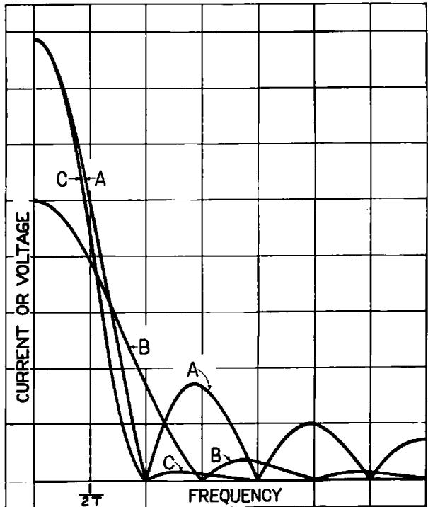

# Certain Factors Affecting Telegraph Speed

By H. NYQUIST

SYNOPSIS: This paper considers two fundamental factors entering into the maximum speed of transmission of intelligence by telegraph. These factors are signal shaping and choice of codes. The first is concerned with the best wave shape to be impressed on the transmitting medium so as to permit of greater speed without undue interference either in the circuit under consideration or in those adjacent, while the latter deals with the choice of codes which will permit of transmitting a maximum amount of intelligence with a given number of signal elements.

It is shown that the wave shape depends somewhat on the type of circuit over which intelligence is to be transmitted and that for most cases the optimum wave is neither rectangular nor a half cycle sine wave as is frequently used but a wave of special form produced by sending a simple rectangular wave through a suitable network. The impedances usually associated with telegraph circuits are such as to produce a fair degree of signal shaping when a rectangular voltage wave is impressed.

Consideration of the choice of codes show that while it is desirable to use those involving more than two current values, there are limitations which prevent a large number of current values being used. A table of comparisons shows the relative speed efficiencies of various codes proposed. It is shown that no advantages result from the use of a sine wave for telegraph transmission as proposed by Squier and others3 and that their arguments are based on erroneous assumptions.

# SIGNAL SHAPING

SEVERAL different wave shapes will be assumed and comparison will be made between them as to:

1. Excellence of signals delivered at the distant end of the circuit, and

2. Interfering properties of the signals.

Consideration will first be given to the case where direct-current impulses are transmitted over a distortionless line, using a limited range of frequencies. Transmission over radio and carrier circuits will next be considered. It will be shown that these cases are closely related to the preceding one because of the fact that the transmitting medium in the case of either radio or carrier circuits closely approximates a distortionless line. Telegraphy over ordinary land lines

1 Presented at the Midwinter Convention of the A. I. E. E., Philadelphia, Pa. February 4-8, 1924, and reprinted from the Journal of the A. I. E. E. Vol. 43, p. 124, 1924.

2 A. C. Crehore and G. O. Squier. "A Practical Transmitter Using the Sine Wave for Cable Telegraphy; and Measurements with Alternating Currents upon an Atlantic Cable." A. I. E. E. Trans., Vol. XVII, 1900, p. 385.

G. O. Squier. "On An Unbroken Alternating Current for Cable Telegraphy." Proc. Phys. Soc., Vol. XXVII, p. 540.

G. O. Squier. "A Method of Transmitting the Telegraph Alphabet Applicable for Radio, Land Lines, and Submarine Cables." Franklin Inst., JI., Vol. 195, May 1923, p. 633.

employing direct currents will next be considered. This will be followed by a consideration of the more complicated case of transmission over long submarine cables.

It will be shown that the waves produced by sending rectangular signal elements through suitable electrical networks which round them off before they are impressed on the transmitting medium are probably best in most cases. Comparison will be made between waves shaped by sending rectangular signal elements through suitable networks and waves made up of half cycles of a sine wave, bringing out the inferiority of the latter.

# DIRECT-CURRENT TELEGRAPH TRANSMISSION OVER A DISTORTIONLESS LINE

Before proceeding with this discussion two terms, which will be used in this paper, and which are considered to be of fundamental importance, will be defined—"signal element" and "line speed." It is usually possible, especially when sending is done mechanically, to divide the time into short intervals of approximately equal duration, such that each is characterized by a definite, not necessarily constant, voltage impressed at the sending end. The part of the signal which occupies one such unit of time will be called a "signal element." For example, the letter  $a$  in ordinary land telegraphy will be said to be made up of five signal elements, the first constituting a dot, the second a space and the next three a dash. The "line speed," as used in this paper, equals the number of signal elements per second divided by two. In ordinary land telegraphy the line speed is equal to the dot frequency when a series of dots separated by unit spaces is transmitted.

The discussion will first be limited to the case of direct-current telegraphy over a distortionless line. This case is the simplest, and in addition the results will aid in understanding the more complex cases. It may aid in obtaining an understanding of this case to assume that the distortionless line is made up simply of series and shunt resistances.

A distortionless line, such as the one which has been assumed, will transmit all frequencies with equal efficiency from zero upward. In considering applying direct-current telegraph to this line, it will be assumed that the telegraph circuit will have assigned to it only a limited range of frequencies from zero upward, the remaining frequency range being assigned to some other uses, such as ordinary telephone and carrier telephone and telegraph. It will also be as-

sumed that the direct-current telegraph circuit is worked at as high a speed as the frequency range assigned to it will permit.

A number of different wave forms which might be employed to make up the telegraph signal elements will next be examined, consideration being given first to the waves which will be received at the distant end when the different wave forms are impressed at the transmitting end and second to the interference which will be produced in the higher range of frequencies which has been assigned to other uses.

Three forms of voltage waves which will be considered are shown in Fig. 1.  $A$  in that figure shows the simplest form of voltage wave,

Fig. 1

A—Rectangular Voltage Wave B—Half Cycle of Sinusoidal Voltage Wave C—Rectangular Voltage Wave Modified by Being Passed through Network Shown at  $D$  or  $E$ .

namely, the rectangular form which is produced by applying a battery for a given interval of time and then substituting a short circuit for it.  $C$  in the figure is the wave produced by transmitting the rectangular voltage wave  $A$  through an electrical network which is the one indicated by the letter  $D$  in the figure. (Other forms of networks might also be selected which would produce similar results.)  $B$  in the figure is a wave which has the shape of a half cycle of a sine wave. In what follows this wave will be referred to as the "half-cycle sine wave."

In considering the waves which will be received when the above waves are applied at the transmitting end, use will be made of the following general principles, which have been stated by Malcolm, $^3$  for the case of a submarine cable circuit and discussed for the general case in Appendix A.

When a telegraph circuit is worked at a line speed as high as will be permitted by the available frequency range, the shape of the received signal will be practically independent of the shape of the transmitted signal, and further, the magnitude of the received signal will be approximately directly proportional to the area included within the impressed voltage wave.

The area included within the impressed voltage wave being of principal importance so far as the wave received at the distant end is concerned, the areas under the three voltage waves shown in Fig. 1 will next be examined. The areas under waves  $A$  and  $C$  will be found to be substantially equal while the area under the wave  $B$  is only about 0.6 as great. Consequently, it should be expected that waves  $A$  and  $C$  will be about equally good from the standpoint of the received signals, while wave  $B$  will be poorer, producing received signals only about 0.6 as great in magnitude. If the maximum voltage (or power) impressed at the sending end is limited to some given value, the rectangular wave is seen to be the optimum, since this wave has the maximum area. While the area shown under curve  $C$  is approximately equal to that under the rectangular wave, the effect produced when a number of signal elements of the same polarity and magnitude are sent in succession is such that the maximum voltage transmitted will exceed slightly the corresponding voltage for the case of the unmodified rectangular wave due to overlapping of adjacent signal elements.

The above comparison of the three waves of Fig. 1 from the standpoint of received signals holds not only for signal elements, but also for complex waves comprising a number of elements. Since for the speeds under consideration the received currents for different shapes of signals applied at the sending end are substantially of the same form, differing, at most, in magnitude, it follows from the principle of superposition that any complex signal, whether built up of elements of one shape or another at the sending end, will produce substantially the same wave form at the receiving end, the differences in the shapes of the elements at the sending end producing differences principally in magnitude of the received waves.

Consideration will next be given to the relative interference which the different wave forms of Fig. 1 will produce in the frequency range assigned to other circuits. Since interference into other circuits results from having the telegraph signal elements contain frequencies which spread into the ranges assigned to other circuits, it is evident that the wave will be the best from the standpoint of interference which contains the least amount of these outside frequencies. By

making use of a method which is discussed in Appendix C, the frequency components of the three waves illustrated in Fig. 1 have been computed and are shown in Fig. 2. The frequency marked  $1/2T$  in the drawing equals the line speed.  $T$  in this connection has the same value as in Fig. 1. The letters in this figure refer to the corre

Fig. 2

A—Frequency Components of a Single Dot, Rectangular Wave  
B—Frequency Components of a Single Half Cycle of a Sine Wave  
C—Frequency Components of a Single Dot, Rectangular Wave Passed through Network Shown in Fig. 1

sponding waves in Fig. 1,  $A$  being the components of an isolated rectangular wave,  $B$  the corresponding components for the half-cycle sine wave, and  $C$  those for the rectangular wave after it has been transmitted through the network  $D$  in Fig. 1. It is seen from Fig. 2 that the rectangular wave form  $A$  contains the greatest amount of currents of higher frequencies and is, therefore, the poorest from the standpoint of interference. The half-cycle sine wave contains less of these higher frequencies although, as will be seen, the high-frequency components are far from negligible. The wave  $C$  is the

best from the standpoint of interference, since it contains the least amount of these higher frequencies.

From the preceding it is concluded that for the case under consideration, the wave form  $C$  in Fig. 1 produced by sending a rectangular shaped signal element through a suitable network is the most suitable. This wave form is almost the optimum from the standpoint of the received signals while from the standpoint of interference into other circuits it leaves little to be desired.

# CARRIER AND RADIO

The results for the distortionless line are particularly applicable to the cases of radio and carrier telegraphy because in these cases we have a transmitting medium which is substantially distortionless. We may again make use of Fig. 1 to illustrate three possible voltages, it being understood that these curves represent the envelope or outline of the transmitted currents which are in reality of a frequency considerably higher than the signaling frequency. If now we limit consideration to the case where the carrier frequency is located in the middle of the transmitted frequency band, then, this case becomes very similar to the direct-current case and what has been said about the received wave shape being independent of the transmitted one and its magnitude being directly proportional to the area under the transmitted voltage curve still holds. One important difference is that, whereas in the direct-current case the network shown at  $D$ , Fig. 1, is used in the alternating-current case having the carrier located in the middle of the free transmitted range, the network shown at  $E$ , Fig. 1, is used. A further difference is that in the case of radio where very high frequencies are involved, it may not be practicable to construct the required networks. In that case, however, it is practicable to produce the corresponding direct-current wave and utilize it to modulate the radio wave.

What was said about interference from the circuit in question into other circuits in the direct-current case above also holds for the case of radio and carrier with the difference that whereas Fig. 2 shows a band of frequencies extending from zero up, the corresponding curve in the case of radio and carrier consists of two such bands. The complete curve for radio and carrier is substantially symmetrical with respect to the ordinate corresponding to the carrier frequency, and the right-hand portion is similar to the curve shown in Fig. 2. It will be obvious that the rectangular wave and the half-cycle sine wave are both objectionable, as voltage waves to be applied to the

transmitting medium, because they contain frequency components which may easily extend into the range allotted to neighboring carrier bands. For this reason it is customary in carrier telegraph practise to make use of a transmitting filter to cut off these interfering frequencies. The voltage impressed on this filter is substantially rectangular in outline but after passing the filter it has a shape which is approximately similar to curve  $C$  in Fig. 1, and which, therefore, produces less interference than a half-cycle sine wave.

# LAND LINES

The case of land lines is somewhat different from the case discussed previously because it is not economically desirable to utilize the full frequency range available. In other words, the great expenditure for terminal apparatus that may be proper in the case of submarine cables and long distance radio circuits is not warranted. In land circuits the highest frequencies transmitted are considerably greater than the required line speed. When this is the case, it is usually possible and desirable to make use of the available range to increase the steepness of the received wave. A steep wave front results in prompt operation of the receiving relay and this in turn results in minimum distortion. If a half-cycle sine wave were to be employed instead of the usual rectangular wave or if a network were to be employed which were to round off the wave to the extent indicated in Fig. 1, the received wave would necessarily lose a great part of its steepness and as a consequence the response of the receiving relay would be less positive and the signals would be distorted. It will, of course, be understood that by means of suitably proportioned networks the wave can be rounded just enough to meet the interference requirement, still retaining sufficient steepness to insure prompt operation of the receiving relay. Therefore, rounding by means of networks is preferable.

If it should be desirable and practicable to utilize the frequency range to its fullest, what has been said above about a distortionless line holds without any substantial modification and it would, in that case also, be more advantageous to use a wave rounded by means of suitable networks than to impress on the line a wave of the half-cycle sine form.

# SUBMARINE CABLES

In the case of submarine-cable telegraphy, there is a limitation on voltage which has not been emphasized in the simple direct-current case discussed above. The voltage which may be impressed on the

cable is limited to a definite value. Moreover, for certain reasons, the cable has an impedance associated with it at the sending end which may make the voltage on the cable differ from the voltage applied to the sending-end apparatus. Inasmuch as the limitation in this case is voltage limitation at the cable, the ideal wave is one which applies a rectangular wave to the cable rather than to the apparatus, because it insures that the area under the curve should be the maximum consistent with the imposed limitations. It would be possible to make the transmitting-end impedance approximately proportional to the cable impedance throughout most of the important range. This would insure that the wave applied to the cable would have approximately the same shape as the wave applied to the apparatus. It would probably be desirable for practical reasons to make this impedance infinite for direct current.

In connection with the submarine cable a special kind of interference is particularly important, namely, that due to imperfect duplex balance. For a given degree of unbalance, the interference due to this source may be reduced by putting networks either in the path of the outgoing current or in the path of the incoming current. These facts, together with the frequency distributions deduced above for each of the several impressed waves as exhibited in Fig. 2, make it apparent that the beneficial reaction on the effect of duplex unbalance, which can be obtained by the use of a half-cycle sine wave instead of a rectangular wave, can be obtained more effectively by the use of a simple network, either in the path of the outgoing or in the path of the incoming currents. Either of these locations is equally effective in reducing interferences from duplex unbalance, but the location of the network in the path of the outgoing current has the advantage that it decreases the interference into other circuits, whereas the location in the path of the incoming current has the effect of reducing the interference from other circuits.

Before leaving the matter of submarine telegraphy, it may be well to point out that it is common in practise to shorten the period during which the battery is applied so as to make it less than the total period allotted to the signal element in question. For instance, if it is desired to transmit an  $e$  the battery may be applied for, say, 75 per cent. of the time allotted to that  $e$  and during the remaining 25 per cent. the circuit is grounded. The resulting voltage is shown in Fig. 3F. From the foregoing, it is concluded that this method is less advantageous than the application of the voltage for the whole period, because while the shape of the received signal is substantially the same in the two cases, the magnitude, being proportional to the area under

the voltage curve, will be less. A cursory examination of the literature does not disclose that anything has been published on the experimental side either to confirm or to oppose this result.

# CHOICE OF CODES

A formula will first be derived by means of which the speed of transmitting intelligence, using codes employing different numbers of current values, can be compared for a given line speed, i.e., rate of sending of signal elements. Using this formula, it will then be shown that if the line speed can be kept constant and the number of current values increased, the rate of transmission of intelligence can be materially increased.

Comparison will then be made between the theoretical possibilities indicated by the formula and the results obtained by various codes in common use, including the Continental and American Morse codes as applied to land lines, radio and carrier circuits, and the Continental Morse code as applied to submarine cables. It will be shown that the Continental and American Morse codes applied to circuits using two current values are materially slower than the code which it is theoretically possible to obtain because of the fact that these codes are arranged so as to be readily deciphered by the ear. On the other hand, the Continental Morse code, as applied to submarine cables, or other circuits where three current values are employed, will be shown to produce results substantially on par with the ideal. Taking the above factors into account, it will be shown that if a given telegraph circuit using Continental Morse code with two current values were rearranged so as to make possible the use of a code employing three current values, it would be possible to transmit over the rearranged circuit about 2.2 times as much intelligence with a given number of signal elements.

It will then be pointed out why it is not feasible on all telegraph circuits to replace the codes employing two current values with others employing more than two current values, so as to increase the rate of transmitting intelligence. The circuits, for which the possibilities of thus securing increases in speed appear greatest, are pointed out, as well as those for which the possibilities appear least.

# THEORETICAL POSSIBILITIES USING CODES WITH DIFFERENT NUMBERS OF CURRENT VALUES

The speed at which intelligence can be transmitted over a telegraph circuit with a given line speed, i.e., a given rate of sending of signal

elements, may be determined approximately by the following formula, the derivation of which is given in Appendix B.

$$
W = K \log m
$$

Where  $W$  is the speed of transmission of intelligence,  $m$  is the number of current values, and,  $K$  is a constant.

By the speed of transmission of intelligence is meant the number of characters, representing different letters, figures, etc., which can be transmitted in a given length of time assuming that the circuit transmits a given number of signal elements per unit time.

Substituting numerical values in this formula gives the following table which indicates the possibilities of speeding up the transmission of intelligence by increasing the number of current values.

<table><tr><td>Number of Current Values Employed</td><td>Relative Amount of Intelligence which can be Transmitted with a Given Number of Signal Elements</td></tr><tr><td>2</td><td>100</td></tr><tr><td>3</td><td>158</td></tr><tr><td>4</td><td>200</td></tr><tr><td>5</td><td>230</td></tr><tr><td>8</td><td>300</td></tr><tr><td>16</td><td>400</td></tr></table>

This table indicates that there is considerable advantage to be secured in going to more than two current values where the circuits are such as to permit it and where the line speed is not lowered as a result. The limitations will be outlined below. It should also be noted that whereas there is considerable advantage in a moderate increase in the number of current values, there is little advantage in going to a large number.

# CODES NOW IN COMMON USE-COMPARISON WITH IDEAL

In the case of printer codes, the theoretical results derived correspond closely to practise, as will be obvious from the method of deriving the formula.

In order to compare the theoretical possibilities indicated by the formula with the results which are obtained when non-printer codes are constructed, several codes were assumed, and for each one the number of signal elements required to produce an average letter

was deduced. The method of doing this is set forth in Appendix D. This work resulted in the following table:

<table><tr><td></td><td>Signal Elements per Letter</td><td>Relative Number of Letters for a Given Number of Signal Elements</td></tr><tr><td>American Morse (two current values)</td><td>8.26</td><td>74</td></tr><tr><td>Continental Morse (two current values)</td><td>8.45</td><td>73</td></tr><tr><td>Ideal (two current values)</td><td>6.14</td><td>100</td></tr><tr><td>Continental Morse (three current values)</td><td>3.77</td><td>163</td></tr><tr><td>Ideal (three current values)</td><td>3.63</td><td>169</td></tr></table>

The column in the above table headed "Relative Number of Letters for a Given Number of Signal Elements" makes possible direct comparison with the results predicted from the formula as given in the table which preceded. It will be noted that the ideal three-current-value code gives an increase in the number of letters for a given number of signal elements as compared with the ideal two-current-value code which is in fair agreement with the theoretical ratio of 1.58:1. It will also be noted that the Continental three-current-value code which is actually in use in the case of submarine cables appears to come quite close to the ideal. In the case of the Continental and American Morse codes, however, where only two current values are used, the results fall short of the ideal, the ratio between the results actually obtained and the ideal being approximately 1.4:1. The reason for this is that a certain proportion of the possible speed is sacrificed in order to make it possible to read the signals by means of a sounder instead of recording them. For instance, the dash has been assumed to be approximately three times as long as the dot. If the signals were mechanically formed at the sending end and recorded at the receiving end, it would be possible to make use of markings 1, 2, 3, etc., signal elements long, as well as corresponding spacings. The ideal codes were so constructed.

It will be seen that the figures deduced for the Continental Morse and the American Morse are substantially identical for two current values. This result probably does not correspond with practise; it is thought that the difference in speed between these two codes is considerably greater, say on the order of 10 or 15 per cent. in favor of the American Morse. The discrepancy is due partly to the fact that no account has been taken of figures and punctuation marks in the present computations and partly to the fact that the assumptions as to relative lengths of space is not strictly in accordance with practise.

From the foregoing, it is seen that there is a two-fold gain in changing from the two-current-value American or Continental Morse codes to the three-current-value Continental code. In the first

place, there is a theoretical increase in the ratio of 1.6:1 which accompanies the change from the two-current-value to the three-current-value code. In the second place, there is an incidental increase in the ratio of 1.4:1, due to the fact that the present two-current-value codes are longer than would be necessary, if receiving were done by means other than the ear. The total increase in going from the two-current-value Continental or American Morse codes to the three-current-value Continental code is, therefore, in the ratio of  $1.6 \times 1.4:1$  or 2.2:1, provided the line speed is the same. In this connection it should be noted that in the case of the American Morse, the ratio is probably somewhat less than this for the reasons pointed out above.

# LIMITATIONS IN APPLYING CODES WITH MORE THAN TWO CURRENT VALUES

Certain inherent limitations which have to do with how much the number of current values can be advantageously increased are as follows:

1. Fluctuations in transmission efficiency of the circuit,

2. Interference,

3. Limitations on the power or voltage which it is permissible to employ.

In addition it may be stated that, in general, whenever more than two current values are employed it is necessary to make the sending and receiving means more complicated and expensive. There may be nothing to gain, therefore, in using codes other than those made up of two current values where the telegraph circuits are cheap.

Considering now the features which limit the number of current values which can be employed, it is believed that the importance of the first factor will be obvious. If the line is subject to fluctuations so that the stronger currents at certain times become less in magnitude than the weaker currents at other times, it will be impossible to discriminate between the different current strengths making up the code, particularly if the fluctuations are rapid.

In connection with interfering currents, it is evident that these may be of such polarity as to add to or subtract from the signaling currents and it is consequently necessary to separate the various current values employed sufficiently so that one current value with the interference added may be distinguished from the next larger current value with the interference subtracted.

The spacing between the current values being determined by the interference and fluctuations in transmission efficiency, it will be

seen that the maximum number of current values which can be employed is determined by the maximum power which it is permissible to use.

In the case of land line telegraph circuits operated with direct currents, it is well known that quadruplex circuits are much more seriously affected by fluctuations and interference than are circuits employing only two current values. (A quadruplex telegraph circuit employs four current values for transmission in one direction.) In general, it may be said that the possibilities of improving ordinary direct-current operated telegraph circuits in this manner do not appear particularly promising.

In the case of wireless transmission over great distances all three of the above factors are important in limiting the number of current values which can be effectively employed. In the first place, as is well known, large variations take place in the efficiency of the transmitting medium so that the received signals vary considerably in magnitude from time to time. Secondly, the interference, at least at certain seasons, is great enough to make it difficult to distinguish between the current values even when the usual method which employs only two current values is employed. Thirdly, the received power is limited because of the great attenuation suffered by the wireless waves.

In the case of carrier transmission, it may be that there will be a field for the use of more than two current values. The relative cheapness of the line circuits, however, will tend to limit the amount by which it will be economical to increase the cost and complexity of the receiving apparatus. Moreover, it should be borne in mind that no allowance has been made for the effect on the line speed of increasing the number of current values, this being considered outside the scope of the present paper.

Changing an existing network of telegraph circuits so as to employ a code with three instead of two current values would require new types of telegraph repeaters as well as new sending and receiving apparatus, and new operating methods. It is considered to be outside of the scope of this paper to go into a discussion of the details of this matter.

# "SINE WAVE" SYSTEMS

Considerable interest and discussion has been created by suggestions which have been made to use so-called "sine wave" systems of telegraphy. In view of this, a brief discussion of these systems is given below.

A brief analysis of what are the fundamental features of these systems will be given and, based on the results which have been developed in the preceding discussion, comparison will be made of these systems with systems based on other principles. A particular effort will be made to clear up what appears to be fundamentally incorrect assumptions which underlie the arguments which have been advanced in favor of these "sine wave" systems.

Crehore-Squier System. The use of a sine wave envelope to improve the characteristics of telegraph signals was advocated by Crehore and Squier.4 The words "United States" formed by means of a wave of this type are shown in Fig. 3d. The code employed is the same as the ordinary Continental Morse, the only difference being that the signal elements consist of half-cycle sine waves.

In what has preceded, it has been shown that a half-cycle sine wave has a smaller area than a rectangular wave rounded off by passing through an electrical network and, consequently, the sine wave is inferior to the latter from the standpoint of the received signals. From the standpoint of interference into other circuits, it has also been pointed out that the half-cycle sine waves contain more high-frequency components than properly rounded off rectangular waves. Consequently more interference into other circuits will be produced with the wave made up of signal elements consisting of half-cycle sine waves.

Squier System Applied to Submarine Cables. A more recent suggestion of Squier5 gives the wave shown in Fig. 3a. This wave resembles the one advocated by Crehore and Squier in that each signal element consists of a half-cycle sine wave. As has been pointed out, there is no advantage gained by this.

The difference between the two systems lies in the fact that the wave in Fig. 3a uses three absolute values and crosses the axis once every half cycle. The code is the same as the Continental, a space being indicated by a half-cycle sine wave of one unit amplitude, a dot by a half-cycle sine wave of two units amplitude and a dash by a half-cycle sine wave of three units amplitude.

By referring to the figure, it will be seen that the resulting wave resembles a continuous sine wave, except for the fact that successive half cycles differ in magnitude. For this reason, the code may be termed an "unbroken-reversals" code.

In considering the application of this code to submarine cable telegraphy, it is convenient to make use of an analysis which is carried

out in Fig. 3. Fig.  $3a$  shows the words "United States" written in the code advocated by Squier. Fig.  $3b$  shows a constant sine wave whose amplitude is equal to the amplitude of a dot in Fig.  $3a$ . Fig.  $3c$  shows the result obtained by subtracting the wave of Fig.  $3b$  from the wave of Fig.  $3a$ . On comparing this last wave with the wave

Fig. 3

a—Unbroken reversals code (space  $= 1$  unit,  $\mathrm{dot} = 2$  units,  $\mathrm{dash} = 3$  units)

$b$  Constant sine wave, 2 units

$c$  ——Wave resulting when subtracting  $b$  from  $a$

$d$  -Sine Wave code: note similarity between  $c$  and  $d$

$e$  —Rectangular wave, unmodified

$f$  — Rectangular wave, modified by grounding apex one fourth of the marking time in addition to the spacing time

shown in Fig. 3d, it will be seen that the two waves are electrically equivalent. They differ only in having the signal elements permuted.

It is thus evident that the wave shown in Fig. 3a is made up of two components; one being the inert component shown in Fig. 3b which transmits no intelligence, and the other the intelligence carrying component illustrated in Fig. 3c.

The fact that the component shown in Fig. 3b does not carry intelligence from the sending station to the receiving station is made clear when we consider that its value at any moment is predictable and that the component can in fact be produced locally.

The net effect of this component is to reduce the voltage available for intelligence transmission to one-third of the total voltage. For example, if it is permissible to apply 60 volts to a particular cable, 40 volts out of these would be used up in transmitting the inert alternating-current wave and only the remaining 20 volts would be useful for the transmission of intelligence.

Radio and Carrier Telegraphy. Squier has also advocated that the combination of sine wave envelopes, unbroken reversals and a three-current-value code be applied to radio and carrier telegraphy.

The advantages and limitations in applying codes with more than two current values have been fully discussed above, and do not need to be gone into further here. It will be evident that the combining with these of sine wave envelopes and unbroken reversals does no good.

The matter of using sine wave envelopes was discussed above, the discussion pointing out that waves with sine-wave envelopes are inferior to waves produced by sending rectangular shaped signals through suitable networks, both from the standpoint of the received signals, and from the standpoint of interference into other circuits.

The "unbroken reversals" bring in again the use of an inert component. Due to the fundamental difference between cable telegraphy on the one hand, and radio and carrier as usually practised on the other, the inert component in the latter case is somewhat smaller than in the former. In the code advocated by Squier, the current which may be subtracted without greatly affecting the intelligence-carrying capacity of the signals, is about one unit in value, which is the current corresponding to a space. When this current has been subtracted, the space current is reduced from one unit to zero, the dot current from two units to one, and the dash current from three units to two. This subtraction having been carried out, it is seen that the maximum intelligence-carrying component is approximately two-thirds of the maximum current actually employed. (This figure of two-thirds compares with the figure of one-third for the submarine cable.)

In the case of radio, the amount of power which must be radiated from the transmitting station is of particular importance. Since with the system advocated by Squier about two-thirds of the maximum voltage which is radiated is effective in transmitting intelligence, it is evident that about twice as much power must be radiated as would be required if the inert component were not transmitted.

Incorrect Assumptions. Two incorrect assumptions are made in the papers referred to and underlie a considerable portion of the arguments advanced in favor of the systems advocated by Squier.

One of these is that a wave, whose elements are half-cycle sine waves, lends itself to tuning. It is true that in the case of the "unbroken-reversals" code a certain amount of tuning can be secured, but this tuning applies only to the inert unvarying component in the wave, which carries no intelligence. The fact, shown in Fig. 2, that

Squier, loc. cit., Franklin Inst., Jl.

the intelligence-carrying component contains no outstanding narrow range of frequencies to which tuning can be applied should make obvious the error in this assumption.

The other assumption is that a wave, which is ideal for the transmission of power, is also ideal for the transmission of intelligence. As a matter of fact, the transmission of intelligence inherently involves rapid and unpredictable changes in the current, whereas the transmission of power is best brought about by steady current, either direct or alternating. These two conditions are, of course, incompatible.

# APPENDIX A

Use has been made of the following two principles:

1. In a telegraph circuit in which the line speed is near the maximum, the shape of the received dot is substantially independent of the shape of the impressed dot, and

2. The magnitude of the received current is approximately proportional to the area under the transmitted voltage curve.

The following general discussion of these principles has been furnished by J. R. Carson.

Let the arrival curve, due to suddenly impressed unit battery be denoted by  $A(t)$ ; then the received signal  $S(t)$ , due to the elementary dot impressed signal  $f(t)$  is given by

$$
S (t) = \int_ {0} f (x) A ^ {\prime} (t - x) d x \tag {1}
$$

the upper limit of integration being  $t$  for  $t < T$  and  $T$  for  $t \geq T$ . The latter case will alone be considered since the conclusions arrived at in this case are conservative.

Expanding  $A^{\prime}(t - x)$  in (1), we get

$$
S (t) = \left[ A ^ {\prime} (t) - \frac {h _ {2} T}{2 !} A ^ {\prime \prime} (t) + \frac {h _ {3} T ^ {2}}{3 !} A ^ {\prime \prime \prime} (t) \dots \right] \int_ {0} ^ {T} f (x) d x \tag {2}
$$

where  $h_2 = \frac{\int_0^T xf(x)dx}{\frac{T}{2!}\int_0^T f(x)dx},$

$$
h _ {3} = \frac {\int_ {0} ^ {T} \frac {x ^ {2}}{2 !} f (x) d x}{\frac {T ^ {2}}{3 !} \int_ {0} ^ {T} f (x) d x}, \mathrm {e t c .}
$$

7 J. R. Carson. "Theory of the Transient Oscillations of Electrical Networks and Transmission Systems." A. I. E. E. Trans., Vol. XXXVIII, 1919, p. 345.

It follows at once that, provided

$$
\int_ {0} ^ {T} f (x) d x \neq 0
$$

and provided the duration  $T$  of the signal is sufficiently short, the arrival dot is given approximately by the leading term

$$
A ^ {\prime} (t) \int_ {0} ^ {T} f (x) d x
$$

and that this approximation becomes increasingly close as the speed of signaling is increased, i.e., as the duration  $T$  of the dot is decreased.

The conclusions from the foregoing may be stated in the following propositions:

I. If the speed of signaling is sufficiently high the arrival signal representing the elementary dot is independent in shape of the form of the impressed signal, and is proportional in amplitude to the time integral or "area" of the impressed signal.

It will be evident, however, that if no restrictions are imposed on  $A'(t)$  and  $f(t)$ , the foregoing proposition requires, in general, that the duration  $T$  of the dot shall be so small as to make the series expansion rapidly convergent from the start. This, however, requires a speed of signaling very considerably greater than that actually necessary in practise in order that the foregoing proposition shall hold to a good degree of approximation, at least for the types of impressed dot signals specially considered in the present paper. To show this, it is necessary to establish two less general propositions, valid for the types of impressed signals under consideration.

II. If the impressed signal  $f(t)$  is everywhere of the same sign, then a value  $\tau$  exists, such that  $0 < \frac{1}{\tau} < T / 2$ , and such that

$$
S (t + T / 2) = A ^ {\prime} (t + \tau) \int_ {0} ^ {T} f (x) d x \tag {3}
$$

This proposition follows from the mean value theorem.

III. If  $f(t)$  is everywhere of the same sign, and if further it satisfies the conditions of symmetry,

$$
f (x) = f (T - x), (x \leq T / 2)
$$

then a value  $\pmb{\tau}$  exists, such that  $0 < \tau < T / 2$  and such that

$$
S (t + T / 2) = 1 / 2 \left[ A ^ {\prime} (t + \tau) + A ^ {\prime} (t - \tau) \right] \int_ {0} ^ {T} f (x) d x \tag {4}
$$

This last equation also follows from the mean value theorem. Furthermore, the conditions stated in proposition III are satisfied by

the rectangular wave, the half-cycle sine wave, and the rectangular wave extending through part of the dot provided the reference time  $t = 0$  is properly chosen.

Returning to proposition II, let us write

$$
S _ {j} (t + T ^ {\prime} / 2) = A ^ {\prime} \left(t + \tau_ {0} + \tau_ {j}\right) \int_ {0} ^ {T} f _ {j} (x) d x,
$$

the subscript  $j$  indicating the particular type of impressed dot signal, and  $\tau_0$  the value of  $\tau$  for any type of signal, taken as reference. Then

$$
S _ {j} (t + T, / 2) = \left[ A ^ {\prime} (t + \tau_ {0}) + \frac {\tau_ {j}}{1 !} A ^ {\prime \prime} (t + \tau_ {0}) + \dots \right] \int_ {0} ^ {T} f _ {j} (x) d x \tag {2a}
$$

Now, the condition that proposition I shall hold to a good degree of approximation is that the expansion (2a) shall converge rapidly. Since the maximum possible value of  $\tau_{j}$  is  $T / 2$  and since in practise it is much smaller than  $T / 2$ , the required convergence obtains for much larger values of  $T$ , that is, slower speeds of signaling than that required in the expansion (1). Furthermore, for the three types of signals specifically under consideration  $\tau_{1}, \tau_{2}$  and  $\tau_{3}$  differ from one another by quantities very much smaller than  $T / 2$  in all actual transmission systems.

If the conditions of proposition III are introduced, the approximation is still closer and proposition I is valid for still lower signaling speeds.

In order to arrive at quantitative ideas of the minimum signaling speeds at which the foregoing proposition is valid, it is necessary, of course, to specify the arrival curve of the transmission system under consideration. An application of the foregoing analysis to representative transmission systems both with and without a "cut-off" frequency has shown that it is valid to a very good degree of approximation for speeds considerably lower than the highest attainable under practical conditions.

# APPENDIX B

Use has been made of the formula

where  $W = K\log m$

$K = \mathrm{a}$  constant and  $m =$  the number of current values employed.

The assumptions which underlie this formula and its derivation will now be given.

Let us assume a code whose characters are all of the same duration. This is usually the case in printer codes. If  $n$  is the number of signal

elements per character, then the total number of characters which can be construed equals  $m^n$ . In order that two such systems should be equivalent, the total number of characters that can be distinguished should be the same. In other words,

$$
m ^ {n} = \text {c o n s t .} \tag {1}
$$

This equation may also be written

$$
n \log m = \text {c o n s t}. \tag {2}
$$

The speed with which intelligence can be transmitted over a circuit is directly proportional to the line speed and inversely proportional to the number of signal elements per character provided that the relations above are satisfied. Hence, we may write

$$
W = s _ {i} / n \tag {3}
$$

where  $s$  is the line speed. Substituting the value of  $n$  derived from the equation above, this equation becomes

$$
W = \frac {s \log m}{\text {c o n s t .}} \tag {4}
$$

which may also be written

$$
W = K \log m \tag {5}
$$

In applying this formula to practical cases it will be found impossible to comply strictly with the condition expressed by equation (1). As an example, consider the comparison between a three-current-value code where each character is made up of three signal elements, and a two-current-value code where each element is made up of five signal elements. It is obvious that the speed with which characters can be transmitted in the former case is five-thirds the speed in the latter case for a given line speed. In other words the ratio is 1.67:1 whereas the formula gives the ratio 1.58:1. It should be noted, however, that the former code possesses only 27 characters whereas the latter possesses 32. In other words one character of the latter code represents the transmission of more intelligence than one character of the former. Thus the figure 1.67 for the relative speeds of transmission of characters and the figure 1.58 for the relative speeds of transmission of intelligence are not incompatible.

It will be noted that the formula has been deduced for codes having characters of uniform duration and that it should not be expected to be anything but an approximation for codes whose characters are of non-uniform duration. To establish the formula for the latter case it would be necessary to make an assumption as to the relative frequencies of the various characters. It seems reasonable to sup-

pose that the formula will give a fair approximation to the facts in this case also, but it should not be expected to be accurate.

# APPENDIX C

The deduction of the curves given in Fig. 2 from the curves given in Fig. 1 requires some explanation. Looked at casually, it would seem as if an isolated dot would not possess any frequency characteristics whatsoever. Nevertheless, if a voltage, such as any of those represented in Fig. 1, is applied to a network capable of being thrown into oscillation, the network will respond to the voltage by oscillating. Suppose, for simplicity, that the network consists of an inductance, a capacity and a very small resistance in series, the response of the network to the application of any of the voltages illustrated is that it oscillates at constant frequency and gradually decreasing amplitude. Further, the response varies when the natural period of the circuit is varied.

There are two ways of looking at this phenomenon. We may say, on the one hand, that the oscillations of the frequency in question are manufactured by the network out of the voltage applied and that the frequency does not exist in the original voltage. On the other hand, we may say that the original voltage contains components at or near the resonant frequency and that the circuit responds to these components, because it offers them a small impedance, while it does not respond to other components because it offers them a large impedance. Either of these views is permissible, but it is convenient for the purposes of this paper to use the nomenclature of the second view and to consider the applied voltages to be made up of an indefinitely large number of frequencies. The problem of determining the response of oscillating networks is then solved by deducing the frequency characteristic or the response characteristic of the impressed voltage. This characteristic may be determined by means of the Fourier integral, whose computation is described in any standard textbook on the subject. The following is intended to outline the considerations, from a physical standpoint, which lead to establishing this integral.

To deduce the frequency characteristic of an isolated dot, it is simplest to start with a long series of dots which are uniformly spaced. If such a series of dots is considered to extend indefinitely, it is possible to analyze the resultant wave into a Fourier series by well known methods. Now, suppose that such a Fourier series has been obtained for a given spacing of the dots. The next step is to increase

the spacing between the dots. The result of this is to increase the number of Fourier components in a given frequency range and to decrease the magnitude of each. If this process of increasing the space between the dots is continued indefinitely, we approach the condition of an isolated dot. Moreover, as we approach this condition, the number of components in a given frequency range increases indefinitely and the magnitude of each decreases indefinitely. This limiting result is known as the Fourier integral for the wave in question.

# APPENDIX D

A table has been given in the paper in which the relative efficiency of various codes in transmitting intelligence is listed. The derivation of that table will now be given.

The comparison will include the following codes based on two current values: American Morse, Continental Morse, and the so-called "ideal" two-current-value code. It will also include the following codes based on three current values: Continental Morse and an "ideal" three-current-value code.

The assumption is made that the text is made up of five-letter-words, no allowance being made for punctuation. The following table gives the length of the spaces assumed in terms of signal elements.

<table><tr><td></td><td>Ordinary Spaces Within Letters</td><td>Special Spaces in &quot;Spaced&quot; Letters</td><td>Spaces Between Letters</td><td>Spaces Between Words</td></tr><tr><td>American Morse (two current values)....</td><td>1</td><td>2</td><td>3</td><td>4</td></tr><tr><td>Continental Morse (two current values)....</td><td>1</td><td>—</td><td>2</td><td>3</td></tr><tr><td>Continental Morse (three current values)...</td><td>—</td><td>—</td><td>1</td><td>2</td></tr></table>

It is assumed that the dashes in the two-current-value codes are of three signal elements duration, except for the letter  $l$  in American Morse which is assumed to occupy five signal elements. It may be that in practice, the dashes are somewhat shorter than has been assumed but the resulting error is not great. In connection with the relative spacings between letters and words assumed for the Continental and American Morse codes, it is also questionable whether they accord strictly with practise. It may be that these spacings are on the average more nearly equal than the table indicates. However, this assumption affects only the relative speeds obtainable with the American Morse and the Continental Morse and does not materially affect the comparison between codes based on two current values on the one hand and codes based on three current values on the other.

The term "ideal" has been applied to two codes which will next be explained. These codes are constructed on the same principles

as the Continental and American Morse codes with an effort to make them as brief as possible without making the reading too difficult. It is thought that the two ideal codes chosen are comparable in the matter of ease of reading. In constructing the two-element code, two steps are involved. In the first place it is assumed that the markings and spacings of any integral number of signal elements' duration can be used so that in addition to the values for markings and spacings assumed above, there may be dashes of two, four, etc., units duration. With these assumptions the 26 shortest characters that can be constructed are next made up. It is found that one character is of 1 unit duration, 1 of 2 units, 2 of 3 units, 3 of 4 units, 5 of 5 units and 9 of 6 units duration. The remaining 5 characters are taken of 7 units duration each. The second step is to ascribe the 26 letters of the alphabet to these characters in such an order that the most frequent letters correspond to the shortest characters. It is most efficient to use the same spacing as was assumed above for the Continental two-current-value code, with the addition that spaces of longer duration than three units may be employed within a letter.

The matter of constructing the ideal three-current-value code is similar. First, the 26 shortest characters are constructed. Two characters can be constructed having a duration of 1 unit, four characters having a duration of 2 units and eight characters having a duration of 3 units. The remaining twelve characters are taken 4 units in duration. Next, the most frequent letters are assigned to these characters in the order of their duration. It is best in this case to use the same assumptions as to spacings between letters and words as was used above in connection with the three-current-value Continental code. The use of spaces within letters is not economical in this case.

A frequency table given by Hitt was used to determine the relative frequency of the various letters. The average duration per letter was computed from this table and corrected for spaces between words and letters. The resultant average duration is as follows:

Signal Elements per Letter

<table><tr><td>American Morse (two current values)</td><td>8.26</td></tr><tr><td>Continental Morse (two current values)</td><td>8.45</td></tr><tr><td>Ideal (two current values)</td><td>6.14</td></tr><tr><td>Continental Morse (three current values)</td><td>3.77</td></tr><tr><td>Ideal (three current values)</td><td>3.63</td></tr></table>

$^{\text{®}}$  Parker Hitt. "Manual for the Solution of Military Ciphers." Army Service Schools Press, Fort Leavenworth, Kansas. Second edition, p. 7.
