# Certain Topics in Telegraph Transmission Theory

BY H. NYQUIST

Member, A. I. E. E.

Synopsis.-The most obvious method for determining the distortion of telegraph signals is to calculate the transients of the telegraph system. This method has been treated by various writers, and solutions are available for telegraph lines with simple terminal conditions. It is well known that the extension of the same methods to more complicated terminal conditions, which represent the usual terminal apparatus, leads to great difficulties.

The present paper attacks the same problem from the alternative standpoint of the steady-state characteristics of the system. This method has the advantage over the method of transients that the complication of the circuit which results from the use of terminal

apparatus does not complicate the calculations materially. This method of treatment necessitates expressing the criteria of distortionless transmission in terms of the steady-state characteristics. Accordingly, a considerable portion of the paper describes and illustrates a method for making this translation.

A discussion is given of the minimum frequency range required for transmission at a given speed of signaling. In the case of carrier telegraphy, this discussion includes a comparison of single-sideband and double-sideband transmission. A number of incidental topics is also discussed.

# SCOPE

THE purpose of this paper is to set forth the results of theoretical studies of telegraph systems which have been made from time to time. These results are naturally disconnected and in order to make a connected story it has been necessary to include a certain amount of material which is already well known to telegraph engineers. The following topics are discussed:

1. The required frequency band is directly proportional to the signaling speed.

2. A repeated telegraph signal (of any length) may be considered as being made up of sinusoidal components. When the amplitude and phase, or real and imaginary parts, of these components are plotted as ordinates with their frequencies as abscissas, and when the frequency axis is divided into parts each being a frequency band of width numerically equal to the speed of signaling, it is found that the information conveyed in any band is substantially identical with that conveyed in any other; and the bands may be said to be mutually redundant.

3. The minimum band width required for unambiguous interpretation is substantially equal, numerically, to the speed of signaling and is substantially independent of the number of current values employed.

4. A criterion of perfect transmission is selected; and a discussion is given of the characteristics which the received wave must have to be non-distorting with the requirement that the frequency range should not be greater than necessary.

5. Directions are sketched for specifying systems to meet this requirement.

6. Several alternative criteria of distortionless transmission are considered and a method for computing the corresponding transmission characteristics of the circuit is explained and illustrated.

7. An analysis is given of the carrier wave, and it

is shown that the usual carrier telegraph requires twice as much frequency range as the corresponding d-c. telegraph, other things being equal.

8. A discussion is given of two alternative methods for overcoming this inefficiency of carrier telegraphy, namely, the use of phase discrimination and of a single sideband.

9. After the d-c. and carrier waves have thus been analyzed a corresponding analysis is given of an arbitrary wave shape, including these two as special cases. Calculations are given on the shaping of the transmitted wave so as to make the received wave perfect.

10. A discussion is given of the dual aspect of the telegraph wave. The wave may be looked on either as a function of  $\omega$ , requiring the so-called steady-state method of treatment, or as a function of  $t$  requiring the so-called method of transients. It is shown that the steady-state theory can be made to yield the information necessary to specify the characteristics of an ideal system.

11. A discussion is given of the effect of interference and departures from ideal conditions.

The economy in frequency range, indicated under 2 and 3, should be considered as a theoretical limit which cannot be attained in practise but which can be approached, the closeness of approach depending on the degree with which the requisite conditions are fulfilled. In practise, it is essential to limit the cost of terminal apparatus and this, in turn, may lead to imperfect utilization of the frequency range.

In certain portions of the paper the discussion is limited to ideal telegraph systems and it is the characteristics of such systems which are referred to above (4, 5, and 6). These ideal systems have certain ideal transmission characteristics; while the reader is given sufficient information to specify suitable equalizers to produce an ideal system, there is no information given as to how to proceed to build equalizers to meet the requirements. It is not within the scope of the paper to enter into the practical questions of cost and detailed construction of signal shaping devices. While these

subjects are of great importance, it is thought best to confine the paper to theory. Lest the reader should think this lack of equalizer theory a fatal weakness in the whole theory presented, attention is called to the discussion of generalized wave shape; where directions are given for approaching the ideal case as closely as desired, by shaping the sent wave to take care of any residual imperfections in the transmission characteristic. Finally, under the discussion of interference, mention is made of the effect of departures from the ideal in the matter of signaling speed, transmission characteristic, etc.

# SYMBOLS

$A(t)$  Indicial admittance.

$A_{n}, A$  The coefficient of the  $n$ th cosine term in a Fourier series.

$a_{h}, a$  Magnitude factor of the  $h$ th signal element.

a General quantity in formulas.

$B_{n}, B$  The coefficient of the  $n$ th sine term in a Fourier series.

$b_{h}, b$  Magnitude of the  $h$ th step of a rectangular stepped signal element.

$b$  General quantity in formulas.

$b, b_{0}, b_{1}, b_{2}$  Susceptance (coefficient of imaginary part of transfer admittance).

$C_n$  Real part of discrimination factor.

$C_{n}^{\prime}, C_{n}^{\prime \prime}$  Defin ed in Appendix IV.

$\gamma$  （204 Nunierical factor near unity.

$\delta$  An arbitrary increment of frequency.

$E(t)$  （20 Wave (usually voltage wave) as a function of  $t$

$e$  （204 Base of natural logarithm.

$F(\omega), F$  Shape factor.

$F^{\prime}(\omega), F^{\prime \prime}(\omega)$  Defined in Appendix IV.

$F_{0}F_{\Delta}$  Specific shape factors.

$f(t)$  （20 Waveform.

$g, g_0, g_1, g_2$  Conductance (real part of transfer admittance).

$g(t)$  Envelope of a carrier wave.

Any positive integer, indicates order of signal element.

H (ω) An abbreviation for sin  $\omega /4s$  Y(ω)e-

$\theta$  Phase angle of carrier wave.

$I(t), I$  Wave as a function of  $t$ .

$I_{h}$  Wave due to  $h$  th signal element.

i Unit of imaginary quantity,  $i^2 = -1$

An integer or zero.

$\lambda$  Variable under integration sign.

m An integer or zero.

N Number of signal elements in one repetition of a signal.

n Any integer or zero, indicates order of sinusoidal component.

$\pmb{p}$  2π times frequency of repetition of a signal.

An integer or zero.

$R$  A constant.

A subscript referring to receiving end.

$S_{n}, S$  The coefficient of the imaginary part of the discrimination factor.

$S^{\prime}_{n}, S^{\prime \prime}_{n}$  Defined in Appendix IV.

$\mathfrak{s}$  Speed of signaling.

A subscript referring to sending end.

$T$  Duration of one signal repetition.

$t,t^{\prime}$  Time.

$\pmb{\tau}$  An arbitrary interval of time.

$Y(\omega), Y, Y_0$  Transfer admittance.

$Y_{1}$  and  $Y_{2}$  Components of  $Y$

$\overline{Y}$  The conjugate of  $Y$

$\phi$  Phase shift of a given circuit.

When positive, equals  $+2\pi$  times the frequency; when negative equals  $-2\pi$  times the frequency.

$\omega_{c}$  2π times carrier frequency.

# PRELIMINARY DISCUSSION

A simple telegraph system is obtained by connecting a telegraph key and battery in series with a line at one end, the other end of the line being connected to a sounder, both ends of the system being grounded. Signals are transmitted by opening and closing the key, which causes corresponding movements of the sounder at the receiving end if the system is properly designed and adjusted. Suppose it is desired to transmit the Morse letter  $a$  over the system. This may be done by closing the key during one unit of time, opening it for one unit of time, closing it for three units of time and finally opening it for a sufficient period to assure the receiving operator that the signal is completed. This simple telegraph system illustrates two characteristics of telegraph communication as the term is here used which will serve, for the purposes of the present paper, to distinguish telegraphy from other forms of electrical communication. These characteristics are:

1. The time is divided into approximately equal units which will be called time units.

2. There is a finite number of conditions, and each time unit is characterized by a single one of these conditions.

In the simple illustration given, where the first time unit is characterized by closing, the result is the "dot" of the letter  $a$ . The second time unit is characterized by opening the key. Thus, the total number of conditions is two, open and close. This is in sharp distinction to the case of telephony where there are neither simple numerical relations between the various time intervals, nor a finite number of possible current values.

In this simple illustration the rate with which the new condition establishes itself throughout the system is not generally the same on opening and closing. This is because there is a change in the terminal impedance as well as in the voltage applied. The system would be simpler, math-

ematically, if the keys were arranged to substitute for the battery an impedance equal to that of the battery. It will be assumed in this paper that the impedance is not altered when one condition is substituted for another. This is substantially true for polar telegraphy but not for single-line telegraphy.

In the system under discussion there are two conditions, battery and no battery. In the usual forms of polar telegraphy, there are also two conditions, corresponding to positive and negative battery potentials impressed at the sending end. In well-known forms of submarine telegraphy there are three conditions corresponding to positive battery, negative battery, and ground or zero voltage. Throughout the paper, unless otherwise stated, the discussion will apply to any number of conditions and will, therefore, include the cases enumerated as special cases.

Due to the distorting effect of the telegraph circuit the part of the total signaling wave which is originally associated with a given time unit does not remain confined to one time unit throughout. There is overlapping between the wave portions originating in successive time units. It is, of course, important to follow the history of a given contribution to the signal wave regardless of whether it is prolonged to occupy more time than it did originally. To this end the term signal element is introduced and is defined as the contribution to the signal ascribed to a given time unit. Whereas a time unit is of a definite duration uniquely determined by the speed of signaling, the signal element ascribed to a specific time unit may, by the use of signal shaping, be made to extend into adjacent time units.

The concept which has been discussed under the term "conditions" is an important one and it is desirable to formulate it more precisely. It will be assumed, when not otherwise stated, that the shapes of the successive signal elements are the same, so that they differ only by a factor which may differ from element to element. For illustration: in the case of the submarine cable system the wave shape of the impressed voltage is the same in all three conditions, being rectangular, and there are three proportionality factors  $+a$ ,  $0$ , and  $-a$ . In the general case any signal element may be expressed by the product

$$
a _ {h} f (t)
$$

where  $a_h$  is a real factor which may vary from one signal element to another and where  $f(t)$  is a function of time. The origin of  $t$  is, of course, a fixed instant with respect to the signal element. The function  $f(t)$  will be called the wave form. It is determined by the wave form at the sending end, and by the transmission characteristics of the system between the sending end and the point under consideration. It is not affected by the particular signal or form of intelligence being transmitted over the system. The factor  $a_h$  will be called the magnitude factor. It differs from one signal element to another but is the same in all parts of the

system and, in fact, in all systems transmitting the same signals.

Speed of signaling,  $s$ , is usually specified in dots per second and is defined as the number of signal elements per second divided by two.

$D$ -c. telegraph is characterized by a rectangular signal element; the voltage is held constant during the whole time unit.

A telegraph circuit may be considered as a network upon which a signaling wave is impressed at one point, called the sending end, and from which a signaling wave is derived at another point, called the receiving end. In the illustrations given, the sent waves were voltage waves. This is not necessarily the case in order for the discussion to apply. The sent wave may be a current wave, or it need not even be electrical. By providing suitable coupling the sent wave may be mechanical or, say, in the form of variations in a light beam. All that is required is that the system should be linear, including the coupling between mechanical and electrical circuit elements. Similarly with the receiving end it is permissible to consider either the voltage across the receiving device, the current through it, or the motion of the receiving device to be the received wave; provided the device is linear. An important exclusion is the ordinary telegraph relay which is equipped with stops and which, therefore, is a non-linear device. The siphon recorder on the other hand is probably substantially linear. The theory of mechanical impedances and of coupling between mechanical and electrical impedance elements will not be dealt with in this paper.

# PROPORTIONALITY BETWEEN SPEED OF SIGNALING AND TRANSMITTED FREQUENCY BAND

It will aid the discussion to assume that the signal considered is repeated indefinitely at equal intervals. While this is convenient, it constitutes no real limitation on the generality of the analysis, because the intervals of repetition may be made as large as desirable. There is nothing to prevent us from making the interval very great, say, an hour or a year.

Take first the case of any arbitrary signal made up of any number of elements and any finite number of different magnitude factors (current values) and repeated an indefinitely great number of times. Such a periodic wave can be resolved into direct current and a series of sinusoidal components. The lowest frequency component has a period equal to the period of repetition of the signal. The next component is of double the frequency or one-half the period of the first. The third component is of triple frequency or one-third period, and so forth. Certain components may, of course, be of zero amplitude, i.e., entirely lacking. While there always is a definite lowest frequency component, there is generally no highest component; in other words, the total number of components is usually infinite.

The transmission medium may alter the magnitude and phase of the sinusoidal components. Some of them may be substantially completely suppressed. Further, the medium may introduce components either because it is non-linear or because interfering waves exist. The net result is a deformation of the original wave.

Now consider another signal which is just like the one discussed except for the distinction that the signal elements of the sent wave are of half the duration, that is to say, everything happens twice as fast and the signals are repeated twice as frequently. It will be obvious that the analysis into sinusoidal terms corresponds, term for term, with the case just considered, the difference being that corresponding terms are of exactly twice the frequency. Now if the second telegraph system transmits currents up to twice the frequency of the first and if, further, the transmitted currents are treated the same in respect to attenuation, phase shift, interference, and other modifying factors as the corresponding currents in the first system (i.e., currents of half the frequency), then the received wave in the second case will be the exact counterpart of the wave in the first case; that is, its deformation will be the same. Generalizing, it may be concluded that for any given deformation of the received signal the transmitted frequency range must be increased in direct proportion to the signaling speed, and the effect of the system at any corresponding frequencies must be the same. The conclusion is that the frequency band is directly proportional to the speed.

It is apparent on examination of existing telegraph systems that the factor relating band width and line speed does, in fact, vary from system to system. The reason for this is that different systems utilize the available range with different effectiveness. In the first place, the various components suffer different attenuation and phase changes from system to system. Secondly, interference varies from system to system; and there are also secondary imperfections. The question then arises: What is the limiting value for this factor under ideal conditions? It is one of the purposes of the following analysis to answer this question.

# ANALYSIS OF D-C. WAVE

Initially we shall assume a system which is ideal in all respects of interest. Later on we shall indicate how these ideal conditions can be approximated and what will be the effect of small departures from the ideal conditions.

Let us consider again an arbitrary signal repeated at regular intervals. As has been brought out above, such a signal has an infinite number of components and can be represented by a Fourier series. Suppose that each component is measured at the receiving end, and suppose that proper allowance is made for the known effect of the circuit on each component, it is then possible to construct each component as it was impressed on the sending end. If all the components were received and measured, it would be possible to reconstruct the

original wave without deformation. Now for a given wave form, (which in this case is rectangular) the magnitude and phase-angle of the individual sinusoidal components of the impressed wave are determined by the values of the quantities  $a_h$  of the signal elements, and equations can be set for computing each component. Conversely these equations can be solved if a sufficient number of them is taken so that the  $a$ 's are completely determined. Now the number of  $a$ 's is finite, whereas the number of sinusoidal components is infinite. It follows from simple equation theory that all of the equations cannot be independent; and, in fact, since each component (with rare exceptions) $^2$  yields two constants, it follows that a number of components approximately equal to one-half the number of signal elements should be sufficient to determine the  $a$ 's completely, provided the components are chosen to be mutually independent. It is concluded that full knowledge of  $N/2$  sinusoidal components is necessary to determine the wave completely. It will be shown below that this number is also sufficient.

The mathematical work of analyzing the wave into its sinusoidal components is carried through in Appendix I. It is there shown that if the magnitude factors of  $N$  successive signal elements are given the values  $a_1, a_2, a_3$ , etc., up to  $a_N$ , and if the signal is then repeated, the expression for the applied voltage can be written in the following form:

$$
\begin{array}{l} E (t) = A _ {0} / 2 + A _ {1} \cos p t + A _ {2} \cos 2 p t + \text {e t c .} \\ + B _ {1} \sin p t + B _ {2} \sin 2 p t + \text {e t c .} \\ \end{array}
$$

where  $p / 2\pi$  is the frequency with which the signal is repeated and where the  $A$ 's and  $B$ 's can be computed from the formula

$$
\left(A _ {n} - i B _ {n}\right) = F (\omega) \left(C _ {n} - i S _ {n}\right)
$$

in which  $F(\omega) = \frac{8\sin\omega / 4s}{\omega / s}$

$$
\begin{array}{l} C _ {n} = (1 / N) \left(a _ {1} \cos n \pi / N + a _ {2} \cos 3 n \pi / N + \dots . \right. \\ + a _ {N} \cos (2 N - 1) n \pi / N) \\ \end{array}
$$

$$
\begin{array}{l} S _ {n} = (1 / N) \left(a _ {1} \sin n \pi / N + a _ {2} \sin 3 n \pi / N + \dots . \right. \\ + a _ {N} \sin (2 N - 1) n \pi / N) \\ \end{array}
$$

$s$  is the speed of signaling, and

$\omega$  is  $2\pi$  times the frequency of the component.

$F(\omega)$  is independent of the values of the  $a$ 's and depends only on  $n$  and the wave form within one signal element, which in the present case is rectangular. Its value is altered if, for instance, curbed signals are used. It may, for convenience, be called the shape factor. It should be emphasized that  $F(\omega)$  is independent of the intelligence transmitted.  $C_n - iS_n$  on the other hand is independent of the type of wave employed, but depends only on the particular signal which is considered.  $C_n - iS_n$  is thus determined by the particular intelligence being transmitted and, in

turn, determines that intelligence completely. This factor may be called the discrimination factor. An examination of the expressions for  $C_n$  and  $S_n$  discloses the dependence predicted above and will enable us to select components which are independent. Both  $C_n$  and  $S_n$  are made up of periodic terms, namely, cosines and sines. If the value of  $n$  is increased by the value  $2N$  each one of these periodic functions has its argument increased by an integral multiple of  $2\pi$  and is, therefore, unaltered. Similarly if  $n$  is increased by  $N$  the arguments are increased by an odd multiple of  $\pi$  and all the terms are simply changed in sign. Further, if the expressions for  $C_n$  and  $S_n$  are written down for the values  $N - n$ , and if it is remembered that  $\cos (\pi - x) = -\cos x$  and  $\sin (\pi - x) = +\sin x$ , it will be found that

$$
C _ {N - n} = - C _ {n} \text {a n d} S _ {N - n} = S _ {n}
$$

The results may be written

$$
C _ {N + n} = - C _ {n}, S _ {N + n} = - S _ {n}
$$

$$
C _ {2 \mathrm {N} + n} = C _ {n}, \text {a n d} S _ {2 \mathrm {N} + n} = S _ {n}
$$

Successive applications of the last formula give

$$
C _ {2 k N + n} = C _ {n}, \text {a n d} S _ {2 k N + n} = S _ {n}
$$

where  $k$  is any integer.

These relations are illustrated in Fig. 1, in which

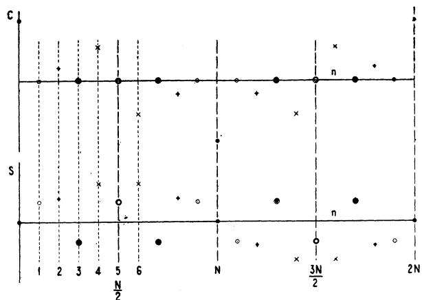

FIG. 1—DISCRIMINATION FACTOR OF C SIGNAL

Showing the symmetry and redundancy of successive bands. The corresponding points in the various bands are indicated by the same symbol

the discrimination factor is plotted as a function of  $n$ . The signal which is illustrated in this figure may be referred to as the  $c$  signal. It is made of 10 signal elements whose successive magnitude factors are 1, 0, 1, 0, 0, 1, 0, 0, 0, 0. An inspection of the figure will show the symmetrical relation between points in adjacent bands of width  $N/2$ , or 5 in this specific example. Suppose that the  $c$  signal is sent in  $T$  seconds. Then the frequency corresponding to the fifth harmonic is  $5/T$  (generally  $N/2T$ ) which is also the speed of signaling.

If  $C_n$  and  $S_n$  have been determined throughout any one of the bands, their values (and,  $F(\omega)$  being known, also the values of  $A_n$  and  $B_n$ ) are immediately known for the whole range from zero to infinity. Each such band contains all the information about the signal that

the totality of bands from zero to infinity contains. One such band (or its equivalent) is necessary and sufficient to determine the original signal. It will be understood that information about  $F(\omega)$  is not intelligence in the sense here considered. It is not necessary that the receiving end should have any information about  $F(\omega)$  at the sending end and consequently, no frequency range or line time need be set aside for transmitting such information. The frequency range which must be transmitted to specify one band is numerically equal to the speed of signaling.

A special case occurs if the transmitted band is chosen such that the shape factor is zero at some point within it. Then  $A_{n}$  and  $B_{n}$  corresponding to this term, will be zero and the values of  $C_{n}$  and  $S_{n}$  are indeterminate. The mathematical treatment of this case would be long and difficult and it is, moreover, thought that these cases are of little practical interest. For these reasons no further discussion will be given to them.

# DISTORTIONLESS TRANSMISSION

It is obvious that with a finite transmitted frequency range and with a rectangular sent wave, there will be deformation of the wave form. It is, however, possible to have a deformed wave and have a receiving device such that a perfect signal is received. Suppose, for instance, that the receiving device records the value of the wave at the mid-instant of the time unit corresponding to each signal element. Then all that matters is the value of the wave at that instant; it does not matter how much it is deformed in intervening intervals. For convenience the term non-distorting wave, will be introduced and will be defined as a wave which produces perfect signals. A non-distorting wave may or may not be deformed. The criterion for a non-distorting wave will vary with the manner of receiving the signal. In this paper, when not otherwise stated, the illustration just indicated will be taken as the criterion, i.e., a wave will be said to be non-distorting when the value at the mid-instant of any time unit is proportional to the magnitude factor for the corresponding element. In Appendix II-A, the shape factor for this kind of wave is computed. When the transmission characteristic of the system is such that the received wave has this shape factor, the received wave is non-distorting regardless of the number of distinct magnitude factors employed. It will be understood that this criterion is illustrative only. Later, alternative criteria will be illustrated and discussed sufficiently to enable the reader to construct his own criterion proper for the system in which he is interested.

Before proceeding to determine the characteristics of the telegraph system which insure the ideal shape factor just discussed it is worth while to broaden the subject somewhat by considering what other shape factors are capable of producing the same results. Appendix II-A gives the deduction of more general shape factors which

meet the requirements of being ideal. In Fig. 2,  $a$  is a diagram of the shape factor deduced as ideal, above. It is shown in Appendix II-A that shape factors symmetrical about  $2\pi s$ , after the manner illustrated at  $b$  in Fig. 2, do not contribute anything to the current value at the middle of the signal elements. Hence it is deduced that shape factors such as shown at  $c$  are also ideal in the same sense. There are obviously an infinite number of these shape factors. In addition, there are an infinite number of purely imaginary shape factors having the type of symmetry about  $2\pi s$  which do not contribute to the value of the wave at the middle of the signal element. Each one of this infinity of imaginary shape factors may, of course, be combined with any one of the infinity of real shape factors spoken of above.

In order to visualize better the theoretical results obtained so far, these results will be stated in terms of the design of a telegraph circuit. What must be the characteristics of a telegraph circuit in order that the application of the rectangular voltage wave whose shape factor is  $F_{s}$  shall result in the non-distorting received wave just discussed, whose shape factor may be

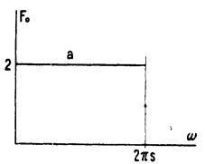

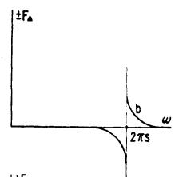

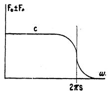

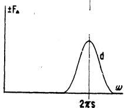

FIG. 2—IDEAL SHAPE FACTORS

Here the criterion for distortionless transmission is that the height of the middle of each signal element should be undistorted

$a$  and  $c$  represent real shape factors which produce a non-distorting wave,  $-b$  and  $d$  shape factors which may be added without producing distortion, the former representing a real and the latter an imaginary value

taken as  $F_{r}$ ? One answer is that the transfer admittance of the circuit  $Y$  should be made such that  $F_{r} = YF_{s}$ . It will be understood that the quantities  $Y$  and  $F_{r}$  may be complex. If the condition just stated were met, transmission would be instantaneous. This imposes an unnecessary restriction on the transfer admittance  $Y$ . The signal will still be distortionless if all the components suffer a constant lag  $\tau$ . If all the components are given a phase lag, which, when specified in angular measure, is directly proportional to the frequency, the received wave is not changed in shape

4. The term admittance and the notation  $Y$  is used to denote the ratio of the numerical value of two waves regardless of their nature. This is a convenient generalization of the customary usage, where this terminology is confined to the case where the numerator of the ratio is a current, and the denominator a voltage.

but merely displaced in time and this is, of course, permissible. This leads to the following expression:

$$
Y = \frac {F _ {\tau}}{F _ {s}} (\cos \omega \tau - i \sin \omega \tau)
$$

for the transfer admittance where  $\tau$  is the delay. Once the desired value of  $Y$  has been found by this method, the problem is reduced to measuring the phase and attenuation characteristics of the circuit and designing suitable attenuation and phase correctors to make the total transfer admittance equal to  $Y$ . The actual design of attenuation and phase correctors does not come within the scope of the present paper.

Appendix II-B has been added for the purpose of making a concrete application. It may be omitted without loss of continuity in the theory.

The criterion of perfect transmission in what precedes has been that the current value at the midpoint of the time unit should bear a constant ratio to the impressed voltage. It will be noted that this is considerably different from the case of ordinary two-condition telegraphy, where the criterion for perfect transmission is that the interval between the instants when the current passes through the mean value (or some other specific value) shall be the same as the corresponding interval at the transmitting end. The principal reason why this criterion has not been used above, is that the corresponding method of reception is not so readily available in the general case where more than two conditions are used. However, it is of considerable practical importance and for this reason, computations are given, (Appendix III), of the shape factor for a wave which has the property in question, i.e., of giving a non-distorting wave in ordinary land-line telegraphy. While the mathematics in Appendix III is carried out for an arbitrary number of magnitude factors, it is suggested that it will simplify the reader's picture to think of two magnitude factors only. Then the discussion applies to ordinary land-line telegraphy. It is there found that a shape factor for the received wave which satisfies this condition is

$$
F _ {r} = 2 \cos \omega / 4 s, \text {w h e n} 0 <   \omega <   2 \pi s
$$

$$
F _ {r} = 0, \text {w h e n} 2 \pi s <   \omega
$$

For d-c. telegraphy (rectangular sent wave) this corresponds to a transmission characteristic given by the equation

$$
\begin{array}{l} Y = \frac {F _ {r}}{F _ {s}} (\cos \omega \tau^ {\prime} - i \sin \omega \tau^ {\prime}) \\ = \frac {\omega}{4 s} \cot \frac {\omega}{4 s} (\cos \omega \tau^ {\prime} - i \sin \omega \tau^ {\prime}), \\ \end{array}
$$

when  $0 <   \omega <  2\pi s$  and  $Y = 0,$  when  $\omega \geq 2\pi s$

This particular shape factor has the disadvantage that the amplitude is a function of the signal combination; in particular, a long continuation of reversals

finally approaches zero in amplitude. To overcome this, it is possible to add shape factors which are symmetrical about the signaling frequency, such as are shown in Fig. 3, and discussed more fully in Appendix III.

By way of further illustrating the method, the shape factor is worked out for a received wave having the property that the area under the wave for a time unit is proportional to the current at the transmitting end. This case may be of interest in some methods of picture transmission where the integrated exposure over a small interval of time may be important. Other criteria for distortionless transmission suggest themselves. For example, the signal may be taken distortionless when the area under the wave for the center fifth of the time unit is proportional to the sent current. Such cases may be of interest in certain types of printer reception where the current flowing during the center fifth of each element might be the quantity which is of interest. As another example, it may be that the slope of the received current as well as the

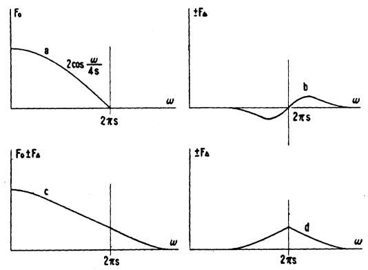

FIG. 3—IDEAL SHAPE FACTORS

In this figure, the criterion of distortionless transmission is that the width or duration of each signal element at the mean-value point should be uddistorted

$a$  and  $c$  represent real shape factors which produce a non-distorting wave,  $-b$  and  $d$  shape factors which may be added without producing distortion, the former representing an imaginary and the latter a real value

current value determines the operation of the receiving

device, in which case some such function as  $aI + b\frac{dI}{dt}$

would probably be a suitable quantity in terms of which to define distortionless transmission. It is thought that the reader who is interested in any specific receiving device will have no difficulty either in formulating a suitable criterion or in computing the corresponding shape factor in accordance with the method illustrated. In the meantime, the current at the center of the signal element will be taken as the criterion.

# ANALYSIS OF CARRIER WAVE

The analysis for the carrier-current wave, analogous to the d-c. wave discussed above, is carried out in Appendix IV. There it is shown that when no care is taken to relate the speed of signaling and the carrier frequency there is no longer

a simple separation into a shape factor and a discrimination factor, such as was observed in the case of d-c. telegraphy. The expression for the sinusoidal components is:

$$
A _ {n} - i B _ {n} = F ^ {\prime} (\omega) \left(C _ {n} ^ {\prime} - i S _ {n} ^ {\prime}\right) + F ^ {\prime \prime} (\omega) \left(C _ {n} ^ {\prime \prime} - i S _ {n} ^ {\prime \prime}\right)
$$

If, however, the carrier frequency is taken as an even multiple of the speed of signaling, so that the carrier current is proportional to  $\cos (2\pi qst - \theta)$ , where  $q$  is even, it is found that

$$
\begin{array}{l} C ^ {\prime \prime} _ {n} - i S ^ {\prime \prime} _ {n} = e ^ {i 2 \theta} \left(C ^ {\prime} _ {n} - i S ^ {\prime} _ {n}\right) = e ^ {i (\pi q / 2 + \theta)} \left(C _ {n} - i S _ {n}\right) \\ \text {s o t h a t} \end{array}
$$

$$
\begin{array}{l} A _ {n} - i B _ {n} \\ = \left[ e ^ {- i (\pi q / 2 + \theta)} F ^ {\prime} (\omega) + e ^ {i (\pi q / 2 + \theta)} F ^ {\prime \prime} (\omega) \right] \left(C _ {n} - i S _ {n}\right) \\ \end{array}
$$

which may be written

$$
A _ {n} - i B _ {n} = F (\omega) \left(C _ {n} - i S _ {n}\right)
$$

where  $C_n$  and  $i S_n$  have the same values as in the direct-current case.

$F(\omega)$  is, of course, different in the present case and depends among other things on the phase of the carrier wave at the beginning of the signal element. More specifically the value of the shape factor is given by the expressions:

$$
F (\omega) = e ^ {- i \left(\pi q / 2 + \theta\right)} F ^ {\prime} (\omega) + e ^ {i \left(\pi q / 2 + \theta\right)} F ^ {\prime \prime} (\omega)
$$

$$
F ^ {\prime} (\omega) = \frac {4 \mathrm {s} \sin \left(\omega_ {c} - \omega\right) / 4 \mathrm {s}}{\omega_ {c} - \omega}
$$

$$
F ^ {\prime \prime} (\omega) = \frac {4 s \sin (\omega_ {c} + \omega) / 4 s}{\omega_ {c} + \omega}
$$

It is shown in Appendix IV that when the carrier frequency is an odd multiple of the speed of signaling,  $(A_{n} - iB_{n})$  takes on a slightly different form. However, the following discussion applies equally well whether  $q$  is odd or even.

$F^{\prime}(\omega)$  represents two bands symmetrical about the carrier frequency, each being identical except for sign with the band determined for the direct-current cases.  $F''(\omega)$  is a non-symmetrical band and interferes with the symmetry between the upper and lower sidebands. It is shown in Appendix IV that this factor is due to the presence of components higher than the carrier frequency in the modulating wave. Hence, one method of suppressing this factor, and keeping the sidebands symmetrical, is to remove these components from the modulating wave before modulation takes place. A second method of making the shape factor symmetrical is to use an equalizing device, which is so designed as to multiply each component by the ratio

$$
\frac {F ^ {\prime} (\omega)}{F ^ {\prime} (\omega) + e ^ {i 2 \theta} F ^ {\prime \prime} (\omega)}
$$

Finally it should be noted that if the band width is small in comparison with the carrier frequency,  $F''(\omega)$  is small in comparison with  $F'(\omega)$  and, therefore, substantial symmetry is obtained without any special precautions.

If the two sidebands are symmetrical, corresponding

frequencies equidistant from the carrier frequency combine to form a wave whose frequency is equal to the carrier frequency and whose envelope is a sine wave corresponding to a component in the direct-current case. The frequency of the envelope equals the difference in frequency between the carrier frequency and that of each of the components forming the pair. On account of the mutual redundancy of the two sidebands, the total frequency range required in the symmetrical carrier case (i.e., in the case where the carrier frequency is located in the middle of the transmitted range) for a given speed of signaling is just twice that required in the direct-current case. Except for this, the results as to band width required, and ideal shape factors for the received wave, are the same as obtained above for the direct-current case and it is not necessary to repeat them.

It is obvious that this type of carrier telegraph is relatively inefficient in its utilization of the available frequency range, and it becomes of great interest to inquire how this condition may be improved. An obvious thought is to move the carrier frequency toward one edge of the available band and to increase the speed of signaling in proportion to the interval between the carrier frequency and the far edge of the transmitted range. If an experiment of this kind is undertaken the outcome will be disappointing, unless certain stringent requirements, (explained below), are met. Far from increasing the speed of signaling, it will usually be found that the relocation of the carrier frequency decreases it. This is more fully explained bleow and in Appendix V.

Examining the symmetrical, carrier wave more closely we find that the redundancy residing in having two symmetrical sidebands gives rise to an important property of the received wave. Its frequency is constant, in the sense that the instants of zero value are spaced at constant intervals. This property will be found to restore the intelligence carrying capacity of a given frequency range to the same point as an equal range used in d-c. telegraphy. Let the received signal be  $g(t) \sin \omega t$ , where the factor  $\sin \omega t$  expresses the fact that the frequency is constant. Consider a device which has two sets of input terminals and whose response is proportional to the product of the two waves impressed. Let the wave applied to one set be  $g(t) \sin \omega t$ , and let the other applied wave be  $\sin \omega t$ . Then the average response over a cyle is well known to be proportional to  $g(t)$ , i.e., the envelope. If the second applied wave is  $\cos \omega t$ , the average response over a cycle is zero. There are various devices whose response is proportional to the product of two inputs. For the purposes of this paper it will be convenient to think of a dynamometer with one fixed and one movable coil.

Phase Discrimination. Systems of telegraphy based on these principles, which may be called phase discrimination systems, have been proposed. Two carrier

currents are provided, one of which may be represented by  $\sin \omega t$  and the other by  $\cos \omega t$ . Each of these is then modulated in accordance with a separate signal, and the mixture of the signals is impressed on the line. At the receiving end the composite signal wave is impressed on each of two dynamometers whose other windings are energized by currents of the values  $\sin \omega t$  and  $\cos \omega t$ , respectively. Thus one dynamometer responds to each signal and there is substantially no mutual interference.

It is clear that in this system the total amount of intelligence transmitted for a given band width is twice as great as for the symmetrical carrier case which does not utilize phase discrimination and is, in fact, the same as for the direct-current case.

Single Sideband Transmission. We are now in position to take up the single sideband case. In Appendix V, it is shown that when the carrier frequency is removed from the center of the transmitted band the received wave may be considered to be made up of three component waves. The first of these is an in-phase wave and builds up in the same manner as does a d-c. wave in a low-pass system having a band width equal to the distance from the carrier frequency to the far edge of the transmitted band. This is obviously the wave which we are trying to obtain; and if it existed by itself, the problem would be solved and the experiment referred to above would be successful. The second wave is also in-phase but builds up at a slower rate, namely, that corresponding to the distance from the carrier frequency to the nearer edge of the transmitting band. Since these components are in phase they add algebraically at any given time and it is obvious that the time of building up will tend to be determined by the slower component. Hence, the normal result of moving the carrier from the middle is a slowing up rather than the reverse. Besides, there is the third component wave. This is a quadrature component which is determined in magnitude and rate of building by the frequency band, by which the separation of the carrier and the far sideband exceeds the separation between the carrier and the near edge. This component, moreover, does not build up to the signal wave, but rather to something approximating the first derivative of the signal envelope. It is clear that the second and third components must both be eliminated. In addition, there is an important condition as to phase correction. Ordinary filters are subject to considerable phase distortion in the vicinity of the edges of the transmitted band. It is of importance that this phase distortion be corrected by suitable means. The problem of single sideband transmission may now be separated into three parts.

1. Phase correction.

2. Elimination of the quadrature component, being the third component discussed.

3. Elimination of the sluggish in-phase component, being the second component discussed.

The first of these problems, the design of phase-correcting networks, does not come within the scope of the present paper. The second part of the problem, the elimination of the quadrature component, is solved by the methods of phase-discrimination telegraphy described above. The third part of the problem, the elimination of the sluggish in-phase component, is solved by moving the carrier so far toward the edge that it disappears. The exact requirements to be met are set forth in the appendix.

# GENERALIZED WAVE FORM

Two kinds of impressed wave forms have been discussed, the rectangular, used in d-c. telegraphy, and the sinusoidal, used in carrier telegraphy. It is of interest to generalize the treatment of impressed waves to cover any other wave form which may be considered, and to include these two as special cases. The restriction will be imposed that the successive signal elements are alike, except for a constant factor which is given the values,  $a_1, a_2$ , etc., for the various signal elements. There is no need to confine the elements to a single time unit. It may overlap into neighboring time units. To facilitate visualizing the wave, Fig. 4 is drawn, which indicates how an impressed wave may overlap both antecedent

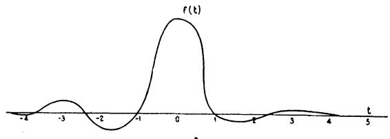

FIG. 4—SPECIMEN OF GENERAL WAVE FORM

and subsequent elements. Mathematically it may be expressed by saying that the contribution made by the  $h$ th signal element to the impressed wave is given by the expression

$$
I _ {h} = a _ {h} f (t)
$$

where  $f(t)$  is an arbitrary function of the time  $t$ , whose origin is conventionally taken at the center of the signal element in question. It will be remembered that  $a_h$  is called the magnitude factor and  $f(t)$  the wave form. Incidentally, the assumption that the wave form is the same from element to element, excludes the carrier waves where the carrier frequency is not an even multiple of the speed of signaling. We may, therefore, expect to avoid some of the complications which arose in the analysis of those waves. The total wave at any given time is, of course, the algebraic sum of all the components existing at that time.

$$
I = I _ {1} + I _ {2} + I _ {3} +, \text {e t c .}
$$

The Fourier analysis is given in Appendix VI. It is there shown that the sinusoidal components are given by the expression

$$
A - i B = F \cdot (C - i S)
$$

In other words, there is still the simple separation into two factors, the shape factor and the discrimination

factor. The latter is identical with that obtained in the previous cases. The shape factor is determined from the known value of  $f(t)$  by the expression

$$
F (\omega) = 4 s \int_ {- \infty} ^ {+ \infty} f (t) e ^ {- i \omega t} d t
$$

Now it will be recalled that the shape factor of the received wave is given by the expression

$$
F _ {r} = Y F _ {s}
$$

and in our previous work, we have evaluated  $Y$ , the transmission characteristic of the circuit, so as to obtain a desired value of  $F_r$  for a given  $F_s$ . In other words, a desired received current is obtained with a given sent wave by means of circuit design. The present results suggest that the desired  $F_r$  can be partly obtained by modifying  $F_s$  as well; in other words, the desired received current can be obtained in part by circuit design and in part by signal shaping at the transmitting end.

While signal shaping and equalizing are equivalent it does not follow that they are equally practicable. It may be said that under usual conditions the use of networks is the simpler when only moderate accuracy is required; whereas, the use of signal shaping provides the greater accuracy but is complicated.

There is an infinite number of sent waves which result in non-distorting received waves. Thus it is, for instance, permissible to use a sent signal element consisting of a succession of rectangular waves such as shown in Fig. 9; provided the intervals between changes are not made too great. The calculations for this case are given in Appendix VII.

In the introductory part of the paper mention was made of the fact that the design of equalizers would not be covered. It was also stated that a method of signal shaping would be discussed, which would make up for the resulting incompleteness of the theory. The discussion of the present section, together with Appendix VII, in the matter there referred to.

# DUAL ASPECT OF SIGNALING WAVE

It will be apparent from what has preceded that there are two distinct methods of specifying the wave. One method is based on the time  $t$  as the independent variable. This aspect, which may be referred to as progressive, contemplates the signaling wave as a succession of signal elements following one another at constant intervals of time from the first to the  $N$ th. The other aspect which may be called the cyclical aspect, is based on  $\omega$  as the independent variable. This contemplates the signaling wave as the sum of direct current and a succession of sinusoidal components beginning with the fundamental and including harmonics at least up to the  $N/2$ th. In the cyclical aspect, it is necessary to know only the magnitude and phase of the successive components. It does not matter in specifying the signal what time it took to transmit the signal. It may be of

some economic interest to know how rapidly the signal is transmitted, but from a technical standpoint,  $t$  is very much in the background. Analogously, with the progressive aspect of the wave the frequency is very much in the background. It is not required to specify the wave, but is of economic interest, in the sense that it is of interest to know the frequency range required for transmission.

An enumeration will now be made of analogous processes and quantities under the two aspects. The signal element is the unit out of which the signal is made up when considered as a progressive wave; when considered as a cyclical wave the corresponding elementary unit is the sinusoidal component. The signal element has been denoted by  $I_{h}$  and the whole wave by  $I = \sum I_{h}$ : The sinusoidal component is specified by  $A_{n}$  and  $B_{n}$  and the whole wave by  $I = \sum (A_{n}\cos npt + B_{n}\sin npt)$ . The intelligence transmitted is specified in the cyclical aspect by the discrimination factor,  $C_{n} - iS_{n}$ ; in the progressive aspect this office is taken by the magnitude factor  $a_{h}$ .

The wave form  $f(t)$  specifies the shape, or form, of the signal element and includes the degree of deformation. The analog in the cyclical case is the shape factor  $F(\omega)$ . The alteration in the wave, which is caused by the circuit or any circuit part, is specified in the cyclical aspect by the phase and magnitude changes; and to be definite, it may be taken as the transfer admittance,  $Y(\omega)$ , which is a function of  $\omega$ , and which may be defined as the wave (specified as to magnitude and phase) resulting at the driven point due to impressing a unit sinusoidal wave at the driving point. The analog in the progressive case is the indicial admittance,  $A(t)$ , which may be defined to be the wave as a function of  $t$ , resulting at the driven point from suddenly impressing a unit wave (constant) at the driving point.

In order to change from one method of consideration to the other, it is desirable to have available equations for changing from the set of quantities suitable for one method to the set suitable for the other. These equations fall into three groups. The first relates the wave form and the shape factor, the quantities which define the type of wave used. The second relates the discrimination factor and the magnitude factor, the quantities which define the particular signal. The third relates the transfer admittance and the indicial admittance, the quantities which define the effect of the circuit on the signaling wave.

The equations are:

$$
\begin{array}{l} F (\omega) = 4 s \int_ {- \infty} ^ {+ \infty} f (t) e ^ {- i \omega t} d t \\ f (t) = \frac {1}{8 \pi s} \int_ {- \infty} ^ {+ \infty} F (\omega) e ^ {- i \omega t} d \omega \\ \end{array}
$$

$$
\begin{array}{l} C _ {n} - i S _ {n} = \frac {1}{N} \sum_ {h = 1} ^ {N} a _ {h} e ^ {- i (2 \pi n / N) (h - 1 / 2)} \\ a _ {h} = \sum_ {n = - N / 2} ^ {N / 2 - 1} \left(C _ {n} - i S _ {n}\right) e ^ {i 2 \pi n (h - 1 / 2) / N} \\ Y (\omega) = - \int_ {- \infty} ^ {+ \infty} \iota \omega e ^ {- i \omega t} A (t) d t \\ A (t) = \frac {Y (0)}{2} + \frac {1}{\pi} \int_ {- \infty} ^ {+ \infty} \frac {Y (\omega) e ^ {i \omega t}}{i \omega} d \omega \\ \end{array}
$$

Negative values of the argument  $\omega$  do not require the conception of negative frequencies. The frequency may be thought of as signless and as represented by positive and negative values of  $\omega$  or both.

With either set of quantities, given, or found by the equations, it is possible to make corresponding computations in the two systems. For instance, when the shape factor of the sent wave and the transfer admittance are known, the shape factor of the received wave can be computed from the expression

$$
F _ {r} (\omega) = F _ {s} (\omega) Y (\omega)
$$

Analogously, if the sent wave form and the indicial admittance are known, the received-wave form can be computed from the expression

$$
f _ {r} (t) = \frac {d}{d t} \int_ {- \infty} ^ {+ \infty} A (\lambda) f _ {s} (t - \lambda) d \lambda
$$

or others which are equivalent. Further, if the transmission characteristics of two circuits connected in tandem are known, their combined characteristic can be computed from

$$
\boldsymbol {Y} (\omega) = R Y _ {1} (\omega) Y _ {2} (\omega)
$$

in the one system, and from

$$
A (t) = R \frac {d}{d t} \int_ {- \infty} ^ {+ \infty} A _ {1} (\lambda) A _ {2} (t - \lambda) d \lambda
$$

or an equivalent.  $R$  is a constant in these formulas. It is not the purpose of the present paper to go into circuit relations to any greater extent than is necessary to bring out, clearly, the parallelism and respective self-sufficiency of the two systems. For a fuller exposition of the relations between the various functions of  $\omega$ , the reader is referred to K. S. Johnson's book, "Transmission Circuits for Telephonic Communication" and for a fuller treatment of the functions of  $t$  to J. R. Carson's book, "Electric Circuit Theory and the Operational Calculus."

The formulas shown in the last paragraph indicate that the fundamental parallelism between the two kinds of functions extends to calculations of the received wave. There is a difference, which is not of great significance from the standpoint of pure theory, but which is important from the standpoint of practical computation. It is seen that in the case of functions of  $\omega$  the operations consist of the multiplication of two characteristics. In fact, by expressing the characteristic in terms of a logarithmic function of  $Y$  in the usual manner, it is possible to reduce these operations to additions. In the case of the functions of  $t$  the computations are much more complex involving differentiation, the multiplication of two functions, and the evaluation of an integral. The processes of differentiation and integration, are, in general, essentially graphical operations which cannot be carried out with the same precision as processes which are essentially arithmetical. It is, therefore, as a practical matter, greatly advantageous to arrange the calculations so they can be carried out with functions of  $\omega$ .

The important fact is that for telegraph purposes the two methods are substantially equivalent in result, though different in processes and labor involved. The fundamental reason for this difference is that, on the theory as developed in the paper, it is not necessary to compute the received wave as a function of  $t$ .5

The method of analysis used in this paper is that of the Fourier series. It should be mentioned at this point that there is an alternative method, known as that of the Fourier integral. The Fourier integral can be made to yield essentially the same mathematical formulas as have been obtained in this paper. Also, if care is taken, it is possible to obtain essentially the interpretations here given. Appendix IX sets forth the relation between the series and the integral, and points out the problems where special care is needed in applying the integral.

# INTERFERENCE

So far it has been assumed that the circuit is free from external interference. In any actual case there is always some interference present, and it is necessary to take it into account. The effect of the interfering wave is to superpose itself on the singaling wave and give the resultant received wave a different value, which otherwise it would not have. If the interference is great enough, the received wave will be interpreted as different from that intended. If the interference is non-predictable, (as likely to be positive, as negative), its arithmetical value must be less than one-half the difference between any two current values employed in signaling. In fact, the number of distinct magnitude factors, hence, the amount of intelligence that can be transmitted over a circuit, are definitely

5. Submarine Cable Telegraphy, J. W. Milnor, A. I. E. E. TRANSACTIONS, Vol. 41, p. 20; in particular the suggestion made in the closing paragraph on p. 38.

limited by the interference. It is, therefore, important to consider the nature of the interference and to determine to what extent, if at all, it may be overcome.

Interference may be of many kinds and sources, including such telegraph currents as cross-fire and duplex unbalance. We shall go a step further and consider as interference such portions of the telegraph wave as result from departure from the ideal of the telegraph current. Thus the difference between the actual wave and the desired ideal wave is interference. It is realized that this convention is not in agreement with common usage but, for the purposes of this paper, it is justified by the simplification which results. In order to distinguish this interference from other forms it may be called the characteristic interference. The term intersymbol interference has also been used for this effect. It is closely related to characteristic distortion.[6]

Interference may usually be reduced by suitable means: Duplex unbalance currents may be reduced by improving the balance; characteristic interference may be reduced by improving the transmission characteristic; and interference from other circuits reduced by decreasing the coupling. But when everything practicable has been done to reduce the interference, there is, in general, a residual left which produces distortion in the signals. The total amount of interference sets a limit to the number of distinct magnitude factors which may be employed and, therefore, to the rate with which intelligence may be transmitted over the circuit. The interference which can be tolerated depends on the amount of energy in the signaling current. This is again limited by the power-carrying capacity of the line, either because certain apparatus overloads or because interference into other circuits becomes too great.

It is of considerable interest to determine the spectral distribution of power in the signal which is most suitable for overriding a given interference. The assumption will be made that the maximum power is definitely limited. It is shown in Appendix VIII that when the shape factor is a constant from zero to the frequency  $s$  and zero for other frequencies, the mean total power is proportional to

$$
\frac {1}{N} \sum_ {h = 1} ^ {N} a _ {h} ^ {2}
$$

and it follows that for this case all signals which are made up of the extreme values of the magnitude factors, (it is assumed that the positive and negative values are numerically equal), load up the system to the same extent. If some other shape factor were used it would, in general, result in the maximum power only for the most favored signal combination; for others, the power would be less. It is concluded that for the purpose of

6. Measurement of Telegraph Distortion, Nyquist, Shanck and Corv, A. I. E. E. J.L., Vol. 46, p. 231, 1927.

overriding interference, when the power carrying capacity of the line is the limiting factor, the shape factor just considered is the most suitable at the point where the interference is introduced.

In discussing the interference above, it has been assumed that the circuit is linear. If some of the circuit elements are non-linear, the result may be looked on as interfering currents generated in the elements. This interference is predictable and it is theoretically possible to eliminate or reduce it by introducing elements which produce a compensating distortion.

The assumptions have been made that the signal elements are all of equal duration and that the system is designed especially to handle signal elements of that specific duration. In other words, the system is designed for a given speed of signaling in preference to other speeds, both slower and faster. It is of obvious interest to inquire what the effect is when the speed is somewhat different from that for which the system has been designed, the signal elements being of equal length.

Suppose a system is designed to be distortionless at a speed of signaling  $s$ , and suppose that it is used to transmit signals of the speed  $\gamma s$ , where  $\gamma$  is a factor which does not differ greatly from unity. Let the system be such that the admittance is given by

$$
Y (\omega) (\cos \omega \tau - i \sin \omega \tau)
$$

An admittance which would give distortionless transmission at the speed of  $\gamma$ s is then given by the expression

$$
Y (\omega / \gamma) (\cos \omega \tau - i \sin \omega \tau)
$$

The difference between the actual admittance given by the first expression and the ideal admittance given by the second expression represents an admittance giving rise to interfering currents. Neglecting the constant delay, this admittance is given by the expression

$$
Y (\omega) - Y \left(\omega / \gamma\right)
$$

and the current corresponding to this admittance is the portion of the characteristic interference which arises from the alteration in speed.

Formulas for the interfering wave may be deduced from this expression, but it will be sufficient for our purposes to note the ratio of the interfering wave to the signaling wave at a specific frequency. This ratio is given by the expression

$$
\frac {Y (\omega) - Y . (\omega / \gamma)}{Y (\omega)}
$$

or approximately

$$
\frac {(\omega - \omega / \gamma)}{Y (\omega)} \cdot \frac {d Y}{d \omega} \quad .
$$

It will be seen that for a small discrepancy between the ideal speed and the actual speed the amount of distortion is largely determined by the slope of the transfer admittance curve. The more abruptly the transfer admittance changes, the greater will be the

interference accompanying a small change in signaling speed.

It has been assumed that the change of speed is uniform,  $i.e.$ , that all signal elements are lengthened or shortened in the same proportion. It is of considerable practical interest to inquire what happens when there is no such regularity in the change of speed, in other words, when some signal elements are shortened and some are lengthened and when the various elements are not changed in the same proportion. Consider first a signal consisting of a single element of finite current value, the current values of the remaining signal elements being zero. It is clear that it makes no difference where the ends of the signal elements are taken when the current value is zero, and consequently this particular signal may be considered to come under the case already discussed. In other words, the interference due to any one element is as discussed above. Further, the total interfering current at any instant is the sum of the interference caused by all the elements. It follows that to a first approximation, the interference is the same as that deduced above for the regular lengthening or shortening.

It has been indicated that if interference from foreign sources is kept low, the transfer admittance made to comply with certain requirements and the speed of signaling kept constant, it is possible to transmit signals with very little distortion, utilizing a frequency range which is only slightly greater than the speed of signaling. One advantage of keeping the distortion small is that a large number of current values may be employed, thus increasing the intelligence-carrying capacity of the line. As explained above, the total interfering current should be less than one-half the difference between adjacent current values. In actual practise it will probably be found desirable to keep considerably within these limits, so as to have a definite margin. On the other hand, there would be no object in reducing the interference beyond the point where the signal is decipherable with certainty and ease.

# Appendix I.

Analysis of  $D-C$ . Wave. It is required to find the sinusoidal components of a telegraph wave of  $T$  sec. duration composed of  $N$  rectangular signal elements and repeated an indefinitely great number of times. Let the value of the wave at any instant be denoted by  $E(t)$ , where

$$
E (t) = a _ {1} \text {f o r} 0 <   t <   T / N, (\text {t i m e u n i t} 1),
$$

$$
E (t) = a _ {2} \text {f o r} T / N <   t <   2 T / N, (\text {t i m e u n i t} 2),
$$

$$
E (t) = a _ {h} \text {f o r} (h - 1) T / N <   t <   h T / N, (\text {t i m e u n i t} h).
$$

Represented as a Fourier series the wave is

$$
E (t) = \frac {A _ {0}}{2} + \sum_ {n = 1} ^ {\infty} \left(A _ {n} \cos n p t + B _ {n} \sin n p t\right), \tag {1}
$$

where  $p / 2\pi = 1 / T$  is the frequency of the fundamental wave. The problem is to find expressions for the  $A$ 's

and  $B$ 's, so they can be computed from the known values of the  $a$ 's.

Multiply both sides of the equation by  $\cos kpt dt$  and integrate from zero to  $T$ . In this expression  $k$  is a positive integer.

$$
\begin{array}{l} \int_ {0} ^ {T} E (t) \cos k p t d t = \frac {A _ {0}}{2} \int_ {0} ^ {T} \cos k p t d t \\ + \sum_ {n = 1} ^ {\infty} A _ {n} \int_ {0} ^ {T} \cos k p t \cos n p t d t \\ + \sum_ {n = 1} ^ {\infty} B _ {n} \int_ {0} ^ {T} \cos k p t \sin n p t d t, \tag {2} \\ \end{array}
$$

From a well-known trigonometric formula

$\cos kpt\cos npt = \frac{\cos(k + n)pt + \cos(k - n)pt}{2}.$

The integration is carried out over an integral number of cycles and the result is, therefore, equal to zero with the single exception where  $n = k$  when the integrand has the average value  $1/2$  and the integral is  $T/2$ .

Likewise,

$\cos k p t \sin n p t = \frac{\sin (k + n) p t - \sin (k - n) p t}{2}$

The integrals of these obviously are also zero. The right member of equation (2) reduces, therefore, to the single term

$$
A _ {k} T / 2.
$$

The left member of equation (2) may be written

$$
a _ {1} \int_ {0} ^ {\mathrm {T} / \mathrm {N}} \cos k p t d t + a _ {2} \int_ {\mathrm {T} / \mathrm {N}} ^ {2 \mathrm {T} / \mathrm {N}} \cos k p t d t + \text {e t c .}
$$

or

$$
\sum_ {h = 1} ^ {\mathrm {N}} a _ {h} \int_ {(h - 1) \mathrm {T} / \mathrm {N}} ^ {h \mathrm {T} / \mathrm {N}} \cos k p t d t.
$$

Changing the origin of  $t$  to the center of the time unit to which each integral refers,  $i.e.$ , putting

$$
t = (h - 1 / 2) T / N + t ^ {\prime}
$$

and dropping the prime, we have

$$
\sum_ {h = 1} ^ {N} a _ {h} \int_ {- T / 2 N} ^ {T / 2 N} \cos \left[ k \left(h - \frac {1}{2}\right) \frac {T}{N} p + k p t \right] d t
$$

$$
\begin{array}{l} = \sum_ {h = 1} ^ {\mathrm {N}} a _ {h} \left[ \cos k \left(h - \frac {1}{2}\right) \frac {T}{N} p \int_ {- T / 2 N} ^ {\mathrm {T} / 2 \mathrm {N}} \cos k p t d t \right. \\ \left. - \sin k \left(h - \frac {1}{2}\right) \frac {T}{N} p \int_ {- T / 2 N} ^ {+ T / 2 N} \sin k p t d t \right]. \\ \end{array}
$$

The integral in the second term is equal to zero. Rearranging and substituting  $n$  for  $k$ , this expression becomes:

$$
\int_ {- \mathrm {T} / 2 \mathrm {N}} ^ {\mathrm {T} / 2 \mathrm {N}} \cos n p t d t \sum_ {h = 1} ^ {\mathrm {N}} a _ {h} \cos n \left(h - \frac {1}{2}\right) \frac {T p}{N} = \frac {A _ {n} T}{2}. \tag {3}
$$

The value of the integral is:

$$
\frac {2 \sin n p T / 2 N}{n p}.
$$

Remembering that  $T \cdot p = 2\pi$ ,  $N / 2 \cdot T = s$ , the speed of signaling, and  $np = 2\pi n / T = \omega$ , the result becomes

$$
\frac {A _ {n} T}{2} = \frac {2 \sin \omega / 4 s}{\omega} \sum_ {h = 1} ^ {N} a _ {h} \cos \frac {2 \pi n}{N} \left(h - \frac {1}{2}\right)
$$

or

$$
A _ {n} = \frac {8 \sin \omega / 4 s}{\omega / s} \frac {1}{N} \sum_ {h = 1} ^ {N} a _ {h} \cos \frac {2 \pi n}{N} \left(h - \frac {1}{2}\right). \tag {4}
$$

This has now been established for all values of  $n$  except zero. If the same procedure be gone through with equation (1) without multiplying by  $\cos kpt$  it will be found that this formula does in fact hold for  $A_0$  as well. Further, if equation (1) be multiplied by  $\sin kpt$  and the same operations are performed it will be found that

$$
B _ {n} = \frac {8 \sin \omega / 4 s}{\omega / s} \frac {1}{N} \sum_ {h = 1} ^ {N} a _ {h} \sin \frac {2 \pi n}{N} \left(h - \frac {1}{2}\right). \tag {5}
$$

Put  $F(\omega) = \frac{8\sin\omega / 4s}{\omega / s}$  (6)

$$
C _ {n} = \frac {1}{N} \sum_ {h = 1} ^ {N} a _ {h} \cos \frac {2 \pi n}{N} \left(h - \frac {1}{2}\right) \tag {7}
$$

$$
S _ {n} = \frac {1}{N} \sum_ {h = 1} ^ {N} a _ {h} \sin \frac {2 \pi n}{N} \left(h - \frac {1}{2}\right), \tag {8}
$$

The expressions (4) and (5) may now be written

$$
A _ {n} - i B _ {n} = F (\omega) \left(C _ {n} - i S _ {n}\right) \tag {9}
$$

The function  $F$  is determined by the wave form and  $(C_{n} - iS_{n})$  by the intelligence being transmitted. The former will be called the shape factor, the latter the discrimination factor.

It is a matter of convention whether a plus or minus sign is chosen in equation (9). The choice made is consistent with the more usual convention.

# Appendix II-A

Specific Criterion of Distortionless Transmission. It is of interest to investigate how intelligence may be accurately transmitted by signals employing rectangular

lar wave shape at the sending end with a minimum frequency band width. In Fig. 1 it is indicated that this is usually possible when a band width equal to  $s$  is transmitted. A case of practical importance is where frequencies are transmitted from zero up to the speed of signaling. When such a limited frequency range is employed the received wave is, of course, different from the sent wave. In order that the received wave convey intelligence, it is sufficient that something pertaining to the wave in each of its time units be proportional or equal to the magnitude factor of each signal element at the sending end. First, let it be assumed that the received wave at the middle of each time unit, measured by an ideal receiving device, be representative of the signal element sent during that time unit. No notice will be taken of the wave at any other point in the time unit, and consequently deformations of the wave at other points will not matter. It will be computed below what shape factor the received wave must have in order for its value at the middle of each time unit to equal the corresponding amplitude of the sent wave.

Let the current at the receiving end at the middle of the time unit,  $h$ , be equal to  $a_h$ . Now  $t = (h - 1/2)T / N$  at the middle of the time unit, and the Fourier series becomes:

$$
\begin{array}{l} a _ {h} = \frac {A _ {0}}{2} + \sum_ {n = 1} ^ {N / 2} \left[ A _ {n} \cos \frac {2 \pi n}{N} \left(h - \frac {1}{2}\right) \right. \\ \left. + B _ {n} \sin \frac {2 \pi n}{N} \left(h - \frac {1}{2}\right) \right]. \tag {1} \\ \end{array}
$$

There are  $N$  such equations, since  $h$  may successively take the values 1, 2, ...,  $N$ . There are also  $N$  unknown values of  $A$ 's and  $B$ 's. (Note,  $B_0 = 0$  and  $A_{N/2} = 0$ .) These unknowns may be determined by the usual methods of solving simultaneous equations, or more simply in the following manner: Multiply all

equations from  $h = 1$  to  $h = N$  by  $\cos \frac{2\pi k}{N} h - \left(\frac{1}{2}\right)$

and add them:

$$
\sum_ {h = 1} ^ {N} a _ {h} \cos \frac {2 \pi k}{N} \left(h - \frac {1}{2}\right)
$$

(a)

$$
\begin{array}{l} = \frac {A _ {0}}{2} \sum_ {h = 1} ^ {\mathrm {N}} \cos \frac {2 \pi k}{N} \left(h - \frac {1}{2}\right) \\ + \frac {1}{2} \sum_ {h = 1} ^ {\mathrm {N}} \sum_ {n = 1} ^ {\mathrm {N} / 2} \left\{A _ {n} \left[ \cos (n + k) \frac {2 \pi}{N} \left(h - \frac {1}{2}\right) \right. \right. \\ \end{array}
$$

(c)

$$
\left. + \cos \left(k - n\right) \frac {2 \pi}{N} \left(h - \frac {1}{2}\right) \right]
$$

(d)

$$
+ B _ {n} \left[ \sin (n + k) \frac {2 \pi}{N} \left(h - \frac {1}{2}\right) \right.
$$

(e)

$$
\left. - \sin (k - n) \frac {2 \pi}{N} \left(h - \frac {1}{2}\right) \right] \Bigg \}. \tag {2}
$$

In equation (2), use has been made of the trigonometric formulas:

$$
\cos a \cos b = \frac {\cos (a + b) + \cos (a - b)}{2}
$$

$$
\cos a \sin b = \frac {\sin (a + b) - \sin (a - b)}{2}
$$

In order to simplify equation (2) we will employ the identities:

$$
\sum_ {h = 1} ^ {N} \cos x \left(h - \frac {1}{2}\right) = \frac {\cos N x / 2 \sin N x / 2}{\sin x / 2} \tag {3}
$$

$$
\sum_ {h = 1} ^ {N} \sin x \left(h - \frac {1}{2}\right) = \frac {\sin^ {2} N x / 2}{\sin x / 2}, \tag {4}
$$

To prove these identities, multiply the left member of (4) by  $i$  and add to the left member of (3):

$$
\begin{array}{l} \sum_ {h = 1} ^ {\mathrm {N}} \cos \left(h - \frac {1}{2}\right) x + i \sin \left(h - \frac {1}{2}\right) x = \sum_ {h = 1} ^ {\mathrm {N}} e ^ {i (h - 1 / 2) x} \\ = e ^ {- \frac {i x}{2}} \sum_ {h = 1} ^ {\mathrm {N}} e ^ {i h x} = e ^ {\frac {i x}{2}} (1 + e ^ {i x} + e ^ {i 2 x} + \dots . e ^ {i (\mathrm {N} - 1) x}) \\ = \frac {e ^ {\frac {i x}{2}} \left(1 - e ^ {i N x}\right)}{1 - e ^ {i x}} = \frac {e ^ {\frac {i N x}{2}} \left(e ^ {- \frac {i N x}{2}} - e ^ {\frac {i N x}{2}}\right)}{e ^ {- i x / 2} - e ^ {i x / 2}} = \frac {e ^ {\frac {i N x}{2}} \sin N x / 2}{\sin x / 2} \\ = \frac {\cos N x / 2 \sin N x / 2}{\sin x / 2} + i \frac {\sin^ {2} N x / 2}{\sin x / 2}. \tag {5} \\ \end{array}
$$

Equating real and imaginary parts gives equations (3) and (4), respectively.

By applying formula (3) to terms (a), (b), and (c), of equation (2), and applying formula (4) to terms (d) and (e),

$$
\sum_ {h = 1} ^ {N} a _ {h} \cos \frac {2 \pi k}{N} \left(h - \frac {1}{2}\right) = \frac {A _ {0}}{2} \frac {\cos k \pi \sin k \pi}{\sin k \pi / N}
$$

$$
\begin{array}{l} + \frac {1}{2} \sum_ {n = 1} ^ {N / 2} \left[ A _ {n} \left(\frac {\cos (n + k) \pi \sin (n + k) \pi}{\sin (n + k) \pi / N} \right. \right. \\ \left. + \frac {\cos (k - n) \pi \sin (k - n) \pi}{\sin (k - n) \pi / N}\right) \\ \left. + B _ {n} \left(\frac {\sin^ {2} (n + k) \pi}{\sin (n + k) \pi / N} - \frac {\sin^ {2} (k - n) \pi}{\sin (k - n) \pi / N}\right) \right]. (6) \\ \end{array}
$$

As  $k$  approaches any integral value of  $n$ , for instance  $m$ , from 0 to  $N / 2 - 1$  inclusive, all the numerators of the terms in the right-hand member of equation (6) approach zero. Consequently, these terms approach zero except one term

$$
\frac {A _ {m}}{2} \frac {\cos (k - m) \pi \sin (k - m) \pi}{\sin (k - m) \pi / N}
$$

whose denominator also approaches zero. This term becomes  $N A_{m} / 2$ . Setting  $k = m$ , solve equation (6) for  $A_{m}$ :

$$
A _ {m} = \frac {2}{N} \sum_ {h = 1} ^ {N} a _ {h} \cos \frac {2 \pi m}{N} \left(h - \frac {1}{2}\right) = 2 C _ {m}. \tag {7}
$$

Changing subscripts:

$$
A _ {n} = 2 C _ {n}. \tag {8}
$$

Now if, instead, we multiply equation (1) by

$\sin \frac{2\pi k}{N}\left(h - \frac{1}{2}\right)$ , a similar process gives:

$$
B _ {n} = 2 S _ {n}, \quad (n <   N / 2). \tag {9}
$$

But when  $n = N / 2$  this process gives:

$$
B _ {\mathrm {N} / 2} = S _ {\mathrm {N} / 2}. \tag {10}
$$

From equations (8) to (10) it is seen that the shape factor which will be denoted by  $F_0(\omega)$ , is equal to 2 from zero frequency up to the speed of signaling where it suddenly drops to half that value. Above this frequency  $F_0(\omega)$  is equal to zero, as shown in curve a, Fig. 2.

It will next be shown that there is an infinite number of shape factors which may be added to curve  $a$  which produce no change in the current at the middle of the time units. For example, curve  $b$  shows a specimen of such a shape factor, which may be any single valued curve so long as it is symmetrical about the speed of signaling except for a change in sign. When this shape factor is added to that of curve  $a$ , a curve such as  $c$  may result for the total shape factor which is also ideal. Denote the shape factor of curve  $b$  by  $F_{\Delta}(\omega)$ . The wave, due to such a shape factor, is:

$$
\sum_ {n = N / 2 - m} ^ {N / 2 + m} F _ {\Delta} (\omega) \left(C _ {n} \cos n p t + S _ {n} \sin n p t\right)
$$

$$
\begin{array}{l} = \sum_ {n = 0} ^ {m} F _ {\Delta} (\omega) \left(C _ {\mathrm {N} / 2 - n} \cos (2 \pi s - n p) t \right. \\ + S _ {N / 2 - n} \sin (2 \pi s - n p) t) \\ + \sum_ {n = 1} ^ {m} F _ {\Delta} (\omega) \left(C _ {N / 2 + n} \cos (2 \pi s + n p) t \right. \\ + S _ {\mathrm {N} / 2 + n} \sin (2 \pi s + n p) t) \tag {11} \\ \end{array}
$$

where  $m$  is any positive integer less than  $N / 2$ . It follows from equations (7) and (8) of Appendix I that:

$$
- C _ {\mathrm {N} / 2 - n} = C _ {\mathrm {N} / 2 + n} \tag {12}
$$

$$
S _ {\mathrm {N} / 2 - n} = S _ {\mathrm {N} / 2 + n}. \tag {13}
$$

Substitute these relations in equation (11) making use of the trigonometric formulas:

$$
\cos (a - b) + \cos (a + b) = 2 \cos a \cos b \tag {14}
$$

$$
- \sin (a - b) + \sin (a + b) = 2 \cos a \sin b \tag {15}
$$

and put  $F_{\Delta}(2\pi s) = 0$  and  $F_{\Delta}(2\pi s + np) = -F_{\Delta}(2\pi s - np)$  so that the formula for the wave becomes:

$$
\begin{array}{l} \sum_ {n = 1} ^ {m} 2 F _ {\Delta} (2 \pi s + n p) (\cos 2 \pi s t) (C _ {N / 2 + n} \cos n p t \\ + S _ {N / 2 + n} \sin n p t). \tag {16} \\ \end{array}
$$

Since this expression contains the factor  $\cos 2\pi st$ , which is zero at the middle of the time unit, the wave does not have any effect on the receiving device when the latter records current values at the middle of the time units only. The curve  $b$  is any real shape factor, symmetrical about the dot frequency except for a change in sign. Therefore, every such real shape factor when added to curve  $a$  gives a resultant shape factor which is ideal.

It is next desired to show that the addition of an imaginary shape factor which is any single valued function whatever, provided it is symmetrical about the dot frequency in both magnitude and sign, does not contribute to the value of the wave at the middle of the time units. Consider the curve  $d$  of Fig. 2, which represents the magnitude of any symmetrical imaginary shape factor,  $iF_{\Delta}(\omega)$ .

$$
A _ {n} - i B _ {n} = i F _ {\Delta} (\omega) \left(C _ {n} - i S _ {n}\right) = F _ {\Delta} (\omega) \left(S _ {n} + i C _ {n}\right). \tag {17}
$$

Equating real and imaginary parts of equation (17) the values of  $A_{n}$  and  $B_{n}$  are determined, so that the wave may be expressed as follows:

$$
\sum_ {n = N / 2 - m} ^ {N / 2 + m} F _ {\Delta} (\omega) \left(S _ {n} \cos n p t + C _ {n} \sin n p t\right)
$$

$$
\begin{array}{l} = \sum_ {n = 0} ^ {m} F _ {\Delta} (\omega) \left(S _ {N / 2 - n} \cos (2 \pi s - n p) t \right. \\ + C _ {N / 2 - n} \sin (2 \pi s - n p) t) \\ \end{array}
$$

$$
\begin{array}{l} + \sum_ {n = 1} ^ {m} F _ {\Delta} (\omega) (S _ {N / 2 + n} \cos (2 \pi s + n p) t \\ + C _ {N / 2 + n} \sin (2 \pi s + n p) t). \tag {18} \\ \end{array}
$$

Using formulas (12) to (15) and putting  $F_{\Delta}$ $(2\pi s + np) = F_{\Delta}$ $(2\pi s - np)$  the wave becomes:

$$
\begin{array}{l} \sum_ {n = 0} ^ {m} 2 F _ {\Delta} (2 \pi s + n p) (\cos 2 \pi s t) (S _ {N / 2 + n} \cos n p t \\ + C _ {N / 2 + n} \sin n p t), \tag {19} \\ \end{array}
$$

which is zero at the middle of the time units on account of the factor  $\cos 2\pi s t$ . Since this is true for any symmetrical function,  $F_{\Delta}(\omega)$ , there is an infinite number of imaginary shape factors which do not affect the values of the wave at the middle of the time units.

# Appendix II-B

Network for Distortionless Transmission. The purpose of this appendix is to illustrate, concretely, the matter which has been discussed in Appendix II-A, and the portions of the main text associated therewith. This appendix does not form any part of the chain of reasoning in the sense that anything which is here discussed or deduced will be required subsequently. It can, therefore, be eliminated by those who are primarily interested in the deductions of the main theory.

It has been shown in Appendix II-A that a certain

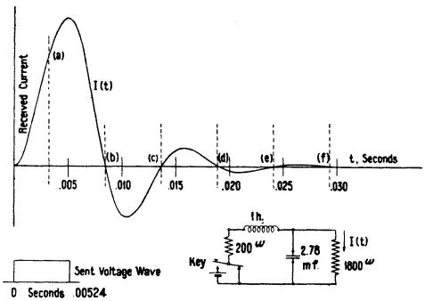

FIG. 5—INSTANCE OF NON-DISTORTING WAVE

ideal shape factor can be modified by the addition of certain other shape factors which possess a specific kind of symmetry about a frequency equal to the speed of signaling. It is obvious, on consideration, that similar shape factors possessing symmetry about the frequencies  $2s$ ,  $3s$ , etc., can also be added in a similar manner without affecting the principal characteristic of the shape factor. These considerations are not of great practical importance in the cases con

sidered because it has been assumed that the important telegraph problem is to transmit maximum intelligence in minimum frequency range. However, these considerations will aid in understanding the subject matter of the present appendix.

Fig. 5 shows a very simple circuit which has been designed for the purpose of illustrating a non-distorting wave. This circuit, containing only two reactance elements, has a very simple form of transient, namely, a uniformly damped sine wave. Now an important

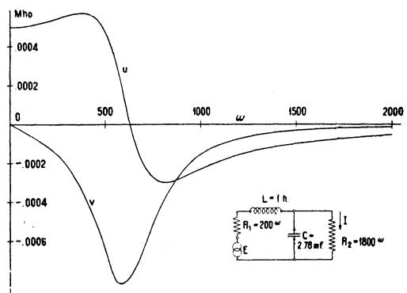

FIG. 6—TRANSFER ADMITTANCE,  $u + iv$ , CORRESPONDING TO THE NON-DISTORTING WAVE SHOWN IN FIG. 5

property of the sine wave is that its zeros are located at equal intervals, which is precisely the property required of a non-distorting wave under the criterion discussed in Appendix II-A. The interval between successive zeros in the illustration chosen is 0.00524 sec.; and this is also made the duration of the time unit of the sent signal, as illustrated in the figure. It will be remembered that on the criterion under discussion a specific point of the signal element is picked out and taken to represent the element. In the case illustrated, this point should be taken at an interval 0.00524 sec. previous to the first zero. It is obvious that if this is done the interference due to all previous signal elements is zero because the interference due to each one of them is zero. It follows that any receiving device which is made to function by the current at that point will be distortionless as far as interference from adjacent signal elements is concerned.

Fig. 6 shows the transfer admittance of the same network. The speed of signaling corresponds to the point for which the abscissa is 600. It will be observed that these curves do not possess the simple symmetrical characteristics discussed in Appendix II-A, but this is because Appendix II-A was confined to a narrow frequency range not much exceeding the signaling range. If consideration be given to this fact, together with facts discussed in the second paragraph of the present appendix, it will be found that this simple network illustrates the theory.

Both the transfer admittance and the value of the current curve are easily computed in the present case. The transfer admittance is given by the expression:

$$
Y = \frac {1}{R _ {1} + R _ {2} + i \omega (L + R _ {1} R _ {2} C) - \omega^ {2} L C R _ {2}}.
$$

The current, from the time  $t = 0$  up to the time  $t = 0.00524$  sec., is given by an expression which takes the following form for the numerical values given:

$$
A (t) = \frac {1}{2 0 0 0} \left[ 1 - e ^ {- 2 0 0 t} \left(\cos 6 0 0 t + \frac {1}{3} \sin 6 0 0 t\right) \right].
$$

After the time  $t = 0.00524$  sec., the current is given by the expression:

$$
\begin{array}{l} A (t) - A (t - 0. 0 0 5 2 4) \\ = \frac {- e ^ {- 2 0 0 t}}{2 0 0 0} \left(1 + e ^ {1 \cdot 0 4 8}\right) \left(\cos 6 0 0 t + \frac {1}{3} \sin 6 0 0 t\right). \\ \end{array}
$$

# Appendix III

Alternative Criteria of Distortionless Transmission. An alternative criterion of distortionless transmission is that the interval, between the instants when the received wave passes through the mean value, shall be the same as the corresponding interval at the transmitting end. A receiving device which responds to the values of the wave at the ends of the time units, instead of at the middle, will give distortionless transmission provided the wave at the end of the element,  $h$ , is proportional to  $(a_h + a_{h+1}) / 2$ . This is the criterion in ordinary land-line telegraphy. Strictly speaking, we should also require that the wave does not pass through this value at points located within the time unit. It is thought that the complication involved by introducing this condition is not warranted. We will first determine the coefficients of the Fourier expansion of this received wave for the case where the frequency range is limited to the interval between zero and  $s$ . We have:

$$
\begin{array}{l} \frac {a _ {h} + a _ {h + 1}}{2} = \frac {A _ {0}}{2} + \sum_ {n = 1} ^ {\mathrm {N} / 2} \left(A _ {n} \cos \frac {2 \pi n h}{N} \right. \\ \left. + B _ {n} \sin \frac {2 \pi n h}{N}\right), \tag {1} \\ (h = 1, 2, \dots . N), \\ \end{array}
$$

since  $t = hT / N$  at the end of the  $h$ th time unit.

As in Appendix II-A, we have  $N$  simultaneous equations and  $N$  unknowns, the  $A$ 's and the  $B$ 's. The solution is of the same nature as before, except that the equations are multiplied by  $\cos \frac{2\pi k h}{N}$  instead of

$\cos \frac{2\pi k}{N}\left(h - \frac{1}{2}\right)$ , before being summed. For values of  $n < N / 2$  we find by similar reasoning:

$$
A _ {n} = \frac {2}{N} \sum_ {h = 1} ^ {N} \frac {a _ {h} + a _ {h + 1}}{2} \cos \frac {2 \pi n h}{N}
$$

$$
= \frac {1}{N} \sum_ {h = 1} ^ {N} a _ {h} \left[ \cos \frac {2 \pi n h}{N} + \cos \frac {2 \pi n (h - 1)}{N} \right]. \tag {2}
$$

By means of the trigonometric formula

$$
\cos a + \cos b = 2 \cos \frac {1}{2} (a + b) \cos \frac {1}{2} (a - b)
$$

we find that equation (2) may be written:

$$
\begin{array}{l} A _ {n} = \frac {2}{N} \left(\cos \frac {n \pi}{N}\right) \sum_ {h = 1} ^ {N} a _ {h} \cos \frac {2 \pi n}{N} \left(h - \frac {1}{2}\right) \\ = 2 \cos \frac {\omega}{4 \mathrm {s}} C _ {n} \tag {3} \\ \end{array}
$$

An analogous line of reasoning gives:

$$
B _ {n} = 2 \cos \frac {\omega}{4 s} S _ {n}. \tag {4}
$$

The shape factor is  $2\cos \omega /4s$  (Fig. 3, curve a), for frequencies up to s, and remains zero for higher frequencies. A transfer admittance which will produce a wave of this form when the sent wave is rectangular is:

$$
Y = \frac {\omega}{4 s} \cot \frac {\omega}{4 s}, \text {w h e n} \omega <   2 \pi s \tag {5a}
$$

$$
Y = 0, \quad \text {w h e n} \omega \geq 2 \pi s. \tag {5b}
$$

This is obtained from the ratio of the shape factor at the receiving end, divided by the shape factor at the sending end.

Such a system would be incapable of transmitting ordinary reversals, since zero current is transmitted for frequencies equal to or greater than the dot speed. This defect may be remedied by the addition of shape factors which are symmetrical about the signaling frequency, and do not contribute anything to the wave at the ends of the time units. By reasoning, analogous to that given at the close of Appendix II-A, it follows that the wave due to any real shape factor, symmetrical about the speed of signaling in magnitude and sign, (Fig. 3, curve  $d$ ), contains the factor  $\sin 2\pi st$ , and, therefore becomes zero at the ends of the time units. In a similar manner it can be shown that the wave due to any imaginary shape factor, symmetrical about the dot frequency in magnitude but not in sign, (Fig. 3, curve  $b$ ), also becomes zero at the ends of the time units. The addition of curve  $d$  to curve  $a$  gives curve  $c$ , which is also an ideal shape factor.

A third criterion for distortionless transmission is that the area under the received wave shall have the same value as that under the sent wave during each time unit. Thus during the time unit  $h$ , the area under the received wave must be:

$$
a _ {h} T / N = \int_ {l = (h - 1) \mathrm {T} / \mathrm {N}} ^ {h \mathrm {T} / \mathrm {N}} \left[ \frac {A _ {0}}{2} + \sum_ {n = 1} ^ {\mathrm {N} / 2} \left(A _ {n} \cos n p t \right. \right.
$$

$$
\left. + B _ {n} \sin n p t\right) ] d t. \tag {6}
$$

This equation may be multiplied by  $N / T$ , integrated, and by means of the trigonometric formulas

$$
\begin{array}{l} \sin a - \sin b = 2 \cos \frac {1}{2} (a + b) \sin \frac {1}{2} (a - b) \\ - \cos a + \cos b = 2 \sin \frac {1}{2} (a + b) \sin \frac {1}{2} (a - b) \\ \end{array}
$$

it may be reduced to the following form:

$$
\begin{array}{l} a _ {h} = \frac {A _ {0}}{2} + \sum_ {n = 1} ^ {\mathrm {N} / 2} \left(\frac {N}{\pi n} \sin \frac {\pi n}{N}\right) \times \\ \left[ A _ {n} \cos \frac {2 \pi n}{N} \left(h - \frac {1}{2}\right) \right. \\ \left. + B _ {n} \sin \frac {2 \pi n}{N} \left(h - \frac {1}{2}\right) \right] \tag {7} \\ \end{array}
$$

This equation is the same as equation (1) of Appendix II-A, except for the factor:

$$
\left(\frac {N}{\pi n} \sin \frac {\pi n}{N}\right) = \left(\frac {4 s}{\omega} \sin \frac {\omega}{4 s}\right)
$$

Consequently the shape factor for this wave is equal to the shape factor of curve  $a$ , Fig. 2, divided by  $4s / \omega$  sin  $\omega /4s$  which reduces to:

$$
\begin{array}{l} F _ {0} (\omega) = \frac {\omega / 2 s}{\sin \omega / 4 s}, \quad \text {f o r} 0 \leq \omega <   2 \pi s, (8) \\ F _ {0} (\omega) = \pi / 2, \quad \text {f o r} \omega = 2 \pi s, (9) \\ F _ {0} (\omega) = 0, \quad \text {f o r} 2 \pi s <   \omega , (10) \\ \end{array}
$$

which, if the sent wave is rectangular, corresponds to a transfer admittance:

$$
Y (\omega) = \left(\frac {\omega / 4 s}{\sin \omega / 4 s}\right) ^ {2}, \quad \text {f o r} 0 \leq \omega <   2 \pi s, \tag {11}
$$

$$
Y (\omega) = \frac {\pi^ {2}}{8}, \quad \text {f o r} \omega = 2 \pi s, \tag {12}
$$

$$
Y (\omega) = 0, \quad \text {f o r} 2 \pi s <   \omega . \tag {13}
$$

In order to determine shape factors which may be added to  $F_{0}(\omega)$  without changing the received signal, the following method may be employed. Let  $F_{\Delta}(\omega)$  represent the shape factor to be added. The wave due to this shape factor comprises frequency components which lie above and below the dot speed. Let  $\delta$  equal any convenient frequency increment not greater than  $s$ . Then consider any pair of components at the frequencies  $(s + \delta)$  and  $(s - \delta)$ , respectively, and find what values of  $F_{\Delta}(\omega)$  at these frequencies will produce components which do not change the received signal. The portion of the wave due to these components is:

$$
\begin{array}{l} I = \bar {F} _ {\Delta} (2 \pi (s - \delta)) \left(C _ {\mathrm {N} / 2 - n} \cos 2 \pi (s - \delta) t \right. \\ + S _ {N / 2 - n} \sin 2 \pi (s - \delta) t) \\ + F _ {\Delta} (2 \pi (s + \delta)) \left(C _ {N / 2 + n} \cos 2 \pi (s + \delta) t \right. \\ + S _ {N / 2 + n} \sin 2 \pi (s + \delta) t) \tag {14} \\ \end{array}
$$

In order that this portion of the wave add nothing to the received signal,  $\int I dt$  must be zero between  $h / 2s$  and  $(h - 1) / 2s$ , which is the time of the unit  $h$ . Performing the integration and simplifying the result gives an expression which reduces to zero when

$$
F _ {\Delta} (2 \pi (s - \delta)) / (s - \delta) = - F _ {\Delta} (2 \pi (s + \delta)) / (s + \delta) \tag {15}
$$

Thus  $F_{\Delta}(\omega)$  may have any real value, provided the conditions of symmetry are fulfilled as expressed in equation (15). This is true for any value of  $\delta < s$ , and, therefore, is true for all values of  $\delta < s$ . A similar line of reasoning for imaginary shape factors,  $i F_{\Delta}(\omega)$ , which do not change the signal, gives:

$$
i F _ {\Delta} (2 \pi (s - \delta)) / (s - \delta) = i F _ {\Delta} (2 \pi (s + \delta)) / (s + \delta). \tag {16}
$$

Insufficiency of Ranges Smaller than the Signaling Speed. It has been shown that a frequency range numerically equal to the speed of signaling is necessary for the case where there is no limitation on the number of distinct magnitude factors. It might be questioned whether the proposition is true when this number is small. Consider the case where there are just two, distinct magnitude factors,  $+1$  and  $-1$ , and where the current at the middle of the time units is taken as the criterion of transmission. Since there are only two magnitude factors involved it is to be considered necessary and sufficient that the wave at the mid-point of each time unit should have the proper sign, regardless of magnitude. We will now show that this cannot be insured when the transmitted range is less than the speed of signaling.

Suppose first that the transmitted range extends from zero to a point lower than the speed of signaling, so that the missing portion is at the upper end of the range  $0 - s$ . Let  $N / 2$  be an odd number and let the first  $N / 2$  signal elements be  $+ - + - \ldots \ldots \ldots - + \ldots$ . Let the next  $N / 2$  signal elements be a repetition of this and let the signal be repeated indefinitely. By far the most important harmonic of this signal below the frequency  $s$  is the  $(N / 2 - 1)$ th which corresponds to a frequency of  $s(1 - 2 / N)$ . By taking  $N$  sufficiently large we can insure that this harmonic is suppressed. If all frequencies up to  $s$  are transmitted and equalized for distortionless transmission, and then the frequency  $s(1 - 2 / N)$  removed, it is found that, due to the great magnitude of this component, the signal is reversed in sign at some of the critical points (mid-points). The question is, whether by alteration of the remaining components this can be corrected. We next show that this cannot be done.

Consider the function  $\cos 2\pi s(1 - 2 / N)t$ . (This function has the same sign as the sent signal at all the critical points.) Next consider the sum obtained by adding the products of this function and the received wave value at the critical points. If the wave is correct in sign each one of these products is positive and therefore the sum is positive. Now, it is easy to show that

for any component of the received wave of lower frequency than  $s(1 - 2 / N)$ , the contribution to this sum is zero, the negative products balancing the positive. Therefore the assumption, that the received wave has the correct sign at all the critical points, and the assumption that it is made up entirely of frequencies lower than  $s(1 - 2 / N)$ , are inconsistent.

In case the suppressed range is not at the upper end of the range  $0 - s$  the procedure is similar. First find a frequency, prime with respect to  $s$ , and which lies in the suppressed range, and is an even harmonic of the period  $T$ . Let its frequency be  $s'$ . Construct the function  $\cos 2\pi s' t$ . Next construct a signal made up of  $+1$  and  $-1$  elements whose sign at each critical point is the same as that of  $\cos 2\pi s' t$ . The argument then proceeds as before.

Similar proofs can be produced for other criteria.

# Appendix IV

Analysis of Carrier Wave. It is required to find the sinusoidal components of a carrier-telegraph wave of  $T$  sec. duration, composed of  $N$  time units, and repeated an indefinitely great number of times. The carrier

current is modulated by a rectangular envelope during each of the time units, so that the wave has the following values:

$$
\begin{array}{l} E (t) = a _ {1} \cos (\omega_ {c} t - \theta), \text {f o r} 0 <   t <   T / N, (\text {t i m e u n i t} 1), \\ E (t) = a _ {2} \cos (\omega_ {c} t - \theta), \text {f o r} T / N <   t <   2 T / N, \end{array}
$$

$$
(t i m e \quad u n i t 2),
$$

$$
\begin{array}{l} E \left(t\right) = a _ {h} \cos \left(\omega_ {c} t - \theta\right), \text {f o r} (h - 1) T / N <   t <   h   T / N, \\ \text {(t i m e u n i t} h), \text {e t c .} \end{array}
$$

Let the total wave be represented by the Fourier series:

$$
\frac {A _ {0}}{2} + \sum_ {n = 1} ^ {\infty} \left(A _ {n} \cos n p t + B _ {n} \sin n p t\right). \tag {1}
$$

By reasoning similar to that of Appendix I:

$$
A _ {n} = \frac {2}{T} \sum_ {h = 1} ^ {\mathrm {N}} \int_ {(h - 1) \mathrm {T} / \mathrm {N}} ^ {h \mathrm {T} / \mathrm {N}} a _ {h} \cos n p t \cos \left(\omega_ {c} t - \theta\right) d t
$$

$$
\begin{array}{l} = \frac {1}{T} \sum_ {h = 1} ^ {\mathrm {N}} \int_ {(h - 1) \mathrm {T} / \mathrm {N}} ^ {h \mathrm {T} / \mathrm {N}} a _ {h} (\cos [ (\omega_ {c} - n p) t - \theta ] + \cos [ (\omega_ {c} + n p) t - \theta ]) d t \\ = \frac {1}{T} \sum_ {h = 1} ^ {\mathrm {N}} a _ {h} \left[ \frac {\sin [ (\omega_ {c} - n p) h T / N - \theta ] - \sin [ (\omega_ {c} - n p) (h - 1) T / N - \theta ]}{\omega_ {c} - n p} \right. \\ \left. + \frac {\sin [ (\omega_ {c} + n p) h T / N - \theta ] - \sin [ (\omega_ {c} + n p) (h - 1) T / N - \theta ]}{\omega_ {c} + n p} \right] \\ = \frac {2}{T} \sum_ {h = 1} ^ {\mathrm {N}} a _ {h} \left[ \frac {\sin (\omega_ {c} - n p) (T / 2 N) \cos [ (\omega_ {c} - n p) (h - 1 / 2) T / N - \theta ]}{\omega_ {c} - n p} \right. \\ \left. + \frac {\sin \left(\omega_ {c} + n p\right) (T / 2 N) \cos \left[ \left(\omega_ {c} + n p\right) (h - 1 / 2) T / N - \theta \right]}{\omega_ {c} + n p} \right] \\ = \frac {2 \sin (\omega_ {c} - n p) (T / 2 N)}{T (\omega_ {c} - n p)} \sum_ {h = 1} ^ {N} a _ {h} \cos [ (\omega_ {c} - n p) (h - 1 / 2) T / N - \theta ] \\ + \frac {2 \sin (\omega_ {c} + n p) (T / 2 N)}{T (\omega_ {c} + n p)} \sum_ {h = 1} ^ {N} a _ {h} \cos [ (\omega_ {c} + n p) (h - 1 / 2) T / N - \theta ]. \tag {2} \\ \end{array}
$$

$$
\therefore A _ {n} = F ^ {\prime} (\omega) C _ {n} ^ {\prime} + F ^ {\prime \prime} (\omega) C _ {n} ^ {\prime \prime}, \tag {3}
$$

where:  $F'(\omega) = \frac{2N\sin(\omega_c - np)T / 2N}{T(\omega_c - np)}$

$$
= \frac {4 s \sin (\omega_ {c} - \omega) \frac {1}{4 s}}{\omega_ {c} - \omega},
$$

$$
\begin{array}{l} F ^ {\prime \prime} (\omega) = \frac {2 N \sin \left(\omega_ {c} + n p\right) T / 2 N}{T \left(\omega_ {c} + n p\right)} \\ = \frac {4 \mathrm {s} \sin \left(\omega_ {c} + \omega\right) \frac {1}{4 \mathrm {s}}}{\omega_ {c} + \omega}, \\ \end{array}
$$

$$
C _ {n} ^ {\prime} = 1 / N \sum_ {h = 1} ^ {N} a _ {h} \cos \left[ \left(\omega_ {c} - n p\right) \left(h - \frac {1}{2}\right) T / N - \theta \right],
$$

$$
C _ {n} ^ {\prime \prime} = 1 / N \sum_ {h = 1} ^ {N} a _ {h} \cos \left[ \left(\omega_ {c} + n p\right) \left(h - \frac {1}{2}\right) T / N - \theta \right].
$$

In a similar manner it can be deduced that

$$
B _ {n} = F ^ {\prime} (\omega) S _ {n} ^ {\prime} + F ^ {\prime \prime} (\omega) S _ {n} ^ {\prime \prime}, \tag {4}
$$

where:

$$
\begin{array}{l} S _ {n} ^ {\prime} = - 1 / N \sum_ {h = 1} ^ {N} a _ {h} \sin \left[ \left(\omega_ {c} - n p\right) \left(h - \frac {1}{2}\right) T / N - \theta \right], \\ S _ {n} ^ {\prime \prime} = 1 / N \sum_ {h = 1} ^ {N} a _ {h} \sin \left[ \left(\omega_ {c} + n p\right) \left(h - \frac {1}{2}\right) T / N - \theta \right]. \\ \end{array}
$$

Multiplying equation (4) by  $i$  and subtracting it from (3) gives:

$$
A _ {n} - i B _ {n} = F ^ {\prime} (\omega) \left(C _ {n} ^ {\prime} - i S _ {n} ^ {\prime}\right) + F ^ {\prime \prime} (\omega) \left(C _ {n} ^ {\prime \prime} - i S _ {n} ^ {\prime \prime}\right). \tag {5}
$$

It is evident that a special relation exists between  $(C_{n}^{\prime} - iS_{n}^{\prime})$  and  $(C_n^{\prime \prime} - iS_n^{\prime \prime})$  when the carrier frequency is an integral multiple of the dot speed, so that  $\omega_{c} = 2\pi q s$ . When  $q$  is even, we see by inspection that:

$$
\begin{array}{l} C _ {n} ^ {\prime} - i S _ {n} ^ {\prime} = \frac {e}{N} ^ {- i \left(\frac {\pi q}{2} + \theta\right)} \\ \sum_ {h = 1} ^ {\mathrm {N}} a _ {h} e ^ {- i n p (h - 1 / 2) \mathrm {T} / \mathrm {N}} = e ^ {- i \left(\frac {\pi q}{2} + \theta\right)} \left(C _ {n} - i S _ {n}\right), \tag {6} \\ \end{array}
$$

where  $(C_n - iS_n)$  is the same as for the direct current case. Also:

$$
C _ {n} ^ {\prime \prime} - i S _ {n} ^ {\prime \prime} = \frac {e}{N} ^ {- i \left(\frac {\pi q}{2} + \theta\right)} \sum_ {h = 1} ^ {N} a _ {h} e ^ {- i n p (h - 1 / 2) T / N}, \tag {7}
$$

whence:

$$
\begin{array}{l} C _ {n} ^ {\prime \prime} - i S _ {n} ^ {\prime \prime} = e ^ {i (\pi q + 2 \theta)} \left(C _ {n} ^ {\prime} - i S _ {n} ^ {\prime}\right) = e ^ {i 2 \theta} \left(C _ {n} ^ {\prime} - i S _ {n} ^ {\prime}\right) \\ = e ^ {i \left(\frac {\pi q}{2} + \theta\right)} \left(C _ {n} - i S _ {n}\right). \tag {8} \\ \end{array}
$$

Substituting (6) and (8) in (5) gives:

$$
A _ {n} - i B _ {n} = \left[ e ^ {- i \left(\frac {\pi q}{2} + \theta\right)} F ^ {\prime} (\omega) + e ^ {i \left(\frac {\pi q}{2} + \theta\right)} F ^ {\prime \prime} (\omega) \right]
$$

When  $q$  is odd, a similar line of reasoning gives:

$$
\begin{array}{l} A _ {n} - i B _ {n} = \left[ e ^ {- i \left(\frac {\pi (q - 1)}{2} + \theta\right)} F ^ {\prime} (\omega) \right. \\ \left. + e ^ {i \left(\frac {\pi (q - 1)}{2} + \theta\right)} F ^ {\prime \prime} (\omega) \right] \left(C _ {N / 2 - n} + i S _ {N / 2 - n}\right). \tag {10} \\ \end{array}
$$

$F^{\prime}(\omega)$  is symmetrical about the carrier frequency in magnitude, but  $F''(\omega)$  is unsymmetrical. It will next be shown that  $(A_{n} - iB_{n})$  is symmetrical about the carrier frequency when the modulating wave contains no components higher than the carrier frequency. From this it may be inferred that  $F''(\omega)$  is zero when these components have been removed from the modulating wave before modulation takes place. For example, let the modulating wave be:

$$
\frac {A _ {0}}{2} + \sum_ {n = 1} ^ {q N / 2} \left(A _ {n} \cos n p t + B _ {n} \sin n p t\right). \tag {11}
$$

Multiplying (11) by  $\cos (\omega_c t - \theta)$  and making use of the trigonometric formulas:

$\cos a \cos b = (1/2) \cos (a + b) + (1/2) \cos (a - b)$

$\cos a \sin b = (1/2) \sin (a + b) - (1/2) \sin (a - b),$

givesthecarrierwave:

$$
\begin{array}{l} \frac {A _ {0}}{2} \cos (\omega_ {c} t - \theta) + \frac {1}{2} \sum_ {n = 1} ^ {q N / 2} \left\{\left[ A _ {n} \cos (\omega_ {c} t + n p t - \theta) \right. \right. \\ + B _ {n} \sin \left(\omega_ {c} t + n p t - \theta\right) ] + \left[ A _ {n} \cos \left(\omega_ {c} t - n p t - \theta\right) \right. \\ \left. - B _ {n} \sin \left(\omega_ {c} t - n p t - \theta\right) \right] \}. \tag {12} \\ \end{array}
$$

We see by inspection that components of this wave have the same amplitudes,  $\sqrt{A_n^2 + B_n^2}$ , at equal distances  $\pm np$  from  $\omega$ , where  $np$  is never greater than  $\omega_c$ . Hence an analysis of this wave by a method analogous to that given in the earlier part of this appendix, could yield no unsymmetrical shape factor such as  $F''(\omega)$ .

# Appendix V

Single Sideband Transmission. The principle which will be employed in the following discussion is, that when the received wave through any complicated admittance is to be determined, it is permissible to subdivide the admittance into component parts to determine the received wave for each component, and to add the resulting received waves for all the components to obtain the complete wave. To make clear the use of this principle a beginning will be made with the transfer admittance shown at  $a$  in Fig. 7. Strictly speaking, this admittance is a hypothetical one only, but it illustrates the principles and is a first approximation to the actual case of band-pass filter.

The admittances are to be taken as real quantities. That is to say, either there is no delay or, if there is any delay, it is equalized and a new time origin is chosen so

admittance. The carrier frequency is assumed to be located at  $\omega_{c}$ , and the transfer admittance of the system extends unsymmetrically in the two directions from this frequency as indicated in the figure.

There are infinitely many ways in which this area may be subdivided into component transfer admittances, but the one most suited for our discussion is

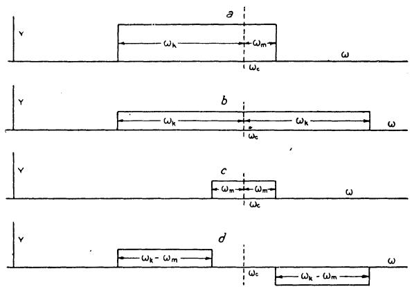

FIG. 7—GRAPHICAL ANALYSIS OF A TRANSMISSION CHARACTERISTIC

The sum of the transfer admittances shown at  $b$ ,  $c$ , and  $d$  equals the transfer admittance shown at  $a$ . The components,  $b$ ,  $c$ , and  $d$ , are chosen so as to possess symmetry about the carrier frequency

shown in the remainder of Fig. 7. It will be observed that if the three admittances,  $(b, c, \text{and } d)$ , are added together the result is the admittance shown at  $a$ . In accordance with the principle set forth above we conclude, therefore, that the received wave, in the case of the admittance shown at  $a$ , is equal to the sum of the received waves deduced from the other three admittances.

Considering first the admittance shown at  $b$ , we have here complete symmetry with respect to the carrier frequency; and it follows from the discussion of the symmetrical carrier case that the received wave is of the same frequency and phase as the carrier frequency and is modulated by a low frequency wave, which is identical with that obtained in d-c. telegraphy when a transfer admittance extending from 0 to  $\omega_{k}$  is employed. It is assumed, for simplicity, that the wave used originally to modulate the carrier wave contains no components of as high frequency as the carrier frequency. The discussion of the admittance, shown at  $c$ , is identical with that of  $b$ . Comparing these two components, it is concluded that they are in phase relative to each other, and that the component due to  $b$  builds up more rapidly than that due to  $c$ . It is obvious that the time it takes the result, due to these two components, to reach a steady state is determined by the slower of the two. We can conclude, tentatively, that, when the carrier frequency is located near one end of the band, it is the frequency range from the carrier frequency to the nearer edge of the transmitted band which determines the rate of building up.

The admittance shown at  $d$  is also symmetrical about

the carrier frequency, but it has a different type of symmetry. To contrast the effect of this kind of symmetry with that of the symmetry previously discussed, let us assume that the carrier wave is represented by  $\cos \omega_{c}t$ , and that the modulating wave is represented by  $A_{n}$  cos npt. The modulated wave is then  $A_{n}$  cos npt cos  $\omega_{c}t$ . This can be divided in the usual way into two components located symmetrically with respect to the carrier frequency. The two components are

$(A_{n} / 2)\cos (\omega_{c} - np)t$  and  $(A_{n} / 2)\cos (\omega_{c} + np)t.$  (1) It is obvious that, in the case shown at  $b$  , these components are transmitted without any relative change and thus combine to form the original modulated wave without any modification other than a possible multiplication by a constant. In the case of the admittance shown at  $d$  , however, there is a relative change in these components. If one of them is left unchanged, the other is multiplied by  $-1$  and the two components become

$(A_{n} / 2)\cos (\omega_{c} - np)t$  and  $-(A_{n} / 2)\cos (\omega_{c} + np)t.$  (2) The resultant wave is  $A_{n}\sin npt\sin \omega_{c}t.$  The important change produced by admittances, of the type shown in  $d,$  is that the carrier frequency has suffered a phase shift of 90 deg. An incidental change is that the modulating frequency, which represents the signal, has also suffered a change of 90 deg. This reasoning can be carried through for all the components making up the modulating wave, as long as their

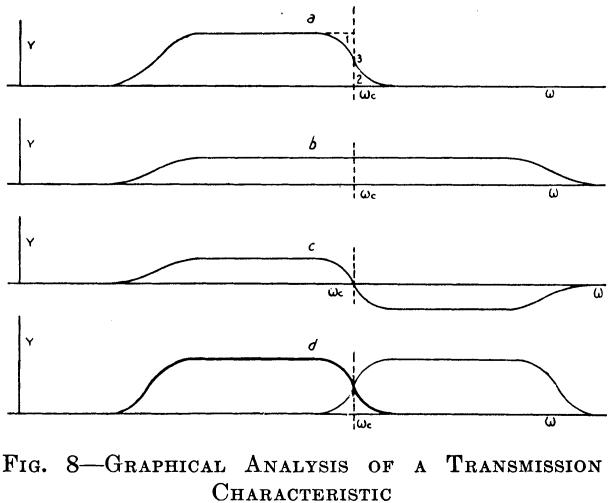

The sum of the symmetrical transfer admittances shown at  $b$  and  $c$  equals that shown at  $a$ . The heavy line in  $d$  is identical with the curve in  $a$ ; the thin curve is the mirror image of the heavy one. The curve shown at  $b$  equals one-half the sum, and that shown at  $c$  equals one-half the difference of the two curves shown at  $d$

frequency is less than the carrier frequency. It follows that the zeros of the total wave, due to the admittance shown at  $d$ , are displaced one-quarter period of the carrier wave with respect to the zeros of the corresponding waves obtained with  $b$  and  $c$ .

It will be obvious that if the components due to  $c$  and  $d$  could be eliminated, the resultant wave would be

determined by the separation between the carrier frequency and the far edge of the band transmitted. The wave, due to admittance shown at  $d$ , can be eliminated in the reception of the wave by the method discussed under "Phase Discrimination." The wave, due to  $c$ , is not disposed of so easily. It might be thought that by moving the carrier frequency nearer to the edge of the band the admittance shown at  $c$  could be made to extend over a very narrow frequency range, and thus be made negligible. It should be noted, however, that the steady state value of the received wave is the same, regardless of the width of the band, and that as long as any portion of  $c$  remains there will always be a slow, interfering wave. The only satisfactory answer is to locate the carrier frequency exactly on the edge of the band, so that there is no separation, however small, between the edge and the carrier frequency. This peculiar condition is due to the fact that we have assumed a transfer admittance, having an abrupt cut-off.

In the practical case the cut-off is gradual, not abrupt. The transfer admittance shown at  $a$ , (Fig. 8), represents a transfer admittance (real) which is suitable for single-sideband transmission. It can be separated into two parts as shown, respectively, at  $b$  and  $c$ :  $c$  possesses the kind of symmetry which leads to a phase-quadrature component; and  $b$  possesses the kind of symmetry which is desirable.

Strictly speaking, it is somewhat inaccurate to apply the term "single sideband transmission" to the case shown in Fig. 8, or, in fact, to any case where portions of both sidebands are transmitted. Since it would seem to be out of the question to transmit a single sideband, in a strict sense, in the case of telegraph waves, there should be no objection to this designation.

The results obtained in connection with Fig. 8 may be described in slightly different terms. Referring to  $a$ , the dotted line may be said to represent the ideal of single-sideband transmission. The numeral 1 marks the area which is removed from the ideal by the gradual cut-off of the admittance curve. The removal of this area results in an impairment of the wave due to the principal sideband. The area indicated by the numeral 2 represents the vestigial sideband, and results in an impairment. The result obtained, briefly stated is: If areas 1 and 2 are equal, in the sense that when either is rotated through point 3 it can be made to coincide with the other, the impairment due to a missing portion of the principal sideband is exactly compensated for by the wave due to the vestigial sideband.

The discussion above has been limited to the special case of real admittances. In what follows this restriction will be eliminated and general complex admittances will be considered. These do not lend themselves so readily to graphical representation, and for that reason the treatment will be made algebraical instead. There is, however, a close parallelism between the analysis below and that given in Fig. 8, and it is thought that reference to the figure will be useful.

Let the transfer admittance of the given system be denoted by  $Y(\omega - \omega_c)$ . Consider the admittance represented by  $Y(\omega_c - \omega)$ . These two characteristics are the mirror images of each other with respect to the carrier frequency. They are illustrated at  $d$ , in Fig. 8. Next let  $Y(\omega - \omega_c)$  be resolved into two components after the manner discussed above

$$
\boldsymbol {Y} (\omega - \omega_ {c}) = \boldsymbol {Y} _ {1} (\omega - \omega_ {c}) + \boldsymbol {Y} _ {2} (\omega - \omega_ {c}) \tag {3}
$$

where

$$
Y _ {1} (\omega - \omega_ {c}) = \frac {1}{2} \left[ Y (\omega - \omega_ {c}) + Y (\omega_ {c} - \omega) \right] \tag {4}
$$

and

$$
Y _ {2} (\omega - \omega_ {c}) = \frac {1}{2} \left[ Y (\omega - \omega_ {c}) - Y (\omega_ {c} - \omega) \right] \tag {5}
$$

These two components correspond to the graphical resolution shown at  $b$  and  $c$ ,  $Y_{1}$  being symmetrical about the carrier frequency both as to magnitude and sign and  $Y_{2}$  being symmetrical with respect to magnitude but reversed with respect to sign.

Let  $\cos npt$  be a component of an impressed wave, and let it modulate the carrier wave  $\cos \omega_ct$ . The resulting wave is

cos npt cos  $\omega_{c}t$

$$
= \frac {1}{2} \cos (\omega_ {c} - n p) t + \frac {1}{2} \cos . (\omega_ {c} + n p) t \tag {6}
$$

Consider first the wave resulting from impressing the first of these (the lower sideband) on the admittance  $Y_{1}(\omega - \omega_{c})$ . Let this admittance be represented by  $g_{1}(\omega - \omega_{c}) + i b_{1}(\omega - \omega_{c})$ , the quantities  $g_{1}$  and  $b_{1}$  being real. Impressing the wave  $\frac{1}{2}\cos (\omega_{c} - np) t$  on  $g_{1}$  the resulting wave is

$$
\frac {1}{2} g _ {1} (\omega - \omega_ {c}) \cos (\omega_ {c} - n p) t
$$

$$
\text {o r} \quad \frac {1}{2} g _ {1} (n p) \cos \left(\omega_ {c} - n p\right) t \tag {7}
$$

Similarly,  $i$ $b_{1}$  gives rise to the received wave

$$
- \frac {1}{2} b _ {1} (n p) \sin \left(\omega_ {c} - n p\right) t \tag {8}
$$

Carrying out similar operations for the upper sideband, and remembering the symmetry of  $Y_{1}$ , the total wave transmitted by  $Y_{1}$  is

$$
\frac {1}{2} g _ {1} (n p) [ \cos (\omega_ {c} - n p) t + \cos (\omega_ {c} + n p) t ]
$$

$$
- \frac {1}{2} b _ {1} (n p) [ \sin (\omega_ {c} - n p) t + \sin (\omega_ {c} + n p) t ] \tag {9}
$$

which may also be written

$$
g _ {1} (n p) \cos n p t \cos \omega_ {c} t - b _ {1} (n p) \cos n p t \sin \omega_ {c} t \tag {10}
$$

In a similar manner the wave received through  $Y_{2}(\omega - \omega_{c})$  is

$-g_{2}(np)\sin npt\sin \omega_{c}t - b_{2}(np)\sin npt\cos \omega_{c}t$  (11) Now if the wave is demodulated at the receiving end, by multiplying it by the factor 2 cos  $(\omega_c t - \phi)$ , and if high frequencies are neglected, we have for the received wave after demodulation

$g_{1}(np)$  cos  $\phi$  cos  $npt - b_{1}(np)$  sin  $\phi$  cos  $npt$

$$
- g _ {2} (n p) \sin \phi \sin n p t - b _ {2} (n p) \cos \phi \sin n p t \tag {12}
$$

It now follows that the three operations, of modulation, passage through the filter, and demodulation supplemented by the suppression of high frequencies, are equivalent to the passage through a filter having the characteristic

$$
Y _ {0} (n p) = g _ {0} (n p) + i b _ {0} (n p) \tag {13}
$$

where  $g_0(np) = g_1(np)\cos \phi -b_1(np)\sin \phi$  (14)

$$
b _ {0} (n p) = g _ {2} (n p) \sin \phi + b _ {2} (n p) \cos \phi \tag {15}
$$

This formula then permits the direct computation of the received wave. It will be noted that  $\phi$  may be given an arbitrary value. As a simplifying assumption, we may make  $\phi$  equal to the phase shift of the carrier frequency,  $i.e.$

$$
\tan \phi = - \frac {b _ {1} (0)}{g _ {1} (0)} \tag {16}
$$

# Appendix VI

Analysis for Generalized Wave Form. Let it be required to find the sinusoidal components of a periodic telegraph wave whose signal elements have the value:

$$
I _ {h} = a _ {h} f (t - (h - 1 / 2) T / N) \tag {1}
$$

where  $a_{h}$  is the magnitude factor and

$$
f (t - (h - 1 / 2) T / N)
$$

is an arbitrary function of time, and may overlap both antecedent and subsequent time units. The origin of  $t$  is taken at the beginning of the wave.

The total current, at the time  $t$ , is:

$$
I (t) = \sum_ {h = 1} ^ {N} I _ {h} = \sum_ {h = 1} ^ {N} a _ {h} f (t - (h - 1 / 2) T / N \tag {2}
$$

provided the period  $T$  is of greater duration than the wave form.

Let  $I(t)$  be represented as a Fourier series; then, by a method similar to that followed in Appendix I

$$
A _ {n} = \frac {2}{T} \int_ {0} ^ {T} \sum_ {h = 1} ^ {N} a _ {h} f (t - (h - 1 / 2) T / N) \cos n p t d t. \tag {3}
$$

Changing the origin of  $t$  to the center of the signal element, to which each term in the summation refers, i.e., putting

$$
t = (h - 1 / 2) T / N + t ^ {\prime}
$$

and dropping the prime, we have:

$$
\begin{array}{l} A _ {n} = \frac {2}{T} \sum_ {h = 1} ^ {\mathrm {N}} a _ {h} \int_ {- \mathrm {T} / 2} ^ {\mathrm {T} / 2} f (t) \cos \left(n p t \right. \\ + \frac {2 \pi n}{N} \left(h - \frac {1}{2}\right) d t \\ \end{array}
$$

$$
\begin{array}{l} = \frac {2}{T} \int_ {- T / 2} ^ {T / 2} f (t) \cos n p t d t \sum_ {h = 1} ^ {N} a _ {h} \cos \frac {2 \pi n}{N} \left(h - \frac {1}{2}\right) \\ - \frac {2}{T} \int_ {- T / 2} ^ {T / 2} f (t) \sin n p t d t \sum_ {h = 1} ^ {N} a _ {h} \sin \frac {2 \pi n}{N} \left(h - \frac {1}{2}\right) \\ \end{array}
$$

$$
= 4 s \left[ C _ {n} \int_ {- T / 2} ^ {T / 2} f (t) \cos n p t d t - S _ {n} \int_ {- T / 2} ^ {T / 2} f (t) \sin n p t d t \right]. \tag {4}
$$

In a similar manner it can be shown that:

$$
B _ {n} = 4 s \left[ C _ {n} \int_ {- T / 2} ^ {T / 2} f (t) \sin n p t d t + S _ {n} \int_ {- T / 2} ^ {T / 2} f (t) \cos n p t d t \right]. \tag {5}
$$

Multiplying equation (5) by  $i$ , and subtracting from (4):

$$
A _ {n} - i B _ {n} = F (\omega) \left(C _ {n} - i S _ {n}\right) \tag {6}
$$

Where

$$
F (\omega) = 4 s \int_ {- \infty} ^ {\infty} f (t) e ^ {- i n p} d t = 4 s \int_ {- \infty} ^ {+ \infty} f (t) e ^ {- i \omega t} d t. \tag {7}
$$

To solve the reverse problem of finding  $f(t)$  in terms of  $F(\omega)$ , put

$$
f (t - T / 2 N) = \frac {A _ {0}}{2} + \sum_ {n = 1} ^ {\infty} \left(A _ {n} \cos n p t + B _ {n} \sin n p t\right) \tag {8}
$$

which is the Fourier series representing a signal, consisting of a single dot, whose  $a_1 = 1$  and other values of  $a_h$  are equal to zero.

According to the definitions of  $A_{n}$  and  $B_{n}$  in Appendix I, it is permissible to arrange this expression as follows:

$$
f (t - T / 2 N) = \frac {1}{2} \sum_ {n = - \infty} ^ {\infty} \left(C _ {n} - i S _ {n}\right) F (\omega) e ^ {i n p t}. \tag {9}
$$

Substituting:

$$
C _ {n} = \frac {1}{N} \cos \frac {n \pi}{N} \tag {10}
$$

$$
S _ {n} = \frac {1}{N} \sin \frac {n \pi}{N} \tag {11}
$$

we get

$$
f (t - T / 2 N) = \frac {1}{2} \sum_ {n = - \infty} ^ {\infty} \frac {F (\omega)}{N} e ^ {i \left(n p t - \frac {n \pi}{N}\right)}. \tag {12}
$$

Putting  $t = T / 2N + t'$  and dropping the prime

$$
f (t) = \frac {1}{2} \sum_ {n = - \infty} ^ {\infty} \frac {F (\omega)}{N} e ^ {\prime n p t} \tag {13}
$$

As the period approaches infinity, the wave form approaches

$$
f (t) = \frac {1}{8 \pi s} \int_ {- \infty} ^ {\infty} F (\omega) e ^ {i \omega t} d \omega . \tag {14}
$$

Now, in order to observe the effect on the shape factor, let us consider a special wave form, for example, a wave obtained by curbing. For this type of signal the rectangular wave is cut short for a small portion of the time of the value  $x$  at the beginning and at the end of each time unit, so that

$$
f (t) = 1, \text {f o r} (- T / 2 N + x) <   t <   (T / 2 N - x)
$$

and

$$
f (t) = 0
$$

for

$$
- T / 2 N <   t <   (- T / 2 N + x)
$$

$$
\text {a n d} (T / 2 N - x) <   t <   T / 2 N.
$$

For this wave form, equation (7) reduces to

$$
\begin{array}{l} F (\omega) = 4 s \int_ {- T / 2 N + x} ^ {T / 2 N - x} [ \cos n p t - i \sin n p t ] d t \\ = \frac {2 \sin [ n \pi / N - 2 \pi n x / T ]}{n \pi / N}. \tag {15} \\ \end{array}
$$

Put  $x = T / 8N,$

which corresponds to a shortening of the time during which the battery is applied to the cable to  $\frac{3}{4}$  of the length of the total time unit, and apply ground during the remaining portion. For this case

$$
F (\omega) = \frac {8 s \sin (3 \omega / 1 6 s)}{\omega}. \tag {16}
$$

Comparing this shape factor with the corresponding one for the non-curbed wave, (given in Appendix I), equation (6), it is seen that the effect of curbing is to multiply the shape factor by  $\sin \frac{3\omega}{16s}\Bigg{/}\sin \frac{\omega}{4s}$ . A network having this characteristic in the transmitted range would be equivalent to the curbing.

# Appendix VII

Distortion Correction by Signal Shaping. The problem is: Given an arbitrary transfer admittance,  $i.e.$

one which is not ideal, how should the sent wave be shaped in order that the received wave may be non-distorting? It is proposed to derive the solution for the case, where the value of the received wave at the middle of the time unit is taken as criterion for distortionless transmission. There are many solutions to this problem, and we will restrict ourselves, at the outset, to a particular type of wave form for the signal elements of the sent wave; namely, the type wherein each signal element is made up of a series of rectangular steps, each of one time unit duration (Fig. 9). The problem, then, consists in finding the height of each step.

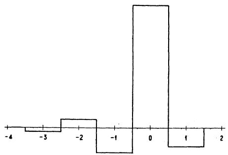

FIG 9—EXAMPLE OF SIGNAL SHAPING TO PRODUCE DISTORTIONLESS RECEIVED SIGNALS

By changing the point of view somewhat, it is possible to make use of some previously obtained results. Let us temporarily look on the unknown signal element, not as a signal element but as a signal made up of a succession of rectangular elements. The wave form of the unknown signal element is  $f_{s}(t)$ , and the magnitude factors of the individual rectangular elements are the unknown quantities  $b_{1}, b_{2}, \ldots, b_{N}$ . We have

$$
f _ {s} (t) = \frac {A _ {0}}{2} + \sum_ {n = 1} ^ {\infty} \left(A _ {n} \cos n p t + B _ {n} \sin n p t\right). \tag {1}
$$

The shape factor of the rectangular signal element is

$$
\frac {8 \sin \omega / 4 s}{\omega / s}
$$

and the discrimination factor obtained by looking at the sought signal element, as a signal, may be taken to be  $(C_n - iS_n)$ . The problem is now reduced to finding  $C_n$  and  $S_{n}$  for all values of  $n$  from 0 to  $N / 2$ , since with these values known the  $b$ 's are determined uniquely. Equation (1) may be arranged as follows:

$$
f _ {*} (t) = 4 \mathrm {s} \sum_ {n = - \infty} ^ {\infty} \left(C _ {n} - i S _ {n}\right) \frac {\sin \omega / 4 \mathrm {s}}{\omega} e ^ {i n p t} \tag {2}
$$

The transfer admittance of any network may be represented by  $Y(\omega)$ . In order to be more general, multiply  $Y(\omega)$  by  $e^{-i\omega\tau}$ ; where  $\tau$  is an arbitrary constant, and is of the nature of a constant delay. Let  $Y(-\omega) = \overline{Y}(\omega)$ , where the bar denotes the conjugate of  $Y(\omega)$ .

The wave received over a circuit having this transfer admittance is:

$$
f _ {r} (t) = 4 s \sum_ {n = - \infty} ^ {\infty} \left(C _ {n} - i S _ {n}\right) \frac {\sin \omega / 4 s}{\omega} Y (\omega) e ^ {- i \omega \tau} e ^ {i n p t}
$$

(3)

Let  $H(\omega) = \frac{\sin\omega / 4s}{\omega} Y(\omega)e^{-i\omega \tau}$  (4)

and rearrange terms

$$
f _ {r} (t) = 4 s \sum_ {n = - N / 2} ^ {(N / 2) - 1} \sum_ {q = - \infty} ^ {\infty} \left(C _ {q N + n} - i S _ {q N + n}\right) \times
$$

$$
H (4 \pi s [ q + n / N ]) e ^ {i (q N + n) p t} \tag {5}
$$

It may be deduced from equations (7) and (8) of Appendix I, that

$$
C _ {q \mathrm {N} + n} - i S _ {q \mathrm {N} + n} = (- 1) ^ {q} \left(C _ {n} - i S _ {n}\right) \tag {6}
$$

The receiving mechanism has been assumed to respond to the ordinate of the received wave at the middle of each time unit, (as representative of the signal for that unit), at which time

$$
p t = \frac {\pi}{N} (2 h - 1) \tag {7}
$$

where  $h$  has values 1, 2, 3, ...,  $N$  for successive time units. We note that

$$
e ^ {i (q N + n) p t} = e ^ {i (q N + n) (2 h - 1) \pi / N} = (- 1) ^ {q} e ^ {i 2 \pi n (h - 1 / 2) / N}. \tag {8}
$$

Substituting equations (6) and (8), in (5), gives:

$$
f _ {r} (t) = 4 s \sum_ {n = - N / 2} ^ {(N / 2) - 1} \left(C _ {n} - i S _ {n}\right) e _ {i} ^ {2 \pi n (h - 1 / 2) / N}
$$

$$
\sum_ {q = - \infty} ^ {\infty} H (4 \pi s [ q + n / N ]) \tag {9}
$$

at the middle of the time units.

If we put  $f_r(t) = 1$  for  $h = 1$ , and  $f_r(t) = 0$  for  $h = 2, 3$ , etc., then the received wave has the effect of a single dot standing by itself.

Our next step is to solve the  $N$  equations, such as (9), for the  $N$  unknown values of  $(C_n - iS_n)$ , in order that we may be able to use the results in computing the sent wave. In a manner similar to that in Appendix II, multiply each of the simultaneous equations by  $\cos \frac{2\pi k}{N} (h - 1/2)$ , and add all the equations:

$$
\cos \pi k / N = 2 s \sum_ {n = - N / 2} ^ {(N / 2) - 1} \left(C _ {n} - i S _ {n}\right) \times
$$

$$
\left(\frac {\cos (n + k) \pi \sin (n + k) \pi}{\sin (n + k) \pi / N} \right.
$$

$$
\begin{array}{l} + \frac {\cos (k - n) \pi \sin (k - n) \pi}{\sin (k - n) \pi / N} + \imath \frac {\sin^ {2} (n + k) \pi}{\sin (n + k) \pi / N} \\ \left. - i \frac {\sin^ {2} (k - n) \pi}{\sin (k - n) \pi / N}\right) \sum_ {q = - \infty} ^ {\infty} H (4 \pi s [ q + n / N ]) \tag {10} \\ \end{array}
$$

as  $k$  approaches any integral value,  $m$ , from  $-N/2$  to  $N/2$  inclusive, the numerators in the middle factor of each of the terms of the summation of equation (10) approach zero. Consequently, the factors are zero excepting one whose  $n = +m$  and one whose  $n = -m$ , wherein certain denominators also approach zero, with the result that equation (10) reduces to

$$
\begin{array}{l} \cos \pi m / N = 2 N s \left(C _ {m} - i S _ {m}\right) \sum_ {q = - \infty} ^ {\infty} H (4 \pi s [ q + n / N ]) \\ + 2 N s \left(C _ {- m} - i S _ {- m}\right) \sum_ {q = - \infty} ^ {\infty} H \left(4 \pi s [ q - n / N ]\right). \tag {11} \\ \end{array}
$$

When each of the  $N$  equations such as (9) is multiplied by  $\sin \frac{2\pi k}{N}\left(h - \frac{1}{2}\right)$ , a similar line of reasoning gives

$$
\begin{array}{l} \sin \pi m / N = i 2 N s \left(C _ {m} - i S _ {m}\right) \sum_ {q = - \infty} ^ {\infty} H (4 \pi s [ q + n / N ]) \\ - i 2 N s \left(C _ {- m} - i S _ {- m}\right) \sum_ {q = - \infty} ^ {\infty} H (4 \pi s [ q - n / N ]) \tag {12} \\ \end{array}
$$

Multiplying (12) by  $i$ , subtracting from (11), and putting  $m = n$  gives

$\cos \pi n / N - i\sin \pi n / N$

$$
= 4 N s \left(C _ {n} - i S _ {n}\right) \sum_ {q = - \infty} ^ {\infty} H \left(4 \pi s [ q + n / N ]\right) \tag {13}
$$

$$
\begin{array}{l} \therefore C _ {n} - i S _ {n} = \frac {e ^ {- i n \pi / N}}{} \tag {14} \\ 4 N s \sum_ {q = - \infty} ^ {\infty} H (4 \pi s [ q + n / N ]) \\ \end{array}
$$

At the sending end, the height of the  $h$ th step, for any convenient value of  $t$  during that time interval, is given by formula (2). Where the steps are rectangular, it is more convenient to use the formula

$$
b _ {h} = C _ {0} + \text {r e a l p a r t o f} 2 \sum_ {n - 1} ^ {\mathrm {N} 2 - 1} \left(C _ {n} - i S _ {n}\right) e ^ {i \frac {2 \pi n}{\mathrm {N}} (h - 1 / 2)}
$$

$$
+ S _ {\mathrm {N} / 2} \sin \pi (h - 1 / 2). \tag {15}
$$

Substituting from (14) and (4):

$$
\begin{array}{l} b _ {h} = \frac {1}{N} \left(\frac {1}{Y (0)} + \text {r e a l p a r t o f} \right. \\ \left[ 2 \sum_ {n = 1} ^ {N / 2 - 1} \frac {e ^ {i \frac {2 \pi n}{N} (h - 1 + 2 s \tau)}}{\sin \frac {\pi n}{N} \sum_ {q = - \infty} ^ {+ \infty} \frac {Y \left(4 \pi s [ q + n / N ]\right)}{\pi [ q + n / N ]}} e ^ {- i (4 s \tau + 1) q \pi} \right. \\ \left. + \frac {e ^ {i \pi (h - 1 + 2 s \tau)}}{\sum_ {q = - \infty} ^ {+ \infty} \frac {Y (4 \pi s [ q + 1 / 2 ])}{4 \pi s [ q + 1 / 2 ]} e ^ {- i (4 s \tau + 1) q \pi}} \right] \tag {16} \\ \end{array}
$$

In using formula (16) for computing  $b_h$ , it will be understood that  $Y$  and  $s$  are the given quantities of the problem. The quantities  $N$  and  $\tau$  which occur in addition to  $Y$  and  $s$  require comment. In the first place,  $\tau$  is an arbitrary quantity and may be given, for instance, the value zero. By giving it, in succession, all the values between zero and  $1/2s$  an infinite number of distinct solutions are obtained. The solution which is preferable, from a practical standpoint, may be selected after computations are completed for a number of values of  $\tau$ . As for  $N$ , it should be chosen large in proportion to the precision required. It should be an even number, and preferably not less than twice the number of steps to be used.

The sum which occurs in the denominator is an infinite series, but it converges rapidly and in most practical cases it should be sufficient to use three or four terms. The function  $Y$  occurs with negative arguments in this expression. This does not imply negative frequencies but is merely to be taken as a convenient notation. The expression  $Y(-\omega)$  is merely to be interpreted as the conjugate of  $Y(\omega)$  where  $\omega$  is positive.

# Appendix VIII

It is required to compute the mean power of a wave characterized by the shape factor,

$$
F (\omega) = 2, \text {f o r} 0 <   \omega <   2 \pi s,
$$

$$
F (\omega) = \sqrt {2}, \text {f o r} \omega = 2 \pi s,
$$

$$
F (\omega) = 0, \text {f o r} \omega > 2 \pi s.
$$

Such a wave is

$$
A _ {0} / 2 + \sum_ {n = 1} ^ {N / 2} \left(A _ {n} \cos n p t + B _ {n} \sin n p t\right). \tag {1}
$$

It will be sufficient to add the squares of the sinusoidal amplitudes divided by 2, to the square of the d-c. component. This gives for the mean power

$$
A ^ {2} _ {0} / 4 + \left(\sum_ {n = 1} ^ {\mathrm {N} / 2 - 1} \left(A ^ {2} _ {n} + B ^ {2} _ {n}\right) / 2\right) + \frac {B _ {\mathrm {N} / 2} {} ^ {2}}{2}. \tag {2}
$$

Since

$$
A _ {n} = 2 C _ {n}, \quad \text {f o r} n <   N / 2,
$$

$$
B _ {n} = 2 S _ {n}, \quad \text {f o r} n <   N / 2,
$$

$$
B _ {\mathrm {N} / 2} = \sqrt {2} S _ {\mathrm {N} / 2},
$$

the power is:

$$
C ^ {2} _ {0} + 2 \sum_ {n = 1} ^ {(N / 2) - 1} \left(C ^ {2} _ {n} + S ^ {2} _ {n}\right) + S ^ {2} _ {N / 2}. \tag {3}
$$

Now

$$
\begin{array}{l} C _ {n} ^ {2} = \frac {1}{N ^ {2}} \sum_ {h = 1} ^ {N} \sum_ {q = 1} ^ {N} a _ {h} a _ {q} \cos \frac {2 \pi n}{N} \times \\ (h - 1 / 2) \cos \frac {2 \pi n}{N} (q - 1 / 2), \tag {4} \\ \end{array}
$$

$$
S _ {n} ^ {2} = \frac {1}{N ^ {2}} \sum_ {h = 1} ^ {N} \sum_ {q = 1} ^ {N} a _ {h} a _ {q} \sin \frac {2 \pi n}{N}
$$

$$
(h - 1 / 2) \sin \frac {2 \pi n}{N} (q - 1 / 2). \tag {5}
$$

Adding

$$
C _ {n} ^ {2} + S _ {n} ^ {2} = \frac {1}{N ^ {2}} \sum_ {h = 1} ^ {N} \sum_ {q = 1} ^ {N} a _ {h} a _ {q} \cos \frac {2 \pi n}{N} (h - q). \tag {6}
$$

Substituting equation (6) in (3) and remembering that  $C_{\mathrm{N} / 2}$  and  $S_0$  are identically equal to zero, the total power becomes:

$$
\begin{array}{l} \frac {1}{N ^ {2}} \sum_ {h = 1} ^ {N} \sum_ {q = 1} ^ {N} a _ {h} a _ {q} \left(1 + 2 \sum_ {n = 1} ^ {(N / 2) - 1} \cos \frac {2 \pi n}{N} (h - q) \right. \\ \left. + \cos \pi (h - q)\right) \\ \end{array}
$$

$$
\begin{array}{l} = \frac {1}{N ^ {2}} \sum_ {h = 1} ^ {N} \sum_ {q = 1} ^ {N} a _ {h} a _ {q} \left[ \sum_ {n = 0} ^ {(N / 2) - 1} \cos \frac {2 \pi n}{N} (h - a) \right. \\ \left. + \sum_ {n = 1} ^ {N / 2} \cos \frac {2 \pi n}{N} (h - q) \right] \\ \end{array}
$$

$$
= \frac {1}{N ^ {2}} \sum_ {h = 1} ^ {N} \sum_ {q = 1} ^ {N} a _ {h} a _ {q} \left(\frac {\cos \frac {\pi}{N} (h - q) \sin \pi (h - q)}{\sin \pi (h - q) / N}\right). \tag {7}
$$

The expression in parenthesis is equal to zero unless  $h = q$ , in which case it equals  $N$ . Hence the power is:

$$
\frac {1}{N} \sum_ {h = 1} ^ {N} a _ {n} ^ {2}. \tag {8}
$$

# Appendix IX

The Fourier Integral. Up to the present the Fourier series theorem has been used in the analysis to the exclusion of the Fourier integral theorem which is closely related to it, and it seems desirable to give a brief discussion of the Fourier integral at this point. In order to keep the discussion brief it will be necessary to make it sketchy and incomplete in respect to details. The complex notation will be used because of its compactness.

The Fourier integral theorem states that

$$
f (t) = \frac {1}{\pi} \int_ {0} ^ {\infty} d u \int_ {- \infty} ^ {+ \infty} f (\lambda) \cos u (t - \lambda) d \lambda , \tag {1}
$$

regardless of the form of the function  $f(t)$ , provided it meets certain requirements. The requirement which is of importance in telegraph theory is that

$$
\int_ {- \infty} ^ {+ \infty} | f (t) | d t = \text {a f i n i t e n u m b e r}. \tag {2}
$$

The quantity  $u$  is so far a mathematical quantity which serves only as a variable under the integral sign, in the same sense that  $\lambda$  does. In studying the integrand it will be assumed that  $u$  is identical with the quantity  $\omega$  which occurs in expressions for impedances and admittances. With this assumption the theorem expressed by equation (1) can be written, in complex notation:

$$
I (t) = \frac {1}{2} \int_ {- \infty} ^ {+ \infty} J (\omega) e ^ {i \omega t} d \omega , \tag {3}
$$

$$
J (\omega) = \frac {1}{\pi} \int_ {- \infty} ^ {+ \infty} I (t) e ^ {- i \omega t} d t. \tag {4}
$$

$I(t)$  expresses the wave as a function of time and  $J(\omega)$  expresses it as a spectrum or a function of frequency.

For comparison we will now write down the Fourier series theorem in an analogous form:

$$
I (t) = \frac {1}{2} \sum_ {- \infty} ^ {+ \infty} K (\omega) e ^ {i \omega t} \Delta \omega , \tag {5}
$$

$$
K (\omega) = \frac {1}{\pi} \int_ {- \pi / \Delta \omega} ^ {+ \pi / \Delta \omega} I (t) e ^ {- i \omega t} d t. \tag {6}
$$

where  $\omega$  takes the values  $0, \pm \Delta \omega, \pm 2\Delta \omega$ , etc., and  $\Delta \omega$  is  $2\pi$  times the reciprocal of the fundamental period of the series. It will be apparent that there is a close, formal similarity between equations (3) and (4) on the one hand, and equations (5) and (6) on the other.

Now let the wave  $I(t)$  represent an arbitrary telegraph signal made up of  $N$  signal elements. Formulas (4) and (6) give alternative ways for expressing the wave spectrally. The latter represents the wave as a series of discrete frequency components; the former represents it as a continuous spectrum. Both representations are exact when properly interpreted, although they differ in form; for when substituted in formulas (5) and (3) respectively they yield the original wave precisely. Both representations are limited to a finite number of signal elements,—the series because its period must be finite, and the integral because of equation (2).

While these analyses are true for any succession of  $N$  signal elements which may be selected, their utility depends upon severe restrictions on the signal elements which precede and follow the signal under analysis. To be of value in circuit theory the series demands that the succeeding and preceding elements consist of an indefinitely great number of repetitions of the signal under analysis. Similarly, the integral depends for its utility on the assumption that it is followed and succeeded by infinite sequences of elements having the magnitude zero. These restrictions are normally not serious because there is no limitation on  $N$  other than that it should be finite. In addition to being equally exact, the two methods then appear to be substantially equally general (or restricted) in respect to the complexity of telegraph signals which they are capable of representing.

As might be surmised, most of the results obtained in the paper follow from either method of treatment. First, if the d-c. wave is analyzed by the integral method it will be found that  $J(\omega)$  separates into two factors, a discrimination factor and a shape factor. The discrimination factor has the property of falling into equivalent bands, each of width equal to the speed of signaling. From this it is concluded that the necessary frequency range does not exceed the speed of signaling. The various ideal form factors corresponding to various criteria follow with somewhat greater difficulty. Whereas the series treatment led to a system of linear algebraic solutions, the integral treatment leads to a system of integral equations.

The only outstanding difficulty with the integral analysis appears in connection with establishing the fact that the minimum frequency band equals the speed of signaling. In other words, while it is easy to show that the information contained in one frequency band

of width  $(s)$  is sufficient for the transmission of intelligence, it is difficult to show that it is also necessary. On the series analysis as used in the paper, this result followed very easily from the well-known principle that the number of unknowns which can be found does not exceed the number of given equations. When the frequency components are not discrete but form a continuous spectrum no such simple argument appears to be available. A somewhat full discussion will be given.

On considering the matter it is apparent that the difficulty arises from the lack of a precise formulation of what is meant by transmitting intelligence. No formal criterion was necessary in the case of the Fourier series treatment, but it will be necessary to formulate one to make satisfactory progress with the integral treatment. Stated in general terms the requirement of the received wave is that it should be possible to make measurements on it extending over a finite interval, and from these measurements (together with the known properties of the admittance) to determine the sent wave. More specifically, it should be possible to express the magnitude factors of the sent wave as a linear sum (or integral) of the measured values of the received wave. If the sent and received waves are expressed as functions of  $\omega$ , and the computations modified accordingly, it is obvious that the operations can be carried out on the sent wave in which case the received wave will be non-distorting. We may then lay down as a criterion for a telegraph system's ability to transmit intelligence, that it should be possible to shape the sent signals so as to make the received wave non-distorting. In the remainder of the appendix this criterion will be used. It will be apparent that the introduction of this criterion constitutes, in a sense, a fresh start.

Taking for the criterion of a non-distorting wave that it should have correct magnitude at the central point of the time unit, and limiting the discussion to the case where the frequency is limited to the range  $0 - s$ , the shape factor of the received wave is uniquely determined and is 2 throughout that range. The shape factor of the transmitted wave is  $2 / Y$  and the wave form at the sending end is

$$
f _ {s} (t) = \int_ {- 2 \pi s} ^ {+ 2 \pi s} \frac {2 e ^ {i \omega t} d \omega}{Y (\omega)}. \tag {7}
$$

If  $1 / Y$  is finite throughout this range, this integral has a definite value. If  $Y$  has a simple zero at  $\omega = \omega_{a}$  the integral may be written

$$
f _ {s} (t) = e ^ {i \omega a t} \int_ {- 2 \pi s} ^ {+ 2 \pi s} \frac {2 e ^ {i (\omega - \omega a) t} d \omega}{Y (\omega)}. \tag {8}
$$

The first derivative with respect to  $t$  of the definite integral may now be evaluated. The derivative is determinate and by integrating it with respect to  $t$  a suitable value for  $f(t)$  may be obtained.

If  $Y$  has a finite number of simple zeros, the function  $1 / Y$  may be broken up into a number of terms each of which has not more than one simple zero; and the individual terms can be treated as above.

When the function  $Y$  has double zeros, or zeros of any finite order of multiplicity, suitable values of the function  $f(t)$  can be found by an extension of the same method.

The significant results for a simple case will now be stated. Suppose that the transfer admittance has a simple zero at the origin (as in telegraphing through a transformer); the sent wave, which gives a distortionless received wave, does not approach zero as  $t$  approaches  $+\infty$  but approaches a constant  $a$ . If the zero at the origin is double (telegraphing through a high-pass filter, made up of one series condenser and one shunted coil) the sent wave should approach the value  $bt$  as  $t$  approaches  $\infty$ . For a triple zero the corresponding asymptotic value is of the form  $c t^2$ , etc. It is obvious that as the multiplicity of the zero increases the function representing the sent wave rapidly becomes more and more unmanageable. Now, if  $Y$  becomes zero throughout a finite interval at the origin, we may think of it as having a zero of an infinite order of multiplicity. It is to be expected then that there should be no finite function capable of satisfying the requirements.