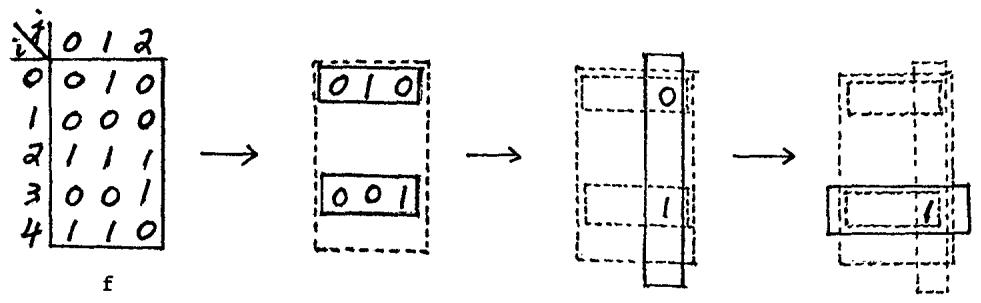
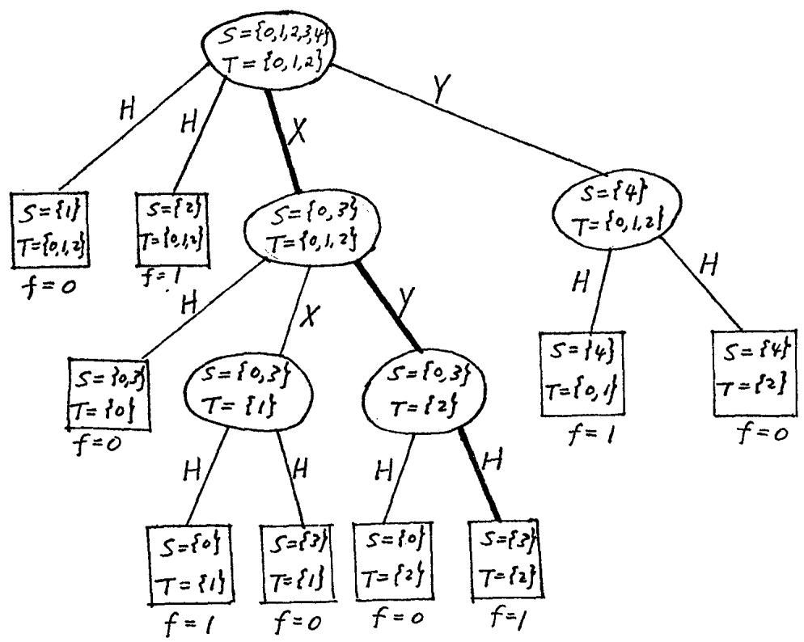
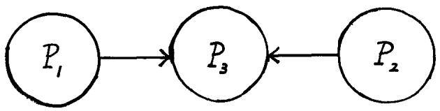

# 与分布式计算相关的一些复杂度问题*

（初步报告）

**Andrew Chi-Chih Yao**

斯坦福大学与施乐帕克研究中心

帕洛阿尔托，加利福尼亚州

# 1. 引言

令  $M = {0,1,2,\ldots,m-1}$ ， $N = \{0,1,2,\ldots,n-1\}$，且 $f:M\times N\to \{0,1\}$ 为一个布尔值函数。我们将关注以下问题及其相关问题。设 $i\in M$ 和 $j\in N$ 是两个整数，分别只被两个人 $P_{1}$ 和 $P_{2}$ 所知。为了使 $P_{1}$ 和 $P_{2}$ 合作确定函数值 $f(i,j)$，他们根据某个算法交替地相互发送信息，每次发送一位。我们关注的是衡量计算 $f$ 所需信息交换的量度：即在任何算法中交换的最小比特数。例如，若 $f(i,j) = (i + j) \mod 2$，则从 $P_{1}$ 向 $P_{2}$ 发送1比特信息（告知 $i$ 是否为奇数）将使 $P_{2}$ 能够确定 $f(i,j)$，这显然是最优的。

上述问题是Abelson[1]关于分布式计算中信息传递模型的一个变体。在Abelson的模型中，需要计算一个“光滑”的实值函数 $f(x_{1}, x_{2}, \ldots, x_{s}; y_{1}, y_{2}, \ldots, y_{t})$，处理器 $P_{1}$ 知道 $x_{1}, x_{2}, \ldots, x_{s}$ 的值，而 $P_{2}$ 知道 $y_{1}, y_{2}, \ldots, y_{t}$ 的值。假设 $P_{1}$ 和 $P_{2}$ 可以相互发送光滑的函数值，Abelson给出了计算 $f$ 所需交换的此类值的最小数量的界。我们的模型对应于 $f$ 是布尔函数、$x$ 和 $y$ 是布尔变量（$m = 2^{s}, n = 2^{t}$）且交换的值为比特的情况。与Abelson模型的解析风格不同，本框架处理本质上具有组合性质的运算。

# 2. 确定性模型

考虑控制 $P_{1}$ 和 $P_{2}$ 之间交换的比特以决定 $f$ 值的确定性算法。初始时，值 $i$ 仅 $P_{1}$ 知道，$j$ 仅 $P_{2}$ 知道。计算按如下方式进行：$P_{1}$ 首先向 $P_{2}$ 发送 $a_{1} \in \{0,1\}$；看到 $a_{1}$ 后，$P_{2}$ 向 $P_{1}$ 发送 $b_{1}$；看到 $b_{1}$ 后，$P_{1}$ 向 $P_{2}$ 发送 $a_{2}$，依此类推。$a_{k}$（或 $b_{k}$）的选择可以依赖于迄今为止所有已通信的比特。精确地说，算法 $A$ 指定了布尔函数 $\{h_{k}(i; u_{1}, u_{2}, \ldots, u_{k-1}), l_{k}(j; v_{1}, v_{2}, \ldots, v_{k}) \mid k = 1, 2, \ldots\}$，且比特 $a_{k}, b_{k}$ 由 $a_{k} = h_{k}(i; b_{1}, b_{2}, \ldots, b_{k-1})$ 和 $b_{k} = l_{k}(j;a_{1},a_{2},\ldots ,a_{k})$ 确定。当 $P_{1}$ 或 $P_{2}$ 有足够的信息确定 $f(i,j)$ 时，计算结束，并向另一个处理器发送特殊符号“halt”。代价 $\alpha (A)$ 定义为对于任何 $i\in M,j\in N$ 所交换的最大比特数（0和1）。$f$ 的双向复杂度定义为
$$
C (f; 1 \leftrightarrow 2) = \min  \{\alpha (A) \mid A \text{ 计算 } f \}.
$$

为了研究量 $C$，我们首先开发一种更便捷的方式来审视计算。不难看出，任何如上所述的算法都可以用这种方式表示。我们用一个例子来说明。设 $f$ 为图1中定义的函数，计算 $f$ 的算法 $A$ 在图2中给出为决策树。

决策树中的每个内部节点最多有4个子节点（其中两个是叶子，两个是内部节点）。通往叶子的分支标记为 $H$（停止），通往内部节点的分支标记为 $X$ 或 $Y$。（我们使用 $X, Y$ 代替0, 1，以避免与函数值混淆。）移动由 $P_{1}$ 和 $P_{2}$ 交替进行，从根节点开始。因此，路径上的标签1, 3, 5,... 是 $P_{1}$ 发送的信号，而标签2, 4, 6,... 是 $P_{2}$ 发送的信号。叶子节点附加的比特给出所需的函数值 $f(i, j)$。现在我们来描述在内部节点选择分支的规则。

每个节点 $v$ 关联一个矩阵 $S(v) \times T(v) \subseteq M \times N$。在根节点 $r$，有 $S(r) \times T(r) = M \times N$。对于奇数层（根位于第1层）上的内部节点 $v$，其子节点为 $v_1, \ldots, v_l$（ $l \leq 4$ ），有 $T(v) = T(v_k)$ 对于 $1 \leq k \leq l$，且 $\{S(v_k) \mid 1 \leq k \leq l\}$ 构成 $S(v)$ 的一个不相交划分。在偶数层上，类似的条件成立，但 $S$ 和 $T$ 的角色互换。在 $P_1$ 从节点 $v$（位于奇数层）进行的移动中，它选择唯一的子节点 $v_k$，使得 $i \in S(v_k)$。对于 $P_2$ 也有类似的描述。节点 $v$ 是叶子节点当且仅当 $f$ 在块 $S(v) \times T(v)$ 上是常数。注意，$\alpha(A) = \text{height}(A) - 1$。

通过对 $mn$ 的值进行归纳，可以证明任何算法都可以用上述方式表示。我们现在来证明一些结果。

**定义**。设 $f$ 为定义在 $M \times N$ 上的布尔值函数。若 $f$ 在 $S \times T$ 上是常数，则我们称笛卡尔积 $S \times T$（其中 $S \subseteq M$， $T \subseteq N$）为一个**$f$-单色矩形**。$f$ 的一个 **$k$ 分解** 是一个族 $\mathcal{F} = \{S_1 \times T_1, S_2 \times T_2, \ldots, S_k \times T_k\}$。

图1 一个函数 $f$，以及下方算法在求 $f(3,2)$ 时所采取的连续步骤。

图2. 计算 $f$ 的算法。对于输入 $i = 3$， $j = 2$，交换的信号序列是 XYH。

图3 第4节中 $C_{\varepsilon}^{\prime}(f;1 + 3 + 2)$ 的图示。

它由 $\mathbf{k}$ 个不相交的 $f$-单色矩形组成，这些矩形划分了 $M \times N$。令 $d(f)$ 为存在 $f$ 的 **$\mathbf{k}$ 分解** 的最小 $k$。

**定理 1.**  $C(f;1\leftrightarrow 2)\geq \log_2 d(f) - 2$

**推论**。令 $\mathfrak{F}_n$ 为所有定义在 $N \times N$ 上的布尔值函数的集合。那么，以概率 $1 - O(2^{-n^2 / 2})$，一个随机函数 $f \in \mathfrak{F}_n$ 满足
$$
C (f; 1 \leftrightarrow 2) \geq \log_ {2} n - 4.
$$

**证明**。令 $A$ 为计算 $f$ 的最优算法，用前面描述的树形式表示。由于每个内部节点最多有两个叶子子节点，因此有
$$
\begin{array}{l} d (f) \leq \text {叶子节点数} \\ \leq 2 \times I (f), \tag {1} \\ \end{array}
$$
其中 $I(f)$ 是 $f$ 的内部节点数。由于内部节点形成一个高度为 $\alpha(A)$、分支数最多为2的树，我们有
$$
\frac {(I (f) + 1)}{2} \leq 2 ^ {\alpha (A)}. \tag {2}
$$
由(1)和(2)，我们得到
$$
2 ^ {\alpha (A)} \geq \frac {d (f)}{4}.
$$
这意味着
$$
C (f; 1 \leftrightarrow 2) \geq \log_ {2} d (f) - 2.
$$
这证明了定理1。

**推论的证明**。由于形式为 $S \times T$ 的集合（其中 $S \subseteq N$， $T \subseteq N$）（$S, T$ 可能为空）最多有 $2^{2n}$ 个，因此满足 $d(f) \leq k$ 的函数 $f \in \mathfrak{F}_n$ 的个数最多为 $2^{2kn}$。现在 $\mathfrak{F}_n$ 中有 $2^{n^2}$ 个不同的函数。因此，满足 $d(f) > n/4$（从而 $C(f; 1 \leftrightarrow 2) > \log_2 n - 4$）的函数 $f$ 所占比例至少为
$$
\left(2 ^ {n ^ {2}} - 2 ^ {2 n \cdot (n/4)}\right) / 2 ^ {n ^ {2}} = 1 - O \left(2 ^ {- n ^ {2} / 2}\right).
$$
这证明了推论。

由于 $C(f; 1 \leftrightarrow 2) \leq 2\lceil\log_2 n\rceil$（ $P_1$ 可以直接将 $i$ 的二进制表示发送给 $P_2$），对于大的 $n$，上述推论确定了几乎所有布尔值函数复杂度的两倍范围内。

下面我们给出一些具体的函数，由于定理1，其 $C(f; 1 \leftrightarrow 2)$ 是 $\log n$ 阶的（证明省略）。

**例1**. 相等判断函数：$f(i,j) = \delta_{ij}$，其中 $i,j \in \{0,1,\dots,n-1\}$。
**例2**. 互质判断函数：$f(i,j) = 1$ 当且仅当 $i$ 和 $j$ 互质，其中 $i,j \in \{0,1,\dots,n-1\}$。
**例3**. 序关系函数：$f(i, j) = 1$ 如果 $0 \leq i \leq j < n$。
**例4**. 集合交集函数：$f(i, j) = 1$ 当且仅当存在某个 $k$ 使得 $i$ 和 $j$ 的第 $k$ 位都是1，其中 $i, j \in \{0, 1, \ldots, n - 1\}$。

定理1给出的界作为 $\mathbf{k}$ 的函数有多好？以下定理指出，如果 $f$ 具有“平面”的 $d(f)$ 分解，则该界（最多差一个常数因子）是可以达到的。

**定义**。$f$ 的一个 **k 分解** $\mathfrak{F} = \{S_1 \times T_1, S_2 \times T_2, \ldots, S_k \times T_k\}$ 是**平面的**，如果每个 $S_i$（和 $T_i$）由连续的整数块组成。

**定理 2.** 如果 $f$ 具有一个平面的 $k$ 分解（$k \geq 1$），那么
$$
C (f; 1 \leftrightarrow 2) \leq \frac {2 \log_ {2} k}{\log_ {2} (4 / 3)} + 6.
$$

**证明**。容易看出 $C(f; 1 \leftrightarrow 2) \leq k$。因此，定理对于 $k \leq 4$ 成立。我们将通过对 $k$ 的归纳来证明，对于所有 $k \geq 5$，
$$
C (f; 1 \leftrightarrow 2) \leq \frac {2 \log_ {2} (k - 4)}{\log_ {2} (4 / 3)} + 6. \tag {3}
$$
这个不等式对于 $k = 5,6$ 显然成立。现在假设 $k \geq 7$。我们将证明，对于某些函数 $f_{1}$ 和 $f_{2}$，每个都具有一个平面的 $(\lfloor 3k / 4 \rfloor + 1)$ 分解，有
$$
C (f; 1 \leftrightarrow 2) \leq 2 + \max  \left\{C \left(f _ {a}; 1 \leftrightarrow 2\right) \mid a = 1, 2 \right\}. \tag {4}
$$
根据归纳假设，这将意味着
$$
\begin{array}{l} C (f; 1 \leftrightarrow 2) \leq 2 + \frac{2 (\log_ {2} ( \lfloor 3 k / 4 \rfloor + 1 - 4))}{\log_ {2} (4 / 3)} + 6 \\ \leq \frac{2 \left(\log_ {2} (k - 4)\right)}{\log_ {2} (4 / 3)} + 6, \\ \end{array}
$$
从而完成归纳。

剩下的是证明(4)；我们区分两种情况。

**情况 A.** 存在一个 $s \in M$，使得至少有 $h \geq \lceil k/2 \rceil$ 个不同的 $S_{i} \times T_{i}$ 满足 $i \in S_{i}$。不失一般性，我们可以假设它们是 $S_{1} \times T_{1}, S_{2} \times T_{2}, \ldots, S_{h} \times T_{h}$，并且 $T_{1}, T_{2}, \ldots, T_{h}$ 是覆盖集合 $N = \{0, 1, \ldots, n-1\}$ 的连续区间。令 $N_{1} = T_{1} \cup T_{2} \cup \cdots \cup T_{\lceil h/2 \rceil}$ 和 $N_{2} = N - N_{1}$。容易看出，每个 $M \times N_{i}$（ $a = 1, 2$ ）与集合 $S_{i} \times T_{i}$（ $j \in \{1, 2, \ldots, k\}$ ）的交集最多有 $k - \lfloor h/2 \rfloor \leq (3k/4) + 1$ 个。因此，每个 $f_{a}$（ $a = 1, 2$ ）（即 $f$ 在 $M \times N_{i}$ 上的限制）具有一个平面的 $(\lfloor 3k/4 \rfloor + 1)$ 分解。由于 $P_{2}$ 可以用1比特向 $P_{1}$ 通信变量 $j$（归 $P_{2}$ 所有）是否在 $N_{1}$ 或 $N_{2}$ 中，我们得到公式(4)。

**情况 B.** 假设情况A的条件不满足。令 $s \in M$ 为最小的 $s$，使得至少有 $k/4$ 个 $S_l \times T_l \subseteq M_1 \times N$，其中 $M_1 = \{0, 1, \ldots, s\}$。记 $M - M_1$ 为 $M_2$。由于每个 $S_l$ 是一个区间，任何与 $M_1 \times N$ 相交的 $S_l \times T_l$ 必须满足 $s \in S_l$ 或 $S_l \times T_l \subseteq (M_1 - \{s\}) \times N$。这意味着最多有 $\lceil k/2 \rceil + k/4 \leq 3k/4 + 1$ 个集合 $S_l \times T_l$ 可能与 $M_1 \times N$ 相交。因此，每个 $M_a \times N$ 最多与 $\lfloor 3k/4 \rfloor + 1$ 个集合 $S_l \times T_l$ 相交，因此每个 $f_a$（即 $f$ 在 $M_a \times N$ 上的限制）具有一个平面的 $(\lfloor 3k/4 \rfloor + 1)$ 分解。由于只需从 $P_1$ 向 $P_2$ 发送1比特就足以表达 $P_1$ 所拥有的变量 $i$ 是否在 $M_1$ 中，因此公式(4)成立。

这完成了定理2的证明。

对于一般的非平面分解，我们有下面的定理。

**定理 3.** 存在常数 $\lambda >0$，使得对于所有 $f$，
$$
C (f; 1 \leftrightarrow 2) \leq \lambda \sqrt {d (f) \log_ {2} d (f)}.
$$

**证明概要**。令 $k = d(f)$。我们将通过对 $k$ 的归纳来证明定理。对于每个 $s \in M$，令 $pat_s = \{l \mid s \in S_l\}$。要么存在一个 $s$ 使得 $|pat_s| \geq 2\sqrt{k / \log_2 k}$，要么总共的不同 $pat_s$ 不超过
$$
\left(\frac {k}{\lceil 2 \sqrt {k / \log_ {2} k} \rceil}\right) \leq e ^ {\lambda_ {1} \sqrt {k \log_ {2} k}}
$$
个，其中 $\lambda_1 > 0$ 是一个常数。在前一种情况下，通过类似于上一个定理中使用的论证，可以证明存在 $f_{\alpha} (a = 1,2)$，且 $d(f_{\alpha}) \leq k - \lfloor \sqrt{k / \log_2 k} \rfloor$，使得
$$
C (f; 1 \leftrightarrow 2) \leq 2 + \max  \left\{C \left(f _ {a}; 1 \leftrightarrow 2\right) \mid a = 1, 2 \right\}. \tag {5}
$$
在后一种情况下，从 $P_1$ 向 $P_2$ 发送 $O(\lambda_1 \sqrt{k \log_2 k})$ 比特将使 $P_2$ 能够立即决定 $f$ 的值。在任一情况下都可以进行归纳步骤。

我们证明了定理3。

# 3. 概率模型

算法设计最近一个有趣的创新是包含了随机移动并允许 $\epsilon$ 概率的错误（参见例如Rabin[2]）。如果每个处理器 $P_{i}$ 都有一个随机数生成器，他们能否用少得多的信息交换来确定 $f$ 的值？我们讨论两个模型。

# 3.1 单向概率通信

为了确定 $f(i, j)$，处理器 $P_{1}$ 随机地发送一个字符串给 $P_{2}$，基于此 $P_{2}$ 随机地决定 $f(i, j)$ 的值，错误概率 $\leq \epsilon$。定义复杂度有几种不同的方式。在最简单的情况下，假设所有传输的字符串长度相同。那么 $f$ 的**单向概率复杂度** $C_{\epsilon}^{\prime}(f; 1 \to 2)$ 定义为 $\lceil \log_2 k \rceil$，其中 $k$ 是满足以下不等式组在 $\vec{p}_i = (p_{i1}, p_{i2}, \dots, p_{ik}), 1 \leq i \leq m$ 和 $\vec{q}_j = (q_{j1}, q_{j2}, \dots, q_{jk}), 1 \leq j \leq n$ 中有解的最小整数。
$$
\left\{ \begin{array}{l l} \sum_{\ell} p_{i\ell} = 1 & \text {对于所有} i, \ell, \\ p_{i\ell} \geq 0; \quad 1 \geq q_{j\ell} \geq 0 & \text {对于所有} i, j, \ell , \\ \vec{p}_{i} \cdot \vec{q}_{j} \geq 1 - \epsilon & \text {如果} f(i, j) = 1, \\ \vec{p}_{i} \cdot \vec{q}_{j} < \epsilon & \text {如果} f(i, j) = 0. \end{array} \right. \tag {6}
$$

**注**。将 $(f(i, j))$ 视为一个0-1矩阵，并用 $nrow(f)$、$ncol(f)$ 分别表示 $f$ 的不同行数和列数。确定性情况的单向复杂度很容易看出是 $\lceil \log_2(nrow(f)) \rceil$。

第2节中定义的相等判断函数的复杂度在Rabin和Yao[3]中进行了研究，并显示为 $\log \log n$ 阶。以下结果确定了随机函数 $f$ 的 $C_{\epsilon}^{\prime}$。然而，确定特定函数的 $C_{\epsilon}^{\prime}$ 一般来说似乎非常困难。

**定理 4.** 令 $0 < \epsilon < 1/2$ 为任意固定数。用 $\mathfrak{F}_n$ 表示所有定义在 $N \times N$ 上的布尔值函数的集合。那么，以概率 $1 - O(2^{-n^2/2})$，一个随机函数 $f \in \mathfrak{F}_n$ 满足
$$
\left\lceil \log_ {2} n \right\rceil \geq C _ {\epsilon} ^ {\prime} (f; 1 \rightarrow 2) \geq \left\lceil \log_ {2} n \right\rceil - \log_ {2} \log_ {2} n - 2.
$$

**证明**。第一个不等式对所有 $f$ 显然成立，因此我们只需证明第二个不等式。

令 $\mathfrak{F}_{n,k} \subseteq \mathfrak{F}_n$ 表示那些存在 k 分量向量 $\{\vec{p}_i, \vec{q}_j\}$ 满足(6)的函数 $f$ 的集合。对于每个 $f \in \mathfrak{F}_n$，我们选择一个解并定义一个 (2kn)-元组
$$
\gamma (f) = \left(\lceil 4 p _ {i \ell} k / (1 - 2 \epsilon) \rceil , \quad \lceil 4 q _ {j \ell} k / (1 - 2 \epsilon) \rceil \mid 1 \leq i \leq n, 1 \leq j \leq n, 1 \leq \ell \leq k\right)
$$
称 $\gamma (f)$ 为 $f$ 的**代表元**。显然，最多有
$$
(1 + \lceil 4 k / (1 - 2 \epsilon) \rceil) ^ {2 k n} = \exp (2 k n \ln k + O (1))
$$
个不同的代表元。

现在我们断言，$\mathfrak{F}_{n,k}$ 中任意两个不同的函数 $f$ 和 $f'$ 不可能有相同的代表元。否则，令 $\vec{p}_i, \vec{q}_j$ 和 $\vec{p}_i', \vec{q}_j'$ 分别与 $f$ 和 $f'$ 相关联。选择 $s, t$ 使得 $f(s, t) \neq f'(s, t)$。根据(6)，我们有
$$
\left| \vec{p} _ {s} \cdot \vec{q} _ {t} - \vec{p} _ {s} ^ {\prime} \cdot \vec{q} _ {t} ^ {\prime} \right| \geq 1 - 2 \epsilon . \tag {7}
$$
另一方面，由于 $f$ 和 $f'$ 有相同的代表元，我们有
$$
\begin{array}{l} \left| \vec{p} _ {s} \cdot \vec{q} _ {t} - \vec{p} _ {s} ^ {\prime} \cdot \vec{q} _ {t} ^ {\prime} \right| \leq \sum_{\ell} p _ {s \ell} \left| q _ {t \ell} - q _ {t \ell} ^ {\prime} \right| + q _ {t \ell} \left| p _ {s \ell} - p _ {s \ell} ^ {\prime} \right| \\ \begin{array}{l} \leq 2 k \cdot \frac {1 - 2 \epsilon}{4 k} \\ < 1 - 2 \epsilon , \end{array} \\ \end{array}
$$
这与(7)矛盾。这证明了该断言。

根据以上讨论，我们有
$$
\frac {| \mathfrak {F} _ {n , k} |}{| \mathfrak {F} _ {n} |} \leq \frac {\exp (2 k n \ln k + O (1))}{2 ^ {n ^ {2}}}.
$$
取 $k = n / (4\ln n)$。这导致 $C_{\epsilon}'(f;1\to 2)\leq \lceil \log_2 n\rceil -\log_2\ln n - 2$ 的概率最多为 $O(2^{-n^2 / 2})$。定理4随之得出。

# 3.2 双向概率通信

在第2节的基本双向模型中，也可以允许两个处理器都有随机移动。令 $\epsilon$（其中 $0 < \epsilon < 1/2$）为允许的错误概率。定义 $\alpha'(A)$ 为在算法 $A$ 下对于最坏输入所传输的比特的期望数，并令 $C_{\epsilon}'(f; 1 \leftrightarrow 2) = \inf \{\alpha'(A) \mid A \text{ 是一个错误概率最多为 } \epsilon \text{ 的算法}\}$。以下结果为随机算法的能力提供了一个限制。例如，这意味着相等判断函数的双向概率复杂度也是 $\log \log n$ 阶的。

**定理 5.** 令 $0 < \epsilon < 1/2$ 为固定值。则存在常数 $\lambda' > 0$，使得对于任何 $f$，
$$
C _ {\epsilon} ^ {\prime} (f; 1 \leftrightarrow 2) \geq \lambda^ {\prime} \left(\log_ {2} \log_ {2} (n r o w (f)) + \log_ {2} \log_ {2} (n c o l (f))\right).
$$

**证明**。由于其复杂性，我们在此省略证明。 $\blacksquare$

# 4. 结束语

在本文中，我们研究了当两个处理器合作计算布尔值函数时所需的信息交换。确定性单向模型在数学上是平凡的，已被完全理解。下面我们将评论我们对其他三个模型的理解并提出开放性问题。

**A. 确定性双向复杂度**。它相对较好地得到了理解。$\mathfrak{F}_n$ 中几乎所有函数的复杂度约为 $\log n$，并且对于许多常见函数，其复杂度在常数因子内确定。然而，一个基本问题仍未得到解答。令 $a_{k} = \max \{C(f;1\leftrightarrow 2)\mid d(f) = k\}$。已知 $c\log k\leq a_k\leq c'\sqrt{k\log k}$。$a_{k}$ 是什么？

**B. 概率单向复杂度**。这是未来研究中最有趣的主题。已知 $\mathfrak{F}_n$ 中几乎所有函数的复杂度约为 $\log n$，但还没有已知的特定函数具有此复杂度。我们推测序关系函数（第2节）的复杂度约为 $\log n$。

**C. 概率双向复杂度**。尽管有较为困难的下界结果（定理5），但对它的理解仍很不足。我们甚至不知道 $\mathfrak{F}_n$ 中随机函数的复杂度。注意定理5意味着概率双向通信最多比确定性单向通信有对数级的改进。

**D. 超过两个处理器**。大多数结果可以以某种形式扩展到多于两个处理器之间的通信。我们提到一个值得特别关注的情况。假设三个处理器 $P_{1}, P_{2}, P_{3}$ 合作计算函数 $f(i, j)$，初始时 $P_{1}$ 知道 $i$，$P_{2}$ 知道 $j$。假设不是处理器 $P_{1}, P_{2}$ 相互通信，而是 $P_{1}, P_{2}$ 都有一个到处理器 $P_{3}$ 的单向概率通信信道（见图3），然后 $P_{3}$ 以小于 $\epsilon$ 的错误概率计算 $f(i, j)$ 的值。假设 $P_{3}$ 使用某个定义域 $M' \times N'$ 上的布尔值函数 $g$，并将 $f$ 计算为 $g(i', j')$，其中 $i'$ 和 $j'$ 分别是从 $P_{1}$ 和 $P_{2}$ 接收到的整数。那么复杂度 $C_{\epsilon}'(f; 1 \rightarrow 3 \leftarrow 2)$ 就是 $\log |M'| + \log |N'|$ 在所有可能的 $g, M', N'$ 选择上的最小值。看待这个问题的一个有趣替代方式是，将 $C_{\epsilon}'(f; 1 \rightarrow 3 \leftarrow 2)$ 视为当我们通过“概率哈希”计算 $f(i, j)$ 时所需的最小表格大小 $|M'| |N'|$ 的对数。例如，相等判断函数的复杂度是多少？

**E. NP完全性**。计算复杂度 $C(f; 1 \leftrightarrow 2)$ 是否是NP完全的？

# 参考文献

[1] H. Abelson, Lower Bounds on Information Transfer in Distributed Computations, Proc. IEEE 19-th Annual Symp. on Foundations of Computer Science, Ann Arbor, 1978, pp. 151-158.

[2] M. O. Rabin, Probabilistic Algorithms, in Algorithms and Complexity: Recent Results and New Directions, edited by J. F. Traub, Academic Press, 1976, pp. 21-40.

[3] M. O. Rabin and A. C. Yao, in preparation.

---

## 专业术语中英对照表

| 英文术语                 | 中文翻译     |
| :----------------------- | :----------- |
| Distributive Computing   | 分布式计算   |
| Boolean-valued function  | 布尔值函数   |
| Deterministic algorithm  | 确定性算法   |
| Probabilistic algorithm  | 概率算法     |
| Communication complexity | 通信复杂度   |
| One-way communication    | 单向通信     |
| Two-way communication    | 双向通信     |
| Monochromatic rectangle  | 单色矩形     |
| k-decomposition          | k分解        |
| Planar decomposition     | 平面分解     |
| Error probability        | 错误概率     |
| Random number generator  | 随机数生成器 |
| Decision tree            | 决策树       |
| Root                     | 根节点       |
| Leaf                     | 叶子节点     |
| Internal node            | 内部节点     |
| Branching factor         | 分支因子     |
| Information exchange     | 信息交换     |
| Bit                      | 比特         |
| Complexity               | 复杂度       |
| Lower bound              | 下界         |
| Upper bound              | 上界         |
| Hashing                  | 哈希         |
| NP-completeness          | NP完全性     |