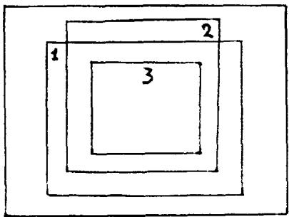

CRYPTOLOGY AND COMPLEXITY THEORIES

G. RUGGIU

# ABSTRACT

Complexity Theories have recently been proposed as a basis for evaluation of crypto machine performance. They are compared to Shannon's model. They shed a new highlight on randomness notion. But it is stressed that the statistical point of view remains the more secure.

# CRYPTOLOGY AND COMPLEXITY THEORIES

Complexity theories have recently been proposed as a basis for evaluation of the cryptographic system performance. We will present in this short survey, the different approaches used to connect these two notions.

The complexity theories are rather new and their motivation is the analysis of algorithm efficiency. Their main characteristic is that they are very general theories that deal with very general algorithms; their most concrete result give some information about asymptotical behaviour of algorithms.

The central problem of cryptography is the evaluation of security of secrecy system, that is to say how a system is immune against a cryptanalysis. When this cryptanalysis is possible such an evaluation must measure how much time and informations are required to get the solution.

# 1. The model of Shannon

The first mathematical treatment of this problem was achieved by Shannon1 in the forties. His theory allowed to formalize the problem properly. As a consequence he could give some guidelines for designing secrecy systems.

The Shannon approach is based on a probabilistic model, the core of the theory is the evaluation of the probabilities of clear-texts. There are two main parameters :

- the a priori probability of clear-texts: P(m)

- the conditional probability  $P(m / c)$  of the clear-text  $m$  when the cryptogram  $c$  is intercepted.

The main concept defined by Shannon is the "perfect secret": a crypto system is a perfect secret when  $\mathsf{P}(\mathfrak{m}) = \mathsf{P}(\mathfrak{m} / \mathfrak{c})$ ,  $\forall \mathfrak{m}, \mathfrak{c}$ . So the knowledge of a cryptogram gives no information about the clear-text: cryptanalysis of such system is impossible.

But perfect secrecy has limitations: it requires a number of keys as least as great as the number of clear messages. This means that the keys must be as long as the messages. So, it is obvious that these systems are impracticable except in particular situations because keys must be exchanged over a secure channel.

In practice, most systems have finite keys. How to characterize the security of these systems? Shannon showed that for these systems, there exists a minimum length of the messages, called "unicity distance", for which the cryptanalysis has a unique solution. This distance exists because of the redundancy of the language which the clear texts belong to.

In that case the solution can be found by trying all the different keys: the key which gives a likelihood clear-text is the good one. If the number of trials is too large, this exhaustive search must be considered as impossible: cryptanalyst is hoped not to have enough time to find the solution.

But how to be sure that all these trials are necessary? The complexity theory of algorithms is an attempt to answer this question.

# 2. The complexity of algorithms

This theory tries to give a measure of the difficulty to solve a problem. Generally, an algorithm which solves a problem defines a computation which requires two types of resources: time (or number of steps of computation) and space (or memory to sta

re informations used by the computation). These define complexity measures. The complexity is a function of the length of inputs of the computation.

Let us recall the main results of complexity theories. In a universal computational model (for example the Turing machines), a hierarchy of functions is defined, according to the time complexity, that is to say, the number  $f(n)$  of computation steps. Complexity classes are defined in accordance with the increasing rate of  $n$ , the input length.

For example we have the following classes :

linear:  $f(n) = 0(n)$

polynomial:  $f(n) = 0$  (a)

exponential :  $f(n) = 0(2^{n})$

etc.

The notation  $O(\alpha)$  means that the asymptotical value is proportional to  $\alpha$ .

It is generally considered that a problem the complexity of which is at least exponential is intractable, in the sense that there is no practical algorithm to solve it. On the other hand polynomial time complexity is often identified with practical computability. (There is no clear cut off for the degree of polynomial time bounds). So it is important to distinguish polynomial time algorithms from exponential ones.

A new notion is needed: polynomial time reducibility. A problem A is polynomial time reducible to B if there is a total computable function  $f$ , computed in time bounded by a polynomial in length of input  $x$ , such that:

$$
A (x) = B (f (x)), \forall x.
$$

A has been polynomially reduced to B. Another notion is the relative completeness: let B a problem in a collection  $C$  of problems. If every A in  $C$  is polynomially reducible to B, B is said  $C$ -hard, and if B belongs to C, it is said  $C$ -complete. So, in a sense,  $C$ -complete problems are the hardest or the most difficult in  $C$ .

# 3. The NP-completeness

To search intermediate classes between the polynomial and exponential ones, non-deterministic algorithms have been considered. In these algorithms several instructions may be applicable at any point in the computation. Anyone of these instructions may be chosen.

So non-deterministic algorithms define as much computations as possible choices, and at least, one of them leads to the solution. So if the machine "guesses" the solution it chooses the good computation, if the machine cannot guess the solution, it has to try all the possible computations which, generally, are in exponential number.

The class of algorithms solvable by a polynomial time algorithm is called  $\mathbb{P}$ ; the class NP consists of the problems solvable by a non-deterministic algorithm in polynomial time (the machine is supposed to guess the solution).

It is very important to know the relationship between P and NP. This problem is one of the most important in the theory of computation.

To day, the situation is not very clear. It is generally agreed that P is properly contained in NP. If it is so, NP should be a good intermediate between P and

difficult problems. An other class is very interesting: CO-NP. It consists of problems whose complementary problems are in NP (it is supposed that these problems are of type "yes-no" and complementary problems are "no-yes". it is not known if  $\mathsf{NP} = \mathsf{CO - NP}$ . Under the hypothesis CO-NP  $\neq$  NP, the NP-complete problems are not in the intersection of NP and CO-NP. So they are more difficult that those in NP  $\cap$  CO-NP. For example, the composite numbers problem belongs to NP  $\cap$  CO-NP. But if any NP-complete problem is in the intersection of NP and CO-NP, then NP = CO-NP.

G. Brassard1 showed that if some one-way function  $f$  exists, then  $P$  is properly contained in the intersection of  $N$  and  $NP$ , and if  $f^{-1}$  is  $NP$ -hard, then  $NP = CO-NP$ . A function is one-way if it is easy to compute (f  $\not\in P$ ) and  $f^{-1}$  is difficult ( $f^{-1} \notin P$ ).

Now it is obvious that encryption and decryption operations are in  $\mathbb{P}$ , since they generally are in linear time. But the decipherment is a non-deterministical cryptanalysis since the good key is guessed.

Now we arrive at the main question: Is the cryptanalytic problem NP-complete? If it is so, there would be evidence that it is intractable.

From a very general point of view the cryptanalytic problem amounts to solve a boolean equation, whose the unknown are the bits of the key. This problem is NP-complete.

Surely, the cryptanalysis of a specific cryptomachine is not NP-complete, because it is a particular boolean equation. But there is no reason to find a specific algorithm for this machine. This would mean that the cryptomachine would have some particularities usable by a specific algorithm. So the first guideline for designing a cryptosystem is the absence of any logical particularity.

However it must be stressed that complexity theory must be applied to cryptanalysis very cautiously:

- the computational theory deals with worst cases and a highly complex function may be easy to compute almost always.

- in cryptography an exact solution is not needed, and some NP-complete problems are known to have good approximate solution to compute.

- the crytanalysis may have enough auxiliary information so that he is able to solve the problem even if it is NP-complete5.

4. The complexity of sequences

Let us examine another point of view. Instead of analyzing the machine itself, what can be said about the output sequence produced by the machine?

The lack of any logical particularity of the machine must find expression in the structure of the output which must look like a random sequence.

According to Kolmogorov6 and Chaitin7 the complexity  $I$  of a sequence  $S$  is the length of the shortest program  $P$  such that a computer  $C$  which accepts  $P$  as input, produces  $S$  as output. It can be shown that this complexity is independent of  $C$ .

This complexity measure has some important properties :

- the complexity of a sequence  $S$  is at most of the length of  $S$ , because it is always possible to describe  $S$  by exhibiting it; such a program is of the length of  $S$ .

- the complexity of most of the sequences of length  $k$  is about  $k$ . For example for  $n$  large enough,  $99.8\%$  of all sequences of length  $n$ , have a greater complexity than  $n - 10$ .

Now we can define an algorithmically random sequence. It will be noted: A - random.

Roughly a sequence is A - random if its complexity is of about its length. More precisely, a sequence S of length n is t-A-random if its complexity is greater than n - t.

But there is no algorithm to decide if a sequence is A-random. However when n is large enough the probability that a sequence of length n is A-random is close to one. So if a sequence is defined by tossing a coin, the probability that it is A-random is close to one.

The main interest of this theory is to establish connexions between complexity and randomness. As a consequence, it justifies that if the output of a crypto-machine is A-random, then the machine has not logical particularity and the cryptanalysis is probably hard.

By chance, A-randomness is consistent with probabilistic definition: if a sequence is A-random then, it is statistically random. But the converse is not true: some sequences that are statically random are not A-random8. This means that statistical tests, although they cannot decide if a sequence is A-random, are a good approximate algorithm to decide randomness: if a sequence is not statistically random, then it is not A-random.

# 5. The apparent complexity

But in fact, the sequence  $S$  produced by a cryptomachine is known to have low complexity, of the order of the length of the key  $K$ : for each clear-text  $m$ , we have the equation:

$$
S = \varepsilon_ {m} (K).
$$

As it is enough to consider clear-text  $m$  of length of unicity distance the complexity of  $S$  is the one of  $K$ . But for every  $m$ ,  $f_m^{-1}$  must be difficult (every  $f_m$  is one-way) so that it is infeasible to solve in  $K$  this equation. To find  $K$  is equivalent to find a program which generates  $S$ . This leads to a new notion: the apparent complexity  $I_A$ , which aims at measuring the difficulty to complete  $f_m^{-1}$ . Different measures of  $I_A$  have already been proposed and are deduced from the structure of the sequence itself. We can now define apparent-randomness: a sequence is apparent random if its apparent complexity is maximum (generally of the order of its length).

Let us observe that generally if  $S$  is A-random, it is apparent-random. Let us suppose that  $I_A(S)$  is defined by the shortest program  $P_S$  such that on the computer  $C$ , the output of  $P_S$  is  $K$ :

$$
C \left(P _ {S}\right) = K \quad <   = > \quad S = f _ {m} (K)
$$

If  $S$  is not apparent-random, the length  $\ell(P_S)$  of  $P_S$  must be very short compared to the one of  $S$ .

$$
\begin{array}{c c c} \mathcal {P} _ {\mathbf {\Gamma}} (\mathbb {P} _ {\mathbf {S}}) & \ll & \mathcal {C} _ {\mathbf {\Gamma}} (\mathbf {S}) \end{array}
$$

The computer C can compute S from a program for  $\mathbf{f}_{\mathrm{m}}$  and K :

$$
S = C \left(f _ {m}, K\right).
$$

Let  $X(S)$  the complexity of  $S$ .

Then  $X(S) = \ell(f_m) + \ell(K) \simeq \ell(K)$  for  $K$  is large enough. So:  $\ell(K) \simeq \ell(S)$ . But  $S = C(f_m, C(P_S))$ ; so:  $X(S) \simeq 2(P_S) << \ell(S)$  that is impossible if  $S$  is A-random.

So the complexity notion can be approximate by algorithm, statistics, and apparent complexity. The corresponding notions of randomness are related in the following

1: Apparent-random sequences

2: Statistical random sequences

3: A-random sequences.

The only effective algorithm is the statistical tests, and the problem is to define adequate statistical tests for randomness; and this question is far from being clear to day.

# 6. Conclusion

To conclude the application of complexity theories to evaluation of crypto machines leave much to be desired. Every theory has its pitfalls and shortcomings. Much remains to be done to achieve this goal.

However every theory provides complementary point of view on the subject. But to day, none of them gives any useful tools to evaluate the security of crypto machines, and tell now, statistical tests remain the most trustful evaluation.

# References

C. SHANNON - Communication Theory of Secrecy Systems B.S.T.J. Vol. 28, October, 1949, p. 656.

2 M. MACHTEY, P. YOUNG - An introduction to the general Theory of algorithms - North-Holland, 1978.

3 G. BRASSARD - A note on the complexity of cryptography - I E E E Trans. on I.T., Vol. IT-25, n° 2, March 1979, p. 232.

W. DIFFIE, M. HELLEMAN - New directions in cryptography, I E E E Trans. on I.T., Vol. IT-22, n° 6, November 1976, p. 644.

5 A. LEMPEL - Cryptology in transition, Computing Surveys, Vol. 11, n° 4, December 1979, p. 285 (Example, p. 300).

6 A. KOLMOGOROV - Three approaches to the quantitative definition of information. Problemy Peredaci Informaci 1, 4-7, 1965.

7 G. CHAITIN - Algorithmic Information Theory - IBM J. Res. Dev. Vol. 21, July 1977, p. 350.

8 T. FINE - Theories of Probability. Academic Press, 1973 (Chapter V).

9 A. LEMPEL, J. ZIV - On the complexity of sequences - I E E E Trans. on I.T., Vol. IT-22, n° 1, January 1976, p. 75.

10 E. FISHER - Measuring Cryptographic performance with production Processes. Cryptologia, Vol. 5, n° 3, July 1981, p. 158.

