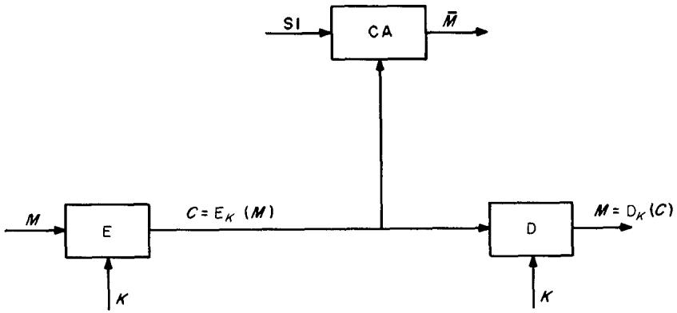
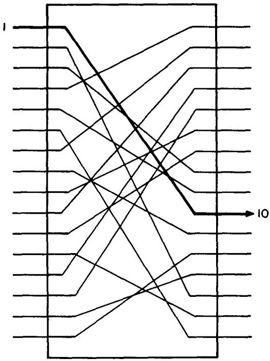
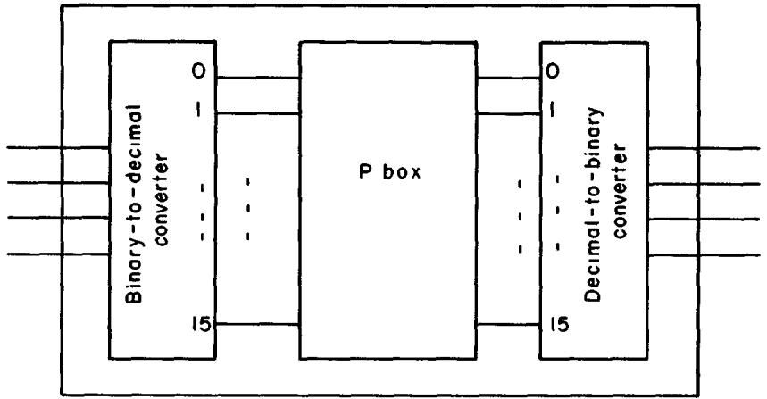
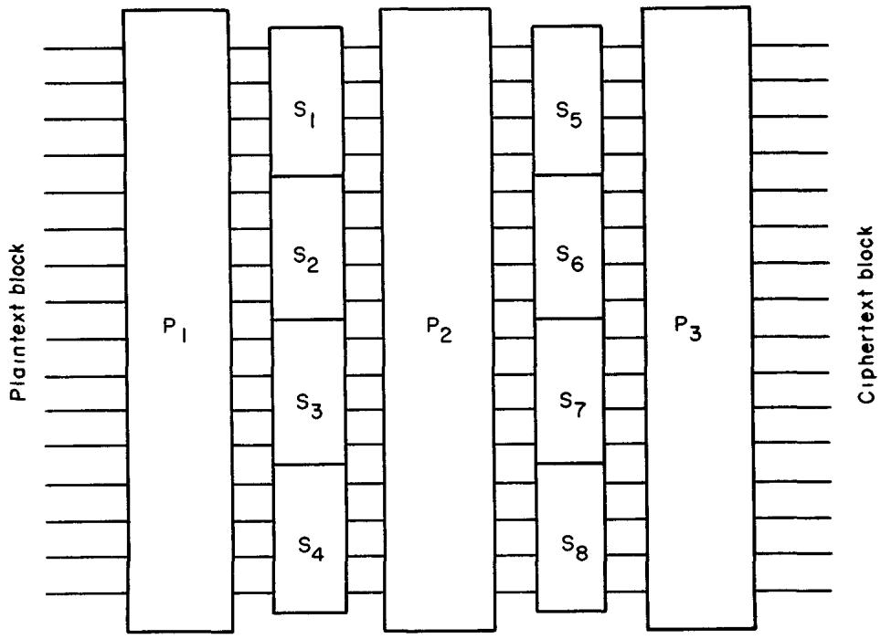

# Cryptography in Transition

# ABRAHAM LEMPEL

Department of Electrical Engineering, Technion-Israel Institute of Technology, Haifa, Israel

The emphasis of this survey is on the new concept of public-key cryptosystems, the recently proposed schemes for their implementation, and the problems pertaining to cryptocomplexity. Also presented are a brief outline of classical cryptography, the principles underlying present-day cryptography, and a short description of the now official Data Encryption Standard.

Keywords and Phrases: cryptography, cipher, encryption, decryption, cryptosystem, cryptocomplexity, public-key cryptosystems

CR Categories: 3.15, 3.71, 5 14, 5 30

# PREFACE

This work is intended to convey to the reader the phase of transition that public cryptography is in at the present time and the evolving state of the art. The transition is multifaceted: In scope of relevancy it has evolved from a government monopoly dealing with military and diplomatic communications to a major concern of business in general, the banking industry in particular, and, more recently, the public at large. Its technology has expanded from paper-and-pencil and various mechanical devices to large, high-speed, electronic computers. Its security emphasis has changed from statistical uncertainty to computational complexity. And last, but not least, in concept it has developed from conventional, private-key schemes to public-key cryptosystems providing instant privacy and two-way authentication.

This latest transition also reflects the rapidly evolving state of the "art" of cryptography. Since its recent adoption by the

This work was carried out while the author was on leave with the Sperry Research Center, Sudbury, Mass.

academic community as a legitimate area of study and research, proponents of public cryptology are striving to transform it from an art to a science, that is, to replace intuition with solid measures and criteria and to rely on proof rather than on certification.

The main emphasis of this survey is on the new concept of public-key cryptosystems and on the recently proposed schemes for their implementation (Section 3). This topic is preceded by a chronological introduction, a brief outline of classical cryptography and some of its major schemes (Section 1), and the principles underlying present-day cryptography, with a short description of the now official Data Encryption Standard (Section 2). Section 4 deals with the problematic concept of cryptocomplexity; the disparity between this concept and the complexity-theoretic concept of NP-completeness is demonstrated by an example of an easy-to-break NP-complete cipher. Also noted are the danger of applying out-of-context measures of complexity and the need for some fundamental research rather than the proliferation of more implementations.

A preliminary version of this work, which

# CONTENTS

# PREFACE INTRODUCTION

1 CLASSICAL CRYPTOLOGY

11 The Caesar Cipher

12 Simple Substitution

13 Polyalphabetic Ciphers

14 Transposition

15 Product Ciphers

2. PRINCIPLES UNDERLYING PRESENT-DAY CIPHERS

21 Stream Ciphers

2.2 Block Ciphers

23 The Data Encryption Standard

3 PUBLIC-KEY CRYPTOSYSTEMS

31 The Rivest-Shamir-Adleman (RSA) Scheme

32 The Merkle-Hellman (MH) Scheme

33 The McEliece Scheme

34 The Graham-Shamir (GS) Scheme

35 Signature-Only Schemes

4 ON THE INTRICACIES OF CRYPTOCOMPLEXITY

Example An Easy-to-Break NP-Complete Cipher ACKNOWLEDGMENTS REFERENCES

appeared as a September 1978 Sperry report [LEMP78], also included an annotated bibliography of cryptology. This bibliography, compiled by Diffie and Hellman, has since been published elsewhere [DIFF79].

We should like to point out that all references in the text to "known" or "existing" methods and schemes are with respect to unclassified and nonproprietary knowledge. In the area of public-key systems, we have done our best to cover all known schemes as of August 1978; given the rapidly evolving state of this subject, we may have missed some.

# INTRODUCTION

Cryptography is the art, or would-be science, of designing and breaking secrecy systems. Its designing or synthetic part is often referred to as cryptography, while the breaking or analytic part is called cryptanalysis. As an art, cryptography dates back to the early days of recorded history; as a would-be science, it is in the early stage of searching for appropriate criteria for security and measures of complexity, still having to rely

mostly on "certification" through concerted man/computer-years effort rather than on rigorous proof.

The most complete history of cryptology, covering the period from the Pharaonic age of ancient Egypt all the way through World War II, is recorded in the 1967 book by D. Kahn, The Codebreakers, the Story of Secret Writing [KAHN67]. Although it is concerned more with the impact of cryptography rather than with its technical development, it provides an excellent introduction to the subject. From the perspective of the summer of 1978, the many centuries covered by Kahn's book can be lumped together as the classical era of cryptography. Despite the wide complexity gap between the simple Caesar cipher (attributed to Julius Caesar) and the sophisticated rotor machines used in World War II, their common denominator stems from the fact that they preceded the advent of electronic computers.

The computational power that became available with the introduction of electronic computers ushered in the modern age of cryptography; the steep increase in this power ever since and its pervasive impact on society have substantially broadened the scope of relevancy of cryptography. An area mainly concerned with the making and breaking of secure military and diplomatic communications, and which until less than a decade ago was considered to be under strict government control, if not an outright government monopoly, has become a major concern of business in general, the banking industry in particular, and, more recently, the public at large. In the age of ever-growing computer data banks and electronic fund transfer (EFT), one cannot overestimate the importance of encryption schemes which provide adequate protection against unauthorized, often remote, access to stored data, render the data unintelligible to unauthorized listeners over a publicly accessible communication link, and incorporate a digital signature which can serve as a reliable two-way authentication. These formidable goals were set up to satisfy real market demands that were answered in part by the Data Encryption Standard (DES) [NBS77], which is a reduced and modified version of the IBM Lucifer

[SMIT71, FEIS73] and which since January 1977 has served as the official National Bureau of Standards (NBS) scheme. The main shortcoming of the DES, as of any other scheme known to be currently in use, is that it requires the advance establishment of a private key between every pair of correspondents and thus does nothing to alleviate the increasingly complex problem of key management.

A major step in this direction was taken in 1976 by Diffie and Hellman [DIFF76] and Merkle [MERK78a] of Stanford University, who introduced the concepts of "public-key distribution" and "trapdoor one-way functions" for use in "public-key cryptosystems," which require no prior key channel and allow for unforgeable digital signatures. These ideas—which at first seemed clever, but not very practical—picked up momentum and were soon followed by a readily realizable scheme by Rivest, Shamir, and Adleman [RIVE78a] of MIT. Other realizations, but without the digital signature feature, were suggested by Merkle and Hellman [MERK78b] and soon thereafter by McEliece [McEL78].

The impact of these new encryption

1 The adoption of the DES by the NBS stirred up a controversy [BRAN76, DIFF77, MORR77, KOLA77a] in which those involved were concerned that the moderate key size (56 bits) and the unwillingness on the part of the NBS to disclose the design considerations behind the choice of the specified substitution or "S" boxes, indicated a deliberately built-in weakness to make encrypted data readable by the National Security Agency (NSA) but no one else. Two workshops held by the NBS in the summer of 1976 did not help much to resolve the controversy. The publicity given to an awkward attempt by an alleged NSA employee to prevent the presentation of some of the new encryption schemes at an open scientific meeting [SHAP77] and the continued simmering of the DES controversy prompted an investigation by the Senate Select Committee on Intelligence into the allegations of NSA involvement. In an April 1978 unclassified summary of its report [SSCI78] the committee concludes that NSA has put no pressure on individuals or organizations in connection with their public crypto-logic research. It concludes further that NSA indirectly assisted IBM in the development of the S boxes, convinced IBM that a reduced key size was sufficient, and did not tamper with the design of the DES in any way. Given the national security implications, the committee recommends that NSA and the National Science Foundation (NSF) work out arrangements for NSA's becoming part of NSF's peer review process of grant proposals and for reducing the ambiguity which surrounds the granting of research funds for public crypto-logy. (See SUGA78 for a follow-up discussion of the legal status of public crypto-logic research.)

schemes has not been lost on any of the interested parties: The various security agencies are apparently checking them out [KOLA78]; industry is exploring implementation options; and not least important, the academic world, where it all originated, has embraced cryptology as a legitimate research area, and a very active one at that.

With all due credit, it should be pointed out that the new encryption schemes have not as yet been shown to constitute "A New Kind of Cipher That Would Take Millions of Years to Break," as the title of an August 1977 article in the Scientific American [GARD77] proclaimed. The same month the more appropriate title "Cryptography: On the Brink of a Revolution?" headed an article in Science [KOLA77b]; the removal of the question mark from this title is yet to be accomplished. The problem lies with the apparent lack of proof that any of these new schemes are indeed as hard to break as they seem to be. Their strength resides in the intractable computational complexity of solving certain mathematical problems by presently known methods. Given the far-reaching implication of such encryption schemes, the question is whether or for how long the underlying mathematics will be able to withstand a concerted effort by a highly motivated mathematical community. On the other hand, the same motivation may lead to the invention of new schemes or to the establishment of an appropriate measure of cryptocomplexity which will be more truly relevant to cryptography and thus pave the way for more rigorous assertions of unbreakability.

# 1. CLASSICAL CRYPTOLOGY

The two major tools of classical cryptography are codes and ciphers. Both are designed to transform plaintext messages into hidden-text cryptograms. A code is a fixed predetermined dictionary that assigns code words to most likely messages, and its primary use is thus intended for those texts which can be composed from the preselected messages. The fixed nature of a code also impairs the security provided by it, so that codes have usually been used in combination with ciphers to produce enciphered code.

A cipher is a universal scheme employing

FIGURE 1. General structure of a cryptosystem.

a set of transformations capable of turning any plaintext into ciphertext. The particular transformation applied at any given time is controlled by the key used at that time. The key in use is assumed to be known to both the (legitimate) sender and receiver but not, at least a priori, to the cryptanalyst whose objective is to break the system.

Following the trend in literature and practice, we deal here only with cipher-based cryptosystems whose general structure is depicted in Figure 1. The E, D, and CA blocks denote, respectively, the encryption, decryption, and cryptanalysis schemes. Given a message  $M$  and a key  $K$ , the encryption scheme produces the ciphertext  $C = \mathbf{E}_K(M)$ , where this functional notation (rather than  $\mathbf{E}(K,M)$ ) is meant to indicate that, normally,  $K$  is an encryption/decryption parameter that remains fixed for a considerable number of messages. Given  $C$  and the same  $K$ , the decryption scheme can readily produce the original  $M = D_K(C)$ .

The cryptanalyst, who is assumed to have full knowledge of the  $\mathbf{E}$  and  $\mathbf{D}$  schemes, has access to  $C$  and to a variety of side information SI, such as language statistics, the general context of the ongoing communication, and some plaintext; his task is to produce the best estimate  $\tilde{M}$  of  $M$  given E, D,  $C$ , and SI, but not  $K$ . Although it may in certain cases be possible for the cryptanalyst to produce the correct  $M$  without having found  $K$  first, breaking a cryptosystem usually means finding a scheme that is capable of producing  $K$  given "enough" SI.

Thus, the protection provided by a given encryption scheme  $\mathbf{E}$  is often measured in terms of the uncertainty facing the cryptanalyst in his attempt to determine which of the potential keys admissible under  $\mathbf{E}$  is actually being used. The inefficiency of such a scheme  $\mathbf{E}$  is measured in terms of the statistical redundancy of the underlying language, which can be extended to include other aspects of SI.

Quantitative treatment of such notions as uncertainty and redundancy was made possible by the advent of information theory. The mathematical foundations of information theory and their application to classical cryptosystems were established in two monumental works by Shannon [SHAN48, SHAN49], whose conclusions and recommendations of thirty years ago have served as guidelines even in the design of the recent NBS-approved scheme. The details of Shannon's work are outside the scope of this survey. Some of his main conclusions can be summarized as follows.

Cryptanalysis is made possible because of redundancy; hence, data compression before encryption enhances security. With every cryptosystem one can associate a positive integer  $N_0$  such that, in the worst case, a single cryptogram of length  $N_0$  uniquely determines the key in use. Shannon called this parameter the unicity distance of the system, and he has shown that it can be closely approximated by the ratio of the a priori uncertainty in the key to the percharacter redundancy of the language. Thus, a cryptosystem with unicity distance  $N_0$  is rendered insecure if used to encrypt  $N_0$  or more characters.

Although one of the basic assumptions in the information-theoretic model is that the cryptanalyst possesses unlimited computational resources, Shannon was fully aware of the practical importance of the so-called work factor of a cryptosystem, which is the ratio of the complexity of cryptanalysis to that of decryption. In a sense, it was the seed that gave growth to the modern approach, which bases security on the complexity of cryptanalysis rather than on equivocation. Shannon's suggestion to increase the work factor through what he called "confusion and diffusion" has been well heeded in the trade, and it is the cornerstone of many contemporary systems, including the DES. Its main principles are discussed in Section 2. We conclude this section with a short review of the major classical ciphers. In all of the forthcoming examples we use the 26-letter English alphabet, with the numerical correspondence  $\mathrm{A} \leftrightarrow 0$ ,  $\mathrm{B} \leftrightarrow 1$ ,  $\mathrm{C} \leftrightarrow 2$ , ...,  $\mathrm{Z} \leftrightarrow 25$ , when arithmetic operations are involved.

# 1.1 The Caesar Cipher

Originally, the Caesar cipher consisted of a single key, with the corresponding unique transformation being

$$
\mathbf {E}: M \rightarrow M + 3 \quad (\mathrm {m o d} 2 6),
$$

$$
M = 0, 1, \dots , 2 5.
$$

Later it was generalized to mean the cipher with 26 keys,  $0 \leq K \leq 25$ , corresponding to the 26 cyclic shifts of the alphabet:

$$
\mathbf {E} _ {K}: M + K \quad (\mathrm {m o d} 2 6).
$$

The number of keys being so small, exhaustive cryptanalysis renders this cipher completely insecure.

# 1.2 Simple Substitution

Simple substitution is a cipher that allows any permutation on the English alphabet to be used as a substitution key on a letter-by-letter basis, thus including the Caesar cipher as a very special case. For example,

of keys here is  $26! > 4 \cdot 10^{26}$  which suffices to eliminate the feasibility of exhaustive cryptanalysis. However, statistical analysis of the English language reveals a pretty high redundancy, about 3.2 bits per letter, resulting in a unicity distance of  $N_0 = 28$  letters for this cipher, under a uniform key distribution. However small this theoretically derived number is, it is even larger than the number 25 referred to by Friedman [FRIE67] as the practical breakpoint. Cryptanalysis of the simple substitution cipher is fast because it preserves the letter frequency distribution which is so highly nonuniform in typical English text. For a more detailed description of the cryptanalytic techniques for this and the subsequently described ciphers, the reader is referred to Sinkov [SINK68].

# 1.3 Polyalphabetic Ciphers

Polyalphabetic ciphers use a periodic sequence of  $n$  substitution alphabets, which significantly enhances security by smoothing out the language statistics. (The same ciphertext letter may represent a frequent plaintext letter in one place and an infrequent one in another place.) Also, the effective number of possible keys is increased from 26! to  $(26!)^n$ .

A highly popular simplified version of polyalphabetic substitution is the Vigenère cipher, which employs as key a periodic sequence of Caesar-type substitutions, often defined by some meaningful key phrase that makes it easy to remember. For example, the key phrase BEST MAN defines the transformation which adds (mod 26) the sequence of integers 1, 4, 18, 19, 12, 0, 13, repeated periodically, to the sequence of integers representing the plaintext. The number of keys in a Vigenère cipher of period  $n$  is  $26^n$ , a small fraction of the number available in the general polyalphabetic cipher of the same period. However, when  $n \to \infty$  or, in practical terms, when the period length is the same as the message

ABCDEFGHIJKLMNOPQRSUVWXYZTHUVICWBNFSPODZGJXQALYMRKE

is a key that takes the plaintextMESSAGE into the ciphertext OIQQTWI. The number

length, one obtains the so-called "one-time pad," of Vernam cipher, which provides

demonstrably perfect security [SHAN49]. The "hot line" between Washington and Moscow uses the one-time pad, and it is also believed [GARD77] to be the only method by which Soviet agents are allowed to encrypt their messages.

The enormous key-management problems involved in the advance preparation and distribution of one-time pads and their most inefficient utilization of key symbols make them useful only for highly sensitive communications.

# 1.4 Transposition

Transposition is a block cipher which operates on words (blocks) of length  $n$ , employing as keys the  $n!$  positional permutations to transpose the letters of a word. To encrypt, one first breaks up the plaintext stream into  $n$ -letter words and then applies the transposition prescribed by the particular key being used to each word in succession. For example, if  $n = 5$  and the key in use is

$$
\textbf {1 2 3 4 5}
$$

$$
\textbf {4 3 1 5 2}
$$

the first letter of the word becomes the fourth, the second becomes the third, and so on; the plaintext TOP SECRET CIPHER, after being parsed into TOPSE CRETC IPHER, is then transformed into the ciphertext

# PEOTSECRCTHRPIE.

This cipher also preserves the frequency distribution of single letters, but unlike simple substitution it destroys the digram, tri- gram, and higher order statistics of the language which, in a sense [HEll 77], makes it a better cipher for a natural language than simple substitution.

# 1.5 Product Ciphers

While for practically feasible values of  $n$  each of the above ciphers is rather weak by itself, when these ciphers are properly composed and iterated a sufficient number of times, they may provide a very high degree of security. When plaintext encrypted by cipher  $T$  is reencrypted by cipher  $S$ , the final ciphertext can be viewed as the result of encryption by the product cipher  $R =$

ST. The broad potential of product ciphers in terms of work-factor (and thus security) gain was fully recognized by Shannon [SHAN49] and has since become the main principle upon which present-day cryptosystems are based. The ultimate usefulness of the principle is due to the fact that the very elementary schemes of simple substitution and transposition acting as low-cost building blocks can be efficiently composed to form very complex ciphers such as the DES.

# 2. PRINCIPLES UNDERLYING PRESENT-DAY CIPHERS

The security of almost all present-day ciphers is based on the amount of work required to break them rather than on statistical uncertainty. The assumption is that the cryptanalyst has enough side information to determine the key uniquely if he can afford an exhaustive search. Under the Shannon model, for example, this would mean that the cryptanalyst possesses an amount of ciphertext that exceeds the unicity distance. Possession of almost unlimited ciphertext is regarded now [DIFF76] as the lowest rank side information to which the cryptanalyst may have access.

The threat to which a system is subject under known ciphertext is called a ciphertext-only attack, and any scheme that succeeds to it is totally useless. A more realistic approach assumes the cryptanalyst to possess a considerable amount of corresponding plaintext and ciphertext. In this case the system is subject to a known plaintext attack, which is a much more formidable threat. The ultimate threat, short of "physical acquisition" of the key, is the chosen plaintext attack, where the cryptanalyst is assumed to be able to obtain corresponding plaintext and ciphertext of his choice. In all of these attacks it is assumed that the cryptanalyst has full knowledge of the structure of the system under attack.

It is most appropriate at the present time to evaluate ciphers by their ability to withstand a chosen plaintext attack. According to Hellman et al. [HELL76], the NBS applied the less powerful known-plaintext attack in its testing of the DES. With cipher

certification still a heuristic rather than a rigorous procedure, only the more conservative estimates of cipher strength should be relied upon.

In the remainder of this section we review the main principles and implementation techniques by which private-key cryptosystems currently in use manage to cope with the above-mentioned threats. The newest public-key concepts and suggested implementations are described in Section 3. As most current data are stored, transmitted, and processed in binary form, we restrict our attention, without loss of generality, to ciphers over the binary  $\{0,1\}$  alphabet. Thus both plaintext and ciphertext are presented in the form of bit strings. When encryption of a plaintext string is performed bit by bit, the corresponding cipher is called a stream cipher; otherwise, the plaintext string is first broken into words and then encrypted on a word-by-word basis. Most commonly, owing to synchronization and buffering considerations, the words are of fixed length  $n$ , in which case the corresponding scheme is called a block cipher.

# 2.1 Stream Ciphers

Present-day stream ciphers are refined modern versions of the Vigenère cipher. Instead of a relatively short, easy-to-remember key phrase, one employs a key-string generator, usually, a feedback shift register, whose controllable initial state and feedback wiring act as the compact encryption key. The cryptanalyst is assumed to know the fixed features of the key-string generator and can thus produce the entire key string once he learns the compact key. In many cases a sufficiently long substring of the key string determines uniquely the rest of the key string, which makes stream ciphers vulnerable to known-plaintext attack unless special care is taken to make key-string bits a very complex function of their predecessors. This rules out any kind of linearly generated key strings, including the ever so-attractive maximum-length  $(2^{n} - 1)$  pseudorandom sequences generated by low-cost  $n$ -stage shift registers. A  $2n$ -long segment of known plaintext suffices to break such a cipher [GEFF73].

The main guideline for the design of se

cure stream (as well as block) ciphers is the Shannon principle of diffusion and confusion. Diffusion calls for spreading or "dissipating" the correlation and dependencies among key-string variables over substrings as long as feasible, so as to maximize the required length of plaintext for cryptanalysis. Confusion calls for making the functional dependencies among the related variables as complex as feasible, so as to maximize the time required for cryptanalysis. Several schemes for generating key strings according to this principle have been published recently [GEFF73, PERL76, PLES77]. The latest of these, by Vera Pless [PLES77], is an interesting application of J-K flip-flop networks for this purpose.

# 2.2 Block Ciphers

The basic structure of a typical present-day block cipher is an iterated product cipher, with transposition and simple substitution as its main components [Feis73]. Typical block lengths range from 32 to 128, normally in multiples of 8. The DES block length is 64. The key size is usually equal to the block length; when shorter, as is the 56-bit key of the DES, it is artificially expanded to accommodate the full block length.

The transposition component of the system is readily implementable for the full block length in the form of a so-called P box (P for permutation), as illustrated in Figure 2 for  $n = 16$ . It is unfeasible, however, to implement the full power of simple substitution on whole block-length characters. A block of length  $n$  can represent any of  $2^{n}$  different characters, allowing for  $2^{n}!$  different substitution wires. Consequently, the substitution phase of the encryption scheme is executed in parallel on small (typically 4-bit) segments of the block.

The internal structure of such a 4-bit substitution or "S" box is shown in Figure 3. It consists of three stages: The first is a binary-to-decimal converter; the second is a P box permuting the decimals; and the third is a decimal-to-binary converter.

A typical product cipher for  $n = 16$ , made of alternating layers of P and S boxes, is

FIGURE 2. A P box wired to implement a specific permutation of the block bits.

shown in Figure 4. The P boxes are usually fixed or unkeyed, and their sole function is to provide diffusion. The S boxes are keyed to perform nonlinear substitution and thus confusion. A 16-bit key for the example of Figure 4 would have each S box keyed by two bits, thus allowing for four different key-dependent substitutions to be performed by each S box. The IBM Lucifer is

a 128-bit block cipher designed along these general guidelines [SMIT71, FEIs73]. It employs a fixed  $\mathbf{P}$  box in all layers, and to guarantee a high degree of confusion, each S box is controlled by a single key bit which chooses between two carefully preselected nonlinear substitutions. (A completely general S box could accidentally be keyed in a way that might compromise the system.)

# 2.3 The Data Encryption Standard

The DES [NBS77] is the official (adopted January 1977) National Bureau of Standards (NBS) scheme to be used by federal departments and agencies, as well as others, for the cryptographic protection of computer data. It is an IBM-developed, reduced modification of Lucifer, with a 64-bit data block and a 56-bit key. To bring the key up to full block size, it is artificially expanded to obtain a 64-bit "KEY" by having the last bit of each 8-bit byte chosen so as to ensure an odd parity for that KEY byte, thereby providing a degree of error detection.

To encrypt, the plaintext block is first subjected to an initial permutation IP, then the permuted block goes through a complex key-dependent computation consisting of 16 functionally identical iterations, and finally the ciphertext block is obtained by subjecting the output of the sixteenth iteration to the inverse,  $\mathbf{IP}^{-1}$ , of the initial permutation.

The inputs to the  $i$ th iteration of the key-dependent computation are  $L_{i-1}$ ,  $R_{i-1}$ , and  $K_i$ ,  $1 \leq i \leq 16$ , where  $L_0$  and  $R_0$  are, respec

FIGURE 3. A 4-bit S box implementation of a specific 16-character substitution.

tively, the left and right 32-bit halves of the IP-permuted plaintext block;  $K_{i}$  is a 48-bit function of  $i$  and KEY,  $K_{i} = \mathrm{KS}(i, \mathrm{KEY})$ ; and

$$
L _ {t} = R _ {t - 1}, \quad R _ {t} = L _ {t} \oplus f \left(R _ {t - 1}, K _ {t}\right),
$$

with  $\oplus$  denoting addition mod 2.

The function  $f$  is the heart of the scheme, being a nonlinear, many-to-one substitution. The 32-bit output of  $f$  is obtained as follows. First, the 32-bit  $R_{t-1}$  is expanded into a 48-bit  $\mathbf{E}(R_{t-1})$ ; next,  $K_t$  and  $\mathbf{E}(R_{t-1})$  are added bit by bit, mod 2, and their sum  $Q$  is partitioned into  $Q = Q_1Q_2\cdots Q_8$ , where each  $Q_j$ ,  $1 \leq j < 8$ , is six bits long; then, each  $Q_j$  is fed into a fixed nonlinear, 6-input-to-4-output substitution box  $S_j$ ; finally, the combined 32-bit output of the eight  $S_j$  boxes is fed into a P box whose output is  $f$ . For the complete details of IP,  $\mathrm{IP}^{-1}$ , KS, E, the  $S_j$  boxes, and the P box, the reader is referred to NBS77.

To decrypt, the ciphertext block is subjected to the very same procedure, with the  $K_{i}$ 's applied in reverse order, i.e., starting with  $K_{16}$  and ending with  $K_{1}$ . In this manner, the first decryption step, IP, will undo the last encryption step of  $\mathbf{IP}^{-1}$ ; the  $L_{i}, R_{i}$

pairs will be regenerated in reverse order according to

$$
R _ {t - 1} = L _ {t}, \quad L _ {t - 1} = R _ {t} \oplus f \left(L _ {t}, K _ {t}\right);
$$

and the last decryption step,  $\mathbf{IP}^{-1}$ , will undo the first encryption step  $\mathbf{IP}$  and yield the original plaintext block.

As mentioned in the introduction, the adoption of the DES stirred up a controversy that has yet to be resolved. The main observations and suggestions made by the critics were the following [DIFF77, MORR77]:

1) A one-day exhaustive-search machine would be feasible in the 1980s. (The August 1976 NBS workshop estimated 1990 as the earliest delivery date for such a machine.)

2) Key size should be increased to at least 64 and preferably 128 bits.

3) The number of iterations should be doubled.

4)Publicly designed S boxes should be used.

5) The proposed DES should not be adopted, but if adopted, multiple encryption should be used.

FIGURE 4 A product cipher for blocks of length 16 with fixed P boxes and keyed S boxes.

About three years have passed since these heated arguments were made. The DES is now official, and it is time, not reason, that will resolve the controversy. Whatever other purpose it served, this controversy was certainly a stimulating factor in the revived interest in cryptography and the new results that have been achieved in the last two years.

# 3. PUBLIC-KEY CRYPTOSYSTEMS

The concept of public-key cryptosystems was introduced in 1976 by Diffie and Hellman [Diff76], who envisioned a system for private communication that employs a public directory in which each subscriber places a procedure  $\mathbf{E}$  to be used by other subscribers for the encryption of messages addressed to him, while keeping secret his corresponding decryption procedure  $\mathbf{D}$ . For such a system to be viable, there must be a simple method by which each subscriber can produce his own  $\mathbf{E}$  and  $\mathbf{D}$  procedures. Moreover, regarded as operators on the message and cryptogram sets  $\{M\}$  and  $\{C\}$ , respectively, these procedures must have the following properties:

i) If  $C = \mathbf{E}(M)$ , then  $M = \mathbf{D}(C)$  or  $\mathbf{D}(\mathbf{E}(M)) = M$  for each  $M$ .

ii) Both  $\mathbf{E}$  and  $\mathbf{D}$  are fast and easy to apply.

iii) Public disclosure of  $\mathbf{E}$  does not compromise  $\mathbf{D}$ . That is, the derivation of  $\mathbf{D}$  from  $\mathbf{E}$  is computationally intractable.

The existence of such a system would enable instant secure communication between subscribers who have never met or communicated before. For example, if subscriber A wants to send a private message  $M$  to subscriber B, he looks up  $\mathbf{E}_{\mathbf{B}}$  in the directory under B, and transmits  $C = \mathbf{E}_{\mathbf{B}}(M)$  in the open. By iii), only B can decrypt  $C$  by applying his secret  $\mathbf{D}_{\mathbf{B}}$  to  $C$ .

To attain the digital signature feature, Diffie and Hellman proposed employing E-D pairs with the following additional property:

iv)  $\mathbf{D}$  can be applied to every  $M$ , and if  $S = \mathbf{D}(M)$ , then  $M = \mathbf{E}(S)$  or  $\mathbf{E}(\mathbf{D}(M)) = M$  for each  $M$ .

When iv) holds, subscriber A can "sign" his

message to subscriber B by first computing his message-dependent signature  $S = \mathbf{D}_{\mathrm{A}}(M)$  and then computing the cryptogram  $C = \mathbf{E}_{\mathrm{B}}(S)$ . Now, only B can recover  $S$  from  $C$  by computing  $\mathbf{D}_{\mathrm{B}}(C) = \mathbf{D}_{\mathrm{B}}(\mathbf{E}_{\mathrm{B}}(S)) = S,$  and when he computes  $\mathbf{E}_{\mathrm{A}}(S) = \mathbf{E}_{\mathrm{A}}(\mathbf{D}_{\mathrm{A}}(M)) = M$ , B can be sure that  $M$  came from A because no one else could have applied A's secret  $\mathbf{D}_{\mathrm{A}}$  to compute  $S = \mathbf{D}_{\mathrm{A}}(M)$ .

The digital signature as described above acts as a two-way authentication. In addition to being message dependent,  $S$  is also signer dependent. While  $B$  can be sure that the received message indeed came from  $A$ , by signing his messages  $A$  can be sure that no one will be able to attribute to him a message he did not send. The double dependency of  $S$  also protects against signatures being affixed to false messages.

While presenting a complete description of these elegant concepts in their excellent article [DIFF76], Diffie and Hellman stopped short of presenting a practical implementation of a public-key cryptosystem. They indicated, however, that the way to any such implementation leads through computationally hard problems such as the inversion of so-called one-way functions. The various implementations that have been published since [RIVE78a, MERK78b, McEl78] are based on such problems. A function  $f$  is said to be one-way if  $f$  is invertible and easy to compute; but for almost all  $x$  in the domain of  $f$ , it is computationally infeasible to solve  $y = f(x)$  for  $x$ . In other words, it is computationally infeasible to compute  $f^{-1}$  from a complete description of  $f$ .

A function  $f$  is called a trapdoor one-way function if  $f^{-1}$  is easy to compute once certain private "trapdoor" information is known and if without such knowledge  $f$  is one-way.

It is clear that any trapdoor one-way function  $f$  and its inverse  $f^{-1}$  can act as an E-D pair for a public-key cryptosystem. If and only if  $f$  is also a permutation on the message set  $\{M\}$ , will the digital signature feature be part of the system.

Diffie and Hellman [DIFF76] and, independently, Merkle [MERK78a] also introduced the concept of public-key distribution systems. The purpose of such a system is to enable every pair of subscribers to exchange a private key securely over an

insecure channel for use in a conventional cryptosystem like, say, the DES. To this end, the authors have proposed the following implementation schemes.

The security of the Diffie and Hellman method is based on the difficulty of computing logarithms modulo a prime number. Given a prime  $q$  and an integer  $X$ ,  $1 \leq X \leq q - 1$ , one can compute

$$
Y = \alpha^ {X} \pmod {q},
$$

where  $\alpha$  is a fixed primitive element of  $\mathrm{GF}(q)$ , using at most  $2\log_2q$  multiplications (see Knut69, pp. 398-422). On the other hand, for carefully chosen primes  $q$ , the best known method for taking logarithms, that is, computing  $X$  from  $Y$ , requires about  $q^{1/2}$  operations [PoHL78]. Now, each user A selects at random a number  $X_{A}$  from the set  $\{1,2,\ldots,q-1\}$  and computes  $Y_{A} = \alpha^{X_{A}} \pmod{q}$ . While keeping  $X_{A}$  secret, he places  $Y_{A}$  in a public directory. When users A and B want to communicate, they use  $K_{AB} = Y_{A}^{X_{B}} = Y_{B}^{X_{A}} = \alpha^{X_{A}X_{B}} \pmod{q}$  as their private key. Whereas each of A and B can readily compute  $K_{AB}$  by using his own secret  $X$  and his partner's public  $Y$ , an interceptor C must compute  $K_{AB}$  from  $Y_{A}$  and  $Y_{B}$ . Since  $K_{AB} = Y_{A}^{\log_a Y_B} \pmod{q}$ , the system is at most as hard to break as it is to compute logarithms mod  $q$ . Whether the two problems are indeed equivalent is still unresolved.

Merkle's method is based on the "puzzle" concept. A puzzle is a cryptogram from a cryptosystem that can be broken in a feasible number of steps  $O(n)$ . The number  $n$ , however, should be sufficiently large to render a computation requiring  $O(n^2)$  steps intractable. Each user publishes (or transmits upon request)  $n$  puzzles each of which "enpuzzles" a message consisting of two components: a randomly assigned ID that uniquely identifies the puzzle and a randomly selected key from a predetermined key space. When user A wants to communicate with user B, he selects at random one of B's puzzles, breaks it in  $O(n)$  steps, transmits to B in the open the ID of that puzzle, and uses the corresponding key for encrypting his messages to B. If a third party C wishes to find out what that key is, his only recourse is to solve B's puzzles one by one in some random order until the intercepted ID is depuzzled. The expected

number of computation steps for  $\mathbf{C}$  is obviously  $O(n^{2})$

More conventional methods of key generation and distribution for use with cryptosystems like the DES were published recently in a special cryptography section of the IBM Systems Journal [EHRS78, MATY78]. We proceed now to describe the existing implementations of public-key cryptosystems.

# 3.1 The Rivest-Shamir-Adleman (RSA) Scheme

Messages and cryptograms in the RSA scheme [RIVE78a] come in the form of integers between 0 and  $n - 1$ . (Any standard method for representing data blocks as integers will do.) Each user chooses his own  $n$  and another pair of positive integers  $e$  and  $d$  in a manner to be described below. The encryption key that a user places in the public file consists of the pair  $(n, e)$ . The corresponding decryption key consists of the pair  $(n, d)$ , of which the component  $d$  is kept secret. The encryption algorithm  $\mathbf{E}$  for a message  $M$  and the decryption algorithm  $\mathbf{D}$  for a cryptogram  $C$  are

$$
\begin{array}{l} \mathbf {E} (M) = M ^ {e} \pmod {n}, \\ \mathbf {D} (C) = C ^ {d} \pmod {n}. \\ \end{array}
$$

(Note that both operations are simple to execute and the results of encryption and decryption are integers between 0 and  $n - 1$ .)

The integers  $e$  and  $d$  are chosen to satisfy

$$
(X ^ {e}) ^ {d} = (X ^ {d}) ^ {e} = X ^ {e d} = X \quad (\mathrm {m o d} n)
$$

for every integer  $X$  between 0 and  $n - 1$ . Therefore,

$$
\mathbf {E} (\mathbf {D} (X)) = \mathbf {D} (\mathbf {E} (X)) = X \quad (\mathrm {m o d} n)
$$

for all  $X$  in the mentioned range.

The security of the RSA scheme is dependent on the difficulty of factoring large numbers. The way this difficulty is brought into play is as follows. Each user chooses (privately) two large primes,  $p$  and  $q$ , using some random selection process and one of the recently published efficient primality tests [MILL75, RABI76, SOLO77]. The integer  $n$  is then taken to be the product of (the secret)  $p$  and  $q$ . Next, a number  $d > \max \{p, q\}$  is picked at random from the set of integers that are relatively prime to and less than  $\phi(n) = (p - 1)(q - 1)$ . Finally,

using a variation of Euclid's algorithm (see exercise 4.5.2.15 in KNUr69), the integer  $e$ ,  $0 < e < \phi(n)$ , is computed from  $\phi(n)$  and  $d$  to be the multiplicative inverse of  $d$  modulo  $\phi(n)$ . That is,

$$
e \cdot d = 1 \quad (\operatorname {m o d} \phi (n)).
$$

Rivest, Shamir, and Adleman [RIVE78a] illustrate their scheme by an example with  $p = 47$ ,  $q = 59$ , and  $d = 157$ . These primes give rise to  $n = 47 \cdot 59 = 2773$ ,  $\phi(n) = 46 \cdot 58 = 2668$ , and  $e = 17$ . Since  $n > 2626$ , we can encode two letters per block using the substitution: blank  $= 00$ ,  $A = 01$ ,  $B = 02, \ldots, Z = 26$ . With this numeric representation each block is four digits long, and the message IT IS ALL GREEK TO ME becomes

$$
\begin{array}{l l l l l} 0 9 2 0 & 1 9 0 0 & 0 1 1 2 & 1 2 0 0 & 0 7 1 8 \end{array}
$$

$$
\begin{array}{l l l l l} 0 5 0 5 & 1 1 0 0 & 2 0 1 5 & 0 0 1 3 & 0 5 0 0. \end{array}
$$

Since binary  $(e) = 10001$ , the encryption of each block  $M$  can be accomplished in five multiplications:  $M^{17} = ((M^2)^2)^2 \cdot M$ . For the first block we obtain  $920^{17} = 948$  (mod 2773), and the whole message is deciphered as

$$
\begin{array}{l l l l l} 0 9 4 8 & 2 3 4 2 & 1 0 8 4 & 1 4 4 4 & 2 6 6 3 \end{array}
$$

$$
\begin{array}{c c c c c} 2 3 9 0 & 0 7 7 8 & 0 7 7 4 & 0 2 1 9 & 1 6 5 5. \end{array}
$$

The plaintext can be reproduced by raising each ciphertext block to the power  $d = 157$  modulo 2773.

Now, given the published  $n$  and  $e$ , one way of attempting to break the cipher is to factor  $n$  into  $p$  and  $q$ , compute  $\phi(n) = (p - 1)(q - 1)$ , and use Euclid's algorithm to compute  $d$  from  $\phi(n)$  and  $e$ . All this is quite simple, except for the factorization part. The number of operations required to factor a 200-digit  $n$  (the size recommended by Rivest et al. [RIVE78a]) using the fastest known method (by R. Schroeppel, unpublished) is in excess of  $10^{23}$ , which for a  $1 - \mu s$ /operation computer will take over  $3 \cdot 10^9$  years to complete.

One might contemplate other ways of breaking the scheme, ways that do not resort to factorization. One such way was suggested in Cryptologia [SIMM77], but the inventors of the scheme were well prepared to rebut it [RIVE78b]. More recently, it was shown (by M. Rabin, unpublished) that breaking a slightly more general scheme,

using any method whatsoever, is in fact equivalent to factorization. This latest result places the RSA scheme in a rather safe position as long as factorization remains hard.

It should be noted that in analogy with the Diffie and Hellman public-key distribution scheme, breaking the RSA scheme could also be viewed as the problem of computing modular logarithms, with the additional complexity that the modulus is composite rather than prime. For the fine points of the methods for choosing and generating the primes  $p$  and  $q$ , as well as the integers  $d$  and  $e$ , the reader is referred to RIVE78a.

# 3.2 The Merkle-Hellman (MH) Scheme

Messages in the MH scheme [MERK78b] are binary  $n$ -vectors,  $M = (b_{1}b_{2}\dots b_{n})$ ,  $b_{j} \in \{0,1\}$ , and the public encryption key is a so-called trapdoor knapsack  $n$ -vector  $A = (a_{1}a_{2}\dots a_{n})$ , where the  $a_{j}$  are positive integers chosen in a manner to be described below. The encryption algorithm for a message  $M$  is

$$
\mathbf {E} (M) = A M ^ {\mathrm {T}} = \sum_ {j = 1} ^ {n} a _ {j} b _ {j},
$$

the result being an integer  $c$  between 0 and  $a = \sum_{j=1}^{n} a_{j}$ . The corresponding cryptogram  $C$  is the standard binary representation of  $c$ ,  $C = \text{binary}(c)$ , using  $\lceil \log_2(1 + a) \rceil$  bits, where  $\lceil x \rceil$  denotes the least integer  $\geq x$ .

While it is simple to compute  $C$  from  $M$ , the reverse is apparently very difficult for certain carefully chosen knapsack vectors  $A$ , unless the built-in trapdoor is known. Before we elaborate further on the difficulty of cryptanalysis, we proceed to describe the method of generating the trapdoor knapsack and the implied decryption algorithm.

The trapdoor information or the secret decryption key is a pair of large, positive integers  $w$  and  $m$  which satisfy:

i)  $w$  is less than and relatively prime to  $m$ ; that is,  $w$  has a multiplicative inverse  $w^{-1}$ ,  $0 < w^{-1} < m$  modulo  $m$ .

ii) If  $\hat{a}_j = w^{-1}a_j$  (mod  $m$ ), then

$$
\hat {a} _ {j} > \sum_ {i = 1} ^ {j - 1} \hat {a} _ {i}, \quad j = 2, 3, \dots , n,
$$

and

$$
m > \sum_ {j = 1} ^ {n} \hat {a} _ {j}.
$$

It is easy to verify that i) and ii) imply the following simple decryption procedure. Given  $C = \mathrm{binary}(c)$ ,

1) compute  $c$  from  $C$ ;

2) compute  $\hat{c} = w^{-1}c$  (mod  $m$ );

3) compute  $M = (b_{1}b_{2}\dots b_{n})$ ,  $b_{j} = 0, 1$ , according to

3.1) set  $\hat{b}_n = 1$  if and only if  $\hat{c} \geq \hat{a}_n$ ;

3.2) for  $j = n - 1, n - 2, \ldots, 1$ , set  $b_{j} = 1$  if and only if

$$
\hat {c} - \sum_ {t = j + 1} ^ {n} \hat {a} _ {t} b _ {t} \geq \hat {a} _ {j}.
$$

Merkle and Hellman illustrate their scheme by an example with  $n = 5$ ,  $m = 8443$ ,  $w = 2550$ , and  $\hat{A} = (171, 196, 457, 1191, 2410)$ . The trapdoor knapsack is then given by  $A = w\hat{A} = (5457, 1663, 216, 6013, 7439)$  (mod 8443), and  $w^{-1} = 3950$  (mod 8443). Given the sum

$$
c = 1 6 6 3 + 6 0 1 3 + 7 4 3 9 = 1 5 1 1 5,
$$

decryption proceeds by first computing

$$
\hat {c} = w ^ {- 1} c = 3 9 5 0 \cdot 1 5 1 1 5 = 3 7 9 7
$$

(mod 8443).

Since  $\hat{c} >\hat{a}_5$  , we set  $b_{5} = 1$  . Then following the rule of 3.2), we determine that  $b_{4} = 1$ $b_{3} = 0,b_{2} = 1,$  and  $b_{1} = 0$

Merkle and Hellman recommend the use of a knapsack vector of length  $n \geq 100$ . For  $n = 100$ , they suggest that  $m$  be chosen uniformly from the integers between  $2^{201} + 1$  and  $2^{202} - 1$ ; that the  $a_j$ 's be chosen uniformly from the integers between  $(2^{j-1} - 1)2^{100} + 1$  and  $2^{100+j-1}, j = 1, 2, \ldots, n$ ; and that  $\hat{w}$  be chosen uniformly from the integers between 2 and  $m - 2$  and then repeatedly divided by  $\gcd(\hat{w}, m)$  to obtain  $w$  such that  $\gcd(w, m) = 1$  (gcd stands for greatest common divisor). The  $a_j$ 's are then computed according to

$$
a _ {j} = w \hat {a} _ {j} \quad (\mathrm {m o d} m), \quad j = 1, 2, \dots , n,
$$

and placed in the public file. These choices ensure that i) and ii) are met and that the  $a_{j}$ 's have the appearance of a randomly selected set of integers.

To enhance security, Merkle and Hell

man suggest iterating the trapdoor-obscursing transformation  $a_{j} = w\hat{a}_{j}$  (mod  $m$ ) several times, with different  $w$  and  $m$  pairs each time. They also present a "multiplicative-knapsack" version of their scheme and suggest combining the two versions in generating the iterated trapdoor knapsack. With each iteration, however, there is a slight increase in block length, which accounts for this scheme's not having the "onto" property; that is, not every integer  $c$  in the cryptogram range can be obtained as the sum of some subset of the  $a_{j}$ 's. Therefore, the MH scheme does not possess a straightforward digital signature feature. In their cited article, the authors suggest a modified signature procedure which, for a sufficiently dense "into" mapping, will require a limited number of attempts before a modified signature can be executed. An improved method of generating dense knapsacks with a modified signature feature is under preparation [MERK78c].

The security of the MH scheme is based on the difficulty of the so-called knapsack problem which, in the current context, can be stated as the problem of determining a subset of a given set of  $n$  positive integers with a prescribed value for the sum of the subset members. This problem belongs to a class of hard problems known as NP-complete (see Section 5 or KARP72, AHO74). There is a threefold deterrent, however, to accepting the MH scheme as secure solely on the basis of the knapsack problem's being NP-complete. First, there is no proof yet that with the MH trapdoor the problem is still NP-complete; second, eligibility for membership in the NP-complete class is determined on a worst-case basis; and third, it is not entirely clear yet just how hard a worst-case sample of an NP-complete problem is. The discussion and examples of the next section will further clarify these points.

# 3.3 The McEliece Scheme

The McEliece scheme [McEL78] is based on the difficulty of the general decoding problem for linear error-correcting codes which, though known to be hard for a long time, was only recently shown [BERL78] to be NP-complete. The public encryption key

is a  $k \times n$  binary matrix  $G$  of rank  $k$ , acting as a generator for an apparently arbitrary  $(n, k)$  linear code. In fact,  $G = S\hat{G}P$ , where  $\hat{G}$  is a generator matrix for an easy-to-decode Goppa code [McEl77, Ch. 8],  $S$  is a random binary  $k \times k$  nonsingular scrambled matrix, and  $P$  is a random permutation matrix which obscures the algebraic structure of  $G$ . The code length is  $n = 2^m$  for some sufficiently large  $m$ , and the code dimension is  $k \geq n - mt$ , where  $t$  is the error-correcting capability of the code. The cipher messages are binary  $k$ -vectors, and the encryption algorithm for a message  $M$  is

$$
\mathbf {E} (M) = M G \oplus Z,
$$

where  $Z$  is a locally generated random vector of length  $n$  and weight  $t$ . (Note that the resulting cryptogram is of length  $n$ .)

The secret trapdoor information consists of the inverses  $P^{-1}$  and  $S^{-1}$  of the matrices  $P$  and  $S$ , respectively. The corresponding decryption procedure for a cryptogram  $C$  is readily executed as follows:

1) Compute  $\hat{C} = CP^{-1}$ . (Note that  $\hat{C}$  is a code word of the Goppa code generated by  $\hat{G}$ .)

2) Apply Patterson's algorithm [PATT75] to decode  $\hat{C}$  into  $\hat{M} = MS$ . (The number of operations is  $O(nt)$ .)

3) Compute  $M = MS^{-1}$ .

The McEliece encryption scheme covers only a small fraction of the cryptogram space and thus lacks the signature feature.

In his discussion of the scheme's strength, McEliece suggests that the most promising method of attack would be to select randomly  $k$  of the  $n$  cryptogram bits in the hope that none of these are in error (because of the  $t$  nonzero bits of  $Z$ ) and to compute  $M$  by inverting, when possible, the corresponding  $k \times k$  submatrix of  $G$ . For  $n = 1024$ ,  $k = 524$ , and  $t = 50$ , McEliece calculates the expected number of operations required to find  $M$  to be about  $10^{19}$ . For the same parameters, he calculates the probability of being able to "sign" a randomly selected vector of length 1024 to be only about  $2^{-215}$ , a very small fraction indeed.

# 3.4 The Graham-Shamir (GS) Scheme2

The GS scheme is a variation on the MH scheme, the essential difference being in the hidden, easy-to-solve knapsack  $\hat{A} = (\hat{a}_1\hat{a}_2\dots \hat{a}_n)$ . In decimal representation, each knapsack number  $\hat{a}_{j}$  takes the form

$$
\hat {a} _ {J} = R _ {J 1} I _ {J} 0 ^ {t} R _ {J 2}
$$

where  $R_{j1}$  and  $R_{j2}$  are random 50- to 100-digit numbers,  $0^{t}$  is a string of  $t$  zeros, and  $I_{j}$  is an  $n$ -tuple with a one in the  $j$ th position and zeros elsewhere. The integer  $t$  is chosen to be the number of digits in the "carry overflow" created by multiplying each  $R_{j2}$  by nine (messages are decimal  $n$ -tuples) and adding the  $n$  products  $9 \cdot R_{j2}$ . It is easy to verify that under these conditions the decimal representation of  $\hat{c} = \underline{\boldsymbol{A}} \overline{\boldsymbol{M}}^{\mathrm{T}}$  has the message  $M$  in the  $n$  positions occupied by the unit-vector part  $(I_{j})$  in the representation of the  $\hat{a}_{j}$ .

As in the MH scheme, the public knapsack  $A = (a_{1}a_{2}\dots a_{n})$ , of the GS scheme is obtained by one or more iterations of the form  $a_{j} = w\hat{a}_{j}$  (mod  $m$ ),  $j = 1, 2, \ldots, n$ , where  $m > 9 \cdot \sum_{j=1}^{n} \hat{a}$ , and  $\gcd(w, m) = 1$ . Graham and Shamir believe that the random flanks  $(R_{j1}$  and  $R_{j2})$  of the components of the easy knapsack  $\hat{A}$  enable a higher degree of disguise for their public knapsack  $A$  than is possible in the MH scheme. (Note that deleting the  $R_{j1}$  part from each  $a_{j}$  results in a knapsack whose components satisfy the strong ascendance property ii) of the easy MH knapsack.)

# 3.5 Signature-Only Schemes

Public signature-only (PSO) schemes employ a public signature directory to provide unforgeable two-way authentication but not privacy. That is, a PSO scheme protects the sender of a message against forgery by the intended receiver or by an impostor; it protects each receiver of a message against a disavowal by the sender or a plant by an impostor, but it requires additional means for concealing the contents of a signed message from an interceptor.

Although our main concern in this paper is with systems that provide privacy (with or without authentication), we present a brief outline of a recently published (July 1978) PSO scheme by Adi Shamir [SHAM78], since it highlights an apparently inherent trade-off between privacy and authentication. Whereas the MH and GS schemes achieve privacy by employing an invertible (but not onto) trapdoor knapsack, Shamir employs an onto (but not invertible) trapdoor knapsack to achieve authentication. His PSO scheme works as follows.

Each subscriber places a long random-looking knapsack vector  $A = (a_{1}a_{2}\dots a_{2k})$  in a public file to be used by other subscribers for verification of his signed messages. The messages  $m$  are integers between 0 and  $n - 1$ , where  $n$  is a  $k$ -bit number. The secret trapdoor information is a  $k\times 2k$  random binary matrix  $R$  which is chosen in coordination with the choice of  $A$  to satisfy (for details see SHAM78)

$$
R A ^ {\mathrm {T}} = B ^ {\mathrm {T}} \pmod {n},
$$

where  $B = (2^0 2^1 \dots 2^{k-1})$ .

To sign a message  $m$ , it is first randomized to obtain

$$
\hat {m} = m - Q A ^ {\mathrm {T}} \pmod {n},
$$

where  $Q$  is an ad hoc random binary vector of  $2k$  bits. Next, using the binary representation  $\hat{M}$  of  $\hat{m}$ , we can write

$$
\hat {m} = \hat {M} B ^ {\mathrm {T}} = \hat {M} R A ^ {\mathrm {T}} = \hat {C} A ^ {\mathrm {T}} \quad (\mathrm {m o d} n)
$$

where  $\hat{C} = \hat{MR}$ . Finally, we have

$$
m = \hat {m} + Q A ^ {\mathrm {T}} = (\hat {C} + Q) A ^ {\mathrm {T}} \pmod {n}
$$

with  $C = \hat{C} +Q$  being the signature of  $m$

The authenticity of the pair  $(m, C)$  can be readily verified by checking it against the public vector  $A$  for the equality  $m = CA^{\mathrm{T}}$ . If solving this equality for  $C$  given  $m$  and  $A$  is indeed intractable, the signature is failsafe. The actual security provided by this PSO scheme is of course undecided. For a detailed discussion of this question and for ways to enhance the scheme's security, the reader is referred to SHAM78.

A subtle point of this scheme is that the security it provides in terms of unforgeable

signatures is there at the total expense of privacy. When the density of an invertible linear transformation, such as that afforded by a one-to-one knapsack scheme (or the McEliece scheme, for that matter), is increased, the difficulty of inverting it decreases. In the limit, when the transformation is onto, the problem reduces to that of inverting a nonsingular matrix. For the problem to remain hard, the transformation must become singular or nonuniquely invertible, thereby becoming useless for privacy purposes, as it cannot guarantee unambiguous decryption.

It is therefore questionable whether the MH, GS, and McEliece schemes should be strained to attain a degree of density that, while making signatures statistically feasible, might compromise privacy beyond tolerance. In contrast, the RSA scheme is based on a nonlinear transformation, and breaking it is an apparently hard problem despite the fact that the transformation is both invertible and onto.

# 4. ON THE INTRICACIES OF CRYPTOCOMPLEXITY

One of the major shortcomings of currently practiced cryptography—the DES as well as the new public schemes—is the lack of proof that any of these schemes are indeed as hard to break as they are deemed (or claimed) to be. Whereas the inventors and sponsors of the DES cite as evidence of its strength the many man/computer-years that were spent on futile attempts to break it, the inventors of the new public-key ciphers invoke the intractability of the computational task facing a cryptanalyst armed with the best publicly known algorithms for factorization, integer-knapsack packing, decoding of linear algebraic codes, and the like. (We emphasize the word "publicly" because if some organization with a motive for secrecy were to have a feasible algorithm for, say, factoring 200-digit integers, it would have little inclination to publicize the fact, not to mention publishing the algorithm.)

While disagreeing on the exact date, all sides involved in the controversy surrounding the DES do agree that it is only a

matter of years (five to ten, depending on the side) before its current version will become vulnerable to attack by a well-financed and interested party. Given the importance and far-reaching implications of public-key cryptosystems, the question is whether (or when) the recently proposed implementations will succumb to a concerted effort by a highly motivated mathematical community (academic or otherwise).

The real task and challenge are to come up with appropriate criteria for cryptosecurity and corresponding measures of cryptocomplexity that will serve to replace the current reliance on vague notions of cipher "certification" by more rigorous assertions of unbreakability.

There is a strong feeling shared by many workers in this area that the proper framework for studying cryptocomplexity is closely related to the decade-old theory of combinatorial complexity. A major achievement of this theory has been the realization that many of the apparently unrelated difficult engineering problems which have attracted the interest and effort of researchers for many years fall into one equivalence class of problems that are reducible to one another from a computational complexity point of view.

A problem is said to belong to the class  $P$  if there exists a deterministic algorithm that will solve every sample of the problem in computation time bounded by some polynomial in the "length of the problem" (e.g., the number of bits required to represent the problem parameters in binary).

Among the many interesting problems for which no such algorithm has been found so far (and not for lack of motivation) are the traveling salesman problem, the graph coloring problem, the knapsack packing problem, and many others [KARP72, AHO74]. All of these belong to a class called NP (for nondeterministic polynomial), defined by the property that for each problem in NP there exists a nondeterministic algorithm (i.e., with unlimited parallelism) that solves every sample of the problem in polynomial time. Another way of saying this is that for each problem in NP there exists a deterministic algorithm that, for every sample of the problem, can check in

polynomial time the correctness of a guessed solution.

It is clear that the NP class contains the P class. The big unresolved problem of combinatorial complexity is whether NP is strictly larger than P. Karp [KARP72] has identified a subclass NPC (C for complete) of NP, distinguished by the property that if any one problem of NPC is found to belong to P, then all of NP belongs to P, implying the equality  $\mathbf{P} = \mathbf{NP}$ . All of the problems mentioned above are known to be in NPC.

In view of all the effort spent on trying to find a polynomial time algorithm for problems in NP and the distinguishing property of its NPC subclass, believers in the equality  $\mathbf{P} = \mathbf{NP}$  are scarce. Small wonder then that many cryptographers regard NPC problems to be good potential candidates on which to base cryptosystems. It is our goal in the following examples to draw the attention of the reader to the possible pitfalls and, consequently, the required caution in examining such models.

# Example: An Easy-to-Break NP-Complete Cipher

This example has been derived jointly by the author, Shimon Even, and Yacov Yacobi. It demonstrates a cipher for which the problem of breaking its key is NP-complete even under chosen plaintext attack. However, given enough known plaintext, breaking the key reduces, with probability approaching unity, to the simple problem of solving  $n$  independent linear equations in  $n$  unknowns, where  $n$  is the number of key bits.

The scheme is a conventional private-key block cipher whose general structure is shown in Figure 1. The key is  $n$  bits long,  $K = (x_{1}x_{2}\dots x_{n})$ , and messages are binary blocks of length  $m$ , where  $m = \lceil \log_2(1 + \sum_{j=1}^{n} a_{j}) \rceil$ , and  $A = (a_{1}a_{2}\dots a_{n})$  is an arbitrary knapsack with positive integer components  $a_{j}$ , assumed known to the cryptanalyst. To obtain the cryptogram  $C$  for a message  $M$ , proceed as follows:

1) generate locally an ad hoc random binary vector  $R$ ;

2) compute the number  $s = A(K \oplus R)^{\mathrm{T}}$ ;

3) set  $C = (M \oplus S, R)$ , where  $S = \mathrm{binary}(s)$ .

Note that the cryptogram is of length  $m + n$ ,  $m$  bits of  $M \oplus S$  followed by the  $n$  bits of  $R$ , and that for each  $M$  a new  $R$  is generated. Decryption is also simple: Since the legitimate receiver knows  $K$ , he can add it to the received  $R$  and compute  $s$ , from which he can obtain  $S$  and thus  $M$ .

The worst case from the cryptanalyst's point of view is when the ad hoc vectors  $R$  remain unchanged for all of his known plaintext. Then, under known as well as under chosen plaintext attack, breaking the key entails solving the equation  $s = A(K \oplus R)^{\mathrm{T}}$  for  $K$  given  $s, A$ , and  $R$ . This, of course, is equivalent to solving the knapsack problem which is NP-complete.

An event of much greater likelihood is that given enough known plaintext, the cryptanalyst will have  $n$  pairs  $(M_i, C_i)$ , where  $C_i = (M_i \oplus S_i, R_i)$ ,  $i = 1, 2, \ldots, n$ , such that the  $n$  vectors  $U_i = 1^n - 2R_i$  are linearly independent over the reals  $(1^n$  is a vector of  $n$  1's). For each  $i = 1, 2, \ldots, m$ , we have

$$
K \oplus R _ {t} = K + R _ {t} - 2 \left(K * R _ {t}\right),
$$

where  $\ast$  denotes componentwise multiplication. Thus,

$$
K \oplus R _ {t} = R _ {t} + K * U _ {t}
$$

and

$$
\begin{array}{l} s _ {t} = A (K \oplus R _ {t}) ^ {\intercal} \\ = A \left(R _ {t} + K * U _ {t}\right) ^ {\mathrm {T}} \\ = A R _ {i} ^ {\mathrm {T}} + A \left(K * U _ {i}\right) ^ {\mathrm {T}} \\ = A R _ {t} ^ {\mathrm {T}} + \left(U _ {t} * A\right) K ^ {\mathrm {T}}. \\ \end{array}
$$

Letting  $t_i = s_i - AR_i^{\mathrm{T}}$ , and writing the  $n$  equations in matrix form, we obtain

$$
\left[ \begin{array}{l} t _ {1} \\ t _ {2} \\ \vdots \\ t _ {n} \end{array} \right] = \left[ \begin{array}{l} U _ {1} \\ U _ {2} \\ \vdots \\ U _ {n} \end{array} \right] \left[ \begin{array}{l l l l} a _ {1} & 0 & \dots & 0 \\ 0 & a _ {2} & \dots & 0 \\ \vdots & \vdots & \ddots & \vdots \\ 0 & 0 & \dots & a _ {n} \end{array} \right] \left[ \begin{array}{l} x _ {1} \\ x _ {2} \\ \vdots \\ x _ {n} \end{array} \right]
$$

With the  $U_{i}$ 's being independent and with  $a_{j} > 0$  for all  $j$ , one can readily solve for the key components  $x_{j}$ . It can be shown (see LEMP78, Appendix 1) that the probability that  $N \geq n$  pairs  $(M, C)$  give rise to  $n$  linearly independent  $U_{i}$ 's is lower bounded by about  $\frac{1}{3}$  for  $N = n$ ; the lower bound is doubled for  $N = n + 1$ , and approaches unity rapidly as  $N - n$  increases.

This example is not intended to detract in any way from the potential usefulness of hard problems as a basis for cryptographic schemes. Our intention is merely to caution the reader that the complexity measure of NP-completeness, as well as the recognized difficulty of hard problems whose membership in the NPC class is unresolved, might be out of context as far as cryptocomplexity is concerned. The intricacies involved are further emphasized by comparing the Merkle-Hellman scheme with that of our example. Both schemes are based on the knapsack problems, and while it is still unclear whether breaking the MH scheme is in NPC, it is certainly the case for the scheme of our example. Yet breaking the latter is very simple, while a feasible method of breaking the MH scheme has yet to be found.

It should also be pointed out that much (if not all) of the weakness of the example scheme is due to the linear dependence of  $C$  on  $M$ . Linearity in a cipher has long been known as the curse of the cryptographer and the blessing of the cryptanalyst. We have already addressed this point at the end of Section 3 when we discussed the trade-off between privacy and authentication in schemes with some kind of linearity.

It is easy to modify the scheme of our example to make its cryptanalysis as hard as any known. For instance, one can replace  $M \oplus S$  by  $M^s$  (mod  $pq$ ), as in the RSA scheme, or by  $\mathrm{DES}(M, S)$ , that is, by the result of applying the DES scheme to  $M$  with  $S$  acting as the DES KEY. We do not mention this in order to propose yet another scheme whose intractability is a matter of conjecture. As suggested earlier, we believe that what is needed is an effort to establish some standards truly valid in the context of cryptocomplexity and only then try to invent schemes that measure up to these standards. As pointed out in RABI77, we are still very far from reaching this goal.

# ACKNOWLEDGMENTS

The author is happy to acknowledge the help received in preparing this survey. Special thanks are due to Martin Cohn for his invaluable help in both substance and style, to Martin Hellman for his help in revising the original Sperry report, and to Ron Graham and Adi Shamir for permission to describe their unpub-

lished scheme. The author is also indebted to Len Adleman, Shimon Even, Leland Gardner, Martin Hellman, Ralph Merkle, Nick Pippenger, Michael Rabin, Ron Rivest, Adi Shamir, Neil Sloane, Shmuel Winograd, and Yacob Yacobi for helpful discussions

# REFERENCES

AHO74 AHO, A. V., HOPCROFT, J. E., AND ULLMAN, J. D. The design and analysis of computer algorithms, Addison-Wesley, Reading, Mass., 1974.

BERL78 BERLEKAMP, E. R., McELIECE, R. J., AND VAN TILBORG, H. "On the inherent intractability of certain coding problems," IEEE Trans. Inform. Theory IT-24, 3 (May 1978), 384-386.

BRAN76 BRANSTAD, D. K., GAIT, J., AND KATZKE, S. Report on the workshop on cryptography in support of computer security, NBS Rep. NBSIR 77-1291, 21-22, Nat. Bur. Stand., Sept. 1976.

DIFF76 DIFFIE, W., AND HELLMAN, M. E. "New directions in cryptography," IEEE Trans Inform Theory IT-22 (Nov. 1976), 644-654.

DIFF77 DIFFIE, W., AND HELLMAN, M. E. "Exhaustive cryptanalysis of the NBS data encryption standard," Computer 10, 6 (June 1977), 74-84.

DIFF79 DIFFIE, W., AND HELLMAN, M. E. "Privacy and authentication: an introduction to cryptography," Proc. IEEE (March 1979).

EHRS78 EHRSAM, W. F., MATYAS, S. M., MEYER, C. H., AND TUCHMAN, W. L. "A cryptographic key management scheme for implementing the data encryption standard," IBM Syst. J. 17, 2 (1978), 106-125.

FEIS73 FEISTEL, H. "Cryptography and computer privacy," Sci. Am 228 (May 1973), 15-23.

FRIEMAN, W. F. "Cryptography," Encyclopedia Britannica, vol. 6, 1967, pp. 844-851.

GARD77 GARDNER, M. “A new kind of cipher that would take millions of years to break,” Sci. Am. 237 (Aug. 1977), 120-124

GEFF73 GEFFE, P. R. "How to protect data with ciphers that are really hard to break," Electronics 46, 1 (Jan. 4, 1973), 99-101.

HELL76 HEllMAN, M. E., MERKLE, R., SCHROEPEPEL, R., WASHINGTON, L., DIFFIE, W., POHLIG, S., AND SCHWEITZER, P. Results of an initial attempt to cryptanalyze the NBS data encryption standard, Rep. SEL 76-042, Information Systems Lab., Stanford U, Ctr. for Systems Research, Sept. 9, 1976.

HELL77 HELLMAN, M. E. "An extension of the Shannon theory approach to cryptography," IEEE Trans Inform. Theory IT-23, 3 (May 1977), 289-194.

KAHN67 KAHN, D. The codebreakers: the story of secret writing, Macmillan, New York, 1967

KARP, R. M. "Reproducibility among combinatorial problems," in Complexity of computer computations, R. E. Miller and J. W. Thatcher (Eds.), Plenum Press, New York, 1972, pp. 85-104.

KNUT69 KNUTH, D. E. The art of computer programming, vol. 2: Seminumerical algorithms, Addison-Wesley, Reading, Mass, 1969.

KOL77a KOLATA, G. B. "Computer encryption and the National Security Agency connection," Science 197 (July 29, 1977), 438-440.

KOL7b KOLATA, G. B. "Cryptography on the brink of a revolution?", Science 197 (Aug. 19, 1977), 747-748.

KOLA78 KOLATA, G. B "Cryptology: a secret meeting at IDA?", Science 200 (April 14, 1978), 184.

LEMP78 LEMPEL, A. Cryptology in transition: a survey, Rep. SCRC-RP-78-43, Sperry Rand Res. Ctr., Sudbury, Mass., Sept. 1978.

MATY78 MATYAS, S. M., AND MEYER, C. H. "Generation, distribution, and installation of cryptographic keys," IBM Syst. J. 17, 2 (1978), 126-137.

McEl77 McELIECE, R. J Encyclopedia of mathematics and its applications, vol. 3: Theory of information and coding, Addison-Wesley, Reading, Mass., 1977

McEl78 McELIECE, R. J. A public-key cryptosystem based on algebraic coding theory, DSN Progress Rep. 42-44, Jet Propulsion Lab., Jan. and Feb 1978.

MERK78a MERKLE, R. "Secure communication over insecure channels," Commun ACM 21, 4 (April 1978), 294-299.

MERK78b MERKLE, R., AND HELLMAN, M. E. "Hiding information and receipts in trap-door knapsacks," IEEE Trans. Inform. Theory IT-24 (Sept. 1978).

MERK78c MERKLE, R. Private communication.  
MILL75 MILLER, G L "Riemann's hypothesis and tests for primality," in Proc 7th Annual ACM Symp. Theory of Computing, Albuquerque, N. Mex., May 1975, pp. 234-239, extended version available as Res Rep. CS-75-27, Dep of Comput. Sci., U. of Waterloo, Waterloo, Ont, Canada, Oct. 1975.

MORR77 MORRIS, R. SLOANE, N. J. A., AND WYNER, A. D. "Assessment of the National Bureau of Standards proposed federal Data Encryption Standard," Cryptologia 1, 3 (July 1977), 281-291.

NBS77 National Bureau of Standards, Federal information processing standards, Publ 46.

PATT75 PATTerson, N. "The algebraic decoding of Goppa codes," IEEE Trans. Inform. Theory IT-21, 2 (March 1975), 203-207.

PERL76 PERLMAN, M. Generation of key in cryptographic system for secure communications, NASA Tech. Brief 75-10278, Feb 1976.

PLES77 PLESS, V. "Encryption schemes for computer confidentiality," IEEE Trans. Comput. C-26, 11 (Nov. 1977), 1133-1136.

POHL78 POHLIG, S., AND HELLMAN, M. E. "An improved algorithm for computing logarithms in GF(p) and its cryptographic significance," IEEE Trans. Inform. Theory IT-24, 1 (Jan 1978), 106-110.

RABI76 RABIN, M O. "Probabilistic algorithms," in Algorithms and complexity, J. F. Traub (Ed.), Academic Press, New York, 1976, pp. 21-40, an improved version for primality testing was submitted to J. Number Theory.

RABIN, M. O. "Complexity of computations," 1976 ACM Turing Award Lecture, Commun ACM 20, 9 (Sept. 1977), 625-633

RIVE78a RIVEST, R. L., SHAMIR, A., AND ADLEMAN, L. "A method for obtaining digital signatures and public key cryptosystems," Commun. ACM 21, 2 (Feb. 1978), 120-126

RIVE78b RIVEST, R. L. "Remarks on a proposed cryptanalytic attack on the M.I.T. public-key cryptosystem," Cryptologia 2, 1 (Jan. 1978), 62-65.

SHAM78 SHAMIR, A. A fast signature scheme, Tech. Memo. MIT/LCS/TM-107, MIT, Cambridge, Mass., July 1978.

SHAN48 SHANNON, C. E. "The mathematical theory of communication," Bell. Syst. J 27 (July and Oct. 1948), 379-423, 623-656

SHAN49 SHANNON, C. E. "Communication theory of secrecy systems," Bell Syst. J. 28 (Oct 1949), 656-715.

SHAP77 SHAPLEY, D., AND KOLATA, G. B "Cryptology: scientists puzzle over threat to open research, publication," Science 197 (Sept. 30, 1977), 1345-1349.  
SIMM77 SIMMONS, G. J., AND NORRIS, M. J. "Preliminary comments on the M.I.T. public-key cryptosystem," Cryptologia 1, 4 (Oct. 1977), 406-414.

SINK68 SINKOV, A. Elementary cryptanalysis, a mathematical approach, New Math. Library 22, Random House, New York, 1968.

SMITH, J L. The design of lucifer, a cryptographic device for data communications, Rep. RC 3326, IBM White Plains, New York.

SOLO77 SOLOVAY, R., AND STRASSEN, V. "A fast Monte-Carlo test for primality," SIAM J. Comput. 6 (March 1977), 84-85.

SSCI78 Staff Report of the Senate Select Committee on Intelligence, Unclassified summary: involvement of NSA in the development of the data encryption standard, April 1978.

SUGA78 SUGARMAN, R. "Freedom to research and publish on cryptography remains unresolved," IEEE Spectrum 2, 5 (May 1978), news supplement.

RECEIVED NOVEMBER 1978, FINAL REVISION ACCEPTED FEBRUARY 1979