# 通信的数学理论

作者：C. E. 香农

## 引言

最近各种调制方法（如PCM和PPM）的发展，它们通过牺牲带宽来换取信噪比，这加强了对通信一般理论的兴趣。奈奎斯特1和哈特利2关于此主题的重要论文包含了该理论的基础。在本文中，我们将扩展该理论以包含许多新因素，特别是信道中噪声的影响，以及由于原始消息的统计结构和信息的最终目的地性质而可能实现的节省。

通信的基本问题是在一点重现另一点选择的消息，无论是精确地还是近似地。消息通常具有意义；即它们参照或根据某种系统与某些物理或概念实体相关联。通信的这些语义方面与工程问题无关。重要的方面是实际消息是从一组可能的消息中选择出来的。系统必须设计为对每种可能的选择都能操作，而不仅仅是实际将被选择的那一个，因为这在设计时是未知的。

如果集合中的消息数量是有限的，那么这个数量或该数量的任何单调函数可以被视为当从集合中选择一个消息（所有选择等可能）时所产生信息的度量。正如哈特利所指出的，最自然的选择是对数函数。尽管当我们考虑消息统计的影响以及当我们有一个连续的消息范围时，这个定义必须被大大推广，但在所有情况下我们都将使用本质上对数的度量。

对数度量更方便，原因如下：

1.  它在实践中更有用。工程上重要的参数，如时间、带宽、中继数量等，往往与可能性数量的对数线性变化。例如，给一组中继添加一个中继会使中继的可能状态数量加倍。它使这个数以2为底的对数增加1。时间加倍大约会使可能消息的数量平方，或使对数加倍，等等。

2.  它更接近我们对适当度量的直觉感受。这与(1)密切相关，因为我们凭直觉通过线性比较与共同标准来度量实体。例如，人们觉得两张穿孔卡的信息存储容量应该是一张的两倍，两个相同信道的传输信息容量应该是一个的两倍。

3.  它在数学上更合适。许多极限运算在对数方面很简单，但如果用可能性的数量来表达，则需要笨拙的重述。

对数的底的选择对应于信息度量单位的选择。如果使用以2为底，则所得单位可称为二进制数字，或更简称为比特，这是由J. W. 图基建议的词。具有两个稳定位置的设备，例如继电器或触发器电路，可以存储一比特信息。$N$ 个这样的设备可以存储 $N$ 比特，因为可能状态的总数是 $2^{N}$，且 $\log_22^N = N$。如果使用以10为底，单位可称为十进制数字。由于

$$
\begin{array}{l} \log_ {2} M = \log_ {1 0} M / \log_ {1 0} 2 \\ = 3. 3 2 \log_ {1 0} M, \\ \end{array}
$$

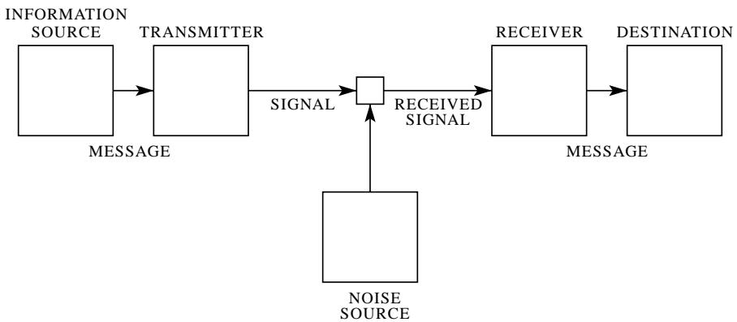

图 1—通用通信系统示意图。

一个十进制数字大约是 $3\frac{1}{3}$ 比特。台式计算机上的数字轮有十个稳定位置，因此具有一个十进制数字的存储容量。在涉及积分和微分的分析工作中，有时使用以 $e$ 为底的数很方便。所得的信息单位将称为自然单位。从以 $a$ 为底转换为以 $b$ 为底只需要乘以 $\log_b a$。

我们所说的通信系统是指图1中示意性指示的那种类型的系统。它基本上由五个部分组成：

1.  **信息源**：产生要传送到接收终端的消息或消息序列。消息可能有各种类型：(a) 一系列字母，如电报或电传打字系统；(b) 时间的单个函数 $f(t)$，如无线电或电话；(c) 时间和其他变量的函数，如黑白电视——这里消息可以被认为是两个空间坐标和时间的函数 $f(x,y,t)$，即拾像管板上点 $(x,y)$ 在时间 $t$ 的光强度；(d) 两个或更多的时间函数，例如 $f(t), g(t), h(t)$——这是"三维"声音传输的情况，或者如果系统旨在服务于多路复用中的几个单独信道；(e) 几个多变量函数——在彩色电视中，消息由在三维连续统中定义的三个函数 $f(x,y,t), g(x,y,t), h(x,y,t)$ 组成——我们也可以将这三个函数视为在该区域定义的矢量场的分量——类似地，几个黑白电视源会产生由多个三变量函数组成的"消息"；(f) 各种组合也会出现，例如在带有相关音频信道的电视中。

2.  **发射机**：以某种方式对消息进行操作，以产生适合在信道上传输的信号。在电话中，此操作仅仅是将声压转换为成比例的电电流。在电报中，我们有一个编码操作，它在信道上产生与消息相对应的点、划和空格的序列。在多路复用PCM系统中，不同的语音函数必须被采样、压缩、量化和编码，最后正确交错以构建信号。声码器系统、电视和调频是应用于消息以获得信号的其他复杂操作的例子。

3.  **信道**：仅仅是用于将信号从发射机传输到接收机的媒介。它可能是一对电线、同轴电缆、一段无线电频率、一束光等。

4.  **接收机**：通常执行与发射机所做操作相反的操作，从信号中重建消息。

5.  **目的地**：消息所要发送给的人（或物）。

我们希望考虑涉及通信系统的某些一般性问题。为此，首先需要将所涉及的各种元素表示为数学实体，从它们的物理对应物中适当地理想化。我们可以将通信系统大致分为三大类：离散的、连续的和混合的。离散系统是指消息和信号都是离散符号序列的系统。一个典型的例子是电报，其中消息是一系列字母，信号是一系列点、划和空格。连续系统是指消息和信号都被视为连续函数的系统，例如无线电或电视。混合系统是指同时出现离散和连续变量的系统，例如语音的PCM传输。

我们首先考虑离散情况。这种情况不仅在通信理论中有应用，而且在计算机器理论、电话交换设计和其他领域也有应用。此外，离散情况为将在本文后半部分处理的连续和混合情况奠定了基础。

# 第一部分：离散无噪声系统

# 1. 离散无噪声信道

电传打字机和电报是用于传输信息的离散信道的两个简单例子。通常，离散信道意味着这样一个系统：通过它，从有限基本符号集合 $S_{1}, \ldots, S_{n}$ 中选择的序列可以从一点传输到另一点。假设每个符号 $S_{i}$ 具有一定的持续时间 $t_{i}$ 秒（对于不同的 $S_{i}$ 不一定相同，例如电报中的点和划）。并不要求系统能够传输所有可能的 $S_{i}$ 序列；可能只允许某些序列。这些将是信道的可能信号。因此在电报中，假设符号是：(1) 一个点，由线路闭合一个单位时间然后线路开放一个单位时间组成；(2) 一个划，由三个时间单位的闭合和一个单位的开放组成；(3) 一个字母间隔，例如由三个单位的线路开放组成；(4) 一个单词间隔，由六个单位的线路开放组成。我们可能对允许的序列施加限制，即不允许空格彼此跟随（因为如果两个字母间隔相邻，则等同于一个单词间隔）。我们现在考虑的问题是如何度量这种信道传输信息的能力。

在电传打字机的情况下，所有符号持续时间相同，并且允许32个符号的任何序列，答案很容易。每个符号代表5比特信息。如果系统每秒传输 $n$ 个符号，自然可以说信道具有每秒 $5n$ 比特的容量。这并不意味着电传打字机信道将始终以此速率传输信息——这是最大可能速率，实际速率是否达到此最大值取决于馈送信道的信息源，这将在后面看到。

在符号长度不同且对允许序列有约束的更一般情况下，我们做出以下定义：

**定义**：离散信道的容量 $C$ 由下式给出

$$
C = \operatorname * {L i m} _ {T \to \infty} \frac {\log N (T)}{T}
$$

其中 $N(T)$ 是持续时间为 $T$ 的允许信号的数量。

很容易看出，在电传打字机情况下，这简化为之前的结果。可以证明，在所关注的大多数情况下，所讨论的极限将作为有限数存在。假设符号 $S_{1}, \ldots, S_{n}$ 的所有序列都被允许，并且这些符号具有持续时间 $t_{1}, \ldots, t_{n}$。信道容量是多少？如果 $N(t)$ 表示持续时间为 $t$ 的序列数，我们有

$$
N (t) = N \left(t - t _ {1}\right) + N \left(t - t _ {2}\right) + \dots + N \left(t - t _ {n}\right).
$$

总数等于以 $S_{1}, S_{2}, \ldots, S_{n}$ 结尾的序列数之和，这些分别是 $N(t - t_{1}), N(t - t_{2}), \ldots, N(t - t_{n})$。根据有限差分中的一个著名结果，对于大的 $t$，$N(t)$ 渐近于 $X_{0}^{t}$，其中 $X_{0}$ 是特征方程的最大实根：

$$
X ^ {- t _ {1}} + X ^ {- t _ {2}} + \dots + X ^ {- t _ {n}} = 1
$$

因此

$$
C = \log X _ {0}.
$$

如果对允许序列有限制，我们仍然可以经常得到这种类型的差分方程，并从特征方程中找到 $C$。在上面提到的电报情况下

$$
N (t) = N (t - 2) + N (t - 4) + N (t - 5) + N (t - 7) + N (t - 8) + N (t - 1 0)
$$

这是通过根据最后或倒数第二个出现的符号对符号序列进行计数而得出的。因此 $C$ 是 $-\log \mu_0$，其中 $\mu_0$ 是 $1 = \mu^2 + \mu^4 + \mu^5 + \mu^7 + \mu^8 + \mu^{10}$ 的正根。解此方程我们得到 $C = 0.539$。

可以对允许序列施加的一种非常通用的限制类型如下：我们想象许多可能的状态 $a_1, a_2, \ldots, a_m$。对于每个状态，只能传输集合 $S_1, \ldots, S_n$ 中的某些符号（不同状态对应不同的子集）。当这些符号中的一个被传输后，状态会根据旧状态和传输的特定符号改变为新状态。电报情况就是此情况的一个简单例子。有两种状态，取决于上一个传输的符号是否是空格。如果是，则下一个只能发送点或划，并且状态总是改变。如果不是，则可以传输任何符号，如果发送了空格则状态改变，否则保持不变。条件可以用线性图表示，如图2所示。连接点对应于

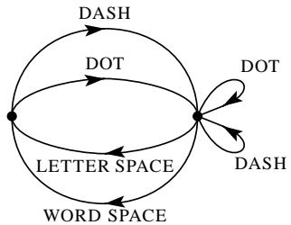

图 2—电报符号约束的图形表示。

状态，线指示在状态下可能的符号以及结果状态。在附录1中证明，如果允许序列的条件可以用这种形式描述，则 $C$ 将存在，并且可以根据以下结果计算：

**定理1**：令 $b_{ij}^{(s)}$ 是在状态 $i$ 中允许并导致状态 $j$ 的第 $s^{\text{th}}$ 个符号的持续时间。则信道容量 $C$ 等于 $\log W$，其中 $W$ 是行列式方程的最大实根：

$$
\left| \sum_ {s} W ^ {- b _ {i j} ^ {(s)}} - \delta_ {i j} \right| = 0
$$

其中 $\delta_{ij} = 1$ 如果 $i = j$，否则为零。

例如，在电报情况下（图2），行列式是：

$$
\left| \begin{array}{c c} - 1 & (W ^ {- 2} + W ^ {- 4}) \\ (W ^ {- 3} + W ^ {- 6}) & (W ^ {- 2} + W ^ {- 4} - 1) \end{array} \right| = 0.
$$

展开后得到上述此情况下的方程。

# 2. 离散信息源

我们已经看到，在非常一般的条件下，离散信道中可能信号的对数随时间线性增加。传输信息的能力可以通过给出这个增加率来指定，即指定所用特定信号所需的每秒比特数。

现在我们来考虑信息源。如何从数学上描述一个信息源，以及在给定源中每秒产生多少比特信息？争论的主要点是关于源的统计知识在通过适当编码信息来减少所需信道容量方面的效果。例如，在电报中，要传输的消息由字母序列组成。然而，这些序列并不完全随机。通常，它们构成句子并具有某种语言的统计结构，比如英语。字母E比Q出现得更频繁，序列TH比XP出现得更频繁，等等。这种结构的存在允许人们通过正确地将消息序列编码为信号序列来节省时间（或信道容量）。这在电报中已经有限地实现了，使用最短的信道符号——一个点——来表示最常见的英文字母E；而不常见的字母Q、X、Z由更长的点和划序列表示。在某些商业代码中，这个想法更进一步，其中常用单词和短语由四个或五个字母的代码组表示，从而在平均时间上节省了大量时间。现在使用的标准化问候和周年纪念电报将这一点扩展到将一两个句子编码为相对较短的数字序列。

我们可以将离散源视为逐个符号地生成消息。它将根据某些概率选择连续的符号，这些概率通常取决于先前的选择以及所讨论的特定符号。一个物理系统，或产生由一组概率控制的这种符号序列的系统的数学模型，被称为随机过程。3 因此，我们可以将离散源视为由随机过程表示。相反，任何产生从有限集合中选择的离散符号序列的随机过程都可以被视为离散源。这将包括诸如以下的情况：

1.  自然书面语言，如英语、德语、中文。
2.  已通过某些量化过程变为离散的连续信息源。例如，来自PCM发射机的量化语音，或量化电视信号。
3.  数学情况，我们仅抽象地定义一个生成符号序列的随机过程。以下是最后一种源类型的例子。

(A) 假设我们有五个字母A, B, C, D, E，每个被选择的概率为0.2，连续选择是独立的。这将导致一个序列，以下是典型示例。

BDC BCECCCADCBDDAAECEEA

ABBDAEECAEEBAECBCEAD.

这是使用随机数表构建的。4

(B) 使用相同的五个字母，设概率分别为 .4, .1, .2, .2, .1，连续选择独立。则来自此源的典型消息是：

AAACDCBDCEAADADACEDA

EADCABEDADDCECAAAAAD.

(C) 如果连续符号不是独立选择的，而是它们的概率取决于前面的字母，则会得到更复杂的结构。在这种类型的最简单情况下，选择仅取决于前一个字母，而不取决于更早的字母。则统计结构可以由一组转移概率 $p_i(j)$ 描述，即字母 $i$ 后面跟着字母 $j$ 的概率。索引 $i$ 和 $j$ 覆盖所有可能的符号。指定结构的第二种等效方法是给出"双字母"概率 $p(i, j)$，即双字母 $i$ $j$ 的相对频率。字母频率 $p(i)$（字母 $i$ 的概率）、转移概率

3参见，例如，S. Chandrasekhar, "Stochastic Problems in Physics and Astronomy," Reviews of Modern Physics, v. 15, No. 1, January 1943, p. 1.

$^{4}$ Kendall and Smith, Tables of Random Sampling Numbers, Cambridge, 1939.

$p_i(j)$ 和双字母概率 $p(i,j)$ 由以下公式关联：

$$
p (i) = \sum_ {j} p (i, j) = \sum_ {j} p (j, i) = \sum_ {j} p (j) p _ {j} (i)
$$

$$
p (i, j) = p (i) p _ {i} (j)
$$

$$
\sum_ {j} p _ {i} (j) = \sum_ {i} p (i) = \sum_ {i, j} p (i, j) = 1.
$$

作为一个具体例子，假设有三个字母A, B, C，概率表如下：

<table><tr><td colspan="2">pi(j)</td><td colspan="2">j</td></tr><tr><td></td><td>A</td><td>B</td><td>C</td></tr><tr><td>A</td><td>0</td><td>4/5</td><td>1/5</td></tr><tr><td>i</td><td>B</td><td>1/2</td><td>1/2</td></tr><tr><td>C</td><td>1/2</td><td>2/5</td><td>1/10</td></tr></table>

<table><tr><td>i</td><td>p(i)</td></tr><tr><td>A</td><td>9/27</td></tr><tr><td>B</td><td>16/27</td></tr><tr><td>C</td><td>2/27</td></tr></table>

<table><tr><td>p(i,j)</td><td colspan="3">j</td></tr><tr><td></td><td>A</td><td>B</td><td>C</td></tr><tr><td>A</td><td>0</td><td>4/15</td><td>1/15</td></tr><tr><td>i B</td><td>8/27</td><td>8/27</td><td>0</td></tr><tr><td>C</td><td>1/27</td><td>4/135</td><td>1/135</td></tr></table>

来自此源的典型消息如下：

ABBABABABABABABBABBBBBABABABABABBACACBABABBABBABABACBBBABA.

复杂性的下一次增加将涉及三字母频率，但仅此而已。字母的选择将取决于前两个字母，但不取决于该点之前的消息。将需要一组三字母频率 $p(i,j,k)$ 或等效的一组转移概率 $p_{ij}(k)$。以这种方式继续，人们会相继获得更复杂的随机过程。在一般的 $n$ 字母情况下，需要一组 $n$ 字母概率 $p(i_1,i_2,\ldots ,i_n)$ 或转移概率 $p_{i_1,i_2,\dots ,i_{n - 1}}(i_n)$ 来指定统计结构。

(D) 也可以定义产生由一系列"单词"组成的文本的随机过程。假设有五个字母A, B, C, D, E，语言中有16个"单词"，其相关概率如下：

<table><tr><td>.10 A</td><td>.16 BEBE</td><td>.11 CABED</td><td>.04 DEB</td></tr><tr><td>.04 ADEB</td><td>.04 BED</td><td>.05 CEED</td><td>.15 DEED</td></tr><tr><td>.05 ADEE</td><td>.02 BEED</td><td>.08 DAB</td><td>.01 EAB</td></tr><tr><td>.01 BADD</td><td>.05 CA</td><td>.04 DAD</td><td>.05 EE</td></tr></table>

假设连续的"单词"是独立选择的，并由空格分隔。典型的消息可能是：

DAB EE A BEBE DEED DEB ADEE ADEE EE DEB BEBE BEBE BEBE ADEE BED DEED DEED CEED ADEE A DEED DEED BEBE CABED BEBE BED DAB DEED ADEB.

如果所有单词的长度都是有限的，这个过程等价于前面的一种类型，但用单词结构和概率描述可能更简单。我们也可以在这里进行推广，引入单词之间的转移概率，等等。

这些人造语言在构造简单问题和示例以说明各种可能性时很有用。我们也可以通过一系列简单的人造语言来近似自然语言。零阶近似是通过以相同概率且独立地选择所有字母获得的。一阶近似是通过独立选择连续字母获得的，但每个字母具有与自然语言中相同的概率。5 因此，在英语的一阶近似中，E以概率0.12（其在正常英语中的频率）被选择，W以概率0.02被选择，但相邻字母之间没有影响，也没有形成优选的双字母如TH、ED等的趋势。在二阶近似中，引入了双字母结构。选择一个字母后，下一个字母根据各个字母跟随第一个字母的频率来选择。这需要一个双字母频率表 $p_i(j)$。在三阶近似中，引入了三字母结构。每个字母以取决于前两个字母的概率被选择。

# 3. 英语的近似序列

为了直观展示这一系列过程如何逼近一种语言，已经构建了英语近似中的典型序列，并在下面给出。在所有情况下，我们假设有一个27符号的"字母表"，即26个字母和一个空格。

1.  **零阶近似**（符号独立且等概率）。

    XFOML RXKHRJFFUJ ZLPWCFWKCYJ FFJEYVKQSGHYD QPAAMKBZAACIBZL-HJQD.

2.  **一阶近似**（符号独立但具有英语文本的频率）。

    OCRO HLI RGWR NMIELWIS EU LL NBNESEBYA TH EEI ALHENHTTPA OOBTTVA NAH BRL.

3.  **二阶近似**（双字母结构如英语）。

    ON IE ANTSOUTINYS ARE T INCTORE ST BE S DEAMY ACHIN D ILONASIVE TUCOOWE AT TEASONARE FUSO TIZIN ANDY TOBE SEACE CTISBE.

4.  **三阶近似**（三字母结构如英语）。

    IN NO IST LAT WHEY CRATICT FROURE BIRS GROCID PONDENOME OF DEMONSTURES OF THE REPTAGIN IS REGOACTIONA OF CRE.

5.  **一阶单词近似**。与其继续使用四字母、……、$n$字母结构，不如在此时跳到单词单位更容易且更好。这里单词是独立选择的，但具有其适当的频率。

    REPRESENTING AND SPEEDILY IS AN GOOD APT OR COME CAN DIFFERENT NATURAL HERE HE THE A IN CAME THE TO OF TO EXPERT GRAY COME TO FURNISHES THE LINEMESSAGE HAD BE THESE.

6.  **二阶单词近似**。单词转移概率是正确的，但不包含进一步的结构。

    THE HEAD AND IN FRONTAL ATTACK ON AN ENGLISH WRITER THAT THE CHARACTER OF THIS POINT IS THEREFORE ANOTHER METHOD FOR THE LETTERS THAT THE TIME OF WHO EVER TOLD THE PROBLEM FOR AN UNEXPECTED.

在上述每一步中，与普通英语文本的相似性都显著增加。注意，这些样本在超出其构建时考虑范围约两倍的范围内具有相当好的结构。因此，在(3)中，统计过程确保了双字母序列的合理文本，但样本中的四字母序列通常可以很好地融入句子中。在(6)中，四个或更多单词的序列可以轻松地放入句子中，而无需不寻常或牵强的结构。特定的十个单词序列"attack on an English writer that the character of this"一点也不显得不合理。因此，一个足够复杂的随机过程将给出离散源的满意表示。

前两个样本是通过使用随机数书并结合（例如对于示例2）字母频率表构建的。对于(3)、(4)和(5)，本可以继续使用这种方法，因为双字母、三字母和单词频率表是可用的，但使用了一种更简单的等效方法。

例如，为了构建(3)，随机打开一本书，并在页面上随机选择一个字母。记录该字母。然后将书翻到另一页，并阅读直到遇到这个字母。记录紧随其后的字母。再翻到另一页，搜索这第二个字母并记录紧随其后的字母，等等。对于(4)、(5)和(6)使用了类似的过程。如果能够构建进一步的近似，那将是有趣的，但在下一阶段，工作量变得巨大。

# 4. 马尔可夫过程的图形表示

上述类型的随机过程在数学上被称为离散马尔可夫过程，并已在文献中被广泛研究。一般情况可以描述如下：系统存在有限数量的可能"状态"；$S_{1}, S_{2}, \ldots, S_{n}$。此外还有一组转移概率；$p_{i}(j)$ 是系统处于状态 $S_{i}$ 时下一步将进入状态 $S_{j}$ 的概率。为了使这个马尔可夫过程成为信息源，我们只需要假设每次状态转移产生一个字母。状态将对应于来自前面字母的"影响残留"。

这种情况可以图形表示，如图3、4和5所示。"状态"是图中的连接点，对应过渡的概率和产生的字母标注在相应的线旁边。图3对应第2节中的示例B，而图4对应示例C。在图3中，

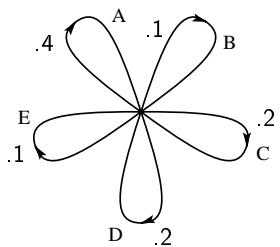

图 3—对应示例B中源的图。

由于连续字母是独立的，所以只有一个状态。在图4中，状态的数目与字母数目相同。如果构造一个三字母示例，最多将有 $n^2$ 个状态，对应于所选字母之前可能出现的字母对。图5是示例D中单词结构情况的图。这里S对应于"空格"符号。

# 5. 遍历源和混合源

如上所述，离散源可以视为由马尔可夫过程表示。在可能的离散马尔可夫过程中，有一组具有通信理论中重要特性的特殊过程。这个特殊类别包括"遍历"过程，我们称相应的源为遍历源。尽管遍历过程的严格定义有些复杂，但基本思想很简单。在遍历过程中，过程产生的每个序列在统计属性上都是相同的。因此，从特定序列获得的字母频率、双字母频率等，随着序列长度的增加，将接近确定的极限，而与特定序列无关。实际上，并非每个序列都是如此，但使其不成立的集合的概率为零。粗略地说，遍历属性意味着统计均匀性。

上面给出的所有人造语言的例子都是遍历的。这个属性与相应图的结构有关。如果图具有以下两个属性7，则相应的过程将是遍历的：

1.  图不包含两个孤立部分A和B，使得不可能沿图中箭头的方向从A部分中的连接点走到B部分中的连接点，并且也不可能从B部分中的连接点走到A部分中的连接点。
2.  图中一系列闭合的线，所有线上的箭头指向相同的方向，将被称为"回路"。回路的"长度"是其中线的数量。因此，在图5中，系列BEBES是一个长度为5的回路。所需的第二个属性是图中所有回路长度的最大公约数为一。

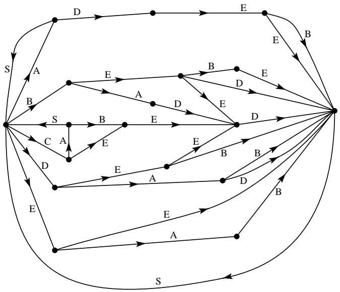

图 5—对应示例D中源的图。

如果满足第一个条件，但第二个条件被违反，最大公约数等于 $d > 1$，则序列具有某种类型的周期性结构。各种序列落入 $d$ 个不同的类别，这些类别在统计上是相同的，除了原点的偏移（即序列中的哪个字母被称为字母1）。通过从0到 $d - 1$ 的偏移，任何序列都可以在统计上等价于任何其他序列。一个 $d = 2$ 的简单例子如下：有三个可能的字母 $a, b, c$。字母 $a$ 后面跟着 $b$ 或 $c$，概率分别为 $\frac{1}{3}$ 和 $\frac{2}{3}$。$b$ 或 $c$ 后面总是跟着字母 $a$。因此典型的序列是

$$
a b a c a c a c a b a c a b a b a c a c.
$$

这种情况对我们的工作不太重要。

如果第一个条件被违反，图可以被分离成一组子图，每个子图满足第一个条件。我们假设每个子图也满足第二个条件。在这种情况下，我们有一种所谓的"混合"源，由许多纯分量组成。分量对应于各个子图。如果 $L_{1}, L_{2}, L_{3}, \ldots$ 是分量源，我们可以写成

$$
L = p _ {1} L _ {1} + p _ {2} L _ {2} + p _ {3} L _ {3} + \dots
$$

其中 $p_i$ 是分量源 $L_i$ 的概率。

物理上代表的情况是：有几个不同的源 $L_{1}, L_{2}, L_{3}, \ldots$，每个都具有均匀的统计结构（即它们是遍历的）。我们事先不知道将使用哪一个，但一旦序列在给定的纯分量 $L_{i}$ 中开始，它就会根据该分量的统计结构无限期地继续下去。

例如，可以取上面定义的两个过程，并假设 $p_1 = .2$ 和 $p_2 = .8$。来自混合源

$$
L =. 2 L _ {1} +. 8 L _ {2}
$$

的序列将通过首先以概率 .2 和 .8 选择 $L_{1}$ 或 $L_{2}$，然后从选择的那个生成序列来获得。

除非另有说明，我们将假设源是遍历的。这个假设使得我们可以将序列上的平均值与可能序列的集合上的平均值等同起来（存在差异的概率为零）。例如，特定无限序列中字母A的相对频率将（以概率一）等于其在序列集合中的相对频率。

如果 $P_{i}$ 是状态 $i$ 的概率，$p_{i}(j)$ 是转移到状态 $j$ 的概率，那么为了使过程是平稳的，显然 $P_{i}$ 必须满足平衡条件：

$$
P _ {j} = \sum_ {i} P _ {i} p _ {i} (j).
$$

在遍历情况下，可以证明，对于任何起始条件，经过 $N$ 个符号后处于状态 $j$ 的概率 $P_{j}(N)$，当 $N \to \infty$ 时接近平衡值。

# 6. 选择、不确定性和熵

我们已经将离散信息源表示为马尔可夫过程。我们能否定义一个量，在某种意义上度量这种过程"产生"了多少信息，或者更好地说，信息产生的速率是多少？

假设我们有一组可能的事件，其发生概率为 $p_1, p_2, \ldots, p_n$。这些概率是已知的，但关于哪个事件会发生，我们只知道这些。我们能否找到一种度量，来衡量在选择事件时涉及多少"选择"，或者我们对结果有多不确定？

如果有这样的度量，比如 $H(p_1, p_2, \ldots, p_n)$，那么合理的要求它具有以下性质：

1.  $H$ 应该是 $p_i$ 的连续函数。
2.  如果所有 $p_i$ 都相等，$p_i = \frac{1}{n}$，那么 $H$ 应该是 $n$ 的单调递增函数。在事件等可能的情况下，当有更多可能事件时，有更多的选择或不确定性。
3.  如果一个选择被分解为两个连续的选择，则原始的 $H$ 应该是各个 $H$ 值的加权和。其含义如图6所示。在左边，我们有三个

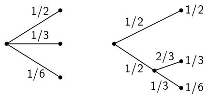

图 6—从三种可能性中分解一个选择。

可能性 $p_1 = \frac{1}{2}$，$p_2 = \frac{1}{3}$，$p_3 = \frac{1}{6}$。在右边，我们首先在两个可能性之间选择，每个概率为 $\frac{1}{2}$，如果第二个发生，则进行另一个选择，概率为 $\frac{2}{3}$，$\frac{1}{3}$。最终结果具有与之前相同的概率。我们要求，在这种特殊情况下，

$$
H (\frac {1}{2}, \frac {1}{3}, \frac {1}{6}) = H (\frac {1}{2}, \frac {1}{2}) + \frac {1}{2} H (\frac {2}{3}, \frac {1}{3}).
$$

系数 $\frac{1}{2}$ 是因为这个第二选择只发生在一半的时间。

在附录2中，确立了以下结果：

**定理2**：唯一满足上述三个假设的 $H$ 具有以下形式：

$$
H = - K \sum_ {i = 1} ^ {n} p _ {i} \log p _ {i}
$$

其中 $K$ 是正常数。

这个定理及其证明所需的假设，对于当前理论来说绝不是必要的。给出它主要是为了给我们后面的一些定义增加一定的合理性。然而，这些定义的真正理由将在于它们的含义。

形式为 $H = -\sum p_{i}\log p_{i}$ 的量（常数 $K$ 仅仅是度量单位的选择）在信息论中作为信息、选择和不确定性的度量起着核心作用。$H$ 的形式将被识别为某些统计力学公式中定义的熵8，其中 $p_{i}$ 是系统处于其相空间中单元格 $i$ 的概率。$H$ 就是例如玻尔兹曼著名的 $H$ 定理中的 $H$。我们将称 $H = -\sum p_{i}\log p_{i}$ 为概率集 $p_{1},\ldots ,p_{n}$ 的熵。如果 $x$ 是一个随机变量，我们将写 $H(x)$ 表示它的熵；因此 $x$ 不是函数的自变量，而是数字的标签，以区别于 $H(y)$，比如随机变量 $y$ 的熵。

在两种可能性且概率分别为 $p$ 和 $q = 1 - p$ 的情况下，熵

$$
H = - (p \log p + q \log q)
$$

作为 $p$ 的函数绘制在图7中。

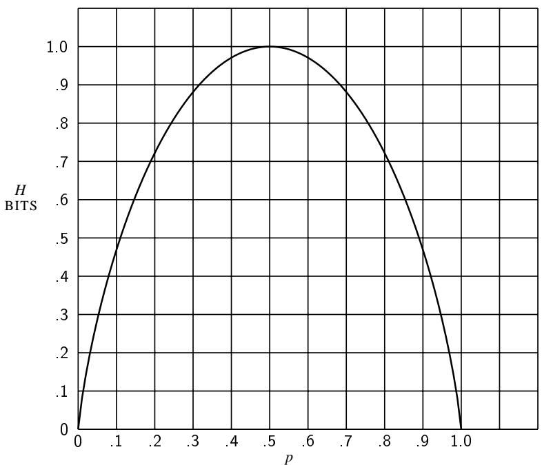

图 7—两种可能性且概率为 $p$ 和 $(1 - p)$ 情况下的熵。

量 $H$ 具有许多有趣的特性，进一步证实了它作为选择或信息的合理度量。

1.  $H = 0$ 当且仅当除一个 $p_i$ 外所有 $p_i$ 都为零，而那个 $p_i$ 值为一。因此，只有当我们对结果确定时，$H$ 才消失。否则 $H$ 为正。
2.  对于给定的 $n$，当所有 $p_i$ 相等时（即 $\frac{1}{n}$），$H$ 达到最大值且等于 $\log n$。这也是直观上最不确定的情况。
3.  假设有两个事件 $x$ 和 $y$，第一个有 $m$ 种可能性，第二个有 $n$ 种可能性。令 $p(i,j)$ 是第一个为 $i$ 且第二个为 $j$ 的联合发生概率。联合事件的熵是

$$
H (x, y) = - \sum_ {i, j} p (i, j) \log p (i, j)
$$

而

$$
H (x) = - \sum_ {i, j} p (i, j) \log \sum_ {j} p (i, j)
$$

$$
H (y) = - \sum_ {i, j} p (i, j) \log \sum_ {i} p (i, j).
$$

很容易证明

$$
H (x, y) \leq H (x) + H (y)
$$

等式仅当事件独立时成立（即 $p(i,j) = p(i)p(j)$）。联合事件的不确定性小于或等于各个不确定性的和。
4.  任何使概率 $p_1, p_2, \ldots, p_n$ 均等化的变化都会增加 $H$。因此，如果 $p_1 < p_2$，我们增加 $p_1$，等量减少 $p_2$，使得 $p_1$ 和 $p_2$ 更接近相等，则 $H$ 增加。更一般地，如果我们在 $p_i$ 上执行任何"平均"操作，形式为

$$
p _ {i} ^ {\prime} = \sum_ {j} a _ {i j} p _ {j}
$$

其中 $\sum_{i}a_{ij} = \sum_{j}a_{ij} = 1$，且所有 $a_{ij}\geq 0$，则 $H$ 增加（除了这种变换仅相当于 $p_j$ 的排列的特殊情况，此时 $H$ 当然保持不变）。
5.  假设有两个随机事件 $x$ 和 $y$，如3中所述，不一定独立。对于 $x$ 可以取到的任何特定值 $i$，存在条件概率 $p_i(j)$ 表示 $y$ 具有值 $j$。这由下式给出

$$
p _ {i} (j) = \frac {p (i , j)}{\sum_ {j} p (i , j)}.
$$

我们将 $y$ 的条件熵 $H_{x}(y)$ 定义为对于 $x$ 的每个值，$y$ 的熵的平均值，根据获得该特定 $x$ 的概率加权。即

$$
H _ {x} (y) = - \sum_ {i, j} p (i, j) \log p _ {i} (j).
$$

这个量度量当我们知道 $x$ 时，平均而言我们对 $y$ 有多不确定。代入 $p_i(j)$ 的值，我们得到

$$
\begin{array}{l} H _ {x} (y) = - \sum_ {i, j} p (i, j) \log p (i, j) + \sum_ {i, j} p (i, j) \log \sum_ {j} p (i, j) \\ = H (x, y) - H (x) \\ \end{array}
$$

或

$$
H (x, y) = H (x) + H _ {x} (y).
$$

联合事件 $x, y$ 的不确定性（或熵）是 $x$ 的不确定性加上已知 $x$ 时 $y$ 的不确定性。
6.  由3和5我们有

$$
H (x) + H (y) \geq H (x, y) = H (x) + H _ {x} (y).
$$

因此

$$
H (y) \geq H _ {x} (y).
$$

对 $y$ 的不确定性在知道 $x$ 后永远不会增加。除非 $x$ 和 $y$ 是独立事件，否则它会减少，在这种情况下它不会改变。

# 7. 信息源的熵

考虑上面考虑的有限状态类型的离散源。对于每个可能的状态 $i$，将有一组概率 $p_i(j)$ 用于产生各种可能的符号 $j$。因此每个状态有一个熵 $H_{i}$。源的熵将定义为这些 $H_{i}$ 的加权平均值，权重根据所述状态的发生概率确定：

$$
\begin{array}{l} H = \sum_ {i} P _ {i} H _ {i} \\ = - \sum_ {i, j} P _ {i} p _ {i} (j) \log p _ {i} (j). \\ \end{array}
$$

这是源每文本符号的熵。如果马尔可夫过程以确定的时间速率进行，还有一个每秒的熵

$$
H ^ {\prime} = \sum_ {i} f _ {i} H _ {i}
$$

其中 $f_{i}$ 是状态 $i$ 的平均频率（每秒发生次数）。显然

$$
H ^ {\prime} = m H
$$

其中 $m$ 是每秒产生的平均符号数。$H$ 或 $H'$ 度量源每符号或每秒产生的信息量。如果对数的底是2，它们将表示每符号或每秒的比特数。

如果连续符号是独立的，那么 $H$ 简单地就是 $-\sum p_i \log p_i$，其中 $p_i$ 是符号 $i$ 的概率。假设在这种情况下，我们考虑一个长度为 $N$ 的长消息。它将大概率包含大约 $p_1N$ 次第一个符号的出现，$p_2N$ 次第二个符号的出现，等等。因此，这个特定消息的概率大致为

$$
p = p _ {1} ^ {p _ {1} N} p _ {2} ^ {p _ {2} N} \dots p _ {n} ^ {p _ {n} N}
$$

或

$$
\log p \doteq N \sum_ {i} p _ {i} \log p _ {i}
$$

$$
\log p \dot {=} - N H
$$

$$
H \doteq \frac {\log 1 / p}{N}.
$$

因此，$H$ 大致是一个典型长序列的概率倒数的对数除以序列中的符号数。同样的结果适用于任何源。更精确地陈述，我们有（参见附录3）：

**定理3**：给定任意 $\epsilon >0$ 和 $\delta >0$，我们可以找到一个 $N_0$，使得任何长度 $N\geq N_0$ 的序列分为两类：

1.  一个集合，其总概率小于 $\epsilon$。
2.  其余部分，其所有成员的概率满足不等式

$$
\left| \frac {\log p ^ {- 1}}{N} - H \right| <   \delta .
$$

换句话说，当 $N$ 很大时，我们几乎肯定 $\frac{\log p^{-1}}{N}$ 非常接近 $H$。

一个密切相关的结果处理各种概率的序列数量。再次考虑长度为 $N$ 的序列，并按概率递减顺序排列它们。我们定义 $n(q)$ 为必须从该集合中取的数量（从最可能的一个开始），以便为所取的序列累积总概率 $q$。

**定理4**：

$$
\lim  _ {N \rightarrow \infty} \frac {\log n (q)}{N} = H
$$

当 $q$ 不等于0或1时。

我们可以将 $\log n(q)$ 解释为当我们只考虑总概率为 $q$ 的最可能序列时，指定序列所需的比特数。那么 $\frac{\log n(q)}{N}$ 是指定每个符号的比特数。该定理说，对于大的 $N$，这将与 $q$ 无关且等于 $H$。合理可能序列的对数的增长率由 $H$ 给出，无论我们如何解释"合理可能"。由于这些结果（在附录3中证明），在大多数情况下，可以将长序列视为只有 $2^{HN}$ 个，每个概率为 $2^{-HN}$。

接下来的两个定理表明，$H$ 和 $H'$ 可以直接通过从消息序列的统计量进行极限操作来确定，而无需参考状态和状态之间的转移概率。

**定理5**：令 $p(B_i)$ 为源符号序列 $B_i$ 的概率。令

$$
G _ {N} = - \frac {1}{N} \sum_ {i} p (B _ {i}) \log p (B _ {i})
$$

其中求和覆盖所有包含 $N$ 个符号的序列 $B_{i}$。则 $G_{N}$ 是 $N$ 的单调递减函数，且

$$
\lim  _ {N \to \infty} G _ {N} = H.
$$

**定理6**：令 $p(B_i, S_j)$ 为序列 $B_i$ 后跟符号 $S_j$ 的概率，且 $p_{B_i}(S_j) = p(B_i, S_j) / p(B_i)$ 为 $B_i$ 后 $S_j$ 的条件概率。令

$$
F _ {N} = - \sum_ {i, j} p (B _ {i}, S _ {j}) \log p _ {B _ {i}} (S _ {j})
$$

其中求和覆盖所有 $N - 1$ 个符号的块 $B_{i}$ 和所有符号 $S_{j}$。则 $F_{N}$ 是 $N$ 的单调递减函数，

$$
F _ {N} = N G _ {N} - (N - 1) G _ {N - 1},
$$

$$
G _ {N} = \frac {1}{N} \sum_ {n = 1} ^ {N} F _ {n},
$$

$$
F _ {N} \leq G _ {N},
$$

且 $\begin{array}{r}\lim_{N\to \infty}F_N = H. \end{array}$

这些结果在附录3中导出。它们表明，通过仅考虑扩展到 $1,2,\ldots ,N$ 个符号的序列的统计结构，可以获得一系列 $H$ 的近似值。$F_{N}$ 是更好的近似。实际上，$F_{N}$ 是上面讨论的那种类型的源的第 $N^{\mathrm{th}}$ 阶近似的熵。如果没有统计影响扩展到超过 $N$ 个符号，即如果知道前 $(N - 1)$ 个符号时下一个符号的条件概率不会因知道更早的符号而改变，则 $F_{N} = H$。$F_{N}$ 当然是当知道前 $(N - 1)$ 个符号时下一个符号的条件熵，而 $G_{N}$ 是 $N$ 个符号块的平均每符号熵。

源的熵与其在受限于相同符号时可能具有的最大值之比将称为其相对熵。这是当编码到相同字母表时可能的最大压缩。一减去相对熵即为冗余度。普通英语的冗余度（不考虑超过大约八个字母的统计结构）大约为 $50\%$。这意味着当我们写英语时，我们所写的一半是由语言结构决定的，另一半是自由选择的。$50\%$ 这个数字是通过几种独立的方法得到的，这些方法都给出了这个范围内的结果。一种是通过计算英语近似的熵。第二种方法是从英语文本样本中删除一定比例的字母，然后让某人尝试恢复它们。如果当 $50\%$ 被删除时可以恢复，则冗余度必须大于 $50\%$。第三种方法依赖于密码学中某些已知的结果。

英语散文中冗余度的两个极端例子是基础英语和詹姆斯·乔伊斯的《芬尼根的守灵夜》。基础英语的词汇量限制在850个单词，冗余度非常高。这反映在将一段文字翻译成基础英语时发生的扩展中。另一方面，乔伊斯扩大了词汇量，据称实现了语义内容的压缩。

语言的冗余度与纵横字谜的存在有关。如果冗余度为零，则任何字母序列都是该语言的合理文本，任何二维字母数组都构成一个纵横字谜。如果冗余度太高，语言施加的约束太多，以至于无法形成大型纵横字谜。更详细的分析表明，如果我们假设语言施加的约束是相当混乱和随机的，那么当冗余度为 $50\%$ 时，大型纵横字谜是可能的。如果冗余度为 $33\%$，则三维纵横字谜应该是可能的，等等。

# 8. 编码和解码操作的表示

我们尚未从数学上表示发射机和接收机在编码和解码信息时执行的操作。这两者中的任何一个都将被称为离散换能器。换能器的输入是输入符号序列，其输出是输出符号序列。换能器可能具有内部存储器，因此其输出不仅取决于当前的输入符号，还取决于过去的历史。我们假设内部存储器是有限的，即换能器存在有限数量 $m$ 的可能状态，并且其输出是当前状态和当前输入符号的函数。下一个状态将是这两个量的第二个函数。因此，换能器可以由两个函数描述：

$$
y _ {n} = f \left(x _ {n}, \alpha_ {n}\right)
$$

$$
\alpha_ {n + 1} = g \left(x _ {n}, \alpha_ {n}\right)
$$

其中

$x_{n}$ 是第 $n^{\mathrm{th}}$ 个输入符号，

$\alpha_{n}$ 是引入第 $n^{\mathrm{th}}$ 个输入符号时换能器的状态，

$y_{n}$ 是当 $x_{n}$ 被引入且状态为 $\alpha_{n}$ 时产生的输出符号（或输出符号序列）。

如果一个换能器的输出符号可以与第二个换能器的输入符号识别，则它们可以串联连接，结果也是一个换能器。如果存在第二个换能器，它对第一个的输出进行操作并恢复原始输入，则第一个换能器将称为非奇异的，第二个将称为其逆。

**定理7**：由有限状态统计源驱动的有限状态换能器的输出是一个有限状态统计源，其（单位时间）熵小于或等于输入的熵。如果换能器是非奇异的，则它们相等。

令 $\alpha$ 代表源的状态，它产生一系列符号 $x_{i}$；令 $\beta$ 是换能器的状态，它在输出中产生符号块 $y_{j}$。组合系统可以由"乘积状态空间" $(\alpha, \beta)$ 表示。空间 $(\alpha_{1}, \beta_{1})$ 和 $(\alpha_{2}, \beta_{2})$ 中的两个点，如果 $\alpha_{1}$ 可以产生一个将 $\beta_{1}$ 改变为 $\beta_{2}$ 的 $x$，则它们由一条线连接，并且该线被赋予在这种情况下该 $x$ 的概率。该线标有换能器产生的 $y_{j}$ 符号块。输出的熵可以计算为各个状态的加权和。如果我们首先对 $\beta$ 求和，每个结果项小于或等于 $\alpha$ 的相应项，因此熵不会增加。如果换能器是非奇异的，将其输出连接到逆换能器。如果 $H_{1}^{\prime}$、$H_{2}^{\prime}$ 和 $H_{3}^{\prime}$ 分别是源、第一个和第二个换能器的输出熵，则 $H_{1}^{\prime} \geq H_{2}^{\prime} \geq H_{3}^{\prime} = H_{1}^{\prime}$，因此 $H_{1}^{\prime} = H_{2}^{\prime}$。

假设我们有一个对可能序列类型的约束系统，如图2所示，可以用线性图表示。如果将概率 $p_{ij}^{(s)}$ 分配给连接状态 $i$ 到状态 $j$ 的各种线，这将成为一种源。有一种特定的分配可以使所得熵最大化（参见附录4）。

**定理8**：令被视为信道的约束系统具有容量 $C = \log W$。如果我们分配

$$
p _ {i j} ^ {(s)} = \frac {B _ {j}}{B _ {i}} W ^ {- \ell_ {i j} ^ {(s)}}
$$

其中 $\ell_{ij}^{(s)}$ 是从状态 $i$ 到状态 $j$ 的第 $s^{th}$ 个符号的持续时间，且 $B_{i}$ 满足

$$
B _ {i} = \sum_ {s, j} B _ {j} W ^ {- \ell_ {i j} ^ {(s)}}
$$

则 $H$ 被最大化且等于 $C$。

通过适当分配转移概率，可以将信道符号的熵最大化到信道容量。

# 9. 无噪声信道的基本定理

我们现在将通过证明 $H$ 决定了最有效编码所需的信道容量，来证明我们将 $H$ 解释为信息生成速率是合理的。

**定理9**：令源具有熵 $H$（每符号比特），信道具有容量 $C$（每秒比特）。那么可以对源的输出进行编码，使得以平均速率 $\frac{C}{H} - \epsilon$ 符号每秒在信道上传输，其中 $\epsilon$ 任意小。不可能以大于 $\frac{C}{H}$ 的平均速率传输。

定理的逆部分，即不能超过 $\frac{C}{H}$，可以通过注意到每秒信道输入的熵等于源的熵来证明，因为发射机必须是非奇异的，并且这个熵不能超过信道容量。因此 $H' \leq C$，且每秒符号数 $= H'/H \leq C/H$。

定理的第一部分将以两种不同的方式证明。第一种方法是考虑由源产生的所有 $N$ 符号序列的集合。对于大的 $N$，我们可以将这些分为两组，一组包含少于 $2^{(H + \eta)N}$ 个成员，第二组包含少于 $2^{RN}$ 个成员（其中 $R$ 是不同符号数量的对数），且总概率小于 $\mu$。随着 $N$ 增加，$\eta$ 和 $\mu$ 趋近于零。信道中持续时间为 $T$ 的信号数量大于 $2^{(C - \theta)T}$，当 $T$ 很大时 $\theta$ 很小。如果我们选择

$$
T = \left(\frac {H}{C} + \lambda\right) N
$$

那么当 $N$ 和 $T$ 足够大时（无论 $\lambda$ 多小），高概率组将有足够数量的信道符号序列，并且还有一些额外的序列。高概率组以任意的一一对应方式编码到这个集合中。剩余的序列由更长的序列表示，以未被用于高概率组的序列之一开始和结束。这个特殊序列充当不同代码的开始和停止信号。在这之间，留出足够的时间，为所有低概率消息提供足够多的不同序列。这将需要

$$
T _ {1} = \left(\frac {R}{C} + \varphi\right) N
$$

其中 $\varphi$ 很小。那么，每秒消息符号的平均传输速率将大于

$$
\left[ (1 - \delta) \frac {T}{N} + \delta \frac {T _ {1}}{N} \right] ^ {- 1} = \left[ (1 - \delta) \left(\frac {H}{C} + \lambda\right) + \delta \left(\frac {R}{C} + \varphi\right) \right] ^ {- 1}.
$$

随着 $N$ 增加，$\delta$、$\lambda$ 和 $\varphi$ 趋近于零，速率趋近于 $\frac{C}{H}$。

另一种执行此编码并由此证明该定理的方法可以描述如下：将长度为 $N$ 的消息按概率递减顺序排列，并假设它们的概率为 $p_1 \geq p_2 \geq p_3 \dots \geq p_n$。令 $P_s = \sum_{1}^{s-1} p_i$；即 $P_s$ 是直到但不包括 $p_s$ 的累积概率。我们首先编码为二进制系统。消息 $s$ 的二进制代码是通过将 $P_s$ 展开为二进制数获得的。展开进行到 $m_s$ 位，其中 $m_s$ 是满足以下条件的整数：

$$
\log_ {2} \frac {1}{p _ {s}} \leq m _ {s} <   1 + \log_ {2} \frac {1}{p _ {s}}.
$$

因此，高概率的消息由短代码表示，低概率的消息由长代码表示。由这些不等式我们有

$$
\frac {1}{2 ^ {m _ {s}}} \leq p _ {s} <   \frac {1}{2 ^ {m _ {s} - 1}}.
$$

$P_{s}$ 的代码将与其后的所有代码在其 $m_{s}$ 位中的一个或多个位置上不同，因为所有剩余的 $P_{i}$ 至少大 $\frac{1}{2^{ms}}$，因此它们的二进制展开在前 $m_{s}$ 位上不同。因此，所有代码都不同，并且可以从其代码中恢复消息。如果信道序列还不是二进制数字序列，则可以以任意方式将二进制数赋予它们，从而将二进制代码翻译成适合信道的信号。

每原始符号使用的平均二进制位数 $H'$ 很容易估计。我们有

$$
H ^ {\prime} = \frac {1}{N} \sum m _ {s} p _ {s}.
$$

但是，

$$
\frac {1}{N} \sum \left(\log_ {2} \frac {1}{p _ {s}}\right) p _ {s} \leq \frac {1}{N} \sum m _ {s} p _ {s} <   \frac {1}{N} \sum \left(1 + \log_ {2} \frac {1}{p _ {s}}\right) p _ {s}
$$

因此，

$$
G _ {N} \leq H ^ {\prime} <   G _ {N} + \frac {1}{N}
$$

随着 $N$ 增加，$G_{N}$ 趋近于源的熵 $H$，且 $H^{\prime}$ 趋近于 $H$。

由此我们看到，当仅使用 $N$ 个符号的有限延迟时，编码的低效率不必大于 $\frac{1}{N}$ 加上真实熵 $H$ 与为长度 $N$ 的序列计算的熵 $G_N$ 之间的差。因此，所需超过理想时间的百分比超额小于

$$
\frac {G _ {N}}{H} + \frac {1}{H N} - 1.
$$

这种编码方法实质上与R. M. 法诺独立发现的方法相同。9 他的方法是将长度为 $N$ 的消息按概率递减顺序排列。将这个系列分成两组，其概率尽可能接近相等。如果消息在第一组中，其第一个二进制数字将为0，否则为1。类似地将各组分成概率接近相等的子集，特定子集决定第二个二进制数字。这个过程一直持续到每个子集只包含一个消息。很容易看出，除了细微差异（通常在最后一位），这等同于上述算术过程。

# 10. 讨论与示例

为了从发电机到负载获得最大功率传输，通常必须引入变压器，使得从负载端看到的发电机具有负载电阻。这里的情况大致类似。进行编码的换能器应该在统计意义上将源与信道匹配。通过换能器从信道看到的源应该具有与使信道熵最大化的源相同的统计结构。定理9的内容是，尽管精确匹配通常不可能，但我们可以任意接近它。实际传输速率与容量 $C$ 之比可以称为编码系统的效率。这当然等于信道符号的实际熵与最大可能熵之比。

通常，理想或接近理想的编码需要在发射机和接收机中有较长的延迟。在我们一直考虑的无噪声情况下，这种延迟的主要作用是允许概率与相应的序列长度之间实现相当好的匹配。对于良好的代码，长消息的概率倒数的对数必须与相应信号的持续时间成比例，实际上

$$
\left| \frac {\log p ^ {- 1}}{T} - C \right|
$$

对于除一小部分长消息外的所有消息都必须很小。

如果一个源只能产生一个特定消息，则其熵为零，不需要信道。例如，一台设置为计算 $\pi$ 的连续数字的计算机器产生一个确定的序列，没有机会元素。不需要信道来将其"传输"到另一点。人们可以构造第二台机器在该点计算相同的序列。然而，这可能不切实际。在这种情况下，我们可以选择忽略我们拥有的关于源的部分或全部统计知识。我们可以将 $\pi$ 的数字视为随机序列，因为我们构建了一个能够发送任何数字序列的系统。类似地，我们可以在构建代码时选择使用我们关于英语的一些统计知识，但不是全部。在这种情况下，我们考虑在保留我们希望保留的统计条件下的最大熵源。该源的熵决定了所需且充分的信道容量。在 $\pi$ 的例子中，唯一保留的信息是所有数字都是从集合 $0,1,\ldots ,9$ 中选择的。在英语的情况下，人们可能希望使用由于字母频率而可能的统计节省，但别无其他。那么最大熵源就是英语的一阶近似，其熵决定了所需的信道容量。

作为这些结果的简单示例，考虑一个源，它从 $A, B, C, D$ 中以概率 $\frac{1}{2}, \frac{1}{4}, \frac{1}{8}, \frac{1}{8}$ 产生一系列字母，连续符号独立选择。我们有

$$
\begin{array}{l} H = - \left(\frac {1}{2} \log \frac {1}{2} + \frac {1}{4} \log \frac {1}{4} + \frac {2}{8} \log \frac {1}{8}\right) \\ = \frac {7}{4} \text {比特每符号。} \\ \end{array}
$$

因此，我们可以近似一个编码系统，将来自该源的消息编码为二进制数字，平均每符号 $\frac{7}{4}$ 个二进制数字。在这种情况下，我们实际上可以通过以下代码（通过定理9的第二种证明方法获得）达到极限值：

<table><tr><td>A</td><td>0</td></tr><tr><td>B</td><td>10</td></tr><tr><td>C</td><td>110</td></tr><tr><td>D</td><td>111</td></tr></table>

编码 $N$ 个符号序列所使用的平均二进制数字数将为

$$
N \left(\frac {1}{2} \times 1 + \frac {1}{4} \times 2 + \frac {2}{8} \times 3\right) = \frac {7}{4} N.
$$

很容易看出，二进制数字0, 1具有概率 $\frac{1}{2}$ , $\frac{1}{2}$，因此编码序列的 $H$ 为每符号一比特。由于平均而言，我们每原始字母有 $\frac{7}{4}$ 个二进制符号，因此基于时间的熵是相同的。原始集合的最大可能熵为 $\log 4 = 2$，当 $A, B, C, D$ 具有概率 $\frac{1}{4}, \frac{1}{4}, \frac{1}{4}, \frac{1}{4}$ 时出现。因此相对熵为 $\frac{7}{8}$。我们可以通过以下表将二进制序列以二对一的基础转换回原始符号集：

<table><tr><td>00</td><td>A&#x27;</td></tr><tr><td>01</td><td>B&#x27;</td></tr><tr><td>10</td><td>C&#x27;</td></tr><tr><td>11</td><td>D&#x27;</td></tr></table>

这个双重过程然后将原始消息编码为相同的符号，但平均压缩比为 $\frac{7}{8}$。

作为第二个示例，考虑一个源，它以概率 $p$ 产生 $A$，以概率 $q$ 产生 $B$ 的序列。如果 $p \ll q$，我们有

$$
\begin{array}{l} H = - \log p ^ {p} (1 - p) ^ {1 - p} \\ = - p \log p (1 - p) ^ {(1 - p) / p} \\ \stackrel {\cdot} {=} p \log \frac {e}{p}. \\ \end{array}
$$

在这种情况下，可以通过为不频繁的符号 $A$ 发送一个特殊序列（比如 0000），然后发送一个指示其后 $B$ 的数量的序列，在 0, 1 信道上构建一个相当好的消息编码。这可以通过二进制表示来指示，其中所有包含特殊序列的数字都被删除。所有最多到16的数字照常表示；16由16之后不包含四个零的下一个二进制数表示，即 $17 = 10001$，等等。

可以证明，当 $p \to 0$ 时，如果适当调整特殊序列的长度，编码趋近于理想。

# 第二部分：带噪声的离散信道

# 11. 带噪声离散信道的表示

我们现在考虑信号在传输期间或在某一个或另一个终端处受到噪声干扰的情况。这意味着接收到的信号不一定与发射机发出的信号相同。可以区分两种情况。如果特定的传输信号总是产生相同的接收信号，即接收信号是传输信号的确定函数，那么这种效果可能称为失真。如果该函数具有逆函数——没有两个传输信号产生相同的接收信号——那么失真至少在原则上可以通过对接收信号执行逆函数操作来纠正。

这里感兴趣的情况是信号在传输中并不总是经历相同的变化。在这种情况下，我们可以假设接收信号 $E$ 是传输信号 $S$ 和第二个变量噪声 $N$ 的函数。

$$
E = f (S, N)
$$

噪声被视为随机变量，就像上面的消息一样。通常，它可以由适当的随机过程表示。我们将考虑的最一般的带噪声离散信道类型是前面描述的无噪声有限状态信道的推广。我们假设有有限数量的状态和一组概率

$$
p _ {\alpha , i} (\beta , j).
$$

这是如果信道处于状态 $\alpha$ 且符号 $i$ 被传输时，符号 $j$ 将被接收且信道将处于状态 $\beta$ 的概率。因此 $\alpha$ 和 $\beta$ 覆盖可能的状态，$i$ 覆盖可能的传输信号，$j$ 覆盖可能的接收信号。在连续符号被噪声独立干扰的情况下，只有一个状态，信道由一组转移概率 $p_i(j)$ 描述，即传输符号 $i$ 被接收为 $j$ 的概率。

如果一个带噪声的信道被一个源馈送，则有两个统计过程在起作用：源和噪声。因此可以计算许多熵。首先是源的熵 $H(x)$ 或信道输入的熵（如果发射机是非奇异的，这两者将相等）。信道输出的熵，即接收到的信号，将表示为 $H(y)$。在无噪声情况下 $H(y) = H(x)$。输入和输出的联合熵将是 $H(xy)$。最后还有两个条件熵 $H_x(y)$ 和 $H_y(x)$，即已知输入时输出的熵，反之亦然。在这些量之间我们有关系

$$
H (x, y) = H (x) + H _ {x} (y) = H (y) + H _ {y} (x).
$$

所有这些熵都可以基于每秒或每符号来测量。

# 12. 模糊度与信道容量

如果信道有噪声，通常不可能通过对接收信号 $E$ 进行任何操作来确定性地重建原始消息或传输信号。然而，有一些传输信息的方法在对抗噪声方面是最优的。这是我们现在考虑的问题。

假设有两个可能的符号0和1，我们以每秒1000个符号的速率传输，概率 $p_0 = p_1 = \frac{1}{2}$。因此我们的源以每秒1000比特的速率产生信息。在传输期间，噪声引入错误，使得平均每100个中有一个被错误接收（0为1，或1为0）。信息的传输速率是多少？肯定小于每秒1000比特，因为大约 $1\%$ 的接收符号是错误的。我们的第一反应可能是说速率是每秒990比特，仅仅减去预期的错误数量。这是不能令人满意的，因为它没有考虑接收者不知道错误发生在哪里。我们可以把它推到一个极端情况，假设噪声非常大，以至于接收到的符号与传输的符号完全无关。接收1的概率是 $\frac{1}{2}$，无论传输了什么，对于0也是如此。那么大约一半的接收符号仅仅由于偶然而正确，我们会认为系统以每秒500比特的速率传输信息，而实际上根本没有信息被传输。同样"好"的传输可以通过完全摒弃信道而在接收点抛硬币获得。

显然，应用于传输信息量的适当校正是在接收信号中缺失的信息量，或者替代地，当我们接收到一个信号时，对实际发送内容的不确定性。根据我们之前关于熵作为不确定性度量的讨论，似乎有理由使用已知接收信号时消息的条件熵作为这种缺失信息的度量。这确实是正确的定义，我们将在后面看到。按照这个想法，实际传输速率 $R$ 将通过从产生速率（即源的熵）中减去平均条件熵速率来获得。

$$
R = H (x) - H _ {y} (x)
$$

为了方便，条件熵 $H_{y}(x)$ 将称为模糊度。它度量接收信号的平均模糊性。

在上面考虑的例子中，如果接收到0，则传输0的后验概率是0.99，传输1的后验概率是0.01。如果接收到1，这些数字则相反。因此

$$
\begin{array}{l} H _ {y} (x) = - \left[ . 9 9 \log . 9 9 + 0. 0 1 \log 0. 0 1 \right] \\ = . 0 8 1 \text {比特/符号} \\ \end{array}
$$

或每秒81比特。我们可以说系统以 $1000 - 81 = 919$ 比特每秒的速率传输。在极端情况下，0被接收为0或1的可能性相等，对于1也是如此，后验概率为 $\frac{1}{2}$ , $\frac{1}{2}$，且

$$
\begin{array}{l} H _ {y} (x) = - \left[ \frac {1}{2} \log \frac {1}{2} + \frac {1}{2} \log \frac {1}{2} \right] \\ = 1 \text {比特每符号} \\ \end{array}
$$

或每秒1000比特。那么传输速率为0，正如它应该的那样。

下面的定理给出了对模糊度的直接直观解释，并作为将其视为唯一合适度量的理由。我们考虑一个通信系统和一个观察者（或辅助设备），他可以看到发送的内容和恢复的内容（由于噪声而产生的错误）。该观察者记录恢复消息中的错误，并通过一个"校正信道"将数据传输到接收点，以使接收机能够纠正错误。情况示意性地如图8所示。

**定理10**：如果校正信道的容量等于 $H_{\mathrm{y}}(x)$，则可以如此编码校正数据，以便通过该信道发送它并校正除任意小部分 $\epsilon$ 外的所有错误。如果信道容量小于 $H_{\mathrm{y}}(x)$，则这是不可能的。

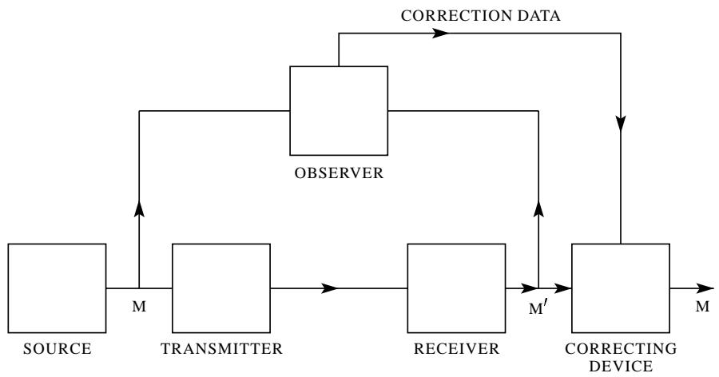

图 8—校正系统示意图。

粗略地说，$H_{y}(x)$ 是在接收点必须每秒提供的额外信息量，以校正接收到的消息。

为了证明第一部分，考虑接收消息 $M'$ 和相应原始消息 $M$ 的长序列。对于每个 $M'$，有对数 $TH_{y}(x)$ 个 $M$ 可以合理地产生它。因此，我们每 $T$ 秒有 $TH_{y}(x)$ 个二进制数字要发送。这可以在容量为 $H_{y}(x)$ 的信道上以 $\epsilon$ 的错误频率完成。

第二部分可以通过首先注意到对于任何离散随机变量 $x,y,z$ 来证明

$$
H _ {y} (x, z) \geq H _ {y} (x).
$$

左边可以展开为

$$
H _ {y} (z) + H _ {y z} (x) \geq H _ {y} (x)
$$

$$
H _ {y z} (x) \geq H _ {y} (x) - H _ {y} (z) \geq H _ {y} (x) - H (z).
$$

如果我们将 $x$ 识别为源的输出，$y$ 为接收到的信号，$z$ 为通过校正信道发送的信号，那么右边是模糊度减去通过校正信道的传输速率。如果该信道的容量小于模糊度，则右边将大于零，且 $H_{yz}(x) > 0$。但这是知道接收信号和校正信号时对发送内容的不确定性。如果这个大于零，则错误频率不能任意小。

# 示例：

假设错误随机出现在二进制数字序列中：一个数字错误的概率为 $p$，正确的概率为 $q = 1 - p$。如果知道它们的位置，这些错误可以被纠正。因此，校正信道只需要发送关于这些位置的信息。这相当于从一个源传输，该源以概率 $p$ 产生1（不正确），以概率 $q$ 产生0（正确）。这需要一个容量为

$$
- \left[ p \log p + q \log q \right]
$$

的信道，这就是原始系统的模糊度。

传输速率 $R$ 可以写成另外两种形式，由于上面提到的恒等式。我们有

$$
\begin{array}{l} R = H (x) - H _ {y} (x) \\ = H (y) - H _ {x} (y) \\ = H (x) + H (y) - H (x, y). \\ \end{array}
$$

第一个定义表达式已经被解释为发送的信息量减去对发送内容的不确定性。第二个度量接收的信息量减去其中由于噪声造成的部分。第三个是两个量之和减去联合熵，因此在某种意义上，是两者每秒共有的比特数。因此，所有三个表达式都有某种直观意义。

带噪声信道的容量 $C$ 应该是最大可能的传输速率，即当源与信道适当匹配时的速率。因此，我们通过以下方式定义信道容量

$$
C = \operatorname {M a x} (H (x) - H _ {y} (x))
$$

其中最大值是针对所有可能用作信道输入的信息源。如果信道是无噪声的，则 $H_{y}(x) = 0$。那么该定义等价于先前为无噪声信道给出的定义，因为信道的最大熵就是其容量。

# 13. 带噪声离散信道的基本定理

我们为一个带噪声信道定义一个确定的容量 $C$ 可能看起来令人惊讶，因为在这样的情况下我们永远无法发送确定的信息。然而，显然，通过以冗余形式发送信息，可以降低错误概率。例如，通过多次重复消息并通过对消息的不同接收版本进行统计研究，可以使错误概率变得非常小。然而，人们会期望，为了使这个错误概率趋近于零，编码的冗余度必须无限增加，因此传输速率趋近于零。这绝非正确。如果真是这样，就不会有非常明确的容量，而只有针对给定错误频率或给定模糊度的容量；随着错误要求变得更加严格，容量会下降。实际上，上面定义的容量 $C$ 具有非常明确的意义。可以通过适当的编码，以任意小的错误频率或模糊度，以速率 $C$ 通过信道发送信息。这个陈述对于任何大于 $C$ 的速率都不成立。如果试图以高于 $C$ 的速率传输，比如 $C + R_1$，则模糊度必然等于或大于超额 $R_1$。大自然要求恰好那么多的不确定性作为代价，因此我们实际上并没有得到超过 $C$ 的正确信息。

情况如图9所示。信息进入信道的速率水平绘制，模糊度垂直绘制。可以到达阴影区域中粗线上方的任何点，而不能到达下方的点。通常，线上的点无法达到，但通常会有两个点可以达到。

这些结果是对 $C$ 定义的主要证明，现在将予以证明。

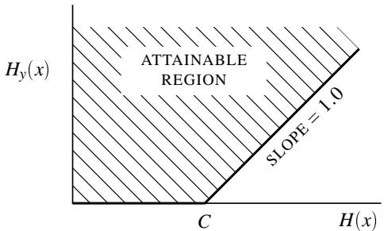

图 9—给定输入熵到信道的可能模糊度。

**定理11**：令离散信道具有容量 $C$，离散源具有每秒熵 $H$。如果 $H \leq C$，则存在一个编码系统，使得源的输出可以通过信道以任意小的错误频率（或任意小的模糊度）传输。如果 $H > C$，则可以对源进行编码，使得模糊度小于 $H - C + \epsilon$，其中 $\epsilon$ 任意小。没有编码方法能给出小于 $H - C$ 的模糊度。

证明该定理第一部分的方法不是通过展示具有所需性质的编码方法，而是通过证明这样的代码必须存在于某个代码组中。事实上，我们将

平均该组中的错误频率，并表明这个平均值可以小于 $\epsilon$。如果一组数字的平均值小于 $\epsilon$，则该组中必须至少存在一个小于 $\epsilon$ 的数字。这将确立所需的结果。

带噪声信道的容量 $C$ 已定义为

$$
C = \operatorname {M a x} \left(H (x) - H _ {y} (x)\right)
$$

其中 $x$ 是输入，$y$ 是输出。最大化是针对所有可能用作信道输入的源进行的。

令 $S_0$ 是一个达到最大容量 $C$ 的源。如果这个最大值实际上没有被任何源达到，则令 $S_0$ 是一个近似给出最大速率的源。假设 $S_0$ 用作信道的输入。我们考虑长持续时间 $T$ 的可能传输和接收序列。以下将为真：

1.  传输的序列分为两类，一个高概率组，大约有 $2^{TH(x)}$ 个成员，以及剩余的总概率很小的序列。
2.  类似地，接收序列有一个高概率集，大约有 $2^{TH(y)}$ 个成员，以及一个低概率的剩余序列集。
3.  每个高概率输出可能由大约 $2^{TH_y(x)}$ 个输入产生。所有其他情况的概率总概率很小。

这些陈述中隐含的"小"和"大约"的所有 $\epsilon$ 和 $\delta$ 随着我们允许 $T$ 增加且 $S_0$ 趋近于最大化源而趋近于零。

情况总结在图10中，其中输入序列是左边的点，输出序列是右边的点。交叉线的扇形表示典型输出的可能原因范围。

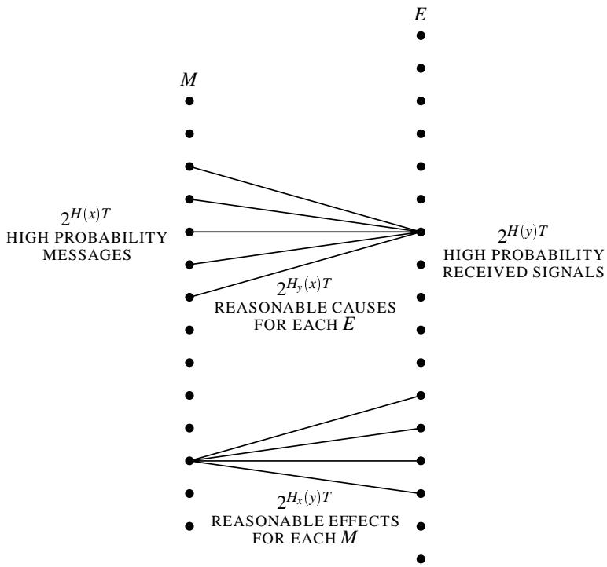

图 10—信道中输入和输出之间关系的示意图。

现在假设我们有另一个源以速率 $R$ 产生信息，且 $R < C$。在周期 $T$ 内，该源将有 $2^{TR}$ 个高概率消息。我们希望将这些与可能的信道输入的选择相关联，以获得小的错误频率。我们将以所有可能的方式建立这种关联（然而，仅使用由源 $S_0$ 确定的高概率输入组），并计算这个大类的可能编码系统的平均错误频率。这与计算消息和持续时间为 $T$ 的信道输入的随机关联的错误频率相同。假设观察到特定的输出 $y_1$。在 $y_1$ 的可能原因集合中，有多个消息的概率是多少？有 $2^{TR}$ 个消息随机分布在 $2^{TH(x)}$ 个点中。因此，特定点是消息的概率为

$$
2 ^ {T (R - H (x))}.
$$

扇形中没有点（除了实际起源的消息）是消息的概率为

$$
P = \left[ 1 - 2 ^ {T (R - H (x))} \right] ^ {2 ^ {T H y (x)}}.
$$

现在 $R < H(x) - H_y(x)$，所以 $R - H(x) = -H_y(x) - \eta$，其中 $\eta$ 为正。因此

$$
P = \left[ 1 - 2 ^ {- T H _ {y} (x) - T \eta} \right] ^ {2 ^ {T H _ {y} (x)}}
$$

随着 $T\to \infty$ 趋近于

$$
1 - 2 ^ {- T \eta}.
$$

因此，错误概率趋近于零，定理的第一部分得证。

定理的第二部分很容易通过注意到我们可以仅从源每秒发送 $C$ 比特，完全忽略产生的其余信息来证明。在接收端，被忽略的部分给出模糊度 $H(x) - C$，而传输的部分只需要加上 $\epsilon$。这个极限也可以通过许多其他方式达到，正如我们考虑连续情况时将展示的那样。

定理的最后一个陈述是我们对 $C$ 定义的简单推论。假设我们可以编码一个 $H(x) = C + a$ 的源，以获得模糊度 $H_{y}(x) = a - \epsilon$，其中 $\epsilon$ 为正。那么 $R = H(x) = C + a$，且

$$
H (x) - H _ {y} (x) = C + \epsilon
$$

其中 $\epsilon$ 为正。这与 $C$ 作为 $H(x) - H_{y}(x)$ 的最大值的定义相矛盾。

实际上，已经证明的比定理中陈述的更多。如果一组数字的平均值在 $\epsilon$ 范围内达到其最大值，则最多有 $\sqrt{\epsilon}$ 的部分可能比最大值低 $\sqrt{\epsilon}$ 以上。由于 $\epsilon$ 任意小，我们可以说几乎所有的系统都任意接近理想。

# 14. 讨论

定理11的证明，虽然不是纯粹的存在性证明，但具有此类证明的一些缺陷。尝试按照证明的方法来获得理想编码的良好近似通常是不切实际的。事实上，除了某些相当平凡的情况和一些极限情况，还没有找到对理想的近似序列的明确描述。可能这不是偶然，而是与为随机序列的良好近似给出明确构造的困难有关。

对理想的近似将具有这样的性质：如果信号被噪声以合理的方式改变，原始信号仍然可以恢复。换句话说，这种改变通常不会使它比原始信号更接近另一个合理的信号。这是以编码中一定量的冗余为代价实现的。必须以便于对抗所涉及的特定噪声结构的方式引入冗余。然而，源中的任何冗余，如果在接收点被利用，通常都会有所帮助。特别是，如果源已经具有一定的冗余，并且在匹配信道时没有尝试消除它，那么这种冗余将有助于对抗噪声。例如，在无噪声电报信道中，通过适当编码消息，可以节省大约 $50\%$ 的时间。这一点并未实现，英语的大部分冗余保留在信道符号中。然而，这具有允许信道中存在相当大噪声的优点。相当一部分字母可以被错误接收，但仍能通过上下文重建。实际上，这可能并非对许多情况下理想情况的糟糕近似，因为英语的统计结构相当复杂，而合理的英语序列与随机选择的差距（在定理所需的意义上）并不太大。

与无噪声情况一样，通常需要延迟来接近理想编码。它现在具有额外的功能，即在接收点对原始消息做出任何判断之前，允许大量噪声样本影响信号。增加样本量总是能加强可能的统计断言。

定理11的内容及其证明可以以某种不同的方式表述，更清楚地展示与无噪声情况的联系。考虑持续时间为 $T$ 的可能信号，并假设选择其中的一个子集来使用。设子集中的所有信号以相等概率使用，并假设接收机被构造为当接收到受扰信号时，从子集中选择最可能的原因作为原始信号。我们定义 $N(T,q)$ 为我们可以为子集选择的信号的最大数量，使得错误解释的概率小于或等于 $q$。

**定理12**： $\lim_{T\to \infty}\frac{\log N(T,q)}{T} = C$ ，其中 $C$ 是信道容量，前提是 $q$ 不等于0或1。

换句话说，无论我们如何设定可靠性的界限，我们都能在时间 $T$ 内可靠地区分足够多的消息，对应于大约 $CT$ 比特，当 $T$ 足够大时。定理12可以与第1节中给出的无噪声信道容量的定义进行比较。

# 15. 离散信道及其容量的示例

离散信道的一个简单示例如图11所示。有三种可能的符号。第一个从不受噪声影响。第二个和第三个各有概率 $p$ 无干扰地通过，以及概率 $q$ 被改变为该对中的另一个。我们有（令 $\alpha = -[p\log p + q\log q]$ ，且 $P$ 和 $Q$ 为

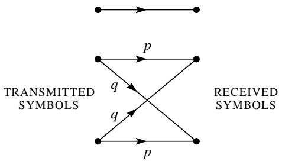

图 11—离散信道示例。

使用第一个和第二个符号的概率）

$$
H (x) = - P \log P - 2 Q \log Q
$$

$$
H _ {y} (x) = 2 Q \alpha .
$$

我们希望以这样的方式选择 $P$ 和 $Q$，以最大化 $H(x) - H_{y}(x)$，并受约束 $P + 2Q = 1$。因此我们考虑

$$
U = - P \log P - 2 Q \log Q - 2 Q \alpha + \lambda (P + 2 Q)
$$

$$
\frac {\partial U}{\partial P} = - 1 - \log P + \lambda = 0
$$

$$
\frac {\partial U}{\partial Q} = - 2 - 2 \log Q - 2 \alpha + 2 \lambda = 0.
$$

消除 $\lambda$

$$
\log P = \log Q + \alpha
$$

$$
P = Q e ^ {\alpha} = Q \beta
$$

$$
P = \frac {\beta}{\beta + 2} \qquad Q = \frac {1}{\beta + 2}.
$$

那么信道容量是

$$
C = \log {\frac {\beta + 2}{\beta}}.
$$

注意这在 $p = 1$ 和 $p = \frac{1}{2}$ 的情况下如何检查明显值。在第一种情况下，$\beta = 1$ 且 $C = \log 3$，这是正确的，因为此时信道是无噪声的，有三个可能的符号。如果 $p = \frac{1}{2}$，则 $\beta = 2$ 且 $C = \log 2$。这里第二个和第三个符号完全无法区分，并像一起作为一个符号那样行动。第一个符号以概率 $P = \frac{1}{2}$ 使用，第二个和第三个一起以概率 $\frac{1}{2}$ 使用。这可以在它们之间以任何期望的方式分配，并且仍然达到最大容量。

对于 $p$ 的中间值，信道容量将介于 $\log 2$ 和 $\log 3$ 之间。第二个和第三个符号之间的区别传达了一些信息，但没有无噪声情况下那么多。第一个符号的使用频率比其他两个稍高，因为它不受噪声影响。

# 16. 某些特殊情况下的信道容量

如果噪声独立地影响连续的信道符号，则可以用一组转移概率 $p_{ij}$ 来描述。这是如果符号 $i$ 被发送，则 $j$ 被接收的概率。那么最大信道速率由下式的最大值给出

$$
- \sum_ {i, j} P _ {i} p _ {i j} \log \sum_ {i} P _ {i} p _ {i j} + \sum_ {i, j} P _ {i} p _ {i j} \log p _ {i j}
$$

其中我们在 $\sum P_{i} = 1$ 的条件下改变 $P_{i}$。这通过拉格朗日方法导出方程，

$$
\sum_ {j} p _ {s j} \log \frac {p _ {s j}}{\sum_ {i} P _ {i} p _ {i j}} = \mu \qquad s = 1, 2, \ldots .
$$

乘以 $P_{s}$ 并对 $s$ 求和表明 $\mu = C$。令 $p_{sj}$ 的逆（如果存在）为 $h_{st}$，使得 $\sum_{s} h_{st} p_{sj} = \delta_{tj}$。那么：

$$
\sum_ {s, j} h _ {s t} p _ {s j} \log p _ {s j} - \log \sum_ {i} P _ {i} p _ {i t} = C \sum_ {s} h _ {s t}.
$$

因此：

$$
\sum_ {i} P _ {i} p _ {i t} = \exp \left[ - C \sum_ {s} h _ {s t} + \sum_ {s, j} h _ {s t} p _ {s j} \log p _ {s j} \right]
$$

或，

$$
P _ {i} = \sum_ {t} h _ {i t} \exp \left[ - C \sum_ {s} h _ {s t} + \sum_ {s, j} h _ {s t} p _ {s j} \log p _ {s j} \right].
$$

这是用于确定 $P_{i}$ 的最大化值的方程组，其中 $C$ 被确定使得 $\sum P_{i} = 1$。完成此操作后，$C$ 将是信道容量，而 $P_{i}$ 是实现此容量的信道符号的适当概率。

如果每个输入符号在其发出的线上具有相同的概率集，并且每个输出符号也是如此，则可以轻松计算容量。示例如图12所示。在这种情况下，$H_{x}(y)$ 与输入符号上的概率分布无关，并由 $-\sum p_{i}\log p_{i}$ 给出，其中 $p_i$ 是来自任何输入符号的转移概率值。信道容量为

$$
\operatorname {M a x} \left[ H (y) - H _ {x} (y) \right] = \operatorname {M a x} H (y) + \sum p _ {i} \log p _ {i}.
$$

$H(y)$ 的最大值显然是 $\log m$，其中 $m$ 是输出符号的数量，因为通过使输入符号等概率，可以使它们全部等概率。因此信道容量为

$$
C = \log m + \sum p _ {i} \log p _ {i}.
$$

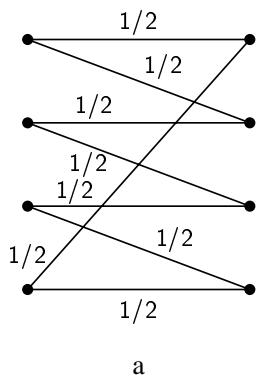

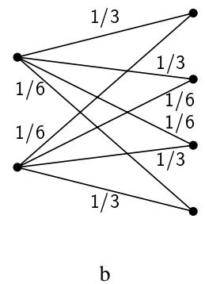

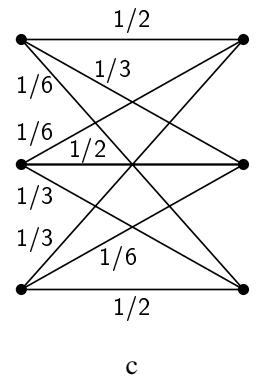

图 12—具有相同转移概率的离散信道示例，每个输入和每个输出相同。

在图12a中将是

$$
C = \log 4 - \log 2 = \log 2.
$$

这可以通过仅使用第1和第3个符号来实现。在图12b中

$$
\begin{array}{l} C = \log 4 - \frac {2}{3} \log 3 - \frac {1}{3} \log 6 \\ = \log 4 - \log 3 - \frac {1}{3} \log 2 \\ = \log \frac {1}{3} 2 ^ {\frac {5}{3}}. \\ \end{array}
$$

在图12c中我们有

$$
\begin{array}{l} C = \log 3 - \frac {1}{2} \log 2 - \frac {1}{3} \log 3 - \frac {1}{6} \log 6 \\ = \log \frac {3}{2 ^ {\frac {1}{2}} 3 ^ {\frac {1}{3}} 6 ^ {\frac {1}{6}}}. \\ \end{array}
$$

假设符号分为若干组，使得噪声永远不会导致一组中的符号被误认为是另一组中的符号。令当仅使用第 $n$ 组中的符号时，其容量为 $C_n$（以比特每秒为单位）。那么很容易证明，为了最佳利用整个集合，第 $n$ 组中所有符号的总概率 $P_n$ 应为

$$
P _ {n} = \frac {2 ^ {C _ {n}}}{\sum 2 ^ {C _ {n}}}.
$$

在组内，概率的分布方式与如果这些是唯一使用的符号时的分布方式相同。信道容量为

$$
C = \log \sum 2 ^ {C _ {n}}.
$$

# 17. 高效编码示例

以下示例虽然有些不切实际，但却是可以精确匹配带噪声信道的情况。有两个信道符号0和1，噪声以七个符号的块影响它们。七个符号的块要么无错误传输，要么七个符号中恰好有一个不正确。这八种可能性等可能。我们有

$$
\begin{array}{l} C = \operatorname {M a x} \left[ H (y) - H _ {x} (y) \right] \\ = \frac {1}{7} \left[ 7 + \frac {8}{8} \log \frac {1}{8} \right] \\ = \frac {4}{7} \text {比特/符号。} \\ \end{array}
$$

一种允许完全纠正错误并以速率 $C$ 传输的高效代码（通过R. Hamming的方法找到）如下：

令七个符号的块为 $X_{1}, X_{2}, \ldots, X_{7}$。其中 $X_{3}, X_{5}, X_{6}$ 和 $X_{7}$ 是消息符号，由源任意选择。其他三个是冗余的，计算如下：

$X_{4}$ 被选择为使 $\alpha = X_4 + X_5 + X_6 + X_7$ 为偶数

$X_{2}$ 被选择为使 $\beta = X_{2} + X_{3} + X_{6} + X_{7}$ 为偶数

$X_{1}$ 被选择为使 $\gamma = X_{1} + X_{3} + X_{5} + X_{7}$ 为偶数

当接收到一个七符号块时，计算 $\alpha, \beta$ 和 $\gamma$，如果为偶数则称为零，如果为奇数则称为一。那么二进制数 $\alpha \beta \gamma$ 给出不正确的 $X_{i}$ 的下标（如果为0则表示没有错误）。

# 附录 1

具有有限状态条件的符号块数量的增长

令 $N_{i}(L)$ 为长度为 $L$ 且在状态 $i$ 结束的符号块的数量。那么我们有

$$
N _ {j} (L) = \sum_ {i, s} N _ {i} \left(L - b _ {i j} ^ {(s)}\right)
$$

其中 $b_{ij}^{1}, b_{ij}^{2}, \ldots, b_{ij}^{m}$ 是在状态 $i$ 中可以选择并导致状态 $j$ 的符号的长度。这些是线性差分方程，且当 $L \to \infty$ 时的行为必须是类型

$$
N _ {j} = A _ {j} W ^ {L}.
$$

代入差分方程

$$
A _ {j} W ^ {L} = \sum_ {i, s} A _ {i} W ^ {L - b _ {i j} ^ {(s)}}
$$

或

$$
A _ {j} = \sum_ {i, s} A _ {i} W ^ {- b _ {i j} ^ {(s)}}
$$

$$
\sum_ {i} \left(\sum_ {s} W ^ {- b _ {i j} ^ {(s)}} - \delta_ {i j}\right) A _ {i} = 0.
$$

为此，行列式

$$
D (W) = | a _ {i j} | = \left| \sum_ {s} W ^ {- b _ {i j} ^ {(s)}} - \delta_ {i j} \right|
$$

必须为零，这决定了 $W$，当然，它是 $D = 0$ 的最大实根。

那么量 $C$ 由下式给出

$$
C = \lim  _ {L \rightarrow \infty} \frac {\log \sum A _ {j} W ^ {L}}{L} = \log W
$$

并且我们还注意到，如果我们要求所有块从相同的（任意选择的）状态开始，也会产生相同的增长特性。

# 附录 2

$H = -\sum p_{i}\log p_{i}$ 的推导

令 $H\left(\frac{1}{n}, \frac{1}{n}, \ldots, \frac{1}{n}\right) = A(n)$。由条件（3），我们可以将来自 $s^m$ 个等可能可能性的选择分解为一系列来自 $s$ 个等可能可能性的 $m$ 个选择，并获得

$$
A (s ^ {m}) = m A (s).
$$

类似地

$$
A (t ^ {n}) = n A (t).
$$

我们可以任意选择大的 $n$ 并找到满足的 $m$

$$
s ^ {m} \leq t ^ {n} <   s ^ {(m + 1)}.
$$

因此，取对数并除以 $n \log s$，

$$
\frac {m}{n} \leq \frac {\log t}{\log s} \leq \frac {m}{n} + \frac {1}{n} \quad \mathrm {o r} \quad \left| \frac {m}{n} - \frac {\log t}{\log s} \right| <   \epsilon
$$

其中 $\epsilon$ 任意小。现在由 $A(n)$ 的单调性质

$$
A \left(s ^ {m}\right) \leq A \left(t ^ {n}\right) \leq A \left(s ^ {m + 1}\right)
$$

$$
m A (s) \leq n A (t) \leq (m + 1) A (s).
$$

因此，除以 $nA(s)$，

$$
\frac {m}{n} \leq \frac {A (t)}{A (s)} \leq \frac {m}{n} + \frac {1}{n} \quad \text {o r} \quad \left| \frac {m}{n} - \frac {A (t)}{A (s)} \right| <   \epsilon
$$

$$
\left| \frac {A (t)}{A (s)} - \frac {\log t}{\log s} \right| <   2 \epsilon \quad A (t) = K \log t
$$

其中 $K$ 必须为正以满足（2）。

现在假设我们有一个来自 $n$ 种可能性的选择，具有可公度的概率 $p_i = \frac{n_i}{\sum n_i}$，其中 $n_i$ 是整数。我们可以将来自 $\sum n_i$ 种可能性的选择分解为来自 $n$ 种可能性且概率为 $p_1, \ldots, p_n$ 的选择，然后，如果选择了第 $i$ 个，则进行来自 $n_i$ 种等可能可能性的选择。再次使用条件（3），我们通过两种方法等同来自 $\sum n_i$ 的总选择

$$
K \log \sum n _ {i} = H \left(p _ {1}, \dots , p _ {n}\right) + K \sum p _ {i} \log n _ {i}.
$$

因此

$$
\begin{array}{l} H = K \left[ \sum p _ {i} \log \sum n _ {i} - \sum p _ {i} \log n _ {i} \right] \\ = - K \sum p _ {i} \log \frac {n _ {i}}{\sum n _ {i}} = - K \sum p _ {i} \log p _ {i}. \\ \end{array}
$$

如果 $p_i$ 不可公度，则可以用有理数近似，并且相同的表达式必须由我们的连续性假设成立。因此该表达式一般成立。系数 $K$ 的选择是方便的问题，相当于度量单位的选择。

# 附录 3

# 关于遍历源的定理

如果可以从任何状态 $P > 0$ 沿概率 $p > 0$ 的路径到达任何其他状态，则系统是遍历的，并且可以应用强大数定律。因此，在长度为 $N$ 的长序列中，网络中给定路径 $p_{ij}$ 被遍历的次数大约与处于 $i$ 的概率（比如 $P_i$）成正比，然后选择该路径，即 $P_i p_{ij} N$。如果 $N$ 足够大，百分比误差 $\pm \delta$ 的概率小于 $\epsilon$，因此对于除一个小概率集合外的几乎所有情况，实际数字都在以下范围内

$$
(P _ {i} p _ {i j} \pm \delta) N.
$$

因此几乎所有的序列都有一个概率 $p$，由下式给出

$$
p = \prod p _ {i j} ^ {(P _ {i} p _ {i j} \pm \delta) N}
$$

且 $\frac{\log p}{N}$ 被限制为

$$
\frac {\log p}{N} = \sum (P _ {i} p _ {i j} \pm \delta) \log p _ {i j}
$$

或

$$
\left| \frac {\log p}{N} - \sum P _ {i} p _ {i j} \log p _ {i j} \right| <   \eta .
$$

这证明了定理3。

定理4通过基于定理3中 $p$ 的可能范围计算 $n(q)$ 的上界和下界立即得出。

在混合（非遍历）情况下，如果

$$
L = \sum p _ {i} L _ {i}
$$

且分量的熵为 $H_{1} \geq H_{2} \geq \dots \geq H_{n}$，我们有

**定理**： $\lim_{N\to \infty}\frac{\log n(q)}{N} = \varphi (q)$ 是一个递减的阶跃函数，

$$
\varphi (q) = H _ {s} \quad \text{在区间内} \quad \sum_ {1} ^ {s - 1} \alpha_ {i} <   q <   \sum_ {1} ^ {s} \alpha_ {i}.
$$

为了证明定理5和6，首先注意 $F_{N}$ 是单调递减的，因为增加 $N$ 会给条件熵添加下标。在 $F_{N}$ 的定义中简单替换 $p_{B_i}(S_j)$ 表明

$$
F _ {N} = N G _ {N} - (N - 1) G _ {N - 1}
$$

并对所有 $N$ 求和得到 $G_{N} = \frac{1}{N}\sum F_{n}$。因此 $G_{N}\geq F_{N}$ 且 $G_{N}$ 单调递减。它们也必须趋近于相同的极限。通过使用定理3，我们看到 $\lim_{N\to \infty}G_N = H$。

# 附录 4

# 最大化约束系统的速率

假设我们有一个对符号序列的约束集，它是有限状态类型，因此可以用线性图表示。令 $\ell_{ij}^{(s)}$ 为在从状态 $i$ 传递到状态 $j$ 时可以出现的各种符号的长度。在这些约束下，不同状态的概率 $P_{i}$ 和在状态 $i$ 中选择符号 $s$ 并进入状态 $j$ 的概率 $p_{ij}^{(s)}$ 的哪种分布可以最大化生成信息的速率？约束定义了一个离散信道，最大速率必须小于或等于该信道的容量 $C$，因为如果所有大长度的块都等可能，就会产生这个速率，如果可能，这将是最好的。我们将证明通过适当选择 $P_{i}$ 和 $p_{ij}^{(s)}$ 可以达到这个速率。

所讨论的速率是

$$
\frac {- \sum P _ {i} p _ {i j} ^ {(s)} \log p _ {i j} ^ {(s)}}{\sum P _ {i} p _ {i j} ^ {(s)} \ell_ {i j} ^ {(s)}} = \frac {N}{M}.
$$

令 $\ell_{ij} = \sum_s\ell_{ij}^{(s)}$。显然，为了最大化，$p_{ij}^{(s)} = k\exp \ell_{ij}^{(s)}$。最大化的约束是 $\sum P_i = 1, \sum_j p_{ij} = 1, \sum P_i(p_{ij} - \delta_{ij}) = 0$。因此我们最大化

$$
U = \frac {- \sum P _ {i} p _ {i j} \log p _ {i j}}{\sum P _ {i} p _ {i j} \ell_ {i j}} + \lambda \sum_ {i} P _ {i} + \sum \mu_ {i} p _ {i j} + \sum \eta_ {j} P _ {i} (p _ {i j} - \delta_ {i j})
$$

$$
\frac {\partial U}{\partial p _ {i j}} = - \frac {M P _ {i} (1 + \log p _ {i j}) + N P _ {i} \ell_ {i j}}{M ^ {2}} + \lambda + \mu_ {i} + \eta_ {i} P _ {i} = 0.
$$

求解 $p_{ij}$

$$
p _ {i j} = A _ {i} B _ {j} D ^ {- \ell_ {i j}}.
$$

由于

$$
\sum_ {j} p _ {i j} = 1, \quad A _ {i} ^ {- 1} = \sum_ {j} B _ {j} D ^ {- \ell_ {i j}}
$$

$$
p _ {i j} = \frac {B _ {j} D ^ {- \ell_ {i j}}}{\sum_ {s} B _ {s} D ^ {- \ell_ {i s}}}.
$$

$D$ 的正确值是容量 $C$，且 $B_{j}$ 是以下方程的解

$$
B _ {i} = \sum B _ {j} C ^ {- \ell_ {i j}}
$$

因为此时

$$
p _ {i j} = \frac {B _ {j}}{B _ {i}} C ^ {- \ell_ {i j}}
$$

$$
\sum P _ {i} \frac {B _ {j}}{B _ {i}} C ^ {- \ell_ {i j}} = P _ {j}
$$

或

$$
\sum \frac {P _ {i}}{B _ {i}} C ^ {- \ell_ {i j}} = \frac {P _ {j}}{B _ {j}}.
$$

因此，如果 $\lambda_{i}$ 满足

$$
\sum \gamma_ {i} C ^ {- \ell_ {i j}} = \gamma_ {j}
$$

则

$$
P _ {i} = B _ {i} \gamma_ {i}.
$$

$B_{i}$ 和 $\gamma_{i}$ 的方程组都可以满足，因为 $C$ 使得

$$
\left| C ^ {- \ell_ {i j}} - \delta_ {i j} \right| = 0.
$$

在这种情况下，速率是

$$
- \frac {\sum P _ {i} p _ {i j} \log \frac {B _ {j}}{B _ {i}} C ^ {- \ell_ {i j}}}{\sum P _ {i} p _ {i j} \ell_ {i j}} = C - \frac {\sum P _ {i} p _ {i j} \log \frac {B _ {j}}{B _ {i}}}{\sum P _ {i} p _ {i j} \ell_ {i j}}
$$

但是

$$
\sum P _ {i} p _ {i j} \left(\log B _ {j} - \log B _ {i}\right) = \sum_ {j} P _ {j} \log B _ {j} - \sum P _ {i} \log B _ {i} = 0
$$

因此速率是 $C$，并且由于这永远不可能超过，所以这是最大值，证明了假设的解。

# 第三部分：数学预备知识

在本文的最后一部分，我们考虑信号或消息或两者都是连续变化的情况，与此前假设的离散性质相对。在很大程度上，连续情况可以通过极限过程从离散情况获得，方法是将消息和信号的连续统划分为大量但有限的小区域，并在离散基础上计算所涉及的各种参数。随着区域尺寸的减小，这些参数通常作为连续情况的适当值的极限趋近。然而，出现了一些新的效应，并且一般结果向特定情况专门化的方向也发生了普遍转变。

在连续情况下，我们不会试图以最大的普遍性或纯数学的极端严谨性来获得我们的结果，因为这将涉及大量的抽象测度论，并会掩盖分析的主线。然而，初步研究表明，该理论可以用完全公理化和严谨的方式来表述，包括连续和离散情况以及许多其他情况。在当前分析中对极限过程偶尔采取的自由度在所有实际感兴趣的情况下都可以被证明是合理的。

# 18. 函数集合与系综

在连续情况下，我们必须处理函数集合和函数系综。函数集合，顾名思义，仅仅是一类或一组函数，通常是一个变量——时间的函数。可以通过给出集合中各种函数的显式表示来指定它，或者隐含地通过给出集合中函数具有而其他函数不具备的属性来指定。一些例子是：

1.  函数集：

    $$
    f _ {\theta} (t) = \sin (t + \theta).
    $$

    $\theta$ 的每个特定值决定了集合中的一个特定函数。

2.  所有频率不超过每秒 $W$ 周的函数的集合。

3.  所有频带限制在 $W$ 以内且幅度限制在 $A$ 以内的函数的集合。

4.  所有作为时间函数的英语语音信号的集合。

**函数系综**是一组函数连同概率测度，通过它我们可以确定集合中函数具有某些属性的概率。例如对于集合

$$
f _ {\theta} (t) = \sin (t + \theta),
$$

我们可以给出 $\theta$ 的概率分布 $P(\theta)$。然后该集合变成一个系综。

函数系综的一些进一步例子是：

1.  有限函数集 $f_{k}(t)$ （ $k = 1,2,\dots,n$ ），$f_{k}$ 的概率为 $p_k$ 。
2.  有限维函数族

    $$
    f (\alpha_ {1}, \alpha_ {2}, \dots , \alpha_ {n}; t)
    $$

    具有参数 $\alpha_{i}$ 上的概率分布：

    $$
    p (\alpha_ {1}, \dots , \alpha_ {n}).
    $$

    例如，我们可以考虑由下式定义的系综

    $$
    f \left(a _ {1}, \dots , a _ {n}, \theta_ {1}, \dots , \theta_ {n}; t\right) = \sum_ {i = 1} ^ {n} a _ {i} \sin i (\omega t + \theta_ {i})
    $$

    其中振幅 $a_{i}$ 正态且独立分布，相位 $\theta_{i}$ 均匀（从0到 $2\pi$ ）且独立分布。

    1在数学术语中，函数属于总测度为1的测度空间。

3.  系综

    $$
    f \left(a _ {i}, t\right) = \sum_ {n = - \infty} ^ {+ \infty} a _ {n} \frac {\sin \pi (2 W t - n)}{\pi (2 W t - n)}
    $$

    其中 $a_{i}$ 正态且独立，所有都具有相同的标准差 $\sqrt{N}$ 。这是"白"噪声的表示，频带限制在0到 $W$ 周每秒，平均功率为 $N$ 。2

4.  令点按照泊松分布分布在 $t$ 轴上。在每个选定的点放置函数 $f(t)$ ，并将不同的函数相加，得到系综

    $$
    \sum_ {k = - \infty} ^ {\infty} f (t + t _ {k})
    $$

    其中 $t_k$ 是泊松分布的点。这个系综可以被认为是一种脉冲或散粒噪声，其中所有脉冲都相同。

5.  英语语音函数集，概率测度由普通使用中的出现频率给出。

函数系综 $f_{\alpha}(t)$ 是平稳的，如果将所有函数在时间上平移任何固定量，会得到相同的系综。系综

$$
f _ {\theta} (t) = \sin (t + \theta)
$$

是平稳的，如果 $\theta$ 从0到 $2\pi$ 均匀分布。如果我们将每个函数平移 $t_1$ ，我们得到

$$
\begin{array}{l} f _ {\theta} (t + t _ {1}) = \sin (t + t _ {1} + \theta) \\ = \sin (t + \varphi) \\ \end{array}
$$

其中 $\varphi$ 从0到 $2\pi$ 均匀分布。每个函数都改变了，但整个系综在平移下是不变的。上面给出的其他例子也是平稳的。

一个系综是遍历的，如果它是平稳的，并且函数集中没有概率不同于0和1的子集是平稳的。系综

$$
\sin (t + \theta)
$$

是遍历的。这些函数中概率 $\neq 0,1$ 的子集在所有时间平移下都不会变换为自身。另一方面，系综

$$
a \sin (t + \theta)
$$

其中 $a$ 正态分布，$\theta$ 均匀分布，是平稳的但不是遍历的。例如，$a$ 在0和1之间的这些函数的子集是平稳的。

在给出的例子中，3和4是遍历的，5可能被认为是遍历的。如果一个系综是遍历的，我们可以粗略地说集合中的每个函数都是系综的典型代表。更精确地说，已知对于遍历系综，系综上任何统计量的平均值等于（以概率1）集合中特定函数的时间平移上的平均值。3 粗略地说，随着时间推移，每个函数都可以预期以适当的频率经历集合中任何函数的所有卷积。

正如我们可以对数字或函数执行各种操作以获得新的数字或函数一样，我们可以对系综执行操作以获得新的系综。例如，假设我们有一个函数系综 $f_{\alpha}(t)$ 和一个算子 $T$ ，它为每个函数 $f_{\alpha}(t)$ 给出结果函数 $g_{\alpha}(t)$ ：

$$
g _ {\alpha} (t) = T f _ {\alpha} (t).
$$

通过 $f_{\alpha}(t)$ 集合的概率测度为集合 $g_{\alpha}(t)$ 定义概率测度。 $g_{\alpha}(t)$ 函数的某个子集的概率等于 $f_{\alpha}(t)$ 函数的子集的概率，该子集在操作 $T$ 下产生给定的 $g$ 函数子集的成员。物理上这对应于将系综通过某个设备，例如滤波器、整流器或调制器。设备的输出函数构成系综 $g_{\alpha}(t)$ 。

一个设备或算子 $T$ 将被称为不变的，如果平移输入仅仅平移输出，即如果

$$
g _ {\alpha} (t) = T f _ {\alpha} (t)
$$

意味着

$$
g _ {\alpha} (t + t _ {1}) = T f _ {\alpha} (t + t _ {1})
$$

对于所有 $f_{\alpha}(t)$ 和所有 $t_1$ 。很容易证明（见附录5），如果 $T$ 是不变的且输入系综是平稳的，则输出系综是平稳的。同样，如果输入是遍历的，则输出也将是遍历的。

滤波器或整流器在所有时间平移下都是不变的。调制操作不是不变的，因为载波相位给出了某种时间结构。然而，调制在等于载波周期的倍数的所有平移下是不变的。

维纳指出了物理设备在时间平移下的不变性与傅里叶理论之间的密切关系。事实上，他已经证明，如果一个设备既是线性的又是不变的，那么傅里叶分析就是处理该问题的适当数学工具。

函数系综是连续源（例如语音）产生的消息、发射机产生的信号和干扰噪声的适当数学表示。正如维纳所强调的，通信理论正确关注的是对函数系综的操作，而不是对特定函数的操作。通信系统不是为特定的语音函数设计的，更不是为正弦波设计的，而是为语音函数系综设计的。

# 19. 带限函数系综

如果一个时间函数 $f(t)$ 被限制在从0到 $W$ 周每秒的频带内，则通过以 $\frac{1}{2W}$ 秒间隔的离散点序列的纵坐标，它可以被完全确定，如下面结果所示。

**定理13**：令 $f(t)$ 不包含超过 $W$ 的频率。则

$$
f (t) = \sum_ {- \infty} ^ {\infty} X _ {n} \frac {\sin \pi (2 W t - n)}{\pi (2 W t - n)}
$$

其中

$$
X _ {n} = f \left(\frac {n}{2 W}\right).
$$

4通信理论在很大程度上归功于维纳的基本哲学和理论。他的经典NDRC报告《平稳时间序列的插值、外推和平滑》（Wiley，1949年）包含了通信理论作为统计问题的第一个清晰表述，即时间序列操作的研究。这项工作虽然主要关注线性预测和滤波问题，但与本文相关时是一份重要的补充参考文献。我们在此也可以参考维纳的《控制论》（Wiley，1948年），该书处理通信和控制的一般问题。

该定理的证明和进一步讨论，请参阅作者发表于《无线电工程师协会会刊》v. 37, No. 1, 1949年1月, pp. 10-21的论文"Communication in the Presence of Noise"。

在此展开式中，$f(t)$ 被表示为一组正交函数的和。各项的系数 $X_{n}$ 可以被视为无限维"函数空间"中的坐标。在这个空间中，每个函数恰好对应一个点，每个点对应一个函数。

如果一个函数在时间区间 $T$ 之外的所有纵坐标 $X_{n}$ 都为零，则可以认为该函数实质上被限制在时间 $T$ 内。在这种情况下，除了 $2TW$ 个坐标外，所有坐标都将为零。因此，限制在频带 $W$ 和持续时间 $T$ 的函数对应于 $2TW$ 维空间中的点。

频带 $W$ 和持续时间 $T$ 的函数子集对应于该空间中的一个区域。例如，总能量小于或等于 $E$ 的函数对应于 $2TW$ 维球体中的点，半径 $r = \sqrt{2WE}$ 。

有限持续时间和频带的函数系综将由对应 $n$ 维空间中的概率分布 $p(x_{1},\ldots ,x_{n})$ 表示。如果系综在时间上不受限制，我们可以将给定区间 $T$ 内的2TW个坐标视为实质上表示该区间 $T$ 内的函数部分，并且概率分布 $p(x_{1},\dots,x_{n})$ 给出该持续时间区间的系综统计结构。

# 20. 连续分布的熵

离散概率集 $p_1, \ldots, p_n$ 的熵定义为：

$$
H = - \sum p _ {i} \log p _ {i}.
$$

以类似的方式，我们通过下式定义具有密度分布函数 $p(x)$ 的连续分布的熵：

$$
H = - \int_ {- \infty} ^ {\infty} p (x) \log p (x) d x.
$$

对于 $n$ 维分布 $p(x_{1},\ldots ,x_{n})$，我们有

$$
H = - \int \dots \int p (x _ {1}, \dots , x _ {n}) \log p (x _ {1}, \dots , x _ {n}) d x _ {1} \dots d x _ {n}.
$$

如果我们有两个自变量 $x$ 和 $y$（它们本身可能是多维的），则 $p(x,y)$ 的联合熵和条件熵由下式给出

$$
H (x, y) = - \iint p (x, y) \log p (x, y) d x d y
$$

和

$$
H _ {x} (y) = - \iint p (x, y) \log \frac {p (x , y)}{p (x)} d x d y
$$

$$
H _ {y} (x) = - \iint p (x, y) \log \frac {p (x , y)}{p (y)} d x d y
$$

其中

$$
p (x) = \int p (x, y) d y
$$

$$
p (y) = \int p (x, y) d x.
$$

连续分布的熵具有离散情况的大多数（但不是全部）性质。特别是我们有以下几点：

1.  如果 $x$ 被限制在其空间中的某个体积 $\nu$ 内，则当 $p(x)$ 在该体积内为常数 $(1 / \nu)$ 时，$H(x)$ 是最大值且等于 $\log \nu$。
2.  对于任意两个变量 $x, y$，我们有

    $$
    H (x, y) \leq H (x) + H (y)
    $$

    等式成立当且仅当 $x$ 和 $y$ 独立，即 $p(x,y) = p(x)p(y)$（可能除了一组概率为零的点）。
3.  考虑以下类型的广义平均操作：

    $$
    p ^ {\prime} (y) = \int a (x, y) p (x) d x
    $$

    其中

    $$
    \int a (x, y) d x = \int a (x, y) d y = 1, \quad \quad \quad a (x, y) \geq 0.
    $$

    那么平均分布 $p'(y)$ 的熵大于或等于原始分布 $p(x)$ 的熵。
4.  我们有

    $$
    H (x, y) = H (x) + H _ {x} (y) = H (y) + H _ {y} (x)
    $$

    且

    $$
    H _ {x} (y) \leq H (y).
    $$
5.  令 $p(x)$ 为一维分布。在 $x$ 的标准差固定为 $\sigma$ 的条件下，给出最大熵的 $p(x)$ 形式是高斯分布。为了证明这一点，我们必须最大化

    $$
    H (x) = - \int p (x) \log p (x) d x
    $$

    约束条件为

    $$
    \sigma^ {2} = \int p (x) x ^ {2} d x \quad \text {且} \quad 1 = \int p (x) d x
    $$

    根据变分法，这需要最大化

    $$
    \int \left[ - p (x) \log p (x) + \lambda p (x) x ^ {2} + \mu p (x) \right] d x.
    $$

    条件是

    $$
    - 1 - \log p (x) + \lambda x ^ {2} + \mu = 0
    $$

    因此（调整常数以满足约束）

    $$
    p (x) = \frac {1}{\sqrt {2 \pi} \sigma} e ^ {- (x ^ {2} / 2 \sigma^ {2})}.
    $$

    类似地，在 $n$ 维中，假设 $p(x_{1},\ldots ,x_{n})$ 的二阶矩固定为 $A_{ij}$

    $$
    A _ {i j} = \int \dots \int x _ {i} x _ {j} p (x _ {1}, \dots , x _ {n}) d x _ {1} \dots d x _ {n}.
    $$

    那么当 $p(x_{1},\ldots ,x_{n})$ 是具有二阶矩 $A_{ij}$ 的 $n$ 维高斯分布时，出现最大熵（通过类似计算）。
6.  标准差为 $\sigma$ 的一维高斯分布的熵由下式给出

    $$
    H (x) = \log \sqrt {2 \pi e} \sigma .
    $$

    计算如下：

    $$
    \begin{array}{l} p (x) = \frac {1}{\sqrt {2 \pi} \sigma} e ^ {- (x ^ {2} / 2 \sigma^ {2})} \\ - \log p (x) = \log \sqrt {2 \pi} \sigma + \frac {x ^ {2}}{2 \sigma^ {2}} \\ H (x) = - \int p (x) \log p (x) d x \\ = \int p (x) \log \sqrt {2 \pi} \sigma d x + \int p (x) \frac {x ^ {2}}{2 \sigma^ {2}} d x \\ = \log \sqrt {2 \pi} \sigma + \frac {\sigma^ {2}}{2 \sigma^ {2}} \\ = \log \sqrt {2 \pi} \sigma + \log \sqrt {e} \\ = \log \sqrt {2 \pi e} \sigma . \\ \end{array}
    $$

    类似地，具有相关二次型 $a_{ij}$ 的 $n$ 维高斯分布由下式给出

    $$
    p \left(x _ {1}, \dots , x _ {n}\right) = \frac {\left| a _ {i j} \right| ^ {\frac {1}{2}}}{(2 \pi) ^ {n / 2}} \exp \left(- \frac {1}{2} \sum a _ {i j} x _ {i} x _ {j}\right)
    $$

    熵可以计算为

    $$
    H = \log (2 \pi e) ^ {n / 2} | a _ {i j} | ^ {- \frac {1}{2}}
    $$

    其中 $|a_{ij}|$ 是元素为 $a_{ij}$ 的行列式。
7.  如果 $x$ 被限制在半直线上（对于 $x \leq 0$，$p(x) = 0$），且 $x$ 的一阶矩固定为 $a$：

    $$
    a = \int_ {0} ^ {\infty} p (x) x d x,
    $$

    那么当

    $$
    p (x) = \frac {1}{a} e ^ {- (x / a)}
    $$

    时出现最大熵，且等于 $\log ea$。
8.  连续熵和离散熵之间有一个重要的区别。在离散情况下，熵绝对地度量随机变量的随机性。在连续情况下，度量是相对于坐标系而言的。如果我们改变坐标，熵通常会改变。实际上，如果我们改变为坐标 $y_{1} \cdots y_{n}$，则新的熵由下式给出

    $$
    H (y) = \int \dots \int p (x _ {1}, \dots , x _ {n}) J \left(\frac {x}{y}\right) \log p (x _ {1}, \dots , x _ {n}) J \left(\frac {x}{y}\right) d y _ {1} \dots d y _ {n}
    $$

    其中 $J\left(\frac{x}{y}\right)$ 是坐标变换的雅可比行列式。展开对数并将变量更改为 $x_{1} \cdots x_{n}$，我们得到：

    $$
    H (y) = H (x) - \int \dots \int p (x _ {1}, \dots , x _ {n}) \log J \left(\frac {x}{y}\right) d x _ {1} \dots d x _ {n}.
    $$

    因此，新的熵是旧的熵减去雅可比行列式的期望对数。在连续情况下，熵可以视为相对于假定标准的随机性度量，即选择的坐标系，其中每个小体积元素 $dx_{1} \cdots dx_{n}$ 被赋予相等的权重。当我们改变坐标系时，新系统中的熵度量当新系统中的相等体积元素 $dy_{1} \cdots dy_{n}$ 被赋予相等权重时的随机性。

    尽管依赖于坐标系，熵概念在连续情况下与离散情况下一样重要。这是由于信息速率和信道容量的衍生概念依赖于两个熵的差，而这个差不依赖于坐标框架，两个项被改变了相同的量。

    连续分布的熵可以是负的。测量的尺度设置了一个任意的零点，对应于单位体积上的均匀分布。比这更受限制的分布具有更少的熵，并且将是负的。然而，速率和容量将始终是非负的。
9.  坐标变换的一个特殊情况是线性变换

    $$
    y _ {j} = \sum_ {i} a _ {i j} x _ {i}.
    $$

    在这种情况下，雅可比行列式简单是行列式 $|a_{ij}|^{-1}$，且

    $$
    H (y) = H (x) + \log | a _ {i j} |.
    $$

    在坐标旋转（或任何保测变换）的情况下，$J = 1$ 且 $H(y) = H(x)$。

# 21. 函数系综的熵

考虑一个遍历函数系综，限制在某个宽度为 $W$ 周每秒的频带内。令

$$
p (x _ {1}, \ldots , x _ {n})
$$

为 $n$ 个连续采样点处振幅 $x_{1},\ldots ,x_{n}$ 的密度分布函数。我们通过下式定义系综每自由度的熵

$$
H ^ {\prime} = - \operatorname * {L i m} _ {n \rightarrow \infty} \frac {1}{n} \int \dots \int p (x _ {1}, \ldots , x _ {n}) \log p (x _ {1}, \ldots , x _ {n}) d x _ {1} \ldots d x _ {n}.
$$

我们也可以通过除以 $n$ 个样本的时间 $T$（秒）来定义每秒的熵 $H$。由于 $n = 2TW$，$H = 2WH'$。

对于白热噪声，$p$ 是高斯分布，我们有

$$
H ^ {\prime} = \log \sqrt {2 \pi e N},
$$

$$
H = W \log 2 \pi e N.
$$

对于给定的平均功率 $N$，白噪声具有最大可能的熵。这源于上面提到的高斯分布的最大化性质。

连续随机过程的熵与离散过程的熵有许多类似的性质。在离散情况下，熵与长序列概率的对数以及长长度的合理可能序列的数量相关。在连续情况下，它以类似的方式与长系列样本的概率密度的对数以及函数空间中相当高概率的体积相关。

更精确地说，如果我们假设 $p(x_{1},\ldots ,x_{n})$ 对所有 $n$ 的所有 $x_{i}$ 都是连续的，那么对于足够大的 $n$，除了总概率小于 $\delta$ 的一组点外，对于所有 $(x_{1},\ldots ,x_{n})$ 的选择，有

$$
\left| \frac {\log p}{n} - H ^ {\prime} \right| <   \epsilon
$$

其中 $\delta$ 和 $\epsilon$ 任意小。如果我们将空间分成大量的小单元，这从遍历性质可以得出。

$H$ 与体积的关系可以陈述如下：在相同假设下，考虑对应于 $p(x_{1},\ldots ,x_{n})$ 的 $n$ 维空间。令 $V_{n}(q)$ 为该空间中包含总概率 $q$ 在其内部的最小体积。那么

$$
\lim  _ {n \rightarrow \infty} \frac {\log V _ {n} (q)}{n} = H ^ {\prime}
$$

前提是 $q$ 不等于0或1。

这些结果表明，对于大的 $n$，存在一个相当明确的高概率体积（至少在对于数的意义上），并且在该体积内，概率密度相对均匀（再次在对于数的意义上）。

在白噪声情况下，分布函数由下式给出

$$
p (x _ {1}, \dots , x _ {n}) = \frac {1}{(2 \pi N) ^ {n / 2}} \exp - \frac {1}{2 N} \sum x _ {i} ^ {2}.
$$

由于这只依赖于 $\sum x_{i}^{2}$，等概率密度面是球体，整个分布具有球对称性。高概率区域是半径为 $\sqrt{nN}$ 的球体。当 $n\to \infty$ 时，处于半径 $\sqrt{n(N + \epsilon)}$ 的球体之外的概率趋近于零，且球体体积的 $\frac{1}{n}$ 乘以对数趋近于 $\log \sqrt{2\pi eN}$。

在连续情况下，使用系综的熵 $H$ 不太方便，而是使用一个我们将称之为熵功率的导出量。这被定义为限制在与原始系综相同频带且具有相同熵的白噪声中的功率。换句话说，如果 $H'$ 是系综的熵，则其熵功率为

$$
N _ {1} = \frac {1}{2 \pi e} \exp 2 H ^ {\prime}.
$$

在几何图像中，这相当于通过具有相同体积的球体的平方半径来测量高概率体积。由于白噪声对于给定功率具有最大熵，任何噪声的熵功率都小于或等于其实际功率。

# 22. 线性滤波器中的熵损失

**定理14**：如果一个具有每自由度熵 $H_{1}$ 的系综通过具有特性 $Y(f)$ 的滤波器，则输出系综具有熵

$$
H _ {2} = H _ {1} + \frac {1}{W} \int_ {W} \log | Y (f) | ^ {2} d f.
$$

滤波器的操作本质上是坐标的线性变换。如果我们认为不同的频率分量是原始的坐标系，那么新的频率分量仅仅是旧的乘以因子。因此，坐标变换矩阵在这些坐标方面基本上是对角化的。变换的雅可比行列式（对于 $n$ 个正弦和 $n$ 个余弦分量）是

$$
J = \prod_ {i = 1} ^ {n} | Y (f _ {i}) | ^ {2}
$$

其中 $f_{i}$ 在频带 $W$ 内等间隔。这在极限中变为

$$
\exp \frac {1}{W} \int_ {W} \log | Y (f) | ^ {2} d f.
$$

由于 $J$ 是常数，其平均值是相同的量，应用关于坐标变化时熵变化的定理，结果成立。我们也可以用熵功率来表述。因此，如果第一个系综的熵功率是 $N_{1}$，则第二个系综的熵功率是

$$
N _ {1} \exp \frac {1}{W} \int_ {W} \log | Y (f) | ^ {2} d f.
$$

表I

<table><tr><td>增益</td><td>熵功率因子</td><td>熵功率增益（分贝）</td><td>脉冲响应</td></tr><tr><td>1 - ω - - - - 0 - ω - 1</td><td>1/e2</td><td>-8.69</td><td>sin²(t/2)/t²/2</td></tr><tr><td>1 - ω² - - - - 0 - ω - 1</td><td>(2/e)4</td><td>-5.33</td><td>2[ sin t / t³ - cos t / t² ]</td></tr><tr><td>1 - ω³ - - - - 0 - ω - 1</td><td>0.411</td><td>-3.87</td><td>6[ cos t - 1 / t⁴ - cos t / 2t² + sin t / t³ ]</td></tr><tr><td>√1 - ω² - - - - 0 - ω - 1</td><td>(2/e)²</td><td>-2.67</td><td>π/2 J1(t)/t</td></tr><tr><td>1 - ω - - - - 0 - ω - 1</td><td>1/e2α</td><td>-8.69α</td><td>1/αt² [cos(1 - α)t - cos t]</td></tr></table>

最终的熵功率是初始熵功率乘以滤波器的几何平均增益。如果增益以 $db$ 测量，那么输出熵功率将增加 $W$ 上的算术平均 $db$ 增益。

在表I中，计算了（并以 $db$ 表示）一些理想增益特性的熵功率损失。这些滤波器的脉冲响应也针对 $W = 2\pi$ 给出，假设相位为0。

许多其他情况的熵损失可以从这些结果中获得。例如，第一种情况的熵功率因子 $1 / e^2$ 也适用于任何从 $1 - \omega$ 通过 $\omega$ 轴的保测变换获得的增益特性。特别是，线性增加的增益 $G(\omega) = \omega$，或在0和1之间的"锯齿"特性具有相同的熵损失。倒数增益具有倒数因子。因此 $1 / \omega$ 具有因子 $e^2$。将增益提高到任何幂会将因子提高到该幂。

# 23. 两个系综之和的熵

如果我们有两个函数系综 $f_{\alpha}(t)$ 和 $g_{\beta}(t)$，我们可以通过"加法"形成一个新的系综。假设第一个系综具有概率密度函数 $p(x_1, \ldots, x_n)$，第二个系综具有 $q(x_1, \ldots, x_n)$。那么和的密度函数由卷积给出：

$$
r (x _ {1}, \dots , x _ {n}) = \int \dots \int p (y _ {1}, \dots , y _ {n}) q (x _ {1} - y _ {1}, \dots , x _ {n} - y _ {n}) d y _ {1} \dots d y _ {n}.
$$

物理上这对应于将原始函数系综所代表的噪声或信号相加。

以下结果在附录6中导出。

**定理15**：令两个系综的平均功率为 $N_{1}$ 和 $N_{2}$，令它们的熵功率为 $\overline{N}_{1}$ 和 $\overline{N}_{2}$。那么和的熵功率 $\overline{N}_{3}$ 以以下方式界定：

$$
\overline {{N}} _ {1} + \overline {{N}} _ {2} \leq \overline {{N}} _ {3} \leq N _ {1} + N _ {2}.
$$

白高斯噪声具有特殊的性质，它可以吸收任何可能加到它上面的其他噪声或信号系综，结果熵功率大约等于白噪声功率和信号功率之和（从平均信号值测量，通常为零），前提是信号功率在某种意义下比噪声小。

考虑与这些系综相关的具有 $n$ 维的函数空间。白噪声对应于该空间中的球形高斯分布。信号系综对应于另一个概率分布，不一定是高斯分布或球形分布。令该分布关于其重心的二阶矩为 $a_{ij}$。即，如果 $p(x_1,\ldots ,x_n)$ 是密度分布函数

$$
a _ {i j} = \int \dots \int p (x _ {i} - \alpha_ {i}) (x _ {j} - \alpha_ {j}) d x _ {1} \dots d x _ {n}
$$

其中 $\alpha_{i}$ 是重心的坐标。现在 $a_{ij}$ 是一个正定二次型，我们可以旋转我们的坐标系以将其与此形式的主方向对齐。$a_{ij}$ 然后被简化为对角形式 $b_{ii}$。我们要求每个 $b_{ii}$ 与 $N$（球形分布的平方半径）相比很小。

在这种情况下，噪声和信号的卷积产生近似的高斯分布，其对应的二次型为

$$
N + b _ {i i}.
$$

该分布的熵功率是

$$
\left[ \prod \left(N + b _ {i i}\right) \right] ^ {1 / n}
$$

或近似地

$$
\begin{array}{l} = \left[ (N) ^ {n} + \sum b _ {i i} (N) ^ {n - 1} \right] ^ {1 / n} \\ \dot {=} N + \frac {1}{n} \sum b _ {i i}. \\ \end{array}
$$

最后一项是信号功率，而第一项是噪声功率。

# 第四部分：连续信道

# 24. 连续信道的容量

在连续信道中，输入或传输信号将是属于某个集合的连续时间函数 $f(t)$，而输出或接收信号将是这些的受扰版本。我们将只考虑传输和接收信号都限制在某个频带 $W$ 内的情况。那么，对于时间 $T$，它们可以由 $2TW$ 个数字指定，它们的统计结构由有限维分布函数给出。因此，传输信号的统计将由下式决定

$$
P (x _ {1}, \dots , x _ {n}) = P (x)
$$

而噪声的统计将由条件概率分布决定

$$
P _ {x _ {1}, \dots , x _ {n}} (y _ {1}, \dots , y _ {n}) = P _ {x} (y).
$$

连续信道的信息传输速率以类似于离散信道的方式定义，即

$$
R = H (x) - H _ {y} (x)
$$

其中 $H(x)$ 是输入的熵，$H_{y}(x)$ 是模糊度。信道容量 $C$ 被定义为当我们使输入在所有可能的系综上变化时 $R$ 的最大值。这意味着在有限维近似中，我们必须变化 $P(x) = P(x_{1},\ldots ,x_{n})$ 并最大化

$$
- \int P (x) \log P (x) d x + \iint P (x, y) \log \frac {P (x , y)}{P (y)} d x d y.
$$

这可以写成

$$
\iint P (x, y) \log \frac {P (x , y)}{P (x) P (y)} d x d y
$$

利用 $\iint P(x,y)\log P(x)dxdy = \int P(x)\log P(x)dx$ 的事实。因此，信道容量表达如下：

$$
C = \operatorname * {L i m} _ {T \rightarrow \infty} \operatorname * {M a x} _ {P (x)} \frac {1}{T} \iint P (x, y) \log \frac {P (x , y)}{P (x) P (y)} d x d y.
$$

在这种形式下，显然 $R$ 和 $C$ 与坐标系无关，因为当 $x$ 和 $y$ 以任何一一对应的方式变换时，$\log \frac{P(x,y)}{P(x)P(y)}$ 中的分子和分母将乘以相同的因子。$C$ 的这个积分表达式比 $H(x) - H_y(x)$ 更一般。经过适当解释（见附录7），它将始终存在，而 $H(x) - H_y(x)$ 在某些情况下可能呈现不确定形式 $\infty - \infty$。例如，如果 $x$ 在其 $n$ 维近似中被限制在少于 $n$ 维的曲面上，就会发生这种情况。

如果用于计算 $H(x)$ 和 $H_{y}(x)$ 的对数的底是2，那么 $C$ 是可以通过信道每秒发送的二进制数字的最大数量，且模糊度任意小，就像在离散情况下一样。这可以通过物理上将信号空间分成大量小单元来看到，这些小单元足够小，使得信号 $x$ 受扰到点 $y$ 的概率密度 $P_{x}(y)$ 在单元（无论是 $x$ 还是 $y$）上基本恒定。如果单元被视为不同的点，则情况基本上与离散信道相同，并且那里使用的证明将适用。但从物理上讲，显然这种将体积量化为个体点在实践情况中不能显著改变最终答案，前提是区域足够小。因此，容量将是离散细分的容量的极限，而这正是上面定义的连续容量。

在数学方面，可以首先证明（见附录7），如果 $u$ 是消息，$x$ 是信号，$y$ 是接收信号（受噪声干扰），$v$ 是恢复的消息，那么无论对 $u$ 执行什么操作以获得 $x$，或对 $y$ 执行什么操作以获得 $\nu$，都有

$$
H (x) - H _ {y} (x) \geq H (u) - H _ {v} (u)
$$

因此，无论我们如何编码二进制数字以获得信号，或如何解码接收信号以恢复消息，二进制数字的离散速率不超过我们定义的信道容量。另一方面，在非常一般的条件下，可以找到一个编码系统，以速率 $C$ 传输二进制数字，且模糊度或错误频率任意小。例如，如果当我们为信号函数取有限维近似空间时，$P(x,y)$ 在 $x$ 和 $y$ 上都是连续的，除了一组概率为零的点，那么这是成立的。

当噪声被加到信号上且与信号独立时（在概率意义上），会出现一个重要的特殊情况。那么 $P_{x}(y)$ 仅仅是差值 $n = (y - x)$ 的函数，

$$
P _ {x} (y) = Q (y - x)
$$

我们可以为噪声分配一个明确的熵（与信号的统计无关），即分布 $Q(n)$ 的熵。这个熵将表示为 $H(n)$。

**定理16**：如果信号和噪声独立，且接收信号是传输信号和噪声之和，则传输速率为

$$
R = H (y) - H (n),
$$

即，接收信号的熵减去噪声的熵。信道容量为

$$
C = \underset {P (x)} {\operatorname {M a x}} H (y) - H (n).
$$

我们有，由于 $y = x + n$：

$$
H (x, y) = H (x, n).
$$

展开左边并使用 $x$ 和 $n$ 独立的事实

$$
H (y) + H _ {y} (x) = H (x) + H (n).
$$

因此

$$
R = H (x) - H _ {y} (x) = H (y) - H (n).
$$

由于 $H(n)$ 与 $P(x)$ 无关，最大化 $R$ 需要最大化 $H(y)$，即接收信号的熵。如果对传输信号系综有某些约束，则必须在这些约束下最大化接收信号的熵。

# 25. 具有平均功率限制的信道容量

定理16的一个简单应用是当噪声是白热噪声且传输信号限制在某个平均功率 $P$ 时的情况。那么接收信号的平均功率为 $P + N$，其中 $N$ 是平均噪声功率。当接收信号也形成白噪声系综时，接收信号的最大熵出现，因为这是功率 $P + N$ 的最大可能熵，并且可以通过适当选择传输信号来获得，即如果它们形成功率为 $P$ 的白噪声系综。接收系综的熵（每秒）为

$$
H (y) = W \log 2 \pi e (P + N),
$$

噪声熵为

$$
H (n) = W \log 2 \pi e N.
$$

信道容量为

$$
C = H (y) - H (n) = W \log \frac {P + N}{N}.
$$

总结一下，我们有如下结论：

**定理17**：当平均发射机功率限制为 $P$ 时，受到白热噪声功率 $N$ 干扰的频带 $W$ 信道的容量由下式给出

$$
C = W \log \frac {P + N}{N}.
$$

这意味着通过足够复杂的编码系统，我们可以以 $W \log_2 \frac{P + N}{N}$ 比特每秒的速率传输二进制数字，且错误频率任意小。通过任何编码系统以更高的速率传输而不具有确定的正错误频率是不可能的。

为了逼近这个极限传输速率，传输信号必须在统计特性上近似于白噪声。一个接近理想速率的系统可以描述如下：令

$M = 2^{s}$ 个白噪声样本被构造，每个持续时间为 $T$。这些被分配从0到 $M - 1$ 的二进制数字。在发射机处，消息序列被分成 $s$ 个一组，并且对于每组，相应的噪声样本作为信号传输。在接收机处，已知 $M$ 个样本，并将实际接收到的信号（受噪声干扰）与它们中的每一个进行比较。选择与接收信号具有最小均方根偏差的样本作为传输信号，并重建相应的二进制数字。这个过程相当于选择最可能（后验）信号。使用的噪声样本数量 $M$ 取决于可容忍的错误频率 $\epsilon$，但对于几乎所有的样本选择，我们有

$$
\lim  _ {\epsilon \to 0} \lim  _ {T \to \infty} \frac {\log M (\epsilon , T)}{T} = W \log \frac {P + N}{N},
$$

因此，无论 $\epsilon$ 选择得多小，通过取足够大的 $T$，我们可以在时间 $T$ 内传输接近 $TW\log \frac{P + N}{N}$ 个二进制数字。

与白噪声情况类似的公式 $C = W \log \frac{P + N}{N}$ 已被其他几位作者独立开发，尽管解释有些不同。我们可以提到N. Wiener, $^{7}$ W. G. Tuller, $^{8}$ 和 H. Sullivan在这方面的贡献。

在任意干扰噪声（不一定是白热噪声）的情况下，似乎无法显式求解确定信道容量 $C$ 所涉及的最大化问题。然而，可以用平均噪声功率 $N$ 和噪声熵功率 $N_{1}$ 为 $C$ 设定上下界。在大多数实际情况下，这些界限足够接近，从而为问题提供了满意的解决方案。

7 Cybernetics, 出处同上。

8"Theoretical Limitations on the Rate of Transmission of Information," Proceedings of the Institute of Radio Engineers, v. 37, No. 5, May, 1949, pp. 468-78.

**定理18**：受任意噪声干扰的频带 $W$ 信道的容量由以下不等式界定

$$
W \log \frac {P + N _ {1}}{N _ {1}} \leq C \leq W \log \frac {P + N}{N _ {1}}
$$

其中

$$
P = \text{平均发射功率}
$$

$$
N = \text{平均噪声功率}
$$

$$
N _ {1} = \text{噪声的熵功率}.
$$

这里，受扰信号的平均功率再次为 $P + N$。对于这个功率，如果接收信号是白噪声，则最大熵将是 $W\log 2\pi e(P + N)$。可能无法实现这一点；即，可能没有任何传输信号系综，当加到干扰噪声上时，在接收器处产生白热噪声，但至少这为 $H(y)$ 设定了上界。因此，我们有

$$
\begin{array}{l} C = \operatorname {M a x} H (y) - H (n) \\ \leq W \log 2 \pi e (P + N) - W \log 2 \pi e N _ {1}. \\ \end{array}
$$

这是定理中给出的上界。下界可以通过考虑如果我们使传输信号为功率 $P$ 的白噪声时的速率来获得。在这种情况下，接收信号的熵功率必须至少与功率 $P + N_{1}$ 的白噪声的熵功率一样大，因为我们在前面的定理中已经证明了两个系综之和的熵功率大于或等于各个熵功率之和。因此

$$
\operatorname {M a x} H (y) \geq W \log 2 \pi e (P + N _ {1})
$$

且

$$
\begin{array}{l} C \geq W \log 2 \pi e (P + N _ {1}) - W \log 2 \pi e N _ {1} \\ = W \log \frac {P + N _ {1}}{N _ {1}}. \\ \end{array}
$$

随着 $P$ 增加，上下界相互趋近，因此我们有一个渐近速率

$$
W \log {\frac {P + N}{N _ {1}}}.
$$

如果噪声本身是白的，$N = N_{1}$，结果简化为先前证明的公式：

$$
C = W \log \left(1 + \frac {P}{N}\right).
$$

如果噪声是高斯的，但其谱不一定平坦，则 $N_{1}$ 是频带 $W$ 内各种频率上噪声功率的几何平均值。因此

$$
N _ {1} = \exp {\frac {1}{W}} \int_ {W} \log N (f) d f
$$

其中 $N(f)$ 是频率 $f$ 处的噪声功率。

**定理19**：如果我们设给定发射功率 $P$ 的容量为

$$
C = W \log {\frac {P + N - \eta}{N _ {1}}}
$$

则 $\eta$ 随着 $P$ 增加而单调递减，并以0为极限。

假设对于给定功率 $P_{1}$，信道容量为

$$
W \log \frac {P _ {1} + N - \eta_ {1}}{N _ {1}}.
$$

这意味着最佳信号分布，比如 $p(x)$，当加到噪声分布 $q(x)$ 上时，给出接收分布 $r(y)$，其熵功率为 $(P_1 + N - \eta_1)$。让我们将功率增加到 $P_1 + \Delta P$，方法是将功率为 $\Delta P$ 的白噪声加到信号上。现在接收信号的熵至少为

$$
H (y) = W \log 2 \pi e \left(P _ {1} + N - \eta_ {1} + \Delta P\right)
$$

这是通过应用关于和的最小熵功率定理得出的。因此，由于我们可以达到指示的 $H$，最大化分布的熵必须至少一样大，并且 $\eta$ 必须是单调递减的。为了证明当 $P\to \infty$ 时 $\eta \rightarrow 0$，考虑一个具有大 $P$ 的白噪声信号。无论干扰噪声是什么，如果 $P$ 足够大，接收信号将近似为白噪声，在熵功率接近 $P + N$ 的意义上。

# 26. 具有峰值功率限制的信道容量

在某些应用中，发射机不受平均输出功率限制，而是受瞬时峰值功率限制。那么计算信道容量的问题就是最大化（通过变化传输符号系综）

$$
H (y) - H (n)
$$

并受约束：系综中的所有函数 $f(t)$ 对于所有 $t$ 都小于或等于 $\sqrt{S}$，比如说。这种类型的约束在数学上不如平均功率限制那样效果好。对于这种情况，我们得到的结果是：一个对所有 $\frac{S}{N}$ 都有效的下界，一个"渐近"上界（对大 $\frac{S}{N}$ 有效），以及一个当 $\frac{S}{N}$ 很小时 $C$ 的渐近值。

**定理20**：受白热噪声功率 $N$ 干扰的频带 $W$ 信道的容量 $C$ 由以下不等式界定

$$
C \geq W \log {\frac {2}{\pi e ^ {3}}} {\frac {S}{N}},
$$

其中 $S$ 是允许的峰值发射功率。对于足够大的 $\frac{S}{N}$，

$$
C \leq W \log \frac {\frac {2}{\pi e} S + N}{N} (1 + \epsilon)
$$

其中 $\epsilon$ 任意小。当 $\frac{S}{N} \to 0$ 时（且假设频带 $W$ 从0开始），

$$
C \Big / W \log \left(1 + \frac {S}{N}\right)\rightarrow 1.
$$

我们希望最大化接收信号的熵。如果 $\frac{S}{N}$ 很大，当我们将传输系综的熵最大化时，这将几乎发生。

渐近上界是通过放松系综的条件获得的。让我们假设功率限制为 $S$，不是在任何时间瞬间，而只是在采样点。在这些弱化条件下，传输系综的最大熵肯定大于或等于原始条件下的最大熵。这个修改后的问题可以轻松解决。如果不同的样本是独立的，并且具有从 $-\sqrt{S}$ 到 $+\sqrt{S}$ 恒定的分布函数，则最大熵出现。熵可以计算为

$$
W \log 4 S.
$$

那么接收信号的熵将小于

$$
W \log (4 S + 2 \pi e N) (1 + \epsilon)
$$

其中 $\epsilon \rightarrow 0$ 当 $\frac{S}{N} \rightarrow \infty$，信道容量通过减去白噪声的熵 $W\log 2\pi eN$ 获得：

$$
W \log (4 S + 2 \pi e N) (1 + \epsilon) - W \log (2 \pi e N) = W \log \frac {\frac {2}{\pi e} S + N}{N} (1 + \epsilon).
$$

这是信道容量的期望上界。

为了获得下界，考虑相同的函数系综。让这些函数通过一个具有三角形传递特性的理想滤波器。增益在频率0处为单位，并线性下降到频率 $W$ 处增益为0。我们首先证明滤波器的输出函数在所有时间（不仅仅是采样点）都具有峰值功率限制 $S$。首先我们注意到，进入滤波器的脉冲 $\frac{\sin 2\pi Wt}{2\pi Wt}$ 产生

$$
\frac {1}{2} \frac {\sin^ {2} \pi W t}{(\pi W t) ^ {2}}
$$

在输出中。这个函数从不为负。输入函数（在一般情况下）可以被认为是移位函数之和

$$
a \frac {\sin 2 \pi W t}{2 \pi W t}
$$

其中 $a$，样本的幅度，不大于 $\sqrt{S}$。因此，输出是具有相同系数的上述非负形式的移位函数之和。这些函数非负，对于任何 $t$，最大的正值是在所有系数 $a$ 都取最大正值时获得的，即 $\sqrt{S}$。在这种情况下，输入函数是幅度为 $\sqrt{S}$ 的常数，并且由于滤波器对直流具有单位增益，输出是相同的。因此，输出系综具有峰值功率 $S$。

输出系综的熵可以通过使用处理这种情况的定理从输入系综的熵计算出来。输出熵等于输入熵加上滤波器的几何平均增益：

$$
\int_ {0} ^ {W} \log G ^ {2} d f = \int_ {0} ^ {W} \log \left(\frac {W - f}{W}\right) ^ {2} d f = - 2 W.
$$

因此输出熵为

$$
W \log 4 S - 2 W = W \log \frac {4 S}{e ^ {2}}
$$

且信道容量大于

$$
W \log \frac {2}{\pi e ^ {3}} \frac {S}{N}.
$$

我们现在希望证明，对于小的 $\frac{S}{N}$（峰值信号功率与平均白噪声功率之比），信道容量大约为

$$
C = W \log \left(1 + \frac {S}{N}\right).
$$

更准确地说，当 $\frac{S}{N} \to 0$ 时，$C / W \log \left(1 + \frac{S}{N}\right) \to 1$。由于平均信号功率 $P$ 小于或等于峰值 $S$，因此对于所有 $\frac{S}{N}$，有

$$
C \leq W \log \left(1 + \frac {P}{N}\right) \leq W \log \left(1 + \frac {S}{N}\right).
$$

因此，如果我们能找到一个函数系综，使得它们对应的速率接近 $W \log \left(1 + \frac{S}{N}\right)$，并且限制在频带 $W$ 和峰值 $S$，则结果将被证明。考虑以下类型的函数系综。一系列 $t$ 个样本具有相同的值，要么 $+\sqrt{S}$ 要么 $-\sqrt{S}$，然后接下来的 $t$ 个样本具有相同的值，等等。系列的值是随机选择的，概率 $\frac{1}{2}$ 为 $+\sqrt{S}$，$\frac{1}{2}$ 为 $-\sqrt{S}$。如果这个系综通过一个具有三角形增益特性（直流单位增益）的滤波器，则输出峰值限制在 $\pm S$。此外，平均功率接近 $S$，并且可以通过取足够大的 $t$ 使其接近这个值。这个和与热噪声之和的熵可以通过应用关于噪声和小信号之和的定理找到。如果

$$
\sqrt {t} \frac {S}{N}
$$

足够小，这个定理将适用。这可以通过取足够小的 $\frac{S}{N}$（在 $t$ 选择之后）来确保。熵功率将近似为 $S + N$，如所需的那样接近，因此传输速率接近我们期望的

$$
W \log \left(\frac {S + N}{N}\right).
$$

# 第五部分：连续源的速率

# 27. 保真度评估函数

在离散信息源的情况下，我们能够确定一个明确的信息生成速率，即基础随机过程的熵。对于连续源，情况要复杂得多。首先，一个连续变量可以取无限多个值，因此需要无限多个二进制数字来精确指定。这意味着要在接收点精确恢复连续源的输出，通常需要无限容量（每秒比特数）的信道。由于信道通常有一定量的噪声，因此容量有限，精确传输是不可能的。

然而，这回避了真正的问题。实际上，当我们有连续源时，我们并不关心精确传输，而只关心在一定容差范围内的传输。问题是，当我们只要求以某种合适方式测量的恢复保真度时，能否为连续源分配一个明确的速率。当然，随着保真度要求的提高，速率也会增加。将证明，在非常一般的情况下，我们可以定义这样的速率，其特性是，通过适当编码信息，可以将其传输到容量等于该速率的信道上，并满足保真度要求。容量较小的信道是不够的。

首先需要给出传输保真度思想的一般数学表述。考虑持续时间长（比如 $T$ 秒）的消息集合。源通过给出关联空间中源将选择该消息的概率密度 $P(x)$ 来描述。给定的通信系统由条件概率 $P_{x}(y)$ 描述（从外部观点来看），即如果源产生消息 $x$，则接收点恢复的消息将为 $y$。整个系统（包括源和传输系统）由具有消息 $x$ 和最终输出 $y$ 的概率函数 $P(x,y)$ 描述。如果这个函数已知，则从保真度角度来看系统的完整特性是已知的。任何对保真度的评估必须对应于应用于 $P(x,y)$ 的数学操作。该操作必须至少具有对系统进行简单排序的性质；即，必须能够说，对于由 $P_{1}(x,y)$ 和 $P_{2}(x,y)$ 表示的两个系统，根据我们的保真度准则，要么 (1) 第一个具有更高的保真度，(2) 第二个具有更高的保真度，或 (3) 它们具有相等的保真度。这意味着保真度准则可以由一个数值函数表示：

$$
\nu (P (x, y))
$$

其自变量范围覆盖可能的概率函数 $P(x,y)$。

我们现在将证明，在非常一般和合理的假设下，函数 $\nu(P(x,y))$ 可以写成看似更专业的形式，即函数 $\rho(x,y)$ 在 $x$ 和 $y$ 的可能值集合上的平均值：

$$
v \big (P (x, y) \big) = \iint P (x, y) \rho (x, y) d x d y.
$$

为了获得这个结果，我们只需要假设 (1) 源和系统是遍历的，因此一个很长的样本将以概率接近1成为系综的典型代表，并且 (2) 评估是"合理的"，即可以通过观察典型的输入和输出 $x_{1}$ 和 $y_{1}$，基于这些样本形成暂定评估；并且如果这些样本的持续时间增加，暂定评估将以概率1趋近于基于对 $P(x,y)$ 完全了解的精确评估。令暂定评估为 $\rho (x,y)$。那么函数 $\rho (x,y)$ 趋近于（当 $T\to \infty$ 时）一个常数，对于几乎所有对应于系统的高概率区域中的 $(x,y)$ 都是如此：

$$
\rho (x, y) \rightarrow v (P (x, y))
$$

我们也可以写成

$$
\rho (x, y) \rightarrow \iint P (x, y) \rho (x, y) d x d y
$$

因为

$$
\iint P (x, y) d x d y = 1.
$$

这确立了期望的结果。

函数 $\rho(x, y)$ 具有 $x$ 和 $y$ 之间"距离"的一般性质。9 它衡量当传输 $x$ 时接收到 $y$ 的不可取程度（根据我们的保真度准则）。上述一般结果可以重述如下：任何合理的评估都可以表示为距离函数在消息和恢复消息 $x$ 和 $y$ 集合上的平均值，根据获得该对的概率 $P(x, y)$ 加权，前提是消息的持续时间 $T$ 取得足够大。

然而，它并不是严格意义上的"度量"，因为通常它既不满足 $\rho(x,y) = \rho(y,x)$，也不满足 $\rho(x,y) + \rho(y,z) \geq \rho(x,z)$。

以下是评估函数的简单例子：

1.  均方根（R.M.S.）准则。

    $$
    v = \overline {{\left(x (t) - y (t)\right) ^ {2}}}.
    $$

    在这种非常常用的保真度度量中，距离函数 $\rho (x,y)$（除了一个常数因子）是关联函数空间中点 $x$ 和 $y$ 之间普通欧几里得距离的平方。

    $$
    \rho (x, y) = \frac {1}{T} \int_ {0} ^ {T} [ x (t) - y (t) ] ^ {2} d t.
    $$

2.  频率加权均方根准则。更一般地，可以在使用均方根度量保真度之前，对不同的频率分量应用不同的权重。这相当于将差值 $x(t) - y(t)$ 通过一个整形滤波器，然后确定输出的平均功率。因此令

    $$
    e (t) = x (t) - y (t)
    $$

    且

    $$
    f (t) = \int_ {- \infty} ^ {\infty} e (\tau) k (t - \tau) d \tau
    $$

    则

    $$
    \rho (x, y) = \frac {1}{T} \int_ {0} ^ {T} f (t) ^ {2} d t.
    $$

3.  绝对误差准则。

    $$
    \rho (x, y) = \frac {1}{T} \int_ {0} ^ {T} | x (t) - y (t) | d t.
    $$

4.  耳朵和大脑的结构隐含地确定了一种评估，或者更确切地说，多种评估，适用于语音或音乐传输。例如，有一个"可懂度"准则，其中当消息 $x(t)$ 被接收为 $y(t)$ 时，$\rho(x,y)$ 等于被错误解释的单词的相对频率。尽管我们不能在这些情况下给出 $\rho(x,y)$ 的显式表示，但原则上可以通过足够的实验来确定它。它的一些性质来自听觉中众所周知的实验结果，例如，耳朵对相位相对不敏感，对幅度和频率的敏感性大致是对数的。

5.  离散情况可以被认为是一种特例，其中我们默认基于错误频率的评估。那么函数 $\rho(x, y)$ 被定义为序列 $y$ 中与序列 $x$ 中对应符号不同的符号数除以 $x$ 中的符号总数。

# 28. 源相对于保真度评估的速率

我们现在可以定义连续源生成信息的速率。我们已知源的 $P(x)$ 和由距离函数 $\rho(x, y)$ 确定的评估 $\nu$，假设 $\rho(x, y)$ 在 $x$ 和 $y$ 上都是连续的。对于特定系统 $P(x, y)$，质量由下式测量

$$
v = \iint \rho (x, y) P (x, y) d x d y.
$$

此外，对应于 $P(x,y)$ 的二进制数字流速率是

$$
R = \iint P (x, y) \log \frac {P (x , y)}{P (x) P (y)} d x d y.
$$

我们定义对于给定再现质量 $\nu_{1}$ 的信息生成速率 $R_{1}$ 为当我们将 $\nu$ 固定在 $\nu_{1}$ 并变化 $P_{x}(y)$ 时 $R$ 的最小值。即：

$$
R _ {1} = \operatorname * {M i n} _ {P _ {x} (y)} \iint P (x, y) \log \frac {P (x , y)}{P (x) P (y)} d x d y
$$

约束条件为：

$$
v _ {1} = \iint P (x, y) \rho (x, y) d x d y.
$$

这意味着，实际上，我们考虑所有可能被使用并以所需保真度传输的通信系统。计算每个系统的每秒传输比特数，并选择速率最小的那个。后一个速率是我们为该保真度分配给源的速率。

这个定义的合理性在于以下结果：

**定理21**：如果一个源对于评估 $\nu_{1}$ 具有速率 $R_{1}$，则可以对源的输出进行编码，并通过容量为 $C$ 的信道传输它，保真度任意接近 $\nu_{1}$，前提是 $R_{1} \leq C$。如果 $R_{1} > C$，则这是不可能的。

定理中的最后陈述直接从 $R_{1}$ 的定义和先前结果得出。如果不成立，我们可以在容量为 $C$ 的信道上每秒传输超过 $C$ 比特。定理的第一部分通过类似于用于证明定理11的方法证明。首先，我们可以将 $(x,y)$ 空间分成大量小单元，并将情况表示为离散情况。由于假设 $\rho(x,y)$ 是连续的，这不会使评估函数改变超过任意小的量（当单元非常小时）。假设 $P_{1}(x,y)$ 是使速率最小化并给出 $R_{1}$ 的特定系统。我们从高概率的 $y$ 中随机选择一个包含

$$
2 ^ {(R _ {1} + \epsilon) T}
$$

个成员的集合，其中 $\epsilon \rightarrow 0$ 当 $T\to \infty$。对于大的 $T$，每个选择的点将通过高概率线（如图10所示）连接到一组 $x$ 点。类似于证明定理11时使用的计算表明，对于大的 $T$，几乎所有 $x$ 点都被来自所选 $y$ 点的扇形覆盖，对于几乎所有 $y$ 点的选择。要使用的通信系统操作如下：为选定的点分配二进制数字。当消息 $x$ 产生时，它将（以概率趋近于1当 $T\rightarrow \infty$）至少位于其中一个扇形内。相应的二进制数字通过适当的编码手段在信道上传输（如果有多个，则任意选择一个），以给出小的错误概率。由于 $R_{1}\leq C$，这是可能的。在接收点，重建相应的 $y$，并用作恢复的消息。

对于这个系统，评估 $\nu_{1}^{\prime}$ 可以通过取足够大的 $T$ 使其任意接近 $\nu_{1}$。这是由于对于每个长样本的消息 $x(t)$ 和恢复的消息 $y(t)$，评估趋近于 $\nu_{1}$（以概率1）。

有趣的是，在这个系统中，恢复消息中的噪声实际上是由发射机的一种通用量化产生的，而不是由信道中的噪声产生的。它或多或少类似于PCM中的量化噪声。

# 29. 速率的计算

速率的定义在许多方面类似于信道容量的定义。在前者中

$$
R = \operatorname * {M i n} _ {P _ {x} (y)} \iint P (x, y) \log \frac {P (x , y)}{P (x) P (y)} d x d y
$$

其中 $P(x)$ 和 $\nu_{1} = \iint P(x,y)\rho (x,y)dxdy$ 固定。在后者中

$$
C = \operatorname * {M a x} _ {P (x)} \iint P (x, y) \log \frac {P (x , y)}{P (x) P (y)} d x d y
$$

其中 $P_{x}(y)$ 固定，并且可能有一个或多个其他约束（例如，平均功率限制），形式为 $K = \iint P(x,y)\lambda (x,y)dxdy$。

可以给出确定源速率的一般最大化问题的部分解。使用拉格朗日方法，我们考虑

$$
\iint \left[ P (x, y) \log \frac {P (x , y)}{P (x) P (y)} + \mu P (x, y) \rho (x, y) + \nu (x) P (x, y) \right] d x d y.
$$

变分方程（当我们取 $P(x,y)$ 的一阶变分时）导出

$$
P _ {y} (x) = B (x) e ^ {- \lambda \rho (x, y)}
$$

其中 $\lambda$ 被确定以给出所需的保真度，且 $B(x)$ 被选择以满足

$$
\int B (x) e ^ {- \lambda \rho (x, y)} d x = 1.
$$

这表明，通过最佳编码，对于各种接收到的 $y$，特定原因的条件概率 $P_{y}(x)$ 将随着所讨论的 $x$ 和 $y$ 之间的距离函数 $\rho(x,y)$ 呈指数下降。

在距离函数 $\rho (x,y)$ 仅依赖于 $x$ 和 $y$ 之间的（矢量）差的特殊情况下，

$$
\rho (x, y) = \rho (x - y)
$$

我们有

$$
\int B (x) e ^ {- \lambda \rho (x - y)} d x = 1.
$$

因此 $B(x)$ 是常数，比如 $\alpha$，且

$$
P _ {y} (x) = \alpha e ^ {- \lambda \rho (x - y)}.
$$

不幸的是，这些形式解很难在特定情况下评估，似乎价值不大。事实上，速率的实际计算仅在少数非常简单的案例中完成。

如果距离函数 $\rho(x, y)$ 是 $x$ 和 $y$ 之间的均方偏差，并且消息系综是白噪声，则可以确定速率。在这种情况下，我们有

$$
R = \operatorname {M i n} \left[ H (x) - H _ {y} (x) \right] = H (x) - \operatorname {M a x} H _ {y} (x)
$$

其中 $N = \overline{(x - y)^2}$。但是当 $y - x$ 是白噪声时，$\operatorname{Max} H_{y}(x)$ 出现，且等于 $W_{1}\log 2\pi eN$，其中 $W_{1}$ 是消息系综的带宽。因此

$$
\begin{array}{l} R = W _ {1} \log 2 \pi e Q - W _ {1} \log 2 \pi e N \\ = W _ {1} \log \frac {Q}{N} \\ \end{array}
$$

其中 $Q$ 是平均消息功率。这证明了以下结论：

**定理22**：相对于均方根保真度度量的功率为 $Q$、频带为 $W_{1}$ 的白噪声源的速率为

$$
R = W _ {1} \log {\frac {Q}{N}}
$$

其中 $N$ 是原始消息和恢复消息之间允许的均方误差。

更一般地，对于任何消息源，我们可以获得相对于均方误差准则的速率的界限不等式。

**定理23**：任何频带 $W_{1}$ 的源的速率由以下不等式界定

$$
W _ {1} \log \frac {Q _ {1}}{N} \leq R \leq W _ {1} \log \frac {Q}{N}
$$

其中 $Q$ 是源的平均功率，$Q_{1}$ 是其熵功率，$N$ 是允许的均方误差。

下界源于对于一个给定的 $(x - y)^2 = N$，$\operatorname{Max} H_y(x)$ 在白噪声情况下出现。如果我们不以最佳方式放置点（如在定理21的证明中），而是在半径为 $\sqrt{Q - N}$ 的球体中随机放置点，则得到上界。

# 致谢

作者感谢实验室的同事们，特别是H. W. Bode博士、J. R. Pierce博士、B. McMillan博士和B. M. Oliver博士，在本工作过程中提供的许多有益建议和批评。还应感谢N. Wiener教授，他对平稳系综滤波和预测问题的优雅解决方案极大地影响了作者在这一领域的思考。

# 附录 5

令 $S_{1}$ 为 $g$ 系综的任何可测子集，$S_{2}$ 为在操作 $T$ 下给出 $S_{1}$ 的 $f$ 系综的子集。那么

$$
S _ {1} = T S _ {2}.
$$

令 $H^{\lambda}$ 为将集合中所有函数平移时间 $\lambda$ 的算子。那么

$$
H ^ {\lambda} S _ {1} = H ^ {\lambda} T S _ {2} = T H ^ {\lambda} S _ {2}
$$

因为 $T$ 是不变的，因此与 $H^{\lambda}$ 交换。因此，如果 $m[S]$ 是集合 $S$ 的概率测度，则

$$
\begin{array}{l} m \left[ H ^ {\lambda} S _ {1} \right] = m \left[ T H ^ {\lambda} S _ {2} \right] = m \left[ H ^ {\lambda} S _ {2} \right] \\ = m [ S _ {2} ] = m [ S _ {1} ] \\ \end{array}
$$

其中第二个等式是根据 $g$ 空间中的测度定义，第三个等式是因为 $f$ 系综是平稳的，最后一个等式是根据 $g$ 测度的定义再次得出。

为了证明遍历性质在不变操作下得以保留，令 $S_{1}$ 为 $g$ 系综的一个子集，它在 $H^{\lambda}$ 下是不变的，并令 $S_{2}$ 为所有变换成 $S_{1}$ 的函数 $f$ 的集合。那么

$$
H ^ {\lambda} S _ {1} = H ^ {\lambda} T S _ {2} = T H ^ {\lambda} S _ {2} = S _ {1}
$$

因此 $H^{\lambda}S_{2}$ 被包含在 $S_{2}$ 中，对于所有 $\lambda$。现在，由于

$$
m [ H ^ {\lambda} S _ {2} ] = m [ S _ {1} ]
$$

这意味着

$$
H ^ {\lambda} S _ {2} = S _ {2}
$$

对于所有 $\lambda$，且 $m[S_2] \neq 0, 1$。这个矛盾表明 $S_1$ 不存在。

# 附录 6

上界 $\overline{N}_3 \leq N_1 + N_2$ 是由于对于功率 $N_1 + N_2$，当该功率的白噪声出现时，最大可能熵发生。在这种情况下，熵功率为 $N_1 + N_2$。

为了获得下界，假设我们在 $n$ 维中有两个分布 $p(x_{i})$ 和 $q(x_{i})$，熵功率分别为 $\overline{N}_1$ 和 $\overline{N}_2$。$p$ 和 $q$ 应该具有什么形式才能最小化它们的卷积 $r(x_{i})$ 的熵功率 $\overline{N}_3$：

$$
r (x _ {i}) = \int p (y _ {i}) q (x _ {i} - y _ {i}) d y _ {i}.
$$

$r$ 的熵 $H_{3}$ 由下式给出

$$
H _ {3} = - \int r (x _ {i}) \log r (x _ {i}) d x _ {i}.
$$

我们希望最小化这个，约束条件为

$$
H _ {1} = - \int p (x _ {i}) \log p (x _ {i}) d x _ {i}
$$

$$
H _ {2} = - \int q (x _ {i}) \log q (x _ {i}) d x _ {i}.
$$

那么我们考虑

$$
U = - \int \left[ r (x) \log r (x) + \lambda p (x) \log p (x) + \mu q (x) \log q (x) \right] d x
$$

$$
\delta U = - \int \left[ [ 1 + \log r (x) ] \delta r (x) + \lambda [ 1 + \log p (x) ] \delta p (x) + \mu [ 1 + \log q (x) ] \delta q (x) \right] d x.
$$

如果 $p(x)$ 在特定自变量 $x_{i} = s_{i}$ 处变化，则 $r(x)$ 的变化为

$$
\delta r (x) = q \left(x _ {i} - s _ {i}\right)
$$

且

$$
\delta U = - \int q (x _ {i} - s _ {i}) \log r (x _ {i}) d x _ {i} - \lambda \log p (s _ {i}) = 0
$$

类似地，当 $q$ 变化时。因此，最小化的条件是

$$
\int q \left(x _ {i} - s _ {i}\right) \log r \left(x _ {i}\right) d x _ {i} = - \lambda \log p \left(s _ {i}\right)
$$

$$
\int p \left(x _ {i} - s _ {i}\right) \log r \left(x _ {i}\right) d x _ {i} = - \mu \log q \left(s _ {i}\right).
$$

如果我们将第一个乘以 $p(s_i)$，第二个乘以 $q(s_i)$，并对 $s_i$ 积分，我们得到

$$
H _ {3} = - \lambda H _ {1}
$$

$$
H _ {3} = - \mu H _ {2}
$$

或求解 $\lambda$ 和 $\mu$，并代入方程

$$
H _ {1} \int q (x _ {i} - s _ {i}) \log r (x _ {i}) d x _ {i} = - H _ {3} \log p (s _ {i})
$$

$$
H _ {2} \int p (x _ {i} - s _ {i}) \log r (x _ {i}) d x _ {i} = - H _ {3} \log q (s _ {i}).
$$

现在假设 $p(x_{i})$ 和 $q(x_{i})$ 是正态分布

$$
p (x _ {i}) = \frac {\left| A _ {i j} \right| ^ {n / 2}}{(2 \pi) ^ {n / 2}} \exp - \frac {1}{2} \sum A _ {i j} x _ {i} x _ {j}
$$

$$
q (x _ {i}) = \frac {\left| B _ {i j} \right| ^ {n / 2}}{(2 \pi) ^ {n / 2}} \exp - \frac {1}{2} \sum B _ {i j} x _ {i} x _ {j}.
$$

那么 $r(x_{i})$ 也将是正态分布，具有二次型 $C_{ij}$。如果这些形式的逆是 $a_{ij}, b_{ij}, c_{ij}$，那么

$$
c _ {i j} = a _ {i j} + b _ {i j}.
$$

我们希望证明这些函数满足最小化条件当且仅当 $a_{ij} = Kb_{ij}$，从而在约束下给出最小 $H_{3}$。首先我们有

$$
\log r \left(x _ {i}\right) = \frac {n}{2} \log \frac {1}{2 \pi} \left| C _ {i j} \right| - \frac {1}{2} \sum C _ {i j} x _ {i} x _ {j}
$$

$$
\int q \left(x _ {i} - s _ {i}\right) \log r \left(x _ {i}\right) d x _ {i} = \frac {n}{2} \log \frac {1}{2 \pi} \left| C _ {i j} \right| - \frac {1}{2} \sum C _ {i j} s _ {i} s _ {j} - \frac {1}{2} \sum C _ {i j} b _ {i j}.
$$

这应该等于

$$
\frac {H _ {3}}{H _ {1}} \left[ \frac {n}{2} \log \frac {1}{2 \pi} \left| A _ {i j} \right| - \frac {1}{2} \sum A _ {i j} s _ {i} s _ {j} \right]
$$

这要求 $A_{ij} = \frac{H_1}{H_3} C_{ij}$。在这种情况下，$A_{ij} = \frac{H_1}{H_2} B_{ij}$，并且两个方程都简化为恒等式。

# 附录 7

以下将说明通信理论核心定义的一种更通用和更严谨的方法。考虑一个概率测度空间，其元素是有序对 $(x,y)$。变量 $x, y$ 被识别为某个长持续时间 $T$ 的可能传输和接收信号。让我们将 $x$ 属于 $x$ 点的子集 $S_{1}$ 的所有点的集合称为 $S_{1}$ 上的条形，类似地，将 $y$ 属于 $S_{2}$ 的点的集合称为 $S_{2}$ 上的条形。我们将 $x$ 和 $y$ 分成一组非重叠的可测子集 $X_{i}$ 和 $Y_{i}$，以以下方式近似传输速率 $R$：

$$
R _ {1} = \frac {1}{T} \sum_ {i} P (X _ {i}, Y _ {i}) \log \frac {P (X _ {i} , Y _ {i})}{P (X _ {i}) P (Y _ {i})}
$$

其中

$P(X_{i})$ 是 $X_{i}$ 上条形的概率测度

$P(Y_{i})$ 是 $Y_{i}$ 上条形的概率测度

$P(X_{i},Y_{i})$ 是条形交集的概率测度。

进一步的细分永远不会减少 $R_{1}$。因为令 $X_{1}$ 被分成 $X_{1} = X_{1}^{\prime} + X_{1}^{\prime \prime}$，并令

$$
P (Y _ {1}) = a \quad P (X _ {1}) = b + c
$$

$$
P \left(X _ {1} ^ {\prime}\right) = b \quad P \left(X _ {1} ^ {\prime}, Y _ {1}\right) = d
$$

$$
P \left(X _ {1} ^ {\prime \prime}\right) = c \quad P \left(X _ {1} ^ {\prime \prime}, Y _ {1}\right) = e
$$

$$
P (X _ {1}, Y _ {1}) = d + e.
$$

那么在求和中，我们替换了（对于 $X_{1},Y_{1}$ 交集）

$$
(d + e) \log {\frac {d + e}{a (b + c)}} \quad \text {为} \quad d \log {\frac {d}{a b}} + e \log {\frac {e}{a c}}.
$$

很容易证明，在我们对 $b, c, d, e$ 的限制下，

$$
\left[ \frac {d + e}{b + c} \right] ^ {d + e} \leq \frac {d ^ {d} e ^ {e}}{b ^ {d} c ^ {e}}
$$

因此和是增加的。因此，各种可能的细分形成一个有向集，$R$ 随着细分的精细化而单调增加。我们可以明确地将 $R$ 定义为 $R_{1}$ 的最小上界，并写为

$$
R = \frac {1}{T} \iint P (x, y) \log \frac {P (x , y)}{P (x) P (y)} d x d y.
$$

这个积分，以上述意义理解，包括连续和离散情况，当然也包括许多其他不能以任一种形式表示的情况。在这种表述中，如果 $x$ 和 $u$ 是一一对应的，那么从 $u$ 到 $y$ 的速率等于从 $x$ 到 $y$ 的速率，这是微不足道的。如果 $\nu$ 是 $y$ 的任何函数（不一定有逆函数），那么从 $x$ 到 $y$ 的速率大于或等于从 $x$ 到 $\nu$ 的速率，因为在计算近似值时，$y$ 的细分本质上是对 $\nu$ 的更细细分。更一般地，如果 $y$ 和 $\nu$ 不是功能上相关，而是统计上相关，即我们有一个概率测度空间 $(y, \nu)$，那么 $R(x, \nu) \leq R(x, y)$。这意味着应用于接收信号的任何操作，即使涉及统计元素，也不会增加 $R$。

在理论的抽象表述中，应该精确定义的另一个概念是"维度率"，即每秒指定系综成员所需的平均维度数。在带限情况下，每秒 $2W$ 个数字就足够了。可以如下制定一般定义。令 $f_{\alpha}(t)$ 是一个函数系综，并令 $\rho_T[f_\alpha(t), f_\beta(t)]$ 是一个度量，测量在时间 $T$ 上 $f_{\alpha}$ 到 $f_{\beta}$ 的"距离"（例如，在此区间上的均方根差异）。令 $N(\epsilon, \delta, T)$ 为可以选择的最少数量的元素 $f$，使得除了测度为 $\delta$ 的集合外，系综的所有元素都在至少一个所选元素的距离 $\epsilon$ 内。因此，我们覆盖了空间，除了一个小测度 $\delta$ 的集合外，精度在 $\epsilon$ 内。我们通过三重极限定义系综的维度率 $\lambda$

$$
\lambda = \lim_{\delta \to 0}\lim_{\epsilon \to 0}\lim_{T\to \infty}\frac{\log N(\epsilon,\delta,T)}{T\log\epsilon}.
$$

这是拓扑中维度测度类型定义的推广，并且对于简单系综，其中期望结果是显而易见的，它与直观的维度率一致。