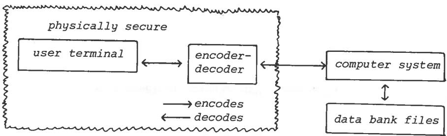
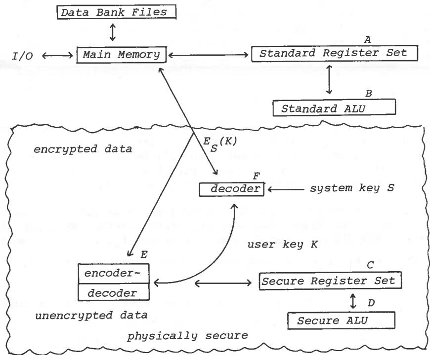

# ON DATA BANKS AND PRIVACY HOMOMORPHISMS

Ronald L. Rivest

Len Adleman

Michael L. Dertouzos

Massachusetts Institute of Technology

Cambridge, Massachusetts

# I. INTRODUCTION

Encryption is a well-known technique for preserving the privacy of sensitive information. One of the basic, apparently inherent, limitations of this technique is that an information system working with encrypted data can at most store or retrieve the data for the user; any more complicated operations seem to require that the data be decrypted before being operated on. This limitation follows from the choice of encryption functions used, however, and although there are some truly inherent limitations on what can be accomplished, we shall see that it appears likely that there exist encryption functions which permit encrypted data to be operated on without preliminary decryption of the operands, for many sets of interesting operations. These special encryption functions we call "privacy homomorphisms"; they form an interesting subset of arbitrary encryption schemes (called "privacy transformations").

As a sample application, consider a small loan company which uses a commercial time-sharing service to store its records. The loan company's "data bank" obviously contains sensitive information which should be kept private. On the other hand, suppose that the information protection techniques employed by the time-sharing service are not considered adequate by the loan company. In particular, the systems programmers would presumably have access to the sensitive information. The loan company therefore decides to encrypt all of its data kept in the data bank and to maintain a policy of only decrypting data at the home office -- data will never be decrypted by the time-shared computer. The situation is thus that of Figure 1, where the wavy line encircles the physically secure premises of the loan company.

Figure 1

This organization permits the loan company to utilize the storage facilities of the time-sharing service, but generally makes it difficult to utilize the computational facilities without compromising the privacy of the stored data. The loan company, however, wishes to be able to answer such questions as:

- What is the size of the average loan outstanding?

- How much income from loan payments is expected next month?

 How many loans over $5,000 have been granted?

These questions require computation for their answers.

There are four possibilities that the loan company may pursue:

(1) Give up the idea of using the time-shared service and purchase an in-house computer system.

(2) Use the storage facilities of the time-sharing service only to store the encrypted data, and use an "intelligent terminal" at the loan company office to do the necessary decryption and computation.

(3) Persuade the time-sharing company to make hardware modifications to its computer allowing the data to exist in decrypted form for brief moments inside its CPU, but such that the decrypted data is not externally accessible.

(4) Use a special privacy homomorphism to encrypt its data so that the time-shared computer can operate on the data without the necessity of decrypting it first.

Option (1) can be very expensive, and does not necessarily solve the problem -- some form of encryption may be desired to protect the stored information against theft or malicious tampering by the in-house systems programmers. Option (2) will work, but entails rather large communications costs in general. Option (3) is also workable, but requires the cooperation of the time-sharing company. In section 2, we discuss this solution briefly. Option (4) requires only that a suitable privacy homomorphism

exist and that the loan company obtain an encryption/decryption device implementing this homomorphism. In sections 3 to 5, we examine the mathematical requirements for such a solution, some limitations on its applicability, and some potentially useful privacy homomorphisms, respectively.

# II. SOLUTION BY HARDWARE MODIFICATION

In figure 2, we present a sketch of how a computer system might be modified to solve the problem of performing operations on encrypted data securely. In addition to the standard register set and ALU (A,B), a physically secure register set and ALU (C,D) are added. All communication of data between main memory and the physically secure register set passes through an encoder-decoder (E) supplied with the user's key, so that unencrypted data can exist only within the physically secure register set. All sensitive data in main memory, in the data bank files, in the ordinary register set, and on the communications channel will be encrypted. During operation, a load/store instruction between main memory and the secure register set will automatically cause the appropriate decryption/encryption operations to be performed.

Figure 2

An obvious problem is getting the encoder/decoder (E) loaded with the user's key K without compromising the security of the user's key. One possible approach is to keep the user's key encrypted under control of a system key S. The encrypted form of K,  $E_{S}(K)$ , can be transmitted over the insecure channel to the system, decrypted by the physically secure decoder (F), and loaded into the encoder-decoder (E). The user knows K and  $E_{S}(K)$ ; the latter is obtained during a visit to the time-shared services manager, who is the only one who knows the system key S.

Besides the problems of key management, there are questions of the speed degradation caused by invoking the encryption/decryption with every load or store. However, it appears that suitably secure encryption (e.g. DES) can be performed on a time scale comparable to that of the instruction execution of many machines (e.g. 10 m sec).

The most severe restriction on this solution, however, is one that will turn out to be a restriction on any solution to the problem (even privacy homomorphisms): it is not possible to simultaneously preserve security and give the system the operation of performing comparisons against known constants. That is, we may not give the computer system a means of performing operations sufficiently powerful to enable someone who knows only  $\mathbf{E}_{\mathrm{S}}(\mathbf{K})$  to decrypt the data. The ability to perform comparisons against constants would allow someone to perform a simple binary search procedure to determine the decoded value of any datum. We examine this restriction in more detail in section 4.

# III. PRIVACY HOMOMORPHISMS

One might prefer a solution which did not require decryption of the user's data (except of course at the user's terminal). That is, the hardware configuration will be that of Figure 1, but the encryption function used will permit the computer system to operate on the data without decrypting it.

The unencoded data and the operations to be performed on it, we assume to be drawn from some algebraic system. An algebraic system consists of a set S, some operations  $f_1, f_2, \ldots$ , some predicates  $p_1, p_2, \ldots$ , and some distinguished constants  $s_1, s_2, \ldots$ . We denote this system by  $<S; f_1, f_2, \ldots; p_1, p_2, \ldots; s_1, s_2, \ldots>$ . For example, the system consisting of the integers under the usual set of operations might be denoted  $<Z; +, -, x, \div; \leq; 0, 1>$ ; where Z is the set of integers.

In addition to the algebraic system of the user (let's call it U), we shall need another algebraic system C to be used by the computer system. Encoding and decoding shall then mean mapping elements from U to C or vice versa, respectively. More formally, if

$$
U = <   S; f _ {1}, \dots , f _ {k}; p _ {1}, \dots , p _ {\ell}; s _ {1}, \dots , s _ {m} >
$$

then

$$
C = <   S ^ {\prime}; f _ {1} ^ {\prime}, \dots , f _ {k} ^ {\prime}; p _ {1} ^ {\prime}, \dots , P _ {2} ^ {\prime}; s _ {1} ^ {\prime}, \dots , s _ {m} ^ {\prime} >
$$

and we must have a decoding function  $\phi: S' \to S$  and its inverse, the encoding function  $\phi^{-1}: S \to S'$ .

In operation, the user gives the computer system a description of the algebraic system C; in practice this means that the system has a subroutine to compute each of the operations  $f_i'$  and predicates  $p_i'$ , as well as representations of the distinguished constants  $s_i'$ . The users actual data base we denote as the sequence  $d_1, d_2, \ldots$ , each  $d_1$  is an element of S. However, the user encodes each datum before giving it to the system; the encoded data base  $\phi^{-1}(d_1), \phi^{-1}(d_2), \ldots$ .

In order for the system to be able to operate on the (coded) data base without decrypting it, the decoding function  $\phi$  must be a homomorphism from C onto U. Formally, this means that

$$
\begin{array}{l} (\forall i) (a, b, c, \dots) [ f _ {i} ^ {\prime} (a, b, \dots) = c = > f _ {i} (\phi (a), \phi (b), \dots) = \phi (c) ], \\ (\forall i) (a, b, \dots) p ^ {\prime} (a, b, \dots) \equiv p (\phi (a), \phi (b), \dots), \\ \end{array}
$$

and

$$
(\forall i) \phi \left(s _ {i} ^ {\prime}\right) = s _ {i};
$$

$\phi$  carries each operation in  $\mathbf{C}$  into the corresponding operation in U. Suppose now that the user wants to know the value of  $f_{1}(d_{1}, d_{2})$ . He asks the system to compute  $f_{1}'(\phi^{-1}(d_{1}), \phi^{-1}(d_{2}))$ . Since  $\phi$  is a homomorphism,

$$
\phi \left(f _ {1} ^ {\prime} \left(\phi^ {- 1} \left(d _ {1}\right), \phi^ {- 1} \left(d _ {2}\right)\right)\right) = f _ {1} \left(d _ {1}, d _ {2}\right)
$$

so that the system arrives at the encrypted form of the answer without having to decrypt the intermediate results. In general, an arbitrary computer program using the operations of U to compute some function of the user's data base can be transformed into another computer program suitable for operation on the encoded data merely by changing all  $f_{i}$ 's to  $f_{i}'$ 's, all  $p_{i}$ 's to  $p_{i}'$ 's,

and all  $s_i$ 's to  $s_i'$ 's.

The requirements on the choice of the algebraic system  $C$  and the functions  $\phi, \phi^{-1}$  are:

(1)  $\phi$  and  $\phi^{-1}$ , the decoding and encoding functions, should be easy to compute.

(2) The operations  $f_{i}^{\prime}$  and predicates  $p_{i}^{\prime}$  in C should be efficiently computable.

(3) An encoded version of a datum  $d_{i}$ ,  $\phi^{-1}(d_{i})$ , should not require much more space to represent than a representation of  $d_{i}$ .

(4) Knowledge of  $\phi^{-1}(d_i)$  for many data  $d_i$  should not be sufficient to reveal  $\phi$ . (Ciphertext only only attack).

(5) Knowledge of  $d_i$  and  $\phi^{-1}(d_i)$  for several values of  $d_i$  should not reveal  $\phi$ . (Chosen plaintext attack).

(6) The operations and predicates in C should not be sufficient to yield an efficient computation of  $\phi$ . (This relates primarily to the use of comparisons).

# IV. SOME SIMPLE OBSERVATIONS

Some inherent restrictions limit the utility of privacy homomorphisms as we have described. The most severe is probably the following.

Fact. If the operations available in C allow the computer system to determine the encoded version of arbitrary constants, and a predicate " $\underline{\underline{\mathbf{\Pi}}}$ " for a total order is available, then there is no secure privacy homomorphism from C to U.

This follows from a simple "binary search" strategy. For example, for the system of natural numbers

$$
U = <   N; +; \leq ; 0, 1 >
$$

and

$$
C = <   W; + ^ {\prime}; \leq ; 0 ^ {\prime}, 1 ^ {\prime} >
$$

for some set  $W$ , the malicious systems programmer on the computer system can decode  $\phi^{-1}(d_i)$  by computing  $\phi^{-1}(1) = 1'$ ,  $\phi^{-1}(2) = 1' + 1'$ ,  $\phi^{-1}(4) = \phi^{-1}(2) + \phi^{-1}(2)$ , and so on until he finds a k such that  $\phi^{-1}(2^k) \geq \phi^{-1}(d_i)$ . Continuing, similar strategy enables him to compute  $d_i$  exactly.

Other facts about the ability of one system to simulate another are not quite so easy to see, but can be found. For example, we have the following.

Fact. If  $C$  is over the natural numbers and has the operations of addition, multiplication, and a binary equality predicate and a unary predicate "equal" to zero, then it has the capability to test for equality to an arbitrary constant.

$$
\text {T h e p r o o f f o l l o w s f r o m} x = k <   = > (x \neq 0) \wedge \underbrace {\left(x ^ {2} = x + \cdots + x\right)} _ {k \text {t i m e s}}.
$$

Lynch [1] gives an excellent study of the relationships between one algebraic system and another which simulates  $+$ .

# V. SOME SAMPLE PRIVACY HOMOMORPHISMS

We give here four sample privacy homomorphisms. These are intended primarily as examples to support the hypothesis that useful privacy homomorphisms may exist for many applications. Some of them are rather weak cryptographically; a "chosen plaintext attack" may break them. We list them anyway to illustrate the kinds of privacy homomorphisms that may exist.

$$
\text {E x a m p l e} \quad 1. \quad \text {S u p p o s e} \mathrm {U} = <   \mathrm {Z} _ {\mathrm {p} - 1}; + _ {\mathrm {p} - 1}, - _ {\mathrm {p} - 1} >, \text {t h e s y s t e m o f}
$$

integers modulo p-1 with the operations of addition and subtraction, where p is a prime number. We may choose  $C = \langle Z_n; x_n, \div_n \rangle$ , the integers modulo n where  $n = p \cdot q$ , the product of p and a large prime q. Let g be a generator modulo p. Then we choose

$$
\phi^ {- 1} (x) \equiv g ^ {x} (\text {m o d u l o} n)
$$

and the decoding function is the inverse "mod(p) logarithm, base  $g$ " function. By the laws of exponents,  $\phi$  is a homomorphism. If  $n$  is difficult to factor (both  $p$  and  $q$  are large) and the prime  $p$  is such that logarithms modulo  $p$  can be efficiently computed (see [2]), then the computer system can be given both  $g$  and  $n$  without fear of compromising the security of the data.

Example 2. Suppose  $\mathrm{U} = <\mathrm{Z}_{\mathrm{p}}; \mathrm{x}_{\mathrm{p}}; \equiv_{\mathrm{p}} >$ , the integers modulo  $\mathfrak{p}$  with multiplication and test for equality. Again, letting  $n = p \cdot q$ , where  $q$  is a large prime and supposing that  $n$  is difficult to factor, we may take

$$
\phi^ {- 1} (x) = x ^ {e} (\mod n).
$$

Since  $(\mathbf{x}^{\mathrm{e}})(\mathbf{y}^{\mathrm{e}}) = (\mathbf{xy})^{\mathrm{e}}$ , this is a homomorphism. This is, in fact, the encoding function used by Rivest, Shamir, and Adleman in their method of implementing public-key cryptosystems [3]. The security of this system should be very good, even if the computer system is given both e and n.

Example 3.  $U = \langle Z_n; +_n, -_n, x_n \rangle$ , where  $n$  is again the product of two large primes  $p$  and  $q$  such that  $n$  is difficult to factor. We choose to represent each element of  $Z_n$  by a pair of numbers:

$$
\phi^ {- 1} (x) = (x \bmod p, x \bmod q).
$$

The computer system forms the sum, difference, or product of two encodings by performing the operations componentwise, modulo  $n$ . Without knowing  $p$  and  $q$ , the system is not able to decode any numbers. Since there are several possible encodings of a given number, test for equality is not possible.

Example 4. Suppose  $U = \langle Z; +, -, x \rangle$ , the system of integers under the usual operations of addition, subtraction, and multiplication. The user chooses an integer  $n$  and represents all of his data in radix-n notation. The computer system can operate on these values without knowing  $n$  (and thus without knowing the unencrypted data) by allowing individual coordinate positions to exceed  $n$ . For example, if  $n = 17$ , we have

$$
\begin{array}{l} \phi^ {- 1} (2 3) = (1, 4) \\ \phi^ {- 1} (4 4) = (2, 1 0) \\ \phi^ {- 1} (1 0 1 2) = \phi^ {- 1} (2 3 \cdot 4 4) = (2, 1 8, 4 0). \\ \end{array}
$$

Again, test for equality are not possible since a given number might have several representations. The computer system can also find an encoding of any given constant by just using that constant in the units position.

By combining two systems of the above sort, one can implement the rational numbers using "fractions". This system is not really secure against a "chosen plaintext attack", although it has many good properties otherwise.

Example 5. Suppose we again have  $U = \langle Z; +, -, x \rangle$ , the system of integers under the operations of addition, subtraction, and multiplication. Let  $k$  be chosen so that all intermediate results used in any calculation are less than  $2^k$ , and let  $a_0, a_1, \ldots, a_{k-1}$  be  $k$  randomly chosen integers. The encoding of the integer  $x$ , where  $x = x_{k-1} \ldots x_1x_0$  in binary notation (each  $x_i$  is 0 or 1)

is the  $k$ -tuple  $(f_{x}(a_0), f_{x}(a_1), \ldots, f_{x}(a_{k-1}))$  where

$$
f _ {x} (z) = \sum_ {i = 0} ^ {k - 1} x _ {i} \cdot z ^ {i}.
$$

The encoded representations can be operated upon componentwise. Decoding means interpolating a polynomial through the given values and then evaluating that polynomial at the point  $Z = 2$ . This privacy homomorphism is not very space efficient. The security of the system, even against a chosen plaintext attack, looks like it involves solving high-order nonlinear equations for the  $a_{i}$ 's, but there are possibly cryptanalytic shortcuts.

# VI. CONCLUSIONS

Privacy homomorphisms provide a novel way of ensuring the privacy of data which must be operated on. They are of inherently limited applicability, since comparisons may not in general be included in the set of operations to be used. In addition, it remains to be seen whether it is possible to have a privacy homomorphism with a large set of operations which is highly secure. The results presented here give a basis for some optimism about finding useful privacy homomorphisms; the examples given here are suggestive if not very practical. The open questions are

- Does this approach have enough utility to make it worthwhile in practice?

- For what algebraic systems  $U$  does a useful privacy homomorphism exist?

# REFERENCES

[1] Lynch, N. and E. Blum, "Efficient Reducibility Between Programming Systems", Proc. 9th Annual ACM Symposium on Theory of Computing, (Boulder, May 1977), pp. 228-238.

[2] Pohlig, S. and M. Hellman, "An Improved Algorithm for Computing Logarithms Over GF(p) and Its Cryptographic Significance" (to appear IEEE Trans. Info. Theory).

[3] Rivest, R., A. Shamir, and L. Adleman, "A Method For Obtaining Digital Signatures and Public-Key Crypto Systems", Massachusetts Institute of Technology, Laboratory for Computer Science, Technical Memo, TM-82, April 1977. (to appear in CACM).

# DISCUSSION

Rabin: I would like to mention an additional consideration concerning safety. One of the most attractive proposals here was really doing the arithmetic modulo. When  $n$  is the product of  $p$  and  $q$  and when you do the component-wise modular arithmetic, you don't do it modulo  $p$  and  $q$  separately, you do it in modulo  $n$  arithmetic. That looks pretty good because we don't know how to factor numbers. However, a possibility for cracking any of these systems, is that the adversary has a special knowledge. Sometimes the adversary has under his control, part of the input data. He is the depositor in a bank which is manipulating his bank account. So, he actually knows the values of  $A$ ,  $B$ ,  $C$  and so on which are being encoded. Now, one would have to consider the possibility of looking at the encoding, one might be able to find the factorization of  $n$  in this particular case.

Rivest: It's quite plausible that one might be able to break it, then.

Rabin: Yes, and there are similar considerations of challenging the system by feeding it known information and following its course within the encrypted version, feeding it encrypted information and following its course must be taken into account when we're evaluating its safety.

Gaines: Maybe I misunderstood, but I thought that p and q would be chosen outside the system. Separately for each individual. So that no one would have the opportunity to do what you said.

Rabin: May I add a remark? If you then propose to have different  $p$  and  $q$  for each customer, which is quite difficult and impractical, sometimes a non-innocent by-stander has knowledge of how much money you deposited. The other problem again exists. You must assume at least spotty partial information about the data which is going to be protected.

Rivest: All the systems I've presented, I think, are susceptible to variations of that kind of attack. I do not consider any of them very satisfactory for precisely those kinds of reasons.