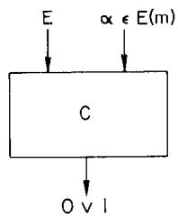
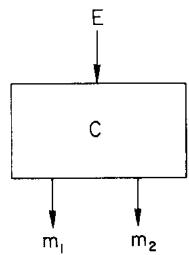

# Probabilistic Encryption*

# SHAFI GOLDWASSER AND SILVIO MICALI

Laboratory of Computer Science, Massachusetts Institute of Technology, Cambridge, Massachusetts 02139

Received February 3, 1983; revised November 8, 1983

A new probabilistic model of data encryption is introduced. For this model, under suitable complexity assumptions, it is proved that extracting any information about the cleartext from the cyphertext is hard on the average for an adversary with polynomially bounded computational resources. The proof holds for any message space with any probability distribution. The first implementation of this model is presented. The security of this implementation is proved under the intractability assumption of deciding Quadratic Residuosity modulo composite numbers whose factorization is unknown.

# 1. INTRODUCTION

This paper proposes an encryption scheme that possesses the following property:

Whatever is efficiently computable about the cleartext given the cyphertext, is also efficiently computable without the cyphertext.

The security of our encryption scheme is based on complexity theory. Thus, when we say that it is "impossible" for an adversary to compute any information about the cleartext from the cyphertext we mean that it is not computationally feasible.

The relatively young field of complexity theory has not yet been able to prove a nonlinear lower bound for even one natural NP-complete problem. At the same time, despite the enormous mathematical effort, some problems in number theory have for centuries refused any "domestication." Thus, for concretely implementing our scheme, we assume the intractability of some problems in number theory such as factoring or deciding quadratic residuosity with respect to composite moduli. In this context, proving that a problem is hard means to prove it equivalent to one of the above mentioned problems. In other words, any threat to the security of the concrete implementation of our encryption scheme will result in an efficient algorithm for deciding quadratic residuosity modulo composite integers.

* This research was done when both authors were students at the University of California at Berkeley and supported in part by NSF Grant MCS 82-04506. The preparation of this manuscript was done when the first author was at the Laboratory of Computer Science at MIT and supported by a Bantrell fellowship and an IBM faculty development award, and the second author was at the Computer Science Department at the University of Toronto.

# 1.1. Deterministic Encryption: The Trapdoor Function Model

Our encryption scheme benefits from the ideas of Diffie and Hellman [9], Rivest, Shamir, and Adleman [21], and Rabin [20].

Diffie and Hellman [9] introduced the idea of a public key cryptosystem, which is based on the intractability of some underlying computational problem. Intuitively, the idea is to find an encryption function  $E$  which is easy to compute but difficult to invert unless some secret information, the trapdoor, is known. Such a function is called a trapdoor function. To encrypt a message  $m$ , anyone simply evaluates  $E(m)$ , but only those who know the trapdoor information can compute  $m$  from  $E(m)$ .

The two implementations of a trapdoor function most relevant and inspiring for this paper are the RSA function [21], due to Rivest, Shamir, and Adleman, and its particularization suggested by Rabin [20].

# 1.2. Basic Objections to the Trapdoor Function Model

We point out two basic weaknesses of this approach:

(1) The fact that  $f$  is a trapdoor function does not rule out the possibility of computing  $x$  from  $f(x)$  when  $x$  is of a special form. Usually messages do not consist of numbers chosen at random but possess more structure. Such structural information may help in decoding. For example, a function  $f$ , which is hard to invert on a generic input, could conceivably be easy to invert on the ASCII representations of English sentences.

(2) The fact that  $f$  is a trapdoor function does not rule out the possibility of easily computing some partial information about  $x$  (even every other bit of  $x$ ) from  $f(x)$ . Encrypting messages in a way that ensures the secrecy of all partial information is an important goal in cryptography. Assume we want to use encryption to play card games over the telephone. If the suit or color of a card could be compromised the whole game should be invalid. Indeed Lipton [17] has pointed out that one bit of information about cards to remain hidden can be easily computed in the SRA implementation of Mental Poker [22].

Though no one knows how to break the RSA or the Rabin scheme, in none of these schemes is it proved that decoding is hard without any assumptions made on the message space. Rabin shows that, in this scheme, decoding is hard for an adversary if the set of possible messages has some density property. We discuss this further in Section 2.

# 1.3. Probabilistic Encryption: The New Model

In this paper we switch from a deterministic framework to a probabilistic framework. This enables us to deal with the problems that arose with the trapdoor function model, without imposing any probability structure on the messages we would like to send.

We replace the notion of a trapdoor function with the notion of an unapproximable trapdoor predicate. Briefly, the predicate  $B$  is trapdoor and unapproximable if anyone can select an  $x$  such that  $B(x) = 0$  or  $y$  such that  $B(y) = 1$ , but only those who know the trapdoor information can, given  $z$ , compute the value of  $B(z)$ . When the trapdoor information is unknown, an adversary with polynomially bounded computational resources can not decide the value of  $B(z)$  better than guessing at random (see Section 3 for formal definition).

We replace deterministic block encryption by probabilistic encryption of single bits, where there are many different encodings of a "1" and many different encodings of a "0." To encrypt each message we make use of a fair coin. Thus the encoding of each message will depend on the message plus the result of a sequence of coin tosses. More specifically, a binary message will be encrypted bit-by-bit as follows: a "0" is encoded by randomly selecting an  $x$  such that  $B(x) = 0$  and a "1" is encoded by randomly selecting an  $x$  such that  $B(x) = 1$ . Consequently, there are many possible encodings for each message. However, messages are always uniquely decodable.

Two properties of the new model are:

(1) Decoding is easy for the legal receiver of a message, who knows the trapdoor information, but provably hard for an adversary. Therefore the spirit of a trapdoor function is maintained. In addition, in our scheme, we do not impose any restrictions on the message space. The security of the scheme is proved for messages belonging to any message space with any probability distribution.

(2) No information about an encrypted message can be obtained by an adversary.

Let  $g \colon M \to V$  be a nonconstant function  $m$ . Assume that the message space  $M$  has some probability distribution. Accordingly, let  $p_v = \mathrm{prob}(g(m) = v \mid m \in M)$  for each  $v \in V$ , and let  $\bar{v} \in V$  be such that  $p_{\bar{v}} = \max_{v \in V} p_v$ . Then, without any special ability, an adversary given the cyphertext, can always guess the value of  $g$  over the cleartext and be correct with probability  $p_{\bar{v}}$ . We prove that for a probabilistic encryption scheme, an adversary, given the cyphertext, cannot guess the value of  $g$  over the cleartext with probability better than  $p_{\bar{v}}$ . Note that  $g$  needs not be polynomially computable, or even recursive. Thus, our encryption model passes a polynomially bounded version of Shannon's perfect secrecy definition; see Subsection 7.3.

This property enabled Goldwasser and Micali [11] to device a scheme for Mental Poker for which, under the Quadratic Residuosity Assumption, no partial information about cards that should remain hidden can be easily computed.

# 1.4. Concrete Implementation of the New Model

We introduce Quadratic Residuosity modulo composite integers whose factorization is unknown (see Section 6 for precise definition), as the first example of an unapproximable trapdoor predicate. Thus we introduce a new probabilistic public key cryptosystem that is secure in a very strong probabilistic sense if and only if

deciding quadratic residuosity with composite moduli is hard (see Section 4). The security offered by this Public Key Cryptosystems extends to all partial information about encrypted messages, to all possible message spaces and to all possible probability distributions for the message space (see Section 5 for formal definition of security).

Another example of such predicates, has appeared in a Goldwasser, Micali, and Tong [12] and in Goldwasser [13]. The predicate they propose is unapproximable if and only if factoring composite numbers is hard. Using the construction of Section 4, we can build a public key cryptosystem based on the predicate they propose. Again, any threat to the security of this last cryptosystem, will result in an efficient factoring algorithm.

In [26], Yao shows that unapproximable trapdoor predicates exist if one-to-one trapdoor functions exist.

# 1.5. Related Work

Blum and Micali in [5] showed the first example of an unapproximable predicate which is not trapdoor. Their predicate is unapproximable if and only if the discrete logarithm problem is hard.

The quadratic residuosity predicate is not only an example of an unapproximable trapdoor predicate, but possesses other properties which make it particularly attractive for protocol design. It has been widely used since we first proposed it in [10]. The first protocol that uses this predicate was suggested by Goldwasser and Micali in [11]. They design a protocol for two players to play mental poker over the telephone, so that no player can obtain any partial information about cards not in his hand. Other works in which this predicate has proved useful are: Blum, Blum, and Shub's implementation [4] of a cryptographically strong pseudo random bit generator [5], Brassard's [7] implementation of authentication tags, Luby, Micali, and Rackoff's [19] method for simultaneously exchanging a secret bit, and Vazirani and Vazirani's [25] implementation of one bit disclosures.

# 2. SURVEY OF PUBLIC KEY CRYPTOSYSTEMS BASED ON TRAPDOOR FUNCTIONS

All the number theoretic notation used in this section will be defined in Section 3.

# 2.1. What Is a Public Key Cryptosystem?

The concept of a Public Key Cryptosystem was introduced by Diffie and Hellman in their ingenious paper [9]. Let  $M$  be a finite message space, let  $\{A, B, \ldots\}$  be users, and let  $m \in M$  denote a message. Let  $E_A \colon M \to M$  be  $A$ 's encryption function, which is ideally bijective, and  $D_A$  be  $A$ 's decryption function such that  $D_A(E_A(m)) = m$  for all  $m \in M$ . In a Public Key Cryptosystem  $E_A$  is placed in a public file, and user  $A$  keeps  $D_A$  private.  $D_A$  should be difficult to compute knowing only  $E_A$ . To send message  $m$

to  $A, B$  takes  $E_A$  from the public file, computes  $E_A(m)$  and sends this message to  $A$ . A easily computes  $D_A(E_A(m))$  to obtain  $m$ .

# 2.2. The RSA Scheme and the Rabin Scheme

Two implementations of such encryption functions  $E_{A}$  are the RSA function [21] of Rivest et al. and the Rabin function [20].

The key idea in both the RSA scheme and the Rabin scheme consists in the selection of an appropriate number theoretic trapdoor function. In the RSA scheme, user  $A$  selects  $n$ , the product of two large distinct primes  $p_1$  and  $p_2$  and a number  $s$  such that  $s$  and  $\varphi(n)$  are relatively prime, where  $\varphi$  is the Euler totient function.  $A$  puts  $n$  and  $s$  in a public file and keeps the factorization of  $n$  private. Let  $Z_n^* = \{x \in N : 1 \leqslant x \leqslant n - 1 \text{ and } x \text{ and } n \text{ are relatively prime}\}$ . For every message  $m \in Z_n^*$ ,  $E_A(m) = m^s \bmod n$ . Clearly, the ability to take  $s$ th roots mod  $n$  implies the ability to decode.  $A$ , who knows the factorization of  $n$ , can easily take  $s$ th roots mod  $n$ . No efficient way to take  $s$ th roots mod  $n$  is known when the factorization of  $n$  is unknown.

Rabin suggested to modify the RSA scheme by choosing  $s = 2$ . Thus, for all users  $A$ ,  $E_A(x) = x^2 \mod n$ . Notice that  $E_A$  is a 4-1 function because our  $n$  is the product of two primes. In fact, every quadratic residue mod  $n$ , i.e., every  $q$  such that  $q \equiv x^2 \mod n$  for some  $x \in Z_n^*$ , has four square roots mod  $n$ :  $\pm x \mod n$  and  $\pm y \mod n$ . As  $A$  knows the factorization of  $n$ , upon receiving the encrypted message  $m^2 \mod n$ , she could easily compute its four square roots and get the message  $m$ . (A may compute square roots mod  $n$  by first computing square roots mod  $p_1$  and  $p_2$  and then by combining them via the Chinese Remainder Theorem.) The following heuristics may be suggested for eliminating ambiguity in decoding: for sending a message  $m$ , send  $m^2 \mod n$  together with the last 20 bits of  $m$ . Such extra information cannot effectively help in decoding: one could always guess the last 20 digits of  $m$ . (To avoid publicizing the last 20 digits of  $m$ , just select a 20-bit random integer  $r$  and send  $(m2^{20} + r)^2 \mod n$  together with  $r$ .)

The following theorem shows how hard it is to invert Rabin's function  $x^{2} \mod n$ .

THEOREM (Rabin). If for a  $1 / \log n$  fraction of the quadratic residues  $q$  mod  $n$  one could find one square root of  $q$ , then one could factor  $n$  in random polynomial time.

The theorem follows from Lemma 1 which we state without proof.

LEMMA 1. Given  $x, y \in Z_n^*$  such that  $x^2 \equiv y^2 \mod n$  and  $x \neq \pm y \mod n$ , there is a polynomial time algorithm to factor  $n$ . (In fact the greatest common divisor of  $n$  and  $x \pm y$  is a factor of  $n$ .)

Informal Proof of Rabin's Theorem. Assume that we have a magic box MB such

that given  $q$ , a quadratic residue mod  $n$ , for a fraction  $1 / \log n$  of the  $q$ 's it outputs one square root of  $q \mod n$ . Then we could factor  $n$  by iterating the following step:

Pick  $i$  at random in  $Z_{n}^{*}$  and compute  $q = i^{2} \mod n$ . Feed the magic box MB with  $q$ . If  $M$  outputs a square root of  $q$  different from  $i$  or  $-i \mod n$ , then (by Lemma 1) factor  $n$ .

The expected number of iterations is low, as at each step, we have a  $1/2 \log n$  chance of factoring  $n$ .

# 2.3. Objections to Cryptosystems Based on Trapdoor Functions

The following problems may arise in the RSA and Rabin schemes and, more generally, in any other Public Key Cryptosystem based on trapdoor functions:

(1) The fact that  $f$  is a trapdoor function does not rule out the possibility of computing  $x$  from  $f(x)$  when  $x$  is of special form.

(2) The fact that  $f$  is trapdoor function does not rule out the possibility of easily computing some partial information about  $x$  from  $f(x)$ .

# 2.3.1. Discussion of Objection 1

One may argue that Rabin's Public Key Cryptosystem is as hard to break as factoring in the following way: whoever can get messages  $m$  from their encryptions  $m^2 \mod n$  for a fraction  $1 / \log n$  of the time, is actually realizing the magic box of Rabin's theorem and thus could efficiently factor  $n$ .

We would like to point out the following fact.

Claim. If  $M$ , the space of messages, is "sparse" in  $Z_{n}^{*}$ , the ability to decode for a fraction  $1 / \log n$  of all messages does not yield a random polynomial time algorithm for factoring.

By "sparse" we mean that for a randomly chosen  $x \in Z_n^*$ , the probability that  $x$  is a message is virtually 0.

Let  $f(x) = x^{2} \mod n$ . Assume that we are able to invert the function  $f$  only on  $f(M)$ . Then, we would have a magic box MB which, on input  $m^{2} \mod n$ , where  $m \in M$ , outputs  $m$ ; and on input  $q \notin \{m^{2} \mod n \mid m \in M\}$ , outputs a correct answer, for a negligible portion of the  $q$ 's. Using such a magic box we could decode, but not factor  $n$  efficiently. Let us look at the above informal proof of Rabin's theorem, using this MB. If we pick  $m \in M$  and input  $m^{2} \mod n$  to MB, then we get  $m$  back and cannot factor. If we pick  $i \notin M$  and input  $i^{2} \mod n$  to MB, then the probability that any of the square roots of  $i^{2} \mod n$ , which are different from  $i$ , belong to  $M$  is practically 0 and we get no answer.

We conclude that for Rabin's function one can decode if and only if one can factor, provided the legal messages are dense in  $Z_{n}^{*}$  (e.g.,  $M = Z_{n}^{*}$  and all messages are equally probable).

# 2.3.2. Discussion of Objection 2

One desirable property for an encryption algorithm is that an adversary should not be able to obtain any partial information about the cleartext from the cyphertext.

For example, let  $f$  be a hashing function or a nonconstant predicate defined on the message space  $M$ . Let  $m \in M$ . If, given the encryption of  $m$ , an adversary can efficiently compute  $f(m)$ , then we say that information about  $m$  can be obtained from the encryption of  $m$ .

Note that if the encryption algorithm,  $E$ , is a trapdoor function, then partial information about the cleartext cannot be hidden. In fact, the following predicate  $B$ , defined on the cleartext, is easy to evaluate from the cyphertext:  $B(x) =$  true if and only if  $E(x)$  is even. We can avoid such problems using probabilistic encryption.

Let us now discuss a crucial question, raised by Brassard [6], closely related to the security of partial information: how to send a single bit securely in a Public Key Cryptosystem.

# 2.3.3. Attempts to Send a Single Bit Securely in Public Key Cryptosystems Based on Trapdoor Functions

Suppose that user  $B$  wants to send a single bit message to user  $A$  in great secrecy. The bit is equally likely to be a 0 or a 1.  $B$  wants no adversary to be able to guess correctly his message  $51\%$  of the time.  $B$  knows that users  $A$ 's public encryption function  $E_A$  is hard to invert and tries to make use of this fact in the following way.

IDEA 1. All users in the system agree on an integer  $i$ . User  $B$  selects  $r \in M$  at random, except for the  $i$ th bit of  $r$ , which will be his message.  $B$  sends  $E_A(r)$  to  $A$ .

$A$  can decode and thus get the desired bit. But what can an adversary do?

Danger. Let  $y = E_A(x)$ , where  $E_A$  is a one way function. Then, given  $y$ , it could be difficult to compute  $x$  but not a specific bit of  $x$ .

EXAMPLE. Let  $p$  be a large prime such that  $p - 1$  has at least one large prime factor. Let  $g$  be a generator for  $Z_p^*$ . Then  $y \equiv g^x \bmod p$  is considered to be a one-way function. But, even though it is difficult to compute  $x$  from  $g^x \bmod p$  (the index finding problem), it is easy to get the last bit of  $x$ . In fact,  $x$  ends in 0 if and only if  $y$  is a quadratic residue mod  $p$ , and there are probabilistic polynomial time algorithms for testing whether numbers are quadratic residues modulo primes  $p$  (see Subsection 3.1).

The following idea was suggested by Donald Johnson.

IDEA 2.  $B$  constructs a 100-bit integer  $x$  as follows: he selects  $8 \leqslant i \leqslant 100$  at random, and sets the  $i$ th bit of  $x$  to the bit he wants to communicate. The remaining 92 bits of  $x$  are chosen at random, except for the first 7 bits of  $x$ , which specify location  $i$ .  $B$  sends  $E_A(x)$  to  $A$ .

Danger.  $E_{A}$  can be a trapdoor function and yet one could, given  $E_{A}(x)$ , easily compute the first 7 bits of  $x$  and one of the last 93 bits of  $x$ . If this is the case, one could correctly compute  $B$ 's message  $x$  with probability  $\frac{1}{92} + \frac{1}{2} \cdot \frac{91}{92}$ .

Summarizing, there are many ways in which a single bit could be "embedded" in a binary number  $x$ . Taking the "exclusive or" of all the digits of  $x$  is just one more example. However, given  $y = E_A(x)$ , being able to discover single bits embedded in  $x$  does not contradict the fact that it is hard to compute  $x$ . Then, what is a secure way to send a single bit? Unapproachable trapdoor predicates will provide a solution to this problem.

# 3. UNAPPROXIMATE TRAPDOOR Predicates

In Section 4 we introduce the model of a probabilistic public key cryptosystem. We show that this model is highly secure. Our model switches from block encryption to bit-by-bit encryption. For this purpose we must abandon the notion of trapdoor functions for the new notion of unapproximable trapdoor predicates.

DEFINITION (ε-approximates). A circuit  $C[\cdot]$  ε-approximates the predicate  $B: \Omega \to \{0, 1\}$  if  $C[x] = B[x]$  for at least a fraction  $\frac{1}{2} + \varepsilon$  of the  $x \in \Omega$ .

We proceed to formally define unapproximable trapdoor predicates.

Let  $N$  denote the set of natural numbers and  $N'$  be an infinite subset of  $N$ . For every  $k \in N'$  let  $S_k$  denote a subset of the  $k$ -bit integers and for every  $i \in S_k$  let  $\Omega_i$  be a subset of the integers with at most  $k$  bits. Let

$$
\mathbf {B} _ {k} = \left\{B _ {i}: \Omega_ {i} \rightarrow \{0, 1 \} \mid i \in S _ {k} \right\}
$$

be a collection of predicates indexed by an integer of size  $k$  and

$$
\mathbf {B} = \bigcup_ {k \in N ^ {\prime}} \mathbf {B} _ {k}.
$$

We say that  $\mathbf{B}$  is an unapproximable trapdoor predicate (UTP) if:

(1) (B is unapproximable): Fix polynomials  $P_{1}$  and  $P_{2}$ . Let  $k \in N'$ . Let  $c_{k}$  denote the size of the minimum size circuit  $C[ \, , \, ]$  such that  $C[ \, , i](1 / P_{1}(k))$ -approximates  $B_{i}$  for at least a fraction  $1 / P_{2}(k)$  of the  $i \in S_{k}$ . We say that  $\mathbf{B}$  is unapproximable if  $c_{k}$  grows faster than any polynomial in  $k$ .

(2) (B is trapdoor): For  $v \in \{0,1\}$  set  $\Omega_i^v = \{x \in \{\Omega_i\} \mid B_i(x) = v\}$ . We say that  $B$  is trapdoor if:

(a) There exists a probabilistic polynomial in  $k$  time Turing machine  $T_{1}$  that on input  $(i, v)$ , where  $i \in S_{k}$  and  $v \in \{0, 1\}$ , selects  $x \in \Omega_{i}^{v}$  with uniform probability.

(b) There exists a function  $\sigma: \bigcup_{k \in N'} S_k \to N$  such that for some polynomial  $Q$ , for all  $x$ ,  $|\sigma(x)| < Q(|x|)$ , and a polynomial time Turing machine  $T_2$  such that  $T_2[i, \sigma(i), x] = B_i(x)$  for all  $i \in S_k$ , and for all  $x \in \Omega_i$ . We call  $\sigma(i)$  the secret of  $i$ .

(c) (constructibility condition): for all  $k \in N'$  it is possible in probabilistic polynomial in  $k$  time to select any pair  $(i \in S_k, \sigma(i))$ , with probability  $1 / |S_k|$ .

Condition (2c), the constructibility condition, guarantees that if someone picks a pair  $(i,\sigma(i))$ , where  $i \in S_k$  and publicizes  $i$ , it will be hard to compute  $B_i(x)$ . Otherwise, suppose the pairs  $(i,\sigma(i))$ ,  $i \in S_k$ , that could be efficiently selected constituted a very small fraction of all possible pairs. Then, an adversary could, from the public  $i$ , find out  $\sigma(i)$  just by repeatedly selecting pairs  $(j,\sigma(j))$  until  $j = i$ .

Remark 3.1. Note that if  $B$  is an unapproximable predicate and  $P_{1}, P_{2}$  are polynomials, then for all sufficiently large  $k$ , for a fraction  $1 - (1 / P_{1}(k))$  of the  $i \in S_{k}$ ,  $|\Omega_{i}^{0}| / |\Omega_{i}|$  and  $|\Omega_{i}^{1}| / |\Omega_{i}|$  are both greater than  $\frac{1}{2} - (1 / P_{2}(k))$ . Otherwise either the trivial circuit  $C_{k}$  that always outputs 0 or the trivial circuit that always outputs 1 would  $(1 / P_{2}(k))$ -approximate  $B_{i}$  for a fraction at least  $1 / P_{1}(k)$  of the  $i \in S_{k}$ .

# 3.1. Quadratic Residuosity as a UTP

We demonstrate an example of an unapproximable trapdoor set of predicates, under the intractability assumption of the Quadratic Residuosity Problem (QRP). If needed the number theoretic definitions can be found in Section 7.

Let  $k \in N$ . Let  $p_1$  and  $p_2$  denote primes. Set,

$$
\begin{array}{l} H _ {k} = \{n \mid n = p _ {1} p _ {2}, \text {w h e r e} | p _ {1} | = | p _ {2} | = k \}, \\ Z _ {n} ^ {*} = \{x \leqslant n \mid (x, n) = 1 \}. \\ \end{array}
$$

And let  $Z_{n}^{1}$  denote the subset of  $Z_{n}^{*}$  containing the elements with Jacobi symbol  $+1$ . For all  $x \in Z_{n}^{1}$ ,  $Q_{n}$  is defined as

$$
\begin{array}{l} Q _ {n} (x) = 1 \quad \text {i f} \quad x \text {i s a q u a d r i c r e s i d u e m o d} n, \\ = 0 \quad \text {i f} \quad x \text {i s a q u a d r a t i c n o n r e s i d u e m o d} n. \\ \end{array}
$$

Let  $k \in N$ . Let  $x$  and  $y$  be binary strings. We denote by  $x \neq y$  the concatenation of  $x$  and  $y$ . Define  $S_{4k} = \{n \neq y \mid n \in H_k$  and  $y \in Z_n^1$  is a quadratic nonresidue mod  $n$ . Define  $\Omega_{n \neq y} = Z_n^1$  and set  $Q_{n \neq y}(x) = Q_n(x)$  for each  $x \in Z_n^1$ . Then  $Q^\# = \{Q_{n \neq y} \mid n \neq y \in S_{4k}\}$  is a set of predicates. The presence of the quadratic nonresidue  $y$  will be needed to show the trapdoorness of  $Q^\#$ .

(1)  $Q^{\#}$  is unapproximal: This is shown in Theorem 2 (Section 7), under the Quadratic Residuosity Assumption.

(2)  $Q^{\#}$  is trapdoor: Letting  $\sigma_{4k}(n \neq y)$  be the factorization of  $n$ ,  $Q^{\#}$  is a trapdoor set of predicates. In fact, if the factorization of  $n$  is known,  $Q_n(\cdot)$  can be computed in  $O(k^3)$  time. Moreover, given  $y$ , a quadratic nonresidue mod  $n$ , we can generate quadratic nonresidues mod  $n$  with uniform probability in probabilistic polynomial in  $k$  time by randomly selecting  $x \in Z_n^*$  and computing  $r = yx^2 \mod n$ .

(3)  $Q^{\#}$  is constructible: Consider the following algorithm that selects one element  $n \neq y \in S_{4k}$ , where  $n \in H_k$  and  $y \in Z_n^{+1}$  is a quadratic nonresidue mod  $n$ .

# Step 1. Flip  $4k$  fair coins.

Step 2. Check whether the first  $k$  outcomes and the second  $k$  outcomes constitute, respectively, the binary representation of a prime  $p_1$  and a prime  $p_2$  each of size  $k$ . If so, let  $n = p_1p_2$  and check if the last  $2k$  bits constitute a quadratic nonresidue  $y \bmod n$ . If so then halt:  $p_1 \cdot p_2 \neq y$  has been selected. Else go to Step 1.

As each element in  $S_{4k}$  can be generated by exactly one  $4k$ -long sequence of coin tosses, the above algorithm selects elements in  $S_{4k}$  with uniform probability. Due to the Prime Number Theorem and the existence of random polynomial time algorithms for primality checking, the above algorithm runs in random  $\text{poly}(k)$  time.

We conclude that, under the QRA,  $Q^{\#}$  is an unapproximable trapdoor predicate.

# 4. PUBLIC KEY CRYPTOSYSTEMS AND PROBABILISTIC PUBLIC KEY CRYPTOSYSTEMS

In the last section we defined UTPs. We are now ready to introduce our probabilistic model of encryption. In Subsection 4.2 we formally define the notion of a public key cryptosystem (PKC) which is parameterized by a security parameter. In Subsection 4.3 we define our model of a probabilistic public key cryptosystem (PPKC). In Subsection 4.4 we present a concrete implementations of this model based on the QRA, the intractability assumption for the Quadratic Residuosity Problem.

# 4.1. Preliminary Notation

The following notation is used throughout the rest of this paper: Let  $\Gamma$  be a probabilistic Turing machine. We write  $\Gamma[\beta]$  to denote the set of possible outputs of  $\Gamma$  on input  $\beta$ . We give  $\Gamma[\beta]$  the following probability distribution: if  $\alpha \in \Gamma[\beta]$  then the probability of  $\alpha$  is the probability that  $\Gamma$  outputs  $\alpha$  on input  $\beta$ .

Let  $T_{1}$  and  $T_{2}$  be Turing machines. By saying that  $T_{1}$  is input to (output by)  $T_{2}$  we mean that a standard encoding of  $T_{1}$  is input to (output by)  $T_{2}$ .

# 4.2. Public Key Cryptosystems

Informally, we think of a PKC as a server. Each user in the system comes to the PKC with a description of his message space and a common security parameter  $k$ . On such inputs, the PKC produces a pair of algorithms: an encryption algorithm (which is possibly probabilistic) and a decryption algorithm. The description of both the encryption algorithm and the decryption algorithm should be short (polynomial in  $k$ ). Moreover, both algorithms should halt in polynomial time. The user stores the (description of the) encryption algorithm in the public file, and keeps secret the (description of the) decryption algorithm.

We proceed to formally define what a PKC is.

We let  $k$  denote a parameter that will be presented in unary to all the algorithms in this paper. Let  $U = \{A, B, \ldots\}$  be a finite set of users.

A message generator is a probabilistic polynomial time Turing machine MG that on input  $k$  outputs a string referred to as a message.

DEFINITION. A Public Key Cryptosystem is a probabilistic polynomial time Turing machine  $\Pi$  that on inputs  $k$  and MG outputs the description of two algorithms,  $E$  and  $D$  such that

(1) for some constants constants  $c$ , on inputs of size  $n$ , both  $E$  and  $D$  halt within  $n^c$  steps, and

(2) for all  $m \in \mathbf{MG}[k]$ ,  $D(E(m)) = m$ .

We call  $E$  an encryption algorithm generated by  $\Pi$ , and  $D$  a decryption algorithm generated by  $\Pi$ . The encryption algorithms generated by  $\Pi$  may be probabilistic.

Remark. Let us stress again that  $\Pi$  is a probabilistic Turing machine, and thus on the same input pair  $(k, \mathbf{MG})$  it may output many different (encryption algorithm, decryption algorithm) pairs. When we are only interested in an encryption algorithm  $E$  generated by  $\Pi$  on inputs  $k$  and  $\mathbf{MG}$ , we will write  $E \in \Pi(k, \mathbf{MG})$ .

# 4.3. Probabilistic Public Key Cryptosystems

Let  $\mathbf{B} = \bigcup_{k\in N'}\mathbf{B}_k$ , where  $\mathbf{B}_k = \{B_i;\Omega_i\to \{0,1\} |i\in S_k\}$ , be an unapproximable trapdoor predicate. A Probabilistic Public Key Cryptosystem (PPKC) with UTP B is a PKC  $\varPi$  that takes as input the security parameter  $k$  and the message generator MG and outputs a pair  $(i,\sigma (i))$ , where  $i\in S_k$  and  $\sigma (i)$  is the secret of  $i$ . This can be done by the constructibility property of  $B$ .

The output  $i \in S_k$  of  $\Pi$  specifies an encryption algorithm  $E$  as follows:  $E$  takes as input an  $l$ -bit binary message  $m = m_1m_2\dots m_l$ . For each  $m_j$  in the binary representation of  $m$ ,  $E$  randomly selects an element  $x_{j} \in \Omega_{l}$  such that  $B_{i}(x_{j}) = m_{j}$  and outputs the  $l$ -tuple  $(x_{1},\dots,x_{l})$ . In virtue of the trapdoor property of  $B$  this can be done in probabilistic time polynomial in  $k$  and  $l$ . The output of  $E$  is bounded by  $O(kl)$ .

In general, consider the binary string  $b = b_{1} \cdots b_{l}$ , where  $b_{j} \in \{0, 1\}$ . We call any

$l$ -tuple  $(x_{1},\ldots ,x_{l})$  such that  $x_{j}\in \Omega_{i}$  and  $B_{i}(x_{j}) = b_{j}$  for all  $1\leqslant j\leqslant l$  a probabilistic encryption of  $b$  using predicate  $B_{i}$ . Thus, note that in contrast with PKCs based on a trapdoor function such as the RSA, in a probabilistic public key cryptosystem every message  $m$  has many possible probabilistic encryptions.

The output  $\sigma(i)$  of  $\Pi$  specifies a decryption algorithm  $D$  as follows: Let  $T$  be a probabilistic polynomial time Turing machine that on inputs  $i \in S_k$ ,  $x \in \Omega_i$ , and  $\sigma(i)$  computes  $B_i(x)$ . Such a  $T$  exists by the trapdoor property of  $B$ . Then  $D$  uses  $T$  as a subroutine as follows: Let  $D$ 's input consist of the  $l$ -tuple  $(x_1, \ldots, x_l)$ , where  $x_j \in \Omega_i$  for every  $1 \leqslant j \leqslant l$ . Then for every  $1 \leqslant j \leqslant l$ ,  $D$  calls  $T$  with inputs  $i$ ,  $\sigma(i)$ ,  $x_j$  to compute  $B_i(x_j)$ , and writes every one of  $T$ s  $l$  answers on its output tape. As  $T$  runs in polynomial time, so does  $D$ .

# 4.4. The Quadratic Residuosity Implementation of a PPKCS

Let us explicitly describe the implementation of a PPKC based on the Quadratic Residuosity Problem.

EXAMPLE 1. Let  $Q^{\#}$  be the unapproximable trapdoor predicate defined in the previous section. Recall,  $Q^{\#} = \{Q_{n\# y} \mid n \neq y \in S_{4k}\}$ , where  $n \in H_k$  and  $y \in Z_n^1$  is a quadratic nonresidue mod  $n$ .

Let  $\Pi$  be a probabilistic public key cryptosystem based on the unapproximable trapdoor predicate  $Q^{\#}$ . Let user input the security parameter  $k$  to  $\Pi$ . On inputs  $k$  and message generator MG,  $\Pi$  works as follows:

(1) it randomly selects two  $k$ -bit primes  $p_1$  and  $p_2$ .

(2) sets  $n = p_1, p_2$ ,

(3) picks  $\nu \in Z_{n}^{1}$  such that  $\nu$  is a quadratic nonresidue modulo  $n$ ,

(4) outputs as an encryption algorithm some standard encoding of the pair  $(n, y)$  and as a decryption algorithm some standard encoding of the pair  $(p_1, p_2)$ .

User  $C$  publicizes the pair  $(n,y)$  keeps secret the pair  $(p_1,p_2)$ .

How to Encrypt

Suppose user  $B$  want to send a binary string  $b = b_{1}\dots b_{l}$  to user  $C$ . Then,

for each  $b_{i}\in b$ $B$  picks  $x\in Z_n^*$  at random if  $b_{i} = 1$  B sets  $e_i = yx^2\bmod n$  else  $\mathbf{B}$  sets  $e_i = x^2\bmod n$ $B$  sends  $C$  the 1-tuple  $(e_1,\dots,e_l) = E_n(b)$

Encoding an  $l$ -bit message  $b$  takes  $O(lk^2)$  time. In general, one bit of cleartext is expanded into  $k$  bits of cyphertext.

How to Decrypt

Suppose user  $C$  receives  $(e_1, \dots, e_l)$ , the encryption of a message  $b$ . Then,

for each  $e_i \in e$ ,

$$
C \text {s e t s} b _ {i} = Q _ {n} (e _ {j}).
$$

(Note: As  $C$  knows the factorization of  $n$ , he can compute  $Q_{n}(x)$ )

$$
C \text {s e t s} b = b _ {1} \dots b _ {l}.
$$

Computing  $b, |b| = l$ , from its encryption requires  $O(lk^3)$  time.

# 5. THE SECURITY OF A PUBLIC KEY CRYPTOSYSTEM

We proceed to discuss the notion of security of a public key cryptosystem. Clearly, the notion of security in a public key cryptosystem depends on the model of possible behavior of an adversary. In this paper the adversary is a passive line-tapper. This adversary knows the message space and its probability distribution, knows the encryption algorithm, is given the ciphertext, and tries, by computing, to retrieve the cleartext.

# 5.1. Polynomial Security

# Informal Setting

Let the message-finder  $F$  and the line-tapper  $T$  be your favorite computational model with polynomially bounded computational resources. Such  $F$  and  $T$  may be polynomial time Turing machines, probabilistic polynomial time Turing machine, "small" circuits etc. Intuitively, we say that a public key cryptosystem is polynomially secure if for all message spaces  $M$  with any probability distribution, the encryption algorithms produced by the server will be such that: the polynomially bounded message finder  $F$  cannot find two messages  $m_{1}$  and  $m_{2}$  in  $M$  whose encryptions are distinguishable by the polynomially bounded line-tapper  $T$ . That is, given  $\alpha$  (an encryption of either  $m_{1}$  or  $m_{2}$ )  $T$  should not have any advantage in understanding which of the two messages is being encoded by  $\alpha$ . Notice that there might very well be a pair of messages whose encryptions are distinguishable by  $T$ , but it will be impossible for the polynomially bounded  $F$  to find such a pair. Note that PKCs generating deterministic encryption algorithms (e.g., RSA) cannot be polynomially secure.

In this paper, the message-finder and the line-tapper are chosen to be circuits.

# Formal Setting

Let  $\pi$  be a PKC. Let MG be a message generator. We write  $M_{k}$  for  $\mathbf{MG}[k]$ . Without loss of generality, we assume that all  $m\in M_k$  have the same length  $l_{k} = Q(k)$  for some polynomial  $Q$ .

FIGURE 1

A  $k$ -line tapper is a circuit  $C$  with one Boolean output and enough Boolean inputs to receive (the description of an encryption algorithm)  $E \in \Pi(k, \mathrm{MG})$  and  $\alpha \in E(m)$ , where  $m \in M_k$  (see Fig. 1). Let  $m_1, m_2 \in M_k$ . Let  $p_1^E$  be the probability with which  $C$  outputs 1 on inputs  $E \in \Pi(k, \mathrm{MG})$  and  $\alpha \in E(m_1)$  and  $p_2^E$  be the probability with which  $C$  outputs 1 on inputs  $E \in \Pi(k, \mathrm{MG})$  and  $\alpha \in E(m_2)$ . We say that  $C$ $P$ -distinguishes  $m_1$  from  $m_2$  with respect to  $E$  if  $|p_1^E - p_2^E| > 1 / P(k)$ .

A  $k$ -message-finder is a circuit  $C$  with  $2l_{k}$  Boolean outputs and enough Boolean inputs to describe an  $E \in \Pi[k, \mathbf{MG}]$ . On input  $E$ ,  $C$  outputs two messages  $m_{1}, m_{2} \in M_{k}$  (see Fig. 2).

Notice that  $F_{k}$  may have a built-in description of MG.

DEFINITION (Polynomially secure public key cryptosystems). Let  $Q$ ,  $P_1$ ,  $P_2$  be polynomials. Let  $\Pi$  be a public key cryptosystem and MG a message generator. Let  $T = \{T_k\}$ , where  $T_k$  is a  $k$ -line-tapper with less than  $Q(k)$  gates. Let  $s_k^T$  be the size of a minimum size message-finder  $F$  that with probability greater than  $1 / P_1(k)$  on input  $E \in \Pi(k, \mathbf{MG})$  and MG outputs two messages  $m_1$  and  $m_2$  in  $M_k$  such that  $T_k$  and  $P_2$ -distinguishes  $m_1$  from  $m_2$ . We say that  $\Pi$  is a polynomially secure with respect to MG if for any sequence of line-tappers  $T$ ,  $s_k^T$  grows faster than any polynomial in  $k$ . We say that  $\Pi$  is a polynomially secure if for any message generator MG,  $\Pi$  is polynomially secure with respect to MG.

Remark. Notice that in the definition of a polynomially secure public key cryptosystem we are not putting any constraints on the probability of  $m_{1}$  and  $m_{2}$ . Thus,

FIGURE 2

not even two messages that are very unlikely to occur and are distinguishable by  $T_{k}$  can be easily found.

It is intuitive, and will be formally proved that polynomial security implies more traditional notions of security. Informally, if a public key cryptosystem is polynomially secure then no polynomially bounded line-tapper  $T$  can, given the cyphertext, retrieve the cleartext or any partial information about it.

We first show that the newly introduced probabilistic PKCs are indeed polynomially secure.

Remarks about Theorem 5.1. The underlying idea of the proof of Theorem 5.1 is a sampling walk. Assume that every vertex  $v$  in a  $d$ -dimensional hypercube  $C$  is labeled with a real number  $\lambda(v)$  in between 0 and 1 and that it is easy to find two vertices  $u$  and  $v$  such that  $|\lambda(u) - \lambda(v)| > \varepsilon$ . Then it is easy to find two adjacent vertices  $s$  and  $t$  such that  $|\lambda(s) - \lambda(t)| > \varepsilon / d$ : just find vertices  $u$  and  $v$  in  $C$  such that  $|\lambda(u) - \lambda(v)| > \varepsilon$ ; then consider  $(\omega_0, \dots, \omega_k)$ , a minimum length vertex-walk from  $u$  to  $v$  and look at the pairs  $(\omega_l, \omega_{l+1})$ .

In our case, every vertex  $v$  of the hypercube is a  $d$ -bit word. The label  $\lambda(v)$  is the frequency with which the line-tapper outputs 1 on the probabilistic encryptions of  $v$ . We quickly approximate these frequencies by sampling. Then we find two adjacent words  $s$  and  $t$  with a jump in their associated frequency, and use  $s$  and  $t$  to approximate the UTP on which the system is based.

THEOREM 5.1. Each probabilistic public key cryptosystem is polynomially secure.

Proof of Theorem 5.1. Let

$$
B = \left\{B _ {i} \colon \Omega_ {i} \rightarrow \{0, 1 \} \mid i \in S _ {k} \text {a n d} k \in N ^ {\prime} \right\}
$$

be an unapproximable trapdoor predicate. Let  $\Pi$  be a PPKC that on inputs  $k$  and MG outputs  $i\in S_k$  and  $\sigma (i)$  with probability  $1 / |S_k|$ . This specifies a probabilistic encryption algorithm  $E$ , as specified in Subsection 4.3. Recall, that  $T_{k}$ , the linetapper, is a poly  $(k)$  size circuit which upon receiving as input  $i$  and a probabilistic encoding of  $m$  in  $M_{k}$  encoded using  $B_{i}$ , outputs either a 0 or a 1.

Let  $f_{i,m}$  be the frequency with which  $T_{k}$  outputs a 1 when given as input all the probabilistic encodings of  $m$  using  $B_{i}$ .

Let  $P_{1}$  and  $P_{2}$  be polynomials. For  $k \in N$  set

$$
\varepsilon_ {k} = \frac {1}{P _ {1} (k)} \quad \text {a n d} \quad \eta_ {k} = \frac {1}{P _ {2} (k)}
$$

and let  $F_{k}$  be a message-finder. Let  $N''$  be an infinite subset of  $N'$ . Assume that for a fraction  $\eta_{k}$  of the  $i \in S_{k}$ $F_{k}$  outputs two messages  $m_{1}^{i}$  and  $m_{2}^{i}$  such that

$$
\left| f _ {i, m _ {1} ^ {i}} - f _ {i, m _ {2} ^ {i}} \right| > \varepsilon_ {k}. \tag {*}
$$

Then we will show that for all  $k \in N''$ , there is a probabilistic poly  $(k, \delta^{-1})$  time Turing machine  $G$  with oracles  $F_k$  and  $T_k$  that with probability  $1 - \delta$ ,  $(\varepsilon_k / 5l_k)$ -approximates  $B_i$  for a fraction  $\eta_k / 2$  of the  $i \in S_k$ .

Consequently, as the size of  $T_{k}$  is bounded by a polynomial in  $k$ , if also the size of  $F_{k}$  were bounded by a polynomial in  $k$ ,  $G$  could easily be converted, for each  $k \in N''$ , into a poly  $(k)$  size circuit  $C_{k}$  that  $(\varepsilon_{k} / 5l_{k})$ -approximates  $B_{i}$  for at least a fraction  $\eta_{k} / 2$  of the  $i \in S_{k}$ . This would contradict the unapproximability of  $B$ . Thus, the size of  $F_{k}$  must grow faster than any polynomial in  $k$  and  $\Pi$  is polynomially secure.

The Hamming distance between  $a$  and  $b \in \{0, 1\}^{l_k}$  is the number of bits in which  $a$  and  $b$  differ, and we say that  $a$  and  $b$  are adjacent if the distance between them is 1.

We proceed to construct the Turing machine  $G$ . Let  $\Omega_{k}^{l_{k}}$  denote the set of all  $l_{k}$ -long sequences of elements of  $\Omega_{i}$ . On input  $i \in S_{k}$  and  $y \in \Omega_{i}$ ,  $G$  guesses  $B_{i}(y)$  as follows:

Part 1. It calls the oracle  $F_{k}$  with input  $i$  to find  $m_{1}^{i}$  and  $m_{2}^{i}$  in  $M_{k}$  such that

$$
\left| f _ {i, m _ {1} ^ {i}} - f _ {i, m _ {2} ^ {i}} \right| > \varepsilon_ {k}. \tag {*}
$$

Let  $\Delta$  be the distance between  $m_1^i$  and  $m_2^i$ . Let  $a_0, a_1, \ldots, a_\Delta$  be a sequence of  $l_k$ -bit strings such that  $a_0 = m_1$ ,  $a_\Delta = m_2$  and  $a_j$  is adjacent to  $a_{j+1}$  for  $0 \leqslant j < \Delta$ . As  $|f_{i,m_1^i} - f_{i,m_2^i}| > \varepsilon_k$  there must exist  $x, 0 \leqslant x \leqslant \Delta - 1$ , such that  $|f_{i,a_x} - f_{i,a_{x+1}}| > \varepsilon_k / l_k$ .

Assign  $\Omega_{i}$  and  $\Omega_{i}^{l_{k}}$  the uniform probability distribution. By the trapdoor property of  $B$ , in probabilistic poly  $(k, \delta^{-1})$  time, such  $a_{x}$  and  $a_{x+1}$  can be correctly found with probability greater than  $1 - \delta$  by means of a Monte Carlo experiment. For notational convenience, let  $s = a_{x}$  and  $t = a_{x+1}$ . Compute  $f_{i,s}$  and  $f_{i,t}$ .

As  $s = (s_1, \dots, s_{I_k})$  and  $t = (t_1, \dots, t_{I_k})$  are adjacent, they differ in exactly one location. Call this location  $d$ .

Part 2. Assume, without loss of generality, that  $f_{i,s} > f_{i,t}$ .

Case 1.  $s_d = 1, t_d = 0$ .

Then,

pick  $x = (x_{1},x_{2},\dots,x_{l_{k}})\in \Omega_{i}^{l_{k}}$  at random among all the elements  $e = (e_1,\dots,e_{l_k})$  in  $\Omega_i^{l_k}$  such that  $B_{i}(e_{j}) = s_{j} = t_{j}$  for  $j\neq d$  and  $e_d = y$

(Recall that  $y$  is the input of  $G$ .)

if  $T_{k}(x) = 1$  then  $G[y] = 1$

else if  $T_{k}(x) = 0$  then  $G[y] = 0$ .

Case 2.  $s_d = 0$  and  $t_d = 1$ .

Proceed as in Case 1, but set  $G[y] = 1 - T_k[x]$ . This completes the description of  $G$ .

Let us prove that, if  $s$  and  $t$  have been correctly found, for a fraction  $\eta_k / 2$  of the  $i$ 's in  $S_k$ , for  $y \in \Omega_i$ ,

$$
\Pr (G [ y ] = B _ {i} [ y ]) > \frac {1}{2} + \frac {\varepsilon_ {k}}{5 l _ {k}}.
$$

Remark 5.1. As  $B$  is unapproximable, by Remark 3.1, for all sufficiently large  $k$ , for a fraction  $1 - (\eta_k / 2)$  of the  $i \in S_k$ ,  $|\Omega_i^0| / |\Omega_i| > \frac{1}{2} - (\varepsilon_k / 4l_k)$  and  $|\Omega_i^1| / |\Omega_i| > \frac{1}{2} - (\varepsilon_k / 4l_k)$ . Thus, for a fraction greater than  $\eta_k(1 - (\eta_k / 2)) > (\eta_k / 2)$  of the  $i$ 's in  $S_k$ ,  $F_k$  outputs an  $m_1^i$  and  $m_2^i$  such that  $|f_{i,m_1^i} - f_{i,m_2^i}| > \varepsilon_k$ ; AND both  $|\Omega_i^0| / |\Omega_i|$  and  $|\Omega_i^1| / |\Omega_i|$  are greater than  $\frac{1}{2} - (\varepsilon_k / 4l_k)$ .

The  $i$ -signature  $(x)$ , where  $x = (x_{1},\ldots ,x_{l_{k}})\in \Omega_{i}^{l_{k}}$ , will denote the binary string  $B_{i}(x_{1})\dots B_{i}(x_{l_{k}})$ . Then, for such  $i$ , in Case 1,

$$
\begin{array}{l} \Pr (G [ y ] = B _ {i} (y)) = \sum_ {c = 0, 1} (\Pr (G [ y ] = c \mid B _ {i} (y) = c) \Pr (B _ {i} (y) = c)) \\ > \left(\frac {1}{2} - \frac {\varepsilon_ {k}}{4 l _ {k}}\right) \left[ \Pr (G [ y ] = 1 \mid B _ {i} (y) = 1 \right] + \Pr (G [ y ] = 0 \mid B _ {i} (y) = 0) ] \\ = \left(\frac {1}{2} - \frac {\varepsilon_ {k}}{4 l _ {k}}\right) [ \Pr (T _ {k} [ x ] = 1 \mid i \text {- s i g n a t u r e} (x) = s ] \\ + \Pr \left[ T _ {k} [ x ] = 0 \mid i \text {- s i g n a t u r e} (x) = t \right] \\ = \left(\frac {1}{2} - \frac {\varepsilon_ {k}}{4 l _ {k}}\right) \left(f _ {i, s} + (1 - f _ {i, t})\right) \\ > \left(\frac {1}{2} - \frac {\varepsilon_ {k}}{4 l _ {k}}\right) \left(1 + \frac {\varepsilon_ {k}}{l _ {k}}\right) \\ > \frac {1}{2} + \frac {\varepsilon_ {k}}{5 l _ {k}}. \\ \end{array}
$$

In Case 2, following a similar proof, again  $G$  will  $(\varepsilon_k / 5l_k)$ -approximate  $B_i$ .

# 5.2. Semantic Security

In this section we define our second criteria of security for a public key cryptosystem, called Semantic Security. Informally, a system is semantically secure if whatever an eavesdropper can compute about the cleartext given the cyphertext, he can also compute without the cyphertext. We prove that every polynomially secure public key cryptosystem is semantically secure. Thus probabilistic PKCs are semantically secure. Thus, our encryption scheme passes a polynomially bounded version of Shannon's [23] perfect secrecy definition: Restricting our attention to adversaries with polynomially bounded resources available for the analysis of intercepted messages, the  $a$  posteriori probabilities of an intercepted cryptogram representing various messages, are the same as the  $a$  priori probabilities of the same messages before interception.

# Informal Setting

Let  $f$  be any function defined on a message space  $M$ . Thus  $f$  need not be fast computable or even recursive. We say that  $f(m)$  constitutes information about the

message  $m \in M$ . In practice, typical  $f$ 's of interest are the identity function, a Boolean predicate, a hashing function, etc.

We want that extracting any information about messages from their encoding should be hard even if the probability distribution associated with the message space is known.

Let  $M$  be a message space and  $f$  be a function defined on  $M$ . For all  $m \in M$ , let  $p_m = \operatorname{Prob}(x = m \mid x \in M)$ . Consider the image  $f(M)$ . Define  $p^M = \max_{v \in V} (\sum_{m \in f^{-1}(v)} p_m)$  and  $v^M$  a value in  $f(M)$  that achieves the maximum probability. Let  $E$  be an encryption algorithm. Consider the following three games. Let  $E$  be known to an adversary.

GAME 1. Randomly pick  $m \in M$  (each  $x \in M$  has probability  $p_x$  of being picked). In this game an adversary is asked to guess the value of  $f(m)$  without being told what  $m$  is.

If the adversary always guesses  $v^M$  he would be right with probability  $p^M$ . There is no strategy for the adversary that would give him a better winning probability.

GAME 2. Randomly pick  $m \in M$ . Compute one encryption  $\alpha \in E(m)$ . Give  $\alpha$  to the adversary. Now, ask the adversary to guess  $f(m)$ .

GAME 3. Let the adversary pick a function  $f_{E}$  defined on  $M$ . Randomly pick  $m \in M$ . Compute one encryption  $\alpha \in E(m)$ . Give  $\alpha$  to the adversary. Now, ask the adversary to guess  $f_{E}(m)$ .

Informally, we say that  $\pi$  is a semantically secure public key cryptosystem if the adversary cannot win Game 3 with higher probability than Game 1.

# Formal Setting

DEFINITION (Semantically secure public-key cryptosystems). Let  $\Pi$  be a public key cryptosystem. Let MG be a message generator. As before  $M_{k} = \mathrm{MG}[k]$ . For all  $m \in M_{k}$ ,  $p_{m}$  will denote the probability that MG will output  $m$  on input  $k$ . Let  $f_{\mathrm{MG}} = \{f_{E} : M_{k} \to V | E \in \Pi(k, \mathrm{MG}), k \in N\}$  be a set of functions on MG. For each  $E \in \Pi(k, \mathrm{MG})$  let  $p_{E} = \max_{v \in V} (\sum_{m \in f_{E}^{-1}} p_{m})$ .

Let  $C$  be a circuit that on input  $E \in \Pi(k, \mathbf{M}G)$  and  $\alpha \in E(m)$ , where  $m \in M_k$  outputs a string  $y$ . Let  $P, Q$  be polynomials. We say that  $C(P, Q, k)$ -computes  $f_{\mathbf{MG}}$  from  $\Pi$  if the  $\operatorname{Prob}(y = f_E(m) \mid m \in M_k, \alpha \in E(m)) > p_E + (1 / Q(k))$  for all  $E$  belonging to a subset  $S \subseteq \Pi(k, \mathbf{M}G)$  having probability at least  $1 / P(k)$ .

Let  $P, Q$  be polynomials. Let  $C_k^{Q,P}$  denote the size of a smallest size circuit  $C$  that  $(P, Q, k)$ -computes  $f_{\mathrm{MG}}$  from  $\Pi$ .

We say that  $\Pi$  is semantically secure if for all  $\mathbf{MG}$ , for all  $f_{\mathbf{MG}}$ , for all  $P, Q, C_k^{P,Q}$  grows faster than any polynomial in  $k$ .

THEOREM 5.2. Each polynomially secure public key cryptosystem is semantically secure.

Proof. Let  $\Pi$  be a polynomially secure public key cryptosystem.

Assume for contradiction that  $\Pi$  is not semantically secure. Then there are a message generator  $\mathbf{MG}$ , a set of functions for  $\mathbf{MG}$ ,  $f_{\mathbf{MG}} = \{f_E\}$ , polynomials  $P_1, P_2$  and  $Q$ , an infinite subset  $N' \subseteq N$  and a sequence of circuits  $\{C_k\}$  such that:

(1)  $C_k$  has less than  $P_2(k)$  gates,

(2) the subset  $S_{k}\subseteq \Pi (k,\mathbf{M}G)$  has probability greater than  $1 / P(k)$ , and

(3) for all  $E \in S_k$  on inputs  $E$  and  $\alpha \in E(m)$ , where  $m \in \mathbf{MG}[k]$ ,  $C$  will output  $f_E(m)$  with probability (taken over the input  $\alpha$ ) greater than  $p_E + (1 / Q(k))$ .

For the remaining part of the proof,  $k$  will belong to  $N'$  and  $i$  to  $S_k$ . Let  $\varepsilon_k = 1 / Q(k)$  and  $p_E = \max_{v \in V} \sum_{m \in f_E^{-1}(v)} p_m$ .

Let  $r_{m,y}^{E}$  denote the probability that  $C_k$  outputs  $y$  on inputs  $E$  and  $\alpha \in E(m)$ . Then,  $r_{m,f_E(m)}^{E}$  is the probability that  $C_k$  correctly evaluates  $f_E$  on inputs  $E$  and  $\alpha \in E(m)$ .

Thus, what we assumed for contradiction can be expressed as

$$
\sum_ {m \in M _ {k}} p _ {m} r _ {m, f _ {E} (m)} ^ {E} > p _ {E} + \varepsilon_ {k}.
$$

Pick  $\mu$  from  $M_{k}$  and fix it for the rest of the proof. Define  $\bar{M} \subseteq M_{k}$  to be the set of messages  $m$  such that

$$
\left| r _ {m, v} ^ {E} - r _ {\mu , v} ^ {E} \right| > \frac {\varepsilon_ {k} ^ {2}}{1 0} \quad \text {f o r s o m e} \quad v \in V.
$$

We observe the following two lemmas.

LEMMA A. For all constants  $c > 0$ , there exists a probabilistic poly( $k$ ) time algorithm that on input  $i \in S_k$  and  $\xi \in \overline{M}$  finds a  $v \in V$  such that

$$
\left| r _ {\ell , v} ^ {E} - r _ {\mu , v} ^ {E} \right| > \frac {\varepsilon_ {k} ^ {2}}{2 0}
$$

with probability  $1 - (1 / k^c)$

Proof. Construct a random sample of encodings of message  $\xi$  using encryption algorithm  $E$ . Let  $\{x_{1},\ldots,x_{s}\}$  denote this sample. Compute  $C_{k}[E,x_{j}]$  for  $1 \leqslant j \leqslant s$ . Let

$$
\begin{array}{l} I _ {v} (x) = 1 \quad \text {i f} \quad C _ {k} [ E, x ] = v, \\ = 0 \quad \text {i f} \quad C _ {k} [ E, x ] \neq v, \\ \end{array}
$$

and set  $\alpha_{v} = \sum_{1 \leqslant j \leqslant s} I_{v}(x_{j}) / s$  for all the  $v \in V$  such that  $C[E, x_{j}] = v$  for some  $j$  between 1 and  $s$ . There are at most  $s$  values in  $V$  for which this frequency is nonzero.

Similarly, construct a random sample of encodings of message  $\mu$  using encryption algorithm  $E_{i}$ . Let  $\{y_1,\dots,y_s\}$  denote this sample. Set  $\beta_{v} = \sum_{1\leqslant j\leqslant s}I_{v}(y_{j}) / s$  for all the  $v\in V$  such that  $C_k[E,y_j] = v$  for some  $j$  between 1 and  $s$ . Examine the two lists (each

of size less than  $s$ ) of  $\alpha_{v}$ 's and  $\beta_{v}$ 's. If there exists a  $\bar{v}$  in at least one of the two lists such that  $|\alpha_{\bar{v}} - \beta_{\bar{v}}| > 3\varepsilon_k^2 / 40$ , output  $\bar{v}$ .

We claim that for an appropriate choice of sample size  $s$  this output is correct with probability  $1 - 1 / k^{c}$ . The reasoning is as follows. Set  $s = 1 / (4[1 / 2k^c][\varepsilon_k^2 /80]^2)$ . Then, for the  $v$ 's such that  $|r_{\mu ,v}^{E} - r_{\xi ,v}^{E}| > \varepsilon_{k}^{2} / 10$ . (Remember that such a  $v$  exists as  $\xi \in \widetilde{M}$ ), the weak law of large numbers guarantees that the,

$$
\operatorname {P r o b} \left(\left| \alpha_ {v} - r _ {\mu , v} ^ {E} \right| <   \frac {\varepsilon_ {k} ^ {2}}{8 0}\right) > 1 - \frac {1}{2 k ^ {c}}
$$

and

$$
\operatorname {P r o b} \left(\left| \beta_ {v} - r _ {\xi , v} ^ {E} \right| <   \frac {\varepsilon_ {k} ^ {2}}{8 0}\right) > 1 - \frac {1}{2 k ^ {c}}.
$$

And finally,

$$
\begin{array}{l} \operatorname {P r o b} \left(\left| \alpha_ {v} - \beta_ {v} \right| > \frac {3 \varepsilon_ {k} ^ {2}}{4 0}\right) \\ > \operatorname {P r o b} \left(\left| \alpha_ {v} - r _ {\mu , v} ^ {E} \right| <   \frac {\varepsilon_ {k} ^ {2}}{8 0}\right) \cdot \operatorname {P r o b} \left(\left| \beta_ {v} - r _ {\xi , v} ^ {E} \right| <   \frac {\varepsilon_ {k} ^ {2}}{8 0}\right) \\ > \left(1 - \frac {1}{2 k ^ {c}}\right) ^ {2} > 1 - \frac {1}{k ^ {c}}. \\ \end{array}
$$

And inversely, for a  $v$  such that  $|\alpha_v - \beta_v| > 3\varepsilon_k^2 /40$ , the

$$
\operatorname {P r o b} \left(\left| r _ {\mu , v} ^ {E} - r _ {\xi , v} ^ {E} \right| > \frac {\varepsilon_ {k} ^ {2}}{2 0}\right) > 1 - \frac {1}{k ^ {c}}.
$$

LEMMA B.  $\sum_{m\in \overline{M}}p_m > \varepsilon_k / 10.$

Proof. Let  $V_{3} = \{v \in V | r_{\mu, v} > \varepsilon_{k} / 6\}$ ,  $V_{4} = \{v \in V | r_{\mu, v} \leqslant \varepsilon_{k} / 6\}$ , and, respectively,  $M_{3} = \{m \in M_{k} - \overline{M} | r_{\mu, f_{E}(m)} > \varepsilon_{k} / 6\}$  and  $M_{4} = M_{k} - \overline{M} - M_{3}$ .  $M_{3}$  includes all messages  $m \notin \overline{M}$  such that  $f_{E}(m) \in V_{3}$  and  $M_{4}$  includes all messages  $m \notin \overline{M}$  such that  $f_{E}(m)$  is not in  $V_{3}$ . Clearly,  $l = |V_{3}| < 6 / \varepsilon_{k}$ . Denote the values in  $V_{3}$  as  $\{v_{1}, \dots, v_{l}\}$ . Then,

$$
\begin{array}{l} p _ {E} + \varepsilon_ {k} <   \sum_ {m \in M _ {k}} p _ {m} r _ {m, f _ {E} (m)} ^ {E} \\ = \sum_ {m \in \bar {M}} p _ {m} r _ {m, f _ {E} (m)} ^ {E} + \sum_ {m \in M _ {k} - \bar {M}} p _ {m} r _ {m, f _ {E} (m)} ^ {E} \\ \leqslant \sum_ {m \in \bar {M}} p _ {m} + \sum_ {m \in M _ {3}} p _ {m} r _ {m, f _ {E} (m)} ^ {E} + \sum_ {m \in M _ {4}} p _ {m} r _ {m, f _ {E} (m)} ^ {E}, \\ \end{array}
$$

which (since  $\forall m \notin \overline{M}$ ,  $|r_{m, f_E(m)}^E - r_{\mu, f_E(m)}^E| < \varepsilon_k^2 / 10$ ) is less than or equal to

$$
\begin{array}{l} \sum_ {m \in \bar {M}} p _ {m} + \sum_ {m \in M _ {3}} p _ {m} \left(r _ {u, f _ {E} (m)} ^ {E} + \frac {\varepsilon_ {k} ^ {2}}{1 0}\right) + \sum_ {m \in M _ {4}} p _ {m} \left(r _ {u, f _ {E} (m)} ^ {E} + \frac {\varepsilon_ {k} ^ {2}}{1 0}\right) \\ = \sum_ {m \in \bar {M}} p _ {m} + \sum_ {m \in f _ {E} ^ {- 1} (V _ {3})} p _ {m} \left(r _ {u, f _ {E} (m)} ^ {E} + \frac {\varepsilon_ {k} ^ {2}}{1 0}\right) + \sum_ {m \in M _ {4}} p _ {m} \left(\frac {\varepsilon_ {k}}{6} + \frac {\varepsilon_ {k} ^ {2}}{1 0}\right) \\ \leqslant \sum_ {m \in \bar {M}} p _ {m} + \sum_ {m \in f _ {E} ^ {- 1} (v _ {1})} p _ {m} \left(r _ {\mu , v _ {1}} ^ {E} + \frac {\varepsilon_ {k} ^ {2}}{1 0}\right) \\ + \dots + \sum_ {m \in f _ {\varepsilon} ^ {- 1} (v _ {l})} p _ {m} \left(r _ {\mu , v _ {l}} ^ {E} + \frac {\varepsilon_ {k} ^ {2}}{1 0}\right) + \left(\frac {\varepsilon_ {k}}{6} + \frac {\varepsilon_ {k} ^ {2}}{1 0}\right) \\ \leqslant \sum_ {m \in \bar {M}} p _ {m} + \left(\frac {\varepsilon_ {k}}{6} + \frac {\varepsilon_ {k} ^ {2}}{1 0}\right) \\ \left. + \left(\frac {l \varepsilon_ {k} ^ {2}}{1 0} + \left(r _ {\mu , v _ {1}} ^ {E} + \dots + r _ {\mu , v _ {j}} ^ {E}\right)\right) \cdot \max  _ {1 \leqslant j \leqslant l} \left\{\sum_ {m \in f _ {E} ^ {- 1} (v _ {j})} p _ {m} \right\} \right. \\ \leqslant \sum_ {m \in \bar {M}} p _ {m} + \left(\frac {\varepsilon_ {k}}{6} + \frac {\varepsilon_ {k} ^ {2}}{1 0}\right) + \frac {6 \varepsilon_ {k} ^ {2} p _ {E}}{1 0 \varepsilon_ {k}} + \left(r _ {\mu , v _ {1}} ^ {E} + \dots + r _ {\mu , v _ {l}} ^ {E}\right) p _ {E} \\ \leqslant \sum_ {m \in \bar {M}} p _ {m} + \left(\frac {\varepsilon_ {k}}{6} + \frac {\varepsilon_ {k} ^ {2}}{1 0}\right) + \frac {6 \varepsilon_ {k}}{1 0} \cdot 1 + 1 \cdot p _ {E} \\ \leqslant \sum_ {m \in \bar {M}} p _ {m} + p _ {E} + \frac {1 3 \varepsilon_ {k}}{1 5}. \\ \end{array}
$$

After rearranging both sides of the equation we get,  $\sum_{m\in \widetilde{M}}p_m > \varepsilon_k / 10$

Lemmas A and B imply that for all  $k \in N'$  there exists a poly  $(k)$  circuit  $F_{k}$  such that on input  $E \in S_{k}$ ,  $F_{k}$  produces two messages  $m_{1}$  and  $m_{2}$  in  $M_{k}$  and a value  $v$  in  $f^{-1}(M_{k})$  such that  $|r_{m_{1},v}^{E} - r_{m_{2},v}^{E}| > \varepsilon_{k}^{2}/20$ .

$F_{k}$  works as follows. On inputs  $E$  it randomly picks a  $\mu$  in  $M_{k}$ . Then, it randomly generates an element  $\xi$  in  $M_{k}$ . (With probability at least  $\varepsilon_{k} / 10$ , Lemma B tells us that  $\xi \in \bar{M}$ ; if it is not, do not worry.) A  $v \in V$  is then sought using Lemma A such that  $|r_{\xi, v} - r_{\mu, v}| > \varepsilon_{k}^{2} / 20$  with high probability. If such a  $v$  is not found, it is probably because  $\xi$  was not in  $\bar{M}$  after all, and we pick another  $\xi$  until success comes after an expected polynomial number of trials. If  $v$  is found, set  $m_{1} = \xi$  and  $m_{2} = \mu$ .

Now, define  $T_{k}[i,x] = 1$  if  $C_k[i,x] = v$  and 0 otherwise. Then  $T_{k}$  is a poly  $(k)$  line-tapper that  $(\varepsilon_{k}^{2} / 20)$ -distinguishes the two messages  $m_{1}$  and  $m_{2}$  found by  $F_{k}$ . This contradicts the hypothesis that  $\Pi$  was a polynomially secure public key cryptosystem.

# 6. THE QUADRATIC RESIDUOSITY PROBLEM (QRP)

We introduce a new trapdoor number theoretic predicate based on the quadratic residuosity assumption.

Let  $x$  and  $y$  be integers. The symbol  $(x, y)$  will denote the greatest common divisor of  $x$  and  $n$ . The symbol  $\operatorname{Prob}(X)$  will denote the probability of the event  $X$ . Let  $N$  denote the set of positive integers and  $n \in N$ . Let  $Z_{n}^{*} = \{x \mid 1 \leqslant x \leqslant n - 1$  and  $(x, n) = 1\}$ .

# 6.1. Background and Notation

Given  $q \in Z_n^*$ , is  $q \equiv x^2 \mod n$  solvable? If  $n$  is prime, then the answer to this question is easily computed [16]: yes if  $q^{(n-1)/2} \mod n = 1$  and no if  $q^{(n-1)/2} \mod n = -1$ . If a solution exists,  $q$  is said to be a quadratic residue mod  $n$ . Otherwise  $q$  is said to be a quadratic nonresidue mod  $n$ . In this section,  $p_1$  and  $p_2$  will be odd, distinct primes and  $n = p_1p_2$ . Then,  $q \equiv x^2 \mod n$  is solvable if and only if both  $q \equiv x^2 \mod p_1$  and  $q \equiv x^2 \mod p_2$  are solvable. Thus, if the factorization of  $n$  is known, the solvability of  $q \equiv x^2 \mod n$  is easily decidable.

LEMMA 1. Given the prime factorization of a composite integer  $n$ , deciding whether  $q \in Z_n^*$ , is a quadratic residue mod  $n$  can be done in  $O(|n|^3)$  time.

Some information about deciding whether a number is a quadratic residue mod  $n$ , when the factorization of  $n$  is unknown, can be obtained from the Jacobi symbol. Let  $p$  be an odd prime and  $q \in Z_p^*$ , then the Jacobi symbol  $(q / p)$  equals 1 if  $q$  is a quadratic residue mod  $p$  and  $-1$  otherwise. The Jacobi symbol  $(q / n)$ , is defined as  $(q / n) = (q / p_1)(q / p_2)$ . Despite the fact that the Jacobi symbol  $(q / n)$  is defined through the factorization of  $n$ ,  $(q / n)$  is computable in polynomial time even when the factorization of  $n$  is not known!

It is easy to see, from the above definitions that if  $(q / n) = -1$  then  $q$  must be a quadratic nonresidue mod  $n$ . In fact,  $q$  must be a quadratic nonresidue either mod  $p_1$  or mod  $p_2$ . However, if  $(q / n) = +1$ , then either  $q$  is a quadratic residue mod  $n$  or  $q$  is a quadratic nonresidue modulo both the prime factors of  $n$ .

In this paper we are interested in those elements of  $Z_{n}^{*}$  whose Jacobi symbol is  $+1$ . Thus we introduce the set,

$$
Z _ {n} ^ {1} = \{x \mid x \in Z _ {n} ^ {*} \text {a n d} (x / n) = 1 \}.
$$

Let us count the number of elements of  $Z_{n}^{+1}$ . See [16] for proofs.

FACT 1. Let  $p$  be an odd prime. Then  $Z_p^*$  is a cyclic group.

FACT 2. Let  $g$  be a generator for  $Z_p^*$ , then  $g^s \bmod p$  is a quadratic residue if and only if  $s$  is even.

COROLLARY 3. Half of the numbers in  $\mathbb{Z}_p^*$  are quadratic residues and half are quadratic nonresidues.

FACT 4. Let  $n = p_1p_2$  ( $p_1$  and  $p_2$  are distinct odd primes). Then half of the numbers in  $Z_n^*$  have Jacobi symbol equal to -1 and thus are quadratic nonresidues. The Jacobi symbol of the rest of the numbers is 1. Exactly half of these latter ones are quadratic residues mod  $n$ .

# 6.2. The Quadratic Residuosity Assumption

Let  $n$  be a composite integer, and  $q$  an element of  $Z_{n}^{+1}$ . The Quadratic Residuosity Problem with parameters  $q$  and  $n$  is to decide whether  $q$  is a quadratic residue mod  $n$ . If the factorization of  $n$  is not known, then there is no known efficient procedure for solving the quadratic residuosity problem with parameters  $n$  and  $q$  in  $Z_{n}^{+1}$ . This decision problem is a well-known hard problem in Number Theory. It is one of the main four algorithmic problems discussed by Gauss [8] in his "Disquisitiones Arithmeticae" (1801). A polynomial solution for it would imply a polynomial solution to other open problems in Number Theory. One example is deciding whether a composite integer  $n$ , is the product of 2 or 3 primes (see open problems 9 and 15 in Adleman [2]).

In order to formally state the intractability assumption of the Quadratic Residuosity Problem, let us introduce the predicate  $Q_{n}$  and the set of hard composite numbers  $H_{k}$ . For all  $x \in Z_{n}^{1}$ , the predicate  $Q_{n}$  is defined as:

$$
\begin{array}{l} Q _ {n} (x) = 1 \quad \text {i f} \quad x \text {i s a q u a d r a t i c r e s i d u e m o d} n, \\ = 0 \quad \text {i f} \quad x \text {i s a q u a d r a t i c n o n r e s i d u e m o d} n. \\ \end{array}
$$

$H_{k}$  will denote the set of hard composite integers: Let  $p_1$  and  $p_2$  denote primes.

$$
H _ {k} = \{n \mid n = p _ {1} p _ {2}, \text {w h e r e} | p _ {1} | = | p _ {2} | = k \}.
$$

The elements of  $H_{k}$  constitute the hardest inputs for any known factoring algorithm.

# Quadratic Residuosity Assumption (QRA)

Let  $P_{1}$  be a fixed polynomials. For each integer  $k$ , let  $C$  be a circuit with two  $2k$ -bit inputs and one Boolean output. Let  $C_{k}$  be the minimum size of circuits  $C$  such that for a fraction  $1 / P_{1}(k)$  of the  $n \in H_{k}$ ,  $C[n, x] = Q_{n}(x)$  for all  $x \in Z_{n}^{+1}$ . Then, for all polynomials  $Q$ , for all sufficiently large  $k$ :  $C_{k} > Q(k)$ .

Next, we show that under the QRA, computing  $Q_{n}(x)$  is hard not only for some special  $x \in Z_{n}^{1}$ , but is hard on the average.

# 6.3. A Number Theoretic Result

We recall that a circuit  $C[\cdot]$  is an approximation of the predicate  $B: \Omega \to \{0,1\}$  if  $C[x] = B[x]$  for at least a fraction  $\frac{1}{2} + \varepsilon$  of the  $x \in \Omega$ .

Let us recall the weak law of large numbers:

# Weak Law of Large Numbers

Let  $y_{1},y_{2},\dots,y_{r}$  be  $r$  independent 0-1 variables such that  $y_{i} = 1$  with probability  $p$ , and  $S_{r} = \sum_{i = 1}^{r}y_{i}$ , then for real numbers  $\psi, \delta > 0$ ,  $r \geqslant 1 / 4\delta \psi^2$  implies that  $\mathrm{Prob}(|(S_r / r) - p| > \psi) < \delta$ . Notice that  $r$  is bounded by a polynomial in  $\psi^{-1}$  and  $\delta^{-1}$ .

Remarks About Theorem 1. Theorem 1 shows that deciding Quadratic Residuosity mod  $n$  is either "everywhere hard" or "everywhere easy." The main idea of this theorem is "how to collect a stochastic advantage," namely, how to turn an oracle that answers most questions correctly, but you do not know which ones, into an oracle that answers every question correctly with arbitrarily high probability.

THEOREM 1. Fix polynomial  $P_1$  and  $P_2$ , and let  $O[\cdot, \cdot] \colon N \times N \to \{0,1\}$  be an oracle. Let  $S$  be the set of hard integers  $n$  such that  $O[\cdot, n]$  ( $1 / P_1(|n|)$ ) approximates  $Q_n$ . Then there is a probabilistic poly  $(|n|)$  algorithm with oracle  $O$  that, for any  $n \in S$  and any  $x \in Z_n^1$ , with probability greater than  $1 - (1 / P_2(|n|))$  correctly decides whether  $x$  is a quadratic residue mod  $n$ .

Proof. Let  $n \in S$ . Take  $Z_{n}^{1}$  with the uniform probability distribution. For notational simplicity let  $\varepsilon = 1 / P_{1}(|n|)$  and  $\delta = 1 / P_{2}(|n|)$ . Then,  $\operatorname{Prob}(O[q,n] = Q_{n}(q) | q \in Z_{n}^{1}) > \frac{1}{2} + \varepsilon$ . Let,  $\alpha = \operatorname{Prob}(O[q,n] = 1 | Q_{n}(q) = 1)$ , and  $\beta = \operatorname{Prob}(O[q,n] = 1 | Q_{n}(q) = 0)$ .

The  $\operatorname{Prob}(O[q, n] = Q_n(q) \mid q \in Z_n^1) = \frac{1}{2}\alpha + \frac{1}{2}(1 - \beta) > \frac{1}{2} + \varepsilon$ . Therefore,  $\alpha - \beta \geqslant 2\varepsilon$ , but  $\alpha$  can be much less than  $\frac{1}{2} + \varepsilon$ . We first need to get a good estimate for  $\alpha$ .

Construct a sample of  $r$  quadratic residues chosen at random in  $Z_{n}^{*}$  (the value of  $r$  will be defined later on). This can be easily done by picking  $s_{1},\ldots ,s_{r}$  at random in  $Z_{n}^{*}$  and squaring them modulo  $n$ . Initialize a counter  $C$  to 0.

For  $i = 1$  to  $r$ , ask the oracle for the value  $O[s_i^2 \bmod n, n]$ . Increment  $C$  each time that the oracle answers 1 (i.e., "quadratic residue").

Let  $\psi = \varepsilon / 2$ . If  $r$  is chosen to be suitably large,  $r = 1 / \delta \psi^2$ , the weak law of large numbers assures that  $C / r$  is a good  $(\varepsilon / 2)$ -estimate for  $\alpha$ :

$$
\operatorname {P r o b} \left(\left| \alpha - \frac {C}{r} \right| \leqslant \frac {\varepsilon}{2}\right) > 1 - \frac {\delta}{2},
$$

i.e.,  $C / r$  is a good approximation to how well the oracle "guesses"  $Q_{n}$  if the inputs are only quadratic residues.

We are now ready to describe a procedure for determining the quadratic residuosity of any element in  $Z_{n}^{1}$ . Let  $q$  be an element of  $Z_{n}^{1}$  that we want to test for

quadratic residuosity. Randomly generate  $r$  quadratic residues,  $x_{1},\ldots ,x_{r}$ , in  $Z_{n}^{1}$  and compute  $y_{i}\equiv qx_{i}\bmod n$  for  $i = 1,\dots,r$ . Notice that

(1) if  $q$  is a quadratic residue, then the  $y_{i}$ 's are random quadratic residues,

(2) if  $q$  is a quadratic nonresidue in  $Z_{n}^{1}$ , then the  $y_{i}$ 's are random quadratic nonresidues.

Let us postpone the proof of (1) and (2) and assume, for the time being, that they are true. Initialize a counter  $\overline{C}$  to 0. For  $i = 1$  to  $k$  call the oracle to get the value  $O[y_i, n]$ . Increment  $\overline{C}$  every time that the oracle answers 1. Output " $q$  is a quadratic residue mod  $n$ " if  $|(C / r) - (\overline{C} / r)| < \varepsilon$  and " $q$  is a quadratic nonresidue mod  $n$ " otherwise.

Since the

$$
\operatorname {P r o b} \left(\left| \frac {\bar {C}}{r} - a \right| <   \frac {\varepsilon}{2} \mid q \text {i s a q u a d r a t i c r e s i d u e}\right) > 1 - \frac {\delta}{2}
$$

and

$$
\operatorname {P r o b} \left(\left| \frac {\bar {C}}{r} - \beta \right| <   \frac {\varepsilon}{2} \mid q \text {i s a q u a d r a t i c n o n r e s i d u e}\right) > 1 - \frac {\delta}{2},
$$

then

Prob(answersing  $q$  is a quadratic nonresidue  $\mid q$  is a quadratic nonresidue)

$$
\begin{array}{l} = \operatorname {P r o b} \left(\left| \frac {C}{r} - \frac {\bar {C}}{r} \right| <   \varepsilon \mid q \text {i s a q u a d r a t i c n o n r e s i d u e}\right) \\ > \operatorname {P r o b} \left(\left| \frac {C}{r} - \alpha \right| <   \frac {\varepsilon}{2}\right) \times \operatorname {P r o b} \left(\left| \frac {\bar {C}}{r} - \beta \right| <   \frac {\varepsilon}{2}\right) > \left(1 - \frac {\delta}{2}\right) ^ {2} > (1 - \delta). \\ \end{array}
$$

Thus the quadratic residuosity of any  $q \in Z_n^1$  is decided correctly with probability greater than  $1 - \delta$ .

We still need to prove (1) and (2). To prove (1) it will suffice to prove that, given any quadratic residue  $q$ , any other quadratic residue  $y$  in  $Z_{n}^{*}$  can be uniquely written as  $y = qx \mod n$ , where  $x$  is also a quadratic residue mod  $n$ . Let  $g_{1}$  and  $g_{2}$  be generators for, respectively,  $Z_{p_{1}}^{*}$  and  $Z_{p_{2}}^{*}$ . Let  $a$  and  $b$  be such that  $a \equiv g_{1} \mod p_{1}$ ,  $a \equiv 1 \mod p_{2}$ , and  $b \equiv 1 \mod p_{1}$  and  $b \equiv g_{2} \mod p_{2}$ . By the Chinese Remainder Theorem such  $a$  and  $b$  exist. Then, any element of  $Z_{n}^{*}$  can be written uniquely as  $a^{i}b^{j} \mod n$ , where  $1 \leqslant i \leqslant p_{1} - 1$  and  $1 \leqslant j \leqslant p_{2} - 1$ . Moreover,  $q$  is a quadratic residue mod  $n$  if and only if it can be written as  $q = a^{2i}b^{2j} \mod n$ , where  $1 \leqslant 2i \leqslant p_{1} - 1$  and  $1 \leqslant 2j \leqslant p_{2} - 1$ . Thus if  $y = a^{2s}b^{2t} \mod n$  is any quadratic residue there exists a unique  $x$  quadratic residue mod  $n$ ,  $x = a^{2(s - i)}b^{2(t - j)}$ , such that  $y = qx \mod n$ . This proves (1); (2) is proved in a similar way.

COROLLARY 1. Fix polynomials  $P_{1}$  and  $P_{2}$ . Let  $k \in N$ . Let  $C_k$  be the size of the

minimum size circuit  $C$  that  $(1 / P_2(k))$ -approximates  $Q_n$  for a fraction  $1 / P_1(k)$  of the  $n$ 's in  $H_k$ . Under the QRA, for all polynomials  $Q$ , for all sufficiently large  $k$ :  $C_k > Q(k)$ .

Proof. Assume, for contradiction, that there exist polynomials  $P_1, P_2$ , and  $Q$  and an infinite  $\bar{N} \subseteq N$  such that for all  $k \in \bar{N}$ :  $C_k < Q(k)$ . Then, for each  $k \in \bar{N}$ , let  $S_k$  contain an  $1 / P_1(k)$  fraction of the elements of  $H_k$  and  $\bar{C}_k$  be a circuit of size  $C_k$  such that for all  $n \in S_k$ ,  $\bar{C}_k[x,n] = QR_n(x)$  for at least  $\frac{1}{2} + (1 / P_2(k))$  of the elements of  $Z_n^{+1}$ .

For every  $k \in \overline{N}$ , choose the oracle  $O$  of Theorem 1 to be  $\bar{C}_k$ . That is, set  $O[x,n] = \bar{C}_k[x,n]$  for all  $n \in S_k$  and all  $x \in Z_n^1$ . Then, by Theorem 1, for all  $k \in \overline{N}$ , for all  $n \in S_k$ , for all  $x \in Z_n^1$ , and for all polynomials  $P_3$ , there is a probabilistic polynomial in  $k$  time algorithm with oracle  $\bar{C}_k$  that correctly decides quadratic residuosity of  $x \mod n$  with probability greater than  $1 - (1 / P_3(k))$ . As the size of  $C_k$  is less than  $Q(k)$ , for all  $k \in \overline{N}$  such an algorithm can be transformed into a polynomial in  $k$  size circuit that correctly decides quadratic residuosity mod  $n$  for all  $n \in S_k$ . As  $|S_k| > (1 / P_1(k))|H_k|$ , this contradicts the QRA.

Let  $n$  be a composite integer whose factorization is unknown. We want to investigate what happens to the difficulty of deciding Quadratic Residuosity modulo  $n$  when we are given the extra knowledge that a particular  $y \in Z_n^1$  is a quadratic non-residue mod  $n$ .

Remarks about Theorem 2. When the factorization of  $n$  is secret, no efficient algorithm for selecting a quadratic nonresidue mod  $n$  is known. Thus it may be that revealing, say, the smallest quadratic nonresidue in  $Z_{n}^{1}$  may endanger the secrecy of the factorization of  $n$  or make deciding quadratic residuosity modulo  $n$  easy.

Theorem 2 shows that the complexity of the quadratic residuosity problem remains unchanged if a randomly selected quadratic nonresidue modulo  $n$  is revealed. In other words: Assume that for a polynomial fraction of the quadratic nonresidues  $x \in Z_n^1$ , knowing that  $x$  is indeed a quadratic nonresidue mod  $n$  would lead to an efficient decision procedure for quadratic residuosity mod  $n$ . Then, quadratic residuosity mod  $n$  could have been efficiently decided without such extra help.

THEOREM 2. Let  $P_{1}$  and  $P_{2}$  be fixed polynomials. For each  $k \in N$  let  $E_{k} \subseteq H_{k}$  contain a fraction  $1 / P_{1}(k)$  of the integers in  $H_{k}$ . For each  $n \in E_{k}$ , let  $S_{n}$  contain a  $1 / P_{2}(k)$  fraction of the quadratic nonresidues in  $Z_{n}^{1}$ . Let  $C_{k}$  be the size of the smallest circuit  $C[\cdot, \cdot, \cdot]$  such that for all  $n \in E_{k}$ , for all  $s \in S_{n}$ , and for all  $x \in Z_{n}^{1}$ ,  $C[n, s, x] = Q_{n}(x)$ . Then, for all polynomials  $Q$ , for all sufficiently large  $k$ :  $C_{k} > Q(k)$ .

Proof. Let  $k \in N$ . Fix polynomials  $P_{1}$  and  $P_{2}$ . Let  $C[\cdot, \cdot, \cdot]$  be a circuit of size  $C_{k}$  such that  $C[n, y, q] = Q_{n}(q)$  for all  $n \in E_{k}, y \in S_{n}, q \in Z_{n}^{1}$ . The proof is divided into 3 parts:

(1) There exists a probabilistic algorithm  $A_{1}$ , with oracle  $C[\cdot, \cdot, \cdot]$ , that on input  $n \in E_{k}$ , outputs  $x \in Z_{n}^{1}$  such that, with probability greater than  $1 - (1 / P_{2}(k))$ ,

$C[n, x, \cdot] (1 / P_2(k))$ -approximates  $Q_n(\cdot)$ . Algorithm  $A_1$  terminates in expected time which is polynomial in  $k$ .

(2) Algorithm  $A_{1}$  can be converted into a circuit  $C_{1}[\cdot, \cdot]$  of size polynomial in  $k$  and  $C_{k}$ , such that for all  $n \in E_{k}, q \in Z_{n}^{1}, C_{1}[n, q] = Q_{n}(q)$ .

(3) By the QRA, for all sufficiently large  $k$ , the size of  $C_1$  exceeds any given polynomial in  $k$ . Therefore, again for sufficiently large  $k$ , for any given polynomial  $Q$ ,  $C_k > Q(k)$ .

We proceed to prove part (1). On input  $n \in E_k$ , define algorithm  $A_1$  as follows:

repeat

(1) select  $x$  at random from  $Z_{n}^{1}$ .

(2) select  $k$  elements  $e_1, \ldots, e_k$  at random from  $Z_n^1$ . (comment: This can be accomplished in probabilistic poly  $(k)$  time by selecting elements  $r \in [1, n]$  with uniform probability and checking whether  $r \in Z_n^*$  and  $(r / n) = 1$ ).

(Comment: with probability greater than  $1 - (1/2^k)$ , one of the  $e_i$ 's is a quadratic nonresidue mod  $n$ .)

(3) Set  $e_0 = 1$

(4) For  $i = 0,\dots,n, j = 1,\dots,k$

(5) select a sample of random quadratic residues mod  $n$ ,  $x_{1},\ldots ,x_{k}$ , and compute  $y_{i,j} = e_i x_j \mod n$ .

(Comment: as  $e_0 = 1$ ,  $\{y_{0,1},\dots,y_{0,k}\}$  is a sample of random quadratic residues mod  $n$ . With probability greater than  $1 - (1 / 2^k)$ , for some  $i > 0$ ,  $\{y_{i,1},\dots,y_{i,k}\}$  is a sample of quadratic nonresidues in  $Z_n^1$ ).

(6) For  $i = 0,\dots ,k$

(7) set  $f_{i}^{x} = (\sum_{j=0}^{k} C[n, x, y_{i,j}] / k)$ .

(Comment:  $f_{i}^{x}$  estimates the probability that  $C[n, x, \cdot]$  outputs 1 on elements of  $Z_{n}^{1}$  whose quadratic character is the same as that of  $e_{i}$ .)

until  $f_0^x = 1$  and  $f_i^x = 0$  for some  $i \geqslant 1$ .

output  $x$

We now prove that, with probability greater than  $1 - (1 / P_{2}(k))$ , algorithm  $A_{1}$  computes  $x$  such that  $C[n,x,\cdot] \quad (1 / P_{2}(k))$ -approximates  $Q_{n}(\cdot)$ . Let  $\alpha_{x} = \operatorname{Prob}(C[n,x,q] = 0 \mid Q_{n}(q) = 0)$  and  $\beta_{x} = \operatorname{Prob}(C[n,x,q] = 0 \mid Q_{n}(q) = 1)$ . Then, as  $f_{0}^{x} = 1$  and  $f_{i}^{x} = 0$  for some  $i \geqslant 1$ , then for all sufficiently large  $k$ , the weak law of large numbers assures us that  $|\alpha_{x} - \beta_{x}| > (1 / 2P_{2}(k))$ . By Theorem 1, this implies that  $C[n,x,\cdot] P_{2}(k)$ -approximates  $Q_{n}(\cdot)$ .

Finally, about  $A_{1}$ 's running time. Note that, if in a given iteration of the algorithm we draw an  $x$  from  $S_{n}$  and one of the  $e_{i}$ 's is a quadratic nonresidue, then  $f_{0}^{x} = 1$  and  $f_{i}^{x} = 0$  and the algorithm terminates. Thus, the expected number of iterations performed by algorithm  $A_{1}$  is

$$
\frac {1}{(1 - (1 / 2 ^ {k})) P _ {2} (k)}.
$$

As each iteration, can be performed in probabilistic poly  $(k)$  time,  $A_{1}$  runs in expected polynomial in  $k$  time. This proves part (1).

Part (2) follows from Corollary 1, and standard transformations of probabilistic algorithms into circuits. Part (3) follows easily from part (2).

COROLLARY 2. Let  $P_1, P_2$ , and  $P_3$  be fixed polynomials. For each  $k \in N$  let  $E_k \subseteq H_k$  contain a fraction  $1 / P_1(k)$  of the integers in  $H_k$ . For each  $n \in E_k$ , let  $S_n$  be a  $1 / P_2(k)$  fraction of the quadratic nonresidues in  $Z_n^1$ . Let  $C_k$  be the size of the smallest circuit  $C[\cdot, \cdot, \cdot]$  that on inputs  $n \in E_k$  and  $s \in S_n$ ,  $(1 / P_3(k))$ -approximates  $Q_n$ . Then, for all polynomials  $Q$ , for all sufficiently large  $k$ :  $C_k > Q(k)$ .

What this corollary says is that, assuming the QRA, when user  $B$  is presented with  $(n, y)$  where  $n \in H_k$  and  $y$  a quadratic nonresidue in  $Z_n^1$  and  $x \in Z_n^1$ , he cannot guess  $Q_n(x)$  with probability greater than  $\frac{1}{2}$ .

# 6.4. A Special Property of Quadratic Residuosity

Let  $n \in H_k$  and  $\alpha = (x_1, \ldots, x_k)$  be a probabilistic encryption of a  $k$ -bit message  $m$  using the predicate  $Q_n$ . Given  $\alpha$ , anyone, without knowing the factorization of  $n$ , can reencrypt  $m$ . In fact he could choose, with uniform probability, another probabilistic encryption of  $m$  by simply multiplying each  $x_i$  by a different, randomly selected, quadratic residue mod  $n$ .

This property has been used by Luby, Micali, and Rackoff in [19] for fairly exchanging a secret bit.

# 7. FINAL REMARKS

# 7.1. Circuits versus Turing Machines

Let  $A$  be a user in a public key cryptosystem and  $k$  the number of bits in the description of the encryption algorithm  $E_A$  put by  $A$  in the Public File. Assume one (finally) proves that, for all polynomial time Turing machines  $M$ , there exists a constant  $k_M$ , such that for all  $k > k_M$ , inverting  $E_A$  on some message space requires  $\Omega(2^{\sqrt{k}})$  steps. As a passive eavesdropper is entitled to choose  $M$  after  $E_A$  has been put in the public file, what  $k$  should  $A$  choose?

It is to remove this difficulty that we have chosen circuit complexity as a complexity measure. It should be noticed that such choice is not needed for proving our theorems. Intractability with respect to probabilistic polynomial time Turing machines could have been assumed and all the theorems would have been proved in essentially the same way.

# 7.2. Other Types of Adversaries

In a public key cryptosystem, getting hold of the cyphertext by eavesdropping and trying, by computing, to decrypt it, is the most obvious attack. However it is not the only one! Goldwasser, Micali, and Tong [9], show how in the Diffie and Hellman model of a public key cryptosystem, an adversary can, being a user, break the security of the scheme by communicating. They proposed a modification of the Diffie and Hellman model and show that the new model is secure against line tappers and even against chosen cyphertext attack.

# 7.3. The Relationship between Shannon's Perfect Secrecy Definition and Semantic Security

Let us describe Shannon's definition of "perfect secrecy" in [23]. Consider an adversary with unlimited time and manpower available for analysis of intercepted cryptograms. Let the set of all possible messages be finite. These messages have a priori probabilities and are encoded and sent across the wire. When an adversary intercepts an encoded message, he can calculate the a posteriori probabilities for the various messages. Perfect secrecy is achieved if for all encoded messages the a posteriori probabilities are equal to the a priori probabilities. Thus intercepting the message gives the adversary no information. In this paper, we defined a polynomially bounded version of Shannon's perfect secrecy, called semantic security. Semantic security means that when the adversary has only polynomially bounded resources available, intercepting the encoded message gives him no new information. Moreover, there exists no function defined on the message set that the adversary can compute after intercepting the encoded message which he could not compute without intercepting the message. For further discussion see [26].

# ACKNOWLEDGMENTS

Our most sincere thanks go to Manuel Blum and Richard Karp, who supervised this research, for their encouragement and wonderful ideas which they so readily shared with us. We are particularly grateful to Zvi Galil, Mike Luby, Charles Rackoff, and Ron Rivest for their generous help in clarifying the ideas and presentation in this paper. Many thanks are also due to Steve Cook, Faith Fich, Jeff Shallit, Mike Sipser, and the referee for many ideas, comments, and criticism on both form and content. Vijai Vazirani helped in the claim of Subsection 2.3.1.

# REFERENCES

1. L. ADLEMAN, K. MANDERS, AND G. MILLER, On taking roots in finite fields, in “Proceedings of the 18th Annual IEEE Symposium on Foundations of Computer Science,” pp. 175–177, 1977.

2. L. ADLEMAN, On distinguishing prime numbers from composite numbers, in “Proceedings of the 21st IEEE Symposium on the Foundations of Computer Science,” pp. 387–408, Syracuse, N.Y., 1980.

3. M. BLUM, Coin flipping by telephone, in "Proceedings of the IEEE, Spring Comp-Con, pp. 133-137, 1982.

4. L. BLUM, M. BLUM, AND M. SHUB, “A Simple Secure Pseudo-Random Number Generator,” CRYPTO, 1982.

5. M. BLUM AND S. MICALI, How to generate cryptographically strong sequences of pseudo random bits, in "Proceedings of the 23rd IEEE on the Foundations of Computer Science," Chicago, Ill., 1982.

6. G. BRASSARD, Relativized cryptography, in “Proceedings of the 20th IEEE Symposium on the Foundations of Computer Science,” pp. 383-391, San Juan, Puerto Rico, 1979.

7. G. BRASSARD, On computationally secure authentication tags requiring short secret shared keys, CRYPTO, 1982.

8. C. F. GAUSS, “Disquisitiones Arithmeticae,” 1801, translated by A. Arthur and S. J. Clark, Yale Univ. Press, New Haven, 1966.

9. W. DIFFIE AND M. E. HELLMAN, New direction in cryptography, IEEE Trans. Inform. Theory IT-22 (6) (1976), 644-654.

10. S. GOLDWASSER AND S. MICALI, “A Bit by Bit Secure Public Key Cryptosystem,” Memorandum No. UCB/ERALM81/88, University of California, Berkeley, December 1981.

11. S. GOLDWASSER AND S. MICALI, Probabilistic encryption & how to play mental poker, keeping secret all partial information, in "Proceeding of 14th STOC Conference," San Francisco, 1982.

12. S. GOLDWASSER, S. MICALI, AND P. TONG, Why and how to establish a private code in a public network, in “Proceedings of the 23rd Symposium on Foundations of Computer Science,” Chicago, Ill., 1982.

13. S. GOLDWASSER, "Probabilistic Encryption: Theory and Applications," Ph.D. thesis, Univ. of California at Berkeley, 1983.

14. S. GOLDWASSER, S. MICALI, AND A. YAO, Strong signature schemes and authentication, in "Proceedings, 15th STOC," Boston, Mass., 1983.

15. K. R. Guy, How to factor a number, in “Proceedings of Fifth Manitoba Conference on Numerical Math,” pp. 49-89, 1975.

16. D. KNUTH, “The Art of Computer Programming,” Vol. 2, 2nd ed., Addison-Wellesley, Reading, Mass., 1981.

17. R. LIPTON, How to cheat at mental poker, in “Proceeding of the AMS Short Course on Cryptology,” January 1981.

18. G. MILLER, Riemann's hypothesis and tests for primality, Ph.D. thesis, U.C. Berkeley, 1975.

19. M. LUBY, S. MICALI, AND C. RACKOFF, How to simultaneously exchange a secret bit by flipping a symmetrically-biased coin, FOCS 1983.

20. M. RABIN, Digitalized signatures and public-key functions as intractable as factorization, MIT/ LCS/TR-212, Technical Memo MIT, 1979.

21. R. RIVEST, A. SHAMIR, AND L. ADLEMAN, A method for obtaining digital signatures and public key cryptosystems, Communications of the ACM, February 1978.

22. A. SHAMIR, R. RIVEST, AND L. ADLEMAN, "Mental Poker," MIT Technical Report, 1978.

23. C. E. SHANNON, Communication theory of secrecy systems, Bell System Tech. J. 28 (1949), 656-715.

24. D. SHANKS, "Solved and Unsolved Problems in Number Theory," Chelsea, New York, 1978.

25. V. VAZIRANI AND U. VAZIRANI, Secure one-bit disclosures using a pseudo random number generator, in "Proceedings, FOCS," 1983.

26. A. YAO, On the theory and application of trapdoor functions, in “Proceedings of the 23rd Symposium on the Foundations of Computer Science,” Chicago, Ill., November 1982.

