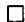
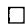

Discrete Memoryless Systems. New York: Academic, 1981.

[5] G. Dueck and J. Körner, “Reliability function of a discrete memoryless channel at rates above capacity,” IEEE Trans. Inform. Theory, vol. IT-25, pp. 82–85, Jan. 1979.

[6] G. Longo and A. Sgarro, “The source coding theorem revisited: A combinatorial approach,” IEEE Trans. Inform. Theory, vol. IT-25, pp. 544–548, Sept. 1979.

[7] R. E. Blahut, "Information bounds of the Fano-Kullback type,"

IEEE Trans. Inform. Theory, vol. IT-22, pp. 410-421, July 1976.

[8] A. Sgarro, “An informational divergence geometry for stochastic matrices,” *Calcolo*, vol. XV, fasc. I, pp. 41-49, Jan.-March 1978.

[9] I. Csiszár, “I-divergence geometry of probability distributions and minimization problems,” Ann. Prob., vol. 3, 1, pp. 146-158, 1975.

[10] G. Galasso and G. Longo, “An application of informational divergence to Huffman codes,” IEEE Trans. Inform. Theory, vol. IT-28, pp. 36–43, Jan. 1982.

# On the Security of Public Key Protocols

DANNY DOLEV AND ANDREW C. YAO, MEMBER, IEEE

Abstract—Recently the use of public key encryption to provide secure network communication has received considerable attention. Such public key systems are usually effective against passive eavesdroppers, who merely tap the lines and try to decipher the message. It has been pointed out, however, that an improperly designed protocol could be vulnerable to an active saboteur, one who may impersonate another user or alter the message being transmitted. Several models are formulated in which the security of protocols can be discussed precisely. Algorithms and characterizations that can be used to determine protocol security in these models are given.

# I. INTRODUCTION

THE USE of public key encryption [1], [11] to provide secure network communication has received considerable attention [2], [7], [8], [10]. Such public key systems are usually very effective against a "passive" eavesdropper, namely, one who merely taps the communication line and tries to decipher the intercepted message. However, as pointed out in Needham and Schroeder [8], an improperly designed protocol could be vulnerable to an "active" saboteur, one who may impersonate another user and may alter or replay the message. As a protocol might be compromised in a complex way, informal arguments that assert the security for a protocol are prone to errors. It is thus desirable to have a formal model in which the security

Manuscript received July 15, 1981; revised August 8, 1982. This work was supported in part by ARPA under Grant MDA-903-80-C-102 and by National Science Foundation under Grant MCS-77-05313-A01. This paper was partially presented at the 22nd Annual IEEE Symposium on Foundations of Computer Science, Nashville, TN, October 28–30, 1981.

D. Dolev was with the Computer Science Department, Stanford University, Stanford, CA. He is now with the Institute of Mathematics and Computer Science, Hebrew University, Jerusalem, Israel.

A. C. Yao is with the Computer Science Department, Stanford University, Stanford, CA 94305.

issues can be discussed precisely. The models we introduce will enable us to study the security problem for families of protocols, with very few assumptions on the behavior of the saboteur.

We briefly recall the essence of public key encryption (see [1], [11] for more information). In a public key system, every user  $X$  has an encryption function  $E_{x}$  and a decryption function  $D_{x}$ , both are mappings from  $\{0, 1\}^{*}$  (the set of all finite binary sequences) into  $\{0, 1\}^{*}$ . A secure public directory contains all the  $(X, E_{x})$  pairs, while the decryption function  $D_{x}$  is known only to user  $X$ . The main requirements on  $E_{x}, D_{x}$  are:

1)  $E_{x}D_{x} = D_{x}E_{x} = 1$  , and

2) knowing  $E_{x}(M)$  and the public directory does not reveal anything about the value  $M$ .

Thus everyone can send  $X$  a message  $E_{x}(M)$ ,  $X$  will be able to decode it by forming  $D_{x}(E_{x}(M)) = M$ , but nobody other than  $X$  will be able to find  $M$  even if  $E_{x}(M)$  is available to them.

We will be interested mainly in protocols for transmitting a secret plaintext  $M$  between two users. To give an idea of the way a saboteur may break a system, we consider a few examples. A message sent between parties in the network consists of three fields: the sender's name, the receiver's name, and the text. The text is the encrypted part of the message. We will write a message in the format: sender's name, text, receiver's name.

Example 1: Consider the following protocol for sending a plaintext  $M$  between  $A$  and  $B$ :

a)  $A$  sends  $B$  the message  $(A, E_B(M), B)$ ,

b)  $B$  answers  $A$  with the message  $(B, E_A(M), A)$ .

This protocol is easy to break by a saboteur  $Z$  in the following way:

1)  $Z$  intercepts the message sent from  $A$  to  $B$  in step a).

2)  $Z$  sends to  $B$  the message  $(Z, E_B(M), B)$ .

3)  $B$  answers  $Z$  according to the protocol (step b)) by  $(B, E_Z(M), Z)$ .

4)  $Z$  decodes  $E_Z(M)$  to find the plaintext  $M$ .

One way to overcome the weakness in the above protocol is to encode the name of the sender together with the plaintext in the encrypted text. Consider the following variation of a protocol suggested in Needham and Schroeder [8].

Example 2: Consider the following protocol (MA denotes concatenation of  $M$  and  $A$ ):

a)  $A$  sends  $B$  the message  $(A,E_B(MA),B)$

b)  $B$  answers  $A$  by sending  $(B, E_A(MB), A)$ .

We will prove later in this paper that this protocol is secure against arbitrary behavior of the saboteur. What will happen if one tries to improve the above protocol by adding another layer of encryption?

Example 3: Consider the following protocol:

a)  $A$  sends  $B$  the message  $(A,E_B(E_B(M)A),B)$

b)  $B$  answers by sending  $(B, E_A(E_A(M)B), A)$ .

Surprisingly, this protocol is breakable in the following way:

1)  $Z$  takes the message sent back from  $B$  to  $A$  in step b), i.e.,  $(B, E_A(E_A(M)B), A)$ .

Denote  $E_A(M)B$  by  $\tilde{M}$ , then  $Z$  can extract  $E_A(\tilde{M})$  from the above message.

2)  $Z$  initiates a conversation with  $A$ , sending

$$
\left(Z, E _ {A} \left(E _ {A} (\tilde {M}) Z\right), A\right),
$$

according to the protocol (step a)).

3)  $A$ , as a receiver, answers  $Z$  by

$$
\left(A, E _ {z} \left(E _ {z} (\tilde {M}) A\right), Z\right).
$$

4)  $Z$  decodes  $\tilde{M}$  from the message he received in step 3). As  $\tilde{M} = E_A(M)B$ ,  $Z$  now possesses  $E_A(M)$ .

5)  $Z$  establishes a new connection and sends to  $A$  the message

$$
\left(Z, E _ {A} \left(E _ {A} (M) Z\right), A\right).
$$

6) Now  $A$  should answer by  $(A, E_z(E_Z(M)A), Z)$ .

7) At this step  $Z$  is able to find the plaintext  $M$ .

The precise mathematical models will be defined in the ensuing sections. Below we list the basic assumptions on the system that we wish to model.

1) In a perfect public key system,

a) the one-way functions used are unbreakable;

b) the public directory is secure and cannot be tampered with;

c) everyone has access to all  $E_{x}$ ;

d) only  $X$  knows  $D_x$ .

2) In a two-party protocol, only the two users who wish to communicate are involved in the transmission process; the assistance of a third party in decryption or encryption is not needed.

3) In a uniform protocol, the same format is used by every pair of users that wish to communicate. In the three examples given previously, the user's names  $A, B$  are symbolic parameters and can be any two names.

4) With respect to the behavior of the saboteur, we will focus attention on saboteurs who are "active" eavesdroppers. That means someone who first taps the communication line to obtain messages and then tries everything he can in order to discover the plaintext. More precisely, we will assume the following about a saboteur:

a) He can obtain any message passing through the network.

b) He is a legitimate user of the network, and thus in particular can initiate a conversation with any other user.

c) He will have the opportunity to be a receiver to any user  $A$ . (More generally, we allow the possibility that any user  $B$  may become a receiver to any other user  $A$ .)

We give a summary of the results obtained in this paper. Two models will be developed.

1) The Cascade Protocols: These are protocols in which the users can apply the public key encryption-decryption operations to form messages; several layers of such operators may be applied, however. A simple example of cascade protocol is given in Example 1.

2) The Name-Stamp Protocols: These are protocols in which the users are allowed to append, delete, and check names encrypted together with the plaintext. A name-stamp protocol can also contain layers of encryptions (as in Examples 2 and 3).

In Section II we prove that a cascade protocol is secure if and only if both the following conditions are satisfied:

1) the messages transmitted between  $X$  and  $Y$  always contains some layers of encryption functions  $E_{x}$  or  $E_{Y}$ ;

2) in generating a reply message, each participant  $A$  ( $A = X, Y$ ) never applies  $D_A$  without also applying  $E_A$ .

This gives a simple characterization of security and also an efficient algorithm for deciding whether a given cascade protocol is secure.

In Section III we give a polynomial-time algorithm for deciding if a given name-stamp protocol is secure. In Section IV we consider the question whether a saboteur can break the protocol without waiting for others to initiate a conversation. This corresponds to the use of items a) and b) only in the previous discussion of the behavior of the saboteur. We give extensions of the results in Sections II and III to this case.

To end this introduction, we remark that other types of sabotage activities exist that may defeat the purpose of a public-key protocol (or any protocol). We refer the readers to Needham and Schroeder [8] for further discussions. The problem of sabotage in network communications also arises in other context (see Dolev [3], Pease et al. [9]).

# II. CASCADE PROTOCOLS

In this section we consider a simple class of protocols in which the only operations the users employ to generate messages are the encryption-decryption operators. Our goal is to analyze the security of such protocols against saboteurs. To achieve that, we have to develop a formal model. We have to specify 1) the syntax of the protocol, i.e., what operations the users apply at each step to generate a message, and 2) the inference rules that the traitor can use to discover the plaintext.

# A. Notation

Let  $\Sigma$  be a finite set of distinct symbols. We use  $\Sigma^{*}$  to denote the set of all finite sequences composed of the symbols in  $\Sigma$ ; the set  $\Sigma^{*}$  also contains the empty string  $\lambda$ . We define  $\Sigma^{+} = \Sigma^{*} - \langle \lambda \rangle$ , i.e., the set of all nonempty words over  $\Sigma$ . The concatenation of the words  $\alpha$  and  $\beta$  is denoted by  $\alpha \beta$ . Let  $\gamma = \alpha \beta$  be a word, then  $\alpha$  is called a prefix of  $\gamma$ , and  $\beta$  is a suffix of  $\gamma$ .

The basic properties of the public-key operators are  $E_{x}D_{x} = D_{x}E_{x} = 1$ , the identity function. As a result, any string of operators of the form  $\sigma E_{x}D_{x}\sigma^{\prime}$  will be equivalent to  $\sigma \sigma^{\prime}$ , in the sense that  $(\sigma E_{x}D_{x}\sigma^{\prime})P = (\sigma \sigma^{\prime})P$  for all  $P\in \langle 0,1\rangle^{*}$ . We will say that  $\sigma E_{x}D_{x}\sigma^{\prime}$  (or  $\sigma D_xE_x\sigma '$ ) can be reduced to  $\sigma \sigma^{\prime}$ . For any string  $\gamma$  of operators, let  $\gamma |_x$  denote the complete reduced string obtained from  $\gamma$  by deleting all  $E_{x}D_{x}$  and  $D_{x}E_{x}$  pairs iteratively, until no further reduction is possible. Denote by  $\bar{\gamma}$  the string obtained from  $\gamma$  by complete reduction with respect to all users  $X$  in the system,  $\bar{\gamma}$  is the reduced form of  $\gamma$ . Notice that  $\gamma |_x$  and  $\bar{\gamma}$  are all unique.

For convenience we sometimes write  $D_x$  as  $E_x^c$ , the complement of  $E_x$ . Similarly,  $E_x$  is also written as  $D_x^c$ . Let  $\gamma = a_1 \cdots a_n$  be a word of  $n$  symbols, each of which is an  $E$  or a  $D$ . Define

$$
\gamma^ {c} = a _ {n} ^ {c} \cdot a _ {n - 1} ^ {c} \cdot \dots \cdot a _ {1} ^ {c}.
$$

The word  $\gamma^c$  is complement of  $\gamma$ , and it satisfies  $\gamma \gamma^c = \gamma^c \gamma = 1$  when  $\gamma$  and  $\gamma^c$  are considered as operators. For any string  $\gamma$ , let  $lt(\gamma)$  be the set of symbols in  $\gamma$ .

# B. The Model

Definition 1: A two-party cascade protocol  $T$  is specified by a series of finite strings

$$
\tilde {\alpha} _ {i} \in \left\{z _ {1}, z _ {2}, z _ {3} \right\} ^ {*}, \quad 1 \leqslant i \leqslant t
$$

$$
\tilde {\beta} _ {i} \in \{z _ {1}, z _ {2}, z _ {4} \} ^ {*}, \qquad 1 \leqslant i \leqslant t ^ {\prime},
$$

where  $t' = t$  or  $t - 1$ . For each pair of distinct users  $X$  and  $Y$ , let  $\alpha_{i}(X,Y)$ ,  $\beta_{i}(X,Y)$  denote the strings  $\tilde{\alpha}_{i},\tilde{\beta}_{i}$  with the

symbols  $z_{1},z_{2},z_{3},z_{4}$  ，respectively，replacedby $E_{X},E_{Y},D_{X},D_{Y}.$

Clearly,  $\alpha_{i}(X,Y)\in \{E_{X},E_{Y},D_{X}\}^{*}$  and  $\beta_{i}(X,Y)\in$ $\{E_X,E_Y,D_Y\}^*$ . When user  $X$  wants to transmit a secret plaintext  $M$  to user  $Y$ , they exchange message according to  $T$  in the following way:

$X$  sends  $Y$  the message  $\alpha_{1}(X,Y)M$ ;

$Y$  applies  $\beta_{1}(X,Y)$  to the received message and sends it to  $X$ ;

$X$  applies  $\alpha_{2}(X,Y)$  to the received message and sends it to  $Y$ ;

$Y$  applies  $\beta_{2}(X,Y)$  to the received message and sends it to  $X$ ;

：

Note that the protocol is uniform in that  $\alpha_{i}(A,B)$  and  $\beta_{i}(A,B)$ , for any users  $A,B$ , can be obtained from  $\alpha_{i}(X,Y),\beta_{i}(X,Y)$  by substituting  $X$  by  $A$  and  $Y$  by  $B$ . For convenience, we assume that  $\tilde{\alpha}_{i}$  and  $\tilde{\beta}_i$  are such that  $\alpha_{i}(X,Y),\beta_{i}(X,Y)$  are in reduced form.

Definition 2: Let  $T$  be a two-party cascade protocol specified by  $\{\tilde{\alpha}_i, \tilde{\beta}_j | 1 \leqslant i \leqslant t, 1 \leqslant j \leqslant t'\}$ , and let  $X, Y$  be two distinct users. Define

$$
N _ {1} (X, Y) = \alpha_ {1} (X, Y),
$$

$$
N _ {2 j} (X, Y) = \beta_ {j} (X, Y) N _ {2 j - 1} (X, Y), \qquad 1 \leqslant j \leqslant t ^ {\prime},
$$

$$
N _ {2 i + 1} (X, Y) = \alpha_ {i + 1} (X, Y) N _ {2 i} (X, Y), \quad 1 \leqslant i \leqslant t - 1.
$$

When  $X$  wishes to send a plaintext  $M$  to  $Y$ , the message exchanged are then  $N_{i}(X,Y)M$ , where  $i = 1,2,\dots ,t + t^{\prime}$ .

Example: Consider the protocol  $T$  given by  $(\tilde{\alpha}_1 = z_2z_3, \tilde{\beta}_1 = z_1z_4z_1z_1z_4)$ . One has  $\alpha_{1}(X,Y) = E_{Y}D_{X}$  and  $\beta_{1}(X,Y) = E_{X}D_{Y}E_{X}E_{X}D_{Y}$ . For a plaintext  $M$ , the messages transmitted are  $N_{1}(X,Y)M = E_{Y}D_{X}M$  and  $N_{2}(X,Y)M = E_{X}D_{Y}E_{X}M$ .

So far we have discussed the syntax of the cascade protocol. We will now define the notion of security for a cascade protocol, i.e., when will a saboteur be able to deduce the plaintext  $M$  being transmitted between two users. We first give a formal definition. Let  $E$  be the set of all  $E_A$  and  $D$  the set of all  $D_A$ . Let  $X, Y, Z$  denote distinct user names.

Definition 3: Let  $T$  be a two-party cascade protocol specified by  $\{\tilde{\alpha}_i, \tilde{\beta}_j\}$ . Define

$$
\Sigma_ {1} (Z) = E \cup \{D _ {Z} \},
$$

$$
\Sigma_ {2} = \left\{\alpha_ {i} (A, B) | \text {f o r a l l} A \neq B \text {a n d} i \geqslant 2 \right\},
$$

$$
\Sigma_ {3} = \left\{\beta_ {i} (A, B) | \text {f o r a l l} A \neq B \text {a n d} i \geqslant 1 \right\}.
$$

We will say that  $T$  is insecure if some  $\gamma \in (\Sigma_1(Z) \cup \Sigma_2 \cup \Sigma_3)^*$  exists such that

$$
\overline {{\gamma N _ {i} (X , Y)}} = \lambda
$$

for some  $N_{j}(X,Y)$ ;  $T$  is secure otherwise.

Remark: Clearly, the definition of security for  $T$  is independent of the choice of  $X, Y, Z$ .

We now give the motivation behind the definition. Suppose  $X$  is trying to send a plaintext  $M$  to  $Y$  (using protocol

$T$ ). The actual messages transmitted between them are then  $N_{i}(X,Y)M$  ( $i = 1,2,\dots$ ) and may fall into the hands of the saboteur  $Z$ . Taking any  $N_{i}(X,Y)M$ , the saboteur  $Z$  has the chance to transform it by repeatedly applying any of the following three types of operators:

a) any  $\sigma \in \Sigma_1(Z)$

b) any  $\sigma \in \Sigma_3$ :  $Z$  can initiate a plaintext transmission with a user  $B$ , claiming himself to be  $A$ , and send any string  $P$  to  $B$  in the  $(2i - 1)\mathrm{st}$  message;  $Z$  then gets back  $\beta_i(A, B)P$ , effectively putting the operator  $\beta_i(A, B)$  on any chosen  $P$ ;

c) any  $\sigma \in \Sigma_2$ : let  $\sigma = \alpha_i(A, B)$ ; there is a chance that  $A$  may wish to transmit a plaintext to  $B$  some time in the future;  $Z$  may intercept the  $(i - 1)\mathrm{st}$  reply from  $B$  to  $A$ , prevent it from reaching  $A$ , and replace it with any chosen string  $P$  and receive from  $A$  the string  $\alpha_i(A, B)P$ .

As a result,  $Z$  has the opportunity to obtain the string  $\gamma N_{i}(X,Y)M$  for any  $\gamma \in (\Sigma_{1}(Z)\cup \Sigma_{2}\cup \Sigma_{3})^{*}$ . This means  $Z$  may deduce  $M$ , if  $\overline{\gamma N_i(X,Y)} = \lambda$  for some  $\gamma \in (\Sigma_1(Z)\cup \Sigma_2\cup \Sigma_3)^*$ .

We wish to point out that, in order to obtain  $\alpha_{i}(A,B)P$  from  $P,Z$  has to wait for  $A$  to initiate a conversation with  $B$ . It may or may not happen. Thus our definition of security is a conservative one, in the sense that we are concerned with the worst-case possibility.

# C. A Characterization of Secure Protocols

Definition 4: Let  $\pi \in \{E, D\}^*$  be a string and  $A$  be a user name. We say that  $\pi$  has the balancing property with respect to  $A$  if

$$
D _ {A} \in l t (\pi) \text {i m p l i e s} E _ {A} \in l t (\pi).
$$

As will be seen, the balancing property is inherent in secure cascade protocols.

Definition 5: Let  $X, Y$  be two distinct user names. A two-party cascade protocol  $T = \{\tilde{\alpha}_i, \tilde{\beta}_j\}$  is a balanced cascade protocol if

1) for every  $i \geqslant 2$ ,  $\alpha_{i}(X, Y)$  has the balancing property with respect to  $X$ , and

2) for every  $i \geqslant 1$ ,  $\beta_i(X, Y)$  has the balancing property with respect to  $Y$ .

Remark: We emphasize that  $\alpha_{i}(X,Y),\beta_{j}(X,Y)$  are in reduced form for  $i,j\geqslant 1$

Lemma 1: Let  $Z$  be a user name and  $T$  be a balanced cascade protocol. Then for every string  $\eta$  in  $(\Sigma_1(Z) \cup \Sigma_2 \cup \Sigma_3)^*$ ,  $\bar{\eta}$  has the balancing property with respect to every  $A \neq Z$ .

The proof is given in Appendix I.

We are ready now to state and prove the main result of this section. Let  $X, Y$  be two distinct user names.

Theorem 1: A two-party cascade protocol  $T = \{\tilde{\alpha}_i, \tilde{\beta}_j\}$  is secure if and only if

1)  $lt(\alpha_{1}(X,Y))\cap \{E_{X},E_{Y}\} \neq \emptyset$  , and

2)  $T$  is balanced.

Proof: Let  $Z$  be a user name distinct from  $X$  and  $Y$ . A) Necessity: Assume that either property 1) or 2) is not true. We will show that  $T$  is insecure, i.e.,  $\gamma \in (\Sigma_1(Z) \cup \Sigma_2 \cup \Sigma_3)^*$  exists such that  $\overline{\gamma N_i(X,Y)} = \lambda$  for some  $i$ .

If 1) is not true, then  $\overline{\gamma N_1(X,Y)} = \lambda$  where  $\gamma = \alpha_{1}^{c}\in \Sigma_{1}(Z)^{*}$ , and we are done. We can thus assume that 2) is false, i.e.,  $T$  is not balanced. By definition, either some  $\beta_{k}(X,Y)$  contains  $D_Y$  but not  $E_{Y}$  or some  $\alpha_{i}(X,Y)$  ( $i\geqslant 2$ ) contains  $D_{x}$  but not  $E_{x}$ . We first restrict ourselves to the former case ( $\beta_{k}$  contains  $D_{Y}$  but not  $E_{Y}$ ); the latter case will be treated later. We will establish under this restriction the following stronger result. For any  $\delta \in ((E_X,E_Y)\cup D)_-$ ,  $\gamma \in (\Sigma_1(Z)\cup \{\beta_k(Z,X),\beta_k(Z,Y)\})^*$  exists such that  $\gamma \delta = \lambda$ . The proof will be carried out by induction on  $r$ , the number of  $E_{X}$  and  $E_{Y}$  in the string  $\delta$ .

If  $r = 0$  then  $\gamma = \delta^c\in (\Sigma_1(Z))^*$  satisfies the requirement. Now let  $r > 0$  and assume that the result has been established for all smaller values of  $r$ . Let  $\delta$  be a string containing exactly  $rE_{X}$ 's and  $E_{Y}$ 's. Without loss of generality, we can assume that the leftmost  $E$  is an  $E_{Y}$ . Write  $\delta = \sigma_{1}E_{Y}\sigma_{2}$ , where  $lt(\sigma_1)\cap \langle E_X,E_Y\rangle = \emptyset$ ; clearly,  $\sigma_1^c\in (\Sigma_1(Z))^*$ . By assumption,  $\beta_{k}(Z,Y)$  contains  $D_{Y}$  but not  $E_{Y}$ ; hence we can write  $\beta_{k}(Z,Y) = \tau_{1}D_{Y}\tau_{2}$ , where  $\tau_{1}\in \{E_{Z},D_{Y}\}^{*}$  and  $\tau_{2}\in \{E_{Z}\}^{*}$ . Clearly,  $\tau_i^c\in (\Sigma_1(Z))^*$  for  $i = 1,2$ . Now  $\sigma_{2}$  contains  $r - 1$ $E$ 's, and by the inductive hypothesis,  $\underline{\gamma'}\in (\Sigma_1(Z)\cup \{\beta_k(Z,X),\beta_k(Z,Y)\})^*$  exists such that  $\underline{\gamma'\sigma_2} = \lambda$ . Define  $\gamma = \gamma'\tau_1^c\beta_k(Z,Y)\tau_2^c\sigma_1^c$ . Then  $\gamma \in (\Sigma_1(Z)\cup \{\beta_k(Z,X),\beta_k(Z,Y)\})^*$  from the above discussions. Furthermore,

$$
\begin{array}{l} \overline {{\gamma \delta}} = \overline {{\gamma^ {\prime} \tau_ {1} ^ {c} \beta_ {k} (Z , Y) \tau_ {2} ^ {c} \sigma_ {1} ^ {c} \sigma_ {1} E _ {y} \sigma_ {2}}} \\ = \overline {{\gamma^ {\prime} \sigma_ {2}}} \\ = \lambda . \\ \end{array}
$$

This completes the inductive step.

Still to be shown is that  $T$  is insecure when some  $\alpha_{i}(X,Y)$ $(i\geqslant 2)$  contains  $D_{x}$  but not  $E_{x}$ . One can prove the following stronger result: For any  $\delta \in (\{E_X,E_Y\} \cup D)^*$ ,  $\gamma \in (\Sigma_1(Z)\cup \{\alpha_i(X,Z),\alpha_i(Y,Z))\})^*$  exists satisfying  $\gamma \delta = \lambda$ . The proof is almost identical to the previous proof and will not be repeated.

B) Sufficiency: Assume that both properties 1) and 2) are satisfied; we will prove that  $T$  is secure.

Suppose, to the contrary, a  $\gamma \in (\Sigma_{1}(Z) \cup \Sigma_{2} \cup \Sigma_{3})^{*}$  exists such that  $\gamma N_{i}(X,Y) = \lambda$  for some  $i$ . We will derive a contradiction. Write  $\gamma N_{i}(X,Y) = P\alpha_{1}(X,Y)$  such that  $P \in (\Sigma_{1}(Z) \cup \Sigma_{2} \cup \Sigma_{3})^{*}$ . By definition of  $\gamma$ , we have

$$
\overline {{\bar {P} \alpha_ {1} (X , Y)}} = \lambda . \tag {1}
$$

By the definition of a protocol,  $lt(\alpha_{1}(X,Y))\subseteq \{E_{x},D_{x},E_{Y}\}$ . We distinguish two cases.

Case  $Bl$ ,  $E_{Y} \in lt(\alpha_{1}(X,Y))$ : As the string  $\alpha_{1}$  does not contain  $D_{Y}$ , the only possibility for (1) to hold is that  $\overline{P}$  contains some  $D_{Y}$  but no  $E_{Y}$ . This means that  $P$  does not have the balancing property with respect to  $Y$ . As  $Y \neq Z$ , this is a contradiction to Lemma 1.

Case B2,  $E_{Y} \notin lt(\alpha_{1}(X,Y))$ : In this case  $D_{X} \notin lt(\alpha_{1}(X,Y))$ , because  $\alpha_{1}(X,Y)$  is in reduced form and the

protocol satisfies property 1) in the lemma. This implies that  $\alpha_{1}(X,Y) = E_{X}^{+}$ . Similarly to Case B1, the only possibility for (1) to hold is that  $\overline{P}$  contains  $D_{X}$  and does not contain  $E_{X}$ , which again contradicts Lemma 1.

A cascade protocol  $T$  is called doubly verified if for some  $i$ ,  $lt(\overline{N_i(X,Y)}) \subseteq \{E_Y, D_Y, D_X\}$  and for some  $j \geqslant 2$ ,  $lt(\overline{N_j(X,Y)}) \subseteq \{E_x, D_x, D_Y\}$ .

Theorem 2: Every doubly verified protocol is insecure.

Proof: Let  $T$  be a doubly verified protocol such that

$$
l t \left(\bar {N} _ {k}\right) \subseteq \left\{E _ {Y}, D _ {X}, D _ {Y} \right\}, \tag {2}
$$

and

$$
l t \left(\bar {N} _ {l}\right) \subseteq \left\{E _ {X}, D _ {X}, D _ {Y} \right\}. \tag {3}
$$

(We have used the abbreviations  $\overline{N}_i$  for  $N_i(X,Y)$ .) Write  $\overline{N}_1 = \alpha_1(X,Y)$ ,  $\overline{N}_k = \gamma_k\alpha_1(X,Y)$  and  $\overline{N}_l = \gamma_l\alpha_1(X,Y)$ , where  $r_j \in (\Sigma_2 \cup \Sigma_3)^*$ . Suppose  $T$  is secure. We will derive a contradiction.

By Theorem 1,  $T$  has to be balanced.

Case 1,  $E_{Y}\in lt(\alpha_{1}(X,Y))$ : Clearly, (3) demands that  $\overline{\gamma}_l$  should contain  $D_{Y}$  but no  $E_{Y}$ . This contradicts Lemma 1.

Case 2,  $E_{X} \in \text{lt}(\alpha_{1}(X,Y))$  and  $E_{Y} \notin \text{lt}(\alpha_{1}(X,Y))$ : In this case, (2) requires that  $\bar{\gamma}_{k}$  contains  $D_{X}$  but no  $E_{X}$ , contradicting Lemma 1.

Theorem 2 implies that in a secure cascade protocol  $T$ , if the receiver  $Y$  is able to decode the encrypted message  $M$ , then the sender  $X$  cannot obtain  $M$  by simply decrypting some of the messages sent back to  $X$ . That means  $X$  should not be able to reconstruct  $M$  if  $X$  has thrown away  $M$  after the first transmission. This theorem implies that the protocol in Example 1 is not secure (a fact we demonstrated before). It also implies that the protocol suggested in Diffie and Hellman [2] (the message exchanges being  $E_{B}(D_{A}(M))$ ,  $E_{A}(D_{B}(M))$ ) for obtaining public-key authentication is not secure.

We wish to emphasize that our security concept is based on the assumption that the plaintext  $M$  is arbitrary. If the structure of  $M$  is known and a consistency check can be made, then the protocol is no longer considered to be a cascade protocol. In the next section, we consider a case in which the internal structure of the message can be used to achieve security.

# III. NAME-STAMP PROTOCOLS

In Section I we discussed several protocols that append names to the message before the encryption. We will now introduce a model that includes such protocols.

# A. Informal Description

Assume that the names of all users are of the same length, say,  $m$  bits. For any string  $\gamma \in \{0,1\}^*$ , we will write  $\gamma = \text{head}(\gamma) \text{tail}(\gamma)$ , where  $\text{tail}(\gamma)$  is a suffix of  $m$  bits. A user  $Y$  can apply any of the following operations to a

string  $\gamma$

a) encryption  $E_{x}$ ;

b) decryption  $D_{Y}$

c) appending  $i_x$ ; with  $i_x \gamma = \gamma X$ ;

d) name-matching  $d_x$ ; with  $d_x\gamma = \operatorname{head}(\gamma)$  if  $\operatorname{tail}(\gamma) = X$  and undefined otherwise;

e) deletion  $d$ , with  $d\gamma = \operatorname{head}(\gamma)$ .

The name  $X$  can be any user's name, but the only decryption  $Y$  can apply is  $D_Y$ . The following equations are clearly true. For any name  $X$ ,

$$
E _ {X} D _ {X} = D _ {X} E _ {X} = 1,
$$

and

$$
d _ {X} i _ {X} = d i _ {X} = 1. \tag {4}
$$

We remark that  $i_X d_X \neq 1$ .

Under a name-stamp protocol, any text transmitted by a user is obtained by applying a sequence of operations a)–e) to the most recently received text. In particular, when a  $d_x$  is applied to a string  $\gamma$ , the transmission will not proceed unless  $\text{tail}(\gamma) = X$ . To ensure the completion of the communication, we will require that any text transmitted between two normal users  $X, Y$  will be of a form

$$
\gamma \in \left\{E _ {A}, D _ {A}, i _ {A}, d _ {A}, d \mid \text {a l l u s e r s} A \right\} ^ {*} M
$$

such that no  $d_A$  remains after (4) is repeatedly applied.

As before, a saboteur is allowed to intercept all the texts between  $X$  and  $Y$ , modify them with operations a)-e), and use them freely in any conversation, initiated either by him or by others. In this fashion he can obtain numerous strings  $\gamma \in \{E_A, D_A, i_A, d_A, d\}$  all  $A\}^* M$ . If any of the obtained  $\gamma$  can be reduced to  $M$  by the repeated use of (4), then the saboteur will have succeeded in the quest for  $M$ .

# B. Some Notation

Consider the following set of rules:

$$
\begin{array}{l} E _ {X} D _ {X} \rightarrow \lambda , \qquad D _ {X} E _ {X} \rightarrow \lambda , \\ d _ {X} i _ {X} \rightarrow \lambda , \quad d i _ {X} \rightarrow \lambda . \tag {5} \\ \end{array}
$$

For any string  $\gamma \in \{E_A, D_A, d_A, i_A, d\}$  all user  $A\}^*$ , let  $\bar{\gamma}$  denote a string obtained when the rules in (5) have been used to reduce  $\gamma$  until no further replacement can be made. Clearly,  $\bar{\gamma}$  is unique, independent of the order of the reduction. Call  $\bar{\gamma}$  the reduced form of  $\gamma$ . A string  $\gamma$  is irreducible if  $\bar{\gamma} = \gamma$ .

# C. Formal Model

Definition 6: A two-party name-stamp protocol  $T$  is specified by a set of strings

$$
\tilde {\alpha} _ {i} \in (F - \{z _ {2} \}) ^ {*}, \quad \tilde {\beta} _ {j} \in (F - \{z _ {1} \}) ^ {*}
$$

where  $F = \{z_{1}, z_{2}, \ldots, z_{9}\}$ ,  $1 \leqslant i \leqslant t$ , and  $1 \leqslant j \leqslant t'$  ( $t' = t$  or  $t - 1$ ). Let  $\alpha_{i}(X,Y)$  and  $\beta_{j}(X,Y)$  denote the strings  $\tilde{\alpha}_{i}$  and  $\tilde{\beta}_{j}$  when  $z_{1}, z_{2}, \dots, z_{9}$  are each replaced by  $D_{X}, D_{Y}, E_{X}, E_{Y}, i_{X}, i_{Y}, d_{X}, d_{Y}, d$ . Let  $N_{1}(X,Y) = \alpha_{1}(X,Y)$ ,

$N_{2}(X,Y) = \beta_{1}(X,Y)N_{1}(X,Y),\quad N_{3}(X,Y) = \alpha_{2}(X,Y)N_{2}(X,Y),\dots ,N_{2i}(X,Y) = \beta_{i}(X,Y)N_{2i - 1}(X,Y),$ $N_{2i + 1}(X,Y) = \alpha_{i + 1}(X,Y)N_{2i}(X,Y),\dots .$  We require that  $\overline{N_i(X,Y)}$  do not contain any  $d_A$

Remark:  $\{N_i(X,Y)M\}$  is the sequence of texts transmitted between  $X$  and  $Y$ , when  $X$  wishes to send plaintext  $M$  to  $Y$ . That  $\overline{N_i(X,Y)}$  contains no  $d_A$  means the  $i$ th transmission is well-defined.

Definition 7: Let  $X, Y, Z$  be three given distinct users. A two-party name-stamp protocol  $T$  is insecure if a string  $\gamma \in V_{Z,T}^{*}\{\overline{N_{i}(X,Y)}\}$  exists such that  $\bar{\gamma} = \lambda$ ; the set  $V_{Z,T}$  is defined by

$$
\begin{array}{l} V _ {Z, T} = \left\{\alpha_ {j} (A, B) | \text {a l l} A \neq B \text {a l l} j \geqslant 2 \right\} \\ \cup \left\{\beta_ {j} (A, B) | \text {a l l} A \neq B, \text {a l l} j \right\} \\ \cup \left\{E _ {A}, i _ {A}, d _ {A}, d | \text {a l l} A \right\} \cup \left\{D _ {z} \right\}. \tag {6} \\ \end{array}
$$

Otherwise,  $T$  is secure.

Remark: The security of  $T$  in the above definition is clearly independent of the choice of  $X, Y, Z$ . The motivation for the definition is similar to the cascade case (see Section II-B) and will not be elaborated.

# D. Examples

1) Consider the protocol given in Example 2. In the present notation,  $\alpha_{1}(X,Y) = E_{Y}i_{X},\beta_{1}(X,Y) = E_{X}i_{Y}d_{X}D_{Y}$ . We also have  $\overline{N_1(X,Y)} = E_Yi_X$  and  $\overline{N_2(X,Y)} = E_Xi_Y$ .

2) The protocol in Example 3 corresponds to the case  $\alpha_{1}(X,Y) = E_{Y}i_{X}E_{Y}$ ,  $\beta_{1}(X,Y) = E_{X}i_{Y}E_{X}D_{Y}d_{X}D_{Y}$ . We then have  $\overline{N_1(X,Y)} = E_Yi_XE_Y$  and  $\overline{N_2(X,Y)} = E_Xi_YE_X$ . This protocol is insecure, as the string

$$
\begin{array}{l} \gamma = D _ {Z} d D _ {Z} \beta_ {1} (Z, X) E _ {x} i _ {Z} d D _ {Z} d D _ {Z} \beta_ {1} (Z, X) \\ \cdot E _ {X} i _ {Z} \overline {{N _ {2} (X , Y)}} \in V _ {Z, T} ^ {*} \left\{\overline {{N _ {i} (X , Y)}} \right\} \\ \end{array}
$$

satisfies  $\bar{\gamma} = \lambda$ . (This particular  $\gamma$  actually corresponds to the sequence of operations used by the saboteur in Example 3.)

# E. A Secure Protocol

We now prove that the protocol in Example 2 is secure in our model. Suppose to the contrary, a  $\gamma \in V_{Z,T}^{*}\langle N_{i}(X,Y)\rangle$  exists with  $\bar{\gamma} = \lambda$ . We will derive a contradiction.

Take such a  $\gamma = v_{1}v_{2}\dots v_{l}\overline{N_{i}(X,Y)}$  with a minimum number of  $v_{k}\in V_{Z,T}^{*}$ . Assume  $i = 1$  (the other case  $i = 2$  can be treated similarly). From the previous subsection, we have  $\overline{N_i(X,Y)} = E_Yi_X$  and  $\overline{N_2(X,Y)} = E_Xi_Y$ . Since  $\overline{\gamma} = \lambda$ , there must be a  $D_Y$  in  $\gamma$  that cancels the  $E_{y}$  in  $N_{1}(X,Y)$ . Let  $v_{j}$  be the word that contains this  $D_Y$ , then  $v_{j} = \beta_{1}(W,Y) = E_{W}i_{Y}d_{W}D_{Y}$  for some  $W$  (as  $D_Y$  occurs only in  $\beta_{1}$ ). This implies  $j = l$ , otherwise  $\gamma^{\prime} = v_{1}v_{2}\dots v_{j}N_{1}(X,Y)$  would be an instance shorter than  $\gamma$ . There are now two cases.

1) If  $W \neq X$ , then  $\overline{v_{l}N_{1}(X,Y)} = E_{W}i_{Y}d_{W}i_{X}$ , and  $\overline{\gamma} = \overline{v_{1}v_{2}\cdots v_{l - 1}}E_{W}\underline{i_{Y}d_{W}i_{x}} \neq \lambda$ .

2) If  $W = X$ , then  $v_{l}\overline{N_{1}(X,Y)} = E_{X}i_{Y} = \overline{N_{2}(X,Y)}$ , and hence the string  $\gamma' = v_{1}v_{2}\dots v_{l - 1}\overline{N_{2}(X,Y)}$  satisfies  $\overline{\gamma'} = \overline{\gamma}' = \lambda$ , contradicting the minimality of  $\gamma$ .

This completes the proof.

# F. An Algorithm for Checking Protocol Security

We will give an algorithm that can decide if a given name-stamp protocol is secure. In particular, one can run this algorithm to give an alternative proof of security for the protocol 1) in the preceding section.

Given a two-party name-stamp protocol  $T$ , specified by  $\{\alpha_i, \beta_j\}$ , we will use  $n$  to denote the input length  $\Sigma_i |\alpha_i| + \Sigma_j |\beta_j|$ . The rest of this subsection is devoted to a proof of the following theorem.

Theorem 3: There is an algorithm that can decide in time  $O(n^{8})$  whether a given two-party name-stamp protocol  $T$  is secure.

We will prove as an intermediate step Theorem 4, which is of interest by itself. In principle, the saboteur  $Z$  may start a conversation with any user in the network. The next lemma shows that we can assume that  $Z$  only speaks to  $X$  and  $Y$ . This reduction is very useful for constructing an algorithm. Let us define

$$
\begin{array}{l} S = \left\{\alpha_ {i} (A, B) | A, B \in \{X, Y, Z \}, A \neq B, i \geqslant 2 \right\} \\ \cup \left\{\beta_ {i} (A, B) | A, B \in \{X, Y, Z \}, A \neq B \right\} \\ \cup \left\{E _ {A}, i _ {A}, d _ {A}, d \mid A = X, Y, Z \right\} \cup \left\{D _ {Z} \right\}. \tag {7} \\ \end{array}
$$

Lemma 2: The protocol  $T$  is insecure if and only if a string  $\gamma \in S^{*}\{\overline{N_{i}(X,Y)}\}$  exists such that  $\bar{\gamma} = \lambda$ .

Proof: It suffices to show that, if  $T$  is insecure, then such a  $\gamma$  exists. In this situation, let  $\gamma' \in V_{Z,T}^*(\overline{N_i(X,Y)})$  be a string such that  $\overline{\gamma'} = \lambda$ . Replace in  $\gamma'$  all the  $E_A, i_A, d_A$  when  $A \notin (X,Y,Z)$  by  $E_Z, i_Z, d_Z$ , and let  $\gamma$  denote the resulting string. Clearly,  $\overline{\gamma} = \lambda$ . Observe also that  $\gamma \in S^*(\overline{N_i(X,Y)})$ , as  $\alpha_i(A,B)$  and  $\beta_i(A,B)$  become  $\alpha_i(Z,Z)$  and  $\beta_i(Z,Z) \in S$  if  $A, B \notin (X,Y,Z)$ , and  $\alpha_i(A',B')$  and  $\beta_i(A',B')$  with  $A', B' \in (X,Y,Z)$ ,  $A' \neq B'$ , otherwise.

Definition 8: Let  $\eta \in \{E_A, D_A, i_A, d|A = X, Y\}^*$  be an irreducible string. Denote by  $C(\eta)$  the set of all irreducible strings  $\delta \in \{E_A, D_A, i_A, d_A, d|}$  all  $A\}^*$  satisfying  $\overline{\delta\eta} = \lambda$ .

Lemma 3: If  $\eta$  contains any  $d$ , then  $C(\eta) = \emptyset$ . Otherwise, let  $\eta = b_{1}, b_{2}, \dots, b_{t}$ , then  $C(\eta)$  consists of all the strings  $b_{t}^{c}b_{t-1}^{c} \dots b_{1}^{c}$ , where  $(E_{A})^{c} = D_{A}$ ,  $(D_{A})^{c} = E_{A}$ ,  $(i_{A})^{c} = d_{A}$  or  $d$ .

Proof: It follows from the fact that  $d$  has no left inverse, and the fact that  $b_{i}^{c}$  are the only irreducible strings satisfying  $\overline{b_{i}^{c}b_{i}} = \lambda$ .

Write  $\rho_{k} = \overline{N_{k}(X,Y)}$ , and let  $\rho_{i_1}, \rho_{i_2}, \dots, \rho_{i_s}$  be those  $\rho_{k}$  that do not contain  $d$ .

Lemma 4: The protocol  $T$  is insecure if and only if a string  $\gamma \in S^{*}$  exists such that  $\overline{\gamma} \in C(\rho_{i_j})$  for some  $1 \leqslant j \leqslant s$ .

Proof:

Sufficiency: If  $\gamma \in S^{*}$  and  $\overline{\gamma} \in C(\rho_{i_j})$ , then  $\gamma' = \gamma \rho_{i_j} \in S^{*}\langle \overline{N_i(X,Y)} \rangle$  and  $\overline{\gamma'} = \lambda$ . Thus  $T$  is insecure by Lemma 2.

Necessity: If  $T$  is insecure, then by Lemma 2 a string  $\gamma' = \underline{\gamma N_k(X,Y)}$  exists with  $\gamma \in S^*$  and  $\overline{\gamma'} = \lambda$ . This implies  $\overline{\gamma} \rho_k = \lambda$ , and thus by Lemma 3  $\overline{\gamma} \in C(\rho_{i_j})$  for some  $j$ .

We will show the following.

Proposition 1: Given a set of strings  $S = \{h_1, h_2, \dots, h_p\}$  and a string  $\rho$ , where

$$
h _ {i} \in \{E _ {A}, D _ {A}, i _ {A}, d _ {A}, d | A = X, Y, Z \} ^ {*}
$$

and

$$
\rho \in \{E _ {A}, D _ {A}, i _ {A} | A = X, Y \} ^ {*},
$$

one can decide in time  $O(q^7)$  if a string  $\gamma \in S^*$  exists such that  $\bar{\gamma} \in C(\rho)$ . (  $q$  is defined to be  $\sum_{i=1}^{p} |h_i| + |\rho|$ .)

Proposition 1 implies Theorem 3 by the following argument. Given a protocol  $T$  specified by  $\{\alpha_i, \beta_i\}$ , we first compute  $N_i(X, Y)$  and then  $\rho_i = \overline{N_i(X, Y)}$  for all  $i$  in time  $O(n^2)$ . (Observe that each  $N_i(X, Y)$  is of length at most  $O(n)$ .) Consider those  $\rho_i$  that contain no  $d$ . For each such  $\rho_i$ , use Proposition 1 to decide if a  $\gamma \in S^*$  exists such that  $\overline{\gamma} \in C(\rho_i)$ , where  $S$  is given by (6). By Lemma 4 the protocol is then insecure if and only if such a  $\gamma$  for some  $\rho_i$  exists. The total time is

$$
O \left(\sum_ {i} \left(\sum_ {j} | \alpha_ {j} | + \sum_ {j} | \beta_ {j} | + | \rho_ {i} |\right) ^ {7}\right) = O \left(\sum_ {i} n ^ {7}\right) = O \left(n ^ {8}\right).
$$

Proposition 1 remains to be proved. We will consider a more general setting.

# G. The Extended Word Problem

Let  $\Sigma = \{a_{1}, a_{2}, \dots, a_{r}\}$  be an alphabet, i.e., a set of distinct symbols. We call  $u \to v$  a transformation rule, where  $u \in \Sigma^{+}$  and  $v \in \Sigma^{*}$ . Let  $\Gamma = \{u_{1} \to v_{1}, u_{2} \to v_{2}, \dots, u_{q} \to v_{q}\}$  be a set of transformation rules. For two strings  $\gamma, \delta \in \Sigma^{*}$ , we will write  $\gamma \mapsto_{\Gamma} \delta$  if  $\gamma$  can be transformed into  $\delta$  by repeatedly using rules in  $\Gamma$ , i.e., replacing substrings  $u_{i}$  by  $v_{i}$ . For a string of subsets  $G_{i}$  of  $\Sigma$ ,  $\eta = G_{1}, G_{2}, \dots, G_{q}$ , let  $L(\eta) = \{\gamma | \gamma = g_{1}, g_{2}, \dots, g_{q}\}$ , where  $g_{i} \in G_{i}$ . We will use the notation  $\gamma \mapsto_{\Gamma} L(\eta)$  if  $\gamma \mapsto_{\Gamma} \rho$  for some  $\rho \in L(\eta)$ . The extended word problem for  $(\Sigma, \Gamma)$  can be stated as follows.

Given a set of input strings  $\delta_1, \delta_2, \dots, \delta_p (\delta_i \in \Sigma^*)$  and a string of subsets  $\eta = G_1, G_2, \dots, G_q (G_i \subseteq \Sigma; G_i \neq \emptyset)$ , determine if a concatenation  $\Delta = \delta_{i_1}, \delta_{i_2}, \dots, \delta_{i_s}$  exists such that  $\Delta \mapsto_{\Gamma} L(\eta)$ .

Remark: The input length  $n$  is defined to be  $\Sigma_{i}|\delta_{i}| + \Sigma_{j}|G_{j}|$ .

In general, the extended word problem is known to be undecidable because it includes as a special case the membership problem for a type-0 language, well-known to be

undecidable (see, e.g., Hopcroft and Ullman [5]). However, we will show that the problem is solvable in polynomial time for a special class of the inputs.

Definition 9: A transformation rule of the form  $a_{i}a_{j}\rightarrow \lambda$  is called a cancellation rule.

Theorem 4: Let  $\Sigma$  be an alphabet and  $\Gamma$  a set of cancellation rules. Then the extended word problem for  $(\Sigma, \Gamma)$  can be solved in time  $O(n^{7})$ , where  $n$  is the input length.

Theorem 4 implies Proposition 1 by the following argument. Let

$$
\begin{array}{l} \Sigma = \left\{D _ {A}, E _ {A}, i _ {A}, d _ {A}, d | A = X, Y, Z \right\}, \\ \tau = \left\{D _ {A} E _ {A} \rightarrow \lambda , E _ {A} D _ {A} \rightarrow \lambda , d _ {A} i _ {A} \rightarrow \lambda , \right. \\ d i _ {A} \rightarrow \lambda | A = X, Y, Z \rangle . \\ \end{array}
$$

The problem stated in Proposition 1 with inputs  $h_1, h_2, \dots, h_p, \rho$  can be solved as an extended word problem for  $(\Sigma, \Gamma)$ . The inputs are  $\delta_1, \delta_2, \dots, \delta_p$  and a subset string  $\eta = G_1, G_2, \dots, G_q$ , where  $\delta_i = h_i$  and  $\eta$  is such that  $L(\eta) = C(\rho)$ . The input lengths are linearly related. Thus proving Theorem 4 will complete the proof of Theorem 3.

To prepare for the proof of Theorem 4 we define a few terms. Let  $\delta_1, \delta_2, \dots, \delta_p$  be the input words in  $\Sigma^*$ , and let  $\eta = G_1, G_2, \dots, G_q$  be the input sequence of subsets  $(G_i \subseteq \Sigma)$ . Without loss of generality, we can assume that  $\delta_i \neq \lambda$  for all  $i$ . Denote by  $I, I'$  the set of all proper prefixes and suffixes of  $\delta_1, \delta_2, \dots, \delta_n$  (including  $\lambda$ , but not  $\delta_i$ ). Let  $J$  be the set of all substrings of  $\eta$  and  $J_l$  the set of all substrings of  $\eta$  of length  $l$ . For each  $w \in J$ , let

$$
R _ {w} = \left\{\left(g, b\right) \mid g \in I ^ {\prime}, b \in I, e \in \left\{\delta_ {1}, \delta_ {2}, \dots , \delta_ {n} \right\} ^ {*} \right.
$$

exists such that  $geb\Rightarrow_{\Gamma}L(\omega)\rangle$

We emphasize that each  $w \in J$  is of the form  $G_{i}, G_{i+1}, \dots, G_{j}$ , where  $G_{k} \subseteq \Sigma$ .

Lemma 5:  $R_{\lambda}$  can be computed in time  $O(n^{7})$

The proof is given in Appendix II.

Proof of Theorem 4: We compute  $R_{w}$  for  $w \in J_{l}$  inductively on  $l$  by "dynamic programming." Initially, we compute  $R_{\lambda}$ . Now let  $l > 0$ , and suppose  $R_{w}$  have been computed for all  $w \in J_{0} \cup J_{1} \cup \dots \cup J_{l-1}$ . For each  $w \in J_{l}$ , we will compute  $R_{w}$ . Let  $w = G_{j}u$ . For each  $g \in I'$ ,  $b \in I$ , let us decide if  $(g, b) \in R_{w}$ . Suppose  $g\delta_{i_1}\delta_{i_2}\dots \delta_{i_s}b \Rightarrow_{\Gamma} L(G_ju)$ . Since cancellation rules do not create new symbols,  $g\delta_{i_1}\delta_{i_2}\dots \delta_{i_s}b$  must be of the form  $\rho a_k\rho'$  for some  $a_k \in G_j$  with  $\rho \Rightarrow_{\Gamma}\lambda$  and  $\rho' \Rightarrow_{\Gamma}L(u)$ . To cover all the possible breaking points for  $\rho$  and  $\rho'$ , we employ the following procedure:

1) If  $g = a_{k}g_{1}$  with  $a_{k}\in G_{j}$ , determine if  $(g_1,b)\in R_u$ .

2) For each  $\delta_j$  and each occurrence of a symbol  $a_k \in G_j$  in  $\delta_j$ , write  $\delta_j = s a_k s'$ . Determine if both  $(g, s) \in R_\lambda$  and  $(s', b) \in R_u$ .

3) If  $b = b_{1}b_{2}$  with  $b_{2} \in L(w)$ , determine if  $(g, b_{1}) \in R_{\lambda}$ .

Set  $(g, b) \in R_w$  if any of the above tests yields a "yes" answer; otherwise  $(g, b) \notin R_w$ . To check that the above

procedure correctly determines if  $(g, b) \in R_w$  is easy. To find the running time, note that each triplet  $(w, g, b)$  takes time at most

$$
\begin{array}{l} O \left(| R _ {u} | + n (| R _ {\lambda} | + | R _ {u} |) + | R _ {\lambda} | + | R _ {w} | + n\right) \\ = O \left(n | I | \cdot | I ^ {\prime} |\right) = O \left(n ^ {3}\right). \\ \end{array}
$$

Thus the time needed to compute  $R_{w}$  for all  $w \in J_{l}$  is

$$
O \left(\left| J _ {l} \right| \cdot | I | \cdot | I ^ {\prime} |\right) \cdot n ^ {3} = O \left(n ^ {6}\right).
$$

The total computing time for  $l = 1,2,\dots ,|\eta |$  is thus  $O(n^{7})$ . Since the extended word problem has a solution if and only if  $(\lambda ,\lambda)\in R_{\eta}$ , the proof of Theorem 4 is completed.

# IV. THE IMPATIENT SABOTEUR

To break a protocol that is insecure as defined in the previous sections, a saboteur may need to be the receiver of a conversation. In this section, we are interested in the characterizations (or decision procedures) for protocols that can be compromised by an impatient saboteur, i.e., one who only initiates conversations (and does not rely on being spoken to).

For the name-stamp protocols, this corresponds to a modification of the definition of security (Definition 7). That is, one should omit the term  $\{\alpha_{j}(A,B)\}$  from the definition of  $V_{Z,T}$  (see (6)).

Theorem 5: An algorithm exists that can decide in time  $O(n^{8})$  whether a given two-party name-stamp protocol  $T$  is secure against an impatient saboteur.

Proof: The proof is identical to the proof of Theorem 3 except that the  $\langle \alpha_{i}(A,B)\rangle$  term should be omitted from (7).

For the cascade protocols, the definition of security (Definition 3) should be modified as follows.  $T$  is insecure (against an impatient saboteur) if some  $\gamma \in (\Sigma_1(Z) \cup \Sigma_3)^*$  exists such that  $\overline{\gamma N_i(X,Y)} = \lambda$  for some  $N_i(X,Y)$ ;  $T$  is secure otherwise. We can obtain a characterization similar to that in Theorem 1.

Theorem 6: Let  $X, Y$  be distinct user names. A two-party cascade protocol  $T = \{\tilde{\alpha}_i, \tilde{\beta}_j\}$  is secure against an impatient saboteur if and only if, for every  $k \geqslant 1$ ,

1)  $lt(\overline{N_k(X,Y)})\cap \langle E_X,E_Y\rangle \neq \emptyset$

2)  $\beta_{k}(X,Y)$  has the balancing property with respect to  $Y$ .

Although the statement of this result is simple, the proof is quite involved. The rest of this section is devoted to a proof of Theorem 6. In the following, a string always refers to a string of  $E$ 's and  $D$ 's. Let  $A$  be any user name.

Definition 10: Let  $\eta$  be a string. A substring  $\pi$  of  $\eta$  is called an  $A$ -substring if one of the following is true for some  $X, Y \neq A$ :

1)  $\eta = \eta_{1}D_{x}\pi D_{Y}\eta_{2}$ ;

2)  $\eta = \eta_{1}D_{x}\pi$

3)  $\eta = \pi D_Y\eta_2$

Definition 11: A string  $\eta$  is strongly  $A$ -balanced if every  $A$  substring  $\pi$  has the balancing property with respect to  $A$ . Lemma 6: Let  $\eta$  be strongly  $A$ -balanced string.

1) If  $\eta = \eta_1D_B\eta_2$  with  $B\neq A$ , then  $\eta_{1}$  and  $\eta_{2}$  are both strongly  $A$ -balanced.

2) If  $\eta = \eta_1\eta_2$  and  $E_A \notin lt(\eta_2)$ , then  $\eta_1$  is strongly  $A$ -balanced.

Proof: It is easy to see that  $\eta$  is strongly  $A$ -balanced iff every  $A$  substring that does not contain any  $D_B$  for  $B \neq A$  has the balancing property with respect to  $A$ . This implies 1).

The balancing property with respect to  $A$  is concerned with the appearance of  $E_A$  in case that  $D_A$  appears. Therefore, by removing a suffix or prefix which does not contain  $E_A$ , we cannot change the balancing property or the strongly balanced property. This proves 2).

The key idea in the proof of Theorem 6 is the property presented in the following lemma.

Lemma 7: Let  $\gamma, \delta$  be any strongly  $A$ -balanced strings given in a reduced form. If

$$
\left(l t (\gamma) \cup l t (\delta)\right) \cap \left(E _ {A}, D _ {A} \right\rbrace \neq \emptyset
$$

then  $\overline{\gamma\delta} \neq \lambda$

Proof: We prove the lemma by induction on  $n$ , the number of  $D_{A}$  in the word  $\gamma \delta$ .

The lemma is trivially true for  $n = 0$ . Assume now that one  $D_A$  appears in  $\gamma \delta$ . We will assume that it is in  $\gamma$  and that  $\delta$  contains no  $D_A$ . (The case where  $D_A$  is in  $\delta$  can be similarly treated.) By assumption, the strings  $\gamma, \delta$  are in reduced form. Therefore,  $\overline{\gamma \delta} = \lambda$  implies that  $\gamma$  does not contain any  $E_A$ , which contradicts the balancing property of  $\gamma$ . The lemma is thus true for  $n = 1$ .

For the inductive step, let  $n > 1$ . Assume that the lemma holds for every  $\gamma', \delta'$  such that  $\gamma' \delta'$  contains at most  $n - 1$ $D_A$ 's. Let  $\gamma, \delta$  be such that  $\gamma \delta$  contains  $n D_A$ 's, and that  $\gamma, \delta$  satisfy the induction hypothesis. We wish to prove  $\overline{\gamma \delta} \neq \lambda$ .

We prove by contradiction. Suppose  $\overline{\gamma}\delta = \lambda$ . By assumption  $\gamma$  and  $\delta$  are in reduced form; thus  $\delta = \gamma^c$ . It follows that  $\gamma$  and  $\delta$  contain the same number of operators from the set  $\{E_A, D_A\}$ . Let us assume that  $\gamma = \gamma_2D_A^+\gamma_1$  where  $lt(\gamma_1)\cap \{E_A,D_A\} = \emptyset$ . (The case  $\gamma = \gamma_{2}E_{A}^{+}\gamma_{1}$  is similar.) In this case  $\delta = \delta_{1}E_{A}^{+}\delta_{2}$  where  $\delta_{1} = \gamma_{1}^{c}$  and  $\delta_{2} = \gamma_{2}^{c}$ .

The string  $\gamma$  is strongly  $A$ -balanced. Therefore,  $\gamma_{2}$  should be of the form  $\gamma_{3}E_{X}$  for some  $X \neq A$ . (Otherwise,  $\gamma = \gamma_{3}D_{X}D_{A}^{+}\gamma_{1}$  for  $X \neq A$  and where  $E_{A} \notin lt(\gamma_{1})$ , which contradicts the fact that  $D_{A}^{+}\gamma_{1}$  has the balancing property with respect to  $A$ .) This implies that  $\delta_{2} = D_{x}\delta_{3}$  and  $\delta_{3} = \gamma_{3}^{c}$ .

By Lemma 6 and the fact that  $lt(\gamma_1) \cap \{E_A, D_A\} = \emptyset$ , we conclude that  $\gamma_3$  and  $\delta_3$  are strongly  $A$ -balanced. Moreover, the fact that  $\gamma = \gamma_3 E_x D_A^+ \gamma_1$  and  $E_A \notin lt(\gamma_1)$  implies that  $E_A \in lt(\gamma_3)$ , which implies that  $D_A \in lt(\delta_3)$ . The inductive assumption implies that  $\overline{\gamma_3 \delta_3} \neq \lambda$ , which is a contradiction to our assumption that  $\overline{\gamma \delta} = \lambda$ .

Lemma 8: Let  $\Sigma_Y = \{\beta_i(X,Y)\}$  for all  $i$  and all users  $X$ . If every member of  $\Sigma_Y$  has the balancing property with

respect to  $Y$ , then for every string

$$
\eta \in \left(\Sigma_ {Y} \cup E \cup \left\{D _ {X} \mid X \neq Y \right\}\right) ^ {*},
$$

$\eta$  is strongly  $Y$ -balanced.

Proof: The proof is very similar to the proof of Lemma 1 given in Appendix I. The property of being strongly balanced is a special case of having the linkage property (Appendix I). The proof can be carried along the same line, with attention paid to only one party  $Y$  in the present case.

We are now ready to prove Theorem 6.

Proof of Theorem 6: The necessity part is exactly as that of Theorem 1.

Sufficiency: Assume to the contrary that  $P \in (\Sigma_1(Z) \cup \Sigma_3)^*$  exists such that for some  $k$

$$
\overline {{P N _ {k}}} = \lambda .
$$

(We will use the abbreviation  $N_{k}$  for  $N_{k}(X,Y)$ .)

Case  $A$ , If  $E_{Y} \notin \text{lt}(\overline{N}_{k})$ : Property 2) and Lemma 8 imply that the string  $\overline{N}_{k}$  is strongly  $Y$ -balanced. Therefore,  $\overline{N}_{k}$  cannot contain any  $D_{Y}$ . We thus have  $\overline{N}_{k} = E_{X}^{+}$ , otherwise 1) would not hold. This means  $\overline{P} = D_{X}^{+}$ . Now, condition 2) states that  $\beta_{j}(A,X)$  have the balancing property with respect to  $X$ , for every  $A$ . Therefore, by Lemma 8  $\overline{P}$  is strongly  $X$ -balanced, which contradicts the fact that  $\overline{P} = D_{X}^{+}$ .

Case B,  $E_{Y} \in \text{lt}(\overline{N}_{k})$ : In this case, by Lemma 8,  $\overline{N}_{k}$  and  $\overline{P}$  are strongly  $Y$ -balanced. However, Lemma 7 implies that

$$
\overline {{\bar {P} \bar {N} _ {k}}} \neq \lambda
$$

which provides the desired contradiction.

# APPENDIX I PROOF OF LEMMA 1

Let  $Z$  be a distinguished user name. We will explore the structure of strings in  $(\Sigma_1 \cup \Sigma_2 \cup \Sigma_3)^*$ , from which we will derive Lemma 1. (We use  $\Sigma_1$  for  $\Sigma_1(Z)$  throughout this appendix.)

Definition: Let  $\pi$  be a string and  $A$  be a user name. We say that  $\pi$  is  $A$ -balanced if the following condition holds:  $\pi = D_X \delta D_Y$ , where  $X, Y \neq A$  and  $lt(\delta|_A) \cap D \subseteq \{D_A\}$  implies that  $\delta|_A$  has the balancing property with respect to  $A$ .

A string  $\eta$  is said to have the linkage property if every substring  $\pi$  of  $D_Z\eta D_Z$  is  $A$ -balanced for all  $A \neq Z$ .

Lemma 9: Let  $T$  be a balanced cascade protocol. Let  $\mu$  be any string having the linkage property. For every string  $\eta$  from either  $\Sigma_1^+$  or  $\Sigma_2$  or  $\Sigma_3$ ,  $\mu \eta$  and  $\eta \mu$  satisfy the linkage property.

Proof: It suffices to prove that  $\mu \eta$  has the linkage property; the other case follows by symmetry. Let  $A \neq Z$  be any user of the network. We have to show that every substring of  $D_Z \mu \eta D_Z$  is  $A$ -balanced.

Consider first the case that  $\eta$  does not contain  $D_{A}$ . In this case the number of  $D_{A}$  in  $(\mu \eta)|_{A}$  cannot increase, and therefore, every substring of  $D_{Z}\mu \eta D_{Z}$  is  $A$ -balanced since every substring of  $D_{Z}\mu D_{Z}$  is  $A$ -balanced.

Next, assume  $\eta$  contains  $D_A$ . In this case  $\eta$  should be some  $\alpha_k(A,B)$  or  $\beta_k(B,A)$  for some users  $A$  and  $B$ . Thus  $\eta$  has the

balancing property with respect to  $A$ . Moreover,  $\eta$  does not contain any  $D_{u}$  with  $u \neq A$ . Let  $\pi = D_{X}\delta D_{Y}$ , where  $X, Y \neq A$ , be a substring of  $D_{Z}\mu \eta D_{Z}$ . If  $D_{Y} \in lt(\mu)$ , then  $\pi$  is  $A$ -balanced because  $\mu$  satisfies the linkage property. Otherwise,  $D_{Y}$  should be the rightmost  $D_{Z}$ ,  $\eta$  cannot contain  $D_{Y}$  (as  $Y \neq A$ ).

In this case  $\pi = D_x\delta '\eta D_Z$ , where  $\delta = \delta^{\prime}\eta$ , because  $D_{x}$  also cannot be in  $\eta$ . We have to prove that if  $\delta |_{A}$  contains  $D_{A}$  then it must contain  $E_{A}$ . Assume to the contrary that  $\delta |_{A}$  contains  $D_{A}$  but no  $E_{A}$ . It can be shown that either  $\eta$  or  $\delta^{\prime}|_{A}$  should contain  $D_{A}$  with no  $E_{A}$ , because at most one block of  $D_A^+$  or  $E_A^+$  can be cancelled in  $\delta |_{A}$  (since only  $A$ -reductions can be done in it). This leads to a contradiction of either the assumption that  $\eta$  has the balancing property or the assumption that  $\mu$  has the linkage property.

Lemma 10: Let  $T$  be a balanced cascade protocol. Then every string  $\eta \in (\Sigma_1 \cup \Sigma_2 \cup \Sigma_3)^*$  has the linkage property.

Proof: For each  $\eta \in (\Sigma_1 \cup \Sigma_2 \cup \Sigma_3)^*$ , write  $\eta = w_1 \cdots w_n$ , where each  $w_i$  is either in  $\Sigma_1^+$  or  $\Sigma_2$  or  $\Sigma_3$ . One can finish the proof by a simple induction on  $n$ , the number of words in  $\eta$ , using Lemma 9.

Lemma 11: For any string  $\eta$  and any  $Z$ , if  $\eta$  has the linkage property, then  $\bar{\eta}$  also has the same property.

Proof: It suffices to prove that, if a string has the property, then so does the new string obtained by a reduction of any pair  $D_X E_X$  or  $E_X D_X$ , for any  $X$ . Let  $\eta$  be any string which has the linkage property. Assume

$$
\eta = \eta_ {1} E _ {X} D _ {X} \eta_ {2}.
$$

Let  $A$  be any user other than  $Z$ . We have to show that every substring of  $D_Z \eta_1 \eta_2 D_Z$  is  $A$ -balanced.

If  $A = X$ , then every substring of  $D_Z \eta_1 \eta_2 D_Z$  is  $A$ -balanced because the corresponding substring of  $D_Z \eta D_Z$  is  $A$ -balanced. In the following, we assume  $A \neq X$ .

Let  $D_{Y}$  be the first  $D_{V}$  from the right of  $D_{Z}\eta_{1}$  other than  $D_{A}$ , and let  $D_{W}$  be the first such  $D_{V}(V \neq A)$  from the left of  $\eta_{2}D_{Z}$ . Then we can write

$$
D _ {Z} \eta D _ {Z} = \eta_ {1} ^ {\prime} D _ {Y} \delta_ {1} E _ {X} D _ {X} \delta_ {2} D _ {W} \eta_ {2} ^ {\prime \prime}.
$$

The fact that  $\eta$  has the linkage property implies that  $D_{Y}\delta_{1}E_{X}D_{X}$  and  $D_{X}\delta_{2}D_{W}$  are  $A$ -balanced. It is then easy to see that  $D_{Y}\delta_{1}\delta_{2}D_{W}$  is also  $A$ -balanced. This completes the proof.

Note that the lemma does not hold in the reverse direction, that is, if  $\bar{\eta}$  has the linkage property, it does not imply that  $\eta$  has it.

Example: Let  $\eta = E_W D_X E_X E_Y D_W D_Y E_Y$ , then  $\bar{\eta}$  has the linkage property but  $\eta$  does not have it.

Proof of Lemma 1: We have to prove that for every string  $\eta \in (\Sigma_1 \cup \Sigma_2 \cup \Sigma_3)^*$ , the reduced string  $\bar{\eta}$  has the balancing property with respect to every  $A \neq Z$ .

Assume to the contrary that, for some  $A$ ,  $\overline{\eta}$  does not have the balancing property with respect to  $A$ . It follows that  $\overline{\eta}$  contains a  $D_A$  but does not contain any  $E_A$ . This implies that  $\overline{\eta}$  does not have the linkage property. However,  $\overline{\eta}$  must have the linkage property by Lemmas 10 and 11. This leads to a contradiction.

# APPENDIX II PROOF OF LEMMA 5

The purpose of this appendix is to show that  $R_{\lambda}$  can be computed in  $O(n^{7})$  time. (See Section III for notations.) For

$$
l = 0, 1, 2, \dots , \text {l e t}
$$

$$
Q _ {l} = \left\{\left(g, b\right) | g \in I ^ {\prime}, b \in I, \exists i _ {1}, i _ {2}, \dots , i _ {j} \text {w i t h} 0 \leqslant j \leqslant l \right.
$$

such that  $g\delta_{i_1}\delta_{i_2}\dots \delta_{i_j}b\mapsto_{\Gamma}\lambda \rangle$

Clearly,

$$
R _ {\lambda} = \bigcup_ {l = 0} ^ {\infty} Q _ {l}. \tag {8}
$$

Define  $V_{0} = Q_{0}$ . We will give a procedure  $K$  which generates a set  $V_{l} \subseteq I' \times I$  once  $V_{l-1}$  is given. Consider the sequence  $V_{0}, V_{1}, V_{2}, \dots$  generated by this procedure iteratively. We will show that the sequence  $\{V_{l}\}$  satisfies the following properties:

P1) for all  $l \geqslant 0$ ,  $V_{l} \subseteq V_{l+1}$  and  $V_{l} \subseteq R_{\lambda}$ ;

P2) for all  $l \geqslant 0$ ,  $Q_{l} \subseteq V_{l}$ ;

P3) for all  $l \geqslant |I| \cdot |I'|$ ,  $V_{l+1} = V_l$ .

It follows from (8) and P1-P3) that

$$
R _ {\lambda} = V _ {l}, \quad \text {w i t h} l = | I | \cdot | I ^ {\prime} |. \tag {9}
$$

Thus, if we first compute  $V_{0} = Q_{0}$ , followed by  $|I| \cdot |I^{\prime}|$  applications of procedure  $K$ , we will have obtained the desired  $R_{\lambda}$ . The time needed to compute  $V_{0}$  is easily seen to be  $O(n|I| \cdot |I'|)$ . Let  $\mathrm{cost}(K)$  denote the maximum running time of procedure  $K$ , then the total time to compute  $R_{\lambda}$  is  $O((n + \mathrm{cost}(K))|I| \cdot |I'|) = O(n^{3} + n^{2} \mathrm{cost}(K))$ . We will show that  $\mathrm{cost}(K) = O(n^{5})$ , thus giving a  $O(n^{7})$  total running time.

We now give a description of procedure  $K$ . Assume that  $V_{l-1}$  is given in a matrix representation of dimension  $|I'| \times |I|$ , we will describe how  $V_{l}$  is generated.

# Procedure  $K$

We process the pairs  $(g, b)$  in  $I' \times I$  one at a time in the increasing order of the length  $s = |g| + |b|$ . For each  $(g, b)$ , we include  $(g, b)$  in  $V_{l}$  if it is in  $V_{l-1}$ , and otherwise we execute the following steps according to the cases:

Case 1,  $|g| = 0$ ,  $|b| = 0$ :

Step a) For each  $1 \leqslant k, j \leqslant p$ , test if both  $(a_{i}a_{r} \to \lambda) \in \Gamma$  and  $(\delta_{k}', \delta_{j}') \in V_{l-1}$  where  $\delta_{k} = a_{i}\delta_{k}'$ ,  $\delta_{j} = \delta_{j}'a_{r}$ ; let  $(g, b) \in V_{l}$  if the answer is "yes."

Step b) For each  $1 \leqslant j \leqslant p$  and every partition  $\delta_j = st(s, t)$  may be  $\lambda$ , test if both  $(g, s) \in V_{l-1}$  and  $(t, b) \in V_{l-1}$ ; let  $(g, b) \in V_l$  if the answer is "yes."

$$
\text {C a s e} 2, | g | = 0, b = b _ {1} a _ {j}:
$$

Step a) For each  $1 \leqslant k \leqslant p$ , test if both  $(a_{i}a_{j} \to \lambda) \in \Gamma$  and  $(\delta_k', b_1) \in V_{l-1}$ , where  $\delta_k = a_i\delta_k'$ ; let  $(g, b) \in V_l$  if the answer is "yes."

Step b) For each  $1 \leqslant k \leqslant p$  and every partition  $\delta_k = st(s, t)$  may be  $\lambda$ , test if both  $(g, s) \in V_{l-1}$  and  $(t, b) \in V_{l-1}$ ; let  $(g, b) \in V_l$  if the answer is "yes."

$$
\text {C a s e} 3, g = a _ {k} g _ {1}, | b | = 0:
$$

Step a) For each  $1 \leqslant j \leqslant p$ , test if both  $(a_k a_i \to \lambda) \in \Gamma$  and  $(g_1, \delta_j') \in V_{l-1}$ , where  $\delta_j = \delta_j' a_i$ ; let  $(g, b) \in V_l$  if the answer is "yes."

Step b) For each  $1 \leqslant k \leqslant p$  and every partition  $\delta_k = st$ , test if both  $(g, s) \in V_{l-1}$  and  $(t, b) \in V_{l-1}$ ; let  $(g, b) \in V_l$  if the answer is "yes."

$$
\text {C a s e} 4, g = a _ {k} g _ {1}, b = b _ {1} a _ {j}:
$$

Step a) Test if both  $(a_{k}a_{j}\to \lambda)\in \Gamma$  and  $(g_{1},b_{1})\in V_{l}$ ; let  $(g,b)\in V_l$  if the answer is "yes."

Step b) For each  $1 \leqslant k \leqslant p$  and every partition  $\delta_k = st(s, t)$  may be  $\lambda$ , test if both  $(g, s) \in V_{l-1}$  and  $(t, b) \in V_{l-1}$ ; let  $(g, b) \in V_l$  if the answer is "yes."

Comment: If  $(g, b)$  is not included in  $V_{l}$  after these steps, then  $(g, b) \notin V_{l}$ .

End Procedure  $K$

It is easy to check that, for each pair  $(g, b)$ , the needed time in its processing is at most  $O(n|I| \cdot |I'|) = O(n^3)$ . Thus  $\mathrm{cost}(K) = O(n^3|I| \cdot |I'|) = O(n^5)$ .

We can now complete the proof of the lemma by showing that the sequence  $\langle V_l \rangle$  satisfies P1)-P3). We observe that, whenever a  $(g, b)$  is added to  $V_l$  in procedure  $K$ , the conditions give a natural construction of a string  $\gamma \in g(\delta_i)^*b$  that can be reduced to  $\lambda$ . We omit a straightforward proof. This establishes P1).

To prove P3), observe that the construction of  $V_{l}$  from  $V_{l-1}$  does not explicitly depend on  $l$ . Thus once we find  $V_{l} = V_{l-1}$ , then  $V_{l} = V_{l+1} = V_{l+2} = \cdots$ . This condition must be reached for some  $l \leqslant |I| \cdot |I'|$ , as at most  $|I| \cdot |I'|$  elements exist in any  $V_{i}$ . This proves P3).

We prove P2) by induction on  $l$ . The case  $l = 0$  is trivial, as  $V_0 = Q_0$ . Now assume that we have proved P2) for all values less than  $l$ , and we will prove P2) for  $l (l > 0)$ .

We need to show that, for any  $(g,b)\in Q_l$ , one must have  $(g,b)\in V_l$ . We prove this by induction on the value  $s = |g| + |b|$ . For any  $s\geqslant 0$ , let us assume that the statement is true for all  $(g,b)$  with  $|g| + |b| < s$ ; we will prove the statement when  $|g| + |b| = s$ . There are four cases to be considered, depending on whether  $|g| = 0$  and whether  $|b| = 0$ . We will consider the case  $|g| > 0$  and  $|b| > 0$ , and leave the other three cases as an exercise.

If  $(g, b) \in Q_{l-1}$ , then by induction hypothesis,  $(g, b) \in V_{l-1} \subseteq V_l$ . We can thus assume that  $(g, b) \in Q_l - Q_{l-1}$ . Write  $g = a_k g_1$ ,  $b = b_1 a_j$ , and suppose

$$
a _ {k} g _ {1} \delta_ {i _ {1}} \delta_ {i _ {2}} \dots \delta_ {i _ {l}} b _ {1} a _ {j} \mapsto_ {\Gamma} \lambda .
$$

In a reduction process to  $\lambda$ , either the last step is  $a_{k}a_{j}\rightarrow \lambda$  or the cancellation of the leftmost  $a_{k}$  is with a symbol  $a_{v}$  in some  $\delta_{i_u}$ . In the former case  $(g_1,b_1)\in Q_l$  and, since  $|g_{1}| + |b_{1}| < s$ , we have  $(g_{1},b_{1})\in V_{l}$  by induction hypothesis; this means  $(g,b)$  will be included in  $V_{l}$  during the execution of procedure  $K$  (Case 4, Step a). In the latter case a partition  $\delta_{i_u} = st$  exists such that  $(g,s)\in Q_{l - 1}$  and  $(t,b)\in Q_{l - 1}$ ; this means  $(g,b)$  is added to  $V_{l}$  in the process (Case 4, Step b). This completes the induction.

We have proved P2), and hence Lemma 5.

# REFERENCES

[1] W. Diffie and M. Hellman, “New directions in cryptography,” IEEE Trans. Inform. Theory, vol. IT-22, pp. 644–654, 1976.

[2] W. Diffie and M. Hellman, “Multiuser cryptographic techniques,” in Proc. AFIPS 1976 NCC. Montvale, NJ, AFIPS Press, pp. 109-112.

[3] D. Dolev, “Byzantine Generals strike again,” J. Algorithms, vol. 3, pp. 14-30, 1982.

[4] M. A. Harrison, W. L. Ruzzo, and J. D. Ullman, “Protection in operating systems,” Comm. ACM, vol. 19, pp. 461-471, 1976.

[5] J. E. Hopcroft and J. D. Ullman, Formal Languages and Their Relation to Automata. Reading, MA: Addison-Wesley, 1969.

[6] R. Lipton and L. Snyder, “A linear time algorithm for deciding

subject security,"J.Ass.Comput.Mach.,vol.24,pp.455-464,1977.

[7] R. C. Merkle, “Protocols for public key cryptography,” BNR Tech. Rep. Palo Alto, CA, 1980.

[8] R. M. Needham and M. D. Schroeder, “Using encryption for authentication in large networks of computers,” Comm. ACM, vol. 2, pp. 993–999, 1978.

[9] M. Pease, R. Shostak, and L. Lamport, “Reaching agreement in the presence of faults,” J. Ass. Comput. Mach., vol. 27, pp. 228-234,

1980.

[10] G. J. Popek and C. S. Kline, “Encryption protocols, public key algorithms, and digital signatures in computer networks,” in Foundations of Secure Computation, R. A. Demillo et al., Eds. New York: Academic, 1978.

[11] R. L. Rivest, A. Shamir, and L. Adleman, “A method for obtaining digital signatures and public-key cryptosystems,” Comm. ACM, vol. 21, pp. 120–126, 1978.

# A Modular Approach to Key Safeguarding

# CHARLES ASMUTH AND JOHN BLOOM

Abstract—A method is proposed for a key safeguarding scheme (threshold scheme) in which the shadows are congruence classes of a number associated with the original key. A variation of this scheme provides efficient error detection and even exposes deliberate tampering. Certain underlying similarities of this scheme with Shamir's interpolation method make it possible to incorporate these protective features in that method as well.

# I. INTRODUCTION

WE CONSIDER the following problem. Given a key  $x$ , one wishes to decompose it into shadows  $y_{1}, \dots, y_{n}$ , in such a way that the key  $x$  is recoverable from any  $r$  of the  $y_{i}$ , but essentially no information is derivable from  $s$  or any fewer  $y_{i}$ . (See [1], also [4].) We will refer to any method that accomplishes this as a "key safeguarding scheme." Such schemes are also called threshold schemes and have uses other than key safeguarding.

The value of such a scheme depends on a number of features. Some of these are

1) the efficiency with which keys are decomposed and recovered,

2) the sensitivity of the method to random error or deliberate tampering,

3) the relation between  $r, s$ , and  $n$ .

To have  $r = s + 1$  would be best. This is the sharpest possible arrangement. However, one might consider

Manuscript received March 10, 1981; revised July 20, 1982. This paper was presented at the National Telecommunications Conference, Houston, TX, December 3, 1980.

C. Asmuth is with the Department of Mathematics, Texas A & M University, College Station, TX 77843.

J. Bloom is with Chevron Oilfield Research Corporation, La Habra, CA.

sacrificing some of this sharpness if there were compensating improvements in some other feature, e.g., speed.

The polynomial interpolation method of Shamir [4] is one of maximum sharpness. A set of numbers  $\{x_0, x_1, \dots, x_n\}$  in some field is chosen. A polynomial  $P$  of degree  $r - 1$  is constructed so that  $P(x_0) = x$ . The numbers  $y_i = P(x_i)$  for  $i = 1$  to  $n$  are the shadows. The key is recovered by evaluating a Lagrange interpolating polynomial at  $x_0$ . As we shall see, this method is somewhat sensitive to errors. Also, key recovery by the usual interpolation formula requires  $O(r\log^2 r)$  operations. The modular method of this paper requires only  $O(r)$  operations. It also is maximally sharp. Furthermore, it is easily modified to include the option of checking the validity of the shadows before recovery of the key.

# II. THE BASIC METHOD

A set of integers  $\{p, m_1 < m_2 < \dots < m_n\}$  is chosen subject to the following:

1)  $(m_i, m_j) = 1$  for  $i \neq j$ ,

2)  $(p, m_i) = 1$  for all  $i$ ,

3)  $\prod_{i=1}^{r} m_{i} > p \prod_{i=1}^{r-1} m_{n-i+1}$ .

Here, as before,  $n$  denotes the number of shadows. Any  $r$  shadows will suffice for key recovery. Estimates of the density of primes show that one could easily find primes  $m_i$  to satisfy 3). To find composite  $m_i$  is still easier. Finally, let  $M = \prod_{i=1}^{r} m_i$ .

The decomposition process begins with the key  $x$ ; we assume that  $0 \leqslant x < p$ . Let  $y = x + Ap$  where  $A$  is an arbitrary integer subject to the condition  $0 \leqslant y < M$ . Then let  $y_i \equiv y (\bmod m_i)$  be the shadows.