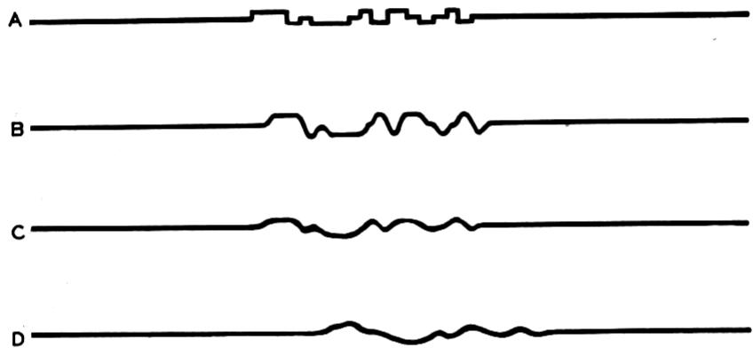
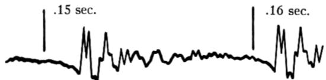
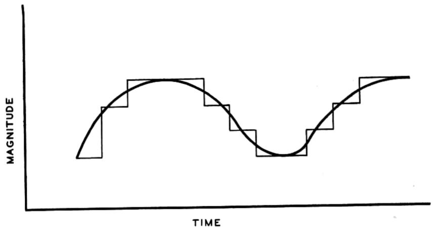
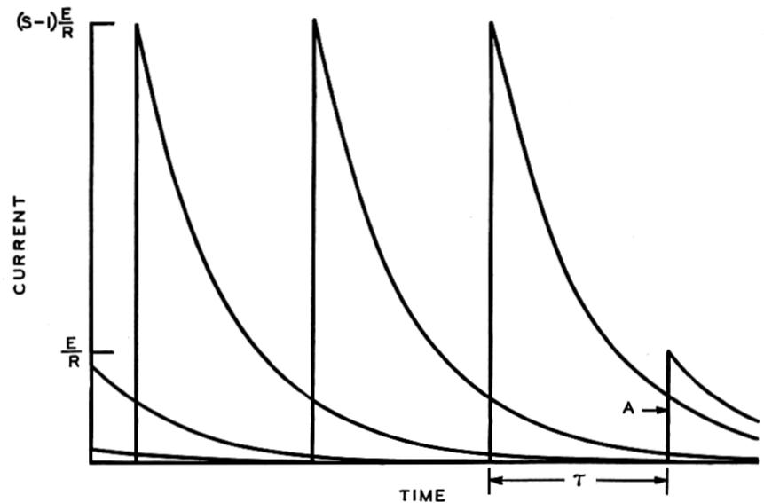
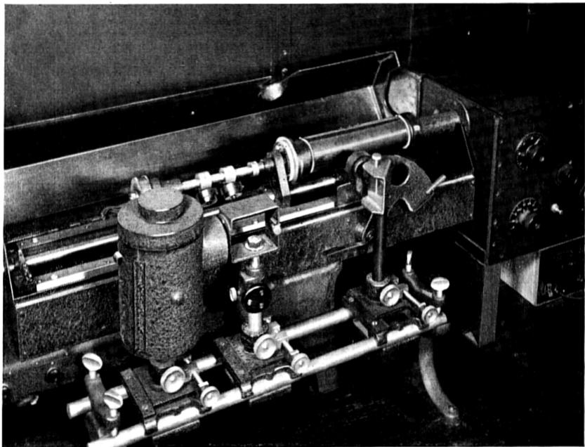
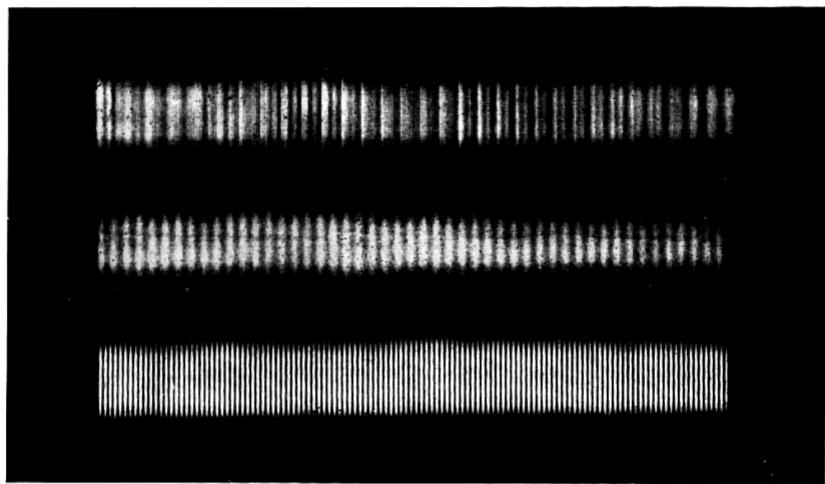

# Transmission of Information1

By R. V. L. HARTLEY

SYNOPSIS: A quantitative measure of "information" is developed which is based on physical as contrasted with psychological considerations. How the rate of transmission of this information over a system is limited by the distortion resulting from storage of energy is discussed from the transient viewpoint. The relation between the transient and steady state viewpoints is reviewed. It is shown that when the storage of energy is used to restrict the steady state transmission to a limited range of frequencies the amount of information that can be transmitted is proportional to the product of the width of the frequency-range by the time it is available. Several illustrations of the application of this principle to practical systems are included. In the case of picture transmission and television the spacial variation of intensity is analyzed by a steady state method analogous to that commonly used for variations with time.

WHILE the frequency relations involved in electrical communication are interesting in themselves, I should hardly be justified in discussing them on this occasion unless we could deduce from them something of fairly general practical application to the engineering of communication systems. What I hope to accomplish in this direction is to set up a quantitative measure whereby the capacities of various systems to transmit information may be compared. In doing this I shall discuss its application to systems of telegraphy, telephony, picture transmission and television over both wire and radio paths. It will, of course, be found that in very many cases it is not economically practical to make use of the full physical possibilities of a system. Such a criterion is, however, often useful for estimating the possible increase in performance which may be expected to result from improvements in apparatus or circuits, and also for detecting fallacies in the theory of operation of a proposed system.

Inasmuch as the results to be obtained are to represent the limits of what may be expected under rather idealized conditions, it will be permissible to simplify the discussion by neglecting certain factors which, while often important in practice, have the effect only of causing the performance to fall somewhat further short of the ideal. For example, external interference, which can never be entirely eliminated in practice, always reduces the effectiveness of the system. We may, however, arbitrarily assume it to be absent, and consider the limitations which still remain due to the transmission system itself.

In order to lay the groundwork for the more practical applications of these frequency relationships, it will first be necessary to discuss a few somewhat abstract considerations.

# THE MEASUREMENT OF INFORMATION

When we speak of the capacity of a system to transmit information we imply some sort of quantitative measure of information. As commonly used, information is a very elastic term, and it will first be necessary to set up for it a more specific meaning as applied to the present discussion. As a starting place for this let us consider what factors are involved in communication; whether conducted by wire, direct speech, writing, or any other method. In the first place, there must be a group of physical symbols, such as words, dots and dashes or the like, which by general agreement convey certain meanings to the parties communicating. In any given communication the sender mentally selects a particular symbol and by some bodily motion, as of his vocal mechanism, causes the attention of the receiver to be directed to that particular symbol. By successive selections a sequence of symbols is brought to the listener's attention. At each selection there are eliminated all of the other symbols which might have been chosen. As the selections proceed more and more possible symbol sequences are eliminated, and we say that the information becomes more precise. For example, in the sentence, "Apples are red," the first word eliminates other kinds of fruit and all other objects in general. The second directs attention to some property or condition of apples, and the third eliminates other possible colors. It does not, however, eliminate possibilities regarding the size of apples, and this further information may be conveyed by subsequent selections.

Inasmuch as the precision of the information depends upon what other symbol sequences might have been chosen it would seem reasonable to hope to find in the number of these sequences the desired quantitative measure of information. The number of symbols available at any one selection obviously varies widely with the type of symbols used, with the particular communicators and with the degree of previous understanding existing between them. For two persons who speak different languages the number of symbols available is negligible as compared with that for persons who speak the same language. It is desirable therefore to eliminate the psychological factors involved and to establish a measure of information in terms of purely physical quantities.

# Elimination of Psychological Factors

To illustrate how this may be done consider a hand-operated submarine telegraph cable system in which an oscillographic recorder traces the received message on a photosensitive tape. Suppose the

sending operator has at his disposal three positions of a sending key which correspond to applied voltages of the two polarities and to no applied voltage. In making a selection he decides to direct attention to one of the three voltage conditions or symbols by throwing the key to the position corresponding to that symbol. The disturbance transmitted over the cable is then the result of a series of conscious selections. However, a similar sequence of arbitrarily chosen symbols might have been sent by an automatic mechanism which controlled the position of the key in accordance with the results of a series of chance operations such as a ball rolling into one of three pockets.

Fig. 1

Owing to the distortion of the cable the results of the various selections as exhibited to the receiver by the recorder trace are not as clearly distinguishable as they were in the positions of the sending key. Fig. 1 shows at  $A$  the sequence of key positions, and at  $B$ ,  $C$  and  $D$  the traces made by the recorder when receiving over an artificial cable of progressively increasing length. For the shortest cable  $B$  the reconstruction of the original sequence is a simple matter. For the intermediate length  $C$ , however, more care is needed to distinguish just which key position a particular part of the record represents. In  $D$  the symbols have become hopelessly indistinguishable. The capacity of a system to transmit a particular sequence of symbols depends upon the possibility of distinguishing at the receiving end between the results of the various selections made at the sending end. The operation of recognizing from the received record the sequence of symbols selected at the sending end may be carried out by those of us who are not familiar with the Morse code. We would do this equally well for a sequence representing a consciously chosen message and for one sent out by the automatic selecting device already referred

to. A trained operator, however, would say that the sequence sent out by the automatic device was not intelligible. The reason for this is that only a limited number of the possible sequences have been assigned meanings common to him and the sending operator. Thus the number of symbols available to the sending operator at certain of his selections is here limited by psychological rather than physical considerations. Other operators using other codes might make other selections. Hence in estimating the capacity of the physical system to transmit information we should ignore the question of interpretation, make each selection perfectly arbitrary, and base our result on the possibility of the receiver's distinguishing the result of selecting any one symbol from that of selecting any other. By this means the psychological factors and their variations are eliminated and it becomes possible to set up a definite quantitative measure of information based on physical considerations alone.

# Quantitative Expression for Information

At each selection there are available three possible symbols. Two successive selections make possible  $3^2$ , or 9, different permutations or symbol sequences. Similarly  $n$  selections make possible  $3^n$  different sequences. Suppose that instead of this system, in which three current values are used, one is provided in which any arbitrary number  $s$  of different current values can be applied to the line and distinguished from each other at the receiving end. Then the number of symbols available at each selection is  $s$  and the number of distinguishable sequences is  $s^n$ .

Consider the case of a printing telegraph system of the Baudot type, in which the operator selects letters or other characters each of which when transmitted consists of a sequence of symbols (usually five in number). We may think of the various current values as primary symbols and the various sequences of these which represent characters as secondary symbols. The selection may then be made at the sending end among either primary or secondary symbols. Let the operator select a sequence of  $n_2$  characters each made up of a sequence of  $n_1$  primary selections. At each selection he will have available as many different secondary symbols as there are different sequences that can result from making  $n_1$  selections from among the  $s$  primary symbols. If we call this number of secondary symbols  $s_2$ , then

$$
s _ {2} = s ^ {n _ {1}}. \tag {1}
$$

For the Baudot System

$$
s _ {2} = 2 ^ {5} = 3 2 \text {c h a r a c t e r s}. \tag {2}
$$

The number of possible sequences of secondary symbols that can result from  $n_2$  secondary selections is

$$
s _ {2} ^ {n _ {2}} = s ^ {n _ {1} n _ {2}}. \tag {3}
$$

Now  $n_1n_2$  is the number  $n$  of selections of primary symbols that would have been necessary to produce the same sequence had there been no mechanism for grouping the primary symbols into secondary symbols. Thus we see that the total number of possible sequences is  $s^n$  regardless of whether or not the primary symbols are grouped for purposes of interpretation.

This number  $s^n$  is then the number of possible sequences which we set out to find in the hope that it could be used as a measure of the information involved. Let us see how well it meets the requirements of such a measure.

For a particular system and mode of operation  $s$  may be assumed to be fixed and the number of selections  $n$  increases as the communication proceeds. Hence with this measure the amount of information transmitted would increase exponentially with the number of selections and the contribution of a single selection to the total information transmitted would progressively increase. Doubtless some such increase does often occur in communication as viewed from the psychological standpoint. For example, the single word "yes" or "no," when coming at the end of a protracted discussion, may have an extraordinarily great significance. However, such cases are the exception rather than the rule. The constant changing of the subject of discussion, and even of the individuals involved, has the effect in practice of confining the cumulative action of this exponential relation to comparatively short periods.

Moreover we are setting up a measure which is to be independent of psychological factors. When we consider a physical transmission system we find no such exponential increase in the facilities necessary for transmitting the results of successive selections. The various primary symbols involved are just as distinguishable at the receiving end for one primary selection as for another. A telegraph system finds one ten-word message no more difficult to transmit than the one which preceded it. A telephone system which transmits speech successfully now will continue to do so as long as the system remains unchanged. In order then for a measure of information to be of practical engineering value it should be of such a nature that the information is proportional to the number of selections. The number of possible sequences is therefore not suitable for use directly as a measure of information.

We may, however, use it as the basis for a derived measure which does meet the practical requirements. To do this we arbitrarily put the amount of information proportional to the number of selections and so choose the factor of proportionality as to make equal amounts of information correspond to equal numbers of possible sequences. For a particular system let the amount of information associated with  $n$  selections be

$$
H = K n, \tag {4}
$$

where  $K$  is a constant which depends on the number  $s$  of symbols available at each selection. Take any two systems for which  $s$  has the values  $s_1$  and  $s_2$  and let the corresponding constants be  $K_1$  and  $K_2$ . We then define these constants by the condition that whenever the numbers of selections  $n_1$  and  $n_2$  for the two systems are such that the number of possible sequences is the same for both systems, then the amount of information is also the same for both; that is to say, when

$$
s _ {1} ^ {n _ {1}} = s _ {2} ^ {n _ {2}}, \tag {5}
$$

$$
H = K _ {1} n _ {1} = K _ {2} n _ {2}, \tag {6}
$$

from which

$$
\frac {K _ {1}}{\log s _ {1}} = \frac {K _ {2}}{\log s _ {2}}. \tag {7}
$$

This relation will hold for all values of  $s$  only if  $K$  is connected with  $s$  by the relation

$$
K = K _ {0} \log s, \tag {8}
$$

where  $K_{0}$  is the same for all systems. Since  $K_{0}$  is arbitrary, we may omit it if we make the logarithmic base arbitrary. The particular base selected fixes the size of the unit of information. Putting this value of  $K$  in (4),

$$
\begin{array}{l} H = n \log s (9) \\ = \log s ^ {n}. (10) \\ \end{array}
$$

What we have done then is to take as our practical measure of information the logarithm of the number of possible symbol sequences.

The situation is similar to that involved in measuring the transmission loss due to the insertion of a piece of apparatus in a telephone system. The effect of the insertion is to alter in a certain ratio the power delivered to the receiver. This ratio might be taken as a measure of the loss. It is found more convenient, however, to take the logarithm of the power ratio as a measure of the transmission loss.

If we put  $n$  equal to unity, we see that the information associated with a single selection is the logarithm of the number of symbols available; for example, in the Baudot System referred to above, the number  $s$  of primary symbols or current values is 2 and the information content of one selection is log 2; that of a character which involves 5 selections is 5 log 2. The same result is obtained if we regard a character as a secondary symbol and take the logarithm of the number of these symbols, that is, log  $2^5$ , or 5 log 2. The information associated with 100 characters will be 500 log 2. The numerical value of the information will depend upon the system of logarithms used. Increasing the number of current values from 2 to say 10, that is, in the ratio 5, would increase the information content of a given number of selections in the ratio  $\frac{\log 10}{\log 2}$ , or 3.3. Its effect on the rate of transmission will depend upon how the rate of making selections is affected. This will be discussed later.

When, as in the case just considered, the secondary symbols all involve the same number of primary selections, the relations are quite simple. When a telegraph system is used which employs a non-uniform code they are rather more complicated. A difficulty, more apparent than real, arises from the fact that a given number of secondary or character selections may necessitate widely different numbers of primary selections, depending on the particular characters chosen. This would seem to indicate that the values of information deduced from the primary and secondary symbols would be different. It may easily be shown, however, that this does not necessarily follow.

If the sender is at all times free to choose any secondary symbol, he may make all of his selections from among those containing the greatest number of primary symbols. The secondary symbols will then all be of equal length, and, just as for the uniform code, the number of primary symbols will be the product of the number of characters by the maximum number of primary selections per character. If the number of primary selections for a given number of characters is to be kept to some smaller value than this, some restriction must be placed on the freedom of selection of the secondary symbols. Such a restriction is imposed when, in computing the average number of dots per character for a non-uniform code, we take account of the average frequency of occurrence of the various characters in telegraph messages. If this allotted number of dots per character is not to be exceeded in sending a message, the operator must, on the average, refrain from selecting the longer characters more often than their average rate of occurrence. In the language

of the present discussion we would say that for certain of the  $n_2$  secondary selections the value of  $s_2$ , the number of secondary symbols, is so reduced that a summation of the information content over all the characters gives a value equal to that derived from the total number of primary selections involved. This may be written

$$
\sum_ {1} ^ {n _ {2}} \log s _ {2} = n \log s, \tag {11}
$$

where  $n$  is the total number of primary symbols or dot lengths assigned to  $n_2$  characters. This suggests that the primary symbols furnish the most convenient basis for evaluating information.

The discussion so far has dealt largely with telegraphy. When we attempt to extend this idea to other forms of communication certain generalizations need to be made. In speech, for example, we might assume the primary selections to represent the choice of successive words. On that basis  $s$  would represent the number of available words. For the first word of a conversation this would correspond to the number of words in the language. For subsequent selections the number would ordinarily be reduced because subsequent words would have to combine in intelligible fashion with those preceding. Such limitations, however, are limitations of interpretation only and the system would be just as capable of transmitting a communication in which all possible permutations of the words of the language were intelligible. Moreover, a telephone system may be just as capable of transmitting speech in one language as in another. Each word may be spoken in a variety of ways and sung in a still greater variety. This very large amount of information associated with the selection of a single spoken word suggests that the word may better be regarded as a secondary symbol, or sequence of primary symbols. Let us see where this point of view leads us.

Fig. 2

The actual physical embodiment of the word consists of an acoustic or electrical disturbance which may be expressed as a magnitude-time function as in Fig. 2, which shows an oscillographic record of a speech sound. Such functions are also typical of other modes of communication, as will be discussed in more detail later. We have then to examine the ability of such a continuous function to convey informa

tion. Obviously over any given time interval the magnitude may vary in accordance with an infinite number of such functions. This would mean an infinite number of possible secondary symbols, and hence an infinite amount of information. In practice, however, the information contained is finite for the reason that the sender is unable to control the form of the function with complete accuracy, and any distortion of its form tends to cause it to be confused with some other function.

Fig. 3

A continuous curve may be thought of as the limit approached by a curve made up of successive steps, as shown in Fig. 3, when the interval between the steps is made infinitesimal. An imperfectly defined curve may then be thought of as one in which the interval between the steps is finite. The steps then represent primary selections. The number of selections in a finite time is finite. Also the change made at each step is to be thought of as limited to one of a finite number of values. This means that the number of available symbols is kept finite. If this were not the case, the curve would be defined with complete exactness at each of the steps, which would mean that an observation made at any one step would offer the possibility of distinguishing among an infinite number of possible values. The following illustration may serve to bring out the relation between the discrete selections and the corresponding continuous curve. We may think of a bicycle equipped with a peculiar type of steering device which permits the rider to set the front wheel in only a limited number of fixed positions. On such a machine he attempts to ride in such a manner that the front wheel shall follow an irregularly

curved line. The accuracy with which he is able to accomplish this will depend upon how far he goes between adjustments of the steering mechanism and upon the number of positions in which he is able to set it.

By this more or less artificial device the continuous magnitude-time function as used in telephony is made subject to the same type of treatment as the succession of discrete selections involved in telegraphy.

# RATE OF COMMUNICATION

So far then we have derived an expression for the information content of the symbols at the sending end and have shown that we may evaluate a transmission system in terms of how well the wave as received over it permits distinguishing between the various possible symbols which are available for each selection. Let us consider next how the distortion of the system limits the rate of selection for which these distinctions between symbols may be made with certainty.

# Limitation by Intersymbol Interference

We shall assume the system to be free from external interference and to be such that its current-voltage relations are linear. In such a system the form of the transmitted wave may be altered due to the storage of energy in reactive elements such as inductances and capacities, and its subsequent release. To evaluate the effect of such distortion in making it impossible to determine correctly which one of the available symbols had been selected, we may think of this distortion in terms of "intersymbol interference." In order to determine the result of any one selection an observation is made at such time that the disturbance resulting from that selection has its maximum effect at the receiving end. Superposed on this effect there will be a disturbance which is the resultant of the effects of all the other symbols as prolonged by the storage of energy in the system. This resultant superposed disturbance is what is meant by intersymbol interference. Obviously if this disturbance is greater than half the difference between the effects produced by two of the values available for selection at the sending end, the wave resulting from one of those values will be taken as representing the other. Thus a criterion for successful transmission is that in no case shall the intersymbol interference exceed half the difference between the values of the wave at the receiving end which correspond to the selection of different values at the sending end.

Obviously the magnitude of the intersymbol interference which affects any one symbol depends on the particular sequence of symbols

which precedes it. However, it is always possible for the sending operator so to make his selections that any one selection is preceded by that sequence which causes the maximum possible interference. Hence every selection must be separated from those preceding it by at least a certain interval which is determined by the worst condition of interference. If longer intervals than this are used, the transmission is unnecessarily retarded. Hence to secure the maximum rate of transmission the selection should be made at a constant rate. It might appear at first sight that the selections could be made at shorter intervals near the beginning of the message where there are fewer preceding symbols to cause interference. This assumes, however, that the system has previously been idle. Actually the previous user may have finished his message with that sequence which causes maximum intersymbol interference.

# Relation to Damping Constant

How the intersymbol interference limits the rate of communication over the system depends upon the properties of the particular system. The relations involved are very complex, and no attempt will be made to obtain a complete or rigorous solution of the problem. We may, however, by treating a very simple case, arrive at an interesting relation. Consider a resistance in series with a capacity. Let one terminal be connected to one terminal of a battery made up of a very large number of cells of negligible internal resistance. Let the other terminal be connected to the battery through a switch. This switch is so arranged that by pressing any one of  $s$  keys the circuit terminal may be moved up along the battery by any number of cells from zero to  $s - 1$ . Let the sending operator make selections among the  $s$  keys at regular intervals, and let the receiving operator observe the current through the resistance. The most advantageous time for this observation is at the instant at which the key is pressed, since the current has then its maximum value. The finest distinction to be made by the receiving operator is that between two currents which result from battery changes that differ from each other by one cell. The difference between two such currents is equal to the initial current which flows when one cell is introduced into the circuit. This is

$$
i _ {s} = \frac {E}{R}, \tag {12}
$$

where  $E$  is the electromotive force of one cell and  $R$  the resistance of the circuit.

The intersymbol interference will consist of currents resulting from all of the preceding symbols. The contribution of any one symbol will depend on its size, that is, on the number of added cells it represents, and on how long it preceded the symbol in question. For a given rate of selection the resultant of these contributions will be a maximum for that particular sequence of symbols for which at every selection preceding the one in question the operator had selected the largest

Fig. 4

possible symbol, that is, a voltage change of  $(s - 1)E$ . The form of the received current is then as shown on Fig. 4, where  $A$  represents the disturbed symbol. The curves are drawn for  $s$  equal to five. The current resulting from one such change occurring at time zero is

$$
i = (s - 1) \frac {E}{R} e ^ {- \alpha t}, \tag {13}
$$

where the damping constant,

$$
\alpha = \frac {1}{R C} \cdot \tag {14}
$$

If the interval between selections is  $\tau$ , then the time during which any one interfering current is damped out before it makes its contribution to the interference with the disturbed symbol is  $q\tau$  where  $q$  is the number of selections by which it precedes the disturbed symbol. The magnitude of its contribution is therefore from (13)

$$
i _ {q} = (s - 1) \frac {E}{R} e ^ {- q \alpha \tau}. \tag {15}
$$

If we sum this expression for all values of  $q$  from one to infinity, we get the combined effect of all the preceding symbols, that is, the intersymbol interference. Calling this  $i_i$ ,

$$
\begin{array}{l} i _ {i} = (s - 1) \frac {E}{R} \sum_ {q = 1} ^ {q = \infty} e ^ {- q \alpha \tau} (16) \\ = (s - 1) \frac {E}{R} \frac {1}{e ^ {\alpha \tau} - 1} \cdot (17) \\ \end{array}
$$

This obviously increases as the interval  $\tau$  between selections is decreased. If this interval is made small enough, the intersymbol interference may cause confusion between symbols. Since the interference is here always of one sign it can cause confusion only when it becomes as large as the minimum difference,  $i_s$ , between symbols. Placing these two quantities equal, we get from (12) and (17) as the minimum permissible value of  $\tau$ ,

$$
\tau_ {1} = \frac {\log s}{\alpha}. \tag {18}
$$

The maximum number,  $n$ , of selections that may be made in  $t$  seconds is given by

$$
n = \frac {t}{\tau_ {1}}. \tag {19}
$$

From (18) and (19)

$$
\frac {n \log s}{t} = \alpha . \tag {20}
$$

Here the numerator is, in accordance with our measure of information, the amount of information contained in  $n$  selections, so the left-hand member is the information per unit time or the rate of communication. This is equal to the damping constant of the circuit. We therefore conclude that for this particular case the possible rate of communication is fixed solely by the damping constant of the circuit and is independent of the number of symbols available at each selection. It is, of course, true that the larger this number the more susceptible will the system be to the effects of external interference.

Probably the practical system which most nearly approaches this idealized one is the non-loaded submarine telegraph cable when operated at such low speeds that its inductance may be neglected. It is of considerable historical interest to note that Lord Kelvin's

study of such cables led him to the conclusion that the extent to which the cable limited the dotting speed was given by  $KR$ , that is, the product of the total capacity and total resistance. Had he stated his results in terms of permissible speed he would have had the reciprocal of this quantity, which corresponds very closely to the damping constant which we arrived at as a measure of the rate of communication. It should be noted, however, that his consideration was limited to a fixed number of symbols, and did not involve the relation here developed between this number and the dotting speed.

The more complicated systems are similar to the simple case just treated in that the contribution of any one symbol,  $a$ , to the interference with any other symbol,  $b$ , is determined by the free vibration of the system which results from the change applied to it in the production of symbol  $a$ . This free vibration, instead of being expressible by a single exponential function as in the case just considered, may be the resultant of a large number of more or less damped oscillatory components corresponding to the various natural modes of the system. The total interference with any one symbol is the resultant of a series of these complex vibrations, one for each interfering symbol. The instantaneous values of the various components of the interference are so dependent upon their phases at the particular instant of observation that it is difficult to draw any general conclusions as to the magnitude of the total interference. It is equally difficult therefore to draw any general conclusions as to the relation between the rate of transmission over a particular circuit and the number of available symbols.

# Relation to Storage of Energy

Even though for any one system there exists a number of available symbols for which the rate of communication is greater than for any other number, it is still possible to make a generalization with respect to the storage of energy in the system and its effect on the rate of transmission which is of considerable practical importance.

Each of the natural modes of vibration of a linear system has the general form

$$
i = A e ^ {- \alpha t} \cos (\omega t - \theta), \tag {21}
$$

where the natural frequency  $\omega$  and damping constant  $\alpha$  are characteristic of the system and the amplitude  $A$  and phase  $\theta$  depend on the conditions of excitation. Wherever the time appears in this expression it is multiplied by either the damping constant  $\alpha$  or the frequency  $\omega$ . Consequently if both  $\alpha$  and  $\omega$  be changed, say in the ratio  $k$ , the instantaneous value of this mode of vibration in the new system will

be the same at a time  $t / k$  that it was at time  $t$  in the original system. If the same change is made in the damping constant and frequency of each one of the modes of free vibration, their resultant, or the wave set up by any one symbol, will also be so changed that any particular value occurs at time  $t / k$  instead of  $t$ . Suppose also that the interval  $\tau$  between selections be changed to  $\tau / k$ . Then any two symbols originally separated by a time  $t_1$  will be separated by  $t_1 / k$ . The value of the interfering wave at the time  $t_1 / k$  when the disturbed symbol occurs will be the same as it was at the corresponding time  $t_1$  when it occurred in the original system. Hence the contribution of this wave to the intersymbol interference is unchanged. Since this relation holds for all of the interfering symbols, the total intersymbol interference remains unchanged, and so the number of possible symbols that may be distinguished is unaltered. The rate of making selections is changed in the ratio  $k$ , and hence the maximum rate of communication is changed in the same ratio as the damping constants and natural frequencies.

Now let us consider what physical changes must be made in the system to bring about the assumed changes in the damping constants and natural frequencies of the various modes. Take the simple case of an inductance, capacity and resistance connected in series. Here we have the well-known relations

$$
\alpha = \frac {R}{2 L}, \tag {22}
$$

$$
\omega = \sqrt {\frac {1}{L C} - \left(\frac {R}{2 L}\right) ^ {2}}. \tag {23}
$$

If  $R$  remains fixed and  $L$  is changed to  $L / k$ ,  $\alpha$  becomes  $k\alpha$ . If, in addition,  $C$  is changed to  $C / k$ ,  $\omega$  becomes  $k\omega$ . What we have done is to leave the energy-dissipating element,  $R$ , unchanged and change both the energy-storing elements,  $L$  and  $C$ , in the inverse ratio in which the rate of communication is changed. For more complicated systems the expressions for  $\alpha$  and  $\omega$  are correspondingly complicated. In every case, however, it will be found that if all of the dissipating and storing elements are treated as in the simple case just considered all of the damping constants and natural frequencies will be similarly altered. Where mechanical systems are concerned we are to substitute for electrical resistances their mechanical equivalents, and for inductances and capacities, inertias and compliances. This generalization that a proportionate change in all of the energy-storing elements of the system with no accompanying change in the dissipating elements

produces an inverse change in the possible rate of transmission will be used later.

# STeady State and Transient Viewpoints

So far very little has been said about frequencies, and in fact nothing in the sense of the term in which our results are to be stated. By this I mean the use of the word "frequency" as applied to an alternating current or other sinusoidal disturbance in the so-called "steady state." The steady state viewpoint has proven very useful in certain branches of communication, notably telephony. During the past few years much progress has been made in establishing relations between steady state phenomena and what might be called transient phenomena of the sort which we have just been discussing. Before proceeding with the main argument I shall attempt to review in non-mathematical language the relationship of these two points of view to each other.

As its name implies, steady state analysis deals with continuing conditions. If a sustained sinusoidal electromotive force be applied at the sending end of a system, a sinusoidal current of the same frequency flows at the receiving end. The vector ratio of the received current to the sending electromotive force is known as the transfer admittance of the system at that frequency. It is assumed ideally that the driving electromotive force has been acting from the beginning of time, and practically that it has been acting so long that the results are indistinguishable from what would be obtained in the ideal case. The absolute magnitude of the transfer admittance gives the amplitude of the received current which results from a driving electromotive force of unit amplitude, and its phase angle gives the phase of the current relative to that of the driving electromotive force. The curves which represent this amplitude and phase as functions of the frequency constitute a steady state description of the transmission properties of the system. For a system which is free from energy storage such as a circuit containing resistances only, the transfer admittance is the same for all frequencies. The amplitude-frequency curve is a horizontal line whose position depends on the magnitude and arrangement of the resistances while the phase-frequency curve coincides with the frequency axis. The storage of energy in the system and its subsequent release cause the admittance-frequency curves to take other forms. If the only storage is that which occurs in a dissipationless medium, a condition which is approximated when a sound wave traverses the open air, the only effect is to make the phase-frequency curve a straight line passing through the origin and having a slope proportional to the time of transmission through the

medium. Other forms of energy storage give to the admittance-frequency curves shapes which are characteristic of the particular system. This alteration of these curves is commonly spoken of as frequency distortion. Their form may in most cases be deduced fairly readily from the values of the energy-storing and energy-dissipating elements of the system. This fact makes such a description of the system particularly useful for design purposes.

This physical description is, of course, useful as a criterion of performance only in so far as it can be related to the satisfactoriness with which the system performs its primary function of transmitting information. In the case of telephony it has been found practical to establish such a correlation by purely empirical means. Until fairly recently adequate results have been obtained by considering the amplitude-frequency function only. With the use of lines of increasing length and with increasingly severe standards of performance it is coming to be necessary to take account of the phase-frequency function as well.

In attempting to extend this method of treatment to telegraphy it was not found desirable to establish the correlation between steady state properties and overall performance by purely empirical methods. One reason for this was that a considerable fund of information has been accumulated with reference to the correlation between the overall performance and the transient properties of the system. A correlation therefore between steady state and transient properties would offer a means of bringing this empirical information to bear on the design of apparatus and systems on a steady state basis. For bridging this gap between steady state and transient phenomena there was already available one arch in the form of the Fourier Integral. This integral may be thought of as a mathematical fiction for expressing a transient phenomenon in terms of steady state phenomena. It permits the determination, for any magnitude-time function, of the relative amplitudes and the phases of an infinite succession of sustained sinusoids whose resultant is at any instant equal to the magnitude of the function at that instant. The amplitudes of the sinusoids are infinitesimal and the frequencies of successive components differ from each other by infinitesimal increments. The relative amplitudes and the phases of these components expressed as functions of the frequency constitute a steady state description of the magnitude-time function.

Suppose then we have given the magnitude-time function representing an impressed transient driving force and wish to obtain the magnitude-time function of the received current. We deduce the steady state description of the driving force, modify the amplitudes

and phases of its various components in accordance with the known admittance-frequency functions of the system, and obtain the amplitude- and phase-frequency curves which represent the steady state description of the received current. From these we deduce the magnitude-time function representing the received wave.

A slightly different point of view, however, leads to results which fit in better with our method of measuring information. We may apply the method just outlined to deduce the magnitude-time function which results when the applied wave consists merely of an instantaneous change in a steadily applied electromotive force from one value which may be zero to another value differing from it by one unit. The resulting wave form is characteristic of the system and has been called by J. R. Carson its indicial admittance. We may think of this as a transient description of the system. If we regard a continuously varying applied wave as being formed by a succession of steps, we may think of the received wave at any instant as being the resultant of a series of waves each corresponding to a single step. The wave form of each is that of the indicial admittance, its magnitude is proportional to the size of the particular step and its location on the time axis is determined by the time at which the particular step or selection was made. When the steps are made infinitely close together, a summation of these components becomes a process of integration whereby the resulting magnitude-time function may be accurately determined from the applied function. For the incompletely determined waves involved in communication where the separation of the steps is finite a corresponding summation of the indicial admittance curves resulting from all selections other than the one being observed gives a measure of the intersymbol interference.

Still another viewpoint, while it has, perhaps, less direct application to the present problem, is of interest in that it brings out the significance from the transient standpoint of the steady state characteristics of the system. If we take as the applied wave a mathematical impulse, that is to say, a disturbance which lasts for an infinitesimal time, we find that the amplitudes of its steady state components are the same for all frequencies. If the impulse occurs at zero time the phase-frequency curve coincides with the axis of frequency, and if not it is a straight line through the origin whose slope is proportional to the time of occurrence. In order to find the current resulting from such an impulse applied at zero time we multiply the constant amplitude-frequency curve of its steady state components by the amplitude-frequency curve of the system and obtain as the amplitude-frequency curve of the received wave a function of the same form as the ampli

tude-frequency curve of the system. Similarly we add to the phase-frequency curve of the impressed wave, which is zero at all frequencies, the phase-frequency curve of the system and obtain for the received wave a phase-frequency curve identical with that of the system. The corresponding magnitude-time function gives the instantaneous value of the received current resulting from the impressed impulse. Thus we see that the steady state transfer admittance of a system is identical with the steady state description of the wave which is received over the system when it is subjected to an impulsive driving force. Once the form of this received wave is known the received wave resulting from any applied wave may be deduced by assuming the applied wave to consist of an infinite succession of impulses infinitesimally close together whose magnitudes vary with time in accordance with the given magnitude-time function. Methods for integrating the effect of this infinite succession of responses to impulses so as to obtain the transmitted wave have been developed.

From this review it is evident that the so-called frequency distortion and transient distortion are merely two methods of describing the same changes in wave form which result from the storage of energy in parts of the transmission system.

# SIGNIFICANCE OF PRODUCT OF FREQUENCY-RANGE BY TIME

Distortion of this sort with its accompanying intersymbol interference may be unavoidable in the design of the system, or it may be deliberately introduced. The use of electrical filters to obtain multi-

Fig. 5

plex operation, as in carrier systems, is an example of its deliberate use. Consider the effect of introducing a low pass filter, as shown in Fig. 5, into an otherwise distortionless transmission system. If the impedances of the circuits to which the filter is connected are approximately pure resistances of the values indicated in the figure, steady state frequencies above a critical value known as the cut-off frequency are so reduced as to be made practically negligible, while frequencies below this value are transmitted with very little distortion. The

transient distortion corresponding to this steady state distortion must result in intersymbol interference; hence it places a limit on the rate at which distinguishable symbols may be selected, that is, on the rate of transmitting information.

It does not necessarily follow, however, that the rate of transmission with such a system is the maximum attainable for systems whose transmission is limited to the frequency-range determined by the cut-off of the filter. It is conceivable that by the introduction of additional energy-storing elements the transfer admittance curves for frequencies within the transmitted range may be altered in such a way as to reduce the total intersymbol interference and so permit an increased rate of selection. The maximum rate of transmission of information which can be secured by such methods represents the maximum rate corresponding to that range of frequencies.

Let us consider next the way in which this possible rate of transmission varies with the cut-off frequency of the filter. The theory of filter design teaches us that the cut-off frequency may be changed without altering the required terminating resistances if we change all inductances and capacities in the inverse ratio of the desired change in cut-off frequency. Suppose this change in energy-storing elements, with no change in dissipative elements, is made not only for the filter but for the entire system. We have already seen that such a modification changes the rate of transmission in the inverse ratio of the change in energy-storing elements; that is, in the direct ratio of the change in cut-off frequency in the present case. That the new rate is the maximum for the new frequency-range is evident when we consider that the transfer admittance curves of the new system bear the same relation to its cut-off frequency as held in the original system.

This brings us to the important conclusion that the maximum rate at which information may be transmitted over a system whose transmission is limited to frequencies lying in a restricted range is proportional to the extent of this frequency-range. From this it follows that the total amount of information which may be transmitted over such a system is proportional to the product of the frequency-range which it transmits by the time during which it is available for the transmission. This product of transmitted frequency-range by time available is the quantitative criterion for comparing transmission systems to which I referred at the beginning of this discussion. The significance of this criterion can perhaps best be brought out by applying it to some typical situations.

# Fitting the Messages to the Lines

To facilitate this discussion it seems desirable to introduce and explain a few terms. For transmitting a sequence of symbols various sorts of media may be available, such as a wire line, an air path, as in direct speech, or the ether, as in radio communication. For convenience we shall group all of these under the general name of "line." Each such medium is generally characterized by a range of frequencies over which transmission may be carried on with reasonable freedom from distortion and external interference. This will be called the "line-frequency-range." Similarly the symbol sequences corresponding to the various modes of communication such as telegraph and telephone, will be designated as "messages." Each of these will, in general, be characterized by a "message frequency-range." This may be thought of as being determined by the frequency-range of that line which will just transmit the type of message satisfactorily, or we may think of it as that part of the frequency scale within which it is necessary to preserve the steady state components of the message wave in order to permit distinguishing the various symbols as they appear in the transmitted wave.

When we set up practical communication systems it is often found that the message-frequency-range and the line-frequency-range do not coincide either in magnitude or in position on the frequency scale. If then we are to make use of the full transmission capacity of the line, or lines, we must introduce means for altering the frequency-ranges required by the messages. Two such means are available, which together offer the theoretical possibility of accomplishing the desired end of making the message-frequency-ranges fit the available line-frequency-ranges.

The process of modulation so widely used in radio systems and in carrier transmission over wires makes it possible to shift the frequency-range of any message to a new location on the frequency scale without altering the width of the range. This follows at once from the well-known fact that the steady state description of the wave which results from the modulation of a carrier wave by a symbol wave includes a pair of side-bands in each of which there is a component corresponding to each steady state component of the original wave. The frequency of each component of the side-band differs from the carrier frequency by the frequency of the corresponding component of the symbol wave. The elimination of one of these side-bands results in a wave which retains the information embodied in the original symbol wave and occupies a frequency-range of the same width

as the original but displaced to a new position on the frequency scale determined by the carrier frequency. The interval which must be allowed between these displaced messages in carrier operation is determined by the selectivity of the filters which are available for their separation. The imperfection of practical filters tends to make the message-frequency-range which may be transmitted less than the line-frequency-range which the messages occupy. The time for which the line is used to transmit a given amount of information is the same as the duration of the message conveying it. Thus the sum of the products of frequency-range by time for the messages is always equal to or less than the corresponding sum of the products of line-frequency-range by time.

In case the line-range available is less than the message-range, as would be the case in attempting to transmit speech over a submarine telegraph cable, it is still possible, if enough lines are available, to accomplish the transmission. The message wave may, by suitable filters, be separated into a plurality of waves each made up of those components of the original which lie in a portion of the message-range which is no wider than the line-range. Each of these portions of the message may then, by modulation, be transferred down to the frequency-range of the line and each transmitted over a separate line. A reversal of the process at the receiving end restores the original message.

While it is theoretically possible, if enough messages and lines are available, to fit the message-ranges to the line-ranges by modulation and subdivision of message-frequency-ranges, it is not always practical. It is sometimes more desirable to utilize the second method of transformation already referred to. This consists in making a record of the symbol sequence and reproducing it at a different speed in order to secure the wave used in transmission. The tape used in sending telegraph messages may be used in this manner. Here the symbol sequence represents a series of selections of secondary symbols. These selections are made at a rate at which it is convenient for the operator to manipulate the keys of the tape-punching machine. The electric wave impressed on the line by the holes in the tape represents a corresponding sequence of primary symbols. The rate at which these are applied to the line is determined by the velocity of the tape in reproduction. Since for a given number of different primary symbols the frequency-range required is proportional to the rate of making selections, it is obvious that the frequency-range of the message as reproduced from the tape may be made to fit whatever line-frequency-range is available, at least so far as width of the range is concerned.

Modulation may, of course, be necessary to bring the message-range to the proper part of the frequency scale. The time required for the reproduction of a message involving a given number of selections varies inversely as the velocity of the tape in reproduction, and therefore also inversely as the frequency-range required by the reproduced sequence. Thus the product of frequency-range by time for the reproduced message, which is also the required product for the line, is independent of the rate of reproduction, and depends only on the information content of the message in its original form.

In case the available line range calls for reproduction at a considerably increased speed a single operator cannot conveniently keep the sending apparatus supplied with tape. Multiplex operation may then be employed in which the line is used by the various operators in rotation. It is interesting to note that this distributor type of multiplex utilizes the frequency-range of the line as efficiently as would a single printing telegraph channel using the same dotting speed, and more efficiently than does the carrier multiplex method. By the distributor method each operator utilizes the full frequency-range of the line during the time allotted to him and there is no time wasted in separating the channels from each other. In the carrier multiplex, on the other hand, while each operator uses the line for the full time it is available, a part of the frequency-range is wasted in separating the channels because of the departure of physical filters from the ideal. Also both side-bands are generally transmitted in telegraphy, in which case a still greater line-frequency-range is required for the carrier method.

If the message is produced originally as a continuous time function, as in speech, the same method may be used by substituting for the tape a phonographic record. That here also the required line-frequency-range varies directly as the speed of reproduction and inversely as the time of reproduction is obvious when we consider an imperfectly defined wave as equivalent to a succession of finite steps or a perfectly defined wave as a succession of infinitesimal steps. From the steady state viewpoint, all of the component frequencies are altered in the ratio of the reproducing and recording velocities, and hence the range which they occupy is altered in the same ratio.

Thus we see that for all forms of communication which are carried on by means of magnitude-time functions an upper limit to the amount of information which may be transmitted is set by the sum for the various available lines of the product of the line-frequency-range of each by the time during which it is available for use.

# Application to Picture Transmission

However, if in order to utilize fully the line-frequency-range we introduce the process of recording, our message no longer exists throughout its transmission as a magnitude-time function, but becomes a magnitude-space function. Also in the case of picture transmission the information to be transmitted exists originally as a magnitude-space function. We may, of course, regard either a phonograph record or a picture as a secondary symbol, and say that the information transmitted consists of the sender's selection of a particular record

Fig. 6

or picture to which he desires to call the attention of the receiver. The information involved in such a selection is then measured by the logarithm of the number of different records or pictures which he might have selected. The problem then is to analyze the magnitude-space function which constitutes the secondary symbol into a sequence of primary symbols. This may be done in a manner similar to that already employed for magnitude-time functions.

The case of a phonograph record is directly analogous to those already considered in that the magnitude is a function of the distance along a single line. This distance is therefore analogous to time and

the information content may be found exactly as it would be from the pressure-time curve of the air vibration. In a picture, on the other hand, two dimensions are involved. We may, however, reduce this to a single dimension by dividing the area into a succession of strips of uniform width, as is done by the scanning aperture which is used in the electrical transmission of pictures. Figure 6 shows this scanning mechanism. The picture is mounted on a revolving cylinder which at each revolution is advanced by a spiral screw by the width of the desired strip. This scanning operation is equivalent to making an arbitrary number of selections in a direction at right angles to the strips. The number of these determines the degree of resolution in that direction. If the resolution is to be the same in both directions, we may consider the magnitude-distance function along the strip to be made up of the same number of selections per unit length. The total number of primary selections will then be equal to the number of elementary squares into which the picture is thus divided. These elementary areas differ from each other in their average intensity. The number of different intensities which may be correctly distinguished from each other in each elementary area of the reproduced picture represents the number of primary symbols available at each selection. Hence the total information content of the picture is given by the number of elementary areas times the logarithm of the number of distinguishable intensities.

In an actual picture the intensity as a function of distance along what we may call the line of scanning is a definite continuous function of the distance, but if there is any blurring of the picture as reproduced this function loses some of its definiteness. This blurring may be thought of as a form of intersymbol interference, since the intensity at one point in the distorted picture depends upon the original intensity at neighboring points. The similarity of this type of distortion to the intersymbol interference occurring in magnitude-time functions as a result of energy storage suggests that the picture distortion may also be treated on a steady state basis. We may think of the magnitude-distance function representing the picture as being analyzed into sustained components in each of which the intensity is a sinusoidal function of the distance. We may visualize such a single component in terms of the mechanism employed for recording and reproducing speech by means of a motion picture film. The intensity of the light transmitted by the developed film varies along its length in accordance with the magnitude of the electric wave resulting from the speech sound. If the speech wave be replaced by a sustained alternating current, there will result on the film a sinusoidal variation

in intensity with distance. The distance between successive maxima, or the wave-length, will vary inversely with the frequency of the applied alternating current. Figure 7 shows such a record of a speech wave and of sinusoidal waves of two different frequencies. The variations are superposed on a uniform component so as to avoid the difficulty of negative light.

Fig. 7

The frequency of an alternating current is defined as the number of complete cycles which it executes in unit time. The analog of frequency in the corresponding alternating space wave is therefore the number of complete cycles or waves executed in unit distance. This is the reciprocal of the wavelength just as the frequency is the reciprocal of the period. Inasmuch as the term wave-number has been used by physicists to designate the reciprocal of wavelength, I shall use that term to designate the quantity corresponding to frequency in the steady state analysis of a magnitude-distance function. The distortion suffered by a picture in transmission may therefore be expressed in terms of the steady state amplitude and phase distortions as functions of wave number. Just as the transmission of a given amount of information requires a given product of frequency-range by time, so the preservation of a given amount of information in a picture requires a corresponding product of wave-number-range by distance. To illustrate, consider the effect of enlarging a picture without changing its detail or fineness of intensity discrimination. Suppose the enlargement to be made in two steps. In the first the

horizontal dimension is increased and the vertical dimension left unchanged. Let the scanning strips run in a horizontal direction. If we consider the magnitude-distance function representing the variation along any horizontal strip, the effect of the enlargement is to increase the wave-length of each steady state component in the ratio of the increase in linear dimension. The wave number of each component is therefore decreased in this ratio, and so the wavenumber-range is also decreased in the same ratio. The product of the wave-number-range by the length of the strip remains constant, as does also the sum of the products for all of the strips, that is, for the entire picture. The second step consists in increasing the vertical dimensions with the horizontal dimensions fixed. By considering the scanning strips as running vertically in this case it follows at once that the product of wave-number-range by distance remains constant during this operation also.

Since the information transmitted is measured by the product of frequency-range by time when it is in electrical form and by the product of wave-number-range by distance when it is in graphic form, we should expect that when a record such as a picture or phonographic record is converted into an electric current, or vice versa, the corresponding products for the two should be equal regardless of the velocity of reproduction. That this is true may be easily shown. Let  $v$  be the velocity with which the recorder or reproducer is moved relative to the record. Let the wave-number-range of the record extend between the limits  $w_{1}$  and  $w_{2}$ . If we consider any one component of the distance function which has a wave-length  $\lambda$ , the time required for the reproducer to traverse a complete cycle is  $\lambda / v$ , or  $1 / vw$ . This is the period of the resulting component of the time wave, so the frequency  $f$  of the latter is the reciprocal of this, or  $vw$ . The frequency-range is therefore given by

$$
f _ {2} - f _ {1} = v \left(w _ {2} - w _ {1}\right). \tag {24}
$$

If  $D$  is the length of the record, then the time required to reproduce it is

$$
T = \frac {D}{v}, \tag {25}
$$

from which

$$
\left(f _ {2} - f _ {1}\right) T = \left(w _ {2} - w _ {1}\right) D. \tag {26}
$$

This shows that the two products are numerically equal regardless of the velocity.

# Application to Television

As our first illustration was drawn from one of the earliest forms of electrical communication, the submarine cable, it may be fitting to use as the last what is probably the newest form, namely, television. Here the information to be transmitted exists originally in the form of a magnitude which is a continuous function of both space and time. In order to determine what line facilities are needed to maintain a constant view of the distant scene we wish to determine the line-frequency-range required. This we know to be measured by the total information to be transmitted per unit time.

In the systems of television which have been most successful the method has been similar to that of the motion picture in that a succession of separate representations of the scene is placed before the observer and the persistence of vision is relied upon to convert the intermittent illumination into an apparently continuous variation with time. The first step in determining the required frequency-range is to determine the information content of a single one of the successive views of the scene. This may be determined exactly as for a still picture. The required degree of resolution into elementary areas and the required accuracy of reproduction of the intensity within each area determine an effective number of selections and a number of primary symbols available at each selection. These determine a minimum product of wave-number-range by distance. This in turn is equal to the product of line-frequency-range by time which must be available for the transmission of a single view of the scene. The time available is set by the fact that flicker becomes objectionable if the interval between successive pictures exceeds about one sixteenth of a second. Thus we have only to divide the product of wavenumber-range by distance for a single picture by one sixteenth to obtain the line-frequency-range necessary to maintain a continuous view.

In the result just obtained an important factor is the interval necessary to prevent flicker. The tendency to flicker is, however, the result of the particular method of transmission. If it were practical to eliminate this factor, the required frequency-range might be somewhat different. We might, for example, imagine a system more like that of direct vision in which the magnitude-time function representing the intensity variation of each individual elementary area is transmitted over an independent line and used to produce a continuously varying illumination of the corresponding area of the reproduced scene. The frequency-range required on any one of these individual

lines would then be determined by the extent to which the intensity at any one instant could be permitted to be distorted by the intersymbol interference from the light intensities at neighboring times; that is to say, the frequency-range necessary would depend upon a blurring in time analogous to the blurring in space which is used to set the wave-number-range for a single picture. It seems probable that the total frequency-range required would be somewhat less for such a system than for one in which flicker is a factor.

# CONCLUSION

At the opening of this discussion I proposed to set up a quantitative measure for comparing the capacities of various systems to transmit information. This measure has been shown to be the product of the width of the frequency-range over which steady state alternating currents are transmitted with sensibly uniform efficiency and the time during which the system is available. While the most convenient method of operation does not always make the fullest use of the frequency-range of the line, as is the case in double side-band transmission, a comparison of the frequency-range actually used with that which would be required on the basis of the actual information content of the material transmitted gives an idea of what may be gained in the cost of lines by making sacrifices in the convenience or cost of terminal equipment. Finally the point of view developed is useful in that it provides a ready means of checking whether or not claims made for the transmission possibilities of a complicated system lie within the range of physical possibility. To do this we determine, for each message which the system is said to handle, the necessary product of frequency-range by time and add together these products for whatever messages are involved. Similarly for each line we take the product of its transmission frequency-range by the time it is used and add together these products. If this sum is less than the corresponding sum for the messages, we may say at once that the system is inoperative.